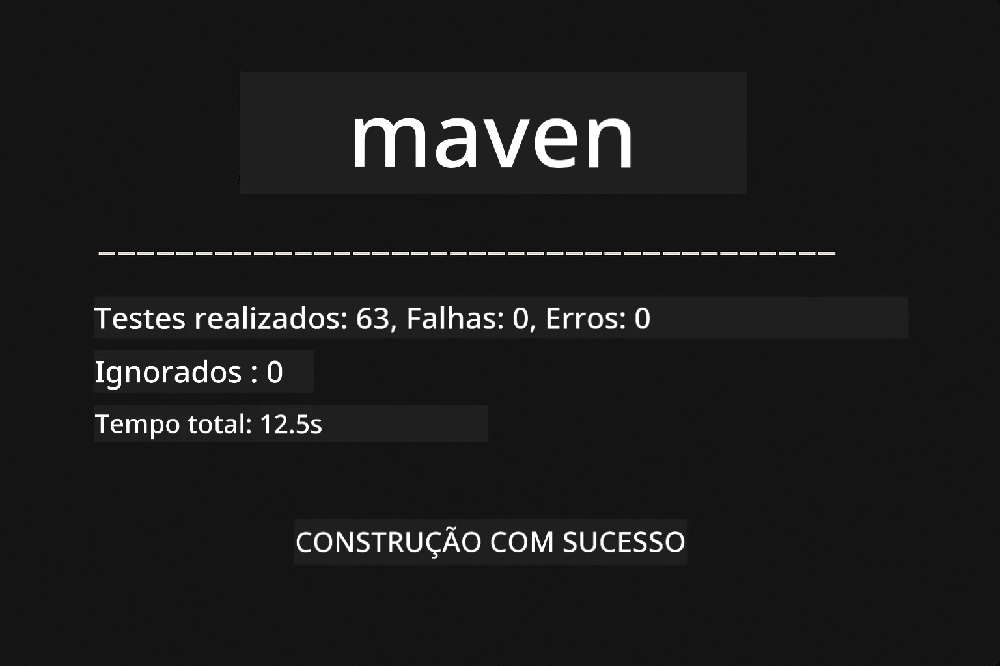
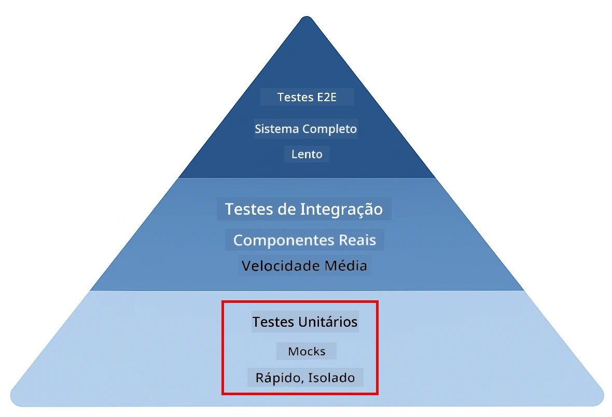
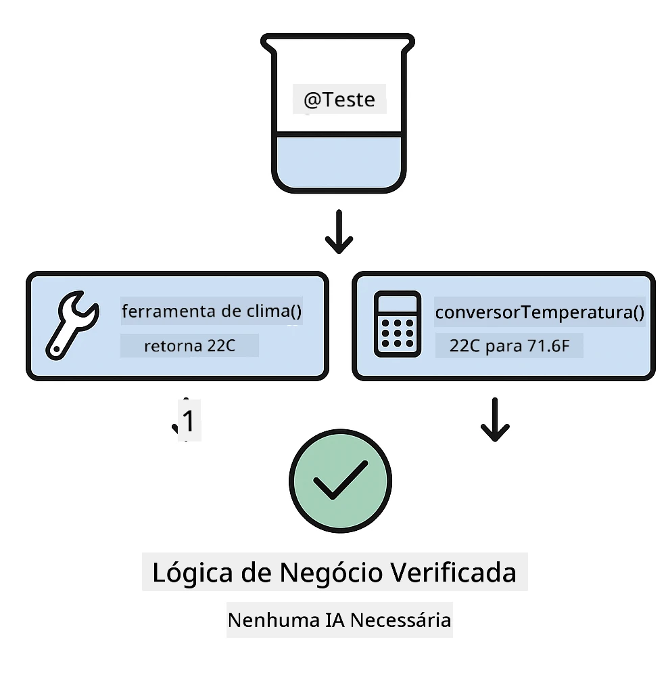

<!--
CO_OP_TRANSLATOR_METADATA:
{
  "original_hash": "ed93b3c14d58734ac10162967da958c1",
  "translation_date": "2025-12-30T23:47:13+00:00",
  "source_file": "docs/TESTING.md",
  "language_code": "pt"
}
-->
# Testar aplicações LangChain4j

## Índice

- [Início Rápido](../../../docs)
- [O que os testes abrangem](../../../docs)
- [Executar os testes](../../../docs)
- [Executar testes no VS Code](../../../docs)
- [Padrões de teste](../../../docs)
- [Filosofia de testes](../../../docs)
- [Próximos passos](../../../docs)

Este guia explica os testes que demonstram como testar aplicações de IA sem necessitar de chaves de API ou serviços externos.

## Início Rápido

Execute todos os testes com um único comando:

**Bash:**
```bash
mvn test
```

**PowerShell:**
```powershell
mvn --% test
```



*Execução dos testes bem-sucedida mostrando todos os testes aprovados sem falhas*

## O que os testes abrangem

Este curso foca-se em **testes unitários** que correm localmente. Cada teste demonstra um conceito específico do LangChain4j em isolamento.



*Pirâmide de testes mostrando o equilíbrio entre testes unitários (rápidos, isolados), testes de integração (componentes reais) e testes end-to-end. Este treinamento cobre testes unitários.*

| Módulo | Testes | Foco | Ficheiros-chave |
|--------|-------|-------|-----------|
| **00 - Início Rápido** | 6 | Modelos de prompt e substituição de variáveis | `SimpleQuickStartTest.java` |
| **01 - Introdução** | 8 | Memória de conversação e chat com estado | `SimpleConversationTest.java` |
| **02 - Engenharia de prompts** | 12 | Padrões do GPT-5, níveis de prontidão, saída estruturada | `SimpleGpt5PromptTest.java` |
| **03 - RAG** | 10 | Ingestão de documentos, embeddings, pesquisa por similaridade | `DocumentServiceTest.java` |
| **04 - Ferramentas** | 12 | Chamada de funções e encadeamento de ferramentas | `SimpleToolsTest.java` |
| **05 - MCP** | 8 | Model Context Protocol com transporte stdio | `SimpleMcpTest.java` |

## Executar os testes

**Executar todos os testes a partir da raiz:**

**Bash:**
```bash
mvn test
```

**PowerShell:**
```powershell
mvn --% test
```

**Executar testes de um módulo específico:**

**Bash:**
```bash
cd 01-introduction && mvn test
# Ou a partir da raiz
mvn test -pl 01-introduction
```

**PowerShell:**
```powershell
cd 01-introduction; mvn --% test
# Ou a partir da raiz
mvn --% test -pl 01-introduction
```

**Executar uma única classe de teste:**

**Bash:**
```bash
mvn test -Dtest=SimpleConversationTest
```

**PowerShell:**
```powershell
mvn --% test -Dtest=SimpleConversationTest
```

**Executar um método de teste específico:**

**Bash:**
```bash
mvn test -Dtest=SimpleConversationTest#deveManterHistóricoDaConversa
```

**PowerShell:**
```powershell
mvn --% test -Dtest=SimpleConversationTest#deveManterHistóricoDaConversa
```

## Executar testes no VS Code

Se estiver a utilizar o Visual Studio Code, o Test Explorer fornece uma interface gráfica para executar e depurar testes.


*O Test Explorer do VS Code a mostrar a árvore de testes com todas as classes de teste Java e métodos de teste individuais*

**Para executar testes no VS Code:**

1. Abra o Test Explorer clicando no ícone do frasco (beaker) na Barra de Atividades
2. Expanda a árvore de testes para ver todos os módulos e classes de teste
3. Clique no botão de reprodução junto a qualquer teste para o executar individualmente
4. Clique "Executar todos os testes" para executar toda a suíte
5. Clique com o botão direito em qualquer teste e selecione "Depurar teste" para definir pontos de interrupção e percorrer o código

O Test Explorer mostra marcas de verificação verdes para testes aprovados e fornece mensagens de falha detalhadas quando os testes falham.

## Padrões de teste

### Padrão 1: Testar modelos de prompt

O padrão mais simples testa modelos de prompt sem chamar nenhum modelo de IA. Verifica-se que a substituição de variáveis funciona corretamente e que os prompts são formatados conforme esperado.


*Teste de modelos de prompt mostrando o fluxo de substituição de variáveis: template com espaços reservados → valores aplicados → saída formatada verificada*

```java
@Test
@DisplayName("Should format prompt template with variables")
void testPromptTemplateFormatting() {
    PromptTemplate template = PromptTemplate.from(
        "Best time to visit {{destination}} for {{activity}}?"
    );
    
    Prompt prompt = template.apply(Map.of(
        "destination", "Paris",
        "activity", "sightseeing"
    ));
    
    assertThat(prompt.text()).isEqualTo("Best time to visit Paris for sightseeing?");
}
```

Este teste encontra-se em `00-quick-start/src/test/java/com/example/langchain4j/quickstart/SimpleQuickStartTest.java`.

**Execute-o:**

**Bash:**
```bash
cd 00-quick-start && mvn test -Dtest=SimpleQuickStartTest#testar a formatação do modelo de prompt
```

**PowerShell:**
```powershell
cd 00-quick-start; mvn --% test -Dtest=SimpleQuickStartTest#teste de formatação do modelo de prompt
```

### Padrão 2: Simulação de modelos de linguagem

Ao testar a lógica de conversação, utilize o Mockito para criar modelos falsos que retornam respostas pré-determinadas. Isto torna os testes rápidos, gratuitos e determinísticos.


*Comparação mostrando porque os mocks são preferidos para testes: são rápidos, gratuitos, determinísticos e não requerem chaves de API*

```java
@ExtendWith(MockitoExtension.class)
class SimpleConversationTest {
    
    private ConversationService conversationService;
    
    @Mock
    private OpenAiOfficialChatModel mockChatModel;
    
    @BeforeEach
    void setUp() {
        ChatResponse mockResponse = ChatResponse.builder()
            .aiMessage(AiMessage.from("This is a test response"))
            .build();
        when(mockChatModel.chat(anyList())).thenReturn(mockResponse);
        
        conversationService = new ConversationService(mockChatModel);
    }
    
    @Test
    void shouldMaintainConversationHistory() {
        String conversationId = conversationService.startConversation();
        
        ChatResponse mockResponse1 = ChatResponse.builder()
            .aiMessage(AiMessage.from("Response 1"))
            .build();
        ChatResponse mockResponse2 = ChatResponse.builder()
            .aiMessage(AiMessage.from("Response 2"))
            .build();
        ChatResponse mockResponse3 = ChatResponse.builder()
            .aiMessage(AiMessage.from("Response 3"))
            .build();
        
        when(mockChatModel.chat(anyList()))
            .thenReturn(mockResponse1)
            .thenReturn(mockResponse2)
            .thenReturn(mockResponse3);

        conversationService.chat(conversationId, "First message");
        conversationService.chat(conversationId, "Second message");
        conversationService.chat(conversationId, "Third message");

        List<ChatMessage> history = conversationService.getHistory(conversationId);
        assertThat(history).hasSize(6); // 3 mensagens de utilizador + 3 mensagens de IA
    }
}
```

Este padrão aparece em `01-introduction/src/test/java/com/example/langchain4j/service/SimpleConversationTest.java`. O mock garante comportamento consistente para que possa verificar se a gestão da memória funciona corretamente.

### Padrão 3: Testar isolamento de conversação

A memória de conversação deve manter os utilizadores separados. Este teste verifica que as conversas não misturam contextos.


*Teste de isolamento de conversação mostrando armazenamentos de memória separados para diferentes utilizadores para evitar a mistura de contextos*

```java
@Test
void shouldIsolateConversationsByid() {
    String conv1 = conversationService.startConversation();
    String conv2 = conversationService.startConversation();
    
    ChatResponse mockResponse = ChatResponse.builder()
        .aiMessage(AiMessage.from("Response"))
        .build();
    when(mockChatModel.chat(anyList())).thenReturn(mockResponse);

    conversationService.chat(conv1, "Message for conversation 1");
    conversationService.chat(conv2, "Message for conversation 2");

    List<ChatMessage> history1 = conversationService.getHistory(conv1);
    List<ChatMessage> history2 = conversationService.getHistory(conv2);
    
    assertThat(history1).hasSize(2);
    assertThat(history2).hasSize(2);
}
```

Cada conversação mantém o seu próprio histórico independente. Em sistemas de produção, este isolamento é crítico para aplicações multiutilizador.

### Padrão 4: Testar ferramentas de forma independente

As ferramentas são funções que a IA pode chamar. Teste-as diretamente para garantir que funcionam corretamente independentemente das decisões da IA.



*Teste de ferramentas de forma independente mostrando a execução simulada de ferramentas sem chamadas à IA para verificar a lógica de negócio*

```java
@Test
void shouldConvertCelsiusToFahrenheit() {
    TemperatureTool tempTool = new TemperatureTool();
    String result = tempTool.celsiusToFahrenheit(25.0);
    assertThat(result).containsPattern("77[.,]0°F");
}

@Test
void shouldDemonstrateToolChaining() {
    WeatherTool weatherTool = new WeatherTool();
    TemperatureTool tempTool = new TemperatureTool();

    String weatherResult = weatherTool.getCurrentWeather("Seattle");
    assertThat(weatherResult).containsPattern("\\d+°C");

    String conversionResult = tempTool.celsiusToFahrenheit(22.0);
    assertThat(conversionResult).containsPattern("71[.,]6°F");
}
```

Estes testes de `04-tools/src/test/java/com/example/langchain4j/agents/tools/SimpleToolsTest.java` validam a lógica das ferramentas sem envolvimento da IA. O exemplo de encadeamento mostra como a saída de uma ferramenta alimenta a entrada de outra.

### Padrão 5: Testar RAG em memória

Os sistemas RAG tradicionalmente requerem bases de dados vetoriais e serviços de embeddings. O padrão em memória permite testar todo o pipeline sem dependências externas.


*Fluxo de teste RAG em memória mostrando análise de documentos, armazenamento de embeddings e pesquisa por similaridade sem necessidade de uma base de dados*

```java
@Test
void testProcessTextDocument() {
    String content = "This is a test document.\nIt has multiple lines.";
    InputStream inputStream = new ByteArrayInputStream(content.getBytes(StandardCharsets.UTF_8));
    
    DocumentService.ProcessedDocument result = 
        documentService.processDocument(inputStream, "test.txt");

    assertNotNull(result);
    assertTrue(result.segments().size() > 0);
    assertEquals("test.txt", result.segments().get(0).metadata().getString("filename"));
}
```

Este teste de `03-rag/src/test/java/com/example/langchain4j/rag/service/DocumentServiceTest.java` cria um documento em memória e verifica o chunking e o tratamento de metadados.

### Padrão 6: Testes de integração MCP

O módulo MCP testa a integração do Model Context Protocol usando transporte stdio. Estes testes verificam que a sua aplicação pode iniciar e comunicar com servidores MCP como subprocessos.

Os testes em `05-mcp/src/test/java/com/example/langchain4j/mcp/SimpleMcpTest.java` validam o comportamento do cliente MCP.

**Execute-os:**

**Bash:**
```bash
cd 05-mcp && mvn test
```

**PowerShell:**
```powershell
cd 05-mcp; mvn --% test
```

## Filosofia de testes

Teste o seu código, não a IA. Os seus testes devem validar o código que escreve verificando como os prompts são construídos, como a memória é gerida e como as ferramentas são executadas. As respostas da IA variam e não devem fazer parte das asserções dos testes. Pergunte a si mesmo se o seu modelo de prompt substitui corretamente as variáveis, não se a IA dá a resposta certa.

Utilize mocks para modelos de linguagem. São dependências externas que são lentas, dispendiosas e não determinísticas. O uso de mocks torna os testes rápidos (milissegundos em vez de segundos), gratuitos (sem custos de API) e determinísticos (com o mesmo resultado sempre).

Mantenha os testes independentes. Cada teste deve configurar os seus próprios dados, não depender de outros testes e limpar-se a si próprio. Os testes devem passar independentemente da ordem de execução.

Teste casos limítrofes para além do caminho feliz. Experimente entradas vazias, entradas muito grandes, caracteres especiais, parâmetros inválidos e condições de fronteira. Estes frequentemente revelam bugs que o uso normal não expõe.

Use nomes descritivos. Compare `shouldMaintainConversationHistoryAcrossMultipleMessages()` com `test1()`. O primeiro diz exatamente o que está a ser testado, tornando a depuração de falhas muito mais fácil.

## Próximos passos

Agora que compreende os padrões de teste, aprofunde-se em cada módulo:

- **[00 - Início Rápido](../00-quick-start/README.md)** - Comece com o básico dos modelos de prompt
- **[01 - Introdução](../01-introduction/README.md)** - Aprenda a gerir memória de conversação
- **[02 - Engenharia de prompts](../02-prompt-engineering/README.md)** - Domine os padrões de prompting do GPT-5
- **[03 - RAG](../03-rag/README.md)** - Construa sistemas de geração aumentada por recuperação
- **[04 - Ferramentas](../04-tools/README.md)** - Implemente chamadas de funções e cadeias de ferramentas
- **[05 - MCP](../05-mcp/README.md)** - Integre o Model Context Protocol

O README de cada módulo fornece explicações detalhadas dos conceitos aqui testados.

---

**Navegação:** [← Voltar ao início](../README.md)

---

<!-- CO-OP TRANSLATOR DISCLAIMER START -->
Aviso legal:
Este documento foi traduzido utilizando o serviço de tradução por IA [Co-op Translator](https://github.com/Azure/co-op-translator). Embora nos esforcemos por assegurar a precisão, por favor note que traduções automáticas podem conter erros ou imprecisões. O documento original na sua língua nativa deve ser considerado a fonte autoritativa. Para informação crítica, recomenda-se uma tradução humana profissional. Não nos responsabilizamos por quaisquer mal-entendidos ou interpretações incorretas decorrentes da utilização desta tradução.
<!-- CO-OP TRANSLATOR DISCLAIMER END -->