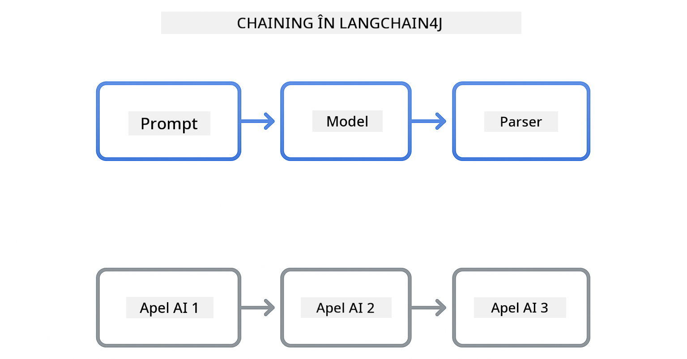
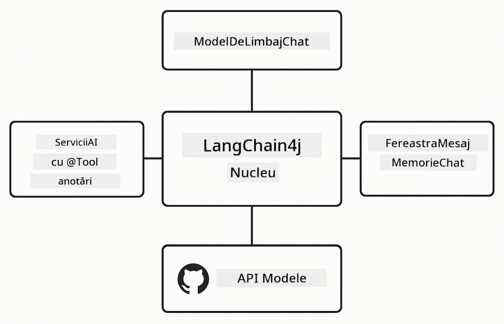

<!--
CO_OP_TRANSLATOR_METADATA:
{
  "original_hash": "377b3e3e6f8d02965bf0fbbc9ccb45c5",
  "translation_date": "2025-12-13T15:16:24+00:00",
  "source_file": "00-quick-start/README.md",
  "language_code": "ro"
}
-->
# Modulul 00: Pornire Rapidă

## Cuprins

- [Introducere](../../../00-quick-start)
- [Ce este LangChain4j?](../../../00-quick-start)
- [Dependențe LangChain4j](../../../00-quick-start)
- [Prerechizite](../../../00-quick-start)
- [Configurare](../../../00-quick-start)
  - [1. Obține Token-ul GitHub](../../../00-quick-start)
  - [2. Setează Token-ul](../../../00-quick-start)
- [Rulează Exemplele](../../../00-quick-start)
  - [1. Chat de bază](../../../00-quick-start)
  - [2. Modele de Prompt](../../../00-quick-start)
  - [3. Apelarea Funcțiilor](../../../00-quick-start)
  - [4. Întrebări și Răspunsuri pe Documente (RAG)](../../../00-quick-start)
- [Ce arată fiecare exemplu](../../../00-quick-start)
- [Pașii următori](../../../00-quick-start)
- [Depanare](../../../00-quick-start)

## Introducere

Acest ghid rapid este menit să te ajute să începi să folosești LangChain4j cât mai repede posibil. Acoperă elementele de bază absolute pentru construirea aplicațiilor AI cu LangChain4j și Modelele GitHub. În modulele următoare vei folosi Azure OpenAI cu LangChain4j pentru a construi aplicații mai avansate.

## Ce este LangChain4j?

LangChain4j este o bibliotecă Java care simplifică construirea aplicațiilor alimentate de AI. În loc să te ocupi de clienți HTTP și parsarea JSON, lucrezi cu API-uri Java curate.

„Lanțul” din LangChain se referă la conectarea în serie a mai multor componente - poți conecta un prompt la un model, apoi la un parser, sau poți conecta mai multe apeluri AI unde ieșirea unuia devine intrarea următorului. Acest ghid rapid se concentrează pe elementele fundamentale înainte de a explora lanțuri mai complexe.



*Conectarea componentelor în LangChain4j - blocuri de construcție care se leagă pentru a crea fluxuri de lucru AI puternice*

Vom folosi trei componente de bază:

**ChatLanguageModel** - Interfața pentru interacțiunile cu modelul AI. Apelezi `model.chat("prompt")` și primești un răspuns sub formă de șir. Folosim `OpenAiOfficialChatModel` care funcționează cu endpoint-uri compatibile OpenAI, cum ar fi Modelele GitHub.

**AiServices** - Creează interfețe de servicii AI tip-safe. Defini metode, le anotezi cu `@Tool`, iar LangChain4j se ocupă de orchestrare. AI-ul apelează automat metodele tale Java când este nevoie.

**MessageWindowChatMemory** - Menține istoricul conversației. Fără acesta, fiecare cerere este independentă. Cu el, AI-ul își amintește mesajele anterioare și păstrează contextul pe mai multe runde.



*Arhitectura LangChain4j - componentele de bază care lucrează împreună pentru a alimenta aplicațiile tale AI*

## Dependențe LangChain4j

Acest ghid rapid folosește două dependențe Maven în [`pom.xml`](../../../00-quick-start/pom.xml):

```xml
<!-- Core LangChain4j library -->
<dependency>
    <groupId>dev.langchain4j</groupId>
    <artifactId>langchain4j</artifactId> <!-- Inherited from BOM in root pom.xml -->
</dependency>

<!-- OpenAI integration (works with GitHub Models) -->
<dependency>
    <groupId>dev.langchain4j</groupId>
    <artifactId>langchain4j-open-ai-official</artifactId> <!-- Inherited from BOM in root pom.xml -->
</dependency>
```

Modulul `langchain4j-open-ai-official` oferă clasa `OpenAiOfficialChatModel` care se conectează la API-uri compatibile OpenAI. Modelele GitHub folosesc același format API, deci nu este nevoie de un adaptor special - doar setează URL-ul de bază la `https://models.github.ai/inference`.

## Prerechizite

**Folosești Dev Container?** Java și Maven sunt deja instalate. Ai nevoie doar de un Token de Acces Personal GitHub.

**Dezvoltare Locală:**
- Java 21+, Maven 3.9+
- Token de Acces Personal GitHub (instrucțiuni mai jos)

> **Notă:** Acest modul folosește `gpt-4.1-nano` de la Modelele GitHub. Nu modifica numele modelului în cod - este configurat să funcționeze cu modelele disponibile de la GitHub.

## Configurare

### 1. Obține Token-ul GitHub

1. Mergi la [Setări GitHub → Token-uri de Acces Personal](https://github.com/settings/personal-access-tokens)
2. Apasă pe „Generate new token”
3. Setează un nume descriptiv (ex: „LangChain4j Demo”)
4. Setează expirarea (7 zile recomandat)
5. La „Permisiuni cont”, găsește „Models” și setează pe „Read-only”
6. Apasă „Generate token”
7. Copiază și salvează token-ul - nu îl vei mai vedea din nou

### 2. Setează Token-ul

**Opțiunea 1: Folosind VS Code (Recomandat)**

Dacă folosești VS Code, adaugă token-ul în fișierul `.env` din rădăcina proiectului:

Dacă fișierul `.env` nu există, copiază `.env.example` în `.env` sau creează un fișier nou `.env` în rădăcina proiectului.

**Exemplu fișier `.env`:**
```bash
# În /workspaces/LangChain4j-for-Beginners/.env
GITHUB_TOKEN=your_token_here
```

Apoi poți face click dreapta pe orice fișier demo (ex: `BasicChatDemo.java`) în Explorer și selecta **„Run Java”** sau folosi configurațiile de lansare din panoul Run and Debug.

**Opțiunea 2: Folosind Terminalul**

Setează token-ul ca variabilă de mediu:

**Bash:**
```bash
export GITHUB_TOKEN=your_token_here
```

**PowerShell:**
```powershell
$env:GITHUB_TOKEN=your_token_here
```

## Rulează Exemplele

**Folosind VS Code:** Pur și simplu click dreapta pe orice fișier demo în Explorer și selectează **„Run Java”**, sau folosește configurațiile de lansare din panoul Run and Debug (asigură-te că ai adăugat token-ul în fișierul `.env` mai întâi).

**Folosind Maven:** Alternativ, poți rula din linia de comandă:

### 1. Chat de bază

**Bash:**
```bash
mvn compile exec:java -Dexec.mainClass=com.example.langchain4j.quickstart.BasicChatDemo
```

**PowerShell:**
```powershell
mvn --% compile exec:java -Dexec.mainClass=com.example.langchain4j.quickstart.BasicChatDemo
```

### 2. Modele de Prompt

**Bash:**
```bash
mvn compile exec:java -Dexec.mainClass=com.example.langchain4j.quickstart.PromptEngineeringDemo
```

**PowerShell:**
```powershell
mvn --% compile exec:java -Dexec.mainClass=com.example.langchain4j.quickstart.PromptEngineeringDemo
```

Arată prompturi zero-shot, few-shot, lanț de gândire și bazate pe roluri.

### 3. Apelarea Funcțiilor

**Bash:**
```bash
mvn compile exec:java -Dexec.mainClass=com.example.langchain4j.quickstart.ToolIntegrationDemo
```

**PowerShell:**
```powershell
mvn --% compile exec:java -Dexec.mainClass=com.example.langchain4j.quickstart.ToolIntegrationDemo
```

AI-ul apelează automat metodele tale Java când este nevoie.

### 4. Întrebări și Răspunsuri pe Documente (RAG)

**Bash:**
```bash
mvn compile exec:java -Dexec.mainClass=com.example.langchain4j.quickstart.SimpleReaderDemo
```

**PowerShell:**
```powershell
mvn --% compile exec:java -Dexec.mainClass=com.example.langchain4j.quickstart.SimpleReaderDemo
```

Pune întrebări despre conținutul din `document.txt`.

## Ce arată fiecare exemplu

**Chat de bază** - [BasicChatDemo.java](../../../00-quick-start/src/main/java/com/example/langchain4j/quickstart/BasicChatDemo.java)

Începe aici pentru a vedea LangChain4j în forma sa cea mai simplă. Vei crea un `OpenAiOfficialChatModel`, vei trimite un prompt cu `.chat()`, și vei primi un răspuns. Acest exemplu demonstrează fundația: cum să inițializezi modelele cu endpoint-uri și chei API personalizate. Odată ce înțelegi acest model, tot restul se construiește pe el.

```java
ChatLanguageModel model = OpenAiOfficialChatModel.builder()
    .baseUrl("https://models.github.ai/inference")
    .apiKey(System.getenv("GITHUB_TOKEN"))
    .modelName("gpt-4.1-nano")
    .build();

String response = model.chat("What is LangChain4j?");
System.out.println(response);
```

> **🤖 Încearcă cu [GitHub Copilot](https://github.com/features/copilot) Chat:** Deschide [`BasicChatDemo.java`](../../../00-quick-start/src/main/java/com/example/langchain4j/quickstart/BasicChatDemo.java) și întreabă:
> - „Cum aș schimba de la Modelele GitHub la Azure OpenAI în acest cod?”
> - „Ce alți parametri pot configura în OpenAiOfficialChatModel.builder()?”
> - „Cum adaug răspunsuri în streaming în loc să aștept răspunsul complet?”

**Ingineria Prompturilor** - [PromptEngineeringDemo.java](../../../00-quick-start/src/main/java/com/example/langchain4j/quickstart/PromptEngineeringDemo.java)

Acum că știi cum să vorbești cu un model, să explorăm ce îi spui. Acest demo folosește aceeași configurare a modelului, dar arată patru modele diferite de prompturi. Încearcă prompturi zero-shot pentru instrucțiuni directe, few-shot care învață din exemple, lanț de gândire care dezvăluie pașii raționamentului, și prompturi bazate pe roluri care setează contextul. Vei vedea cum același model oferă rezultate dramatic diferite în funcție de cum formulezi cererea.

```java
PromptTemplate template = PromptTemplate.from(
    "What's the best time to visit {{destination}} for {{activity}}?"
);

Prompt prompt = template.apply(Map.of(
    "destination", "Paris",
    "activity", "sightseeing"
));

String response = model.chat(prompt.text());
```

> **🤖 Încearcă cu [GitHub Copilot](https://github.com/features/copilot) Chat:** Deschide [`PromptEngineeringDemo.java`](../../../00-quick-start/src/main/java/com/example/langchain4j/quickstart/PromptEngineeringDemo.java) și întreabă:
> - „Care este diferența între zero-shot și few-shot prompting și când ar trebui să folosesc fiecare?”
> - „Cum afectează parametrul temperature răspunsurile modelului?”
> - „Care sunt câteva tehnici pentru a preveni atacurile de tip prompt injection în producție?”
> - „Cum pot crea obiecte PromptTemplate reutilizabile pentru modele comune?”

**Integrarea Uneltelor** - [ToolIntegrationDemo.java](../../../00-quick-start/src/main/java/com/example/langchain4j/quickstart/ToolIntegrationDemo.java)

Aici LangChain4j devine puternic. Vei folosi `AiServices` pentru a crea un asistent AI care poate apela metodele tale Java. Doar anotează metodele cu `@Tool("descriere")` și LangChain4j se ocupă de restul - AI-ul decide automat când să folosească fiecare unealtă în funcție de ce cere utilizatorul. Acest exemplu demonstrează apelarea funcțiilor, o tehnică cheie pentru a construi AI care poate lua acțiuni, nu doar răspunde la întrebări.

```java
@Tool("Performs addition of two numeric values")
public double add(double a, double b) {
    return a + b;
}

MathAssistant assistant = AiServices.create(MathAssistant.class, model);
String response = assistant.chat("What is 25 plus 17?");
```

> **🤖 Încearcă cu [GitHub Copilot](https://github.com/features/copilot) Chat:** Deschide [`ToolIntegrationDemo.java`](../../../00-quick-start/src/main/java/com/example/langchain4j/quickstart/ToolIntegrationDemo.java) și întreabă:
> - „Cum funcționează adnotarea @Tool și ce face LangChain4j cu ea în spate?”
> - „Poate AI-ul să apeleze mai multe unelte în secvență pentru a rezolva probleme complexe?”
> - „Ce se întâmplă dacă o unealtă aruncă o excepție - cum ar trebui să gestionez erorile?”
> - „Cum aș integra un API real în locul acestui exemplu cu calculatorul?”

**Întrebări și Răspunsuri pe Documente (RAG)** - [SimpleReaderDemo.java](../../../00-quick-start/src/main/java/com/example/langchain4j/quickstart/SimpleReaderDemo.java)

Aici vei vedea fundația RAG (generare augmentată prin recuperare). În loc să te bazezi pe datele de antrenament ale modelului, încarci conținut din [`document.txt`](../../../00-quick-start/document.txt) și îl incluzi în prompt. AI-ul răspunde pe baza documentului tău, nu pe baza cunoștințelor generale. Acesta este primul pas spre construirea sistemelor care pot lucra cu propriile tale date.

```java
Document document = FileSystemDocumentLoader.loadDocument("document.txt");
String content = document.text();

String prompt = "Based on this document: " + content + 
                "\nQuestion: What is the main topic?";
String response = model.chat(prompt);
```

> **Notă:** Această abordare simplă încarcă întreg documentul în prompt. Pentru fișiere mari (>10KB), vei depăși limitele de context. Modulul 03 acoperă fragmentarea și căutarea vectorială pentru sisteme RAG de producție.

> **🤖 Încearcă cu [GitHub Copilot](https://github.com/features/copilot) Chat:** Deschide [`SimpleReaderDemo.java`](../../../00-quick-start/src/main/java/com/example/langchain4j/quickstart/SimpleReaderDemo.java) și întreabă:
> - „Cum previne RAG halucinațiile AI comparativ cu folosirea datelor de antrenament ale modelului?”
> - „Care este diferența între această abordare simplă și folosirea embedding-urilor vectoriale pentru recuperare?”
> - „Cum aș scala asta pentru a gestiona mai multe documente sau baze de cunoștințe mai mari?”
> - „Care sunt cele mai bune practici pentru structurarea promptului astfel încât AI-ul să folosească doar contextul furnizat?”

## Depanare

Exemplele includ `.logRequests(true)` și `.logResponses(true)` pentru a afișa apelurile API în consolă. Acest lucru ajută la depanarea erorilor de autentificare, limitelor de rată sau răspunsurilor neașteptate. Elimină aceste flag-uri în producție pentru a reduce zgomotul din loguri.

## Pașii următori

**Următorul Modul:** [01-introducere - Început cu LangChain4j și gpt-5 pe Azure](../01-introduction/README.md)

---

**Navigare:** [← Înapoi la Principal](../README.md) | [Următorul: Modulul 01 - Introducere →](../01-introduction/README.md)

---

## Depanare

### Prima Construire Maven

**Problemă**: `mvn clean compile` sau `mvn package` inițial durează mult (10-15 minute)

**Cauză**: Maven trebuie să descarce toate dependențele proiectului (Spring Boot, biblioteci LangChain4j, SDK-uri Azure etc.) la prima construire.

**Soluție**: Este un comportament normal. Construirile următoare vor fi mult mai rapide deoarece dependențele sunt cache-uite local. Timpul de descărcare depinde de viteza rețelei tale.

### Sintaxa Comenzii Maven în PowerShell

**Problemă**: Comenzile Maven eșuează cu eroarea `Unknown lifecycle phase ".mainClass=..."`

**Cauză**: PowerShell interpretează `=` ca operator de atribuire variabilă, stricând sintaxa proprietăților Maven

**Soluție**: Folosește operatorul de oprire a parsării `--%` înaintea comenzii Maven:

**PowerShell:**
```powershell
mvn --% compile exec:java -Dexec.mainClass=com.example.langchain4j.quickstart.BasicChatDemo
```

**Bash:**
```bash
mvn compile exec:java -Dexec.mainClass=com.example.langchain4j.quickstart.BasicChatDemo
```

Operatorul `--%` spune PowerShell să transmită toate argumentele rămase literal către Maven fără interpretare.

### Afișarea Emoji în Windows PowerShell

**Problemă**: Răspunsurile AI afișează caractere ciudate (ex: `????` sau `â??`) în loc de emoji în PowerShell

**Cauză**: Codarea implicită a PowerShell nu suportă emoji UTF-8

**Soluție**: Rulează această comandă înainte de a executa aplicațiile Java:
```cmd
chcp 65001
```

Aceasta forțează codarea UTF-8 în terminal. Alternativ, folosește Windows Terminal care are suport Unicode mai bun.

---

<!-- CO-OP TRANSLATOR DISCLAIMER START -->
**Declinare de responsabilitate**:  
Acest document a fost tradus folosind serviciul de traducere AI [Co-op Translator](https://github.com/Azure/co-op-translator). Deși ne străduim pentru acuratețe, vă rugăm să rețineți că traducerile automate pot conține erori sau inexactități. Documentul original în limba sa nativă trebuie considerat sursa autorizată. Pentru informații critice, se recomandă traducerea profesională realizată de un specialist uman. Nu ne asumăm răspunderea pentru eventualele neînțelegeri sau interpretări greșite rezultate din utilizarea acestei traduceri.
<!-- CO-OP TRANSLATOR DISCLAIMER END -->