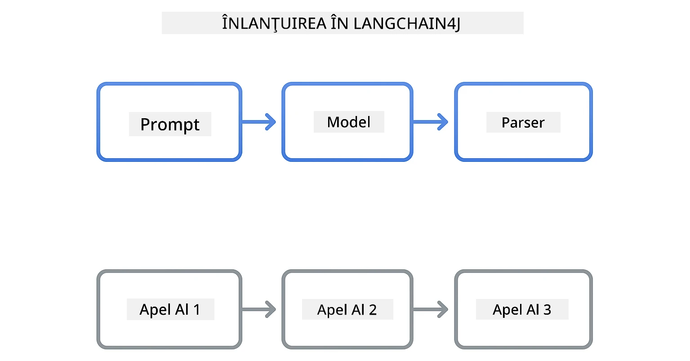

# Modulul 00: Pornire rapidă

## Cuprins

- [Introducere](../../../00-quick-start)
- [Ce este LangChain4j?](../../../00-quick-start)
- [Dependențe LangChain4j](../../../00-quick-start)
- [Cerințe preliminare](../../../00-quick-start)
- [Configurare](../../../00-quick-start)
  - [1. Obține-ți tokenul GitHub](../../../00-quick-start)
  - [2. Setează-ți tokenul](../../../00-quick-start)
- [Rulează exemplele](../../../00-quick-start)
  - [1. Chat de bază](../../../00-quick-start)
  - [2. Modele de prompturi](../../../00-quick-start)
  - [3. Apelarea funcțiilor](../../../00-quick-start)
  - [4. Întrebări și răspunsuri pe documente (RAG)](../../../00-quick-start)
  - [5. Inteligență artificială responsabilă](../../../00-quick-start)
- [Ce arată fiecare exemplu](../../../00-quick-start)
- [Pașii următori](../../../00-quick-start)
- [Depanare](../../../00-quick-start)

## Introducere

Acest ghid rapid este menit să te ajute să începi să folosești LangChain4j cât mai repede posibil. Acoperă elementele de bază absolute ale construirii aplicațiilor AI cu LangChain4j și modele GitHub. În următoarele module vei folosi Azure OpenAI cu LangChain4j pentru a construi aplicații mai avansate.

## Ce este LangChain4j?

LangChain4j este o bibliotecă Java care simplifică construirea aplicațiilor alimentate de AI. În loc să lucrezi direct cu clienți HTTP și parsări JSON, folosești API-uri Java curate.

„Lanțul” din LangChain se referă la conectarea în serie a mai multor componente – poți conecta un prompt la un model, apoi la un parser sau poți lega mai multe apeluri AI în care ieșirea unuia devine inputul următorului. Acest ghid se concentrează pe elementele fundamentale înainte de a explora lanțuri mai complexe.



*Conectarea componentelor în LangChain4j – blocuri de construcție care se leagă pentru a crea fluxuri de lucru AI puternice*

Vom folosi trei componente principale:

**ChatLanguageModel** – Interfața pentru interacțiunile cu modelul AI. Apelezi `model.chat("prompt")` și primești un șir de răspuns. Folosim `OpenAiOfficialChatModel`, care funcționează cu endpoint-uri compatibile OpenAI, precum Modelele GitHub.

**AiServices** – Creează interfețe de servicii AI cu tipuri sigure. Defini metode, le anotezi cu `@Tool` iar LangChain4j se ocupă de orchestrare. AI-ul apelează automat metodele Java când este necesar.

**MessageWindowChatMemory** – Menține istoricul conversației. Fără aceasta, fiecare cerere este independentă. Cu ea, AI-ul își amintește mesajele anterioare și păstrează contextul pe mai multe schimburi.


*Arhitectura LangChain4j – componentele principale lucrează împreună pentru a alimenta aplicațiile tale AI*

## Dependențe LangChain4j

Acest ghid rapid folosește două dependențe Maven în [`pom.xml`](../../../00-quick-start/pom.xml):

```xml
<!-- Core LangChain4j library -->
<dependency>
    <groupId>dev.langchain4j</groupId>
    <artifactId>langchain4j</artifactId> <!-- Inherited from BOM in root pom.xml -->
</dependency>

<!-- OpenAI integration (works with GitHub Models) -->
<dependency>
    <groupId>dev.langchain4j</groupId>
    <artifactId>langchain4j-open-ai-official</artifactId> <!-- Inherited from BOM in root pom.xml -->
</dependency>
```

Modulul `langchain4j-open-ai-official` oferă clasa `OpenAiOfficialChatModel` care se conectează la API-uri compatibile OpenAI. Modelele GitHub folosesc același format API, deci nu este nevoie de un adaptor special – doar indică URL-ul de bază către `https://models.github.ai/inference`.

## Cerințe preliminare

**Folosești containerul Dev?** Java și Maven sunt deja instalate. Ai nevoie doar de un token GitHub Personal Access.

**Dezvoltare locală:**
- Java 21+, Maven 3.9+
- Token GitHub Personal Access (instrucțiuni mai jos)

> **Notă:** Acest modul folosește `gpt-4.1-nano` de la Modelele GitHub. Nu modifica numele modelului în cod – este configurat să funcționeze cu modelele disponibile de la GitHub.

## Configurare

### 1. Obține-ți tokenul GitHub

1. Accesează [GitHub Settings → Personal Access Tokens](https://github.com/settings/personal-access-tokens)
2. Click pe „Generate new token”
3. Setează un nume descriptiv (ex: „LangChain4j Demo”)
4. Setează expirarea (7 zile recomandat)
5. La „Account permissions”, găsește „Models” și setează „Read-only”
6. Click pe „Generate token”
7. Copiază și salvează tokenul – nu îl vei mai vedea din nou

### 2. Setează-ți tokenul

**Opțiunea 1: Folosind VS Code (recomandat)**

Dacă folosești VS Code, adaugă tokenul în fișierul `.env` din rădăcina proiectului:

Dacă fișierul `.env` nu există, copiază `.env.example` în `.env` sau creează un fișier nou `.env` în rădăcina proiectului.

**Exemplu fișier `.env`:**
```bash
# În /workspaces/LangChain4j-for-Beginners/.env
GITHUB_TOKEN=your_token_here
```

Apoi poți face clic dreapta pe orice fișier demo (ex: `BasicChatDemo.java`) în Explorer și selecta **„Run Java”** sau folosi configurațiile de lansare din panoul Run and Debug.

**Opțiunea 2: Folosind Terminalul**

Setează tokenul ca variabilă de mediu:

**Bash:**
```bash
export GITHUB_TOKEN=your_token_here
```

**PowerShell:**
```powershell
$env:GITHUB_TOKEN=your_token_here
```

## Rulează exemplele

**Folosind VS Code:** Pur și simplu fă clic dreapta pe orice fișier demo în Explorer și selectează **„Run Java”**, sau folosește configurațiile de lansare din panoul Run and Debug (asigură-te că ți-ai adăugat tokenul în fișierul `.env` înainte).

**Folosind Maven:** Alternativ, poți rula din linia de comandă:

### 1. Chat de bază

**Bash:**
```bash
mvn compile exec:java -Dexec.mainClass=com.example.langchain4j.quickstart.BasicChatDemo
```

**PowerShell:**
```powershell
mvn --% compile exec:java -Dexec.mainClass=com.example.langchain4j.quickstart.BasicChatDemo
```

### 2. Modele de prompturi

**Bash:**
```bash
mvn compile exec:java -Dexec.mainClass=com.example.langchain4j.quickstart.PromptEngineeringDemo
```

**PowerShell:**
```powershell
mvn --% compile exec:java -Dexec.mainClass=com.example.langchain4j.quickstart.PromptEngineeringDemo
```

Arată prompturi zero-shot, few-shot, chain-of-thought și bazate pe roluri.

### 3. Apelarea funcțiilor

**Bash:**
```bash
mvn compile exec:java -Dexec.mainClass=com.example.langchain4j.quickstart.ToolIntegrationDemo
```

**PowerShell:**
```powershell
mvn --% compile exec:java -Dexec.mainClass=com.example.langchain4j.quickstart.ToolIntegrationDemo
```

AI-ul apelează automat metodele tale Java când este necesar.

### 4. Întrebări și răspunsuri pe documente (RAG)

**Bash:**
```bash
mvn compile exec:java -Dexec.mainClass=com.example.langchain4j.quickstart.SimpleReaderDemo
```

**PowerShell:**
```powershell
mvn --% compile exec:java -Dexec.mainClass=com.example.langchain4j.quickstart.SimpleReaderDemo
```

Pune întrebări despre conținutul din `document.txt`.

### 5. Inteligență artificială responsabilă

**Bash:**
```bash
mvn compile exec:java -Dexec.mainClass=com.example.langchain4j.quickstart.ResponsibleAIDemo
```

**PowerShell:**
```powershell
mvn --% compile exec:java -Dexec.mainClass=com.example.langchain4j.quickstart.ResponsibleAIDemo
```

Vezi cum filtrele de siguranță AI blochează conținutul dăunător.

## Ce arată fiecare exemplu

**Chat de bază** - [BasicChatDemo.java](../../../00-quick-start/src/main/java/com/example/langchain4j/quickstart/BasicChatDemo.java)

Începe aici pentru a vedea LangChain4j în forma sa cea mai simplă. Vei crea un `OpenAiOfficialChatModel`, vei trimite un prompt cu `.chat()` și vei primi un răspuns. Aceasta demonstrează baza: cum să inițializezi modelele cu endpoint-uri și chei API personalizate. Odată ce știi acest tipar, restul se construiește pe el.

```java
ChatLanguageModel model = OpenAiOfficialChatModel.builder()
    .baseUrl("https://models.github.ai/inference")
    .apiKey(System.getenv("GITHUB_TOKEN"))
    .modelName("gpt-4.1-nano")
    .build();

String response = model.chat("What is LangChain4j?");
System.out.println(response);
```

> **🤖 Încearcă cu [GitHub Copilot](https://github.com/features/copilot) Chat:** Deschide [`BasicChatDemo.java`](../../../00-quick-start/src/main/java/com/example/langchain4j/quickstart/BasicChatDemo.java) și întreabă:
> - „Cum aș schimba de la Modele GitHub la Azure OpenAI în acest cod?”
> - „Ce alți parametri pot configura în OpenAiOfficialChatModel.builder()?”
> - „Cum pot adăuga răspunsuri în streaming în loc să aștept răspunsul complet?”

**Inginerie a prompturilor** - [PromptEngineeringDemo.java](../../../00-quick-start/src/main/java/com/example/langchain4j/quickstart/PromptEngineeringDemo.java)

Acum că știi cum să comunici cu un model, hai să explorăm ce îi spui. Acest demo folosește aceeași configurare de model, dar arată patru modele diferite de prompting. Încearcă prompturi zero-shot pentru instrucțiuni directe, few-shot care învață din exemple, chain-of-thought care arată pașii de raționament, și prompturi bazate pe rol care setează contextul. Vei vedea cum același model oferă rezultate foarte diferite în funcție de cum formulezi cererea.

```java
PromptTemplate template = PromptTemplate.from(
    "What's the best time to visit {{destination}} for {{activity}}?"
);

Prompt prompt = template.apply(Map.of(
    "destination", "Paris",
    "activity", "sightseeing"
));

String response = model.chat(prompt.text());
```

> **🤖 Încearcă cu [GitHub Copilot](https://github.com/features/copilot) Chat:** Deschide [`PromptEngineeringDemo.java`](../../../00-quick-start/src/main/java/com/example/langchain4j/quickstart/PromptEngineeringDemo.java) și întreabă:
> - „Care este diferența dintre zero-shot și few-shot prompting și când să folosesc fiecare?”
> - „Cum influențează parametrul temperature răspunsurile modelului?”
> - „Care sunt tehnici pentru a preveni atacurile de injectare a prompturilor în producție?”
> - „Cum pot crea obiecte PromptTemplate reutilizabile pentru modele comune?”

**Integrarea uneltelor** - [ToolIntegrationDemo.java](../../../00-quick-start/src/main/java/com/example/langchain4j/quickstart/ToolIntegrationDemo.java)

Aici LangChain4j devine puternic. Vei folosi `AiServices` pentru a crea un asistent AI care poate apela metodele tale Java. Pur și simplu anotezi metodele cu `@Tool("descriere")` iar LangChain4j se ocupă de restul – AI-ul decide automat când să folosească fiecare unealtă în funcție de ce cere utilizatorul. Aceasta demonstrează apelarea funcțiilor, o tehnică cheie pentru construirea AI-ului care poate lua acțiuni, nu doar răspunde la întrebări.

```java
@Tool("Performs addition of two numeric values")
public double add(double a, double b) {
    return a + b;
}

MathAssistant assistant = AiServices.create(MathAssistant.class, model);
String response = assistant.chat("What is 25 plus 17?");
```

> **🤖 Încearcă cu [GitHub Copilot](https://github.com/features/copilot) Chat:** Deschide [`ToolIntegrationDemo.java`](../../../00-quick-start/src/main/java/com/example/langchain4j/quickstart/ToolIntegrationDemo.java) și întreabă:
> - „Cum funcționează anotarea @Tool și ce face LangChain4j cu ea pe fundal?”
> - „Poate AI-ul apela mai multe unelte în secvență pentru a rezolva probleme complexe?”
> - „Ce se întâmplă dacă o unealtă aruncă o excepție – cum ar trebui să gestionez erorile?”
> - „Cum aș integra un API real în locul acestui exemplu cu calculatorul?”

**Întrebări și răspunsuri pe documente (RAG)** - [SimpleReaderDemo.java](../../../00-quick-start/src/main/java/com/example/langchain4j/quickstart/SimpleReaderDemo.java)

Aici vezi fundația RAG (generare augmentată prin recuperare). În loc să te bazezi pe datele antrenate ale modelului, încarci conținut din [`document.txt`](../../../00-quick-start/document.txt) și îl incluzi în prompt. AI-ul răspunde pe baza documentului tău, nu a cunoștințelor generale. Acesta este primul pas spre construirea sistemelor care pot funcționa cu propriile date.

```java
Document document = FileSystemDocumentLoader.loadDocument("document.txt");
String content = document.text();

String prompt = "Based on this document: " + content + 
                "\nQuestion: What is the main topic?";
String response = model.chat(prompt);
```

> **Notă:** Această abordare simplă încarcă întregul document în prompt. Pentru fișiere mari (>10KB), vei depăși limitele contextului. Modulul 03 acoperă împărțirea și căutarea vectorială pentru sisteme RAG în producție.

> **🤖 Încearcă cu [GitHub Copilot](https://github.com/features/copilot) Chat:** Deschide [`SimpleReaderDemo.java`](../../../00-quick-start/src/main/java/com/example/langchain4j/quickstart/SimpleReaderDemo.java) și întreabă:
> - „Cum previne RAG iluziile AI comparativ cu folosirea datelor de antrenament ale modelului?”
> - „Care este diferența dintre această abordare simplă și folosirea încorporărilor vectoriale pentru recuperare?”
> - „Cum pot scala aceasta pentru a gestiona mai multe documente sau baze de cunoștințe mai mari?”
> - „Care sunt cele mai bune practici pentru structurarea promptului astfel încât AI-ul să folosească doar contextul furnizat?”

**Inteligență artificială responsabilă** - [ResponsibleAIDemo.java](../../../00-quick-start/src/main/java/com/example/langchain4j/quickstart/ResponsibleAIDemo.java)

Construiește siguranța AI cu apărare în profunzime. Acest demo arată două niveluri de protecție care lucrează împreună:

**Partea 1: LangChain4j Input Guardrails** – Blochează prompturile periculoase înainte să ajungă la LLM. Creează garduri personalizate care verifică cuvinte sau modele interzise. Acestea rulează în codul tău, deci sunt rapide și gratuite.

```java
class DangerousContentGuardrail implements InputGuardrail {
    @Override
    public InputGuardrailResult validate(UserMessage userMessage) {
        String text = userMessage.singleText().toLowerCase();
        if (text.contains("explosives")) {
            return fatal("Blocked: contains prohibited keyword");
        }
        return success();
    }
}
```

**Partea 2: Filtrele de Siguranță ale Furnizorului** – Modelele GitHub au filtre încorporate care prind ce gardurile tale poate să rateze. Vei vedea blocaje dure (erori HTTP 400) pentru încălcări grave și refuzuri blânde când AI-ul refuză politicos.

> **🤖 Încearcă cu [GitHub Copilot](https://github.com/features/copilot) Chat:** Deschide [`ResponsibleAIDemo.java`](../../../00-quick-start/src/main/java/com/example/langchain4j/quickstart/ResponsibleAIDemo.java) și întreabă:
> - „Ce este InputGuardrail și cum îmi creez propriul gard?”
> - „Care este diferența dintre un blocaj dur și un refuz blând?”
> - „De ce să folosesc atât garduri cât și filtre ale furnizorului împreună?”

## Pașii următori

**Următorul modul:** [01-introducere - Început cu LangChain4j și gpt-5 pe Azure](../01-introduction/README.md)

---

**Navigare:** [← Înapoi la Principal](../README.md) | [Următorul: Modul 01 - Introducere →](../01-introduction/README.md)

---

## Depanare

### Prima compilare Maven

**Problemă:** Comanda inițială `mvn clean compile` sau `mvn package` durează mult (10-15 minute)

**Cauză:** Maven trebuie să descarce toate dependențele proiectului (Spring Boot, bibliotecile LangChain4j, SDK-urile Azure etc.) la prima compilare.

**Soluție:** Acesta este comportament normal. Compilările ulterioare vor fi mult mai rapide deoarece dependențele sunt cache-uite local. Timpul de descărcare depinde de viteza ta de internet.

### Sintaxa comenzii Maven în PowerShell

**Problemă:** Comenzile Maven eșuează cu eroarea `Unknown lifecycle phase ".mainClass=..."`

**Cauză:** PowerShell interpretează `=` ca operator de atribuire variabilă, stricând sintaxa proprietăților Maven.
**Soluție**: Folosiți operatorul de oprire a parsării `--%` înainte de comanda Maven:

**PowerShell:**
```powershell
mvn --% compile exec:java -Dexec.mainClass=com.example.langchain4j.quickstart.BasicChatDemo
```

**Bash:**
```bash
mvn compile exec:java -Dexec.mainClass=com.example.langchain4j.quickstart.BasicChatDemo
```

Operatorul `--%` indică PowerShell-ului să transmită toate argumentele următoare literal către Maven fără interpretare.

### Afișarea Emoji în Windows PowerShell

**Problemă**: Răspunsurile AI afișează caractere ciudate (de ex., `????` sau `â??`) în loc de emoji în PowerShell

**Cauză**: Codificarea implicită a PowerShell nu suportă emoji UTF-8

**Soluție**: Rulați această comandă înainte de a executa aplicații Java:
```cmd
chcp 65001
```

Aceasta forțează codificarea UTF-8 în terminal. Alternativ, folosiți Windows Terminal care are suport Unicode mai bun.

### Depanarea Apelurilor API

**Problemă**: Erori de autentificare, limite de rată sau răspunsuri neașteptate de la modelul AI

**Soluție**: Exemplele includ `.logRequests(true)` și `.logResponses(true)` pentru a afișa apelurile API în consolă. Acest lucru ajută la depanarea erorilor de autentificare, a limitelor de rată sau a răspunsurilor neașteptate. Eliminați aceste opțiuni în producție pentru a reduce zgomotul în jurnal.

---

<!-- CO-OP TRANSLATOR DISCLAIMER START -->
**Declinare de responsabilitate**:
Acest document a fost tradus folosind serviciul de traducere automată [Co-op Translator](https://github.com/Azure/co-op-translator). Deși ne străduim pentru acuratețe, vă rugăm să țineți cont că traducerile automate pot conține erori sau inexactități. Documentul original, în limba sa nativă, trebuie considerat sursa autoritară. Pentru informații critice, se recomandă traducerea profesională realizată de un specialist uman. Nu ne asumăm răspunderea pentru eventuale neînțelegeri sau interpretări greșite rezultate din utilizarea acestei traduceri.
<!-- CO-OP TRANSLATOR DISCLAIMER END -->