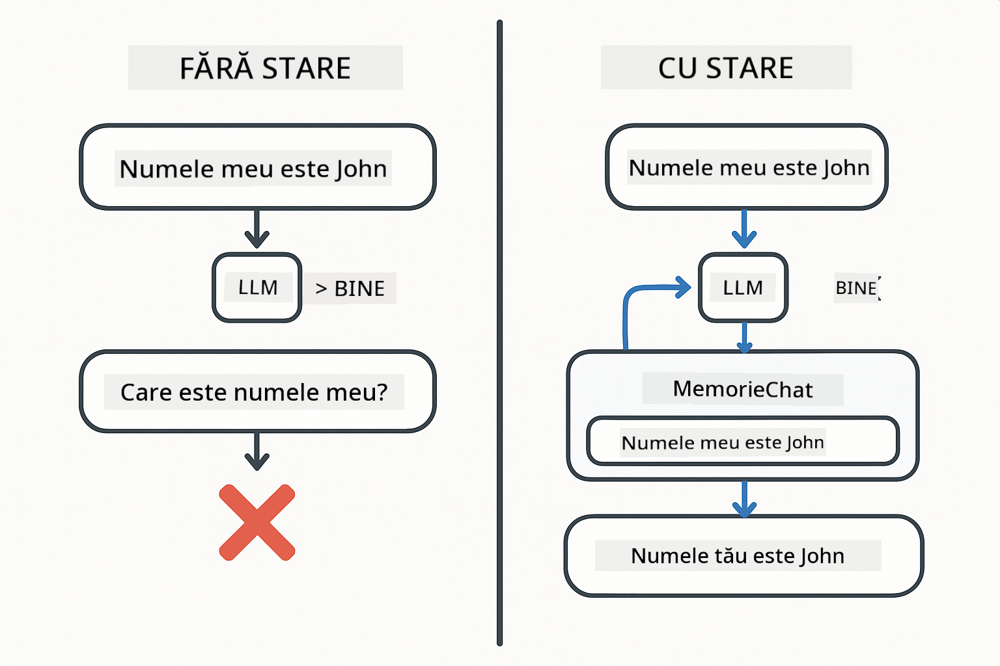
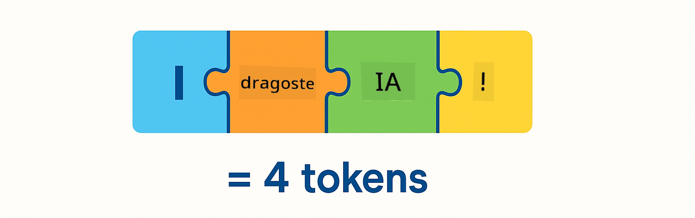
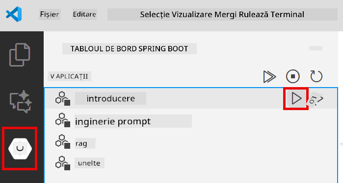
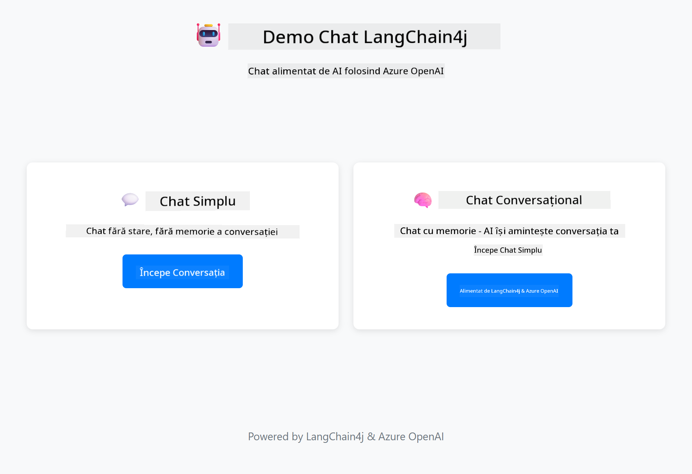
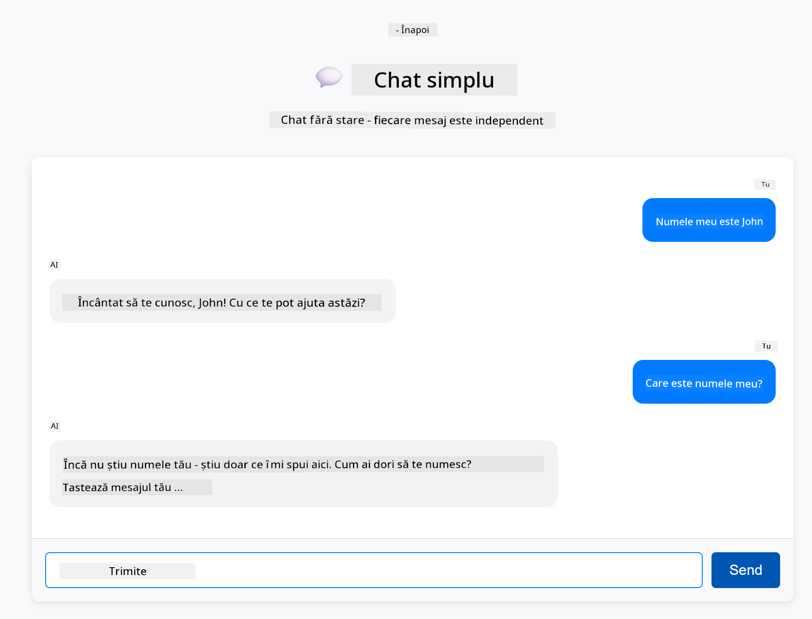

<!--
CO_OP_TRANSLATOR_METADATA:
{
  "original_hash": "c3e07ca58d0b8a3f47d3bf5728541e0a",
  "translation_date": "2025-12-13T14:02:09+00:00",
  "source_file": "01-introduction/README.md",
  "language_code": "ro"
}
-->
# Module 01: Început cu LangChain4j

## Cuprins

- [Ce vei învăța](../../../01-introduction)
- [Prerechizite](../../../01-introduction)
- [Înțelegerea problemei de bază](../../../01-introduction)
- [Înțelegerea token-urilor](../../../01-introduction)
- [Cum funcționează memoria](../../../01-introduction)
- [Cum folosește acesta LangChain4j](../../../01-introduction)
- [Dezvoltarea infrastructurii Azure OpenAI](../../../01-introduction)
- [Rularea aplicației local](../../../01-introduction)
- [Folosirea aplicației](../../../01-introduction)
  - [Chat fără stare (panoul din stânga)](../../../01-introduction)
  - [Chat cu stare (panoul din dreapta)](../../../01-introduction)
- [Pașii următori](../../../01-introduction)

## Ce vei învăța

Dacă ai finalizat începutul rapid, ai văzut cum să trimiți prompturi și să primești răspunsuri. Aceasta este fundația, dar aplicațiile reale au nevoie de mai mult. Acest modul te învață cum să construiești AI conversațional care își amintește contextul și menține starea - diferența dintre o demonstrație punctuală și o aplicație pregătită pentru producție.

Vom folosi GPT-5 de la Azure OpenAI pe tot parcursul acestui ghid deoarece capacitățile sale avansate de raționament fac comportamentul diferitelor modele mai evident. Când adaugi memorie, vei vedea clar diferența. Acest lucru face mai ușor de înțeles ce aduce fiecare componentă aplicației tale.

Vei construi o aplicație care demonstrează ambele modele:

**Chat fără stare** - Fiecare cerere este independentă. Modelul nu are memorie a mesajelor anterioare. Acesta este modelul folosit în începutul rapid.

**Conversație cu stare** - Fiecare cerere include istoricul conversației. Modelul menține contextul pe mai multe schimburi. Acesta este ceea ce cer aplicațiile de producție.

## Prerechizite

- Abonament Azure cu acces la Azure OpenAI
- Java 21, Maven 3.9+
- Azure CLI (https://learn.microsoft.com/en-us/cli/azure/install-azure-cli)
- Azure Developer CLI (azd) (https://learn.microsoft.com/en-us/azure/developer/azure-developer-cli/install-azd)

> **Notă:** Java, Maven, Azure CLI și Azure Developer CLI (azd) sunt preinstalate în devcontainer-ul furnizat.

> **Notă:** Acest modul folosește GPT-5 pe Azure OpenAI. Implementarea este configurată automat prin `azd up` - nu modifica numele modelului în cod.

## Înțelegerea problemei de bază

Modelele de limbaj sunt fără stare. Fiecare apel API este independent. Dacă trimiți „Numele meu este John” și apoi întrebi „Care este numele meu?”, modelul nu are idee că tocmai te-ai prezentat. Tratează fiecare cerere ca și cum ar fi prima conversație pe care ai avut-o vreodată.

Acest lucru este în regulă pentru întrebări și răspunsuri simple, dar inutil pentru aplicații reale. Boții de servicii pentru clienți trebuie să-și amintească ce le-ai spus. Asistenții personali au nevoie de context. Orice conversație cu mai multe schimburi necesită memorie.



*Diferența dintre conversațiile fără stare (apeluri independente) și cele cu stare (conștiente de context)*

## Înțelegerea token-urilor

Înainte de a intra în conversații, este important să înțelegi token-urile - unitățile de bază de text pe care modelele de limbaj le procesează:



*Exemplu de cum textul este împărțit în token-uri - „I love AI!” devine 4 unități separate de procesare*

Token-urile sunt modul în care modelele AI măsoară și procesează textul. Cuvintele, punctuația și chiar spațiile pot fi token-uri. Modelul tău are o limită a numărului de token-uri pe care le poate procesa simultan (400.000 pentru GPT-5, cu până la 272.000 token-uri de intrare și 128.000 token-uri de ieșire). Înțelegerea token-urilor te ajută să gestionezi lungimea conversației și costurile.

## Cum funcționează memoria

Memoria chat-ului rezolvă problema fără stare prin menținerea istoricului conversației. Înainte de a trimite cererea către model, cadrul adaugă mesajele relevante anterioare. Când întrebi „Care este numele meu?”, sistemul trimite de fapt întreg istoricul conversației, permițând modelului să vadă că ai spus anterior „Numele meu este John.”

LangChain4j oferă implementări de memorie care gestionează acest lucru automat. Alegi câte mesaje să păstrezi, iar cadrul gestionează fereastra de context.


*MessageWindowChatMemory menține o fereastră glisantă cu mesajele recente, eliminând automat pe cele vechi*

## Cum folosește acesta LangChain4j

Acest modul extinde începutul rapid prin integrarea Spring Boot și adăugarea memoriei conversației. Iată cum se potrivesc piesele:

**Dependențe** - Adaugă două biblioteci LangChain4j:

```xml
<dependency>
    <groupId>dev.langchain4j</groupId>
    <artifactId>langchain4j</artifactId> <!-- Inherited from BOM in root pom.xml -->
</dependency>
<dependency>
    <groupId>dev.langchain4j</groupId>
    <artifactId>langchain4j-open-ai-official</artifactId> <!-- Inherited from BOM in root pom.xml -->
</dependency>
```

**Model Chat** - Configurează Azure OpenAI ca bean Spring ([LangChainConfig.java](../../../01-introduction/src/main/java/com/example/langchain4j/config/LangChainConfig.java)):

```java
@Bean
public OpenAiOfficialChatModel openAiOfficialChatModel() {
    return OpenAiOfficialChatModel.builder()
            .baseUrl(azureEndpoint)
            .apiKey(azureApiKey)
            .modelName(deploymentName)
            .timeout(Duration.ofMinutes(5))
            .maxRetries(3)
            .build();
}
```

Builder-ul citește acreditările din variabilele de mediu setate de `azd up`. Setarea `baseUrl` către endpoint-ul tău Azure face ca clientul OpenAI să funcționeze cu Azure OpenAI.

**Memorie conversație** - Urmărește istoricul chat-ului cu MessageWindowChatMemory ([ConversationService.java](../../../01-introduction/src/main/java/com/example/langchain4j/service/ConversationService.java)):

```java
ChatMemory memory = MessageWindowChatMemory.withMaxMessages(10);

memory.add(UserMessage.from("My name is John"));
memory.add(AiMessage.from("Nice to meet you, John!"));

memory.add(UserMessage.from("What's my name?"));
AiMessage aiMessage = chatModel.chat(memory.messages()).aiMessage();
memory.add(aiMessage);
```

Creează memoria cu `withMaxMessages(10)` pentru a păstra ultimele 10 mesaje. Adaugă mesaje de utilizator și AI cu învelitori tipizate: `UserMessage.from(text)` și `AiMessage.from(text)`. Recuperează istoricul cu `memory.messages()` și trimite-l modelului. Serviciul stochează instanțe separate de memorie per ID conversație, permițând mai multor utilizatori să converseze simultan.

> **🤖 Încearcă cu [GitHub Copilot](https://github.com/features/copilot) Chat:** Deschide [`ConversationService.java`](../../../01-introduction/src/main/java/com/example/langchain4j/service/ConversationService.java) și întreabă:
> - „Cum decide MessageWindowChatMemory ce mesaje să elimine când fereastra este plină?”
> - „Pot implementa stocare personalizată a memoriei folosind o bază de date în loc de memorie în RAM?”
> - „Cum aș adăuga sumarizare pentru a comprima istoricul vechi al conversației?”

Endpoint-ul chat fără stare evită complet memoria - doar `chatModel.chat(prompt)` ca în începutul rapid. Endpoint-ul cu stare adaugă mesaje în memorie, recuperează istoricul și include acel context la fiecare cerere. Aceeași configurare a modelului, modele diferite.

## Dezvoltarea infrastructurii Azure OpenAI

**Bash:**
```bash
cd 01-introduction
azd up  # Selectați abonamentul și locația (eastus2 recomandat)
```

**PowerShell:**
```powershell
cd 01-introduction
azd up  # Selectați abonamentul și locația (eastus2 recomandat)
```

> **Notă:** Dacă întâmpini o eroare de timeout (`RequestConflict: Cannot modify resource ... provisioning state is not terminal`), pur și simplu rulează din nou `azd up`. Resursele Azure pot fi încă în proces de aprovizionare în fundal, iar reîncercarea permite finalizarea implementării odată ce resursele ajung într-o stare terminală.

Aceasta va:
1. Implementa resursa Azure OpenAI cu modelele GPT-5 și text-embedding-3-small
2. Va genera automat fișierul `.env` în rădăcina proiectului cu acreditările
3. Va configura toate variabilele de mediu necesare

**Ai probleme cu implementarea?** Vezi [README-ul infrastructurii](infra/README.md) pentru depanare detaliată, inclusiv conflicte de nume subdomenii, pași manuali de implementare în Azure Portal și ghid de configurare a modelului.

**Verifică dacă implementarea a reușit:**

**Bash:**
```bash
cat ../.env  # Ar trebui să afișeze AZURE_OPENAI_ENDPOINT, API_KEY, etc.
```

**PowerShell:**
```powershell
Get-Content ..\.env  # Ar trebui să afișeze AZURE_OPENAI_ENDPOINT, API_KEY, etc.
```

> **Notă:** Comanda `azd up` generează automat fișierul `.env`. Dacă trebuie să-l actualizezi ulterior, poți fie să editezi manual fișierul `.env`, fie să-l regenerezi rulând:
>
> **Bash:**
> ```bash
> cd ..
> bash .azd-env.sh
> ```
>
> **PowerShell:**
> ```powershell
> cd ..
> .\.azd-env.ps1
> ```

## Rularea aplicației local

**Verifică implementarea:**

Asigură-te că fișierul `.env` există în directorul rădăcină cu acreditările Azure:

**Bash:**
```bash
cat ../.env  # Ar trebui să afișeze AZURE_OPENAI_ENDPOINT, API_KEY, DEPLOYMENT
```

**PowerShell:**
```powershell
Get-Content ..\.env  # Ar trebui să afișeze AZURE_OPENAI_ENDPOINT, API_KEY, DEPLOYMENT
```

**Pornește aplicațiile:**

**Opțiunea 1: Folosind Spring Boot Dashboard (Recomandat pentru utilizatorii VS Code)**

Containerul de dezvoltare include extensia Spring Boot Dashboard, care oferă o interfață vizuală pentru gestionarea tuturor aplicațiilor Spring Boot. O poți găsi în bara de activități din partea stângă a VS Code (caută pictograma Spring Boot).

Din Spring Boot Dashboard poți:
- Vedea toate aplicațiile Spring Boot disponibile în spațiul de lucru
- Porni/opri aplicațiile cu un singur clic
- Vizualiza jurnalele aplicației în timp real
- Monitoriza starea aplicației

Pur și simplu apasă butonul de redare de lângă „introduction” pentru a porni acest modul sau pornește toate modulele simultan.



**Opțiunea 2: Folosind scripturi shell**

Pornește toate aplicațiile web (modulele 01-04):

**Bash:**
```bash
cd ..  # Din directorul rădăcină
./start-all.sh
```

**PowerShell:**
```powershell
cd ..  # Din directorul rădăcină
.\start-all.ps1
```

Sau pornește doar acest modul:

**Bash:**
```bash
cd 01-introduction
./start.sh
```

**PowerShell:**
```powershell
cd 01-introduction
.\start.ps1
```

Ambele scripturi încarcă automat variabilele de mediu din fișierul `.env` din rădăcină și vor construi JAR-urile dacă acestea nu există.

> **Notă:** Dacă preferi să construiești manual toate modulele înainte de a porni:
>
> **Bash:**
> ```bash
> cd ..  # Go to root directory
> mvn clean package -DskipTests
> ```
>
> **PowerShell:**
> ```powershell
> cd ..  # Go to root directory
> mvn clean package -DskipTests
> ```

Deschide http://localhost:8080 în browserul tău.

**Pentru a opri:**

**Bash:**
```bash
./stop.sh  # Doar acest modul
# Sau
cd .. && ./stop-all.sh  # Toate modulele
```

**PowerShell:**
```powershell
.\stop.ps1  # Doar acest modul
# Sau
cd ..; .\stop-all.ps1  # Toate modulele
```

## Folosirea aplicației

Aplicația oferă o interfață web cu două implementări de chat afișate una lângă alta.



*Panou de control care arată opțiunile Simple Chat (fără stare) și Conversational Chat (cu stare)*

### Chat fără stare (panoul din stânga)

Încearcă asta prima dată. Spune „Numele meu este John” și apoi imediat întreabă „Care este numele meu?” Modelul nu va ține minte pentru că fiecare mesaj este independent. Aceasta demonstrează problema de bază a integrării simple a modelului de limbaj - fără context al conversației.



*AI nu-și amintește numele tău din mesajul anterior*

### Chat cu stare (panoul din dreapta)

Acum încearcă aceeași secvență aici. Spune „Numele meu este John” și apoi „Care este numele meu?” De data aceasta își amintește. Diferența este MessageWindowChatMemory - menține istoricul conversației și îl include la fiecare cerere. Așa funcționează AI conversațional de producție.


*AI își amintește numele tău din conversația anterioară*

Ambele panouri folosesc același model GPT-5. Singura diferență este memoria. Acest lucru face clar ce aduce memoria aplicației tale și de ce este esențială pentru cazuri reale de utilizare.

## Pașii următori

**Următorul modul:** [02-prompt-engineering - Ingineria prompturilor cu GPT-5](../02-prompt-engineering/README.md)

---

**Navigare:** [← Anterior: Modul 00 - Început rapid](../00-quick-start/README.md) | [Înapoi la Principal](../README.md) | [Următor: Modul 02 - Ingineria prompturilor →](../02-prompt-engineering/README.md)

---

<!-- CO-OP TRANSLATOR DISCLAIMER START -->
**Declinare de responsabilitate**:  
Acest document a fost tradus folosind serviciul de traducere AI [Co-op Translator](https://github.com/Azure/co-op-translator). Deși ne străduim pentru acuratețe, vă rugăm să rețineți că traducerile automate pot conține erori sau inexactități. Documentul original în limba sa nativă trebuie considerat sursa autorizată. Pentru informații critice, se recomandă traducerea profesională realizată de un specialist uman. Nu ne asumăm răspunderea pentru eventualele neînțelegeri sau interpretări greșite rezultate din utilizarea acestei traduceri.
<!-- CO-OP TRANSLATOR DISCLAIMER END -->