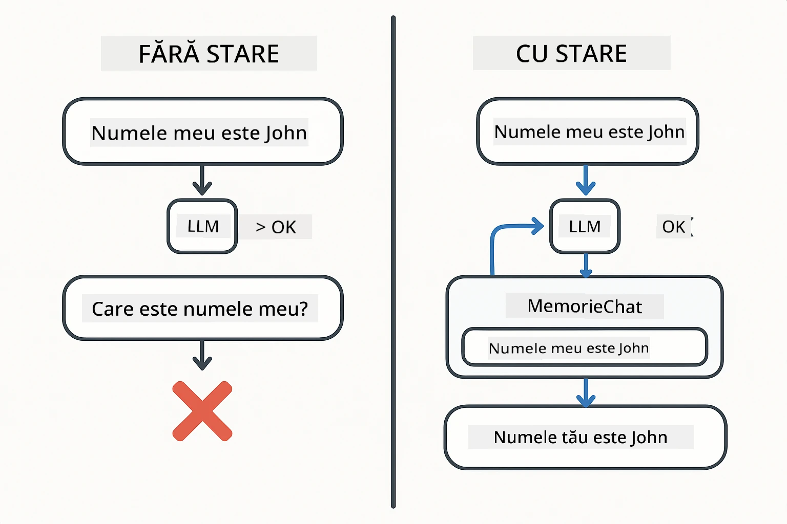
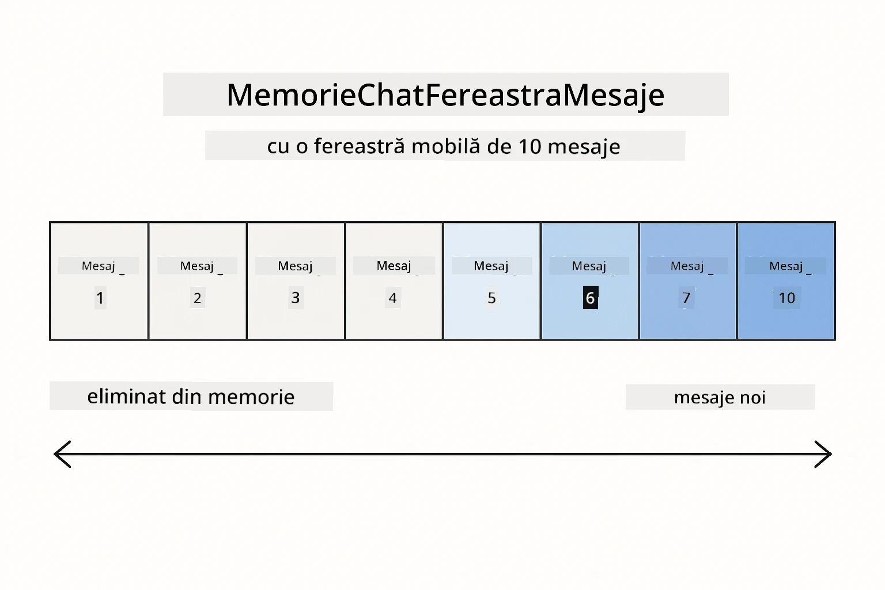
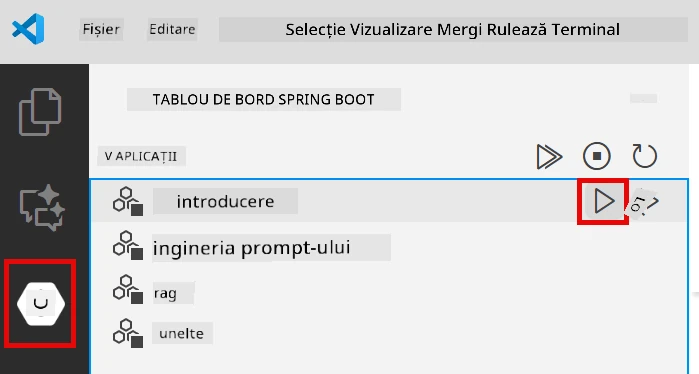
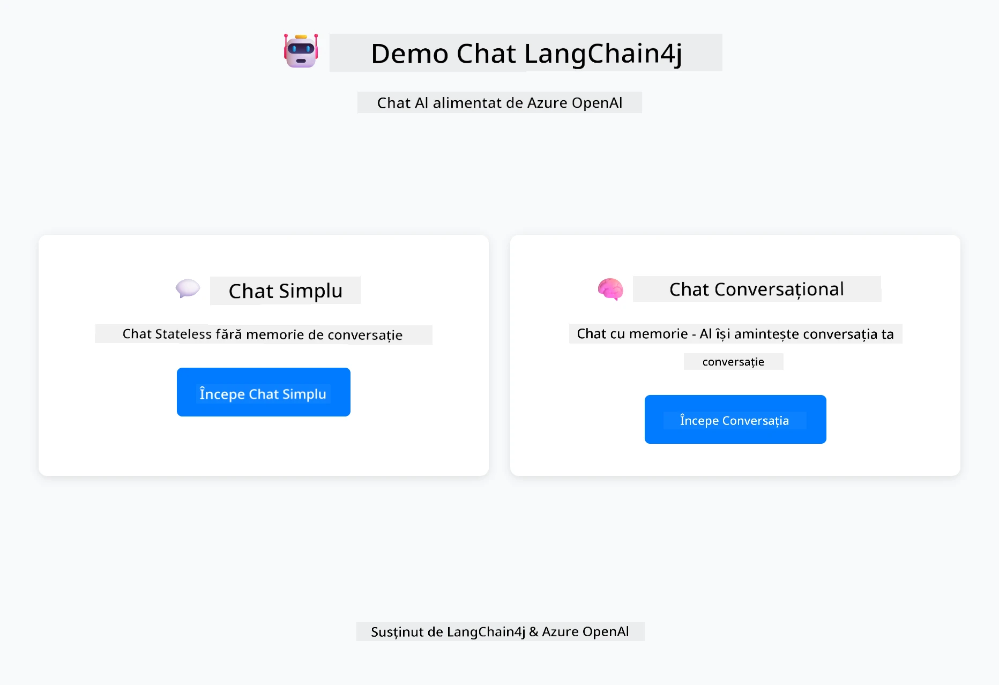
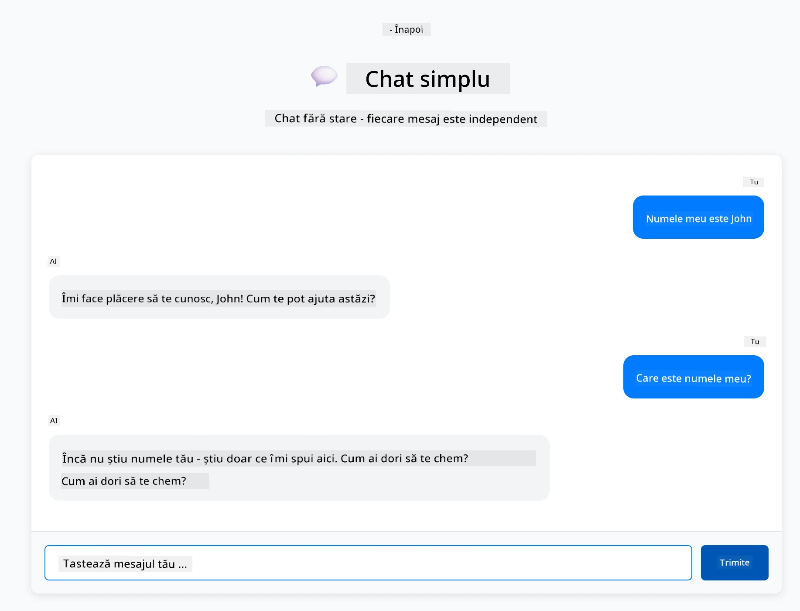
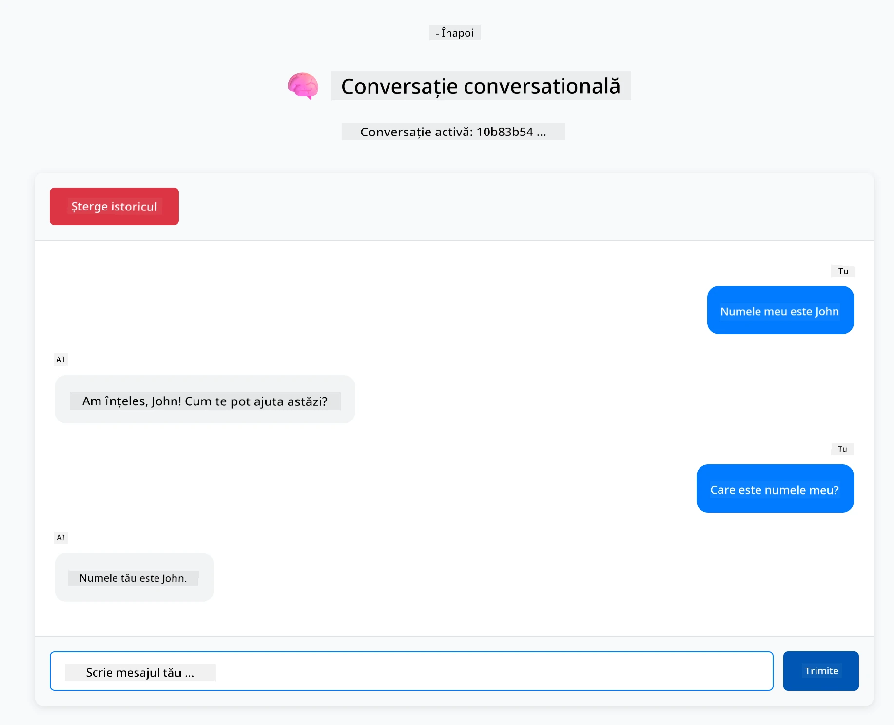

# Modulul 01: Început cu LangChain4j

## Cuprins

- [Prezentare Video](#prezentare-video)
- [Ce vei învăța](#ce-vei-învăța)
- [Precondiții](#precondiții)
- [Înțelegerea problemei de bază](#înțelegerea-problemei-de-bază)
- [Înțelegerea token-urilor](#înțelegerea-token-urilor)
- [Cum funcționează memoria](#cum-funcționează-memoria)
- [Cum folosește acest lucru LangChain4j](#cum-folosește-acest-lucru-langchain4j)
- [Implementarea infrastructurii Azure OpenAI](#implementarea-infrastructurii-azure-openai)
- [Rularea aplicației local](#rularea-aplicației-local)
- [Folosirea aplicației](#folosirea-aplicației)
  - [Chat fără stare (panoul din stânga)](#chat-fără-stare-panoul-din-stânga)
  - [Chat cu stare (panoul din dreapta)](#chat-cu-stare-panoul-din-dreapta)
- [Pașii următori](#pașii-următori)

## Prezentare Video

Urmărește această sesiune live care explică cum să începi cu acest modul:

<a href="https://www.youtube.com/live/nl_troDm8rQ?si=6b85S8xGjWnT2fX9"></a>

## Ce vei învăța

Acesta este punctul tău de start cu LangChain4j și Azure OpenAI. Începem cu elementele fundamentale și începem să construim aplicații de tip producție. Acest modul se concentrează pe AI conversațional care reține contextul și menține starea — conceptele fundamentale pe care se bazează toate modulele ulterioare.

Vom folosi GPT-5.2 de la Azure OpenAI pe tot parcursul acestui ghid pentru că capacitățile sale avansate de raționament fac comportamentul diferitelor modele mai evident. Când adaugi memorie, vei vedea clar diferența. Acest lucru face mai ușor să înțelegi ce aduce fiecare componentă aplicației tale.

Veți crea o singură aplicație care demonstrează ambele modele:

**Chat fără stare** - Fiecare cerere este independentă. Modelul nu păstrează memoria mesajelor anterioare. Aceasta este cea mai simplă pornire.

**Conversație cu stare** - Fiecare cerere include istoricul conversației. Modelul păstrează contextul pe parcursul mai multor schimburi. Asta este ceea ce cer aplicațiile de producție.

## Precondiții

- Abonament Azure cu acces la Azure OpenAI
- Java 21, Maven 3.9+ 
- Azure CLI (https://learn.microsoft.com/en-us/cli/azure/install-azure-cli)
- Azure Developer CLI (azd) (https://learn.microsoft.com/en-us/azure/developer/azure-developer-cli/install-azd)

> **Notă:** Java, Maven, Azure CLI și Azure Developer CLI (azd) sunt preinstalate în devcontainer-ul furnizat.

> **Notă:** Acest modul folosește GPT-5.2 pe Azure OpenAI. Implementarea este configurată automat prin `azd up` - nu modificați numele modelului în cod.

## Înțelegerea problemei de bază

Modelele de limbaj sunt fără stare. Fiecare apel API este independent. Dacă trimiți "Numele meu este John" și apoi întrebi "Care este numele meu?", modelul nu are nicio idee că tocmai te-ai prezentat. Tratează fiecare cerere ca și cum ar fi prima conversație pe care ai avut-o vreodată.

Acest lucru este perfect pentru întrebări și răspunsuri simple, dar inutil pentru aplicații reale. Roboții de servicii clienți trebuie să-și amintească ce le-ai spus. Asistenții personali au nevoie de context. Orice conversație cu mai multe schimburi necesită memorie.

Diagrama următoare contrastează cele două abordări — în stânga, un apel fără stare care îți uită numele; în dreapta, un apel cu stare susținut de ChatMemory care îl reține.



*Diferența dintre conversațiile fără stare (apeluri independente) și cele cu stare (conștiente de context)*

## Înțelegerea token-urilor

Înainte de a intra în conversații, este important să înțelegi token-urile - unitățile de bază de text pe care modelele de limbaj le procesează:


*Exemplu de cum textul este descompus în token-uri - "I love AI!" devine 4 unități separate de procesare*

Token-urile sunt modul în care modelele AI măsoară și procesează textul. Cuvintele, semnele de punctuație și chiar spațiile pot fi token-uri. Modelul tău are o limită privind câte token-uri poate procesa odată (400.000 pentru GPT-5.2, cu până la 272.000 token-uri de intrare și 128.000 token-uri de ieșire). Înțelegerea token-urilor te ajută să gestionezi lungimea și costurile conversațiilor.

## Cum funcționează memoria

Memoria pentru chat rezolvă problema lipsei de stare prin păstrarea istoricului conversației. Înainte de a trimite cererea ta modelului, cadrul adaugă mesajele relevante anterioare în față. Când întrebi "Care este numele meu?", sistemul trimite de fapt întregul istoric al conversației, permițând modelului să vadă că ai spus anterior "Numele meu este John."

LangChain4j oferă implementări de memorie care gestionează acest proces automat. Alegi câte mesaje să păstrezi, iar cadrul administrează fereastra de context. Diagrama de mai jos arată cum MessageWindowChatMemory menține o fereastră mobilă cu cele mai recente mesaje.



*MessageWindowChatMemory menține o fereastră mobilă cu cele mai recente mesaje, eliminând automat mesajele vechi*

## Cum folosește acest lucru LangChain4j

Acest modul integrează Spring Boot și adaugă memorie pentru conversații. Iată cum se combină piesele:

**Dependențe** - Adaugă două biblioteci LangChain4j:

```xml
<dependency>
    <groupId>dev.langchain4j</groupId>
    <artifactId>langchain4j</artifactId> <!-- Inherited from BOM in root pom.xml -->
</dependency>
<dependency>
    <groupId>dev.langchain4j</groupId>
    <artifactId>langchain4j-open-ai-official</artifactId> <!-- Inherited from BOM in root pom.xml -->
</dependency>
```

**Model Chat** - Configurează Azure OpenAI ca bean Spring ([LangChainConfig.java](../../../01-introduction/src/main/java/com/example/langchain4j/config/LangChainConfig.java)):

```java
@Bean
public OpenAiOfficialChatModel openAiOfficialChatModel() {
    return OpenAiOfficialChatModel.builder()
            .baseUrl(azureEndpoint)
            .apiKey(azureApiKey)
            .modelName(deploymentName)
            .timeout(Duration.ofMinutes(5))
            .maxRetries(3)
            .build();
}
```

Builder-ul citește credențialele din variabilele de mediu setate de `azd up`. Setarea `baseUrl` spre endpoint-ul tău Azure face ca clientul OpenAI să funcționeze cu Azure OpenAI.

**Memorie conversație** - Urmărește istoricul chat-ului cu MessageWindowChatMemory ([ConversationService.java](../../../01-introduction/src/main/java/com/example/langchain4j/service/ConversationService.java)):

```java
ChatMemory memory = MessageWindowChatMemory.withMaxMessages(10);

memory.add(UserMessage.from("My name is John"));
memory.add(AiMessage.from("Nice to meet you, John!"));

memory.add(UserMessage.from("What's my name?"));
AiMessage aiMessage = chatModel.chat(memory.messages()).aiMessage();
memory.add(aiMessage);
```

Creează memoria cu `withMaxMessages(10)` pentru a păstra ultimele 10 mesaje. Adaugă mesajele utilizatorului și AI-ului cu învelișuri tipizate: `UserMessage.from(text)` și `AiMessage.from(text)`. Recuperează istoricul cu `memory.messages()` și trimite-l modelului. Serviciul stochează instanțe distincte de memorie pentru fiecare ID de conversație, permițând mai multor utilizatori să converseze simultan.

> **🤖 Încearcă cu [GitHub Copilot](https://github.com/features/copilot) Chat:** Deschide [`ConversationService.java`](../../../01-introduction/src/main/java/com/example/langchain4j/service/ConversationService.java) și întreabă:
> - "Cum decide MessageWindowChatMemory ce mesaje să elimine când fereastra este plină?"
> - "Pot implementa o stocare personalizată a memoriei folosind o bază de date în loc de memorie în RAM?"
> - "Cum aș putea adăuga sumarizare pentru a comprima istoricul conversațiilor vechi?"

Endpoint-ul pentru chat fără stare ignoră complet memoria - doar `chatModel.chat(prompt)` ca în startul rapid. Endpoint-ul pentru chat cu stare adaugă mesaje în memorie, recuperează istoricul și include acel context cu fiecare cerere. Aceeași configurație model, modele diferite.

## Implementarea infrastructurii Azure OpenAI

**Bash:**
```bash
cd 01-introduction
azd up  # Selectați abonamentul și locația (recomandat eastus2)
```

**PowerShell:**
```powershell
cd 01-introduction
azd up  # Selectați abonamentul și locația (se recomandă eastus2)
```

> **Notă:** Dacă întâmpini o eroare de timeout (`RequestConflict: Cannot modify resource ... provisioning state is not terminal`), pur și simplu rulează din nou `azd up`. Resursele Azure pot fi încă în proces de configurare în fundal, iar o nouă încercare va permite finalizarea implementării odată ce resursele ajung într-o stare terminală.

Aceasta va:
1. Implementa resursa Azure OpenAI cu modelele GPT-5.2 și text-embedding-3-small
2. Va genera automat fișierul `.env` în rădăcina proiectului cu credențiale
3. Va configura toate variabilele de mediu necesare

**Ai probleme cu implementarea?** Vezi [Infrastructure README](infra/README.md) pentru detalii despre depanare, inclusiv conflicte legate de numele subdomeniilor, pași manuali pentru implementarea în Azure Portal și ghid pentru configurarea modelului.

**Verifică dacă implementarea a reușit:**

**Bash:**
```bash
cat ../.env  # Ar trebui să afișeze AZURE_OPENAI_ENDPOINT, API_KEY, etc.
```

**PowerShell:**
```powershell
Get-Content ..\.env  # Ar trebui să afișeze AZURE_OPENAI_ENDPOINT, API_KEY, etc.
```

> **Notă:** Comanda `azd up` generează automat fișierul `.env`. Dacă trebuie să îl actualizezi ulterior, poți edita manual fișierul `.env` sau îl poți regenera rulând:
>
> **Bash:**
> ```bash
> cd ..
> bash .azd-env.sh
> ```
>
> **PowerShell:**
> ```powershell
> cd ..
> .\.azd-env.ps1
> ```

## Rularea aplicației local

**Verifică implementarea:**

Asigură-te că fișierul `.env` există în directorul rădăcină cu credențiale Azure. Rulează din directorul modulului (`01-introduction/`):

**Bash:**
```bash
cat ../.env  # Ar trebui să afișeze AZURE_OPENAI_ENDPOINT, API_KEY, DEPLOYMENT
```

**PowerShell:**
```powershell
Get-Content ..\.env  # Ar trebui să afișeze AZURE_OPENAI_ENDPOINT, API_KEY, DEPLOYMENT
```

**Pornește aplicațiile:**

**Opțiunea 1: Folosind Spring Boot Dashboard (recomandat pentru utilizatorii VS Code)**

Dev container-ul include extensia Spring Boot Dashboard, care oferă o interfață vizuală pentru gestionarea tuturor aplicațiilor Spring Boot. O poți găsi în bara de activități din partea stângă a VS Code (caută iconița Spring Boot).

Din Spring Boot Dashboard, poți:
- Vizualiza toate aplicațiile Spring Boot disponibile în spațiul de lucru
- Porni/opri aplicațiile cu un singur clic
- Vizualiza jurnalele aplicațiilor în timp real
- Monitoriza starea aplicațiilor

Pur și simplu fă clic pe butonul de redare de lângă "introduction" pentru a porni acest modul, sau pornește toate modulele simultan.



*Panoul Spring Boot Dashboard în VS Code — pornește, oprește și monitorizează toate modulele dintr-un singur loc*

**Opțiunea 2: Folosind scripturi shell**

Pornește toate aplicațiile web (modulele 01-04):

**Bash:**
```bash
cd ..  # Din directorul rădăcină
./start-all.sh
```

**PowerShell:**
```powershell
cd ..  # Din directorul rădăcină
.\start-all.ps1
```

Sau pornește doar acest modul:

**Bash:**
```bash
cd 01-introduction
./start.sh
```

**PowerShell:**
```powershell
cd 01-introduction
.\start.ps1
```

Ambele scripturi încarcă automat variabilele de mediu din fișierul `.env` de la rădăcină și vor construi JAR-urile dacă nu există.

> **Notă:** Dacă preferi să compilezi manual toate modulele înainte de rulare:
>
> **Bash:**
> ```bash
> cd ..  # Go to root directory
> mvn clean package -DskipTests
> ```
>
> **PowerShell:**
> ```powershell
> cd ..  # Go to root directory
> mvn clean package -DskipTests
> ```

Deschide http://localhost:8080 în browser.

**Pentru oprire:**

**Bash:**
```bash
./stop.sh  # Doar acest modul
# Sau
cd .. && ./stop-all.sh  # Toate modulele
```

**PowerShell:**
```powershell
.\stop.ps1  # Doar acest modul
# Sau
cd ..; .\stop-all.ps1  # Toate modulele
```

## Folosirea aplicației

Aplicația oferă o interfață web cu două implementări de chat afișate una lângă cealaltă.



*Panou de control care afișează atât opțiunea de Chat Simplu (fără stare), cât și Chat Conversațional (cu stare)*

### Chat fără stare (panoul din stânga)

Încearcă asta primul. Spune "Numele meu este John" și apoi imediat întreabă "Care este numele meu?" Modelul nu va reține deoarece fiecare mesaj este independent. Aceasta demonstrează problema principală a integrării simple cu modele de limbaj - lipsa contextului conversației.



*AI nu își amintește numele spus anterior*

### Chat cu stare (panoul din dreapta)

Acum încearcă aceeași secvență aici. Spune "Numele meu este John" și apoi "Care este numele meu?" De data aceasta îl reține. Diferența o face MessageWindowChatMemory - păstrează istoricul conversației și îl include cu fiecare cerere. Așa funcționează AI conversațional în producție.



*AI își amintește numele spus anterior în conversație*

Ambele panouri folosesc același model GPT-5.2. Singura diferență este memoria. Acest lucru face clar ce aduce memoria aplicației tale și de ce este esențială pentru cazurile reale de utilizare.

## Pașii următori

**Următorul modul:** [02-prompt-engineering - Ingineria prompt-ului cu GPT-5.2](../02-prompt-engineering/README.md)

---

**Navigare:** [← Înapoi la Principal](../README.md) | [Următor: Modulul 02 - Ingineria Prompt-ului →](../02-prompt-engineering/README.md)

---

<!-- CO-OP TRANSLATOR DISCLAIMER START -->
**Declinare a responsabilității**:
Acest document a fost tradus folosind serviciul de traducere AI [Co-op Translator](https://github.com/Azure/co-op-translator). În timp ce ne străduim pentru acuratețe, vă rugăm să rețineți că traducerile automate pot conține erori sau inexactități. Documentul original în limba sa nativă trebuie considerat sursa autorizată. Pentru informații critice, se recomandă traducerea profesională realizată de un om. Nu ne asumăm responsabilitatea pentru eventualele neînțelegeri sau interpretări greșite care decurg din utilizarea acestei traduceri.
<!-- CO-OP TRANSLATOR DISCLAIMER END -->