<!--
CO_OP_TRANSLATOR_METADATA:
{
  "original_hash": "8d787826cad7e92bf5cdbd116b1e6116",
  "translation_date": "2025-12-13T16:25:08+00:00",
  "source_file": "02-prompt-engineering/README.md",
  "language_code": "ro"
}
-->
# Modulul 02: Ingineria Prompturilor cu GPT-5

## Cuprins

- [Ce Vei Învăța](../../../02-prompt-engineering)
- [Precondiții](../../../02-prompt-engineering)
- [Înțelegerea Ingineriei Prompturilor](../../../02-prompt-engineering)
- [Cum Folosește Acest Modul LangChain4j](../../../02-prompt-engineering)
- [Modelele de Bază](../../../02-prompt-engineering)
- [Folosirea Resurselor Azure Existente](../../../02-prompt-engineering)
- [Capturi de Ecran ale Aplicației](../../../02-prompt-engineering)
- [Explorarea Modelelor](../../../02-prompt-engineering)
  - [Efort Scăzut vs Efort Ridicat](../../../02-prompt-engineering)
  - [Executarea Sarcinilor (Preludii pentru Unelte)](../../../02-prompt-engineering)
  - [Cod cu Auto-Reflecție](../../../02-prompt-engineering)
  - [Analiză Structurată](../../../02-prompt-engineering)
  - [Chat Multi-Rundă](../../../02-prompt-engineering)
  - [Raționament Pas cu Pas](../../../02-prompt-engineering)
  - [Output Constrâns](../../../02-prompt-engineering)
- [Ce Înveți Cu Adevărat](../../../02-prompt-engineering)
- [Pașii Următori](../../../02-prompt-engineering)

## Ce Vei Învăța

În modulul anterior, ai văzut cum memoria permite AI conversațional și ai folosit Modele GitHub pentru interacțiuni de bază. Acum ne vom concentra pe modul în care pui întrebări - prompturile în sine - folosind GPT-5 de la Azure OpenAI. Modul în care structurezi prompturile afectează dramatic calitatea răspunsurilor pe care le primești.

Vom folosi GPT-5 deoarece introduce controlul raționamentului - poți spune modelului cât să gândească înainte de a răspunde. Acest lucru face ca diferitele strategii de prompting să fie mai evidente și te ajută să înțelegi când să folosești fiecare abordare. De asemenea, vom beneficia de limitele mai puține de rată ale Azure pentru GPT-5 comparativ cu Modelele GitHub.

## Precondiții

- Modulul 01 finalizat (resurse Azure OpenAI implementate)
- Fișier `.env` în directorul rădăcină cu acreditările Azure (creat de `azd up` în Modulul 01)

> **Notă:** Dacă nu ai finalizat Modulul 01, urmează mai întâi instrucțiunile de implementare de acolo.

## Înțelegerea Ingineriei Prompturilor

Ingineria prompturilor înseamnă proiectarea textului de intrare care îți oferă în mod constant rezultatele de care ai nevoie. Nu este doar despre a pune întrebări - este despre structurarea cererilor astfel încât modelul să înțeleagă exact ce vrei și cum să livreze.

Gândește-te la asta ca la a da instrucțiuni unui coleg. „Remediază bug-ul” este vag. „Remediază excepția null pointer în UserService.java linia 45 adăugând o verificare null” este specific. Modelele de limbaj funcționează la fel - specificitatea și structura contează.

## Cum Folosește Acest Modul LangChain4j

Acest modul demonstrează modele avansate de prompting folosind aceeași fundație LangChain4j din modulele anterioare, cu accent pe structura prompturilor și controlul raționamentului.


*Cum LangChain4j conectează prompturile tale la Azure OpenAI GPT-5*

**Dependențe** - Modulul 02 folosește următoarele dependențe langchain4j definite în `pom.xml`:
```xml
<dependency>
    <groupId>dev.langchain4j</groupId>
    <artifactId>langchain4j</artifactId> <!-- Inherited from BOM in root pom.xml -->
</dependency>
<dependency>
    <groupId>dev.langchain4j</groupId>
    <artifactId>langchain4j-open-ai-official</artifactId> <!-- Inherited from BOM in root pom.xml -->
</dependency>
```

**Configurarea OpenAiOfficialChatModel** - [LangChainConfig.java](../../../02-prompt-engineering/src/main/java/com/example/langchain4j/prompts/config/LangChainConfig.java)

Modelul de chat este configurat manual ca un bean Spring folosind clientul oficial OpenAI, care suportă endpoint-urile Azure OpenAI. Diferența cheie față de Modulul 01 este modul în care structurăm prompturile trimise la `chatModel.chat()`, nu configurarea modelului în sine.

**Mesaje Sistem și Utilizator** - [Gpt5PromptService.java](../../../02-prompt-engineering/src/main/java/com/example/langchain4j/prompts/service/Gpt5PromptService.java)

LangChain4j separă tipurile de mesaje pentru claritate. `SystemMessage` setează comportamentul și contextul AI-ului (de exemplu „Ești un recenzor de cod”), în timp ce `UserMessage` conține cererea propriu-zisă. Această separare îți permite să menții un comportament AI consistent pentru diferite interogări ale utilizatorului.

```java
SystemMessage systemMsg = SystemMessage.from(
    "You are a helpful Java programming expert."
);

UserMessage userMsg = UserMessage.from(
    "Explain what a List is in Java"
);

String response = chatModel.chat(systemMsg, userMsg);
```


*SystemMessage oferă context persistent în timp ce UserMessages conțin cereri individuale*

**MessageWindowChatMemory pentru Multi-Rundă** - Pentru modelul conversației multi-rundă, reutilizăm `MessageWindowChatMemory` din Modulul 01. Fiecare sesiune primește propria instanță de memorie stocată într-un `Map<String, ChatMemory>`, permițând conversații multiple simultane fără amestecarea contextului.

**Șabloane de Prompturi** - Accentul real aici este pe ingineria prompturilor, nu pe API-uri noi LangChain4j. Fiecare model (efort scăzut, efort ridicat, execuția sarcinilor etc.) folosește aceeași metodă `chatModel.chat(prompt)` dar cu șiruri de prompturi atent structurate. Etichetele XML, instrucțiunile și formatarea fac parte din textul promptului, nu din funcționalități LangChain4j.

**Controlul Raționamentului** - Efortul de raționament al GPT-5 este controlat prin instrucțiuni în prompturi precum „maximum 2 pași de raționament” sau „explorează temeinic”. Acestea sunt tehnici de inginerie a prompturilor, nu configurații LangChain4j. Biblioteca doar livrează prompturile tale către model.

Concluzia principală: LangChain4j oferă infrastructura (conexiunea modelului prin [LangChainConfig.java](../../../02-prompt-engineering/src/main/java/com/example/langchain4j/prompts/config/LangChainConfig.java), memoria, gestionarea mesajelor prin [Gpt5PromptService.java](../../../02-prompt-engineering/src/main/java/com/example/langchain4j/prompts/service/Gpt5PromptService.java)), în timp ce acest modul te învață cum să creezi prompturi eficiente în cadrul acelei infrastructuri.

## Modelele de Bază

Nu toate problemele necesită aceeași abordare. Unele întrebări cer răspunsuri rapide, altele gândire profundă. Unele cer raționament vizibil, altele doar rezultate. Acest modul acoperă opt modele de prompting - fiecare optimizat pentru scenarii diferite. Vei experimenta cu toate pentru a învăța când funcționează cel mai bine fiecare abordare.

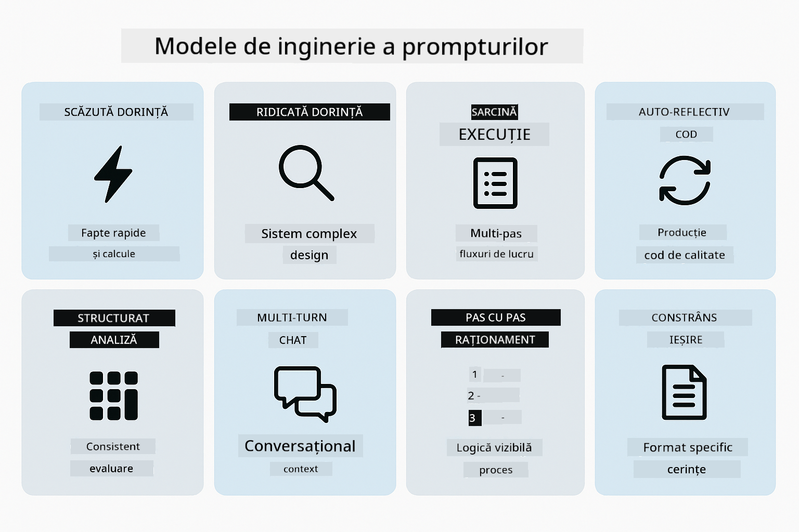

*Prezentare generală a celor opt modele de inginerie a prompturilor și cazurile lor de utilizare*

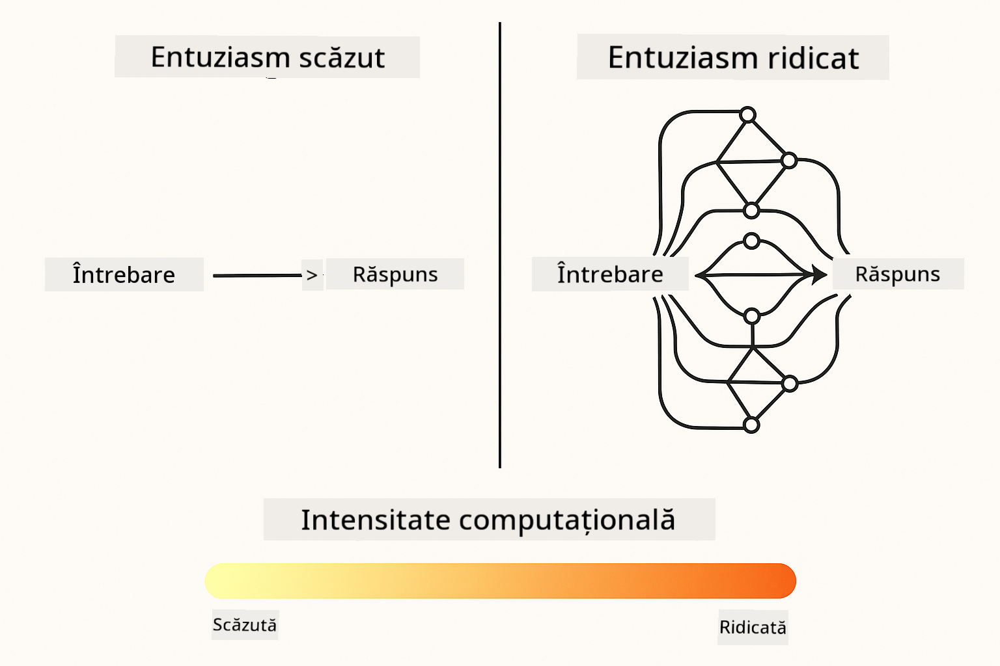

*Efort scăzut (rapid, direct) vs Efort ridicat (temeinic, explorator) în raționament*

**Efort Scăzut (Rapid & Concentrat)** - Pentru întrebări simple unde vrei răspunsuri rapide și directe. Modelul face raționament minim - maximum 2 pași. Folosește-l pentru calcule, căutări sau întrebări directe.

```java
String prompt = """
    <reasoning_effort>low</reasoning_effort>
    <instruction>maximum 2 reasoning steps</instruction>
    
    What is 15% of 200?
    """;

String response = chatModel.chat(prompt);
```

> 💡 **Explorează cu GitHub Copilot:** Deschide [`Gpt5PromptService.java`](../../../02-prompt-engineering/src/main/java/com/example/langchain4j/prompts/service/Gpt5PromptService.java) și întreabă:
> - „Care este diferența dintre modelele de prompting cu efort scăzut și efort ridicat?”
> - „Cum ajută etichetele XML din prompturi la structurarea răspunsului AI?”
> - „Când ar trebui să folosesc modelele de auto-reflecție vs instrucțiuni directe?”

**Efort Ridicat (Profund & Temeinic)** - Pentru probleme complexe unde vrei o analiză cuprinzătoare. Modelul explorează temeinic și arată raționamentul detaliat. Folosește-l pentru design de sistem, decizii arhitecturale sau cercetări complexe.

```java
String prompt = """
    <reasoning_effort>high</reasoning_effort>
    <instruction>explore thoroughly, show detailed reasoning</instruction>
    
    Design a caching strategy for a high-traffic REST API.
    """;

String response = chatModel.chat(prompt);
```

**Executarea Sarcinilor (Progres Pas cu Pas)** - Pentru fluxuri de lucru în mai mulți pași. Modelul oferă un plan inițial, povestește fiecare pas pe măsură ce lucrează, apoi oferă un rezumat. Folosește-l pentru migrații, implementări sau orice proces în mai mulți pași.

```java
String prompt = """
    <task>Create a REST endpoint for user registration</task>
    <preamble>Provide an upfront plan</preamble>
    <narration>Narrate each step as you work</narration>
    <summary>Summarize what was accomplished</summary>
    """;

String response = chatModel.chat(prompt);
```

Promptarea Chain-of-Thought cere explicit modelului să arate procesul său de raționament, îmbunătățind acuratețea pentru sarcini complexe. Descompunerea pas cu pas ajută atât oamenii, cât și AI să înțeleagă logica.

> **🤖 Încearcă cu Chat [GitHub Copilot](https://github.com/features/copilot):** Întreabă despre acest model:
> - „Cum aș adapta modelul de execuție a sarcinilor pentru operațiuni de durată lungă?”
> - „Care sunt cele mai bune practici pentru structurarea preludiilor uneltelor în aplicații de producție?”
> - „Cum pot captura și afișa actualizări intermediare de progres într-o interfață UI?”


*Planifică → Execută → Rezumă fluxul de lucru pentru sarcini în mai mulți pași*

**Cod cu Auto-Reflecție** - Pentru generarea de cod de calitate pentru producție. Modelul generează cod, îl verifică după criterii de calitate și îl îmbunătățește iterativ. Folosește-l când construiești funcționalități sau servicii noi.

```java
String prompt = """
    <task>Create an email validation service</task>
    <quality_criteria>
    - Correct logic and error handling
    - Best practices (clean code, proper naming)
    - Performance optimization
    - Security considerations
    </quality_criteria>
    <instruction>Generate code, evaluate against criteria, improve iteratively</instruction>
    """;

String response = chatModel.chat(prompt);
```


*Buclă iterativă de îmbunătățire - generează, evaluează, identifică probleme, îmbunătățește, repetă*

**Analiză Structurată** - Pentru evaluare consistentă. Modelul revizuiește codul folosind un cadru fix (corectitudine, practici, performanță, securitate). Folosește-l pentru recenzii de cod sau evaluări de calitate.

```java
String prompt = """
    <code>
    public List getUsers() {
        return database.query("SELECT * FROM users");
    }
    </code>
    
    <framework>
    Evaluate using these categories:
    1. Correctness - Logic and functionality
    2. Best Practices - Code quality
    3. Performance - Efficiency concerns
    4. Security - Vulnerabilities
    </framework>
    """;

String response = chatModel.chat(prompt);
```

> **🤖 Încearcă cu Chat [GitHub Copilot](https://github.com/features/copilot):** Întreabă despre analiza structurată:
> - „Cum pot personaliza cadrul de analiză pentru diferite tipuri de recenzii de cod?”
> - „Care este cea mai bună metodă de a parsa și acționa pe baza output-ului structurat programatic?”
> - „Cum asigur niveluri consistente de severitate în diferite sesiuni de revizuire?”

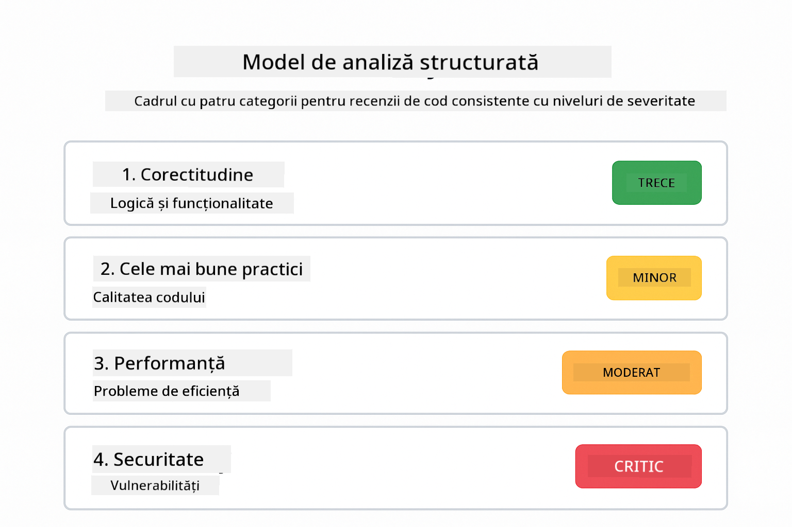

*Cadrul cu patru categorii pentru recenzii consistente de cod cu niveluri de severitate*

**Chat Multi-Rundă** - Pentru conversații care necesită context. Modelul își amintește mesajele anterioare și construiește pe baza lor. Folosește-l pentru sesiuni interactive de ajutor sau Q&A complexe.

```java
ChatMemory memory = MessageWindowChatMemory.withMaxMessages(10);

memory.add(UserMessage.from("What is Spring Boot?"));
AiMessage aiMessage1 = chatModel.chat(memory.messages()).aiMessage();
memory.add(aiMessage1);

memory.add(UserMessage.from("Show me an example"));
AiMessage aiMessage2 = chatModel.chat(memory.messages()).aiMessage();
memory.add(aiMessage2);
```


*Cum se acumulează contextul conversației pe mai multe runde până la atingerea limitei de tokeni*

**Raționament Pas cu Pas** - Pentru probleme care necesită logică vizibilă. Modelul arată raționamentul explicit pentru fiecare pas. Folosește-l pentru probleme de matematică, puzzle-uri logice sau când trebuie să înțelegi procesul de gândire.

```java
String prompt = """
    <instruction>Show your reasoning step-by-step</instruction>
    
    If a train travels 120 km in 2 hours, then stops for 30 minutes,
    then travels another 90 km in 1.5 hours, what is the average speed
    for the entire journey including the stop?
    """;

String response = chatModel.chat(prompt);
```

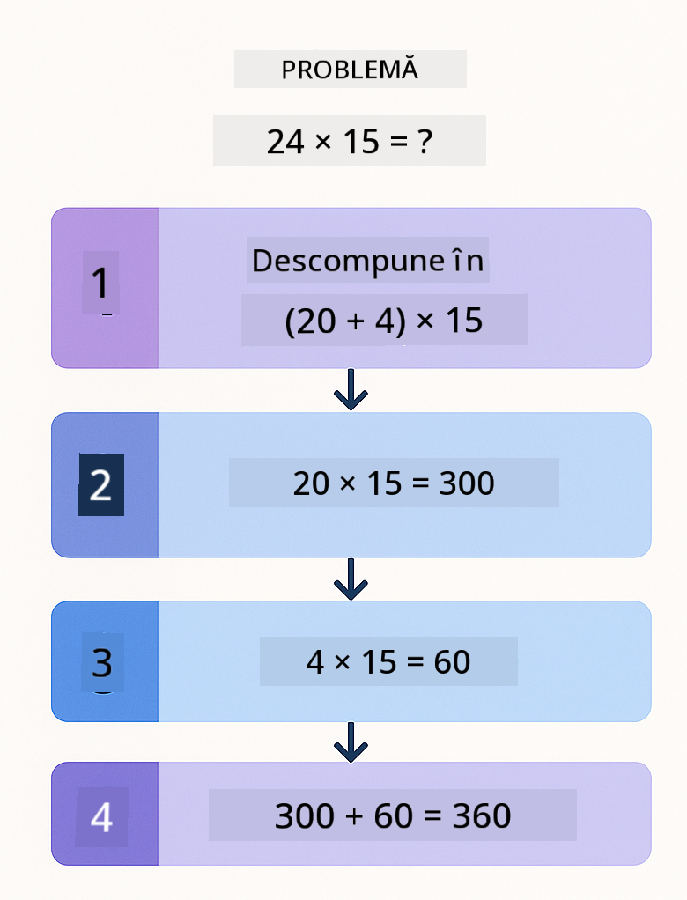

*Descompunerea problemelor în pași logici expliciți*

**Output Constrâns** - Pentru răspunsuri cu cerințe specifice de format. Modelul respectă strict regulile de format și lungime. Folosește-l pentru rezumate sau când ai nevoie de o structură precisă a output-ului.

```java
String prompt = """
    <constraints>
    - Exactly 100 words
    - Bullet point format
    - Technical terms only
    </constraints>
    
    Summarize the key concepts of machine learning.
    """;

String response = chatModel.chat(prompt);
```

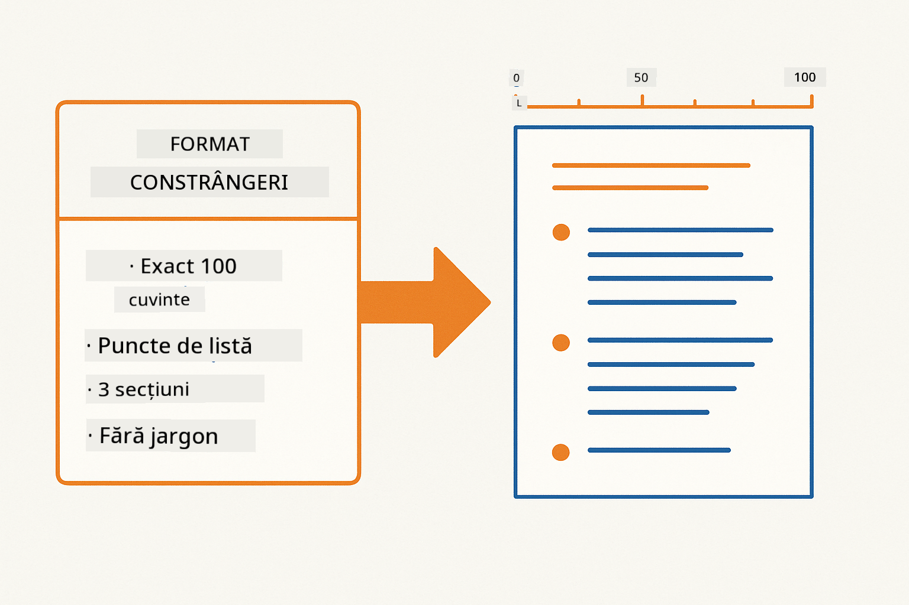

*Impunerea cerințelor specifice de format, lungime și structură*

## Folosirea Resurselor Azure Existente

**Verifică implementarea:**

Asigură-te că fișierul `.env` există în directorul rădăcină cu acreditările Azure (creat în timpul Modulului 01):
```bash
cat ../.env  # Ar trebui să afișeze AZURE_OPENAI_ENDPOINT, API_KEY, DEPLOYMENT
```

**Pornește aplicația:**

> **Notă:** Dacă ai pornit deja toate aplicațiile folosind `./start-all.sh` din Modulul 01, acest modul rulează deja pe portul 8083. Poți sări peste comenzile de pornire de mai jos și să accesezi direct http://localhost:8083.

**Opțiunea 1: Folosind Spring Boot Dashboard (Recomandat pentru utilizatorii VS Code)**

Containerul de dezvoltare include extensia Spring Boot Dashboard, care oferă o interfață vizuală pentru gestionarea tuturor aplicațiilor Spring Boot. O găsești în bara de activități din stânga VS Code (caută pictograma Spring Boot).

Din Spring Boot Dashboard poți:
- Vedea toate aplicațiile Spring Boot disponibile în workspace
- Porni/opri aplicații cu un singur click
- Vizualiza jurnalele aplicațiilor în timp real
- Monitoriza starea aplicațiilor

Apasă butonul play de lângă „prompt-engineering” pentru a porni acest modul sau pornește toate modulele simultan.

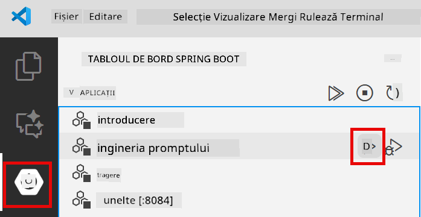

**Opțiunea 2: Folosind scripturi shell**

Pornește toate aplicațiile web (modulele 01-04):

**Bash:**
```bash
cd ..  # Din directorul rădăcină
./start-all.sh
```

**PowerShell:**
```powershell
cd ..  # Din directorul rădăcină
.\start-all.ps1
```

Sau pornește doar acest modul:

**Bash:**
```bash
cd 02-prompt-engineering
./start.sh
```

**PowerShell:**
```powershell
cd 02-prompt-engineering
.\start.ps1
```

Ambele scripturi încarcă automat variabilele de mediu din fișierul `.env` din rădăcină și vor construi JAR-urile dacă nu există.

> **Notă:** Dacă preferi să construiești manual toate modulele înainte de pornire:
>
> **Bash:**
> ```bash
> cd ..  # Go to root directory
> mvn clean package -DskipTests
> ```
>
> **PowerShell:**
> ```powershell
> cd ..  # Go to root directory
> mvn clean package -DskipTests
> ```

Deschide http://localhost:8083 în browserul tău.

**Pentru oprire:**

**Bash:**
```bash
./stop.sh  # Doar acest modul
# Sau
cd .. && ./stop-all.sh  # Toate modulele
```

**PowerShell:**
```powershell
.\stop.ps1  # Doar acest modul
# Sau
cd ..; .\stop-all.ps1  # Toate modulele
```

## Capturi de Ecran ale Aplicației


*Dashboard-ul principal care arată toate cele 8 modele de inginerie a prompturilor cu caracteristicile și cazurile lor de utilizare*

## Explorarea Modelelor

Interfața web îți permite să experimentezi cu diferite strategii de prompting. Fiecare model rezolvă probleme diferite - încearcă-le pentru a vedea când strălucește fiecare abordare.

### Efort Scăzut vs Efort Ridicat

Pune o întrebare simplă precum „Care este 15% din 200?” folosind Efort Scăzut. Vei primi un răspuns instant, direct. Acum pune ceva complex precum „Proiectează o strategie de caching pentru un API cu trafic intens” folosind Efort Ridicat. Observă cum modelul încetinește și oferă raționament detaliat. Același model, aceeași structură a întrebării - dar promptul îi spune cât să gândească.

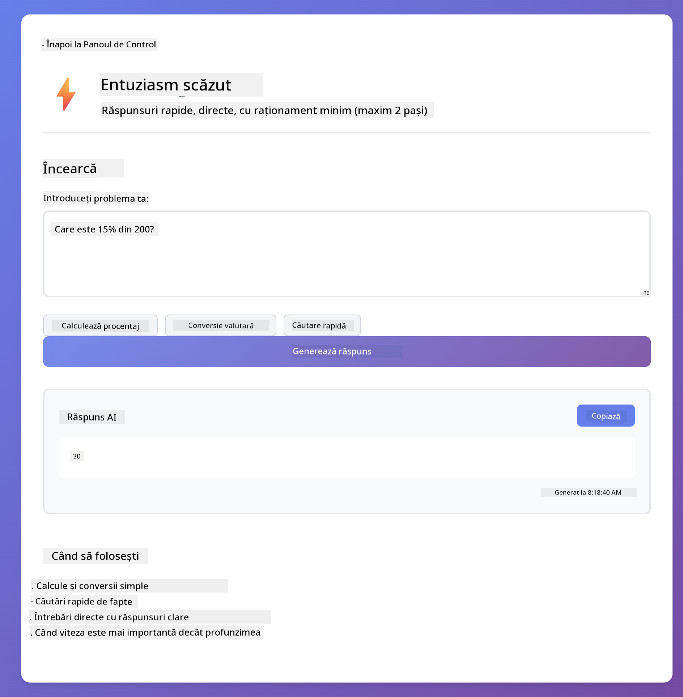
*Calcul rapid cu raționament minim*

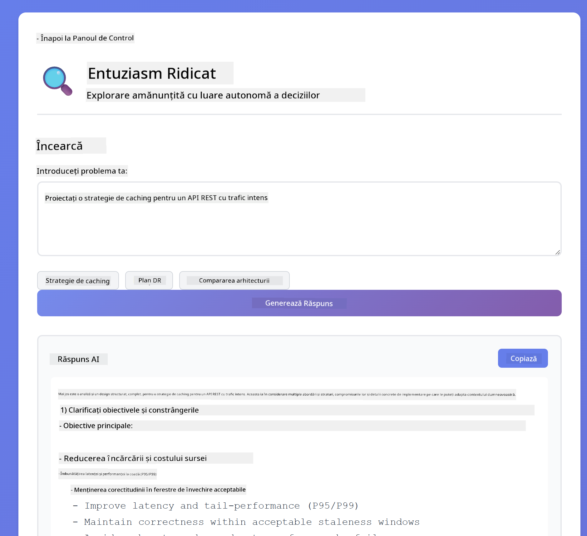

*Strategie cuprinzătoare de caching (2.8MB)*

### Executarea sarcinii (Preambule pentru unelte)

Fluxurile de lucru în mai mulți pași beneficiază de planificare prealabilă și narare a progresului. Modelul conturează ce va face, povestește fiecare pas, apoi rezumă rezultatele.

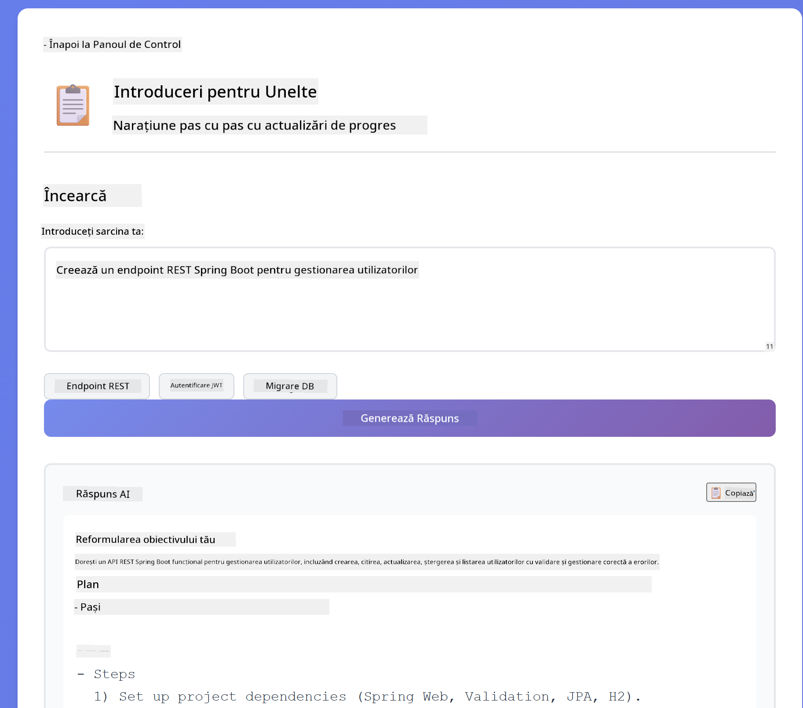

*Crearea unui endpoint REST cu narare pas cu pas (3.9MB)*

### Cod auto-reflectiv

Încearcă „Creează un serviciu de validare a email-urilor”. În loc să genereze doar cod și să se oprească, modelul generează, evaluează conform criteriilor de calitate, identifică slăbiciunile și îmbunătățește. Vei vedea cum iterează până când codul îndeplinește standardele de producție.


*Serviciu complet de validare a email-urilor (5.2MB)*

### Analiză structurată

Revizuirile de cod necesită cadre de evaluare consistente. Modelul analizează codul folosind categorii fixe (corectitudine, practici, performanță, securitate) cu niveluri de severitate.

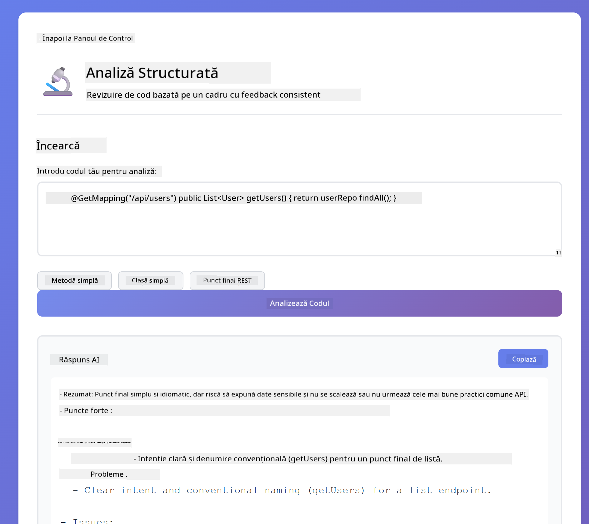

*Revizuire de cod bazată pe un cadru*

### Chat multi-turn

Întreabă „Ce este Spring Boot?” apoi imediat „Arată-mi un exemplu”. Modelul își amintește prima întrebare și îți oferă un exemplu specific Spring Boot. Fără memorie, a doua întrebare ar fi prea vagă.


*Păstrarea contextului între întrebări*

### Raționament pas cu pas

Alege o problemă de matematică și încearc-o atât cu Raționament pas cu pas, cât și cu Efort scăzut. Efortul scăzut îți oferă doar răspunsul - rapid, dar opac. Raționamentul pas cu pas îți arată fiecare calcul și decizie.


*Problemă matematică cu pași expliciți*

### Ieșire constrânsă

Când ai nevoie de formate specifice sau număr fix de cuvinte, acest tipar impune respectarea strictă. Încearcă să generezi un rezumat cu exact 100 de cuvinte în format punctat.

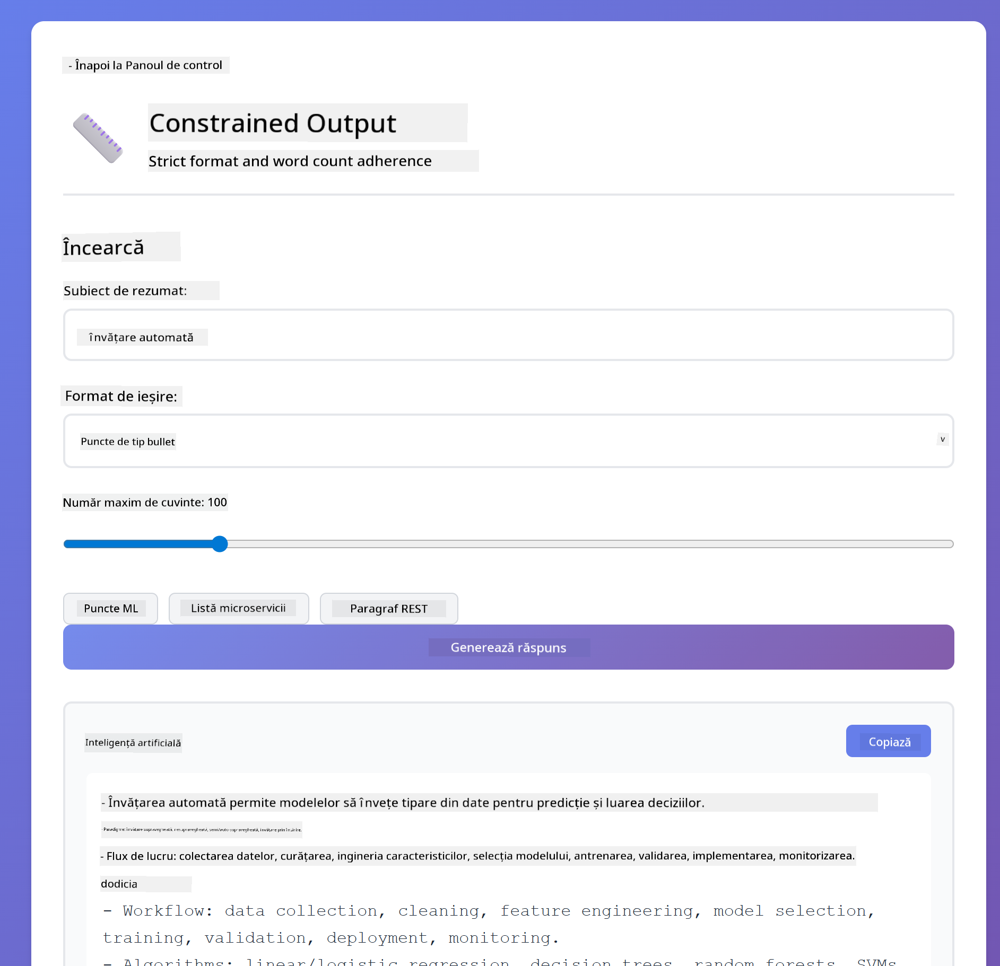

*Rezumat de machine learning cu control al formatului*

## Ce înveți cu adevărat

**Efortul de raționament schimbă totul**

GPT-5 îți permite să controlezi efortul computațional prin prompturi. Efortul scăzut înseamnă răspunsuri rapide cu explorare minimă. Efortul ridicat înseamnă că modelul ia timp să gândească profund. Înveți să potrivești efortul cu complexitatea sarcinii - nu pierde timp pe întrebări simple, dar nici nu te grăbi la decizii complexe.

**Structura ghidează comportamentul**

Observi etichetele XML din prompturi? Nu sunt decorative. Modelele urmează instrucțiuni structurate mai fiabil decât textul liber. Când ai nevoie de procese în mai mulți pași sau logică complexă, structura ajută modelul să știe unde este și ce urmează.


*Anatomia unui prompt bine structurat cu secțiuni clare și organizare în stil XML*

**Calitatea prin auto-evaluare**

Tiparele auto-reflective funcționează prin explicitarea criteriilor de calitate. În loc să speri că modelul „face bine”, îi spui exact ce înseamnă „bine”: logică corectă, gestionarea erorilor, performanță, securitate. Modelul poate apoi să-și evalueze propria ieșire și să se îmbunătățească. Astfel, generarea de cod devine un proces, nu o loterie.

**Contextul este finit**

Conversațiile multi-turn funcționează prin includerea istoricului mesajelor la fiecare cerere. Dar există o limită - fiecare model are un număr maxim de tokeni. Pe măsură ce conversațiile cresc, vei avea nevoie de strategii pentru a păstra contextul relevant fără a atinge plafonul. Acest modul îți arată cum funcționează memoria; mai târziu vei învăța când să rezumi, când să uiți și când să recuperezi.

## Pașii următori

**Următorul modul:** [03-rag - RAG (Generare augmentată prin recuperare)](../03-rag/README.md)

---

**Navigare:** [← Anterior: Modul 01 - Introducere](../01-introduction/README.md) | [Înapoi la Principal](../README.md) | [Următor: Modul 03 - RAG →](../03-rag/README.md)

---

<!-- CO-OP TRANSLATOR DISCLAIMER START -->
**Declinare de responsabilitate**:  
Acest document a fost tradus folosind serviciul de traducere AI [Co-op Translator](https://github.com/Azure/co-op-translator). Deși ne străduim pentru acuratețe, vă rugăm să rețineți că traducerile automate pot conține erori sau inexactități. Documentul original în limba sa nativă trebuie considerat sursa autorizată. Pentru informații critice, se recomandă traducerea profesională realizată de un specialist uman. Nu ne asumăm răspunderea pentru eventualele neînțelegeri sau interpretări greșite rezultate din utilizarea acestei traduceri.
<!-- CO-OP TRANSLATOR DISCLAIMER END -->