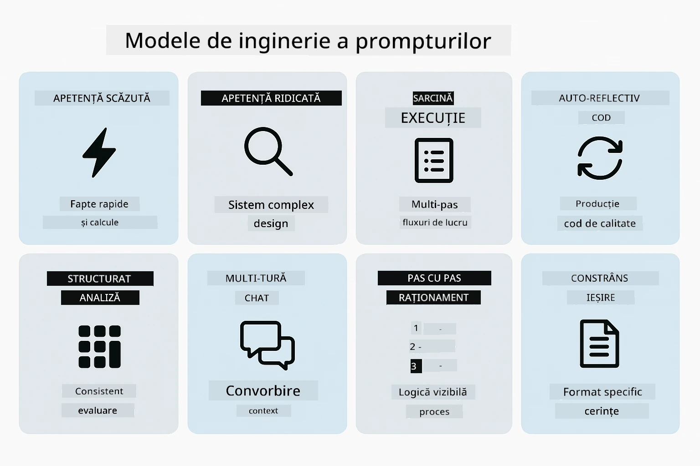
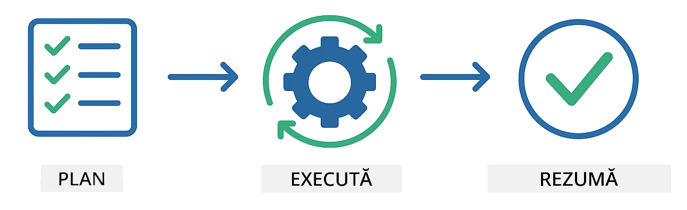
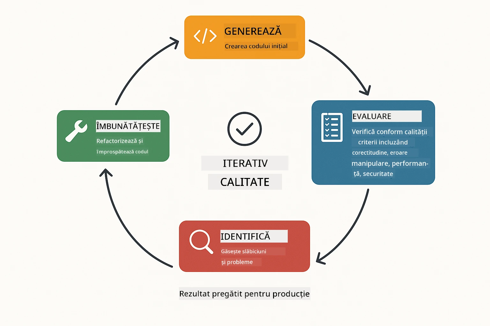
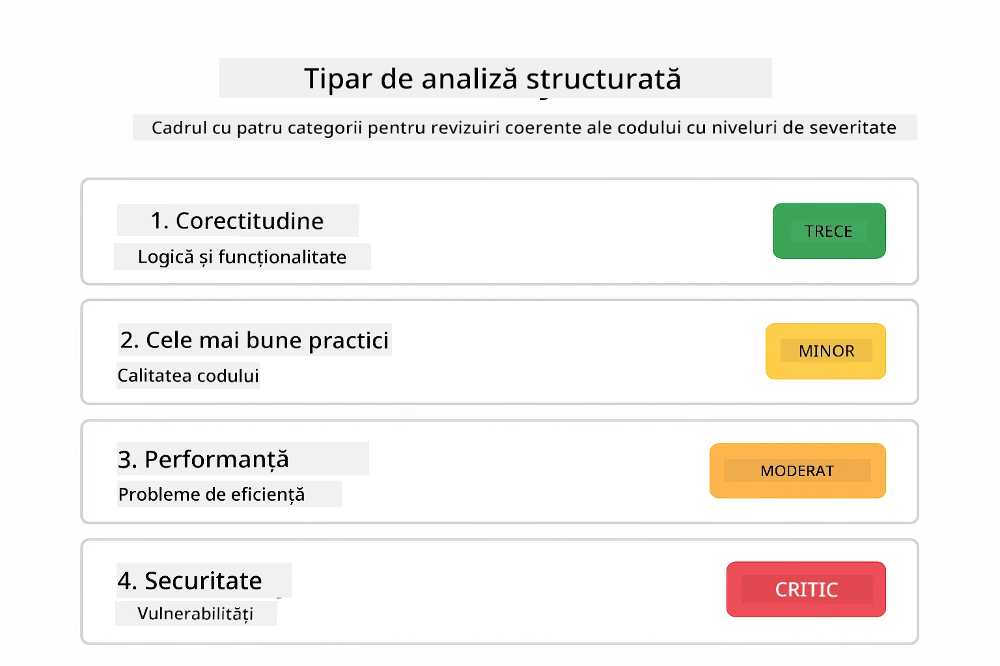
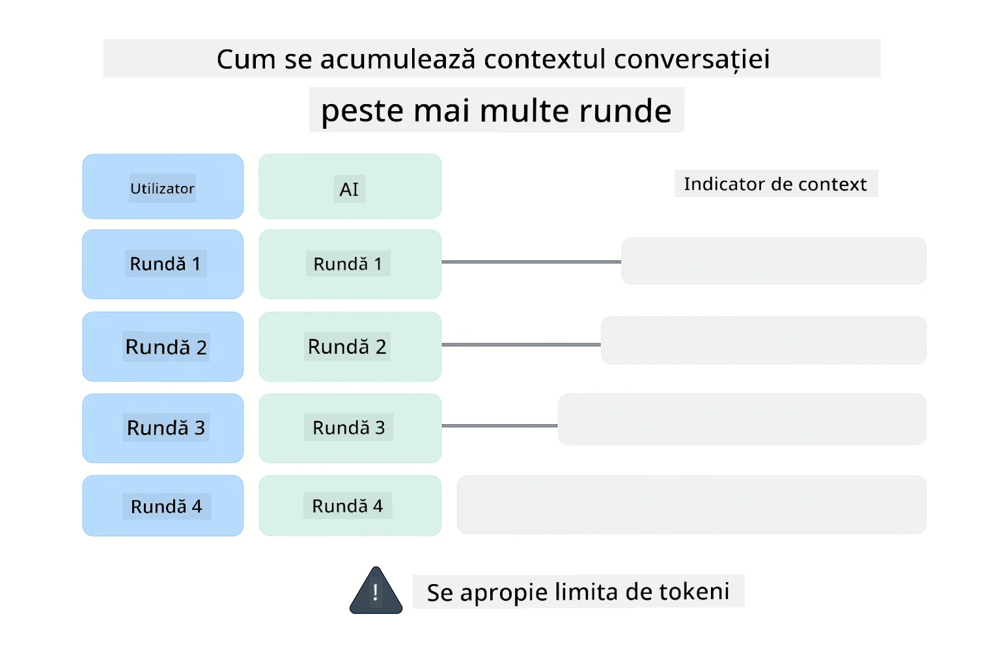
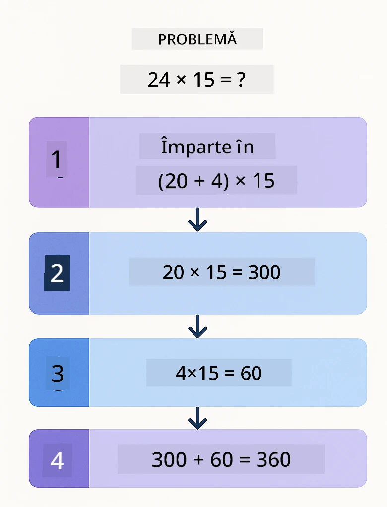
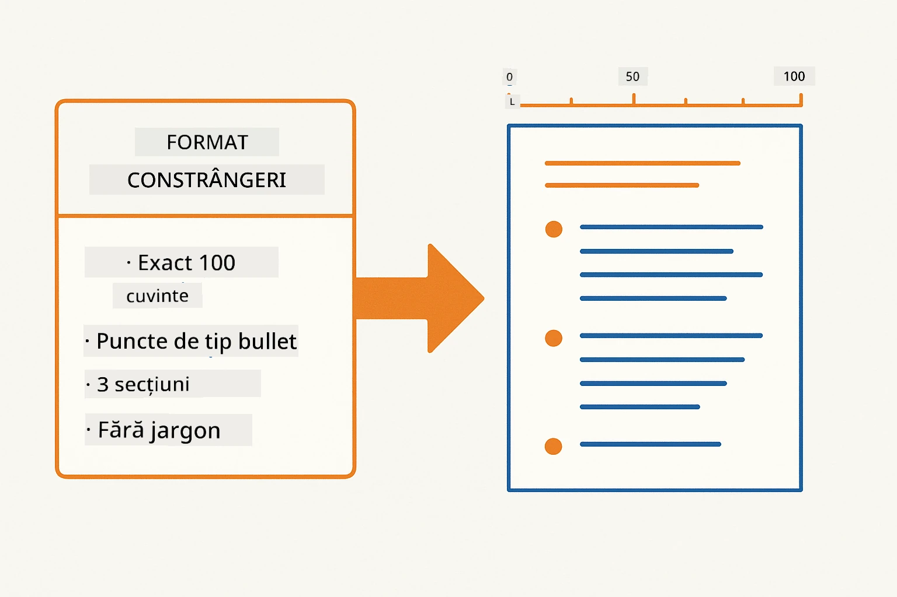
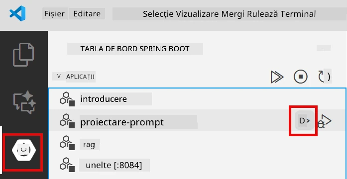
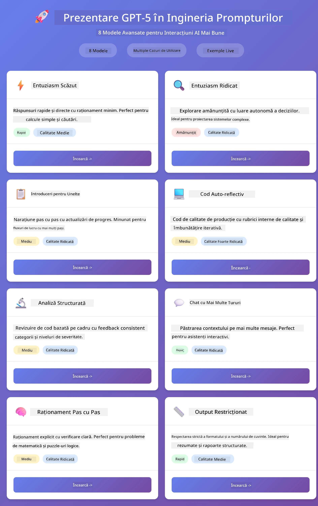
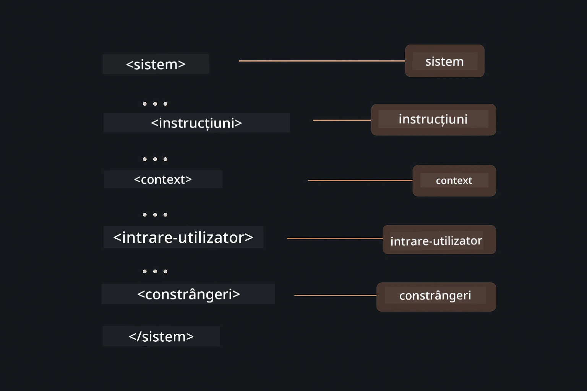

# Modulul 02: Ingineria Prompturilor cu GPT-5.2

## Cuprins

- [Parcurgere Video](#parcurgere-video)
- [Ce Vei Învăța](#ce-vei-învăța)
- [Precondiții](#precondiții)
- [Înțelegerea Ingineriei Prompturilor](#înțelegerea-ingineriei-prompturilor)
- [Fundamentele Ingineriei Prompturilor](#fundamentele-ingineriei-prompturilor)
  - [Zero-Shot Prompting](#zero-shot-prompting)
  - [Few-Shot Prompting](#few-shot-prompting)
  - [Chain of Thought](#chain-of-thought)
  - [Role-Based Prompting](#role-based-prompting)
  - [Șabloane de Prompturi](#șabloane-de-prompturi)
- [Modele Avansate](#modele-avansate)
- [Rularea Aplicației](#rulează-aplicația)
- [Capturi de Ecran ale Aplicației](#capturi-de-ecran-ale-aplicației)
- [Explorarea Modelelor](#explorarea-modelelor)
  - [Energie Joasă vs Energie Ridicată](#low-vs-high-eagerness)
  - [Execuția Sarcinilor (Premisele Instrumentelor)](#executarea-sarcinilor-introductive-de-instrument)
  - [Cod ce Reflectă asupra Sa](#cod-auto-reflectiv)
  - [Analiză Structurată](#analiză-structurată)
  - [Chat cu Tururi Multiple](#chat-multi-rundă)
  - [Raționament Pas cu Pas](#raționament-pas-cu-pas)
  - [Output Constrâns](#output-constrâns)
- [Ce Înveți Cu Adevărat](#ce-înveți-cu-adevărat)
- [Pașii Următori](#pașii-următori)

## Parcurgere Video

Urmărește această sesiune live care explică cum să începi cu acest modul:

<a href="https://www.youtube.com/live/PJ6aBaE6bog?si=LDshyBrTRodP-wke"></a>

## Ce Vei Învăța

Diagrama următoare oferă o privire de ansamblu asupra subiectelor și abilităților cheie pe care le vei dezvolta în acest modul — de la tehnici de rafinare a prompturilor până la fluxul de lucru pas cu pas pe care îl vei urma.


În modulul precedent, ai văzut cum memoria permite AI conversațional cu Azure OpenAI. Acum ne vom concentra pe cum pui întrebări — pe prompturile în sine — folosind GPT-5.2 de la Azure OpenAI. Modul în care îți structurezi prompturile afectează dramatic calitatea răspunsurilor pe care le primești. Începem cu o recenzie a tehnicilor fundamentale de prompting, apoi trecem la opt modele avansate care valorifică pe deplin capabilitățile GPT-5.2.

Vom folosi GPT-5.2 pentru că introduce controlul raționamentului – poți spune modelului cât de mult să gândească înainte de a răspunde. Aceasta face strategiile diferite de prompting mai evidente și te ajută să înțelegi când să folosești fiecare abordare.

## Precondiții

- Modului 01 finalizat (resurse Azure OpenAI implementate)
- Fișier `.env` în directorul rădăcină cu acreditările Azure (creat de `azd up` în Modulul 01)

> **Notă:** Dacă nu ai terminat Modulul 01, urmează mai întâi instrucțiunile de implementare de acolo.

## Înțelegerea Ingineriei Prompturilor

La bază, ingineria prompturilor este diferența între instrucțiuni vagi și precise, după cum ilustrează comparația de mai jos.


Ingineria prompturilor înseamnă proiectarea textului de intrare care să-ți ofere consecvent rezultatele de care ai nevoie. Nu este vorba doar despre a pune întrebări - ci despre structurarea cererilor astfel încât modelul să înțeleagă exact ce vrei și cum să-l livreze.

Gândește-te la asta ca la oferirea de instrucțiuni unui coleg. „Rezolvă bug-ul” e vag. „Rezolvă excepția null pointer în UserService.java, linia 45, adăugând o verificare null” este specific. Modelele de limbaj funcționează la fel – specificitatea și structura contează.

Diagrama de mai jos arată cum se integrează LangChain4j în această imagine — conectând modelele de prompt la model prin blocuri de construcție SystemMessage și UserMessage.


LangChain4j oferă infrastructura — conexiuni cu modelul, memorie și tipuri de mesaje — în timp ce modelele de prompt sunt doar text structurat cu grijă pe care îl trimiți prin acea infrastructură. Blocurile de construcție cheie sunt `SystemMessage` (care setează comportamentul și rolul AI-ului) și `UserMessage` (care poartă cererea ta efectivă).

## Fundamentele Ingineriei Prompturilor

Cele cinci tehnici de bază prezentate mai jos formează temelia unei inginerii eficiente a prompturilor. Fiecare abordează un aspect diferit al modului în care comunici cu modelele de limbaj.


Înainte de a trece la modelele avansate din acest modul, să revizuim cinci tehnici fundamentale de prompting. Acestea sunt pietrele de temelie pe care orice inginer de prompturi ar trebui să le cunoască.

### Zero-Shot Prompting

Cea mai simplă abordare: dă modelului o instrucțiune directă fără exemple. Modelul se bazează complet pe antrenamentul său pentru a înțelege și executa sarcina. Aceasta funcționează bine pentru cereri simple, unde comportamentul așteptat este evident.


*Instrucțiune directă fără exemple — modelul deduce sarcina doar din instrucțiune*

```java
String prompt = "Classify this sentiment: 'I absolutely loved the movie!'";
String response = model.chat(prompt);
// Răspuns: "Pozitiv"
```

**Când să folosești:** Clasificări simple, întrebări directe, traduceri sau orice sarcină pe care modelul o poate gestiona fără ghidaj suplimentar.

### Few-Shot Prompting

Oferă exemple care demonstrează modelul pe care vrei să-l urmeze modelul. Modelul învață formatul așteptat intrare-ieșire din exemplele tale și îl aplică pentru noile intrări. Aceasta îmbunătățește dramatic consistența pentru sarcini în care formatul sau comportamentul dorit nu sunt evidente.


*Învață din exemple — modelul identifică modelul și îl aplică la noile intrări*

```java
String prompt = """
    Classify the sentiment as positive, negative, or neutral.
    
    Examples:
    Text: "This product exceeded my expectations!" → Positive
    Text: "It's okay, nothing special." → Neutral
    Text: "Waste of money, very disappointed." → Negative
    
    Now classify this:
    Text: "Best purchase I've made all year!"
    """;
String response = model.chat(prompt);
```

**Când să folosești:** Clasificări personalizate, formatare consistentă, sarcini specifice domeniului sau când rezultatele zero-shot sunt inconsistente.

### Chain of Thought

Cere modelului să-și arate raționamentul pas cu pas. În loc să sară direct la un răspuns, modelul descompune problema și parcurge fiecare parte explicit. Aceasta îmbunătățește acuratețea la probleme matematice, de logică și raționamente în mai mulți pași.


*Raționament pas cu pas — descompunerea problemelor complexe în pași logici expliciți*

```java
String prompt = """
    Problem: A store has 15 apples. They sell 8 apples and then 
    receive a shipment of 12 more apples. How many apples do they have now?
    
    Let's solve this step-by-step:
    """;
String response = model.chat(prompt);
// Modelul arată: 15 - 8 = 7, apoi 7 + 12 = 19 mere
```

**Când să folosești:** Probleme de matematică, puzzle-uri logice, depanare sau orice sarcină unde arătarea procesului de raționament crește acuratețea și încrederea.

### Role-Based Prompting

Setează o persoană sau un rol pentru AI înainte de a pune întrebarea. Aceasta oferă context care modelează tonul, profunzimea și focalizarea răspunsului. Un „arhitect software” oferă sfaturi diferite față de un „dezvoltator junior” sau un „auditor de securitate”.


*Setarea contextului și a persoanei — aceeași întrebare primește răspuns diferit în funcție de rol*

```java
String prompt = """
    You are an experienced software architect reviewing code.
    Provide a brief code review for this function:
    
    def calculate_total(items):
        total = 0
        for item in items:
            total = total + item['price']
        return total
    """;
String response = model.chat(prompt);
```

**Când să folosești:** Revizuiri de cod, tutoring, analize specifice domeniului sau când ai nevoie de răspunsuri adaptate unui anumit nivel de expertiză sau perspectivă.

### Șabloane de Prompturi

Creează prompturi reutilizabile cu variabile. În loc să scrii un prompt nou de fiecare dată, definește un șablon odată și completează cu valori diferite. Clasa `PromptTemplate` din LangChain4j face acest lucru ușor cu sintaxa `{{variable}}`.


*Prompturi reutilizabile cu locuri pentru variabile — un șablon, multe utilizări*

```java
PromptTemplate template = PromptTemplate.from(
    "What's the best time to visit {{destination}} for {{activity}}?"
);

Prompt prompt = template.apply(Map.of(
    "destination", "Paris",
    "activity", "sightseeing"
));

String response = model.chat(prompt.text());
```

**Când să folosești:** Interogări repetate cu intrări diferite, procesare pe loturi, construirea de fluxuri de lucru AI reutilizabile sau orice scenariu unde structura promptului rămâne aceeași, dar datele se schimbă.

---

Aceste cinci fundamentale îți oferă un set solid de instrumente pentru majoritatea sarcinilor de prompting. Restul modulului se construiește pe ele cu **opt modele avansate** care valorifică controlul raționamentului, autoevaluarea și capabilitățile de output structurat ale GPT-5.2.

## Modele Avansate

După ce fundamentele au fost acoperite, să trecem la cele opt modele avansate care fac acest modul unic. Nu toate problemele necesită aceeași abordare. Unele întrebări cer răspunsuri rapide, altele gândire profundă. Unele cer raționament vizibil, altele doar rezultate. Fiecare model de mai jos este optimizat pentru un scenariu diferit — iar controlul raționamentului al GPT-5.2 face diferențele și mai evidente.



*Privire de ansamblu asupra celor opt modele de inginerie prompt și cazurile lor de utilizare*

GPT-5.2 adaugă o dimensiune suplimentară acestor modele: *controlul raționamentului*. Glisorul de mai jos arată cum poți ajusta efortul de gândire al modelului — de la răspunsuri rapide și directe până la analiză profundă și temeinică.


*Controlul raționamentului GPT-5.2 îți permite să specifici cât de multă gândire să facă modelul — de la răspunsuri rapide și directe la explorare profundă*

**Energie Joasă (Rapid & Focalizat)** - Pentru întrebări simple unde vrei răspunsuri rapide și directe. Modelul face un raționament minimal - maxim 2 pași. Folosește asta pentru calcule, căutări sau întrebări simple.

```java
String prompt = """
    <context_gathering>
    - Search depth: very low
    - Bias strongly towards providing a correct answer as quickly as possible
    - Usually, this means an absolute maximum of 2 reasoning steps
    - If you think you need more time, state what you know and what's uncertain
    </context_gathering>
    
    Problem: What is 15% of 200?
    
    Provide your answer:
    """;

String response = chatModel.chat(prompt);
```

> 💡 **Explorează cu GitHub Copilot:** Deschide [`Gpt5PromptService.java`](../../../02-prompt-engineering/src/main/java/com/example/langchain4j/prompts/service/Gpt5PromptService.java) și întreabă:
> - "Care este diferența dintre modelele de prompting cu energie joasă și cea ridicată?"
> - "Cum ajută etichetele XML din prompturi la structurarea răspunsului AI?"
> - "Când ar trebui să folosesc modelele de auto-reflecție vs instrucțiuni directe?"

**Energie Ridicată (Profund & Temeinic)** - Pentru probleme complexe unde vrei o analiză cuprinzătoare. Modelul explorează temeinic și arată raționamentul detaliat. Folosește asta pentru proiectarea sistemelor, decizii de arhitectură sau cercetare complexă.

```java
String prompt = """
    Analyze this problem thoroughly and provide a comprehensive solution.
    Consider multiple approaches, trade-offs, and important details.
    Show your analysis and reasoning in your response.
    
    Problem: Design a caching strategy for a high-traffic REST API.
    """;

String response = chatModel.chat(prompt);
```

**Execuția Sarcinii (Progres Pas cu Pas)** - Pentru fluxuri de lucru în mai mulți pași. Modelul oferă un plan inițial, povestește fiecare pas pe măsură ce lucrează, apoi oferă un rezumat. Folosește asta pentru migrații, implementări sau orice proces în mai mulți pași.

```java
String prompt = """
    <task_execution>
    1. First, briefly restate the user's goal in a friendly way
    
    2. Create a step-by-step plan:
       - List all steps needed
       - Identify potential challenges
       - Outline success criteria
    
    3. Execute each step:
       - Narrate what you're doing
       - Show progress clearly
       - Handle any issues that arise
    
    4. Summarize:
       - What was completed
       - Any important notes
       - Next steps if applicable
    </task_execution>
    
    <tool_preambles>
    - Always begin by rephrasing the user's goal clearly
    - Outline your plan before executing
    - Narrate each step as you go
    - Finish with a distinct summary
    </tool_preambles>
    
    Task: Create a REST endpoint for user registration
    
    Begin execution:
    """;

String response = chatModel.chat(prompt);
```

Promptul Chain-of-Thought cere explicit modelului să arate procesul său de raționament, îmbunătățind precizia pentru sarcini complexe. Descompunerea pas cu pas ajută atât oamenii, cât și AI să înțeleagă logica.

> **🤖 Încearcă cu Chat-ul [GitHub Copilot](https://github.com/features/copilot):** Întreabă despre acest model:
> - "Cum aș adapta modelul de execuție a sarcinii pentru operațiuni de durată lungă?"
> - "Care sunt bunele practici pentru structurarea premiselor instrumentelor în aplicații de producție?"
> - "Cum pot captura și afișa actualizări de progres intermediare într-o interfață?"

Diagrama de mai jos ilustrează acest flux Planificare → Execuție → Rezumare.



*Flux Planificare → Execuție → Rezumare pentru sarcini în mai mulți pași*

**Cod ce Reflectă asupra Sa** - Pentru generarea de cod de calitate pentru producție. Modelul generează cod urmând standarde de producție cu gestionarea corectă a erorilor. Folosește asta când creezi funcționalități noi sau servicii.

```java
String prompt = """
    Generate Java code with production-quality standards: Create an email validation service
    Keep it simple and include basic error handling.
    """;

String response = chatModel.chat(prompt);
```

Diagrama de mai jos arată acest ciclu iterativ de îmbunătățire — generează, evaluează, identifică punctele slabe și rafinează până când codul îndeplinește standardele de producție.



*Ciclu iterativ de îmbunătățire - generează, evaluează, identifică probleme, îmbunătățește, repetă*

**Analiză Structurată** - Pentru evaluare consistentă. Modelul revizuiește codul folosind un cadru fix (corectitudine, practici, performanță, securitate, întreținere). Folosește asta pentru revizuiri de cod sau evaluări de calitate.

```java
String prompt = """
    <analysis_framework>
    You are an expert code reviewer. Analyze the code for:
    
    1. Correctness
       - Does it work as intended?
       - Are there logical errors?
    
    2. Best Practices
       - Follows language conventions?
       - Appropriate design patterns?
    
    3. Performance
       - Any inefficiencies?
       - Scalability concerns?
    
    4. Security
       - Potential vulnerabilities?
       - Input validation?
    
    5. Maintainability
       - Code clarity?
       - Documentation?
    
    <output_format>
    Provide your analysis in this structure:
    - Summary: One-sentence overall assessment
    - Strengths: 2-3 positive points
    - Issues: List any problems found with severity (High/Medium/Low)
    - Recommendations: Specific improvements
    </output_format>
    </analysis_framework>
    
    Code to analyze:
    ```
    public List getUsers() {
        return database.query("SELECT * FROM users");
    }
    ```
    Provide your structured analysis:
    """;

String response = chatModel.chat(prompt);
```

> **🤖 Încearcă cu Chat-ul [GitHub Copilot](https://github.com/features/copilot):** Întreabă despre analiza structurată:
> - "Cum pot personaliza cadrul de analiză pentru diferite tipuri de revizuiri de cod?"
> - "Care este cea mai bună metodă de a parsa și acționa pe output structurat programatic?"
> - "Cum asigur niveluri consistente de severitate în diferite sesiuni de revizuire?"

Diagrama următoare arată cum acest cadru structurat organizează o revizuire de cod în categorii consistente cu nivele de severitate.



*Cadru pentru revizuiri de cod consistente cu nivele de severitate*

**Chat cu Tururi Multiple** - Pentru conversații care necesită context. Modelul își amintește mesajele anterioare și construiește pe baza lor. Folosește asta pentru sesiuni de ajutor interactive sau întrebări complexe.

```java
ChatMemory memory = MessageWindowChatMemory.withMaxMessages(10);

memory.add(UserMessage.from("What is Spring Boot?"));
AiMessage aiMessage1 = chatModel.chat(memory.messages()).aiMessage();
memory.add(aiMessage1);

memory.add(UserMessage.from("Show me an example"));
AiMessage aiMessage2 = chatModel.chat(memory.messages()).aiMessage();
memory.add(aiMessage2);
```

Diagrama de mai jos vizualizează cum contextul conversației se acumulează cu fiecare tur și cum se raportează la limita de tokeni a modelului.



*Cum se acumulează contextul conversației pe mai multe tururi până la atingerea limitei de tokeni*

**Raționament Pas cu Pas** - Pentru probleme care cer logică vizibilă. Modelul arată raționamentul explicit pentru fiecare pas. Folosește asta pentru probleme matematice, puzzle-uri logice sau când ai nevoie să înțelegi procesul de gândire.

```java
String prompt = """
    <instruction>Show your reasoning step-by-step</instruction>
    
    If a train travels 120 km in 2 hours, then stops for 30 minutes,
    then travels another 90 km in 1.5 hours, what is the average speed
    for the entire journey including the stop?
    """;

String response = chatModel.chat(prompt);
```

Diagrama de mai jos ilustrează cum modelul descompune problemele în pași logici numerotați explicit.


*Descompunerea problemelor în pași logici expliciți*

**Output Constrâns** - Pentru răspunsuri cu cerințe specifice de format. Modelul respectă strict regulile de format și lungime. Folosește asta pentru rezumate sau când ai nevoie de o structură precisă a outputului.

```java
String prompt = """
    <constraints>
    - Exactly 100 words
    - Bullet point format
    - Technical terms only
    </constraints>
    
    Summarize the key concepts of machine learning.
    """;

String response = chatModel.chat(prompt);
```

Diagrama următoare arată cum constrângerile ghidează modelul să producă un output care respectă strict cerințele tale de format și lungime.



*Aplicarea cerințelor specifice de format, lungime și structură*

## Rulează Aplicația

**Verifică implementarea:**

Asigură-te că fișierul `.env` există în directorul rădăcină cu datele de autentificare Azure (create în timpul Modulului 01). Rulează din directorul modulului (`02-prompt-engineering/`):

**Bash:**  
```bash
cat ../.env  # Ar trebui să afișeze AZURE_OPENAI_ENDPOINT, API_KEY, DEPLOYMENT
```
  
**PowerShell:**  
```powershell
Get-Content ..\.env  # Ar trebui să afișeze AZURE_OPENAI_ENDPOINT, API_KEY, DEPLOYMENT
```
  
**Pornește aplicația:**

> **Notă:** Dacă ai pornit deja toate aplicațiile folosind `./start-all.sh` din directorul rădăcină (așa cum s-a descris în Modulul 01), acest modul rulează deja pe portul 8083. Poți sări peste comenzile de start de mai jos și să accesezi direct http://localhost:8083.

**Opțiunea 1: Folosind Spring Boot Dashboard (Recomandat pentru utilizatorii VS Code)**

Containerul de dezvoltare include extensia Spring Boot Dashboard, care oferă o interfață vizuală pentru a gestiona toate aplicațiile Spring Boot. O găsești în bara de activități din partea stângă a VS Code (caută pictograma Spring Boot).

Din Spring Boot Dashboard poți:  
- Vizualiza toate aplicațiile Spring Boot disponibile în workspace  
- Porni/opri aplicațiile cu un singur clic  
- Vizualiza în timp real log-urile aplicațiilor  
- Monitoriza starea aplicațiilor

Pur și simplu dă clic pe butonul play de lângă "prompt-engineering" pentru a porni acest modul, sau pornește toate modulele simultan.



*Spring Boot Dashboard în VS Code — pornește, oprește și monitorizează toate modulele dintr-un singur loc*

**Opțiunea 2: Folosind scripturi shell**

Pornește toate aplicațiile web (modulele 01-04):

**Bash:**  
```bash
cd ..  # Din directorul rădăcină
./start-all.sh
```
  
**PowerShell:**  
```powershell
cd ..  # Din directorul rădăcină
.\start-all.ps1
```
  
Sau pornește doar acest modul:

**Bash:**  
```bash
cd 02-prompt-engineering
./start.sh
```
  
**PowerShell:**  
```powershell
cd 02-prompt-engineering
.\start.ps1
```
  
Ambele scripturi încarcă automat variabilele de mediu din fișierul `.env` de la rădăcină și vor construi fișierele JAR dacă acestea nu există.

> **Notă:** Dacă preferi să construiești manual toate modulele înainte de pornire:
>
> **Bash:**  
> ```bash
> cd ..  # Go to root directory
> mvn clean package -DskipTests
> ```
  
> **PowerShell:**  
> ```powershell
> cd ..  # Go to root directory
> mvn clean package -DskipTests
> ```


Deschide http://localhost:8083 în browser.

**Pentru oprire:**

**Bash:**  
```bash
./stop.sh  # Numai acest modul
# Sau
cd .. && ./stop-all.sh  # Toate modulele
```
  
**PowerShell:**  
```powershell
.\stop.ps1  # Numai acest modul
# Sau
cd ..; .\stop-all.ps1  # Toate modulele
```
  
## Capturi de ecran ale aplicației

Iată interfața principală a modulului de inginerie a prompturilor, unde poți experimenta cu toate cele opt modele unul lângă altul.



*Dashboard-ul principal afișând toate cele 8 modele de inginerie a prompturilor cu caracteristicile și cazurile de utilizare*

## Explorarea modelelor

Interfața web îți permite să experimentezi diferite strategii de prompting. Fiecare model rezolvă probleme diferite - încearcă-le să vezi când se evidențiază fiecare abordare.

> **Notă: Streaming vs Non-Streaming** — Fiecare pagină a unui model oferă două butoane: **🔴 Stream Response (Live)** și o opțiune **Non-streaming**. Streaming folosește Server-Sent Events (SSE) pentru a afișa în timp real tokenii generați de model, astfel vezi progresul imediat. Opțiunea non-streaming așteaptă răspunsul complet înainte de afișare. Pentru prompturi care declanșează raționamente profunde (de ex. High Eagerness, Self-Reflecting Code), apelul non-streaming poate dura foarte mult timp — uneori minute — fără feedback vizibil. **Folosește streaming când experimentezi cu prompturi complexe** ca să vezi modelul lucrând și să eviți impresia că cererea a expirat.
>
> **Notă: Cerință Browser** — Funcția de streaming folosește Fetch Streams API (`response.body.getReader()`) care necesită un browser complet (Chrome, Edge, Firefox, Safari). Nu funcționează în Simple Browser-ul integrat în VS Code, deoarece webview-ul său nu suportă ReadableStream API. Dacă folosești Simple Browser, butoanele non-streaming funcționează normal — doar cele de streaming sunt afectate. Deschide `http://localhost:8083` într-un browser extern pentru experiența completă.

### Low vs High Eagerness

Pune o întrebare simplă precum „Care este 15% din 200?” folosind Low Eagerness. Primești un răspuns direct și instant. Acum pune ceva complex, ca „Proiectează o strategie de caching pentru o API cu trafic ridicat” folosind High Eagerness. Apasă **🔴 Stream Response (Live)** și urmărește raționamentul detaliat token cu token al modelului. Același model, aceeași structură a întrebării - dar promptul îi spune cât să gândească.

### Executarea sarcinilor (Introductive de instrument)

Fluxurile de lucru cu mai mulți pași beneficiază de planificare înainte și nararea progresului. Modelul descrie ce va face, narrează fiecare pas, apoi rezumă rezultatele.

### Cod auto-reflectiv

Încearcă „Creează un serviciu de validare email”. În loc să genereze doar cod și să se oprească, modelul generează, evaluează după criterii de calitate, identifică slăbiciuni și îmbunătățește. Vei vedea iterații până când codul atinge standarde de producție.

### Analiză structurată

Review-urile de cod au nevoie de cadre de evaluare constante. Modelul analizează codul folosind categorii fixe (corectitudine, practici, performanță, securitate) cu niveluri de severitate.

### Chat multi-rundă

Întreabă „Ce este Spring Boot?” apoi imediat continuă cu „Arată-mi un exemplu”. Modelul își amintește prima întrebare și îți oferă un exemplu Spring Boot specializat. Fără memorie, a doua întrebare ar fi vague.

### Raționament pas cu pas

Alege o problemă de matematică și încearc-o cu Step-by-Step Reasoning și Low Eagerness. Low eagerness îți dă doar răspunsul – rapid, dar opac. Raționamentul pas cu pas îți arată fiecare calcul și decizie.

### Output Constrâns

Când ai nevoie de formate specifice sau număr fix de cuvinte, acest model impune respectarea strictă. Încearcă să generezi un rezumat cu exact 100 de cuvinte în format listat.

## Ce înveți cu adevărat

**Efortul de raționament schimbă totul**

GPT-5.2 îți permite să controlezi efortul computațional prin prompturi. Efort mic înseamnă răspunsuri rapide cu explorare minimă. Efort mare înseamnă că modelul alocă timp pentru un gând profund. Înveți să potrivești efortul cu complexitatea sarcinii – nu pierde timpul pe întrebări simple, dar nici nu te grăbi cu deciziile complexe.

**Structura ghidează comportamentul**

Ai observat tag-urile XML din prompturi? Nu sunt decorative. Modelele urmează instrucțiuni structurate mai fiabil decât textul liber. Când ai nevoie de procese multi-pas sau logică complexă, structura ajută modelul să știe unde se află și ce urmează. Diagrama de mai jos descompune un prompt bine structurat, arătând cum tag-uri ca `<system>`, `<instructions>`, `<context>`, `<user-input>`, și `<constraints>` organizează instrucțiunile în secțiuni clare.



*Anatomia unui prompt bine structurat cu secțiuni clare și organizare de tip XML*

**Calitate prin auto-evaluare**

Modelele auto-reflective funcționează prin explicitarea criteriilor de calitate. În loc să speri că modelul „face bine”, îi spui exact ce înseamnă „bine”: logică corectă, gestionarea erorilor, performanță, securitate. Modelul poate evalua apoi singur output-ul și îmbunătăți. Transformă generarea de cod din loterie într-un proces.

**Contextul este limitat**

Conversațiile multi-turn funcționează prin includerea istoricului mesajelor la fiecare cerere. Dar există o limită - fiecare model are un număr maxim de tokeni. Pe măsură ce conversațiile cresc, ai nevoie de strategii pentru a păstra context relevant fără a atinge limita. Acest modul îți arată cum funcționează memoria; mai târziu vei învăța când să rezumi, când să uiți și când să reiei.

## Pașii următori

**Următorul modul:** [03-rag - RAG (Generare augmentată prin recuperare)](../03-rag/README.md)

---

**Navigare:** [← Anterior: Modul 01 - Introducere](../01-introduction/README.md) | [Înapoi la Principal](../README.md) | [Următor: Modul 03 - RAG →](../03-rag/README.md)

---

<!-- CO-OP TRANSLATOR DISCLAIMER START -->
**Declinare a responsabilității**:
Acest document a fost tradus folosind serviciul de traducere AI [Co-op Translator](https://github.com/Azure/co-op-translator). În timp ce ne străduim pentru acuratețe, vă rugăm să rețineți că traducerile automate pot conține erori sau inexactități. Documentul original în limba sa nativă trebuie considerat sursa autorizată. Pentru informații critice, se recomandă traducerea profesională realizată de un om. Nu ne asumăm responsabilitatea pentru eventualele neînțelegeri sau interpretări greșite care decurg din utilizarea acestei traduceri.
<!-- CO-OP TRANSLATOR DISCLAIMER END -->