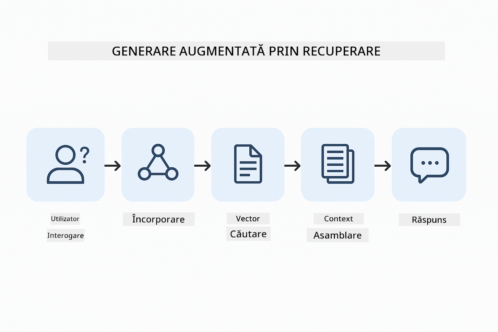
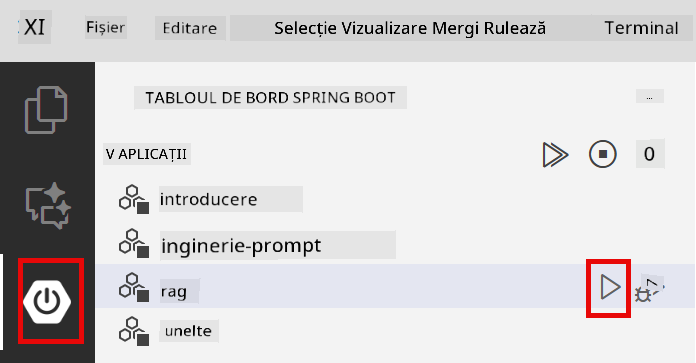
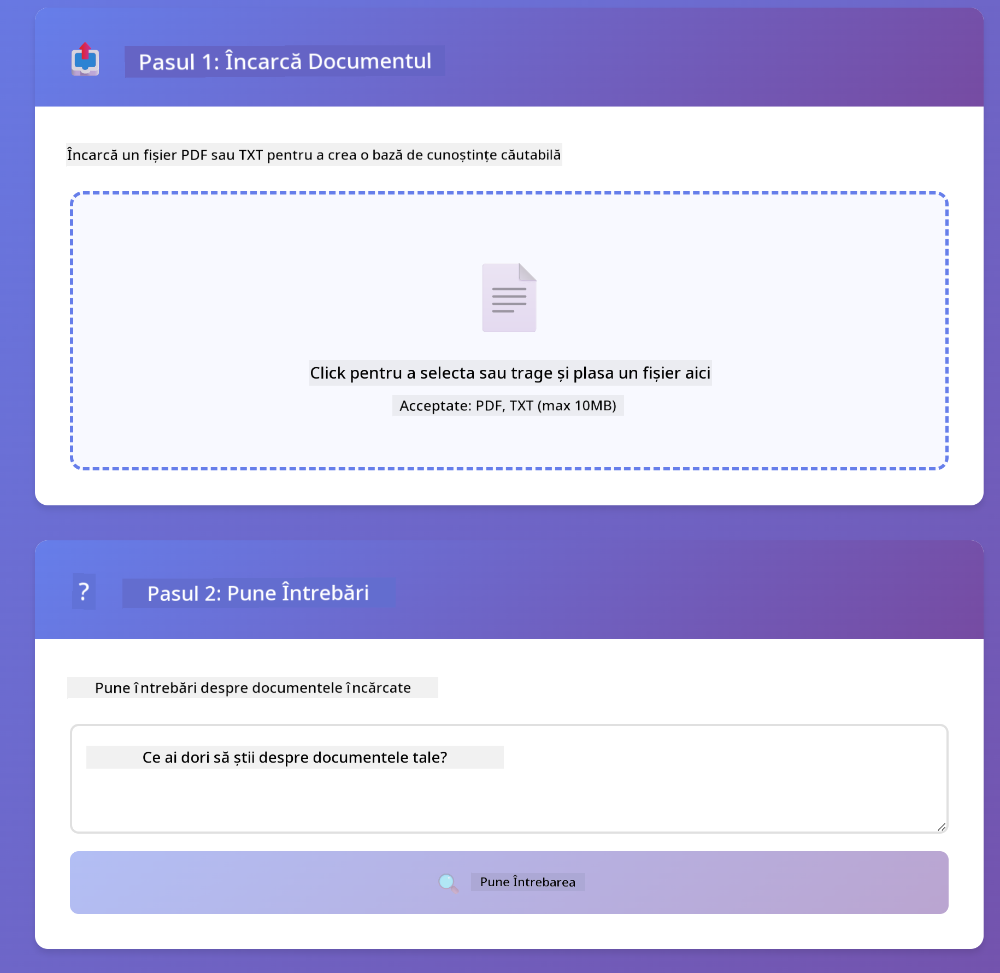
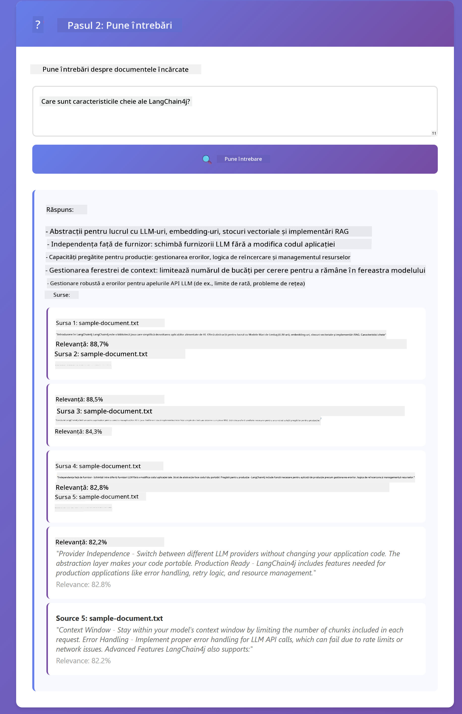

<!--
CO_OP_TRANSLATOR_METADATA:
{
  "original_hash": "f538a51cfd13147d40d84e936a0f485c",
  "translation_date": "2025-12-13T17:16:28+00:00",
  "source_file": "03-rag/README.md",
  "language_code": "ro"
}
-->
# Modulul 03: RAG (Generare Augmentată cu Recuperare)

## Cuprins

- [Ce Vei Învăța](../../../03-rag)
- [Prerechizite](../../../03-rag)
- [Înțelegerea RAG](../../../03-rag)
- [Cum Funcționează](../../../03-rag)
  - [Procesarea Documentelor](../../../03-rag)
  - [Crearea Embedding-urilor](../../../03-rag)
  - [Căutare Semantică](../../../03-rag)
  - [Generarea Răspunsurilor](../../../03-rag)
- [Rularea Aplicației](../../../03-rag)
- [Folosirea Aplicației](../../../03-rag)
  - [Încărcarea unui Document](../../../03-rag)
  - [Adresarea Întrebărilor](../../../03-rag)
  - [Verificarea Referințelor Sursă](../../../03-rag)
  - [Experimentarea cu Întrebări](../../../03-rag)
- [Concepte Cheie](../../../03-rag)
  - [Strategia de Împărțire în Bucăți](../../../03-rag)
  - [Scoruri de Similaritate](../../../03-rag)
  - [Stocare în Memorie](../../../03-rag)
  - [Gestionarea Ferestrei de Context](../../../03-rag)
- [Când Contează RAG](../../../03-rag)
- [Pașii Următori](../../../03-rag)

## Ce Vei Învăța

În modulele anterioare, ai învățat cum să porți conversații cu AI și să structurezi eficient prompturile. Dar există o limitare fundamentală: modelele de limbaj știu doar ce au învățat în timpul antrenamentului. Nu pot răspunde la întrebări despre politicile companiei tale, documentația proiectului tău sau orice informație pe care nu au fost antrenate să o cunoască.

RAG (Generare Augmentată cu Recuperare) rezolvă această problemă. În loc să încerci să înveți modelul informațiile tale (ceea ce este costisitor și nepractic), îi oferi abilitatea de a căuta prin documentele tale. Când cineva pune o întrebare, sistemul găsește informații relevante și le include în prompt. Modelul răspunde apoi pe baza contextului recuperat.

Gândește-te la RAG ca la oferirea modelului unei biblioteci de referință. Când pui o întrebare, sistemul:

1. **Interogarea Utilizatorului** - Pui o întrebare  
2. **Embedding** - Îți convertește întrebarea într-un vector  
3. **Căutare Vectorială** - Găsește bucăți de documente similare  
4. **Asamblarea Contextului** - Adaugă bucățile relevante în prompt  
5. **Răspuns** - LLM generează un răspuns bazat pe context  

Aceasta ancorează răspunsurile modelului în datele tale reale, în loc să se bazeze pe cunoștințele din antrenament sau să inventeze răspunsuri.



*Fluxul de lucru RAG - de la interogarea utilizatorului la căutarea semantică și generarea răspunsului contextual*

## Prerechizite

- Modulul 01 finalizat (resurse Azure OpenAI implementate)  
- Fișier `.env` în directorul rădăcină cu acreditările Azure (creat de `azd up` în Modulul 01)  

> **Notă:** Dacă nu ai finalizat Modulul 01, urmează mai întâi instrucțiunile de implementare de acolo.

## Cum Funcționează

**Procesarea Documentelor** - [DocumentService.java](../../../03-rag/src/main/java/com/example/langchain4j/rag/service/DocumentService.java)

Când încarci un document, sistemul îl împarte în bucăți - părți mai mici care se potrivesc confortabil în fereastra de context a modelului. Aceste bucăți se suprapun ușor pentru a nu pierde context la margini.

```java
Document document = FileSystemDocumentLoader.loadDocument("sample-document.txt");

DocumentSplitter splitter = DocumentSplitters
    .recursive(300, 30, new OpenAiTokenizer());

List<TextSegment> segments = splitter.split(document);
```
  
> **🤖 Încearcă cu [GitHub Copilot](https://github.com/features/copilot) Chat:** Deschide [`DocumentService.java`](../../../03-rag/src/main/java/com/example/langchain4j/rag/service/DocumentService.java) și întreabă:  
> - "Cum împarte LangChain4j documentele în bucăți și de ce este importantă suprapunerea?"  
> - "Care este dimensiunea optimă a bucăților pentru diferite tipuri de documente și de ce?"  
> - "Cum gestionez documentele în mai multe limbi sau cu formatare specială?"

**Crearea Embedding-urilor** - [LangChainRagConfig.java](../../../03-rag/src/main/java/com/example/langchain4j/rag/config/LangChainRagConfig.java)

Fiecare bucată este convertită într-o reprezentare numerică numită embedding - practic o amprentă matematică care surprinde sensul textului. Texte similare produc embedding-uri similare.

```java
@Bean
public EmbeddingModel embeddingModel() {
    return OpenAiOfficialEmbeddingModel.builder()
        .baseUrl(azureOpenAiEndpoint)
        .apiKey(azureOpenAiKey)
        .modelName(azureEmbeddingDeploymentName)
        .build();
}

EmbeddingStore<TextSegment> embeddingStore = 
    new InMemoryEmbeddingStore<>();
```
  


*Documente reprezentate ca vectori în spațiul embedding-urilor - conținut similar se grupează*

**Căutare Semantică** - [RagService.java](../../../03-rag/src/main/java/com/example/langchain4j/rag/service/RagService.java)

Când pui o întrebare, și întrebarea ta devine un embedding. Sistemul compară embedding-ul întrebării tale cu embedding-urile tuturor bucăților de document. Găsește bucățile cu cele mai similare sensuri - nu doar cuvinte cheie potrivite, ci similaritate semantică reală.

```java
Embedding queryEmbedding = embeddingModel.embed(question).content();

List<EmbeddingMatch<TextSegment>> matches = 
    embeddingStore.findRelevant(queryEmbedding, 5, 0.7);

for (EmbeddingMatch<TextSegment> match : matches) {
    String relevantText = match.embedded().text();
    double score = match.score();
}
```
  
> **🤖 Încearcă cu [GitHub Copilot](https://github.com/features/copilot) Chat:** Deschide [`RagService.java`](../../../03-rag/src/main/java/com/example/langchain4j/rag/service/RagService.java) și întreabă:  
> - "Cum funcționează căutarea după similaritate cu embedding-uri și ce determină scorul?"  
> - "Ce prag de similaritate ar trebui să folosesc și cum afectează rezultatele?"  
> - "Cum gestionez cazurile când nu se găsesc documente relevante?"

**Generarea Răspunsurilor** - [RagService.java](../../../03-rag/src/main/java/com/example/langchain4j/rag/service/RagService.java)

Cele mai relevante bucăți sunt incluse în prompt pentru model. Modelul citește acele bucăți specifice și răspunde întrebării tale pe baza acelor informații. Aceasta previne halucinațiile - modelul poate răspunde doar din ceea ce are în față.

## Rularea Aplicației

**Verifică implementarea:**

Asigură-te că fișierul `.env` există în directorul rădăcină cu acreditările Azure (creat în timpul Modulului 01):  
```bash
cat ../.env  # Ar trebui să afișeze AZURE_OPENAI_ENDPOINT, API_KEY, DEPLOYMENT
```
  
**Pornește aplicația:**

> **Notă:** Dacă ai pornit deja toate aplicațiile folosind `./start-all.sh` din Modulul 01, acest modul rulează deja pe portul 8081. Poți sări peste comenzile de pornire de mai jos și să accesezi direct http://localhost:8081.

**Opțiunea 1: Folosind Spring Boot Dashboard (Recomandat pentru utilizatorii VS Code)**

Containerul de dezvoltare include extensia Spring Boot Dashboard, care oferă o interfață vizuală pentru gestionarea tuturor aplicațiilor Spring Boot. O găsești în bara de activități din stânga VS Code (caută pictograma Spring Boot).

Din Spring Boot Dashboard poți:  
- Vedea toate aplicațiile Spring Boot disponibile în workspace  
- Porni/opri aplicațiile cu un singur clic  
- Vizualiza jurnalele aplicațiilor în timp real  
- Monitoriza starea aplicațiilor  

Apasă butonul de redare de lângă "rag" pentru a porni acest modul sau pornește toate modulele simultan.



**Opțiunea 2: Folosind scripturi shell**

Pornește toate aplicațiile web (modulele 01-04):

**Bash:**  
```bash
cd ..  # Din directorul rădăcină
./start-all.sh
```
  
**PowerShell:**  
```powershell
cd ..  # Din directorul rădăcină
.\start-all.ps1
```
  
Sau pornește doar acest modul:

**Bash:**  
```bash
cd 03-rag
./start.sh
```
  
**PowerShell:**  
```powershell
cd 03-rag
.\start.ps1
```
  
Ambele scripturi încarcă automat variabilele de mediu din fișierul `.env` din rădăcină și vor construi JAR-urile dacă nu există.

> **Notă:** Dacă preferi să construiești manual toate modulele înainte de pornire:  
>  
> **Bash:**  
> ```bash
> cd ..  # Go to root directory
> mvn clean package -DskipTests
> ```
  
> **PowerShell:**  
> ```powershell
> cd ..  # Go to root directory
> mvn clean package -DskipTests
> ```
  
Deschide http://localhost:8081 în browser.

**Pentru oprire:**

**Bash:**  
```bash
./stop.sh  # Doar acest modul
# Sau
cd .. && ./stop-all.sh  # Toate modulele
```
  
**PowerShell:**  
```powershell
.\stop.ps1  # Doar acest modul
# Sau
cd ..; .\stop-all.ps1  # Toate modulele
```
  
## Folosirea Aplicației

Aplicația oferă o interfață web pentru încărcarea documentelor și adresarea întrebărilor.

<a href="images/rag-homepage.png"></a>

*Interfața aplicației RAG - încarcă documente și pune întrebări*

**Încărcarea unui Document**

Începe prin a încărca un document - fișierele TXT funcționează cel mai bine pentru testare. Un `sample-document.txt` este furnizat în acest director și conține informații despre funcționalitățile LangChain4j, implementarea RAG și bune practici - perfect pentru testarea sistemului.

Sistemul procesează documentul tău, îl împarte în bucăți și creează embedding-uri pentru fiecare bucată. Acest proces se face automat la încărcare.

**Adresarea Întrebărilor**

Acum pune întrebări specifice despre conținutul documentului. Încearcă ceva factual, clar menționat în document. Sistemul caută bucățile relevante, le include în prompt și generează un răspuns.

**Verificarea Referințelor Sursă**

Observă că fiecare răspuns include referințe sursă cu scoruri de similaritate. Aceste scoruri (de la 0 la 1) arată cât de relevantă a fost fiecare bucată pentru întrebarea ta. Scoruri mai mari înseamnă potriviri mai bune. Acest lucru îți permite să verifici răspunsul față de materialul sursă.

<a href="images/rag-query-results.png"></a>

*Rezultatele interogării arătând răspunsul cu referințe sursă și scoruri de relevanță*

**Experimentarea cu Întrebări**

Încearcă diferite tipuri de întrebări:  
- Fapte specifice: "Care este subiectul principal?"  
- Comparații: "Care este diferența dintre X și Y?"  
- Rezumate: "Rezumați punctele cheie despre Z"  

Urmărește cum se schimbă scorurile de relevanță în funcție de cât de bine se potrivește întrebarea ta cu conținutul documentului.

## Concepte Cheie

**Strategia de Împărțire în Bucăți**

Documentele sunt împărțite în bucăți de 300 de tokeni cu o suprapunere de 30 de tokeni. Acest echilibru asigură că fiecare bucată are suficient context pentru a fi semnificativă, păstrând în același timp dimensiunea suficient de mică pentru a include mai multe bucăți într-un prompt.

**Scoruri de Similaritate**

Scorurile variază de la 0 la 1:  
- 0.7-1.0: Foarte relevant, potrivire exactă  
- 0.5-0.7: Relevant, context bun  
- Sub 0.5: Filtrat, prea diferit  

Sistemul recuperează doar bucățile care depășesc pragul minim pentru a asigura calitatea.

**Stocare în Memorie**

Acest modul folosește stocare în memorie pentru simplitate. Când repornești aplicația, documentele încărcate se pierd. Sistemele de producție folosesc baze de date vectoriale persistente precum Qdrant sau Azure AI Search.

**Gestionarea Ferestrei de Context**

Fiecare model are o fereastră maximă de context. Nu poți include toate bucățile dintr-un document mare. Sistemul recuperează primele N bucăți cele mai relevante (implicit 5) pentru a rămâne în limite, oferind suficient context pentru răspunsuri precise.

## Când Contează RAG

**Folosește RAG când:**  
- Răspunzi la întrebări despre documente proprietare  
- Informațiile se schimbă frecvent (politici, prețuri, specificații)  
- Precizia necesită atribuirea sursei  
- Conținutul este prea mare pentru a încăpea într-un singur prompt  
- Ai nevoie de răspunsuri verificabile și ancorate  

**Nu folosi RAG când:**  
- Întrebările necesită cunoștințe generale pe care modelul le are deja  
- Ai nevoie de date în timp real (RAG funcționează pe documente încărcate)  
- Conținutul este suficient de mic pentru a fi inclus direct în prompturi  

## Pașii Următori

**Următorul Modul:** [04-tools - Agenți AI cu Unelte](../04-tools/README.md)

---

**Navigare:** [← Anterior: Modulul 02 - Ingineria Prompturilor](../02-prompt-engineering/README.md) | [Înapoi la Principal](../README.md) | [Următor: Modulul 04 - Unelte →](../04-tools/README.md)

---

<!-- CO-OP TRANSLATOR DISCLAIMER START -->
**Declinare de responsabilitate**:  
Acest document a fost tradus folosind serviciul de traducere AI [Co-op Translator](https://github.com/Azure/co-op-translator). Deși ne străduim pentru acuratețe, vă rugăm să rețineți că traducerile automate pot conține erori sau inexactități. Documentul original în limba sa nativă trebuie considerat sursa autorizată. Pentru informații critice, se recomandă traducerea profesională realizată de un specialist uman. Nu ne asumăm răspunderea pentru eventualele neînțelegeri sau interpretări greșite rezultate din utilizarea acestei traduceri.
<!-- CO-OP TRANSLATOR DISCLAIMER END -->