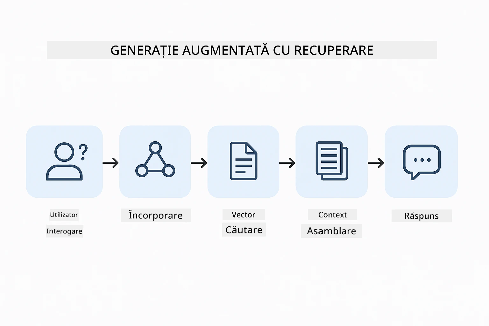
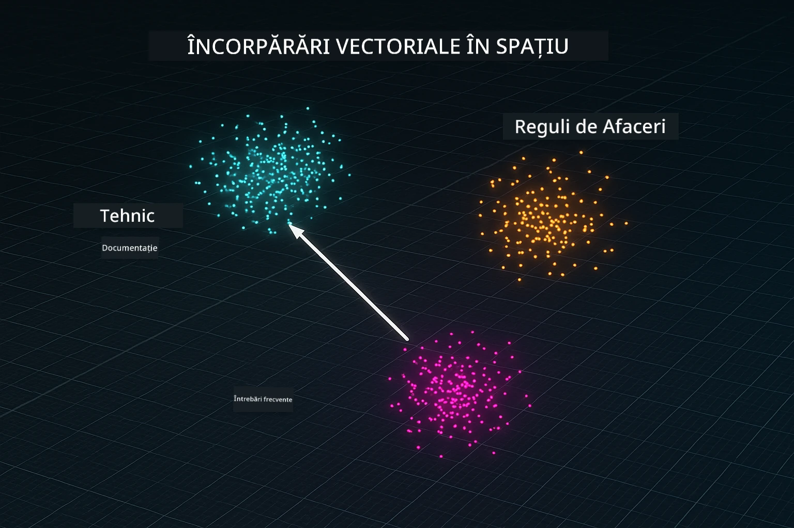
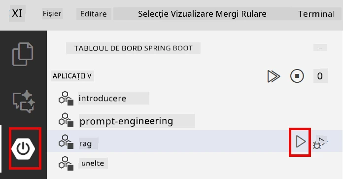
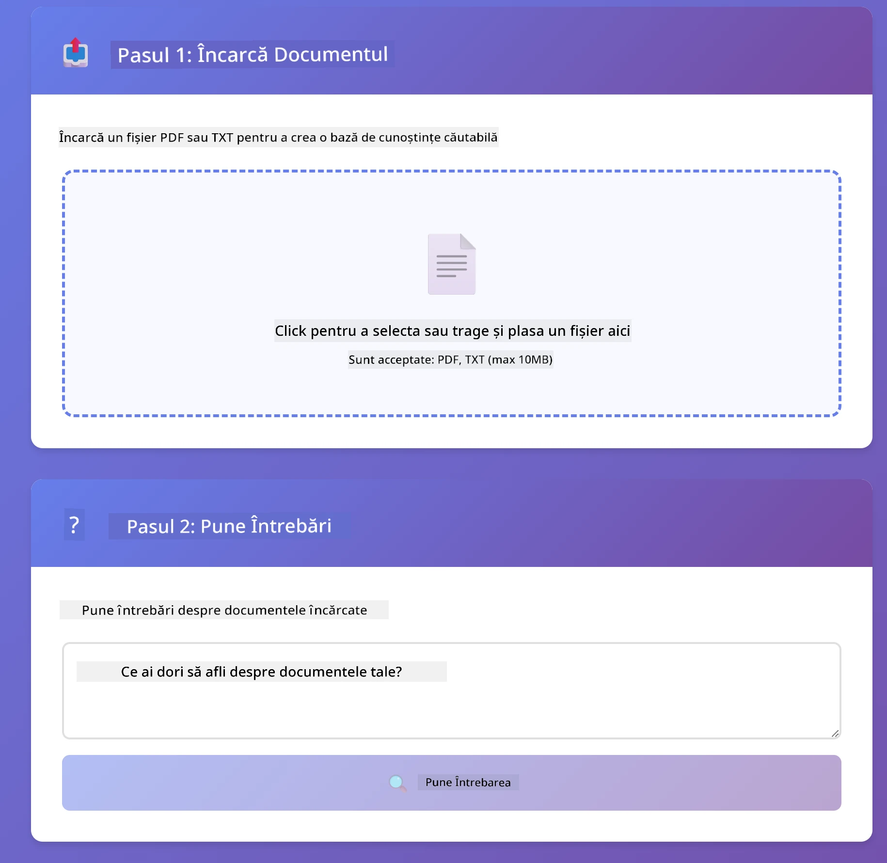

<!--
CO_OP_TRANSLATOR_METADATA:
{
  "original_hash": "81d087662fb3dd7b7124bce1a9c9ec86",
  "translation_date": "2026-01-06T01:04:16+00:00",
  "source_file": "03-rag/README.md",
  "language_code": "ro"
}
-->
# Modulul 03: RAG (Generarea Augmentată cu Recuperare)

## Cuprins

- [Ce veți învăța](../../../03-rag)
- [Precondiții](../../../03-rag)
- [Înțelegerea RAG](../../../03-rag)
- [Cum funcționează](../../../03-rag)
  - [Procesarea documentelor](../../../03-rag)
  - [Crearea embedding-urilor](../../../03-rag)
  - [Căutare semantică](../../../03-rag)
  - [Generarea răspunsului](../../../03-rag)
- [Rulați aplicația](../../../03-rag)
- [Folosirea aplicației](../../../03-rag)
  - [Încărcați un document](../../../03-rag)
  - [Puneți întrebări](../../../03-rag)
  - [Verificați referințele sursei](../../../03-rag)
  - [Experimentați cu întrebările](../../../03-rag)
- [Concepte cheie](../../../03-rag)
  - [Strategia de segmentare](../../../03-rag)
  - [Scoruri de similitudine](../../../03-rag)
  - [Stocare în memorie](../../../03-rag)
  - [Gestionarea ferestrei de context](../../../03-rag)
- [Când contează RAG](../../../03-rag)
- [Pașii următori](../../../03-rag)

## Ce veți învăța

În modulele anterioare, ați învățat cum să purtați conversații cu AI și cum să structurați efectiv prompturile. Dar există o limitare fundamentală: modelele de limbaj știu doar ceea ce au învățat în timpul antrenamentului. Ele nu pot răspunde la întrebări despre politicile companiei dvs., documentația proiectului sau orice informație pe care nu au fost antrenate să o cunoască.

RAG (Generarea Augmentată cu Recuperare) rezolvă această problemă. În loc să încercați să învățați modelul cu informațiile dvs. (ceea ce este costisitor și nepractic), îi oferiți capacitatea de a căuta prin documentele dvs. Când cineva pune o întrebare, sistemul găsește informații relevante și le include în prompt. Modelul răspunde apoi pe baza contextului recuperat.

Gândiți-vă la RAG ca și cum ați oferi modelului o bibliotecă de referință. Când puneți o întrebare, sistemul:

1. **Interogare utilizator** - Puneți o întrebare  
2. **Embedding** - Conversia întrebării într-un vector  
3. **Căutare vectorială** - Găsește segmente de documente similare  
4. **Asamblare context** - Adaugă segmente relevante în prompt  
5. **Răspuns** - LLM generează un răspuns pe baza contextului  

Acest lucru ancorează răspunsurile modelului în datele dvs. reale în loc să se bazeze doar pe cunoștințele din antrenament sau să inventeze răspunsuri.



*Fluxul de lucru RAG - de la întrebarea utilizatorului la căutarea semantică și generarea răspunsului contextual*

## Precondiții

- Modulul 01 finalizat (resurse Azure OpenAI implementate)  
- Fișier `.env` în directorul rădăcină cu acreditările Azure (creat de `azd up` în Modulul 01)  

> **Notă:** Dacă nu ați finalizat Modulul 01, urmați mai întâi instrucțiunile de implementare de acolo.

## Cum funcționează

### Procesarea documentelor

[DocumentService.java](../../../03-rag/src/main/java/com/example/langchain4j/rag/service/DocumentService.java)

Când încărcați un document, sistemul îl împarte în bucăți – părți mai mici care se încadrează confortabil în fereastra de context a modelului. Aceste bucăți se suprapun ușor pentru a nu pierde context la limite.

```java
Document document = FileSystemDocumentLoader.loadDocument("sample-document.txt");

DocumentSplitter splitter = DocumentSplitters
    .recursive(300, 30, new OpenAiTokenizer());

List<TextSegment> segments = splitter.split(document);
```
  
> **🤖 Încercați cu [GitHub Copilot](https://github.com/features/copilot) Chat:** Deschideți [`DocumentService.java`](../../../03-rag/src/main/java/com/example/langchain4j/rag/service/DocumentService.java) și întrebați:  
> - "Cum împarte LangChain4j documentele în bucăți și de ce este importantă suprapunerea?"  
> - "Care este dimensiunea optimă a unei bucăți pentru diferite tipuri de documente și de ce?"  
> - "Cum gestionez documentele în mai multe limbi sau cu formatare specială?"

### Crearea embedding-urilor

[LangChainRagConfig.java](../../../03-rag/src/main/java/com/example/langchain4j/rag/config/LangChainRagConfig.java)

Fiecare bucată este convertită într-o reprezentare numerică numită embedding – practic o amprentă matematică care capturează sensul textului. Texte similare produc embedding-uri similare.

```java
@Bean
public EmbeddingModel embeddingModel() {
    return OpenAiOfficialEmbeddingModel.builder()
        .baseUrl(azureOpenAiEndpoint)
        .apiKey(azureOpenAiKey)
        .modelName(azureEmbeddingDeploymentName)
        .build();
}

EmbeddingStore<TextSegment> embeddingStore = 
    new InMemoryEmbeddingStore<>();
```
  


*Documentele reprezentate ca vectori în spațiul embedding-urilor - conținut similar se grupează*

### Căutare semantică

[RagService.java](../../../03-rag/src/main/java/com/example/langchain4j/rag/service/RagService.java)

Când puneți o întrebare, întrebarea dvs. devine și ea un embedding. Sistemul compară embedding-ul întrebării cu embedding-urile tuturor bucăților din document. Găsește bucățile cu cele mai asemănătoare sensuri – nu doar potriviri de cuvinte cheie, ci similitudini semantice reale.

```java
Embedding queryEmbedding = embeddingModel.embed(question).content();

List<EmbeddingMatch<TextSegment>> matches = 
    embeddingStore.findRelevant(queryEmbedding, 5, 0.7);

for (EmbeddingMatch<TextSegment> match : matches) {
    String relevantText = match.embedded().text();
    double score = match.score();
}
```
  
> **🤖 Încercați cu [GitHub Copilot](https://github.com/features/copilot) Chat:** Deschideți [`RagService.java`](../../../03-rag/src/main/java/com/example/langchain4j/rag/service/RagService.java) și întrebați:  
> - "Cum funcționează căutarea după similitudine cu embedding-uri și ce determină scorul?"  
> - "Ce prag de similitudine ar trebui să folosesc și cum afectează rezultatele?"  
> - "Cum gestionez situațiile când nu se găsesc documente relevante?"

### Generarea răspunsului

[RagService.java](../../../03-rag/src/main/java/com/example/langchain4j/rag/service/RagService.java)

Cele mai relevante bucăți sunt incluse în prompt pentru model. Modelul le citește și răspunde la întrebarea dvs. pe baza acelor informații. Acest lucru previne halucinațiile – modelul poate răspunde doar din ce are în față.

## Rulați aplicația

**Verificați implementarea:**  

Asigurați-vă că fișierul `.env` există în directorul rădăcină cu acreditările Azure (creat în timpul Modulului 01):  
```bash
cat ../.env  # Ar trebui să afișeze AZURE_OPENAI_ENDPOINT, API_KEY, DEPLOYMENT
```
  
**Porniți aplicația:**  

> **Notă:** Dacă ați pornit deja toate aplicațiile folosind `./start-all.sh` din Modulul 01, acest modul rulează deja pe portul 8081. Puteți să săriți peste comenzile de pornire de mai jos și să accesați direct http://localhost:8081.

**Opțiunea 1: Folosind Spring Boot Dashboard (recomandat pentru utilizatorii VS Code)**  

Containerul dev include extensia Spring Boot Dashboard, care oferă o interfață vizuală pentru a gestiona toate aplicațiile Spring Boot. O găsiți în bara de activități din partea stângă a VS Code (căutați iconița Spring Boot).

Din Spring Boot Dashboard puteți:  
- Vizualiza toate aplicațiile Spring Boot din workspace  
- Porni/opri aplicații cu un singur clic  
- Vizualiza jurnalul aplicației în timp real  
- Monitoriza statusul aplicației  

Apăsați butonul play de lângă "rag" pentru a porni acest modul sau porniți toate modulele simultan.



**Opțiunea 2: Folosind scripturi shell**

Porniți toate aplicațiile web (modulele 01-04):

**Bash:**  
```bash
cd ..  # Din directorul rădăcină
./start-all.sh
```
  
**PowerShell:**  
```powershell
cd ..  # Din directorul rădăcină
.\start-all.ps1
```
  
Sau porniți doar acest modul:

**Bash:**  
```bash
cd 03-rag
./start.sh
```
  
**PowerShell:**  
```powershell
cd 03-rag
.\start.ps1
```
  
Ambele scripturi încarcă automat variabilele de mediu din fișierul `.env` din rădăcină și vor compila JAR-urile dacă nu există deja.

> **Notă:** Dacă preferați să compilați toate modulele manual înainte de pornire:  
>
> **Bash:**  
> ```bash
> cd ..  # Go to root directory
> mvn clean package -DskipTests
> ```
>  
> **PowerShell:**  
> ```powershell
> cd ..  # Go to root directory
> mvn clean package -DskipTests
> ```
  
Deschideți http://localhost:8081 în browser.

**Pentru a opri:**  

**Bash:**  
```bash
./stop.sh  # Numai acest modul
# Sau
cd .. && ./stop-all.sh  # Toate modulele
```
  
**PowerShell:**  
```powershell
.\stop.ps1  # Doar acest modul
# Sau
cd ..; .\stop-all.ps1  # Toate modulele
```
  

## Folosirea aplicației

Aplicația oferă o interfață web pentru încărcarea documentelor și adresarea întrebărilor.

<a href="images/rag-homepage.png"></a>

*Interfața aplicației RAG – încărcați documente și puneți întrebări*

### Încărcați un document

Începeți prin a încărca un document – fișierele TXT sunt cele mai bune pentru testare. În acest director este furnizat un `sample-document.txt` care conține informații despre funcționalitățile LangChain4j, implementarea RAG și bune practici – perfect pentru testarea sistemului.

Sistemul procesează documentul, îl împarte în bucăți și creează embedding-uri pentru fiecare bucată. Aceasta se întâmplă automat la încărcare.

### Puneți întrebări

Acum puneți întrebări specifice despre conținutul documentului. Încercați ceva factual, clar exprimat în document. Sistemul caută bucățile relevante, le include în prompt și generează un răspuns.

### Verificați referințele sursei

Observați că fiecare răspuns include referințe la surse cu scoruri de similitudine. Aceste scoruri (de la 0 la 1) arată cât de relevante au fost bucățile pentru întrebarea dvs. Scoruri mai mari indică potriviri mai bune. Aceasta vă permite să verificați răspunsul față de materialul sursă.

<a href="images/rag-query-results.png"></a>

*Rezultatele interogării care arată răspunsul cu referințele sursei și scorurile de relevanță*

### Experimentați cu întrebările

Încercați diferite tipuri de întrebări:  
- Fapte specifice: "Care este subiectul principal?"  
- Comparații: "Care este diferența dintre X și Y?"  
- Rezumate: "Rezumați punctele cheie despre Z"

Uitați-vă cum se schimbă scorurile de relevanță în funcție de cât de bine se potrivește întrebarea cu conținutul documentului.

## Concepte cheie

### Strategia de segmentare

Documentele sunt împărțite în bucăți de 300 de tokeni cu o suprapunere de 30 de tokeni. Acest echilibru asigură că fiecare bucată are suficient context să fie relevantă, dar rămâne suficient de mică pentru a include mai multe bucăți într-un prompt.

### Scoruri de similitudine

Scorurile sunt între 0 și 1:  
- 0.7-1.0: Foarte relevante, potrivire exactă  
- 0.5-0.7: Relevante, context bun  
- Sub 0.5: Filtrate, prea diferite  

Sistemul recuperează doar bucățile peste pragul minim pentru a asigura calitatea.

### Stocare în memorie

Acest modul folosește stocare în memorie pentru simplitate. Când reporniți aplicația, documentele încărcate se pierd. Sistemele de producție folosesc baze de date vectoriale persistente precum Qdrant sau Azure AI Search.

### Gestionarea ferestrei de context

Fiecare model are o fereastră maximă de context. Nu puteți include toate bucățile unui document mare. Sistemul recuperează primele N bucăți cele mai relevante (implicit 5) pentru a rămâne în limite, oferind suficient context pentru răspunsuri precise.

## Când contează RAG

**Folosiți RAG când:**  
- Răspundeți la întrebări despre documente proprietare  
- Informațiile se schimbă frecvent (politici, prețuri, specificații)  
- Precizia necesită citarea sursei  
- Conținutul este prea mare pentru a încăpea într-un singur prompt  
- Aveți nevoie de răspunsuri verificabile, ancorate

**Nu folosiți RAG când:**  
- Întrebările cer cunoștințe generale pe care modelul le are deja  
- Aveți nevoie de date în timp real (RAG funcționează pe documentele încărcate)  
- Conținutul este suficient de mic pentru a fi inclus direct în prompturi

## Pașii următori

**Următorul modul:** [04-tools - Agenți AI cu unelte](../04-tools/README.md)

---

**Navigare:** [← Anterior: Modul 02 - Ingineria promptului](../02-prompt-engineering/README.md) | [Înapoi la principal](../README.md) | [Următor: Modul 04 - Unelte →](../04-tools/README.md)

---

<!-- CO-OP TRANSLATOR DISCLAIMER START -->
**Declinare de responsabilitate**:  
Acest document a fost tradus folosind serviciul de traducere AI [Co-op Translator](https://github.com/Azure/co-op-translator). Deși ne străduim pentru acuratețe, vă rugăm să aveți în vedere că traducerile automate pot conține erori sau inexactități. Documentul original în limba sa nativă trebuie considerat sursa autoritară. Pentru informații critice, se recomandă traducerea profesională realizată de un specialist uman. Nu ne asumăm responsabilitatea pentru eventualele neînțelegeri sau interpretări greșite care pot rezulta din utilizarea acestei traduceri.
<!-- CO-OP TRANSLATOR DISCLAIMER END -->