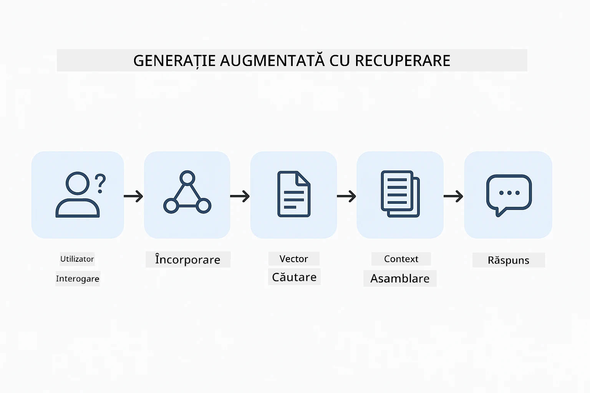
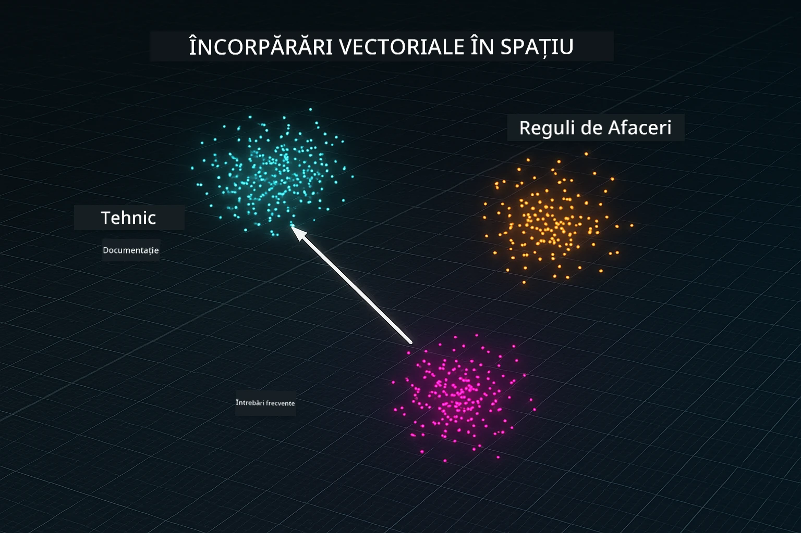
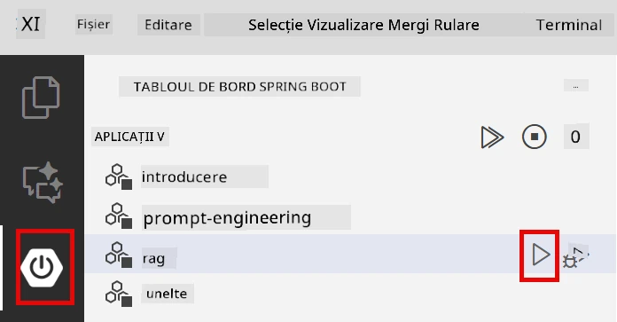
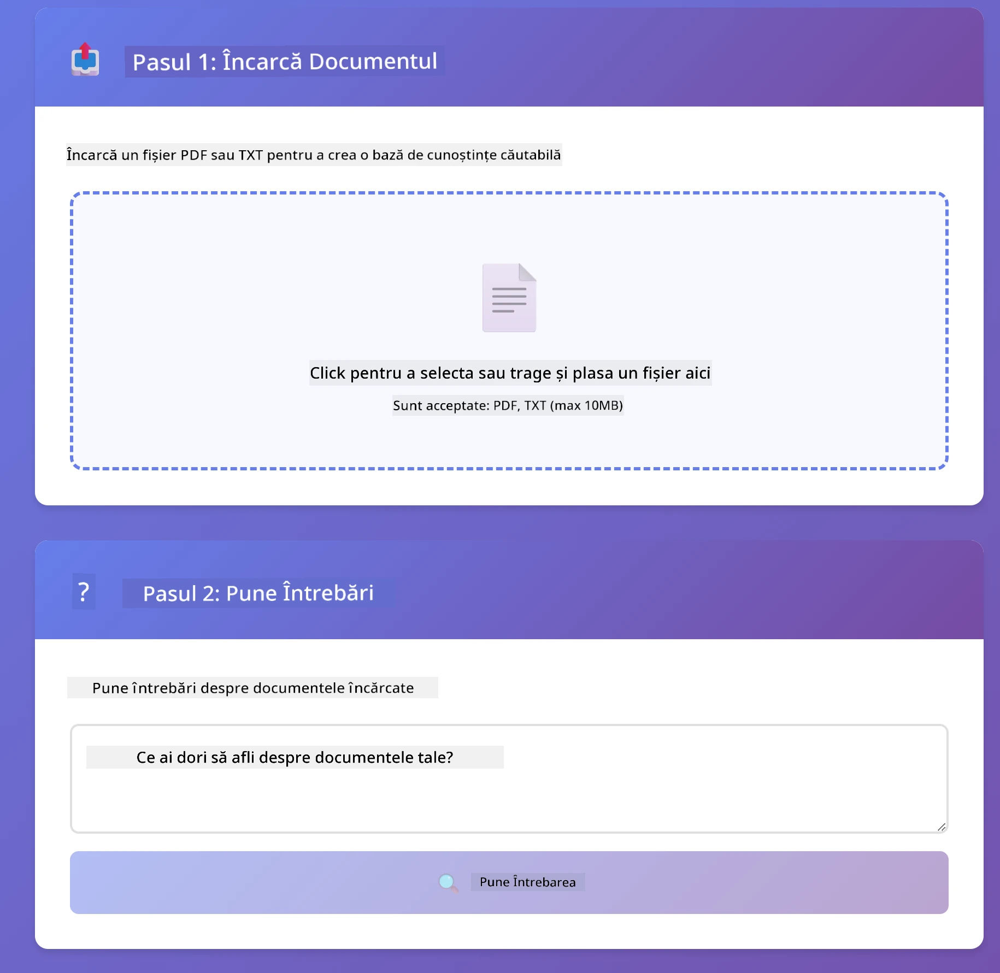
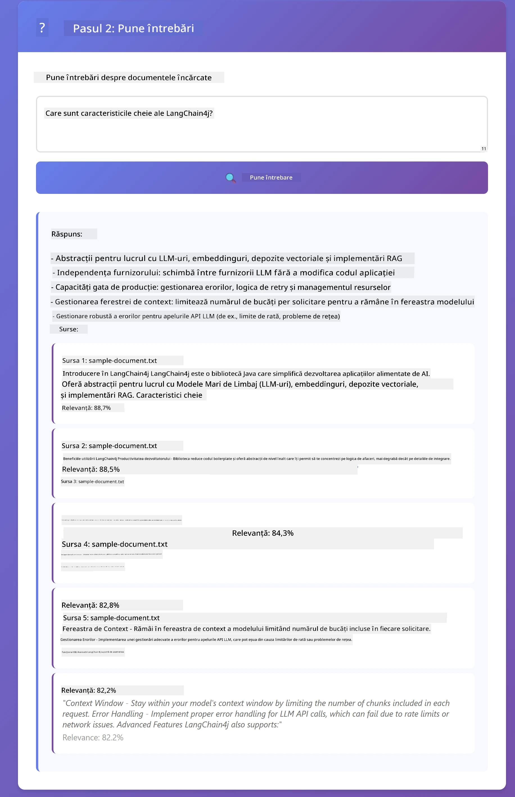

# Modulul 03: RAG (Generare Augmentată cu Recuperare)

## Cuprins

- [Parcurgere Video](#parcurgere-video)
- [Ce Vei Învăța](#ce-vei-învăța)
- [Prerechizite](#prerechizite)
- [Înțelegerea RAG](#înțelegerea-rag)
  - [Ce abordare RAG folosește acest tutorial?](#ce-abordare-rag-folosește-acest-tutorial)
- [Cum Funcționează](#cum-funcționează)
  - [Procesarea Documentelor](#procesarea-documentelor)
  - [Crearea Embedding-urilor](#crearea-embedding-urilor)
  - [Căutare Semantică](#căutare-semantică)
  - [Generarea Răspunsului](#generarea-răspunsului)
- [Rulează Aplicația](#rulează-aplicația)
- [Folosirea Aplicației](#utilizarea-aplicației)
  - [Încarcă un Document](#încarcă-un-document)
  - [Pune Întrebări](#pune-întrebări)
  - [Verifică Referințele Sursă](#verifică-referințele-sursei)
  - [Experimentează cu Întrebările](#experimentează-cu-întrebări)
- [Concepte Cheie](#concepte-cheie)
  - [Strategia de Chunking](#strategia-de-segmențare)
  - [Scoruri de Similaritate](#scoruri-de-similaritate)
  - [Stocare în Memorie](#stocarea-în-memorie)
  - [Gestionarea Ferestrei de Context](#gestionarea-ferestrei-de-context)
- [Când Contează RAG](#când-contează-rag)
- [Pașii Următori](#pașii-următori)

## Parcurgere Video

Urmărește această sesiune live care explică cum să începi cu acest modul:

<a href="https://www.youtube.com/watch?v=_olq75ZH_eY"></a>

## Ce Vei Învăța

În modulele precedente, ai învățat cum să ai conversații cu AI și să structurezi prompturile eficient. Dar există o limitare fundamentală: modelele de limbaj cunosc doar ceea ce au învățat în timpul antrenamentului. Ele nu pot răspunde la întrebări despre politicile companiei tale, documentația proiectului sau orice informație ce nu a fost inclusă în antrenament.

RAG (Generare Augmentată cu Recuperare) rezolvă această problemă. În loc să încerci să „înveți” modelul cu informațiile tale (ceea ce este costisitor și nepractic), îi dai abilitatea de a căuta prin documentele tale. Atunci când cineva pune o întrebare, sistemul găsește informații relevante și le include în prompt. Modelul răspunde în funcție de contextul recuperat.

Gândește-te la RAG ca la o bibliotecă de referință pentru model. Când pui o întrebare, sistemul:

1. **Interogare Utilizator** - Pui o întrebare
2. **Embedding** - Transformă întrebarea ta într-un vector
3. **Căutare Vector** - Găsește fragmente similare din documente
4. **Asamblare Context** - Adaugă fragmente relevante la prompt
5. **Răspuns** - LLM generează un răspuns pe baza contextului

Aceasta ancorează răspunsurile modelului în datele tale reale în loc să se bazeze doar pe cunoștințele din antrenament sau să inventeze răspunsuri.

## Prerechizite

- Finalizat [Modulul 01 - Introducere](../01-introduction/README.md) (resurse Azure OpenAI proiectate, inclusiv modelul de embedding `text-embedding-3-small`)
- Fișier `.env` în directorul rădăcină cu credențialele Azure (creat de `azd up` în Modulul 01)

> **Notă:** Dacă nu ai terminat Modulul 01, urmează mai întâi instrucțiunile de acolo. Comanda `azd up` implementează atât modelul GPT pentru chat, cât și modelul de embedding folosit în acest modul.

## Înțelegerea RAG

Diagrama de mai jos ilustrează conceptul principal: în loc să se bazeze doar pe datele de antrenament ale modelului, RAG îi oferă o bibliotecă de referință compusă din documentele tale, pe care o consultă înainte de a genera fiecare răspuns.


*Această diagramă arată diferența dintre un LLM standard (care ghicește din datele de antrenament) și un LLM îmbunătățit prin RAG (care consultă mai întâi documentele tale).*

Iată cum sunt legate piesele cap la cap. Întrebarea unui utilizator trece prin patru etape — embedding, căutare vectorială, asamblare context și generare răspuns — fiecare construind pe cea anterioară:



*Această diagramă arată pipeline-ul complet RAG — o interogare utilizator trece prin embedding, căutare vectorială, asamblare context și generare răspuns.*

Restul modulului parcurge fiecare etapă în detaliu, cu cod pe care îl poți rula și modifica.

### Ce abordare RAG folosește acest tutorial?

LangChain4j oferă trei moduri de a implementa RAG, fiecare cu un nivel diferit de abstractizare. Diagrama de mai jos le compară alăturat:


*Această diagramă compară cele trei abordări RAG din LangChain4j — Easy, Native și Advanced — arătând componentele lor cheie și când să folosești fiecare.*

| Abordare | Ce Face | Compromis |
|---|---|---|
| **Easy RAG** | Leagă totul automat prin `AiServices` și `ContentRetriever`. Anotezi o interfață, atașezi un retriever, iar LangChain4j se ocupă de embedding, căutare și asamblare prompt în fundal. | Cod minim, dar nu vezi ce se întâmplă la fiecare pas. |
| **Native RAG** | Apelezi modelul de embedding, cauți în magazin, construiești promptul și generezi răspunsul tu însuți — câte un pas explicit. | Mai mult cod, dar fiecare etapă este vizibilă și modificabilă. |
| **Advanced RAG** | Folosește cadrul `RetrievalAugmentor` cu transformatoare de interogare, rutere, re-rankeri și injectoare de conținut plug-in pentru pipeline-uri de calitate producție. | Flexibilitate maximă, dar complexitate mult mai mare. |

**Acest tutorial folosește abordarea Native.** Fiecare pas din pipeline-ul RAG — embedding-ul interogării, căutarea în magazinul vectorial, asamblarea contextului și generarea răspunsului — este scris explicit în [`RagService.java`](../../../03-rag/src/main/java/com/example/langchain4j/rag/service/RagService.java). Acest lucru este intenționat: ca resursă de învățare, este mai important să vezi și să înțelegi fiecare etapă decât să minimizezi codul. Odată ce te simți confortabil cu modul în care toate piesele se potrivesc, poți trece la Easy RAG pentru prototipuri rapide sau Advanced RAG pentru sisteme de producție.

> **💡 Curios despre Easy RAG?** LangChain4j oferă de asemenea o abordare *Easy RAG* în care `AiServices` și un `ContentRetriever` se ocupă automat de embedding, căutare și asamblare prompt. Acest modul ia calea mai explicită — deschizând pipeline-ul astfel încât să poți vedea și controla fiecare etapă.

Diagrama de mai jos arată pipeline-ul Easy RAG. Observă cum `AiServices` și `EmbeddingStoreContentRetriever` ascund toată complexitatea — încarci un document, atașezi un retriever și primești răspunsuri. Abordarea Native din acest modul desface pe rând fiecare din aceste etape ascunse:


*Această diagramă arată pipeline-ul Easy RAG. Compară cu abordarea Native folosită în acest modul: Easy RAG ascunde embedding-ul, recuperarea și asamblarea promptului în spatele `AiServices` și `ContentRetriever` — încarci un document, atașezi un retriever și primești răspunsuri. Abordarea Native din acest modul desface acest pipeline astfel încât să apelezi fiecare etapă (embedding, căutare, asamblare context, generare) singur, oferindu-ți vizibilitate și control complet.*

## Cum Funcționează

Pipeline-ul RAG din acest modul se împarte în patru etape care se rulează în secvență de fiecare dată când un utilizator pune o întrebare. Mai întâi, un document încărcat este **parsificat și fragmentat** în bucăți ușor de gestionat. Aceste fragmente sunt apoi convertite în **embedding-uri vectoriale** și stocate pentru a putea fi comparate matematic. Când apare o interogare, sistemul efectuează o **căutare semantică** pentru a găsi cele mai relevante fragmente, iar în final le pasează ca context către LLM pentru **generarea răspunsului**. Secțiunile următoare parcurg fiecare etapă cu codul efectiv și diagrame. Să privim primul pas.

### Procesarea Documentelor

[DocumentService.java](../../../03-rag/src/main/java/com/example/langchain4j/rag/service/DocumentService.java)

Când încarci un document, sistemul îl parsează (PDF sau text simplu), atașează metadate precum numele fișierului și apoi îl sparge în fragmente — bucăți mai mici care se potrivesc confortabil în fereastra de context a modelului. Aceste fragmente se suprapun ușor pentru a nu pierde contextul la limite.

```java
// Analizează fișierul încărcat și înfășoară-l într-un Document LangChain4j
Document document = Document.from(content, metadata);

// Împarte în bucăți de 300 de tokeni cu o suprapunere de 30 de tokeni
DocumentSplitter splitter = DocumentSplitters
    .recursive(300, 30);

List<TextSegment> segments = splitter.split(document);
```

Diagrama de mai jos arată cum funcționează vizual. Observă cum fiecare fragment împarte unele tokenuri cu vecinii săi — suprapunerea de 30 de tokenuri asigură că nu se pierde context important la margini:


*Această diagramă arată un document împărțit în fragmente de 300 de tokenuri cu suprapunere de 30 de tokenuri, păstrând contextul la marginile fragmentelor.*

> **🤖 Încearcă cu [GitHub Copilot](https://github.com/features/copilot) Chat:** Deschide [`DocumentService.java`](../../../03-rag/src/main/java/com/example/langchain4j/rag/service/DocumentService.java) și întreabă:
> - "Cum împarte LangChain4j documentele în fragmente și de ce este importantă suprapunerea?"
> - "Care este dimensiunea optimă a fragmentelor pentru diferite tipuri de documente și de ce?"
> - "Cum gestionez documente în mai multe limbi sau cu formatare specială?"

### Crearea Embedding-urilor

[LangChainRagConfig.java](../../../03-rag/src/main/java/com/example/langchain4j/rag/config/LangChainRagConfig.java)

Fiecare fragment este convertit într-o reprezentare numerică numită embedding — practic un convertor de sens în numere. Modelul de embedding nu este „inteligent” precum un model de chat; nu poate urma instrucțiuni, nu poate raționa sau răspunde la întrebări. Ce poate face este să mapeze textul într-un spațiu matematic în care sensuri similare ajung aproape unul de altul — „mașină” lângă „automobil”, „politica de returnare” lângă „îmi returnează banii”. Gândește-te la un model de chat ca la o persoană cu care poți conversa; un model de embedding este un sistem de arhivare ultra-eficient.

Diagrama de mai jos vizualizează acest concept — textul intră, vectorii numerici ies, iar sensurile similare produc vectori apropiați:


*Această diagramă arată cum un model de embedding convertește textul în vectori numerici, plasând sensuri similare — precum „mașină” și „automobil” — aproape unul de altul în spațiul vectorial.*

```java
@Bean
public EmbeddingModel embeddingModel() {
    return OpenAiOfficialEmbeddingModel.builder()
        .baseUrl(azureOpenAiEndpoint)
        .apiKey(azureOpenAiKey)
        .modelName(azureEmbeddingDeploymentName)
        .build();
}

EmbeddingStore<TextSegment> embeddingStore = 
    new InMemoryEmbeddingStore<>();
```

Diagrama claselor de mai jos arată cele două fluxuri separate într-un pipeline RAG și clasele LangChain4j care le implementează. Fluxul de **încărcare** (rulează o singură dată la încărcarea documentului) sparge documentul, creează embedding-urile fragmentelor și le stochează prin `.addAll()`. Fluxul de **interogare** (rulează de fiecare dată când un utilizator întreabă) creează embedding-ul întrebării, caută în magazin prin `.search()`, și pasează contextul găsit la modelul de chat. Ambele fluxuri se întâlnesc la interfața comună `EmbeddingStore<TextSegment>`:


*Această diagramă arată cele două fluxuri într-un pipeline RAG — încărcare și interogare — și cum se conectează printr-un EmbeddingStore comun.*

Odată ce embedding-urile sunt stocate, conținutul similar se grupează natural în spațiul vectorial. Vizualizarea de mai jos arată cum documentele despre subiecte conexe devin puncte vecine, ceea ce face posibilă căutarea semantică:



*Această vizualizare arată cum documentele corelate se grupează în spațiul tridimensional vectorial, cu subiecte precum Documente Tehnice, Reguli de Afaceri și Întrebări Frecvente formând grupuri distincte.*

Când un utilizator caută, sistemul urmează patru pași: creează embedding-urile documentelor o singură dată, creează embedding-ul interogării la fiecare căutare, compară vectorul întrebării cu toate vectorii stocați folosind similaritatea cosinus, și returnează cele mai bine punctate fragmente top-K. Diagrama de mai jos parcurge fiecare pas și clasele LangChain4j implicate:


*Această diagramă arată procesul de căutare embedding în patru pași: creează embedding documente, creează embedding interogare, compară vectorii cu similaritate cosinus și returnează rezultatele top-K.*

### Căutare Semantică

[RagService.java](../../../03-rag/src/main/java/com/example/langchain4j/rag/service/RagService.java)

Când pui o întrebare, și întrebarea ta devine un embedding. Sistemul compară embedding-ul întrebării tale cu embedding-urile tuturor fragmentelor de document. Găsește fragmentele cu cele mai similare sensuri - nu doar cuvinte cheie potrivite, ci similaritate semantică reală.

```java
Embedding queryEmbedding = embeddingModel.embed(question).content();

EmbeddingSearchRequest searchRequest = EmbeddingSearchRequest.builder()
    .queryEmbedding(queryEmbedding)
    .maxResults(5)
    .minScore(0.5)
    .build();

EmbeddingSearchResult<TextSegment> searchResult = embeddingStore.search(searchRequest);
List<EmbeddingMatch<TextSegment>> matches = searchResult.matches();

for (EmbeddingMatch<TextSegment> match : matches) {
    String relevantText = match.embedded().text();
    double score = match.score();
}
```

Diagrama de mai jos contrastează căutarea semantică cu cea tradițională bazată pe cuvinte cheie. O căutare după cuvântul „vehicul” ratează un fragment despre „mașini și camioane”, dar căutarea semantică înțelege că acestea înseamnă același lucru și îl returnează ca potrivire bine punctată:


*Această diagramă compară căutarea bazată pe cuvinte cheie cu cea semantică, arătând cum căutarea semantică recuperează conținut conceptually legat chiar dacă cuvintele exacte diferă.*

În partea internă, similaritatea este măsurată folosind similaritatea cosinus — practic întrebând „arată acești doi săgeți în aceeași direcție?” Două fragmente pot folosi cuvinte complet diferite, dar dacă au același sens vectorii lor indică aceeași direcție și au scor aproape de 1.0:


*Acest diagramă ilustrează similitudinea cosinus ca unghiul dintre vectorii de embedding — vectorii mai aliniați obțin scoruri apropiate de 1.0, indicând o similitudine semantică mai mare.*

> **🤖 Încearcă cu [GitHub Copilot](https://github.com/features/copilot) Chat:** Deschide [`RagService.java`](../../../03-rag/src/main/java/com/example/langchain4j/rag/service/RagService.java) și întreabă:
> - "Cum funcționează căutarea prin similaritate cu embeddings și ce determină scorul?"
> - "Ce prag de similaritate ar trebui să folosesc și cum afectează rezultatele?"
> - "Cum gestionez cazurile în care nu se găsesc documente relevante?"

### Generarea Răspunsului

[RagService.java](../../../03-rag/src/main/java/com/example/langchain4j/rag/service/RagService.java)

Cele mai relevante segmente sunt asamblate într-un prompt structurat care include instrucțiuni explicite, contextul recuperat și întrebarea utilizatorului. Modelul citește acele segmente specifice și răspunde pe baza acelor informații — poate folosi doar ce are în față, ceea ce previne halucinațiile.

```java
String context = matches.stream()
    .map(match -> match.embedded().text())
    .collect(Collectors.joining("\n\n"));

String prompt = String.format("""
    Answer the question based on the following context.
    If the answer cannot be found in the context, say so.

    Context:
    %s

    Question: %s

    Answer:""", context, request.question());

String answer = chatModel.chat(prompt);
```

Diagrama de mai jos arată această asamblare în acțiune — segmentele cu cel mai mare scor din pasul de căutare sunt injectate în șablonul de prompt, iar `OpenAiOfficialChatModel` generează un răspuns fundamentat:


*Această diagramă arată cum segmentele cu cel mai mare scor sunt asamblate într-un prompt structurat, permițând modelului să genereze un răspuns fundamentat din datele tale.*

## Rulează Aplicația

**Verifică implementarea:**

Asigură-te că fișierul `.env` există în directorul rădăcină cu acreditările Azure (create în Modulul 01). Rulează acest lucru din directorul modulului (`03-rag/`):

**Bash:**
```bash
cat ../.env  # Ar trebui să afișeze AZURE_OPENAI_ENDPOINT, API_KEY, DEPLOYMENT
```

**PowerShell:**
```powershell
Get-Content ..\.env  # Ar trebui să afișeze AZURE_OPENAI_ENDPOINT, API_KEY, DEPLOYMENT
```

**Pornește aplicația:**

> **Notă:** Dacă ai pornit deja toate aplicațiile folosind `./start-all.sh` din directorul rădăcină (așa cum este descris în Modulul 01), acest modul rulează deja pe portul 8081. Poți sări peste comenzile de start de mai jos și să accesezi direct http://localhost:8081.

**Opțiunea 1: Folosind Spring Boot Dashboard (Recomandat pentru utilizatorii VS Code)**

Containerul de dezvoltare include extensia Spring Boot Dashboard, care oferă o interfață vizuală pentru gestionarea tuturor aplicațiilor Spring Boot. O poți găsi în Bara de activitate din partea stângă a VS Code (caută iconița Spring Boot).

Din Spring Boot Dashboard, poți:
- Vedea toate aplicațiile Spring Boot disponibile în spațiul de lucru
- Porni/opri aplicații cu un singur clic
- Vizualiza jurnalele aplicației în timp real
- Monitoriza starea aplicației

Simplu, apasă butonul de play lângă „rag” pentru a porni acest modul sau pornește toate modulele odată.



*Această captură de ecran arată Spring Boot Dashboard în VS Code, unde poți porni, opri și monitoriza aplicațiile vizual.*

**Opțiunea 2: Folosind scripturi shell**

Pornește toate aplicațiile web (modulele 01-04):

**Bash:**
```bash
cd ..  # Din directorul rădăcină
./start-all.sh
```

**PowerShell:**
```powershell
cd ..  # Din directorul rădăcină
.\start-all.ps1
```

Sau pornește doar acest modul:

**Bash:**
```bash
cd 03-rag
./start.sh
```

**PowerShell:**
```powershell
cd 03-rag
.\start.ps1
```

Ambele scripturi încarcă automat variabilele de mediu din fișierul `.env` din rădăcină și vor construi JAR-urile dacă acestea nu există.

> **Notă:** Dacă preferi să construiești manual toate modulele înainte de pornire:
>
> **Bash:**
> ```bash
> cd ..  # Go to root directory
> mvn clean package -DskipTests
> ```
>
> **PowerShell:**
> ```powershell
> cd ..  # Go to root directory
> mvn clean package -DskipTests
> ```

Deschide http://localhost:8081 în browserul tău.

**Pentru a opri:**

**Bash:**
```bash
./stop.sh  # Numai acest modul
# Sau
cd .. && ./stop-all.sh  # Toate modulele
```

**PowerShell:**
```powershell
.\stop.ps1  # Doar acest modul
# Sau
cd ..; .\stop-all.ps1  # Toate modulele
```

## Utilizarea Aplicației

Aplicația oferă o interfață web pentru încărcarea documentelor și adresarea întrebărilor.

<a href="images/rag-homepage.png"></a>

*Această captură de ecran arată interfața aplicației RAG unde încarci documente și pui întrebări.*

### Încarcă un Document

Începe prin a încărca un document - cele TXT funcționează cel mai bine pentru testare. În acest director există un `sample-document.txt` care conține informații despre funcționalitățile LangChain4j, implementarea RAG și bune practici - perfect pentru testarea sistemului.

Sistemul procesează documentul tău, îl împarte în segmente și creează embeddings pentru fiecare segment. Acest lucru se face automat la încărcare.

### Pune Întrebări

Acum pune întrebări specifice despre conținutul documentului. Încearcă ceva factual care este clar menționat în document. Sistemul caută segmente relevante, le include în prompt și generează un răspuns.

### Verifică Referințele Sursei

Observă că fiecare răspuns include referințe la surse cu scoruri de similaritate. Aceste scoruri (0 până la 1) arată cât de relevant a fost fiecare segment pentru întrebarea ta. Scorurile mai mari înseamnă potriviri mai bune. Astfel poți verifica răspunsul față de materialul sursă.

<a href="images/rag-query-results.png"></a>

*Această captură de ecran arată rezultatele interogării cu răspunsul generat, referințele sursei și scorurile de relevanță pentru fiecare segment recuperat.*

### Experimentează cu Întrebări

Încearcă diferite tipuri de întrebări:
- Fapte specifice: "Care este subiectul principal?"
- Comparații: "Care este diferența dintre X și Y?"
- Rezumate: "Rezuma punctele cheie despre Z"

Urmărește cum scorurile de relevanță se schimbă în funcție de cât de bine se potrivește întrebarea ta cu conținutul documentului.

## Concepte Cheie

### Strategia de Segmențare

Documentele sunt împărțite în segmente de 300 de tokeni cu o suprapunere de 30 de tokeni. Această balansare asigură că fiecare segment are suficient context pentru a fi relevant, menținând în același timp dimensiuni mici pentru a include mai multe segmente în prompt.

### Scoruri de Similaritate

Fiecare segment recuperat vine cu un scor de similaritate între 0 și 1 care indică cât de bine se potrivește cu întrebarea utilizatorului. Diagrama de mai jos vizualizează intervalele scorurilor și cum sistemul le folosește pentru a filtra rezultatele:


*Această diagramă arată intervale de scor de la 0 la 1, cu un prag minim de 0.5 care filtrează segmentele irelevante.*

Scorurile variază de la 0 la 1:
- 0.7-1.0: Extrem de relevant, potrivire exactă
- 0.5-0.7: Relevant, context bun
- Sub 0.5: Filtrate, prea diferite

Sistemul recuperează doar segmentele peste pragul minim pentru a asigura calitatea.

Embeddings funcționează bine când sensul se grupează clar, dar au puncte oarbe. Diagrama de mai jos arată modurile comune de eșec — segmentele prea mari produc vectori neclari, segmentele prea mici lipsesc de context, termenii ambigui indică mai multe grupuri, iar căutările exacte (ID-uri, numere de parte) nu funcționează deloc cu embeddings:


*Această diagramă arată modurile comune de eșec ale embedding-urilor: segmente prea mari, segmente prea mici, termeni ambigui care indică multiple grupuri și căutări exacte ca ID-urile.*

### Stocarea în Memorie

Acest modul folosește stocarea în memorie pentru simplitate. Când repornești aplicația, documentele încărcate se pierd. Sistemele de producție folosesc baze de date vectoriale persistente precum Qdrant sau Azure AI Search.

### Gestionarea Ferestrei de Context

Fiecare model are o fereastră maximă de context. Nu poți include fiecare segment dintr-un document mare. Sistemul recuperează cele mai relevante N segmente (implicit 5) pentru a rămâne în limite și totuși a oferi suficient context pentru răspunsuri precise.

## Când Contează RAG

RAG nu este întotdeauna abordarea potrivită. Ghidul decizional de mai jos te ajută să determini când RAG adaugă valoare versus când abordările mai simple — precum includerea conținutului direct în prompt sau bazarea pe cunoștințele construite ale modelului — sunt suficiente:


*Această diagramă arată un ghid decizional pentru când RAG adaugă valoare versus când abordările mai simple sunt suficiente.*

## Pașii Următori

**Următorul Modul:** [04-tools - Agenți AI cu Unelte](../04-tools/README.md)

---

**Navigare:** [← Anterior: Modul 02 - Inginerie de Prompt](../02-prompt-engineering/README.md) | [Înapoi la Principal](../README.md) | [Următor: Modul 04 - Unelte →](../04-tools/README.md)

---

<!-- CO-OP TRANSLATOR DISCLAIMER START -->
**Declinare a responsabilității**:
Acest document a fost tradus folosind serviciul de traducere AI [Co-op Translator](https://github.com/Azure/co-op-translator). În timp ce ne străduim pentru acuratețe, vă rugăm să rețineți că traducerile automate pot conține erori sau inexactități. Documentul original în limba sa nativă trebuie considerat sursa autorizată. Pentru informații critice, se recomandă traducerea profesională realizată de un om. Nu ne asumăm responsabilitatea pentru eventualele neînțelegeri sau interpretări greșite care decurg din utilizarea acestei traduceri.
<!-- CO-OP TRANSLATOR DISCLAIMER END -->