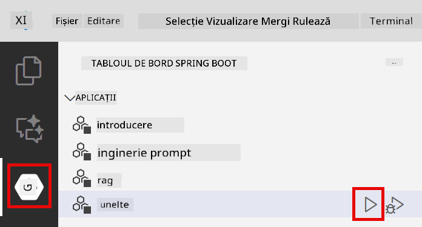
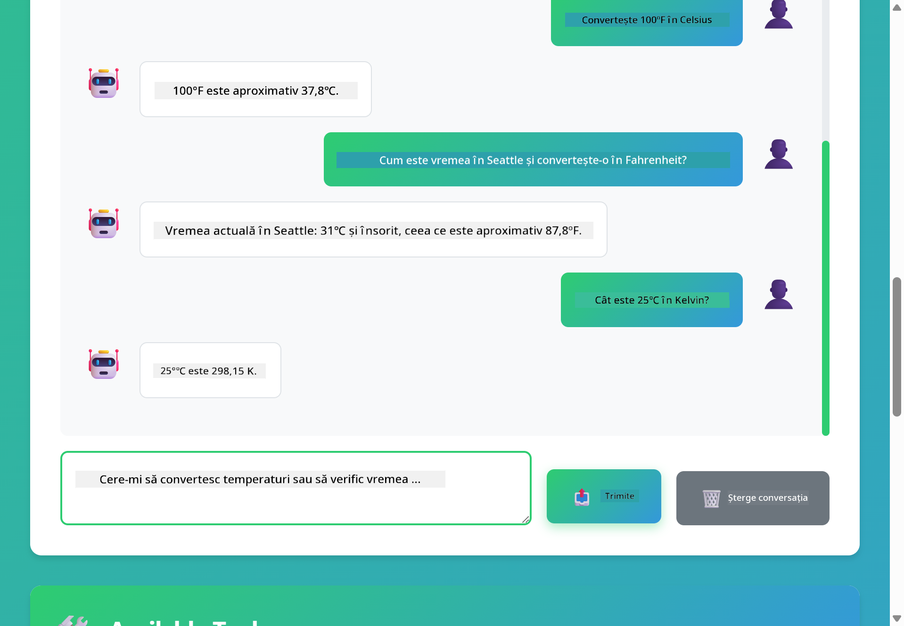

<!--
CO_OP_TRANSLATOR_METADATA:
{
  "original_hash": "13ec450c12cdd1a863baa2b778f27cd7",
  "translation_date": "2025-12-31T04:51:02+00:00",
  "source_file": "04-tools/README.md",
  "language_code": "ro"
}
-->
# Modulul 04: Agenți AI cu instrumente

## Table of Contents

- [Ce vei învăța](../../../04-tools)
- [Prerechizite](../../../04-tools)
- [Înțelegerea agenților AI cu instrumente](../../../04-tools)
- [Cum funcționează apelarea instrumentelor](../../../04-tools)
  - [Definiții ale instrumentelor](../../../04-tools)
  - [Luarea deciziilor](../../../04-tools)
  - [Execuție](../../../04-tools)
  - [Generarea răspunsului](../../../04-tools)
- [Lanțuirea instrumentelor](../../../04-tools)
- [Rulare aplicație](../../../04-tools)
- [Folosirea aplicației](../../../04-tools)
  - [Încearcă utilizarea simplă a instrumentelor](../../../04-tools)
  - [Testează lanțuirea instrumentelor](../../../04-tools)
  - [Vezi fluxul conversației](../../../04-tools)
  - [Observă raționamentul](../../../04-tools)
  - [Experimentează cu solicitări diferite](../../../04-tools)
- [Concepte cheie](../../../04-tools)
  - [Tiparul ReAct (Raționare și Acțiune)](../../../04-tools)
  - [Descrierile instrumentelor contează](../../../04-tools)
  - [Managementul sesiunii](../../../04-tools)
  - [Tratamentul erorilor](../../../04-tools)
- [Instrumente disponibile](../../../04-tools)
- [Când să folosești agenți bazati pe instrumente](../../../04-tools)
- [Pașii următori](../../../04-tools)

## Ce vei învăța

Până acum ai învățat cum să porți conversații cu AI, să structurezi prompturi eficient și să ancorezi răspunsuri în documentele tale. Dar există încă o limitare fundamentală: modelele de limbaj pot doar genera text. Nu pot verifica vremea, efectua calcule, interoga baze de date sau interacționa cu sisteme externe.

Instrumentele schimbă acest lucru. Dând modelului acces la funcții pe care le poate apela, îl transformi dintr-un generator de text într-un agent care poate lua acțiuni. Modelul decide când are nevoie de un instrument, ce instrument să folosească și ce parametri să transmită. Codul tău execută funcția și returnează rezultatul. Modelul încorporează acel rezultat în răspunsul său.

## Prerequisites

- Modulul 01 finalizat (resurse Azure OpenAI implementate)
- Fișierul `.env` în directorul rădăcină cu acreditările Azure (creat de `azd up` în Modulul 01)

> **Notă:** Dacă nu ai finalizat Modulul 01, urmează mai întâi instrucțiunile de implementare de acolo.

## Înțelegerea agenților AI cu instrumente

> **📝 Notă:** Termenul "agenți" din acest modul se referă la asistenți AI îmbunătățiți cu capabilități de apelare a instrumentelor. Acesta este diferit de modelele **Agentic AI** (agenți autonomi cu planificare, memorie și raționament în mai mulți pași) pe care le vom acoperi în [Modulul 05: MCP](../05-mcp/README.md).

Un agent AI cu instrumente urmează un tipar de raționare și acțiune (ReAct):

1. Utilizatorul pune o întrebare
2. Agentul raționează despre ce trebuie să știe
3. Agentul decide dacă are nevoie de un instrument pentru a răspunde
4. Dacă da, agentul apelează instrumentul corespunzător cu parametrii potriviți
5. Instrumentul execută și returnează date
6. Agentul încorporează rezultatul și oferă răspunsul final


*Tiparul ReAct - cum agenții AI alternează între raționare și acțiune pentru a rezolva probleme*

Acest lucru se întâmplă automat. Tu definești instrumentele și descrierile lor. Modelul gestionează luarea deciziilor despre când și cum să le folosească.

## Cum funcționează apelarea instrumentelor

**Definiții ale instrumentelor** - [WeatherTool.java](../../../04-tools/src/main/java/com/example/langchain4j/agents/tools/WeatherTool.java) | [TemperatureTool.java](../../../04-tools/src/main/java/com/example/langchain4j/agents/tools/TemperatureTool.java)

Definiți funcții cu descrieri clare și specificații ale parametrilor. Modelul vede aceste descrieri în promptul său de sistem și înțelege ce face fiecare instrument.

```java
@Component
public class WeatherTool {
    
    @Tool("Get the current weather for a location")
    public String getCurrentWeather(@P("Location name") String location) {
        // Logica ta de căutare a vremii
        return "Weather in " + location + ": 22°C, cloudy";
    }
}

@AiService
public interface Assistant {
    String chat(@MemoryId String sessionId, @UserMessage String message);
}

// Asistentul este configurat automat de Spring Boot cu:
// - bean-ul ChatModel
// - Toate metodele @Tool din clasele @Component
// - ChatMemoryProvider pentru gestionarea sesiunii
```

> **🤖 Încearcă cu [GitHub Copilot](https://github.com/features/copilot) Chat:** Deschide [`WeatherTool.java`](../../../04-tools/src/main/java/com/example/langchain4j/agents/tools/WeatherTool.java) și întreabă:
> - "Cum aș integra o API reală de vreme cum ar fi OpenWeatherMap în locul datelor mock?"
> - "Ce face o descriere bună a unui instrument care ajută AI-ul să-l folosească corect?"
> - "Cum gestionez erorile API și limitele de rată în implementările instrumentelor?"

**Luarea deciziilor**

Când un utilizator întreabă "Care e vremea în Seattle?", modelul recunoaște că are nevoie de instrumentul de vreme. Generează un apel de funcție cu parametrul location setat la "Seattle".

**Execuție** - [AgentService.java](../../../04-tools/src/main/java/com/example/langchain4j/agents/service/AgentService.java)

Spring Boot injectează automat interfața declarativă `@AiService` cu toate instrumentele înregistrate, iar LangChain4j execută apelurile instrumentelor automat.

> **🤖 Încearcă cu [GitHub Copilot](https://github.com/features/copilot) Chat:** Deschide [`AgentService.java`](../../../04-tools/src/main/java/com/example/langchain4j/agents/service/AgentService.java) și întreabă:
> - "Cum funcționează tiparul ReAct și de ce este eficient pentru agenții AI?"
> - "Cum decide agentul ce instrument să folosească și în ce ordine?"
> - "Ce se întâmplă dacă execuția unui instrument eșuează - cum ar trebui să gestionez erorile robust?"

**Generarea răspunsului**

Modelul primește datele meteo și le formatează într-un răspuns în limbaj natural pentru utilizator.

### De ce să folosești servicii AI declarative?

Acest modul folosește integrarea LangChain4j cu Spring Boot și interfețele declarative `@AiService`:

- **Autoinjectare Spring Boot** - ChatModel și instrumentele sunt injectate automat
- **Modelul `@MemoryId`** - Management automat al memoriei pe sesiune
- **Instanță unică** - Asistent creat o singură dată și reutilizat pentru performanță mai bună
- **Execuție sigură din punct de vedere al tipurilor** - Metode Java apelate direct cu conversie de tip
- **Orchestrare multi-turn** - Gestionează automat lanțuirea instrumentelor
- **Zero boilerplate** - Fără apeluri manuale AiServices.builder() sau HashMap pentru memorie

Abordările alternative (manual `AiServices.builder()`) necesită mai mult cod și pierd beneficiile integrării cu Spring Boot.

## Lanțuirea instrumentelor

**Lanțuirea instrumentelor** - AI-ul poate apela mai multe instrumente în secvență. Întreabă "Care e vremea în Seattle și ar trebui să iau o umbrelă?" și urmărește cum leagă `getCurrentWeather` cu raționamente despre echipamentul pentru ploaie.

<a href="images/tool-chaining.png"></a>

*Apeluri secvențiale către instrumente - ieșirea unui instrument alimentând decizia următoare*

**Eșecuri grațioase** - Cere vremea într-un oraș care nu este în datele mock. Instrumentul returnează un mesaj de eroare, iar AI-ul explică că nu poate ajuta. Instrumentele eșuează în siguranță.

Acest lucru se întâmplă într-un singur tur de conversație. Agentul orchesterază în mod autonom apeluri multiple la instrumente.

## Rulare aplicație

**Verifică implementarea:**

Asigură-te că fișierul `.env` există în directorul rădăcină cu acreditările Azure (creat în timpul Modulului 01):
```bash
cat ../.env  # Ar trebui să afișeze AZURE_OPENAI_ENDPOINT, API_KEY, DEPLOYMENT
```

**Pornește aplicația:**

> **Notă:** Dacă ai pornit deja toate aplicațiile folosind `./start-all.sh` din Modulul 01, acest modul rulează deja pe portul 8084. Poți sări peste comenzile de pornire de mai jos și să accesezi direct http://localhost:8084.

**Opțiunea 1: Folosind Spring Boot Dashboard (Recomandat pentru utilizatorii VS Code)**

Containerele de dezvoltare includ extensia Spring Boot Dashboard, care oferă o interfață vizuală pentru gestionarea tuturor aplicațiilor Spring Boot. O poți găsi în Activity Bar din partea stângă a VS Code (caută pictograma Spring Boot).

Din Spring Boot Dashboard poți:
- Vedea toate aplicațiile Spring Boot disponibile în workspace
- Porni/opri aplicațiile cu un singur click
- Vizualiza log-urile aplicațiilor în timp real
- Monitoriza starea aplicațiilor

Pur și simplu fă click pe butonul de play de lângă "tools" pentru a porni acest modul, sau pornește toate modulele deodată.



**Opțiunea 2: Folosind scripturi shell**

Pornește toate aplicațiile web (modulele 01-04):

**Bash:**
```bash
cd ..  # Din directorul rădăcină
./start-all.sh
```

**PowerShell:**
```powershell
cd ..  # Din directorul rădăcină
.\start-all.ps1
```

Sau pornește doar acest modul:

**Bash:**
```bash
cd 04-tools
./start.sh
```

**PowerShell:**
```powershell
cd 04-tools
.\start.ps1
```

Ambele scripturi încarcă automat variabilele de mediu din fișierul `.env` din rădăcină și vor construi JAR-urile dacă nu există.

> **Notă:** Dacă preferi să construiești manual toate modulele înainte de a porni:
>
> **Bash:**
> ```bash
> cd ..  # Go to root directory
> mvn clean package -DskipTests
> ```
>
> **PowerShell:**
> ```powershell
> cd ..  # Go to root directory
> mvn clean package -DskipTests
> ```

Deschide http://localhost:8084 în browserul tău.

**Pentru a opri:**

**Bash:**
```bash
./stop.sh  # Doar acest modul
# Sau
cd .. && ./stop-all.sh  # Toate modulele
```

**PowerShell:**
```powershell
.\stop.ps1  # Doar acest modul
# Sau
cd ..; .\stop-all.ps1  # Toate modulele
```

## Folosirea aplicației

Aplicația oferă o interfață web unde poți interacționa cu un agent AI care are acces la instrumente pentru vreme și conversia temperaturilor.

<a href="images/tools-homepage.png"></a>

*Interfața AI Agent Tools - exemple rapide și interfața de chat pentru interacțiunea cu instrumentele*

**Încearcă utilizarea simplă a instrumentelor**

Începe cu o solicitare simplă: "Convertește 100 de grade Fahrenheit în Celsius". Agentul recunoaște că are nevoie de instrumentul de conversie a temperaturii, îl apelează cu parametrii corecți și returnează rezultatul. Observă cât de natural se simte acest lucru - nu ai specificat ce instrument să folosească sau cum să-l apeleze.

**Testează lanțuirea instrumentelor**

Acum încearcă ceva mai complex: "Care e vremea în Seattle și convertește-o în Fahrenheit?" Urmărește cum agentul parcurge pașii. Mai întâi obține vremea (care returnează Celsius), recunoaște că trebuie convertită în Fahrenheit, apelează instrumentul de conversie și combină ambele rezultate într-un singur răspuns.

**Vezi fluxul conversației**

Interfața de chat păstrează istoricul conversației, permițându-ți să ai interacțiuni multi-turn. Poți vedea toate întrebările și răspunsurile anterioare, ceea ce face ușor să urmărești conversația și să înțelegi cum construiește agentul contextul pe parcursul mai multor schimburi.

<a href="images/tools-conversation-demo.png"></a>

*Conversație multi-turn care arată conversii simple, căutări meteo și lanțuirea instrumentelor*

**Experimentează cu solicitări diferite**

Încearcă diverse combinații:
- Căutări meteo: "Care e vremea în Tokyo?"
- Conversii de temperatură: "Cât este 25°C în Kelvin?"
- Interogări combinate: "Verifică vremea în Paris și spune-mi dacă e peste 20°C"

Observă cum agentul interpretează limbajul natural și îl mapează la apeluri potrivite ale instrumentelor.

## Concepte cheie

**Tiparul ReAct (Raționare și Acțiune)**

Agentul alternează între raționare (decizia ce trebuie făcut) și acțiune (folosirea instrumentelor). Acest tipar permite rezolvarea autonomă a problemelor în loc de a răspunde doar la instrucțiuni.

**Descrierile instrumentelor contează**

Calitatea descrierilor instrumentelor afectează direct cât de bine le va folosi agentul. Descrierile clare și specifice ajută modelul să înțeleagă când și cum să apeleze fiecare instrument.

**Managementul sesiunii**

Anotația `@MemoryId` permite managementul automat al memoriei pe sesiune. Fiecărui ID de sesiune i se alocă propria instanță `ChatMemory` gestionată de bean-ul `ChatMemoryProvider`, eliminând necesitatea urmăririi manuale a memoriei.

**Tratamentul erorilor**

Instrumentele pot eșua - API-urile pot expira, parametrii pot fi invalizi, serviciile externe pot cădea. Agenții de producție au nevoie de gestionare a erorilor astfel încât modelul să poată explica problemele sau să încerce alternative.

## Instrumente disponibile

**Instrumente meteo** (date mock pentru demonstrație):
- Obține vremea curentă pentru o locație
- Obține prognoza pe mai multe zile

**Instrumente de conversie a temperaturii**:
- Celsius la Fahrenheit
- Fahrenheit la Celsius
- Celsius la Kelvin
- Kelvin la Celsius
- Fahrenheit la Kelvin
- Kelvin la Fahrenheit

Acestea sunt exemple simple, dar tiparul se extinde la orice funcție: interogări de baze de date, apeluri API, calcule, operațiuni pe fișiere sau comenzi de sistem.

## Când să folosești agenți bazati pe instrumente

**Folosește instrumente când:**
- Răspunsul necesită date în timp real (vreme, prețuri de acțiuni, stocuri)
- Trebuie să efectuezi calcule dincolo de matematica simplă
- Accesezi baze de date sau API-uri
- Efectuezi acțiuni (trimiterea de emailuri, creare de tichete, actualizare de înregistrări)
- Combină multiple surse de date

**Nu folosi instrumente când:**
- Întrebările pot fi răspunse din cunoștințe generale
- Răspunsul este pur conversațional
- Latenta instrumentului ar face experiența prea lentă

## Pașii următori

**Următorul modul:** [05-mcp - Model Context Protocol (MCP)](../05-mcp/README.md)

---

**Navigare:** [← Anterior: Modulul 03 - RAG](../03-rag/README.md) | [Înapoi la Principal](../README.md) | [Următor: Modulul 05 - MCP →](../05-mcp/README.md)

---

<!-- CO-OP TRANSLATOR DISCLAIMER START -->
Declinare de responsabilitate:
Acest document a fost tradus folosind serviciul de traducere AI [Co-op Translator](https://github.com/Azure/co-op-translator). Deși ne străduim pentru acuratețe, vă rugăm să rețineți că traducerile automate pot conține erori sau inexactități. Documentul original, în limba sa nativă, trebuie considerat sursa autorizată. Pentru informații critice se recomandă o traducere profesională realizată de un specialist uman. Nu ne asumăm responsabilitatea pentru eventualele neînțelegeri sau interpretări greșite care pot rezulta din utilizarea acestei traduceri.
<!-- CO-OP TRANSLATOR DISCLAIMER END -->