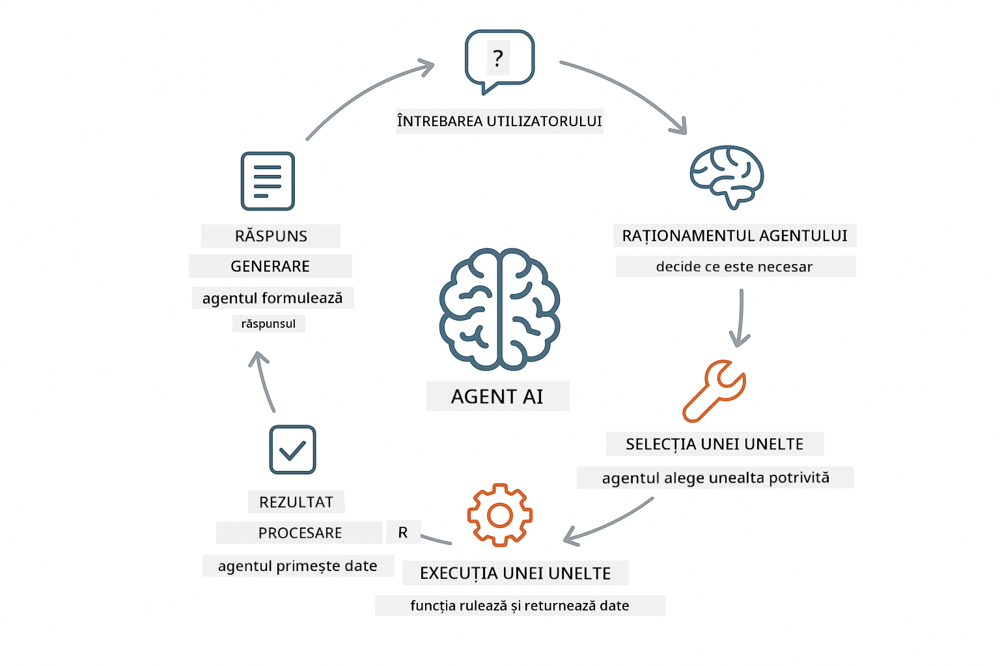
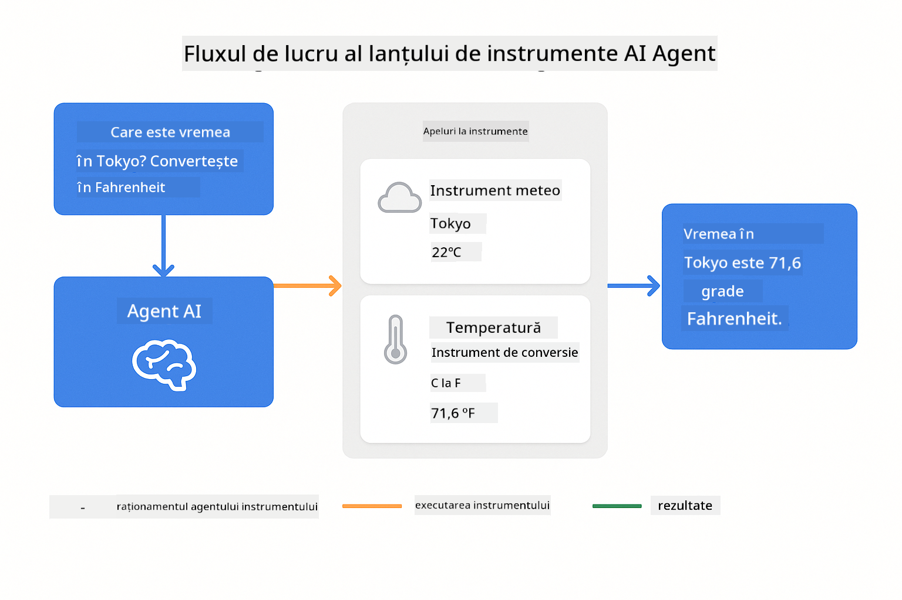
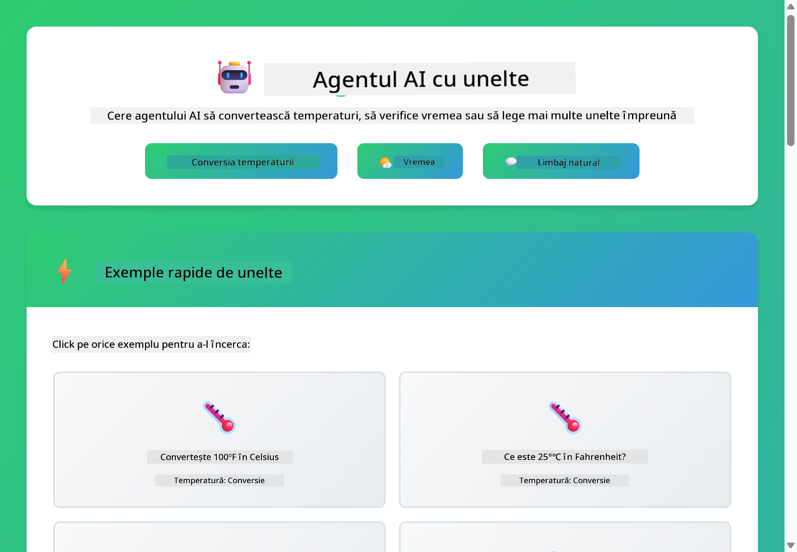

<!--
CO_OP_TRANSLATOR_METADATA:
{
  "original_hash": "aa23f106e7f53270924c9dd39c629004",
  "translation_date": "2025-12-13T19:21:33+00:00",
  "source_file": "04-tools/README.md",
  "language_code": "ro"
}
-->
# Modulul 04: Agenți AI cu Unelte

## Cuprins

- [Ce Vei Învăța](../../../04-tools)
- [Prerechizite](../../../04-tools)
- [Înțelegerea Agenților AI cu Unelte](../../../04-tools)
- [Cum Funcționează Apelarea Uneltelor](../../../04-tools)
  - [Definiții ale Uneltelor](../../../04-tools)
  - [Luarea Deciziilor](../../../04-tools)
  - [Executare](../../../04-tools)
  - [Generarea Răspunsului](../../../04-tools)
- [Lanțuirea Uneltelor](../../../04-tools)
- [Rularea Aplicației](../../../04-tools)
- [Folosirea Aplicației](../../../04-tools)
  - [Încearcă Utilizarea Simplă a Unei Unelte](../../../04-tools)
  - [Testează Lanțuirea Uneltelor](../../../04-tools)
  - [Vezi Fluxul Conversației](../../../04-tools)
  - [Observă Raționamentul](../../../04-tools)
  - [Experimentează cu Cereri Diferite](../../../04-tools)
- [Concepte Cheie](../../../04-tools)
  - [Modelul ReAct (Raționare și Acțiune)](../../../04-tools)
  - [Descrierile Uneltelor Contează](../../../04-tools)
  - [Gestionarea Sesiunii](../../../04-tools)
  - [Gestionarea Erorilor](../../../04-tools)
- [Unelte Disponibile](../../../04-tools)
- [Când să Folosești Agenți Bazati pe Unelte](../../../04-tools)
- [Pașii Următori](../../../04-tools)

## Ce Vei Învăța

Până acum, ai învățat cum să porți conversații cu AI, să structurezi prompturi eficient și să bazezi răspunsurile pe documentele tale. Dar există încă o limitare fundamentală: modelele de limbaj pot genera doar text. Nu pot verifica vremea, face calcule, interoga baze de date sau interacționa cu sisteme externe.

Uneltele schimbă acest lucru. Dând modelului acces la funcții pe care le poate apela, îl transformi din generator de text într-un agent care poate lua acțiuni. Modelul decide când are nevoie de o unealtă, ce unealtă să folosească și ce parametri să transmită. Codul tău execută funcția și returnează rezultatul. Modelul încorporează acel rezultat în răspunsul său.

## Prerechizite

- Modulul 01 finalizat (resurse Azure OpenAI implementate)
- Fișier `.env` în directorul rădăcină cu acreditările Azure (creat de `azd up` în Modulul 01)

> **Notă:** Dacă nu ai finalizat Modulul 01, urmează mai întâi instrucțiunile de implementare de acolo.

## Înțelegerea Agenților AI cu Unelte

Un agent AI cu unelte urmează un model de raționare și acțiune (ReAct):

1. Utilizatorul pune o întrebare
2. Agentul raționează ce trebuie să știe
3. Agentul decide dacă are nevoie de o unealtă pentru a răspunde
4. Dacă da, agentul apelează unealta potrivită cu parametrii corecți
5. Unealta execută și returnează date
6. Agentul încorporează rezultatul și oferă răspunsul final



*Modelul ReAct - cum agenții AI alternează între raționare și acțiune pentru a rezolva probleme*

Acest proces se întâmplă automat. Tu definești uneltele și descrierile lor. Modelul se ocupă de luarea deciziilor despre când și cum să le folosească.

## Cum Funcționează Apelarea Uneltelor

**Definiții ale Uneltelor** - [WeatherTool.java](../../../04-tools/src/main/java/com/example/langchain4j/agents/tools/WeatherTool.java) | [TemperatureTool.java](../../../04-tools/src/main/java/com/example/langchain4j/agents/tools/TemperatureTool.java)

Definiți funcții cu descrieri clare și specificații ale parametrilor. Modelul vede aceste descrieri în promptul său de sistem și înțelege ce face fiecare unealtă.

```java
@Component
public class WeatherTool {
    
    @Tool("Get the current weather for a location")
    public String getCurrentWeather(@P("Location name") String location) {
        // Logica ta de căutare a vremii
        return "Weather in " + location + ": 22°C, cloudy";
    }
}

@AiService
public interface Assistant {
    String chat(@MemoryId String sessionId, @UserMessage String message);
}

// Asistentul este conectat automat de Spring Boot cu:
// - Bean-ul ChatModel
// - Toate metodele @Tool din clasele @Component
// - ChatMemoryProvider pentru gestionarea sesiunii
```

> **🤖 Încearcă cu [GitHub Copilot](https://github.com/features/copilot) Chat:** Deschide [`WeatherTool.java`](../../../04-tools/src/main/java/com/example/langchain4j/agents/tools/WeatherTool.java) și întreabă:
> - "Cum aș integra o API reală de vreme precum OpenWeatherMap în loc de date mock?"
> - "Ce face o descriere bună a unei unelte care ajută AI-ul să o folosească corect?"
> - "Cum gestionez erorile API și limitele de rată în implementările uneltelor?"

**Luarea Deciziilor**

Când un utilizator întreabă „Cum e vremea în Seattle?”, modelul recunoaște că are nevoie de unealta de vreme. Generează un apel de funcție cu parametrul locație setat la „Seattle”.

**Executare** - [AgentService.java](../../../04-tools/src/main/java/com/example/langchain4j/agents/service/AgentService.java)

Spring Boot injectează automat interfața declarativă `@AiService` cu toate uneltele înregistrate, iar LangChain4j execută apelurile uneltelor automat.

> **🤖 Încearcă cu [GitHub Copilot](https://github.com/features/copilot) Chat:** Deschide [`AgentService.java`](../../../04-tools/src/main/java/com/example/langchain4j/agents/service/AgentService.java) și întreabă:
> - "Cum funcționează modelul ReAct și de ce este eficient pentru agenții AI?"
> - "Cum decide agentul ce unealtă să folosească și în ce ordine?"
> - "Ce se întâmplă dacă execuția unei unelte eșuează - cum ar trebui să gestionez erorile robust?"

**Generarea Răspunsului**

Modelul primește datele meteo și le formatează într-un răspuns în limbaj natural pentru utilizator.

### De ce să Folosești Servicii AI Declarative?

Acest modul folosește integrarea LangChain4j cu Spring Boot și interfețele declarative `@AiService`:

- **Injectare automată Spring Boot** - ChatModel și uneltele sunt injectate automat
- **Modelul @MemoryId** - Gestionare automată a memoriei pe sesiuni
- **Instanță unică** - Asistent creat o singură dată și reutilizat pentru performanță mai bună
- **Executare tip-safe** - Metode Java apelate direct cu conversie de tip
- **Orchestrare multi-turn** - Gestionează automat lanțuirea uneltelor
- **Fără boilerplate** - Fără apeluri manuale AiServices.builder() sau HashMap pentru memorie

Abordările alternative (manual `AiServices.builder()`) necesită mai mult cod și pierd beneficiile integrării Spring Boot.

## Lanțuirea Uneltelor

**Lanțuirea Uneltelor** - AI-ul poate apela mai multe unelte în secvență. Întreabă „Cum e vremea în Seattle și ar trebui să iau umbrelă?” și urmărește cum leagă `getCurrentWeather` cu raționamentul despre echipamentul pentru ploaie.

<a href="images/tool-chaining.png"></a>

*Apeluri secvențiale ale uneltelor - ieșirea unei unelte alimentează următoarea decizie*

**Eșecuri Grațioase** - Cere vremea într-un oraș care nu există în datele mock. Unealta returnează un mesaj de eroare, iar AI-ul explică că nu poate ajuta. Uneltele eșuează în siguranță.

Acest lucru se întâmplă într-un singur schimb de conversație. Agentul orchestrează apeluri multiple de unelte autonom.

## Rularea Aplicației

**Verifică implementarea:**

Asigură-te că fișierul `.env` există în directorul rădăcină cu acreditările Azure (creat în Modulul 01):
```bash
cat ../.env  # Ar trebui să afișeze AZURE_OPENAI_ENDPOINT, API_KEY, DEPLOYMENT
```

**Pornește aplicația:**

> **Notă:** Dacă ai pornit deja toate aplicațiile folosind `./start-all.sh` din Modulul 01, acest modul rulează deja pe portul 8084. Poți sări peste comenzile de pornire de mai jos și să accesezi direct http://localhost:8084.

**Opțiunea 1: Folosind Spring Boot Dashboard (Recomandat pentru utilizatorii VS Code)**

Containerul de dezvoltare include extensia Spring Boot Dashboard, care oferă o interfață vizuală pentru gestionarea tuturor aplicațiilor Spring Boot. O găsești în bara de activități din stânga VS Code (caută iconița Spring Boot).

Din Spring Boot Dashboard poți:
- Vedea toate aplicațiile Spring Boot disponibile în workspace
- Porni/opri aplicații cu un singur click
- Vizualiza jurnalele aplicațiilor în timp real
- Monitoriza starea aplicațiilor

Apasă butonul play de lângă „tools” pentru a porni acest modul sau pornește toate modulele simultan.


**Opțiunea 2: Folosind scripturi shell**

Pornește toate aplicațiile web (modulele 01-04):

**Bash:**
```bash
cd ..  # Din directorul rădăcină
./start-all.sh
```

**PowerShell:**
```powershell
cd ..  # Din directorul rădăcină
.\start-all.ps1
```

Sau pornește doar acest modul:

**Bash:**
```bash
cd 04-tools
./start.sh
```

**PowerShell:**
```powershell
cd 04-tools
.\start.ps1
```

Ambele scripturi încarcă automat variabilele de mediu din fișierul `.env` din rădăcină și vor construi JAR-urile dacă nu există.

> **Notă:** Dacă preferi să construiești manual toate modulele înainte de pornire:
>
> **Bash:**
> ```bash
> cd ..  # Go to root directory
> mvn clean package -DskipTests
> ```
>
> **PowerShell:**
> ```powershell
> cd ..  # Go to root directory
> mvn clean package -DskipTests
> ```

Deschide http://localhost:8084 în browser.

**Pentru oprire:**

**Bash:**
```bash
./stop.sh  # Doar acest modul
# Sau
cd .. && ./stop-all.sh  # Toate modulele
```

**PowerShell:**
```powershell
.\stop.ps1  # Doar acest modul
# Sau
cd ..; .\stop-all.ps1  # Toate modulele
```

## Folosirea Aplicației

Aplicația oferă o interfață web unde poți interacționa cu un agent AI care are acces la unelte pentru vreme și conversie temperatură.

<a href="images/tools-homepage.png"></a>

*Interfața Uneltelor Agentului AI - exemple rapide și chat pentru interacțiunea cu uneltele*

**Încearcă Utilizarea Simplă a Unei Unelte**

Începe cu o cerere simplă: „Convertește 100 de grade Fahrenheit în Celsius”. Agentul recunoaște că are nevoie de unealta de conversie a temperaturii, o apelează cu parametrii corecți și returnează rezultatul. Observă cât de natural se simte - nu ai specificat ce unealtă să folosească sau cum să o apeleze.

**Testează Lanțuirea Uneltelor**

Acum încearcă ceva mai complex: „Cum e vremea în Seattle și convertește-o în Fahrenheit?” Urmărește cum agentul lucrează pas cu pas. Mai întâi obține vremea (care returnează în Celsius), recunoaște că trebuie să convertească în Fahrenheit, apelează unealta de conversie și combină ambele rezultate într-un singur răspuns.

**Vezi Fluxul Conversației**

Interfața de chat păstrează istoricul conversației, permițând interacțiuni multi-turn. Poți vedea toate întrebările și răspunsurile anterioare, făcând ușor să urmărești conversația și să înțelegi cum agentul construiește contextul pe parcursul schimburilor multiple.

<a href="images/tools-conversation-demo.png"></a>

*Conversație multi-turn arătând conversii simple, căutări meteo și lanțuirea uneltelor*

**Experimentează cu Cereri Diferite**

Încearcă diverse combinații:
- Căutări meteo: „Cum e vremea în Tokyo?”
- Conversii de temperatură: „Cât este 25°C în Kelvin?”
- Interogări combinate: „Verifică vremea în Paris și spune-mi dacă e peste 20°C”

Observă cum agentul interpretează limbajul natural și îl mapează la apeluri adecvate ale uneltelor.

## Concepte Cheie

**Modelul ReAct (Raționare și Acțiune)**

Agentul alternează între raționare (deciderea ce să facă) și acțiune (folosirea uneltelor). Acest model permite rezolvarea autonomă a problemelor, nu doar răspunsuri la instrucțiuni.

**Descrierile Uneltelor Contează**

Calitatea descrierilor uneltelor tale afectează direct cât de bine le folosește agentul. Descrierile clare și specifice ajută modelul să înțeleagă când și cum să apeleze fiecare unealtă.

**Gestionarea Sesiunii**

Anotarea `@MemoryId` permite gestionarea automată a memoriei pe baza sesiunii. Fiecare ID de sesiune primește o instanță `ChatMemory` gestionată de bean-ul `ChatMemoryProvider`, eliminând necesitatea urmăririi manuale a memoriei.

**Gestionarea Erorilor**

Uneltele pot eșua - API-urile pot expira, parametrii pot fi invalizi, serviciile externe pot cădea. Agenții de producție au nevoie de gestionarea erorilor astfel încât modelul să poată explica problemele sau să încerce alternative.

## Unelte Disponibile

**Unelte Meteo** (date mock pentru demonstrație):
- Obține vremea curentă pentru o locație
- Obține prognoza pe mai multe zile

**Unelte de Conversie a Temperaturii**:
- Celsius în Fahrenheit
- Fahrenheit în Celsius
- Celsius în Kelvin
- Kelvin în Celsius
- Fahrenheit în Kelvin
- Kelvin în Fahrenheit

Acestea sunt exemple simple, dar modelul se extinde la orice funcție: interogări de baze de date, apeluri API, calcule, operații pe fișiere sau comenzi de sistem.

## Când să Folosești Agenți Bazati pe Unelte

**Folosește unelte când:**
- Răspunsul necesită date în timp real (vreme, prețuri acțiuni, inventar)
- Trebuie să faci calcule mai complexe decât matematica simplă
- Accesezi baze de date sau API-uri
- Ieși acțiuni (trimitere emailuri, creare tichete, actualizare înregistrări)
- Combină mai multe surse de date

**Nu folosi unelte când:**
- Întrebările pot fi răspunse din cunoștințe generale
- Răspunsul este pur conversațional
- Latenta uneltelor ar face experiența prea lentă

## Pașii Următori

**Următorul Modul:** [05-mcp - Model Context Protocol (MCP)](../05-mcp/README.md)

---

**Navigare:** [← Anterior: Modulul 03 - RAG](../03-rag/README.md) | [Înapoi la Principal](../README.md) | [Următor: Modulul 05 - MCP →](../05-mcp/README.md)

---

<!-- CO-OP TRANSLATOR DISCLAIMER START -->
**Declinare de responsabilitate**:  
Acest document a fost tradus folosind serviciul de traducere AI [Co-op Translator](https://github.com/Azure/co-op-translator). Deși ne străduim pentru acuratețe, vă rugăm să rețineți că traducerile automate pot conține erori sau inexactități. Documentul original în limba sa nativă trebuie considerat sursa autorizată. Pentru informații critice, se recomandă traducerea profesională realizată de un specialist uman. Nu ne asumăm răspunderea pentru eventualele neînțelegeri sau interpretări greșite rezultate din utilizarea acestei traduceri.
<!-- CO-OP TRANSLATOR DISCLAIMER END -->