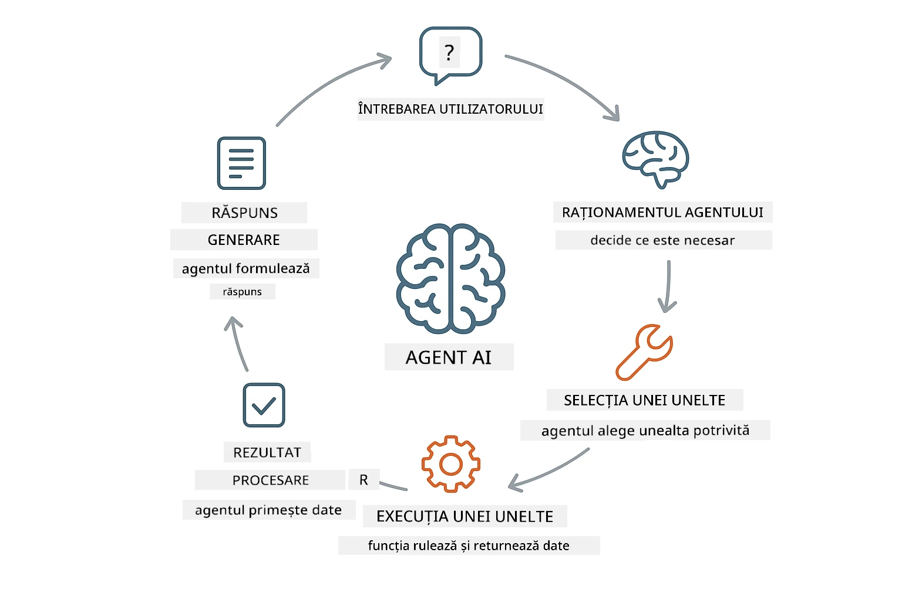
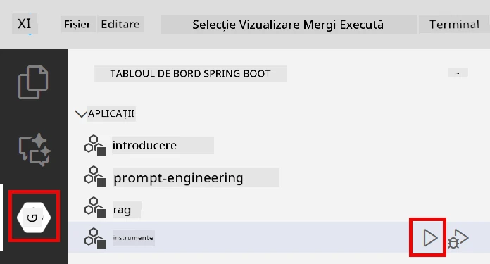
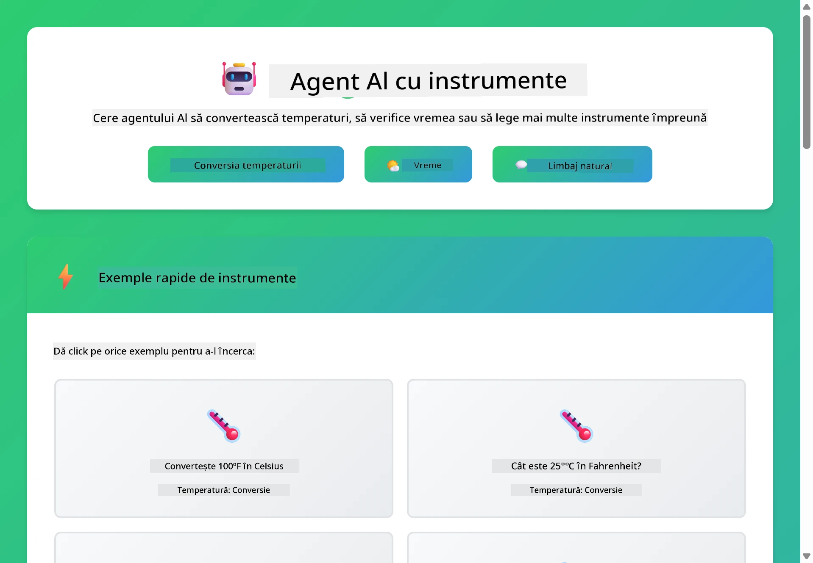

<!--
CO_OP_TRANSLATOR_METADATA:
{
  "original_hash": "844788938b26242f3cc54ce0d0951bea",
  "translation_date": "2026-01-06T01:06:40+00:00",
  "source_file": "04-tools/README.md",
  "language_code": "ro"
}
-->
# Modulul 04: Agenți AI cu Instrumente

## Cuprins

- [Ce vei învăța](../../../04-tools)
- [Precondiții](../../../04-tools)
- [Înțelegerea Agenților AI cu Instrumente](../../../04-tools)
- [Cum funcționează apelarea instrumentelor](../../../04-tools)
  - [Definiții ale instrumentelor](../../../04-tools)
  - [Luarea deciziilor](../../../04-tools)
  - [Executare](../../../04-tools)
  - [Generarea răspunsului](../../../04-tools)
- [Lanțuirea instrumentelor](../../../04-tools)
- [Rularea aplicației](../../../04-tools)
- [Utilizarea aplicației](../../../04-tools)
  - [Încearcă utilizarea simplă a instrumentelor](../../../04-tools)
  - [Testează lanțuirea instrumentelor](../../../04-tools)
  - [Vezi fluxul conversației](../../../04-tools)
  - [Experimentează cu cereri diferite](../../../04-tools)
- [Concepte cheie](../../../04-tools)
  - [Modelul ReAct (Raționament și Acțiune)](../../../04-tools)
  - [Descrierile instrumentelor contează](../../../04-tools)
  - [Gestionarea sesiunii](../../../04-tools)
  - [Gestionarea erorilor](../../../04-tools)
- [Instrumente disponibile](../../../04-tools)
- [Când să folosești agenți bazati pe instrumente](../../../04-tools)
- [Pașii următori](../../../04-tools)

## Ce vei învăța

Până acum ai învățat cum să porți conversații cu AI, să structurezi solicitările eficient și să bazezi răspunsurile pe documentele tale. Dar există totuși o limitare fundamentală: modelele de limbaj pot genera doar text. Nu pot verifica vremea, nu pot efectua calcule, nu pot interoga baze de date sau interacționa cu sisteme externe.

Instrumentele schimbă acest lucru. Oferind modelului acces la funcții pe care le poate apela, îl transformi dintr-un generator de text într-un agent care poate lua acțiuni. Modelul decide când are nevoie de un instrument, ce instrument să folosească și ce parametri să transmită. Codul tău execută funcția și returnează rezultatul. Modelul încorporează acel rezultat în răspunsul său.

## Precondiții

- Ai finalizat Modulul 01 (resurse Azure OpenAI implementate)
- Fișierul `.env` în directorul rădăcină cu acreditările Azure (creat prin `azd up` în Modulul 01)

> **Notă:** Dacă nu ai finalizat Modulul 01, urmează mai întâi instrucțiunile de implementare de acolo.

## Înțelegerea Agenților AI cu Instrumente

> **📝 Notă:** Termenul „agenți” în acest modul se referă la asistenți AI îmbunătățiți cu capabilități de apelare a instrumentelor. Acest lucru este diferit de modelele **Agentic AI** (agenți autonomi cu planificare, memorie și raționament în mai mulți pași) pe care le vom acoperi în [Modulul 05: MCP](../05-mcp/README.md).

Un agent AI cu instrumente urmează un model de raționament și acțiune (ReAct):

1. Utilizatorul pune o întrebare
2. Agentul raționează despre ce trebuie să știe
3. Agentul decide dacă are nevoie de un instrument pentru a răspunde
4. Dacă da, agentul apelează instrumentul potrivit cu parametrii corecți
5. Instrumentul execută și returnează date
6. Agentul încorporează rezultatul și oferă răspunsul final



*Modelul ReAct - cum agenții AI alternează între raționament și acțiune pentru a rezolva probleme*

Acest proces se întâmplă automat. Tu definești instrumentele și descrierile lor. Modelul gestionează luarea deciziilor despre când și cum să le folosească.

## Cum funcționează apelarea instrumentelor

### Definiții ale instrumentelor

[WeatherTool.java](../../../04-tools/src/main/java/com/example/langchain4j/agents/tools/WeatherTool.java) | [TemperatureTool.java](../../../04-tools/src/main/java/com/example/langchain4j/agents/tools/TemperatureTool.java)

Definiești funcții cu descrieri clare și specificații de parametri. Modelul vede aceste descrieri în promptul sistem și înțelege ce face fiecare instrument.

```java
@Component
public class WeatherTool {
    
    @Tool("Get the current weather for a location")
    public String getCurrentWeather(@P("Location name") String location) {
        // Logica de căutare a vremii
        return "Weather in " + location + ": 22°C, cloudy";
    }
}

@AiService
public interface Assistant {
    String chat(@MemoryId String sessionId, @UserMessage String message);
}

// Asistentul este automat conectat de Spring Boot cu:
// - Bean-ul ChatModel
// - Toate metodele @Tool din clasele @Component
// - ChatMemoryProvider pentru gestionarea sesiunii
```

> **🤖 Încearcă cu [GitHub Copilot](https://github.com/features/copilot) Chat:** Deschide [`WeatherTool.java`](../../../04-tools/src/main/java/com/example/langchain4j/agents/tools/WeatherTool.java) și întreabă:
> - „Cum aș putea integra o API reală meteo ca OpenWeatherMap în loc de date mock?”
> - „Ce face o descriere bună a unui instrument care ajută AI să-l folosească corect?”
> - „Cum gestionez erorile API și limitele de rată în implementările instrumentelor?”

### Luarea deciziilor

Când utilizatorul întreabă „Cum este vremea în Seattle?”, modelul recunoaște că are nevoie de instrumentul meteo. Generează un apel de funcție cu parametrul locație setat la „Seattle”.

### Executare

[AgentService.java](../../../04-tools/src/main/java/com/example/langchain4j/agents/service/AgentService.java)

Spring Boot leagă automat interfața declarativă `@AiService` cu toate instrumentele înregistrate, iar LangChain4j execută apelurile către instrumente automat.

> **🤖 Încearcă cu [GitHub Copilot](https://github.com/features/copilot) Chat:** Deschide [`AgentService.java`](../../../04-tools/src/main/java/com/example/langchain4j/agents/service/AgentService.java) și întreabă:
> - „Cum funcționează modelul ReAct și de ce este eficient pentru agenții AI?”
> - „Cum decide agentul ce instrument să folosească și în ce ordine?”
> - „Ce se întâmplă dacă execuția unui instrument eșuează - cum ar trebui să tratez erorile robust?”

### Generarea răspunsului

Modelul primește datele meteo și le formatează într-un răspuns natural pentru utilizator.

### De ce să folosești servicii AI declarative?

Acest modul folosește integrarea LangChain4j cu Spring Boot prin interfețe declarative `@AiService`:

- **Legare automată Spring Boot** - ChatModel și instrumentele sunt injectate automat
- **Modelul @MemoryId** - Gestionarea automată a memoriei bazate pe sesiune
- **Instanță unică** - Asistent creat o singură dată și reutilizat pentru performanță mai bună
- **Executare tip-sigură** - Metode Java apelate direct cu conversie de tip
- **Orchestrare multi-turn** - Gestionează automat lanțuirea instrumentelor
- **Zero boilerplate** - Fără apeluri manuale AiServices.builder() sau mapări de memorie HashMap

Abordările alternative (manual `AiServices.builder()`) necesită mai mult cod și pierd beneficiile integrării cu Spring Boot.

## Lanțuirea instrumentelor

**Lanțuirea instrumentelor** - AI poate apela mai multe instrumente în secvență. Întreabă „Cum este vremea în Seattle și ar trebui să iau umbrela?” și urmărește cum leagă `getCurrentWeather` cu raționamentul despre gear-ul pentru ploaie.

<a href="images/tool-chaining.png"></a>

*Apeluri secvențiale la instrumente - ieșirea unui instrument alimentează decizia următoare*

**Eșecuri grațioase** - Cere vremea într-un oraș care nu e în datele mock. Instrumentul returnează un mesaj de eroare, iar AI explică că nu poate ajuta. Instrumentele eșuează în siguranță.

Acest proces se întâmplă într-o singură rundă de conversație. Agentul orchestrează autonom apeluri multiple de instrumente.

## Rularea aplicației

**Verifică implementarea:**

Asigură-te că fișierul `.env` există în directorul rădăcină cu acreditările Azure (creat în Modulul 01):
```bash
cat ../.env  # Ar trebui să afișeze AZURE_OPENAI_ENDPOINT, API_KEY, DEPLOYMENT
```

**Pornește aplicația:**

> **Notă:** Dacă ai pornit deja toate aplicațiile folosind `./start-all.sh` din Modulul 01, acest modul rulează deja pe portul 8084. Poți sări peste comenzile de pornire de mai jos și să accesezi direct http://localhost:8084.

**Opțiunea 1: Folosirea Spring Boot Dashboard (recomandat pentru utilizatorii VS Code)**

Containerul de dezvoltare include extensia Spring Boot Dashboard, care oferă o interfață vizuală pentru gestionarea tuturor aplicațiilor Spring Boot. O poți găsi în bara de activități din stânga VS Code (caută iconița Spring Boot).

Din Spring Boot Dashboard poți:
- Vizualiza toate aplicațiile Spring Boot disponibile în spațiul de lucru
- Porni/opri aplicațiile cu un singur clic
- Vizualiza jurnalele aplicațiilor în timp real
- Monitoriza starea aplicației

Apasă butonul de redare de lângă „tools” pentru a porni acest modul sau pornește toate modulele simultan.



**Opțiunea 2: Folosind scripturi shell**

Pornește toate aplicațiile web (modulele 01-04):

**Bash:**
```bash
cd ..  # Din directorul rădăcină
./start-all.sh
```

**PowerShell:**
```powershell
cd ..  # Din directorul rădăcină
.\start-all.ps1
```

Sau pornește doar acest modul:

**Bash:**
```bash
cd 04-tools
./start.sh
```

**PowerShell:**
```powershell
cd 04-tools
.\start.ps1
```

Ambele scripturi încarcă automat variabilele de mediu din fișierul `.env` rădăcină și vor compila JAR-urile dacă nu există.

> **Notă:** Dacă preferi să compilezi manual toate modulele înainte de pornire:
>
> **Bash:**
> ```bash
> cd ..  # Go to root directory
> mvn clean package -DskipTests
> ```
>
> **PowerShell:**
> ```powershell
> cd ..  # Go to root directory
> mvn clean package -DskipTests
> ```

Deschide http://localhost:8084 în browserul tău.

**Pentru oprire:**

**Bash:**
```bash
./stop.sh  # Numai acest modul
# Sau
cd .. && ./stop-all.sh  # Toate modulele
```

**PowerShell:**
```powershell
.\stop.ps1  # Doar acest modul
# Sau
cd ..; .\stop-all.ps1  # Toate modulele
```

## Utilizarea aplicației

Aplicația oferă o interfață web unde poți interacționa cu un agent AI care are acces la instrumentele pentru vreme și conversie temperatură.

<a href="images/tools-homepage.png"></a>

*Interfața AI Agent Tools - exemple rapide și chat pentru interacțiunea cu instrumentele*

### Încearcă utilizarea simplă a instrumentelor

Începe cu o solicitare simplă: „Convertește 100 de grade Fahrenheit în Celsius”. Agentul recunoaște că are nevoie de instrumentul de conversie temperatură, îl apelează cu parametrii corecți și returnează rezultatul. Observă cât de natural se simte – nu ai specificat ce instrument să folosească sau cum să-l apeleze.

### Testează lanțuirea instrumentelor

Acum încearcă ceva mai complex: „Cum este vremea în Seattle și convertește-o în Fahrenheit?” Urmărește cum agentul lucrează pas cu pas. Mai întâi obține vremea (care returnează în Celsius), recunoaște că trebuie să convertească în Fahrenheit, apelează instrumentul de conversie și combină ambele rezultate într-un singur răspuns.

### Vezi fluxul conversației

Interfața de chat păstrează istoricul conversației, permițând interacțiuni multi-turn. Poți vedea toate întrebările și răspunsurile anterioare, făcând ușor să urmărești conversația și să înțelegi cum agentul construiește contextul pe mai multe schimburi.

<a href="images/tools-conversation-demo.png"></a>

*Conversație multi-turn arătând conversii simple, căutări meteo și lanțuirea instrumentelor*

### Experimentează cu cereri diferite

Încearcă diverse combinații:
- Căutări meteo: „Cum este vremea în Tokyo?”
- Conversii temperatură: „Cât este 25°C în Kelvin?”
- Întrebări combinate: „Verifică vremea în Paris și spune-mi dacă este peste 20°C”

Observă cum agentul interpretează limbajul natural și îl mapează la apeluri potrivite ale instrumentelor.

## Concepte cheie

### Modelul ReAct (Raționament și Acțiune)

Agentul alternează între raționament (decide ce să facă) și acțiune (folosește instrumente). Acest model permite rezolvarea autonomă a problemelor în loc să răspundă doar la instrucțiuni.

### Descrierile instrumentelor contează

Calitatea descrierilor instrumentelor influențează direct cât de bine le folosește agentul. Descrierile clare și specifice ajută modelul să înțeleagă când și cum să apeleze fiecare instrument.

### Gestionarea sesiunii

Anotarea `@MemoryId` permite gestionarea automată a memoriei bazate pe sesiuni. Fiecare ID de sesiune primește o instanță `ChatMemory` gestionată de bean-ul `ChatMemoryProvider`, eliminând nevoia de urmărire manuală a memoriei.

### Gestionarea erorilor

Instrumentele pot eșua – API-urile pot avea timeout, parametrii pot fi invalizi, serviciile externe pot cădea. Agenții în producție au nevoie de tratarea erorilor astfel încât modelul să poată explica problemele sau să încerce alternative.

## Instrumente disponibile

**Instrumente meteo** (date mock pentru demonstrație):
- Obține vremea curentă pentru o locație
- Obține prognoza pe mai multe zile

**Instrumente pentru conversie temperatură**:
- Celsius în Fahrenheit
- Fahrenheit în Celsius
- Celsius în Kelvin
- Kelvin în Celsius
- Fahrenheit în Kelvin
- Kelvin în Fahrenheit

Acestea sunt exemple simple, dar modelul se extinde la orice funcție: interogări baze de date, apeluri API, calcule, operații pe fișiere sau comenzi de sistem.

## Când să folosești agenți bazati pe instrumente

**Folosește instrumente când:**
- Răspunsurile necesită date în timp real (vreme, prețuri acțiuni, inventar)
- Ai nevoie să efectuezi calcule mai complexe decât matematica de bază
- Accesezi baze de date sau API-uri
- Ieii acțiuni (trimiteri email, creare tichete, actualizare înregistrări)
- Combinarea mai multor surse de date

**Nu folosi instrumente când:**
- Întrebările pot fi răspunse din cunoștințe generale
- Răspunsul este pur conversațional
- Latenta instrumentului ar face experiența prea lentă

## Pașii următori

**Următorul modul:** [05-mcp - Model Context Protocol (MCP)](../05-mcp/README.md)

---

**Navigare:** [← Anterior: Modulul 03 - RAG](../03-rag/README.md) | [Înapoi la principal](../README.md) | [Următor: Modulul 05 - MCP →](../05-mcp/README.md)

---

<!-- CO-OP TRANSLATOR DISCLAIMER START -->
**Declinare de responsabilitate**:
Acest document a fost tradus folosind serviciul de traducere automată AI [Co-op Translator](https://github.com/Azure/co-op-translator). Deși ne străduim pentru acuratețe, vă rugăm să rețineți că traducerile automate pot conține erori sau inexactități. Documentul original în limba sa nativă trebuie considerat sursa autoritară. Pentru informații critice, se recomandă utilizarea unei traduceri profesionale realizate de un traducător uman. Nu ne asumăm răspunderea pentru eventualele neînțelegeri sau interpretări greșite rezultate din utilizarea acestei traduceri.
<!-- CO-OP TRANSLATOR DISCLAIMER END -->