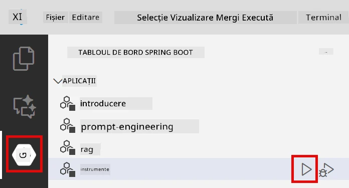
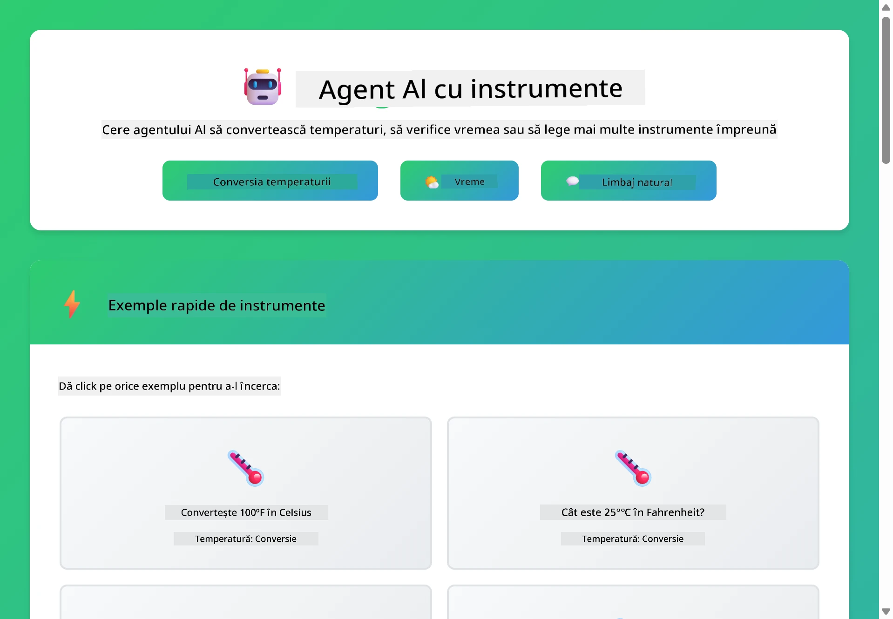
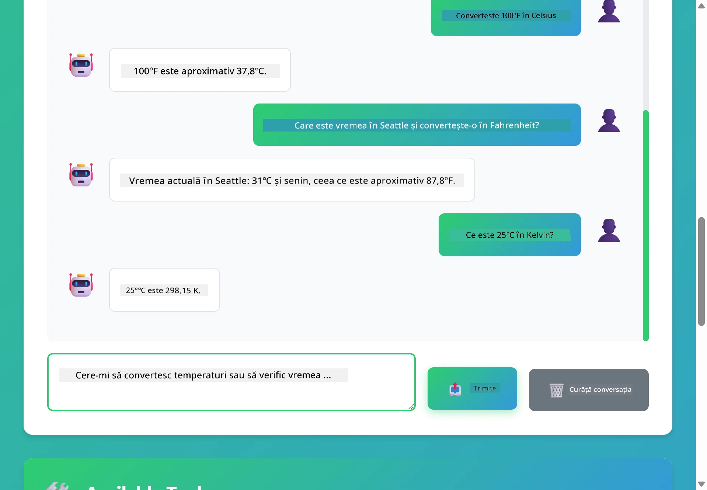

# Modulul 04: Agenți AI cu Unelte

## Cuprins

- [Parcurgere Video](#parcurgere-video)
- [Ce Vei Învăța](#ce-vei-învăța)
- [Precondiții](#precondiții)
- [Înțelegerea Agenților AI cu Unelte](#înțelegerea-agenților-ai-cu-unelte)
- [Cum Funcționează Apelarea Uneltelor](#cum-funcționează-apelarea-uneltelor)
  - [Definițiile Uneltelor](#definițiile-uneltelor)
  - [Luarea Deciziilor](#luarea-deciziilor)
  - [Executarea](#executarea)
  - [Generarea Răspunsului](#generarea-răspunsului)
  - [Arhitectură: Auto-Conectare Spring Boot](#arhitectură-auto-conectare-spring-boot)
- [Lanțuirea Uneltelor](#lanțuirea-uneltelor)
- [Pornirea Aplicației](#pornirea-aplicației)
- [Folosirea Aplicației](#utilizarea-aplicației)
  - [Încearcă Utilizarea Simplă a Unei Unelte](#încearcă-utilizarea-simplă-a-instrumentului)
  - [Testează Lanțuirea Uneltelor](#testează-lanțuirea-instrumentelor)
  - [Vezi Fluxul Conversației](#vezi-fluxul-conversației)
  - [Experimentează cu Cereri Diferite](#experimentează-cu-cereri-diferite)
- [Concepte Cheie](#concepte-cheie)
  - [Modelul ReAct (Raționament și Acțiune)](#tiparul-react-raționare-și-acțiune)
  - [Descrierile Unealtelor Contează](#descrierile-instrumentelor-contează)
  - [Gestionarea Sesiunii](#gestionarea-sesiunilor)
  - [Gestionarea Erorilor](#gestionarea-erorilor)
- [Unelte Disponibile](#instrumente-disponibile)
- [Când să Folosești Agenți Bazati pe Unelte](#când-să-folosești-agenți-bazate-pe-instrumente)
- [Unelte vs RAG](#instrumente-vs-rag)
- [Pașii Următori](#pașii-următori)

## Parcurgere Video

Urmărește această sesiune live care explică cum să începi cu acest modul:

<a href="https://www.youtube.com/watch?v=O_J30kZc0rw"></a>

## Ce Vei Învăța

Până acum, ai învățat cum să ai conversații cu AI, să structurezi prompturi eficient și să ancorezi răspunsuri în documentele tale. Dar există încă o limitare fundamentală: modelele de limbaj pot genera doar text. Ele nu pot verifica vremea, executa calcule, întreba baze de date sau interacționa cu sisteme externe.

Uneltele schimbă asta. Dând modelului acces la funcții pe care le poate apela, îl transformi dintr-un generator de text într-un agent care poate lua acțiuni. Modelul decide când are nevoie de o unealtă, ce unealtă să folosească și ce parametri să trimită. Codul tău execută funcția și returnează rezultatul. Modelul încorporează acel rezultat în răspunsul său.

## Precondiții

- Modulul [01 - Introducere](../01-introduction/README.md) finalizat (resurse Azure OpenAI implementate)
- Modulele anterioare recomandate (acest modul face referire la [conceptul RAG din Modulul 03](../03-rag/README.md) în comparația Unelte vs RAG)
- Fișier `.env` în directorul rădăcină cu acreditări Azure (creat de `azd up` în Modulul 01)

> **Notă:** Dacă nu ai terminat Modulul 01, urmează întâi instrucțiunile de implementare de acolo.

## Înțelegerea Agenților AI cu Unelte

> **📝 Notă:** Termenul „agenți” în acest modul se referă la asistenți AI îmbunătățiți cu capabilități de apelare a uneltelor. Acest lucru este diferit de modelele **Agentic AI** (agenți autonomi cu planificare, memorie și raționament pe mai mulți pași) pe care le vom aborda în [Modulul 05: MCP](../05-mcp/README.md).

Fără unelte, un model de limbaj poate doar genera text pe baza datelor de antrenament. Întreabă-l care este vremea în prezent, și el trebuie să ghicească. Dă-i unelte și poate apela o API meteo, efectua calcule sau interoga o bază de date — apoi împletește acele rezultate reale în răspunsul său.


*Fără unelte modelul poate doar ghici — cu unelte poate apela API-uri, executa calcule și returna date în timp real.*

Un agent AI cu unelte urmează un model **Raționare și Acțiune (ReAct)**. Modelul nu doar răspunde — gândește ce are nevoie, acționează apelând o unealtă, observă rezultatul și apoi decide dacă să acționeze din nou sau să ofere răspunsul final:

1. **Raționează** — Agentul analizează întrebarea utilizatorului și determină ce informație îi trebuie
2. **Acționează** — Agentul selectează unealta potrivită, generează parametrii corecți și o apelează
3. **Observează** — Agentul primește rezultatul uneltei și evaluează rezultatul
4. **Repetă sau Răspunde** — Dacă este nevoie de mai multe date, agentul revine la pasul anterior; altfel compune un răspuns în limbaj natural


*Ciclul ReAct — agentul raționează ce să facă, acționează apelând o unealtă, observă rezultatul și repetă până poate oferi răspunsul final.*

Acest proces se întâmplă automat. Definiți uneltele și descrierile lor. Modelul gestionează luarea deciziilor despre când și cum să le utilizeze.

## Cum Funcționează Apelarea Uneltelor

### Definițiile Uneltelor

[WeatherTool.java](../../../04-tools/src/main/java/com/example/langchain4j/agents/tools/WeatherTool.java) | [TemperatureTool.java](../../../04-tools/src/main/java/com/example/langchain4j/agents/tools/TemperatureTool.java)

Definiți funcții cu descrieri clare și specificații pentru parametri. Modelul vede aceste descrieri în promptul său de sistem și înțelege ce face fiecare unealtă.

```java
@Component
public class WeatherTool {
    
    @Tool("Get the current weather for a location")
    public String getCurrentWeather(@P("Location name") String location) {
        // Logica ta de căutare a vremii
        return "Weather in " + location + ": 22°C, cloudy";
    }
}

@AiService
public interface Assistant {
    String chat(@MemoryId String sessionId, @UserMessage String message);
}

// Asistentul este configurat automat de Spring Boot cu:
// - Bean-ul ChatModel
// - Toate metodele @Tool din clasele @Component
// - ChatMemoryProvider pentru gestionarea sesiunilor
```

Diagrama de mai jos detaliază fiecare adnotare și arată cum fiecare parte ajută AI să înțeleagă când să apeleze unealta și ce argumente să transmită:


*Anatomia definiției unei unelte — @Tool spune AI-ului când să o folosească, @P descrie fiecare parametru, iar @AiService le conectează pe toate la pornire.*

> **🤖 Încearcă cu [GitHub Copilot](https://github.com/features/copilot) Chat:** Deschide [`WeatherTool.java`](../../../04-tools/src/main/java/com/example/langchain4j/agents/tools/WeatherTool.java) și întreabă:
> - „Cum aș integra o API meteo reală, cum ar fi OpenWeatherMap, în loc de date mock?”
> - „Ce face o descriere bună a unei unelte care ajută AI să o folosească corect?”
> - „Cum gestionez erorile API și limitele de rată în implementările uneltelor?”

### Luarea Deciziilor

Când un utilizator întreabă „Cum e vremea în Seattle?”, modelul nu alege aleator o unealtă. Compară intenția utilizatorului cu fiecare descriere de unealtă de care dispune, evaluează relevanța și selectează cea mai bună potrivire. Apoi generează un apel de funcție structurat cu parametrii corecți — în acest caz, setând `location` la `"Seattle"`.

Dacă nicio unealtă nu corespunde cererii utilizatorului, modelul răspunde din propria sa cunoaștere. Dacă mai multe unelte corespund, alege pe cea mai specifică.


*Modelul evaluează fiecare unealtă disponibilă față de intenția utilizatorului și selectează cea mai bună potrivire — de aceea contează să scrii descrieri clare și specifice pentru unelte.*

### Executarea

[AgentService.java](../../../04-tools/src/main/java/com/example/langchain4j/agents/service/AgentService.java)

Spring Boot auto-conectează interfața declarativă `@AiService` cu toate uneltele înregistrate, iar LangChain4j execută apelurile uneltelor automat. În spate, un apel complet de unealtă parcurge șase etape — de la întrebarea utilizatorului în limbaj natural până la răspunsul final în limbaj natural:


*Fluxul complet — utilizatorul pune o întrebare, modelul selectează o unealtă, LangChain4j o execută, iar modelul împletește rezultatul într-un răspuns natural.*

În culise, `AiServices` rulează același ciclu de apel de unelte pentru orice unealtă — aici ilustrat cu un simplu `Calculator`. Diagrama de secvență de mai jos arată exact ce se întâmplă în spate:


*Ciclul de apelare a uneltei — `AiServices` trimite mesajul tău și schemele uneltelor către LLM, LLM răspunde cu un apel de funcție ca `add(42, 58)`, LangChain4j execută metoda `Calculator` local și trimite rezultatul înapoi pentru răspunsul final.*

> **🤖 Încearcă cu [GitHub Copilot](https://github.com/features/copilot) Chat:** Deschide [`AgentService.java`](../../../04-tools/src/main/java/com/example/langchain4j/agents/service/AgentService.java) și întreabă:
> - „Cum funcționează modelul ReAct și de ce este eficient pentru agenții AI?”
> - „Cum decide agentul ce unealtă să folosească și în ce ordine?”
> - „Ce se întâmplă dacă execuția unei unelte eșuează - cum ar trebui să gestionez erorile solid?”

### Generarea Răspunsului

Modelul primește datele meteo și le formatează într-un răspuns în limbaj natural pentru utilizator.

### Arhitectură: Auto-Conectare Spring Boot

Acest modul folosește integrarea LangChain4j cu Spring Boot și interfețele declarative `@AiService`. La pornire, Spring Boot descoperă fiecare `@Component` care conține metode `@Tool`, bean-ul tău `ChatModel` și `ChatMemoryProvider` — apoi le conectează pe toate într-o singură interfață `Assistant` fără cod repetitiv.


*Interfața @AiService le leagă pe toate - ChatModel, componentele uneltelor și furnizorul de memorie — Spring Boot gestionează automat toate conexiunile.*

Iată ciclul complet de viață al cererii ca diagramă de secvență — de la cererea HTTP prin controller, serviciu și proxy auto-conectat, până la execuția uneltei și înapoi:


*Ciclul complet de viață al cererii Spring Boot — cererea HTTP parcurge controllerul și serviciul către proxy-ul Assistant auto-conectat, care orchestrează automat LLM și apelurile uneltelor.*

Beneficii cheie ale acestei abordări:

- **Auto-conectare Spring Boot** — ChatModel și uneltele injectate automat
- **Model @MemoryId** — Gestionarea automată a memoriei bazate pe sesiune
- **Instanță unică** — Assistant creat o singură dată și reutilizat pentru performanță mai bună
- **Execuție tip-sigură** — metode Java apelate direct cu conversie de tip
- **Orchestrare multi-turn** — gestionează automat lanțuirea uneltelor
- **Zero cod repetitiv** — fără apeluri manuale `AiServices.builder()` sau hărți HashMap pentru memorie

Abordările alternative (manual `AiServices.builder()`) necesită mai mult cod și pierd beneficiile integrării Spring Boot.

## Lanțuirea Uneltelor

**Lanțuirea Uneltelor** — Puterea reală a agenților bazati pe unelte apare când o singură întrebare necesită mai multe unelte. Întreabă „Cum e vremea în Seattle în Fahrenheit?” și agentul leagă automat două unelte: mai întâi apelează `getCurrentWeather` pentru temperatura în Celsius, apoi transmite acea valoare lui `celsiusToFahrenheit` pentru conversie — toate într-un singur tur de conversație.


*Lanțuirea uneltelor în acțiune — agentul apelează mai întâi getCurrentWeather, apoi transferă rezultatul în Celsius către celsiusToFahrenheit și oferă un răspuns combinat.*

**Eșecuri Gratioase** — Cere vremea într-un oraș care nu este în datele mock. Unealta returnează un mesaj de eroare, iar AI explică că nu poate ajuta în loc să se blocheze. Uneltele eșuează în siguranță. Diagrama de mai jos compară cele două abordări — cu gestionare corectă a erorilor agentul prinde excepția și răspunde ajutător, în timp ce fără ea întreaga aplicație cade:


*Când o unealtă eșuează, agentul prinde eroarea și răspunde cu o explicație utilă în loc să se blocheze.*

Acest proces se întâmplă într-un singur tur de conversație. Agentul orchestrează apeluri multiple de unelte autonom.

## Pornirea Aplicației

**Verifică implementarea:**

Asigură-te că fișierul `.env` există în directorul rădăcină cu acreditări Azure (creat în Modulul 01). Rulează acest lucru din directorul modulului (`04-tools/`):

**Bash:**
```bash
cat ../.env  # Ar trebui să afișeze AZURE_OPENAI_ENDPOINT, API_KEY, DEPLOYMENT
```

**PowerShell:**
```powershell
Get-Content ..\.env  # Ar trebui să afișeze AZURE_OPENAI_ENDPOINT, API_KEY, DEPLOYMENT
```

**Pornește aplicația:**

> **Notă:** Dacă ai pornit deja toate aplicațiile folosind `./start-all.sh` din directorul rădăcină (așa cum este descris în Modulul 01), acest modul rulează deja pe portul 8084. Poți să sari peste comenzile de pornire de mai jos și să accesezi direct http://localhost:8084.

**Opțiunea 1: Folosirea Spring Boot Dashboard (Recomandat pentru utilizatorii VS Code)**

Containerul de dezvoltare include extensia Spring Boot Dashboard, care oferă o interfață vizuală pentru gestionarea tuturor aplicațiilor Spring Boot. O poți găsi în bara de activități din partea stângă a VS Code (caută iconița Spring Boot).

Din Spring Boot Dashboard poți:
- Vizualiza toate aplicațiile Spring Boot disponibile în spațiul de lucru
- Porni/opri aplicațiile cu un singur click
- Vizualiza jurnalele aplicațiilor în timp real
- Monitoriza starea aplicațiilor

Pur și simplu apasă butonul de start lângă „tools” pentru a porni acest modul sau pornește toate modulele simultan.

Așa arată Spring Boot Dashboard în VS Code:


*Dashboard-ul Spring Boot în VS Code — pornește, oprește și monitorizează toate modulele dintr-un singur loc*

**Opțiunea 2: Utilizarea scripturilor shell**

Pornește toate aplicațiile web (modulele 01-04):

**Bash:**
```bash
cd ..  # Din directorul rădăcină
./start-all.sh
```

**PowerShell:**
```powershell
cd ..  # Din directorul rădăcină
.\start-all.ps1
```

Sau pornește doar acest modul:

**Bash:**
```bash
cd 04-tools
./start.sh
```

**PowerShell:**
```powershell
cd 04-tools
.\start.ps1
```

Ambele scripturi încarcă automat variabilele de mediu din fișierul rădăcină `.env` și vor construi JAR-urile dacă acestea nu există.

> **Notă:** Dacă preferi să construiești manual toate modulele înainte de a le porni:
>
> **Bash:**
> ```bash
> cd ..  # Go to root directory
> mvn clean package -DskipTests
> ```
>
> **PowerShell:**
> ```powershell
> cd ..  # Go to root directory
> mvn clean package -DskipTests
> ```

Deschide http://localhost:8084 în browserul tău.

**Pentru a opri:**

**Bash:**
```bash
./stop.sh  # Doar acest modul
# Sau
cd .. && ./stop-all.sh  # Toate modulele
```

**PowerShell:**
```powershell
.\stop.ps1  # Doar acest modul
# Sau
cd ..; .\stop-all.ps1  # Toate modulele
```

## Utilizarea Aplicației

Aplicația oferă o interfață web unde poți interacționa cu un agent AI care are acces la instrumente de vreme și conversie a temperaturii. Iată cum arată interfața — include exemple rapide și un panou de chat pentru a trimite cereri:

<a href="images/tools-homepage.png"></a>

*Interfața AI Agent Tools - exemple rapide și interfață de chat pentru interacțiunea cu instrumentele*

### Încearcă Utilizarea Simplă a Instrumentului

Începe cu o cerere simplă: "Convertește 100 grade Fahrenheit în Celsius". Agentul recunoaște că are nevoie de instrumentul de conversie a temperaturii, îl apelează cu parametrii corecți și returnează rezultatul. Observă cât de natural se simte — nu ai specificat ce instrument să folosească sau cum să-l apeleze.

### Testează Lanțuirea Instrumentelor

Acum încearcă ceva mai complex: "Care este vremea în Seattle și convertește-o în Fahrenheit?" Urmărește cum agentul parcurge pașii. Mai întâi obține vremea (care returnează în Celsius), apoi recunoaște că trebuie să convertească în Fahrenheit, apelează instrumentul de conversie și combină ambele rezultate într-un singur răspuns.

### Vezi Fluxul Conversației

Interfața de chat păstrează istoricul conversației, permițându-ți să ai interacțiuni cu schimburi multiple. Poți vedea toate întrebările și răspunsurile anterioare, ceea ce face ușoară urmărirea conversației și înțelegerea modului în care agentul construiește context pe durata mai multor schimburi.

<a href="images/tools-conversation-demo.png"></a>

*Conversație cu mai multe schimburi arătând conversii simple, căutări meteo și lanțuirea instrumentelor*

### Experimentează cu Cereri Diferite

Încearcă combinații variate:
- Căutări meteo: "Care este vremea în Tokyo?"
- Conversii de temperatură: "Cât fac 25°C în Kelvin?"
- Cereri combinate: "Verifică vremea în Paris și spune-mi dacă este peste 20°C"

Observă cum agentul interpretează limbajul natural și îl mapează la apeluri adecvate ale instrumentelor.

## Concepte Cheie

### Tiparul ReAct (Raționare și Acțiune)

Agentul alternează între raționare (decide ce să facă) și acțiune (folosește instrumentele). Acest tipar permite rezolvarea autonomă a problemelor, nu doar răspunsuri la instrucțiuni.

### Descrierile Instrumentelor Contează

Calitatea descrierilor instrumentelor tale influențează direct cât de bine le folosește agentul. Descrieri clare și specifice ajută modelul să înțeleagă când și cum să apeleze fiecare instrument.

### Gestionarea Sesiunilor

Anotarea `@MemoryId` activează gestionarea memoriei bazate pe sesiuni automat. Fiecare ID de sesiune primește propria instanță `ChatMemory` gestionată de bean-ul `ChatMemoryProvider`, astfel încât mai mulți utilizatori pot interacționa cu agentul simultan fără ca conversațiile lor să se amestece. Diagrama următoare arată cum mai mulți utilizatori sunt direcționați către stocări de memorie izolate pe baza ID-urilor de sesiune:


*Fiecare ID de sesiune se mapează la un istoric de conversație izolat — utilizatorii nu văd mesajele celorlalți.*

### Gestionarea Erorilor

Instrumentele pot da erori — API-urile pot expira, parametrii pot fi invalizi, serviciile externe pot cădea. Agenții de producție au nevoie de gestionarea erorilor pentru ca modelul să poată explica problemele sau să încerce alternative, în loc să se blocheze toată aplicația. Când un instrument aruncă o excepție, LangChain4j o prinde și transmite mesajul de eroare înapoi modelului, care poate apoi să explice problema în limbaj natural.

## Instrumente Disponibile

Diagrama de mai jos arată ecosistemul larg de instrumente pe care le poți construi. Acest modul demonstrează instrumente meteo și de temperatură, dar același tipar `@Tool` funcționează pentru orice metodă Java — de la interogări baze de date la procesare plăți.


*Orice metodă Java anotată cu @Tool devine disponibilă pentru AI — tiparul se extinde la baze de date, API-uri, email, operații pe fișiere și multe altele.*

## Când să Folosești Agenți bazate pe Instrumente

Nu toate cererile necesită instrumente. Decizia depinde dacă AI are nevoie să interacționeze cu sisteme externe sau poate răspunde din propria cunoaștere. Ghidul următor rezumă când instrumentele adaugă valoare și când sunt inutile:


*Un ghid rapid de decizie — instrumentele sunt pentru date în timp real, calcule și acțiuni; cunoștințele generale și sarcinile creative nu le necesită.*

## Instrumente vs RAG

Modulele 03 și 04 extind ambele ce poate face AI-ul, dar în moduri fundamental diferite. RAG dă modelului acces la **cunoștințe** prin recuperarea de documente. Instrumentele oferă modelului capacitatea de a lua **acțiuni** prin apelarea de funcții. Diagrama de mai jos compară aceste două abordări alăturat — de la cum funcționează fiecare flux de lucru până la compromisurile dintre ele:


*RAG preia informații din documente statice — Instrumentele execută acțiuni și obțin date dinamice, în timp real. Multe sisteme de producție combină ambele.*

În practică, multe sisteme de producție combină ambele abordări: RAG pentru a fundamenta răspunsurile în documentația ta și Instrumente pentru a prelua date live sau a efectua operațiuni.

## Pașii Următori

**Următorul modul:** [05-mcp - Model Context Protocol (MCP)](../05-mcp/README.md)

---

**Navigare:** [← Anterior: Modulul 03 - RAG](../03-rag/README.md) | [Înapoi la Principal](../README.md) | [Următorul: Modulul 05 - MCP →](../05-mcp/README.md)

---

<!-- CO-OP TRANSLATOR DISCLAIMER START -->
**Declinare a responsabilității**:
Acest document a fost tradus folosind serviciul de traducere AI [Co-op Translator](https://github.com/Azure/co-op-translator). În timp ce ne străduim pentru acuratețe, vă rugăm să rețineți că traducerile automate pot conține erori sau inexactități. Documentul original în limba sa nativă trebuie considerat sursa autorizată. Pentru informații critice, se recomandă traducerea profesională realizată de un om. Nu ne asumăm responsabilitatea pentru eventualele neînțelegeri sau interpretări greșite care decurg din utilizarea acestei traduceri.
<!-- CO-OP TRANSLATOR DISCLAIMER END -->