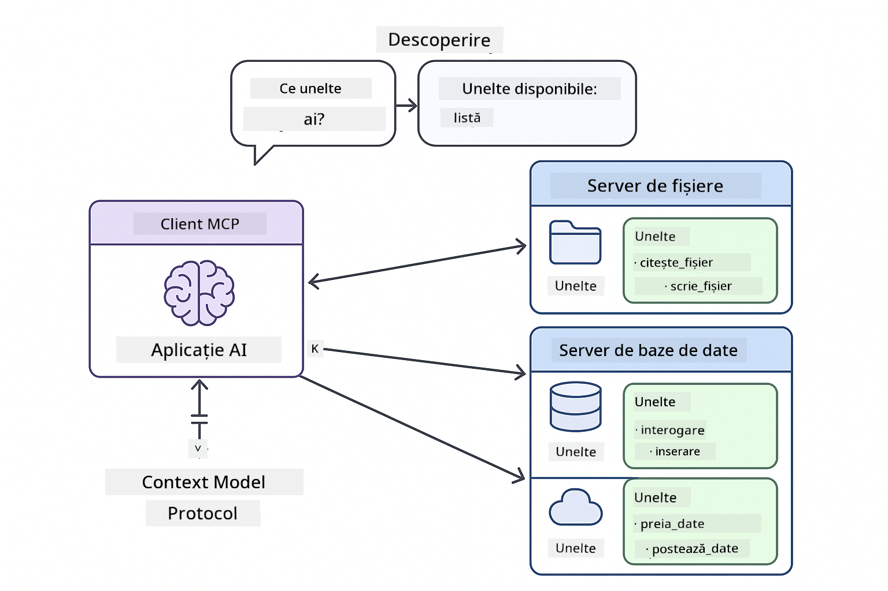
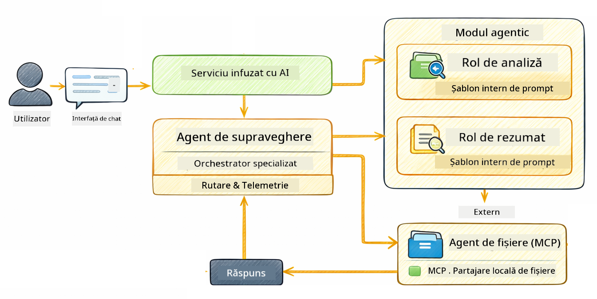

<!--
CO_OP_TRANSLATOR_METADATA:
{
  "original_hash": "6c816d130a1fa47570c11907e72d84ae",
  "translation_date": "2026-01-06T01:05:02+00:00",
  "source_file": "05-mcp/README.md",
  "language_code": "ro"
}
-->
# Modulul 05: Protocolul Contextului Modelului (MCP)

## Cuprins

- [Ce Vei Învăța](../../../05-mcp)
- [Ce este MCP?](../../../05-mcp)
- [Cum Funcționează MCP](../../../05-mcp)
- [Modulul Agentic](../../../05-mcp)
- [Rularea Exemplelor](../../../05-mcp)
  - [Prerechizite](../../../05-mcp)
- [Pornire Rapidă](../../../05-mcp)
  - [Operațiuni pe Fișiere (Stdio)](../../../05-mcp)
  - [Agent Supraveghetor](../../../05-mcp)
    - [Înțelegerea Rezultatului](../../../05-mcp)
    - [Strategii de Răspuns](../../../05-mcp)
    - [Explicația Funcționalităților Modulului Agentic](../../../05-mcp)
- [Concepte Cheie](../../../05-mcp)
- [Felicitări!](../../../05-mcp)
  - [Ce Urmează?](../../../05-mcp)

## Ce Vei Învăța

Ai construit AI conversațional, ai stăpânit prompturile, ai fundamentat răspunsurile în documente și ai creat agenți cu unelte. Dar toate acele unelte au fost construite personalizat pentru aplicația ta specifică. Ce-ar fi dacă ai putea oferi AI-ului tău acces la un ecosistem standardizat de unelte pe care oricine le poate crea și distribui? În acest modul, vei învăța cum să faci exact asta cu Protocolul Contextului Modelului (MCP) și modulul agentic LangChain4j. Mai întâi prezentăm un simplu cititor de fișiere MCP, apoi arătăm cum se integrează ușor în fluxuri de lucru agentice avansate folosind modelul Agent Supraveghetor.

## Ce este MCP?

Protocolul Contextului Modelului (MCP) oferă exact asta - o metodă standard pentru aplicațiile AI de a descoperi și folosi unelte externe. În loc să scrii integrări custom pentru fiecare sursă de date sau serviciu, te conectezi la servere MCP care expun capabilitățile lor într-un format consecvent. Agentul tău AI poate astfel să descopere și să folosească aceste unelte automat.


*Înainte de MCP: Integrări complexe punct-la-punct. După MCP: Un protocol, posibilități infinite.*

MCP rezolvă o problemă fundamentală în dezvoltarea AI: fiecare integrare este personalizată. Vrei să accesezi GitHub? Cod personalizat. Vrei să citești fișiere? Cod personalizat. Vrei să interoghezi o bază de date? Cod personalizat. Și niciuna dintre aceste integrări nu funcționează cu alte aplicații AI.

MCP standardizează acest lucru. Un server MCP expune unelte cu descrieri clare și scheme. Orice client MCP se poate conecta, descoperi uneltele disponibile și le poate folosi. Construiești o singură dată, folosești peste tot.



*Arhitectura Protocolului Contextului Modelului - descoperire și execuție standardizată a uneltelor*

## Cum Funcționează MCP

**Arhitectură Client-Server**

MCP folosește un model client-server. Serverele oferă unelte - citirea fișierelor, interogarea bazelor de date, apelarea API-urilor. Clienții (aplicația ta AI) se conectează la servere și folosesc uneltele lor.

Pentru a folosi MCP cu LangChain4j, adaugă această dependență Maven:

```xml
<dependency>
    <groupId>dev.langchain4j</groupId>
    <artifactId>langchain4j-mcp</artifactId>
    <version>${langchain4j.version}</version>
</dependency>
```

**Descoperirea Uneltelor**

Când clientul tău se conectează la un server MCP, întreabă „Ce unelte ai?” Serverul răspunde cu o listă de unelte disponibile, fiecare cu descrieri și scheme pentru parametri. Agentul tău AI poate apoi decide ce unelte să folosească în funcție de cererile utilizatorului.

**Mecanisme de Transport**

MCP suportă diferite mecanisme de transport. Acest modul demonstrează transportul Stdio pentru procese locale:


*Mecanisme de transport MCP: HTTP pentru servere la distanță, Stdio pentru procese locale*

**Stdio** - [StdioTransportDemo.java](../../../05-mcp/src/main/java/com/example/langchain4j/mcp/StdioTransportDemo.java)

Pentru procese locale. Aplicația ta pornește un server ca subproces și comunică prin intrarea/ieșirea standard. Util pentru accesul la sistemul de fișiere sau unelte în linia de comandă.

```java
McpTransport stdioTransport = new StdioMcpTransport.Builder()
    .command(List.of(
        npmCmd, "exec",
        "@modelcontextprotocol/server-filesystem@2025.12.18",
        resourcesDir
    ))
    .logEvents(false)
    .build();
```

> **🤖 Încearcă cu Chat [GitHub Copilot](https://github.com/features/copilot):** Deschide [`StdioTransportDemo.java`](../../../05-mcp/src/main/java/com/example/langchain4j/mcp/StdioTransportDemo.java) și întreabă:
> - "Cum funcționează transportul Stdio și când ar trebui să-l folosesc față de HTTP?"
> - "Cum gestionează LangChain4j ciclul de viață al proceselor server MCP pornite?"
> - "Care sunt implicațiile de securitate când oferi AI acces la sistemul de fișiere?"

## Modulul Agentic

În timp ce MCP oferă unelte standardizate, modulul **agentic** LangChain4j oferă un mod declarativ de a construi agenți care orchestrează aceste unelte. Anotarea `@Agent` și `AgenticServices` îți permit să definești comportamentul agentului prin interfețe, nu prin cod imperativ.

În acest modul, vei explora modelul **Agent Supraveghetor** — o abordare agentică avansată AI în care un agent „supraveghetor” decide dinamic care subagenți să invoce în funcție de cererile utilizatorului. Vom combina ambele concepte oferind unuia dintre subagenții noștri capabilități de acces la fișiere prin MCP.

Pentru a folosi modulul agentic, adaugă această dependență Maven:

```xml
<dependency>
    <groupId>dev.langchain4j</groupId>
    <artifactId>langchain4j-agentic</artifactId>
    <version>${langchain4j.mcp.version}</version>
</dependency>
```

> **⚠️ Experimental:** Modulul `langchain4j-agentic` este **experimental** și poate suferi modificări. Metoda stabilă pentru a construi asistenți AI rămâne `langchain4j-core` cu unelte custom (Modulul 04).

## Rularea Exemplelor

### Precondiții

- Java 21+, Maven 3.9+
- Node.js 16+ și npm (pentru servere MCP)
- Variabile de mediu configurate în fișierul `.env` (din directorul rădăcină):
  - `AZURE_OPENAI_ENDPOINT`, `AZURE_OPENAI_API_KEY`, `AZURE_OPENAI_DEPLOYMENT` (ca în Modulele 01-04)

> **Notă:** Dacă nu ți-ai configurat încă variabilele de mediu, vezi [Modulul 00 - Pornire Rapidă](../00-quick-start/README.md) pentru instrucțiuni, sau copie `.env.example` în `.env` în directorul rădăcină și completează valorile tale.

## Pornire Rapidă

**Folosind VS Code:** Pur și simplu dă click dreapta pe orice fișier demo din Explorer și selectează **„Run Java”**, sau folosește configurațiile de lansare din panoul Run and Debug (asigură-te că ai adăugat mai întâi token-ul tău în fișierul `.env`).

**Folosind Maven:** Alternativ, poți rula de la linia de comandă cu exemplele de mai jos.

### Operațiuni pe Fișiere (Stdio)

Acesta demonstrează unelte locale bazate pe subprocese.

**✅ Nu sunt necesare prerechizite** - serverul MCP este pornit automat.

**Folosind Scripturile de Pornire (Recomandat):**

Scripturile de pornire încarcă automat variabilele de mediu din fișierul `.env` rădăcină:

**Bash:**
```bash
cd 05-mcp
chmod +x start-stdio.sh
./start-stdio.sh
```

**PowerShell:**
```powershell
cd 05-mcp
.\start-stdio.ps1
```

**Folosind VS Code:** Click dreapta pe `StdioTransportDemo.java` și selectează **„Run Java”** (asigură-te că fișierul `.env` este configurat).

Aplicația pornește automat un server MCP pentru sistemul de fișiere și citește un fișier local. Observă cum este gestionat pentru tine subprocesul.

**Output așteptat:**
```
Assistant response: The file provides an overview of LangChain4j, an open-source Java library
for integrating Large Language Models (LLMs) into Java applications...
```

### Agent Supraveghetor

Modelul **Agent Supraveghetor** este o formă **flexibilă** a AI agentic. Un Supraveghetor folosește un LLM pentru a decide autonom ce agenți să invoce pe baza cererii utilizatorului. În următorul exemplu, combinăm accesul la fișiere alimentat de MCP cu un agent LLM pentru a crea un flux supravegheat de citire fișier → raport.

În demo, `FileAgent` citește un fișier folosind uneltele MCP pentru sistemul de fișiere, iar `ReportAgent` generează un raport structurat cu un sumar executiv (1 propoziție), 3 puncte cheie și recomandări. Supraveghetorul orchestrează acest flux automat:



```
┌─────────────┐      ┌──────────────┐
│  FileAgent  │ ───▶ │ ReportAgent  │
│ (MCP tools) │      │  (pure LLM)  │
└─────────────┘      └──────────────┘
   outputKey:           outputKey:
  'fileContent'         'report'
```

Fiecare agent stochează rezultatul său în **Agentic Scope** (memorie partajată), permițând agenților ulteriori să acceseze rezultatele anterioare. Aceasta demonstrează cum uneltele MCP se integrează perfect în fluxurile agentice — Supraveghetorul nu trebuie să știe *cum* se citește fișierul, ci doar că `FileAgent` poate face asta.

#### Rularea Demo-ului

Scripturile de pornire încarcă automat variabilele de mediu din fișierul `.env` rădăcină:

**Bash:**
```bash
cd 05-mcp
chmod +x start-supervisor.sh
./start-supervisor.sh
```

**PowerShell:**
```powershell
cd 05-mcp
.\start-supervisor.ps1
```

**Folosind VS Code:** Click dreapta pe `SupervisorAgentDemo.java` și selectează **„Run Java”** (asigură-te că fișierul `.env` este configurat).

#### Cum Funcționează Supraveghetorul

```java
// Pasul 1: FileAgent citește fișierele folosind instrumentele MCP
FileAgent fileAgent = AgenticServices.agentBuilder(FileAgent.class)
        .chatModel(model)
        .toolProvider(mcpToolProvider)  // Are instrumente MCP pentru operațiuni cu fișiere
        .build();

// Pasul 2: ReportAgent generează rapoarte structurate
ReportAgent reportAgent = AgenticServices.agentBuilder(ReportAgent.class)
        .chatModel(model)
        .build();

// Supervisorul orchestrează fluxul de lucru fișier → raport
SupervisorAgent supervisor = AgenticServices.supervisorBuilder()
        .chatModel(model)
        .subAgents(fileAgent, reportAgent)
        .responseStrategy(SupervisorResponseStrategy.LAST)  // Returnează raportul final
        .build();

// Supervisorul decide ce agenți să invoce în funcție de cerere
String response = supervisor.invoke("Read the file at /path/file.txt and generate a report");
```

#### Strategii de Răspuns

Când configurezi un `SupervisorAgent`, specifici cum trebuie să formuleze răspunsul final către utilizator după ce subagenții și-au finalizat sarcinile. Strategiile disponibile sunt:

| Strategie | Descriere |
|----------|-------------|
| **LAST** | Supraveghetorul returnează output-ul ultimului subagent sau unealtă apelată. Este util când agentul final din flux este conceput special să producă răspunsul complet, final (ex: un „Agent Rezumat” într-un pipeline de cercetare). |
| **SUMMARY** | Supraveghetorul folosește propriul său model lingvistic intern (LLM) pentru a sintetiza un rezumat al întregii interacțiuni și toate output-urile subagenților, apoi returnează acel rezumat ca răspuns final. Aceasta oferă un răspuns agregat clar pentru utilizator. |
| **SCORED** | Sistemul folosește un LLM intern pentru a evalua atât răspunsul LAST cât și rezumatul SUMMARY în raport cu cererea originală a utilizatorului, returnând output-ul cu scorul mai mare. |

Vezi [SupervisorAgentDemo.java](../../../05-mcp/src/main/java/com/example/langchain4j/mcp/SupervisorAgentDemo.java) pentru implementarea completă.

> **🤖 Încearcă cu Chat [GitHub Copilot](https://github.com/features/copilot):** Deschide [`SupervisorAgentDemo.java`](../../../05-mcp/src/main/java/com/example/langchain4j/mcp/SupervisorAgentDemo.java) și întreabă:
> - "Cum decide Supraveghetorul care agenți să invoce?"
> - "Care este diferența între pattern-urile Supervisor și Sequential workflow?"
> - "Cum pot personaliza comportamentul de planificare al Supraveghetorului?"

#### Înțelegerea Rezultatului

Când rulezi demo-ul, vei vedea un parcurs structurat despre cum orchestrează Supraveghetorul mai mulți agenți. Iată ce înseamnă fiecare secțiune:

```
======================================================================
  FILE → REPORT WORKFLOW DEMO
======================================================================

This demo shows a clear 2-step workflow: read a file, then generate a report.
The Supervisor orchestrates the agents automatically based on the request.
```

**Antetul** introduce conceptul fluxului de lucru: un pipeline focalizat de la citirea fișierului la generarea raportului.

```
--- WORKFLOW ---------------------------------------------------------
  ┌─────────────┐      ┌──────────────┐
  │  FileAgent  │ ───▶ │ ReportAgent  │
  │ (MCP tools) │      │  (pure LLM)  │
  └─────────────┘      └──────────────┘
   outputKey:           outputKey:
   'fileContent'        'report'

--- AVAILABLE AGENTS -------------------------------------------------
  [FILE]   FileAgent   - Reads files via MCP → stores in 'fileContent'
  [REPORT] ReportAgent - Generates structured report → stores in 'report'
```

**Diagrama Fluxului de Lucru** arată fluxul de date dintre agenți. Fiecare agent are un rol specific:
- **FileAgent** citește fișiere folosind uneltele MCP și stochează conținutul brut în `fileContent`
- **ReportAgent** consumă acel conținut și produce un raport structurat în `report`

```
--- USER REQUEST -----------------------------------------------------
  "Read the file at .../file.txt and generate a report on its contents"
```

**Cererea Utilizatorului** arată sarcina. Supraveghetorul o parsează și decide să invoce FileAgent → ReportAgent.

```
--- SUPERVISOR ORCHESTRATION -----------------------------------------
  The Supervisor decides which agents to invoke and passes data between them...

  +-- STEP 1: Supervisor chose -> FileAgent (reading file via MCP)
  |
  |   Input: .../file.txt
  |
  |   Result: LangChain4j is an open-source, provider-agnostic Java framework for building LLM...
  +-- [OK] FileAgent (reading file via MCP) completed

  +-- STEP 2: Supervisor chose -> ReportAgent (generating structured report)
  |
  |   Input: LangChain4j is an open-source, provider-agnostic Java framew...
  |
  |   Result: Executive Summary...
  +-- [OK] ReportAgent (generating structured report) completed
```

**Orchestrarea Supraveghetorului** arată fluxul în 2 pași în acțiune:
1. **FileAgent** citește fișierul prin MCP și stochează conținutul
2. **ReportAgent** primește conținutul și generează un raport structurat

Supraveghetorul a luat aceste decizii **autonom** pe baza cererii utilizatorului.

```
--- FINAL RESPONSE ---------------------------------------------------
Executive Summary
...

Key Points
...

Recommendations
...

--- AGENTIC SCOPE (Data Flow) ----------------------------------------
  Each agent stores its output for downstream agents to consume:
  * fileContent: LangChain4j is an open-source, provider-agnostic Java framework...
  * report: Executive Summary...
```

#### Explicația Funcționalităților Modulului Agentic

Exemplul demonstrează câteva funcționalități avansate ale modulului agentic. Hai să aruncăm o privire mai atentă la Agentic Scope și Agent Listeners.

**Agentic Scope** arată memoria partajată unde agenții și-au stocat rezultatele folosind `@Agent(outputKey="...")`. Acest lucru permite:
- Agenților ulteriori să acceseze output-urile agenților anteriori
- Supraveghetorului să sintetizeze un răspuns final
- Ție să verifici ce a produs fiecare agent

```java
ResultWithAgenticScope<String> result = supervisor.invokeWithAgenticScope(request);
AgenticScope scope = result.agenticScope();
String fileContent = scope.readState("fileContent");  // Date brute ale fișierului de la FileAgent
String report = scope.readState("report");            // Raport structurat de la ReportAgent
```

**Agent Listeners** permit monitorizarea și depanarea execuției agenților. Output-ul pas cu pas pe care-l vezi în demo provine de la un AgentListener care se conectează la fiecare invocare a agentului:
- **beforeAgentInvocation** - Apelat când Supraveghetorul selectează un agent, permițând să vezi care agent a fost ales și de ce
- **afterAgentInvocation** - Apelat când un agent se termină, afișând rezultatul său
- **inheritedBySubagents** - Când este true, listener-ul monitorizează toți agenții din ierarhie

```java
AgentListener monitor = new AgentListener() {
    private int step = 0;
    
    @Override
    public void beforeAgentInvocation(AgentRequest request) {
        step++;
        System.out.println("  +-- STEP " + step + ": " + request.agentName());
    }
    
    @Override
    public void afterAgentInvocation(AgentResponse response) {
        System.out.println("  +-- [OK] " + response.agentName() + " completed");
    }
    
    @Override
    public boolean inheritedBySubagents() {
        return true; // Propagă către toți sub-agentații
    }
};
```

Dincolo de pattern-ul Supraveghetor, modulul `langchain4j-agentic` oferă mai multe pattern-uri de workflow puternice și funcționalități:

| Pattern | Descriere | Caz de utilizare |
|---------|-------------|----------|
| **Sequential** | Execută agenții în ordine, output-ul curge către următorul | Pipepline-uri: cercetare → analiză → raport |
| **Parallel** | Rulează agenții simultan | Sarcini independente: vreme + știri + bursă |
| **Loop** | Iterează până când o condiție este îndeplinită | Scorare calitate: rafinează până scor ≥ 0.8 |
| **Conditional** | Direcționează pe baza condițiilor | Clasifică → direcționează la agent specialist |
| **Human-in-the-Loop** | Adaugă puncte de control umane | Fluxuri de aprobare, revizuire conținut |

## Concepte Cheie

Acum că ai explorat MCP și modulul agentic în acțiune, să rezumăm când să folosești fiecare abordare.

**MCP** este ideal când vrei să valorifici ecosisteme de unelte existente, să construiești unelte pe care mai multe aplicații să le poată partaja, să integrezi servicii terțe prin protocoale standard sau să schimbi implementările uneltelor fără să schimbi codul.

**Modulul Agentic** funcționează cel mai bine când vrei definiții declarative pentru agenți cu anotări `@Agent`, ai nevoie de orchestrare de workflow (sequential, loop, parallel), preferi designul agenților bazat pe interfețe în loc de cod imperativ, sau combini mai mulți agenți care împart output-uri via `outputKey`.

**Pattern-ul Agent Supraveghetor** strălucește când fluxul de lucru nu este predictibil dinainte și vrei ca LLM-ul să decidă, când ai mai mulți agenți specializați ce necesită orchestrare dinamică, când construiești sisteme conversaționale care rutează către capacități diferite sau când vrei cel mai flexibil și adaptiv comportament agentic.
## Felicitări!

Ai finalizat cursul LangChain4j pentru începători. Ai învățat:

- Cum să construiești AI conversațional cu memorie (Modulul 01)
- Modele de inginerie a prompturilor pentru diferite sarcini (Modulul 02)
- Fundamentarea răspunsurilor în documentele tale cu RAG (Modulul 03)
- Crearea de agenți AI de bază (asistenți) cu unelte personalizate (Modulul 04)
- Integrarea uneltelor standardizate cu modulele LangChain4j MCP și Agentic (Modulul 05)

### Ce urmează?

După finalizarea modulelor, explorează [Ghidul de Testare](../docs/TESTING.md) pentru a vedea conceptele de testare LangChain4j în acțiune.

**Resurse oficiale:**
- [Documentația LangChain4j](https://docs.langchain4j.dev/) - Ghiduri complete și referință API
- [LangChain4j GitHub](https://github.com/langchain4j/langchain4j) - Cod sursă și exemple
- [Tutoriale LangChain4j](https://docs.langchain4j.dev/tutorials/) - Tutoriale pas cu pas pentru diverse cazuri de utilizare

Mulțumim că ai finalizat acest curs!

---

**Navigare:** [← Anterior: Modulul 04 - Unelte](../04-tools/README.md) | [Înapoi la Principal](../README.md)

---

<!-- CO-OP TRANSLATOR DISCLAIMER START -->
**Declinare de responsabilitate**:
Acest document a fost tradus folosind serviciul de traducere AI [Co-op Translator](https://github.com/Azure/co-op-translator). Deși ne străduim pentru acuratețe, vă rugăm să rețineți că traducerile automate pot conține erori sau inexactități. Documentul original în limba sa nativă trebuie considerat sursa autorizată. Pentru informații critice, se recomandă traducerea profesională realizată de un specialist uman. Nu ne asumăm răspunderea pentru eventualele neînțelegeri sau interpretări greșite rezultate din utilizarea acestei traduceri.
<!-- CO-OP TRANSLATOR DISCLAIMER END -->