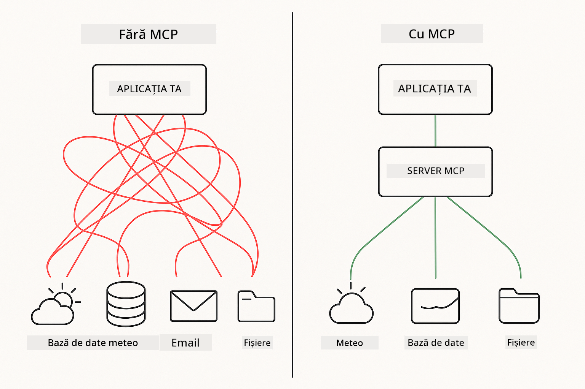

<!--
CO_OP_TRANSLATOR_METADATA:
{
  "original_hash": "c25ec1f10ef156c53e190cdf8b0711ab",
  "translation_date": "2025-12-13T18:04:59+00:00",
  "source_file": "05-mcp/README.md",
  "language_code": "ro"
}
-->
# Modulul 05: Protocolul Contextului Modelului (MCP)

## Cuprins

- [Ce Vei Învăța](../../../05-mcp)
- [Înțelegerea MCP](../../../05-mcp)
- [Cum Funcționează MCP](../../../05-mcp)
  - [Arhitectura Server-Client](../../../05-mcp)
  - [Descoperirea Uneltelor](../../../05-mcp)
  - [Mecanisme de Transport](../../../05-mcp)
- [Prerechizite](../../../05-mcp)
- [Ce Acoperă Acest Modul](../../../05-mcp)
- [Pornire Rapidă](../../../05-mcp)
  - [Exemplul 1: Calculator la Distanță (HTTP Streamabil)](../../../05-mcp)
  - [Exemplul 2: Operațiuni pe Fișiere (Stdio)](../../../05-mcp)
  - [Exemplul 3: Analiză Git (Docker)](../../../05-mcp)
- [Concepte Cheie](../../../05-mcp)
  - [Selecția Transportului](../../../05-mcp)
  - [Descoperirea Uneltelor](../../../05-mcp)
  - [Gestionarea Sesiunii](../../../05-mcp)
  - [Considerații Cross-Platform](../../../05-mcp)
- [Când să Folosești MCP](../../../05-mcp)
- [Ecosistemul MCP](../../../05-mcp)
- [Felicitări!](../../../05-mcp)
  - [Ce Urmează?](../../../05-mcp)
- [Depanare](../../../05-mcp)

## Ce Vei Învăța

Ai construit AI conversațional, ai stăpânit prompturile, ai fundamentat răspunsurile în documente și ai creat agenți cu unelte. Dar toate acele unelte au fost construite personalizat pentru aplicația ta specifică. Ce-ar fi dacă ai putea oferi AI-ului tău acces la un ecosistem standardizat de unelte pe care oricine le poate crea și partaja?

Protocolul Contextului Modelului (MCP) oferă exact asta - o modalitate standard de a descoperi și folosi unelte externe în aplicațiile AI. În loc să scrii integrări personalizate pentru fiecare sursă de date sau serviciu, te conectezi la servere MCP care expun capabilitățile lor într-un format consecvent. Agentul tău AI poate apoi să descopere și să folosească aceste unelte automat.



*Înainte de MCP: Integrări complexe punct-la-punct. După MCP: Un protocol, posibilități infinite.*

## Înțelegerea MCP

MCP rezolvă o problemă fundamentală în dezvoltarea AI: fiecare integrare este personalizată. Vrei să accesezi GitHub? Cod personalizat. Vrei să citești fișiere? Cod personalizat. Vrei să interoghezi o bază de date? Cod personalizat. Și niciuna dintre aceste integrări nu funcționează cu alte aplicații AI.

MCP standardizează acest lucru. Un server MCP expune unelte cu descrieri clare și scheme. Orice client MCP se poate conecta, descoperi uneltele disponibile și le poate folosi. Construiești o dată, folosești peste tot.


*Arhitectura Protocolului Contextului Modelului - descoperire și execuție standardizată a uneltelor*

## Cum Funcționează MCP

**Arhitectura Server-Client**

MCP folosește un model client-server. Serverele oferă unelte - citirea fișierelor, interogarea bazelor de date, apelarea API-urilor. Clienții (aplicația ta AI) se conectează la servere și folosesc uneltele lor.

**Descoperirea Uneltelor**

Când clientul tău se conectează la un server MCP, întreabă „Ce unelte ai?” Serverul răspunde cu o listă de unelte disponibile, fiecare cu descrieri și scheme de parametri. Agentul tău AI poate apoi decide ce unelte să folosească în funcție de cererile utilizatorului.

**Mecanisme de Transport**

MCP definește două mecanisme de transport: HTTP pentru servere la distanță, Stdio pentru procese locale (inclusiv containere Docker):


*Mecanisme de transport MCP: HTTP pentru servere la distanță, Stdio pentru procese locale (inclusiv containere Docker)*

**Streamable HTTP** - [StreamableHttpDemo.java](../../../05-mcp/src/main/java/com/example/langchain4j/mcp/StreamableHttpDemo.java)

Pentru servere la distanță. Aplicația ta face cereri HTTP către un server care rulează undeva în rețea. Folosește Server-Sent Events pentru comunicare în timp real.

```java
McpTransport httpTransport = new StreamableHttpMcpTransport.Builder()
    .url("http://localhost:3001/mcp")
    .timeout(Duration.ofSeconds(60))
    .logRequests(true)
    .logResponses(true)
    .build();
```

> **🤖 Încearcă cu [GitHub Copilot](https://github.com/features/copilot) Chat:** Deschide [`StreamableHttpDemo.java`](../../../05-mcp/src/main/java/com/example/langchain4j/mcp/StreamableHttpDemo.java) și întreabă:
> - "Cum diferă MCP de integrarea directă a uneltelor ca în Modulul 04?"
> - "Care sunt beneficiile folosirii MCP pentru partajarea uneltelor între aplicații?"
> - "Cum gestionez eșecurile de conexiune sau timeout-urile către serverele MCP?"

**Stdio** - [StdioTransportDemo.java](../../../05-mcp/src/main/java/com/example/langchain4j/mcp/StdioTransportDemo.java)

Pentru procese locale. Aplicația ta pornește un server ca proces copil și comunică prin intrare/ieșire standard. Util pentru accesul la sistemul de fișiere sau unelte din linia de comandă.

```java
McpTransport stdioTransport = new StdioMcpTransport.Builder()
    .command(List.of(
        npmCmd, "exec",
        "@modelcontextprotocol/server-filesystem@0.6.2",
        resourcesDir
    ))
    .logEvents(false)
    .build();
```

> **🤖 Încearcă cu [GitHub Copilot](https://github.com/features/copilot) Chat:** Deschide [`StdioTransportDemo.java`](../../../05-mcp/src/main/java/com/example/langchain4j/mcp/StdioTransportDemo.java) și întreabă:
> - "Cum funcționează transportul Stdio și când ar trebui să-l folosesc în loc de HTTP?"
> - "Cum gestionează LangChain4j ciclul de viață al proceselor server MCP pornite?"
> - "Care sunt implicațiile de securitate ale oferirii accesului AI-ului la sistemul de fișiere?"

**Docker (folosește Stdio)** - [GitRepositoryAnalyzer.java](../../../05-mcp/src/main/java/com/example/langchain4j/mcp/GitRepositoryAnalyzer.java)

Pentru servicii containerizate. Folosește transportul stdio pentru a comunica cu un container Docker prin `docker run`. Bun pentru dependențe complexe sau medii izolate.

```java
McpTransport dockerTransport = new StdioMcpTransport.Builder()
    .command(List.of(
        "docker", "run",
        "-e", "GITHUB_PERSONAL_ACCESS_TOKEN=" + System.getenv("GITHUB_TOKEN"),
        "-v", volumeMapping,
        "-i", "mcp/git"
    ))
    .logEvents(true)
    .build();
```

> **🤖 Încearcă cu [GitHub Copilot](https://github.com/features/copilot) Chat:** Deschide [`GitRepositoryAnalyzer.java`](../../../05-mcp/src/main/java/com/example/langchain4j/mcp/GitRepositoryAnalyzer.java) și întreabă:
> - "Cum izolează transportul Docker serverele MCP și care sunt beneficiile?"
> - "Cum configurez montările de volume pentru a partaja date între gazdă și containerele MCP?"
> - "Care sunt cele mai bune practici pentru gestionarea ciclului de viață al serverelor MCP bazate pe Docker în producție?"

## Rularea Exemplelor

### Prerechizite

- Java 21+, Maven 3.9+
- Node.js 16+ și npm (pentru serverele MCP)
- **Docker Desktop** - Trebuie să fie **PORNIT** pentru Exemplul 3 (nu doar instalat)
- Token de acces personal GitHub configurat în fișierul `.env` (din Modulul 00)

> **Notă:** Dacă nu ți-ai configurat încă tokenul GitHub, vezi [Modulul 00 - Pornire Rapidă](../00-quick-start/README.md) pentru instrucțiuni.

> **⚠️ Utilizatori Docker:** Înainte de a rula Exemplul 3, verifică dacă Docker Desktop este pornit cu `docker ps`. Dacă vezi erori de conexiune, pornește Docker Desktop și așteaptă ~30 de secunde pentru inițializare.

## Pornire Rapidă

**Folosind VS Code:** Pur și simplu click dreapta pe orice fișier demo în Explorer și selectează **"Run Java"**, sau folosește configurațiile de lansare din panoul Run and Debug (asigură-te că ai adăugat tokenul în fișierul `.env` mai întâi).

**Folosind Maven:** Alternativ, poți rula din linia de comandă cu exemplele de mai jos.

**⚠️ Important:** Unele exemple au prerechizite (cum ar fi pornirea unui server MCP sau construirea imaginilor Docker). Verifică cerințele fiecărui exemplu înainte de rulare.

### Exemplul 1: Calculator la Distanță (HTTP Streamabil)

Acesta demonstrează integrarea uneltelor bazată pe rețea.

**⚠️ Prerechizit:** Trebuie să pornești mai întâi serverul MCP (vezi Terminal 1 mai jos).

**Terminal 1 - Pornește serverul MCP:**

**Bash:**
```bash
git clone https://github.com/modelcontextprotocol/servers.git
cd servers/src/everything
npm install
node dist/streamableHttp.js
```

**PowerShell:**
```powershell
git clone https://github.com/modelcontextprotocol/servers.git
cd servers/src/everything
npm install
node dist/streamableHttp.js
```

**Terminal 2 - Rulează exemplul:**

**Folosind VS Code:** Click dreapta pe `StreamableHttpDemo.java` și selectează **"Run Java"**.

**Folosind Maven:**

**Bash:**
```bash
export GITHUB_TOKEN=your_token_here
cd 05-mcp
mvn compile exec:java -Dexec.mainClass=com.example.langchain4j.mcp.StreamableHttpDemo
```

**PowerShell:**
```powershell
$env:GITHUB_TOKEN=your_token_here
cd 05-mcp
mvn --% compile exec:java -Dexec.mainClass=com.example.langchain4j.mcp.StreamableHttpDemo
```

Urmărește cum agentul descoperă uneltele disponibile, apoi folosește calculatorul pentru a efectua adunări.

### Exemplul 2: Operațiuni pe Fișiere (Stdio)

Acesta demonstrează unelte locale bazate pe procese copil.

**✅ Nu sunt necesare prerechizite** - serverul MCP este pornit automat.

**Folosind VS Code:** Click dreapta pe `StdioTransportDemo.java` și selectează **"Run Java"**.

**Folosind Maven:**

**Bash:**
```bash
export GITHUB_TOKEN=your_token_here
cd 05-mcp
mvn compile exec:java -Dexec.mainClass=com.example.langchain4j.mcp.StdioTransportDemo
```

**PowerShell:**
```powershell
$env:GITHUB_TOKEN=your_token_here
cd 05-mcp
mvn --% compile exec:java -Dexec.mainClass=com.example.langchain4j.mcp.StdioTransportDemo
```

Aplicația pornește automat un server MCP pentru sistemul de fișiere și citește un fișier local. Observă cum este gestionat ciclul de viață al procesului copil pentru tine.

**Ieșire așteptată:**
```
Assistant response: The content of the file is "Kaboom!".
```

### Exemplul 3: Analiză Git (Docker)

Acesta demonstrează servere de unelte containerizate.

**⚠️ Prerechizite:** 
1. **Docker Desktop trebuie să fie PORNIT** (nu doar instalat)
2. **Utilizatori Windows:** Mod WSL 2 recomandat (Setări Docker Desktop → General → „Use the WSL 2 based engine”). Modul Hyper-V necesită configurare manuală a partajării fișierelor.
3. Trebuie să construiești mai întâi imaginea Docker (vezi Terminal 1 mai jos)

**Verifică dacă Docker rulează:**

**Bash:**
```bash
docker ps  # Ar trebui să afișeze lista containerelor, nu o eroare
```

**PowerShell:**
```powershell
docker ps  # Ar trebui să afișeze lista containerelor, nu o eroare
```

Dacă vezi o eroare de genul „Cannot connect to Docker daemon” sau „The system cannot find the file specified”, pornește Docker Desktop și așteaptă să se inițializeze (~30 secunde).

**Depanare:**
- Dacă AI raportează un depozit gol sau fără fișiere, montarea volumului (`-v`) nu funcționează.
- **Utilizatori Windows Hyper-V:** Adaugă directorul proiectului în Setările Docker Desktop → Resources → File sharing, apoi repornește Docker Desktop.
- **Soluția recomandată:** Treci la modul WSL 2 pentru partajare automată a fișierelor (Setări → General → activează „Use the WSL 2 based engine”).

**Terminal 1 - Construiește imaginea Docker:**

**Bash:**
```bash
cd servers/src/git
docker build -t mcp/git .
```

**PowerShell:**
```powershell
cd servers/src/git
docker build -t mcp/git .
```

**Terminal 2 - Rulează analizorul:**

**Folosind VS Code:** Click dreapta pe `GitRepositoryAnalyzer.java` și selectează **"Run Java"**.

**Folosind Maven:**

**Bash:**
```bash
export GITHUB_TOKEN=your_token_here
cd 05-mcp
mvn compile exec:java -Dexec.mainClass=com.example.langchain4j.mcp.GitRepositoryAnalyzer
```

**PowerShell:**
```powershell
$env:GITHUB_TOKEN=your_token_here
cd 05-mcp
mvn --% compile exec:java -Dexec.mainClass=com.example.langchain4j.mcp.GitRepositoryAnalyzer
```

Aplicația lansează un container Docker, montează depozitul tău și analizează structura și conținutul depozitului prin agentul AI.

## Concepte Cheie

**Selecția Transportului**

Alege în funcție de unde se află uneltele tale:
- Servicii la distanță → HTTP Streamabil
- Sistem de fișiere local → Stdio
- Dependențe complexe → Docker

**Descoperirea Uneltelor**

Clienții MCP descoperă automat uneltele disponibile la conectare. Agentul tău AI vede descrierile uneltelor și decide care să le folosească în funcție de cererea utilizatorului.

**Gestionarea Sesiunii**

Transportul HTTP Streamabil menține sesiuni, permițând interacțiuni cu stare cu serverele la distanță. Transporturile Stdio și Docker sunt de obicei fără stare.

**Considerații Cross-Platform**

Exemplele gestionează automat diferențele de platformă (diferențe de comenzi Windows vs Unix, conversii de căi pentru Docker). Acest lucru este important pentru implementările în producție în medii diferite.

## Când să Folosești MCP

**Folosește MCP când:**
- Vrei să valorifici ecosisteme de unelte existente
- Construiești unelte pe care mai multe aplicații le vor folosi
- Integrezi servicii terțe cu protocoale standard
- Ai nevoie să schimbi implementările uneltelor fără modificări de cod

**Folosește unelte personalizate (Modulul 04) când:**
- Construiești funcționalitate specifică aplicației
- Performanța este critică (MCP adaugă overhead)
- Uneltele tale sunt simple și nu vor fi reutilizate
- Ai nevoie de control complet asupra execuției


## Ecosistemul MCP

Protocolul Contextului Modelului este un standard deschis cu un ecosistem în creștere:

- Servere MCP oficiale pentru sarcini comune (sistem de fișiere, Git, baze de date)
- Servere contribuite de comunitate pentru diverse servicii
- Descrieri și scheme standardizate ale uneltelor
- Compatibilitate cross-framework (funcționează cu orice client MCP)

Această standardizare înseamnă că uneltele construite pentru o aplicație AI funcționează și cu altele, creând un ecosistem comun de capabilități.

## Felicitări!

Ai finalizat cursul LangChain4j pentru Începători. Ai învățat:

- Cum să construiești AI conversațional cu memorie (Modulul 01)
- Modele de inginerie a prompturilor pentru diferite sarcini (Modulul 02)
- Fundamentarea răspunsurilor în documentele tale cu RAG (Modulul 03)
- Crearea de agenți AI cu unelte personalizate (Modulul 04)
- Integrarea uneltelor standardizate prin MCP (Modulul 05)

Acum ai baza pentru a construi aplicații AI de producție. Conceptele învățate se aplică indiferent de framework-uri sau modele specifice - sunt modele fundamentale în ingineria AI.

### Ce Urmează?

După ce ai terminat modulele, explorează [Ghidul de Testare](../docs/TESTING.md) pentru a vedea conceptele de testare LangChain4j în acțiune.

**Resurse Oficiale:**
- [Documentația LangChain4j](https://docs.langchain4j.dev/) - Ghiduri complete și referință API
- [LangChain4j GitHub](https://github.com/langchain4j/langchain4j) - Cod sursă și exemple
- [Tutoriale LangChain4j](https://docs.langchain4j.dev/tutorials/) - Tutoriale pas cu pas pentru diverse cazuri de utilizare

Mulțumim că ai parcurs acest curs!

---

**Navigare:** [← Anterior: Modulul 04 - Unelte](../04-tools/README.md) | [Înapoi la Principal](../README.md)

---

## Depanare

### Sintaxa Comenzii Maven în PowerShell
**Problemă**: Comenzile Maven eșuează cu eroarea `Unknown lifecycle phase ".mainClass=..."`

**Cauză**: PowerShell interpretează `=` ca operator de atribuire a variabilei, stricând sintaxa proprietății Maven

**Soluție**: Folosiți operatorul de oprire a parsării `--%` înaintea comenzii Maven:

**PowerShell:**
```powershell
mvn --% compile exec:java -Dexec.mainClass=com.example.langchain4j.mcp.StreamableHttpDemo
```

**Bash:**
```bash
mvn compile exec:java -Dexec.mainClass=com.example.langchain4j.mcp.StreamableHttpDemo
```

Operatorul `--%` spune PowerShell să transmită toate argumentele rămase literal către Maven fără interpretare.

### Probleme de conectare Docker

**Problemă**: Comenzile Docker eșuează cu mesajul "Cannot connect to Docker daemon" sau "The system cannot find the file specified"

**Cauză**: Docker Desktop nu este pornit sau nu este complet inițializat

**Soluție**: 
1. Porniți Docker Desktop
2. Așteptați ~30 de secunde pentru inițializare completă
3. Verificați cu `docker ps` (ar trebui să afișeze lista containerelor, nu o eroare)
4. Apoi rulați exemplul dvs.

### Montarea volumelor Docker pe Windows

**Problemă**: Analizatorul de depozite Git raportează depozit gol sau fără fișiere

**Cauză**: Montarea volumului (`-v`) nu funcționează din cauza configurației de partajare a fișierelor

**Soluție**:
- **Recomandat:** Trecerea la modul WSL 2 (Setări Docker Desktop → General → "Use the WSL 2 based engine")
- **Alternativ (Hyper-V):** Adăugați directorul proiectului în Setări Docker Desktop → Resources → File sharing, apoi reporniți Docker Desktop

---

<!-- CO-OP TRANSLATOR DISCLAIMER START -->
**Declinare de responsabilitate**:  
Acest document a fost tradus folosind serviciul de traducere AI [Co-op Translator](https://github.com/Azure/co-op-translator). Deși ne străduim pentru acuratețe, vă rugăm să rețineți că traducerile automate pot conține erori sau inexactități. Documentul original în limba sa nativă trebuie considerat sursa autorizată. Pentru informații critice, se recomandă traducerea profesională realizată de un specialist uman. Nu ne asumăm răspunderea pentru eventualele neînțelegeri sau interpretări greșite rezultate din utilizarea acestei traduceri.
<!-- CO-OP TRANSLATOR DISCLAIMER END -->