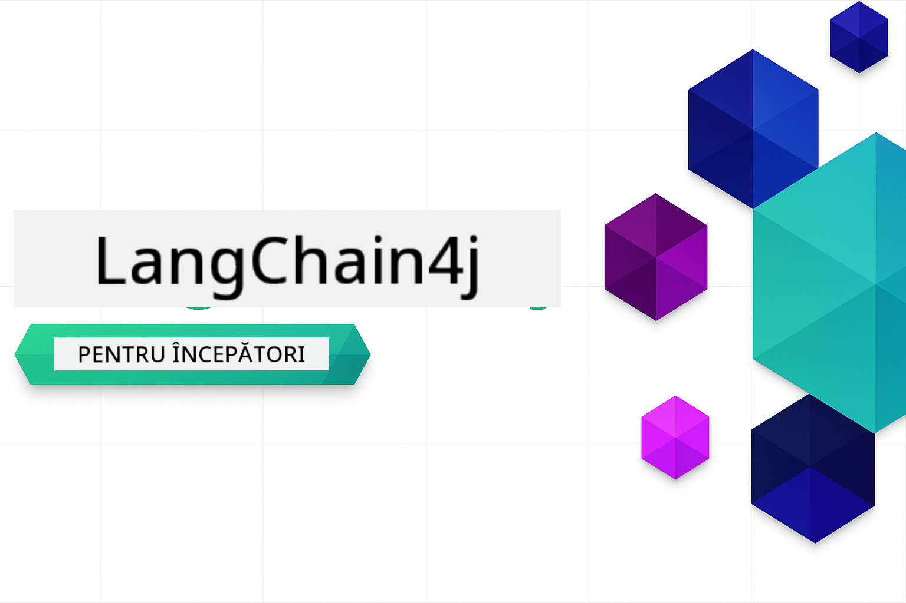

<!--
CO_OP_TRANSLATOR_METADATA:
{
  "original_hash": "d61ab6c245562094cc3dddecf08b50d3",
  "translation_date": "2025-12-31T04:44:39+00:00",
  "source_file": "README.md",
  "language_code": "ro"
}
-->


### 🌐 Suport multilingv

#### Suportat prin GitHub Action (automatizat și întotdeauna la zi)

<!-- CO-OP TRANSLATOR LANGUAGES TABLE START -->
[Arabă](../ar/README.md) | [Bengaleză](../bn/README.md) | [Bulgară](../bg/README.md) | [Birmană (Myanmar)](../my/README.md) | [Chineză (simplificată)](../zh/README.md) | [Chineză (tradițională, Hong Kong)](../hk/README.md) | [Chineză (tradițională, Macau)](../mo/README.md) | [Chineză (tradițională, Taiwan)](../tw/README.md) | [Croată](../hr/README.md) | [Cehă](../cs/README.md) | [Daneză](../da/README.md) | [Olandeză](../nl/README.md) | [Estonă](../et/README.md) | [Finlandeză](../fi/README.md) | [Franceză](../fr/README.md) | [Germană](../de/README.md) | [Greacă](../el/README.md) | [Ebraică](../he/README.md) | [Hindi](../hi/README.md) | [Maghiară](../hu/README.md) | [Indoneziană](../id/README.md) | [Italiană](../it/README.md) | [Japoneză](../ja/README.md) | [Kannada](../kn/README.md) | [Coreeană](../ko/README.md) | [Lituaniană](../lt/README.md) | [Malaeză](../ms/README.md) | [Malayalam](../ml/README.md) | [Marathi](../mr/README.md) | [Nepaleză](../ne/README.md) | [Pidgin nigeriană](../pcm/README.md) | [Norvegiană](../no/README.md) | [Persană (Farsi)](../fa/README.md) | [Poloneză](../pl/README.md) | [Portugheză (Brazilia)](../br/README.md) | [Portugheză (Portugalia)](../pt/README.md) | [Punjabi (Gurmukhi)](../pa/README.md) | [Română](./README.md) | [Rusă](../ru/README.md) | [Sârbă (Chirilică)](../sr/README.md) | [Slovacă](../sk/README.md) | [Slovenă](../sl/README.md) | [Spaniolă](../es/README.md) | [Swahili](../sw/README.md) | [Suedeză](../sv/README.md) | [Tagalog (Filipineză)](../tl/README.md) | [Tamilă](../ta/README.md) | [Telugu](../te/README.md) | [Thailandeză](../th/README.md) | [Turcă](../tr/README.md) | [Ucraineană](../uk/README.md) | [Urdu](../ur/README.md) | [Vietnameză](../vi/README.md)
<!-- CO-OP TRANSLATOR LANGUAGES TABLE END -->

# LangChain4j pentru Începători

Un curs pentru construirea de aplicații AI cu LangChain4j și Azure OpenAI GPT-5, de la chat de bază la agenți AI.

**Nou în LangChain4j?** Consultați [Glosarul](docs/GLOSSARY.md) pentru definiții ale termenilor și conceptelor cheie.

## Table of Contents

1. [Start rapid](00-quick-start/README.md) - Începeți cu LangChain4j
2. [Introducere](01-introduction/README.md) - Aflați elementele fundamentale ale LangChain4j
3. [Ingineria prompturilor](02-prompt-engineering/README.md) - Stăpâniți proiectarea eficientă a prompturilor
4. [RAG (Generare augmentată prin recuperare)](03-rag/README.md) - Construiți sisteme inteligente bazate pe cunoaștere
5. [Instrumente](04-tools/README.md) - Integrați instrumente externe și asistenți simpli
6. [MCP (Protocolul Contextului Modelului)](05-mcp/README.md) - Lucrați cu Protocolul Contextului Modelului (MCP) și modulele agentice
---

##  Parcurs de învățare

> **Start rapid**
>
> 1. Fă fork acestui depozit în contul tău GitHub
> 2. Faceți clic pe fila **Code** → **Codespaces** → **...** → **New with options...**
> 3. Folosiți setările implicite – aceasta va selecta containerul de dezvoltare creat pentru acest curs
> 4. Faceți clic pe **Create codespace**
> 5. Așteptați 5-10 minute pentru ca mediul să fie gata
> 6. Treci direct la [Start rapid](./00-quick-start/README.md) pentru a începe!

> **Preferi să clonezi local?**
>
> This repository includes 50+ language translations which significantly increases the download size. To clone without translations, use sparse checkout:
> ```bash
> git clone --filter=blob:none --sparse https://github.com/microsoft/LangChain4j-for-Beginners.git
> cd LangChain4j-for-Beginners
> git sparse-checkout set --no-cone '/*' '!translations' '!translated_images'
> ```
> Aceasta îți oferă tot ce ai nevoie pentru a finaliza cursul cu o descărcare mult mai rapidă.

After completing the modules, explore the [Testing Guide](docs/TESTING.md) to see LangChain4j testing concepts in action.

> **Note:** This training uses both GitHub Models and Azure OpenAI. The [Quick Start](00-quick-start/README.md) and [MCP](05-mcp/README.md) modules use GitHub Models (no Azure subscription required), while modules 1-4 use Azure OpenAI GPT-5.


## Învățare cu GitHub Copilot

Pentru a începe rapid programarea, deschide acest proiect într-un GitHub Codespace sau în IDE-ul local cu devcontainer-ul furnizat. Devcontainer-ul folosit în acest curs vine preconfigurat cu GitHub Copilot pentru programare asistată AI.

Fiecare exemplu de cod include întrebări sugerate pe care le poți adresa GitHub Copilot pentru a-ți aprofunda înțelegerea. Caută indicatoarele 💡/🤖 în:

- **Anteturile fișierelor Java** - Întrebări specifice fiecărui exemplu
- **README-urile modulelor** - Întrebări de explorare după exemplele de cod

**Cum să folosești:** Deschide orice fișier de cod și pune-i Copilot întrebările sugerate. Acesta are context complet al codului și poate explica, extinde și sugera alternative.

Vrei să afli mai multe? Vezi [Copilot pentru programare asistată AI](https://aka.ms/GitHubCopilotAI).


## Resurse suplimentare

<!-- CO-OP TRANSLATOR OTHER COURSES START -->
### LangChain
[](https://aka.ms/langchain4j-for-beginners)
[](https://aka.ms/langchainjs-for-beginners?WT.mc_id=m365-94501-dwahlin)

---

### Azure / Edge / MCP / Agenți
[](https://github.com/microsoft/AZD-for-beginners?WT.mc_id=academic-105485-koreyst)
[](https://github.com/microsoft/edgeai-for-beginners?WT.mc_id=academic-105485-koreyst)
[](https://github.com/microsoft/mcp-for-beginners?WT.mc_id=academic-105485-koreyst)
[](https://github.com/microsoft/ai-agents-for-beginners?WT.mc_id=academic-105485-koreyst)

---
 
### Seria AI Generativă
[](https://github.com/microsoft/generative-ai-for-beginners?WT.mc_id=academic-105485-koreyst)
[-9333EA?style=for-the-badge&labelColor=E5E7EB&color=9333EA)](https://github.com/microsoft/Generative-AI-for-beginners-dotnet?WT.mc_id=academic-105485-koreyst)
[-C084FC?style=for-the-badge&labelColor=E5E7EB&color=C084FC)](https://github.com/microsoft/generative-ai-for-beginners-java?WT.mc_id=academic-105485-koreyst)
[-E879F9?style=for-the-badge&labelColor=E5E7EB&color=E879F9)](https://github.com/microsoft/generative-ai-with-javascript?WT.mc_id=academic-105485-koreyst)

---
 
### Învățare de bază
[](https://aka.ms/ml-beginners?WT.mc_id=academic-105485-koreyst)
[](https://aka.ms/datascience-beginners?WT.mc_id=academic-105485-koreyst)
[](https://aka.ms/ai-beginners?WT.mc_id=academic-105485-koreyst)
[](https://github.com/microsoft/Security-101?WT.mc_id=academic-96948-sayoung)
[](https://aka.ms/webdev-beginners?WT.mc_id=academic-105485-koreyst)
[](https://aka.ms/iot-beginners?WT.mc_id=academic-105485-koreyst)
[](https://github.com/microsoft/xr-development-for-beginners?WT.mc_id=academic-105485-koreyst)

---
 
### Seria Copilot
[](https://aka.ms/GitHubCopilotAI?WT.mc_id=academic-105485-koreyst)
[](https://github.com/microsoft/mastering-github-copilot-for-dotnet-csharp-developers?WT.mc_id=academic-105485-koreyst)
[](https://github.com/microsoft/CopilotAdventures?WT.mc_id=academic-105485-koreyst)
<!-- CO-OP TRANSLATOR OTHER COURSES END -->

## Obținerea ajutorului

Dacă întâmpini dificultăți sau ai întrebări despre dezvoltarea aplicațiilor AI, alătură-te:

[](https://aka.ms/foundry/discord)

Dacă ai feedback despre produs sau întâmpini erori în timpul dezvoltării, vizitează:

[](https://aka.ms/foundry/forum)

## Licență

Licența MIT - Vezi fișierul [LICENSE](../../LICENSE) pentru detalii.

---

<!-- CO-OP TRANSLATOR DISCLAIMER START -->
Declinare de responsabilitate:
Acest document a fost tradus folosind serviciul de traducere AI [Co-op Translator](https://github.com/Azure/co-op-translator). Deși ne străduim pentru acuratețe, vă rugăm să rețineți că traducerile automate pot conține erori sau inexactități. Documentul original, în limba sa, trebuie considerat sursa autoritară. Pentru informații critice, se recomandă o traducere profesională realizată de un specialist uman. Nu ne asumăm responsabilitatea pentru eventualele neînțelegeri sau interpretări greșite care pot apărea din utilizarea acestei traduceri.
<!-- CO-OP TRANSLATOR DISCLAIMER END -->