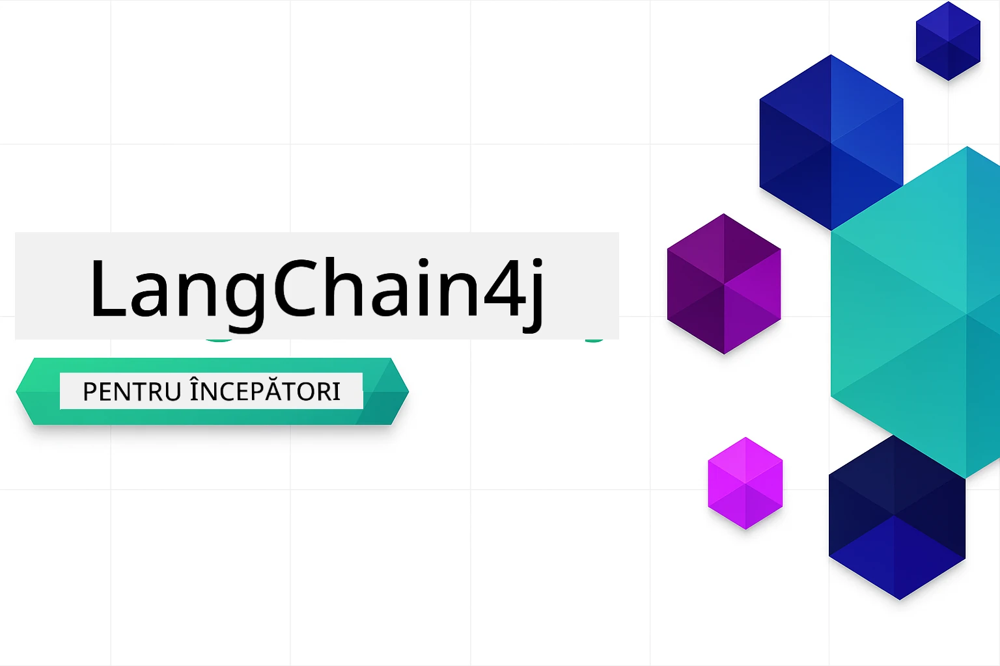

# LangChain4j pentru Începători

Un curs pentru construirea aplicațiilor AI cu LangChain4j și Azure OpenAI GPT-5.2, de la chat de bază la agenți AI.

### 🌐 Suport multilingv

#### Suportat prin GitHub Action (automatizat și întotdeauna actualizat)

<!-- CO-OP TRANSLATOR LANGUAGES TABLE START -->
[Arabic](../ar/README.md) | [Bengali](../bn/README.md) | [Bulgarian](../bg/README.md) | [Burmese (Myanmar)](../my/README.md) | [Chinese (Simplified)](../zh-CN/README.md) | [Chinese (Traditional, Hong Kong)](../zh-HK/README.md) | [Chinese (Traditional, Macau)](../zh-MO/README.md) | [Chinese (Traditional, Taiwan)](../zh-TW/README.md) | [Croatian](../hr/README.md) | [Czech](../cs/README.md) | [Danish](../da/README.md) | [Dutch](../nl/README.md) | [Estonian](../et/README.md) | [Finnish](../fi/README.md) | [French](../fr/README.md) | [German](../de/README.md) | [Greek](../el/README.md) | [Hebrew](../he/README.md) | [Hindi](../hi/README.md) | [Hungarian](../hu/README.md) | [Indonesian](../id/README.md) | [Italian](../it/README.md) | [Japanese](../ja/README.md) | [Kannada](../kn/README.md) | [Khmer](../km/README.md) | [Korean](../ko/README.md) | [Lithuanian](../lt/README.md) | [Malay](../ms/README.md) | [Malayalam](../ml/README.md) | [Marathi](../mr/README.md) | [Nepali](../ne/README.md) | [Nigerian Pidgin](../pcm/README.md) | [Norwegian](../no/README.md) | [Persian (Farsi)](../fa/README.md) | [Polish](../pl/README.md) | [Portuguese (Brazil)](../pt-BR/README.md) | [Portuguese (Portugal)](../pt-PT/README.md) | [Punjabi (Gurmukhi)](../pa/README.md) | [Romanian](./README.md) | [Russian](../ru/README.md) | [Serbian (Cyrillic)](../sr/README.md) | [Slovak](../sk/README.md) | [Slovenian](../sl/README.md) | [Spanish](../es/README.md) | [Swahili](../sw/README.md) | [Swedish](../sv/README.md) | [Tagalog (Filipino)](../tl/README.md) | [Tamil](../ta/README.md) | [Telugu](../te/README.md) | [Thai](../th/README.md) | [Turkish](../tr/README.md) | [Ukrainian](../uk/README.md) | [Urdu](../ur/README.md) | [Vietnamese](../vi/README.md)

> **Preferi să clonezi local?**
>
> Acest depozit include peste 50 de traduceri în limbi străine, ceea ce mărește semnificativ dimensiunea descărcării. Pentru a clona fără traduceri, folosește sparse checkout:
>
> **Bash / macOS / Linux:**
> ```bash
> git clone --filter=blob:none --sparse https://github.com/microsoft/LangChain4j-for-Beginners.git
> cd LangChain4j-for-Beginners
> git sparse-checkout set --no-cone '/*' '!translations' '!translated_images'
> ```
>
> **CMD (Windows):**
> ```cmd
> git clone --filter=blob:none --sparse https://github.com/microsoft/LangChain4j-for-Beginners.git
> cd LangChain4j-for-Beginners
> git sparse-checkout set --no-cone "/*" "!translations" "!translated_images"
> ```
>
> Acest lucru îți oferă tot ce ai nevoie pentru a finaliza cursul cu o descărcare mult mai rapidă.
<!-- CO-OP TRANSLATOR LANGUAGES TABLE END -->

## Cuprins

1. [Introducere](01-introduction/README.md) - Învață fundamentele LangChain4j
2. [Ingineria comenzilor (Prompt Engineering)](02-prompt-engineering/README.md) - Stăpânește proiectarea eficientă a comenzilor
3. [RAG (Generare augmentată prin recuperare)](03-rag/README.md) - Construiește sisteme inteligente bazate pe cunoștințe
4. [Instrumente](04-tools/README.md) - Integrează instrumente externe și asistenți simpli
5. [MCP (Protocolul Contextului Modelului)](05-mcp/README.md) - Lucrează cu Protocolul Contextului Modelului (MCP) și module agentice

### Prezentări video

Fiecare modul are o sesiune live complementară în care parcurgem conceptele și codul pas cu pas.

| Modul | Video |
|--------|-------|
| 01 - Introducere | [Începem cu LangChain4j](https://www.youtube.com/live/nl_troDm8rQ) |
| 02 - Ingineria comenzilor | [Ingineria comenzilor cu LangChain4j](https://www.youtube.com/live/PJ6aBaE6bog) |
| 03 - RAG | [RAG cu LangChain4j](https://www.youtube.com/watch?v=_olq75ZH_eY) |
| 04 - Instrumente & 05 - MCP | [Agenți AI cu Instrumente și MCP](https://www.youtube.com/watch?v=O_J30kZc0rw) |

---

## Parcurs de învățare

**Ești nou la LangChain4j?** Consultă [Glosarul](docs/GLOSSARY.md) pentru definiții ale termenilor și conceptelor cheie.

> **Pornire rapidă**

1. Creează un fork al acestui depozit în contul tău GitHub
2. Apasă pe **Code** → fila **Codespaces** → **...** → **New with options...**
3. Folosește setările implicite – acestea vor selecta containerul de Dezvoltare creat pentru acest curs
4. Apasă pe **Create codespace**
5. Așteaptă 5-10 minute pentru ca mediul să fie gata
6. Accesează direct [Introducerea](./01-introduction/README.md) pentru a începe!

După ce ai finalizat modulele, explorează [Ghidul de testare](docs/TESTING.md) pentru a vedea conceptele de testare LangChain4j în acțiune.

> **Notă:** Acest training utilizează Azure OpenAI. Pornește cu un [cont GRATUIT Azure](https://aka.ms/azure-free-account) dacă nu ai deja unul.


## Învățare cu GitHub Copilot

Pentru a începe rapid să codezi, deschide acest proiect într-un GitHub Codespace sau în IDE-ul tău local cu devcontainer-ul oferit. Devcontainer-ul folosit în acest curs este preconfigurat cu GitHub Copilot pentru programare AI în pereche.

Fiecare exemplu de cod include întrebări sugerate pe care le poți adresa GitHub Copilot pentru a-ți aprofunda înțelegerea. Caută indicațiile 💡/🤖 în:

- **Anteturile fișierelor Java** - Întrebări specifice pentru fiecare exemplu
- **README-urile modulelor** - Indicații de explorare după exemplele de cod

**Cum se folosește:** Deschide orice fișier de cod și întreabă Copilot întrebările sugerate. Are context complet al codului și poate explica, extinde și sugera alternative.

Vrei să afli mai multe? Vezi [Copilot pentru programare AI în pereche](https://aka.ms/GitHubCopilotAI).


## Resurse suplimentare

<!-- CO-OP TRANSLATOR OTHER COURSES START -->
### LangChain
[](https://aka.ms/langchain4j-for-beginners)
[](https://aka.ms/langchainjs-for-beginners?WT.mc_id=m365-94501-dwahlin)
[](https://github.com/microsoft/langchain-for-beginners?WT.mc_id=m365-94501-dwahlin)
---

### Azure / Edge / MCP / Agenți
[](https://github.com/microsoft/AZD-for-beginners?WT.mc_id=academic-105485-koreyst)
[](https://github.com/microsoft/edgeai-for-beginners?WT.mc_id=academic-105485-koreyst)
[](https://github.com/microsoft/mcp-for-beginners?WT.mc_id=academic-105485-koreyst)
[](https://github.com/microsoft/ai-agents-for-beginners?WT.mc_id=academic-105485-koreyst)

---
 
### Seria Generative AI
[](https://github.com/microsoft/generative-ai-for-beginners?WT.mc_id=academic-105485-koreyst)
[-9333EA?style=for-the-badge&labelColor=E5E7EB&color=9333EA)](https://github.com/microsoft/Generative-AI-for-beginners-dotnet?WT.mc_id=academic-105485-koreyst)
[-C084FC?style=for-the-badge&labelColor=E5E7EB&color=C084FC)](https://github.com/microsoft/generative-ai-for-beginners-java?WT.mc_id=academic-105485-koreyst)
[-E879F9?style=for-the-badge&labelColor=E5E7EB&color=E879F9)](https://github.com/microsoft/generative-ai-with-javascript?WT.mc_id=academic-105485-koreyst)

---
 
### Învățare de bază
[](https://aka.ms/ml-beginners?WT.mc_id=academic-105485-koreyst)
[](https://aka.ms/datascience-beginners?WT.mc_id=academic-105485-koreyst)
[](https://aka.ms/ai-beginners?WT.mc_id=academic-105485-koreyst)
[](https://github.com/microsoft/Security-101?WT.mc_id=academic-96948-sayoung)
[](https://aka.ms/webdev-beginners?WT.mc_id=academic-105485-koreyst)
[](https://aka.ms/iot-beginners?WT.mc_id=academic-105485-koreyst)
[](https://github.com/microsoft/xr-development-for-beginners?WT.mc_id=academic-105485-koreyst)

---
 
### Seria Copilot
[](https://aka.ms/GitHubCopilotAI?WT.mc_id=academic-105485-koreyst)
[](https://github.com/microsoft/mastering-github-copilot-for-dotnet-csharp-developers?WT.mc_id=academic-105485-koreyst)
[](https://github.com/microsoft/CopilotAdventures?WT.mc_id=academic-105485-koreyst)
<!-- CO-OP TRANSLATOR OTHER COURSES END -->

## Obținerea Ajutorului

Dacă întâmpini dificultăți sau ai întrebări despre construirea aplicațiilor AI, alătură-te:

[](https://aka.ms/foundry/discord)

Dacă ai feedback despre produs sau erori în timpul construirii, vizitează:

[](https://aka.ms/foundry/forum)

## Licență

Licență MIT - Consultă fișierul [LICENSE](../../LICENSE) pentru detalii.

---

<!-- CO-OP TRANSLATOR DISCLAIMER START -->
**Declinare a responsabilității**:
Acest document a fost tradus folosind serviciul de traducere AI [Co-op Translator](https://github.com/Azure/co-op-translator). În timp ce ne străduim pentru acuratețe, vă rugăm să rețineți că traducerile automate pot conține erori sau inexactități. Documentul original în limba sa nativă trebuie considerat sursa autorizată. Pentru informații critice, se recomandă traducerea profesională realizată de un om. Nu ne asumăm responsabilitatea pentru eventualele neînțelegeri sau interpretări greșite care decurg din utilizarea acestei traduceri.
<!-- CO-OP TRANSLATOR DISCLAIMER END -->