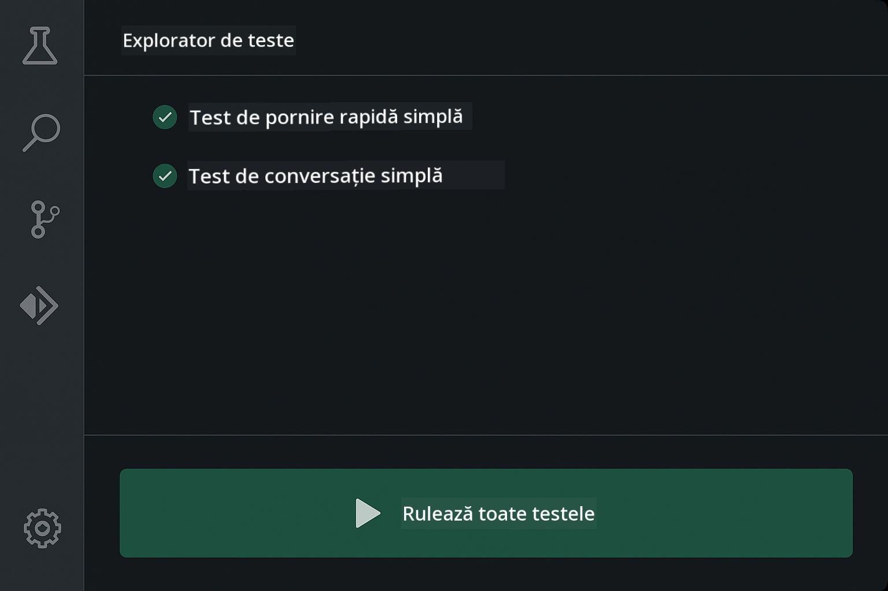
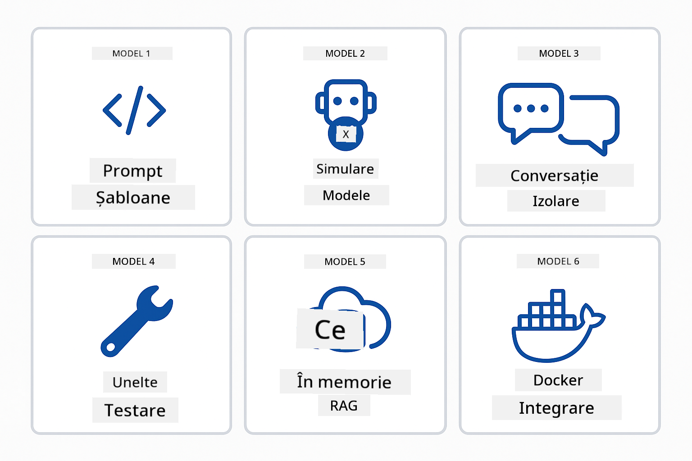
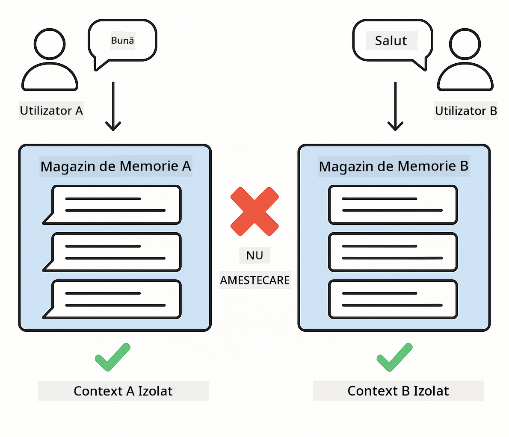
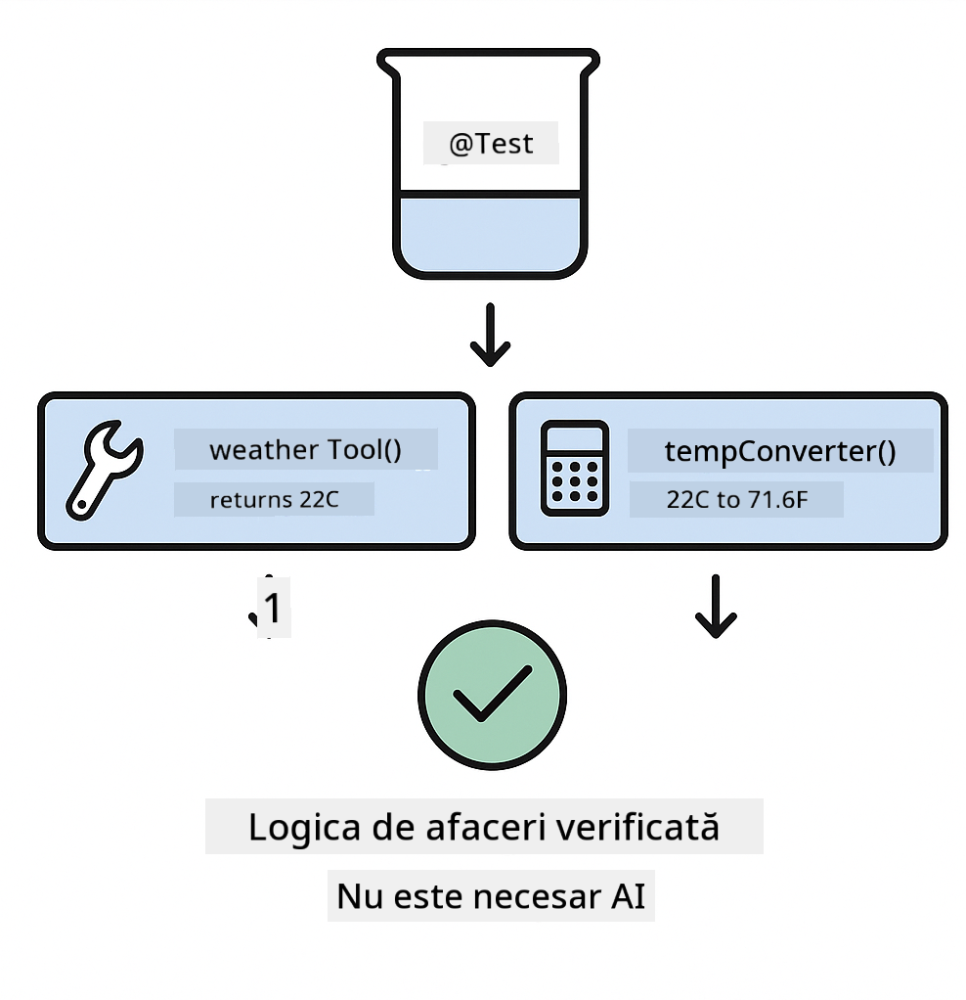
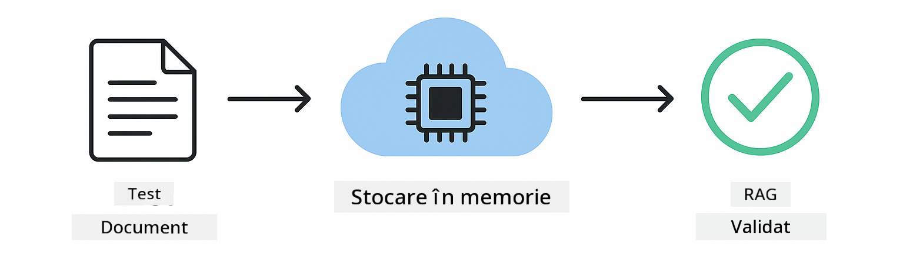
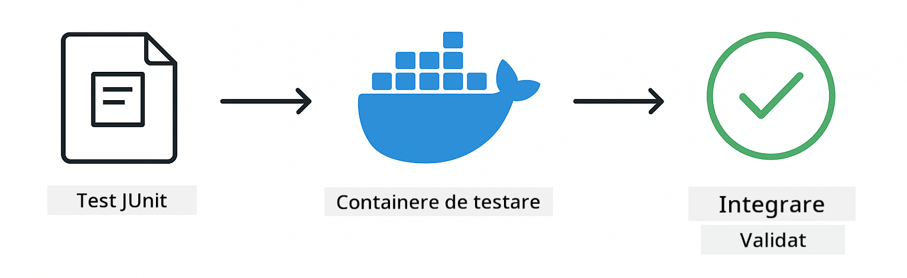

<!--
CO_OP_TRANSLATOR_METADATA:
{
  "original_hash": "b975537560c404d5f254331832811e78",
  "translation_date": "2025-12-13T21:22:57+00:00",
  "source_file": "docs/TESTING.md",
  "language_code": "ro"
}
-->
# Testarea aplicațiilor LangChain4j

## Cuprins

- [Pornire rapidă](../../../docs)
- [Ce acoperă testele](../../../docs)
- [Rularea testelor](../../../docs)
- [Rularea testelor în VS Code](../../../docs)
- [Modele de testare](../../../docs)
- [Filosofia testării](../../../docs)
- [Pașii următori](../../../docs)

Acest ghid te conduce prin testele care demonstrează cum să testezi aplicații AI fără a necesita chei API sau servicii externe.

## Pornire rapidă

Rulează toate testele cu o singură comandă:

**Bash:**
```bash
mvn test
```

**PowerShell:**
```powershell
mvn --% test
```


*Executare reușită a testelor arătând toate testele trecute fără erori*

## Ce acoperă testele

Acest curs se concentrează pe **teste unitare** care rulează local. Fiecare test demonstrează un concept specific LangChain4j în izolare.


*Piramida testării arătând echilibrul între testele unitare (rapide, izolate), testele de integrare (componente reale) și testele end-to-end (sistem complet cu Docker). Acest training acoperă testarea unitară.*

| Modul | Teste | Focus | Fișiere cheie |
|--------|-------|-------|-----------|
| **00 - Pornire rapidă** | 6 | Șabloane de prompt și substituirea variabilelor | `SimpleQuickStartTest.java` |
| **01 - Introducere** | 8 | Memorie conversațională și chat cu stare | `SimpleConversationTest.java` |
| **02 - Ingineria promptului** | 12 | Modele GPT-5, niveluri de entuziasm, output structurat | `SimpleGpt5PromptTest.java` |
| **03 - RAG** | 10 | Ingestia documentelor, embedding-uri, căutare după similaritate | `DocumentServiceTest.java` |
| **04 - Unelte** | 12 | Apelarea funcțiilor și concatenarea uneltelor | `SimpleToolsTest.java` |
| **05 - MCP** | 15 | Protocolul Contextului Modelului cu Docker | `SimpleMcpTest.java`, `McpDockerTransportTest.java` |

## Rularea testelor

**Rulează toate testele din rădăcină:**

**Bash:**
```bash
mvn test
```

**PowerShell:**
```powershell
mvn --% test
```

**Rulează testele pentru un modul specific:**

**Bash:**
```bash
cd 01-introduction && mvn test
# Sau din rădăcină
mvn test -pl 01-introduction
```

**PowerShell:**
```powershell
cd 01-introduction; mvn --% test
# Sau din rădăcină
mvn --% test -pl 01-introduction
```

**Rulează o singură clasă de test:**

**Bash:**
```bash
mvn test -Dtest=SimpleConversationTest
```

**PowerShell:**
```powershell
mvn --% test -Dtest=SimpleConversationTest
```

**Rulează o metodă de test specifică:**

**Bash:**
```bash
mvn test -Dtest=SimpleConversationTest#ar trebui să păstreze istoricul conversației
```

**PowerShell:**
```powershell
mvn --% test -Dtest=SimpleConversationTest#ar trebui să păstreze istoricul conversației
```

## Rularea testelor în VS Code

Dacă folosești Visual Studio Code, Test Explorer oferă o interfață grafică pentru rularea și depanarea testelor.



*Exploratorul de teste VS Code arătând arborele testelor cu toate clasele de test Java și metodele individuale de test*

**Pentru a rula testele în VS Code:**

1. Deschide Test Explorer făcând clic pe pictograma eprubetei din bara de activități
2. Extinde arborele testelor pentru a vedea toate modulele și clasele de test
3. Fă clic pe butonul de redare de lângă orice test pentru a-l rula individual
4. Fă clic pe „Run All Tests” pentru a executa întregul set
5. Click dreapta pe orice test și selectează „Debug Test” pentru a seta puncte de întrerupere și a parcurge codul

Exploratorul de teste afișează bife verzi pentru testele trecute și oferă mesaje detaliate de eroare când testele eșuează.

## Modele de testare



*Șase modele de testare pentru aplicațiile LangChain4j: șabloane de prompt, simularea modelelor, izolare conversațională, testarea uneltelor, RAG în memorie și integrarea Docker*

### Modelul 1: Testarea șabloanelor de prompt

Cel mai simplu model testează șabloanele de prompt fără a apela vreun model AI. Verifici că substituirea variabilelor funcționează corect și că prompturile sunt formatate conform așteptărilor.


*Testarea șabloanelor de prompt arătând fluxul de substituire a variabilelor: șablon cu locuri rezervate → valori aplicate → output formatat verificat*

```java
@Test
@DisplayName("Should format prompt template with variables")
void testPromptTemplateFormatting() {
    PromptTemplate template = PromptTemplate.from(
        "Best time to visit {{destination}} for {{activity}}?"
    );
    
    Prompt prompt = template.apply(Map.of(
        "destination", "Paris",
        "activity", "sightseeing"
    ));
    
    assertThat(prompt.text()).isEqualTo("Best time to visit Paris for sightseeing?");
}
```

Acest test se află în `00-quick-start/src/test/java/com/example/langchain4j/quickstart/SimpleQuickStartTest.java`.

**Rulează-l:**

**Bash:**
```bash
cd 00-quick-start && mvn test -Dtest=SimpleQuickStartTest#testareaFormatăriiȘablonuluiPrompt
```

**PowerShell:**
```powershell
cd 00-quick-start; mvn --% test -Dtest=SimpleQuickStartTest#testareaFormatăriiȘablonuluiPrompt
```

### Modelul 2: Simularea modelelor de limbaj

Când testezi logica conversației, folosește Mockito pentru a crea modele false care returnează răspunsuri prestabilite. Acest lucru face testele rapide, gratuite și deterministe.


*Comparație arătând de ce mock-urile sunt preferate pentru testare: sunt rapide, gratuite, deterministe și nu necesită chei API*

```java
@ExtendWith(MockitoExtension.class)
class SimpleConversationTest {
    
    private ConversationService conversationService;
    
    @Mock
    private OpenAiOfficialChatModel mockChatModel;
    
    @BeforeEach
    void setUp() {
        ChatResponse mockResponse = ChatResponse.builder()
            .aiMessage(AiMessage.from("This is a test response"))
            .build();
        when(mockChatModel.chat(anyList())).thenReturn(mockResponse);
        
        conversationService = new ConversationService(mockChatModel);
    }
    
    @Test
    void shouldMaintainConversationHistory() {
        String conversationId = conversationService.startConversation();
        
        ChatResponse mockResponse1 = ChatResponse.builder()
            .aiMessage(AiMessage.from("Response 1"))
            .build();
        ChatResponse mockResponse2 = ChatResponse.builder()
            .aiMessage(AiMessage.from("Response 2"))
            .build();
        ChatResponse mockResponse3 = ChatResponse.builder()
            .aiMessage(AiMessage.from("Response 3"))
            .build();
        
        when(mockChatModel.chat(anyList()))
            .thenReturn(mockResponse1)
            .thenReturn(mockResponse2)
            .thenReturn(mockResponse3);

        conversationService.chat(conversationId, "First message");
        conversationService.chat(conversationId, "Second message");
        conversationService.chat(conversationId, "Third message");

        List<ChatMessage> history = conversationService.getHistory(conversationId);
        assertThat(history).hasSize(6); // 3 mesaje de la utilizator + 3 mesaje AI
    }
}
```

Acest model apare în `01-introduction/src/test/java/com/example/langchain4j/service/SimpleConversationTest.java`. Mock-ul asigură un comportament consistent pentru a verifica corectitudinea gestionării memoriei.

### Modelul 3: Testarea izolării conversației

Memoria conversațională trebuie să păstreze utilizatorii multipli separați. Acest test verifică că conversațiile nu amestecă contexte.



*Testarea izolării conversației arătând stocări de memorie separate pentru utilizatori diferiți pentru a preveni amestecul de contexte*

```java
@Test
void shouldIsolateConversationsByid() {
    String conv1 = conversationService.startConversation();
    String conv2 = conversationService.startConversation();
    
    ChatResponse mockResponse = ChatResponse.builder()
        .aiMessage(AiMessage.from("Response"))
        .build();
    when(mockChatModel.chat(anyList())).thenReturn(mockResponse);

    conversationService.chat(conv1, "Message for conversation 1");
    conversationService.chat(conv2, "Message for conversation 2");

    List<ChatMessage> history1 = conversationService.getHistory(conv1);
    List<ChatMessage> history2 = conversationService.getHistory(conv2);
    
    assertThat(history1).hasSize(2);
    assertThat(history2).hasSize(2);
}
```

Fiecare conversație își menține propria istorie independentă. În sistemele de producție, această izolare este critică pentru aplicațiile multi-utilizator.

### Modelul 4: Testarea uneltelor independent

Uneltele sunt funcții pe care AI le poate apela. Testează-le direct pentru a te asigura că funcționează corect indiferent de deciziile AI.



*Testarea uneltelor independent arătând execuția uneltei mock fără apeluri AI pentru a verifica logica de business*

```java
@Test
void shouldConvertCelsiusToFahrenheit() {
    TemperatureTool tempTool = new TemperatureTool();
    String result = tempTool.celsiusToFahrenheit(25.0);
    assertThat(result).containsPattern("77[.,]0°F");
}

@Test
void shouldDemonstrateToolChaining() {
    WeatherTool weatherTool = new WeatherTool();
    TemperatureTool tempTool = new TemperatureTool();

    String weatherResult = weatherTool.getCurrentWeather("Seattle");
    assertThat(weatherResult).containsPattern("\\d+°C");

    String conversionResult = tempTool.celsiusToFahrenheit(22.0);
    assertThat(conversionResult).containsPattern("71[.,]6°F");
}
```

Aceste teste din `04-tools/src/test/java/com/example/langchain4j/agents/tools/SimpleToolsTest.java` validează logica uneltelor fără implicarea AI. Exemplul de concatenare arată cum output-ul unei unelte alimentează input-ul alteia.

### Modelul 5: Testarea RAG în memorie

Sistemele RAG necesită în mod tradițional baze de date vectoriale și servicii de embedding. Modelul în memorie îți permite să testezi întregul flux fără dependențe externe.



*Fluxul de testare RAG în memorie arătând parsarea documentelor, stocarea embedding-urilor și căutarea după similaritate fără a necesita o bază de date*

```java
@Test
void testProcessTextDocument() {
    String content = "This is a test document.\nIt has multiple lines.";
    InputStream inputStream = new ByteArrayInputStream(content.getBytes(StandardCharsets.UTF_8));
    
    DocumentService.ProcessedDocument result = 
        documentService.processDocument(inputStream, "test.txt");

    assertNotNull(result);
    assertTrue(result.segments().size() > 0);
    assertEquals("test.txt", result.segments().get(0).metadata().getString("filename"));
}
```

Acest test din `03-rag/src/test/java/com/example/langchain4j/rag/service/DocumentServiceTest.java` creează un document în memorie și verifică fragmentarea și gestionarea metadatelor.

### Modelul 6: Testarea de integrare cu Docker

Unele funcționalități necesită infrastructură reală. Modulul MCP folosește Testcontainers pentru a porni containere Docker pentru testele de integrare. Acestea validează că codul tău funcționează cu servicii reale, menținând în același timp izolarea testelor.



*Testarea integrării MCP cu Testcontainers arătând ciclul automatizat al containerelor: pornire, execuție test, oprire și curățare*

Testele din `05-mcp/src/test/java/com/example/langchain4j/mcp/McpDockerTransportTest.java` necesită ca Docker să fie pornit.

**Rulează-le:**

**Bash:**
```bash
cd 05-mcp && mvn test
```

**PowerShell:**
```powershell
cd 05-mcp; mvn --% test
```

## Filosofia testării

Testează codul tău, nu AI-ul. Testele tale ar trebui să valideze codul pe care îl scrii verificând cum sunt construite prompturile, cum este gestionată memoria și cum execută uneltele. Răspunsurile AI variază și nu ar trebui să facă parte din aserțiile testelor. Întreabă-te dacă șablonul tău de prompt substituie corect variabilele, nu dacă AI oferă răspunsul corect.

Folosește mock-uri pentru modelele de limbaj. Sunt dependențe externe care sunt lente, costisitoare și nedeterministe. Simularea face testele rapide cu milisecunde în loc de secunde, gratuite fără costuri API și deterministe cu același rezultat de fiecare dată.

Păstrează testele independente. Fiecare test ar trebui să-și configureze propriile date, să nu depindă de alte teste și să se curețe după sine. Testele ar trebui să treacă indiferent de ordinea de execuție.

Testează cazuri limită dincolo de calea fericită. Încearcă inputuri goale, inputuri foarte mari, caractere speciale, parametri invalizi și condiții de margine. Acestea dezvăluie adesea bug-uri pe care utilizarea normală nu le expune.

Folosește nume descriptive. Compară `shouldMaintainConversationHistoryAcrossMultipleMessages()` cu `test1()`. Primul îți spune exact ce se testează, făcând depanarea erorilor mult mai ușoară.

## Pașii următori

Acum că înțelegi modelele de testare, aprofundează fiecare modul:

- **[00 - Pornire rapidă](../00-quick-start/README.md)** - Începe cu bazele șabloanelor de prompt
- **[01 - Introducere](../01-introduction/README.md)** - Învață gestionarea memoriei conversaționale
- **[02 - Ingineria promptului](../02-prompt-engineering/README.md)** - Stăpânește modelele de prompting GPT-5
- **[03 - RAG](../03-rag/README.md)** - Construiește sisteme de generare augmentată prin recuperare
- **[04 - Unelte](../04-tools/README.md)** - Implementează apelarea funcțiilor și lanțuri de unelte
- **[05 - MCP](../05-mcp/README.md)** - Integrează Protocolul Contextului Modelului cu Docker

README-ul fiecărui modul oferă explicații detaliate ale conceptelor testate aici.

---

**Navigare:** [← Înapoi la Principal](../README.md)

---

<!-- CO-OP TRANSLATOR DISCLAIMER START -->
**Declinare de responsabilitate**:  
Acest document a fost tradus folosind serviciul de traducere AI [Co-op Translator](https://github.com/Azure/co-op-translator). Deși ne străduim pentru acuratețe, vă rugăm să rețineți că traducerile automate pot conține erori sau inexactități. Documentul original în limba sa nativă trebuie considerat sursa autorizată. Pentru informații critice, se recomandă traducerea profesională realizată de un specialist uman. Nu ne asumăm răspunderea pentru eventualele neînțelegeri sau interpretări greșite rezultate din utilizarea acestei traduceri.
<!-- CO-OP TRANSLATOR DISCLAIMER END -->