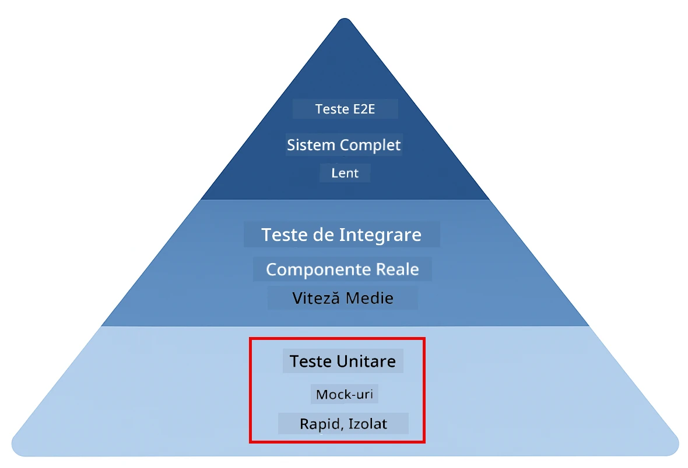
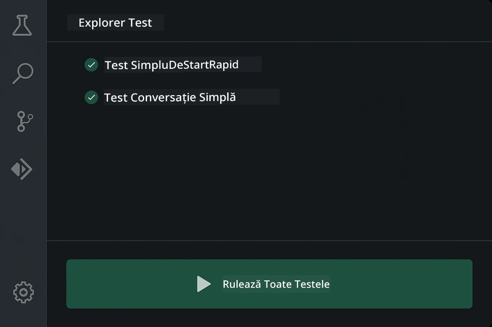
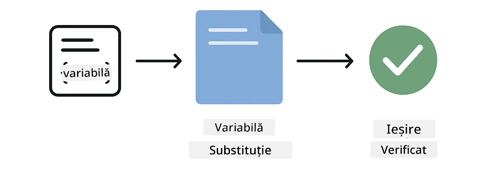
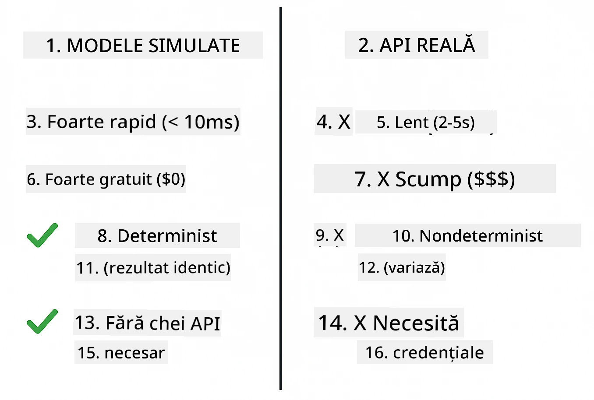
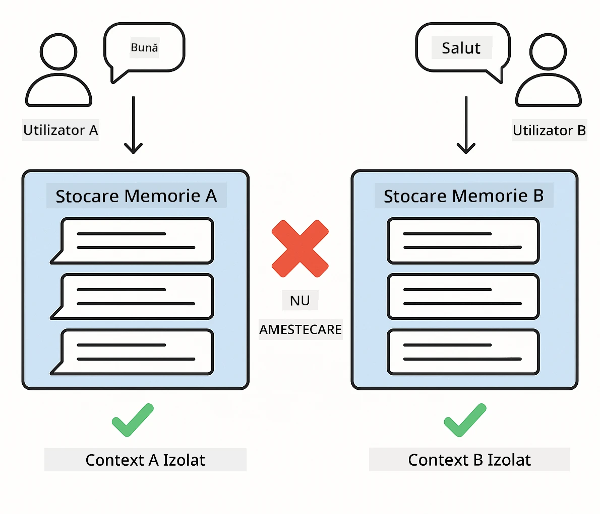
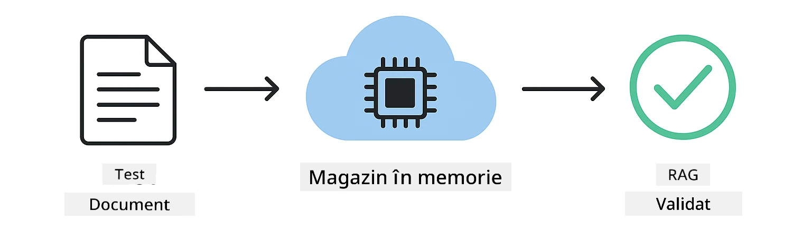

<!--
CO_OP_TRANSLATOR_METADATA:
{
  "original_hash": "ed93b3c14d58734ac10162967da958c1",
  "translation_date": "2025-12-31T04:55:39+00:00",
  "source_file": "docs/TESTING.md",
  "language_code": "ro"
}
-->
# Testarea aplicațiilor LangChain4j

## Cuprins

- [Pornire rapidă](../../../docs)
- [Ce acoperă testele](../../../docs)
- [Rularea testelor](../../../docs)
- [Rularea testelor în VS Code](../../../docs)
- [Modele de testare](../../../docs)
- [Filosofia testării](../../../docs)
- [Pașii următori](../../../docs)

Acest ghid te parcurge prin testele care demonstrează cum să testezi aplicații AI fără a necesita chei API sau servicii externe.

## Quick Start

Rulează toate testele cu o singură comandă:

**Bash:**
```bash
mvn test
```

**PowerShell:**
```powershell
mvn --% test
```


*Execuție reușită a testelor arătând toate testele trecute fără niciun eșec*

## Ce acoperă testele

Acursul se concentrează pe **teste unitare** care rulează local. Fiecare test demonstrează un concept specific LangChain4j izolat.



*Piramida testării arătând echilibrul între teste unitare (rapide, izolate), teste de integrare (componente reale) și teste end-to-end. Această instruire acoperă testarea unitară.*

| Modul | Teste | Scop | Fișiere cheie |
|--------|-------|-------|-----------|
| **00 - Pornire rapidă** | 6 | Șabloane de prompt și substituirea variabilelor | `SimpleQuickStartTest.java` |
| **01 - Introducere** | 8 | Memoria conversației și chat cu stare | `SimpleConversationTest.java` |
| **02 - Ingineria prompturilor** | 12 | Modele GPT-5, niveluri de entuziasm, ieșire structurată | `SimpleGpt5PromptTest.java` |
| **03 - RAG** | 10 | Ingestia documentelor, embeddings, căutare prin similaritate | `DocumentServiceTest.java` |
| **04 - Instrumente** | 12 | Apelarea funcțiilor și concatenarea instrumentelor | `SimpleToolsTest.java` |
| **05 - MCP** | 8 | Model Context Protocol cu transport stdio | `SimpleMcpTest.java` |

## Rularea testelor

**Rulează toate testele din directorul root:**

**Bash:**
```bash
mvn test
```

**PowerShell:**
```powershell
mvn --% test
```

**Rulează testele pentru un modul specific:**

**Bash:**
```bash
cd 01-introduction && mvn test
# Sau ca root
mvn test -pl 01-introduction
```

**PowerShell:**
```powershell
cd 01-introduction; mvn --% test
# Sau din root
mvn --% test -pl 01-introduction
```

**Rulează o singură clasă de test:**

**Bash:**
```bash
mvn test -Dtest=SimpleConversationTest
```

**PowerShell:**
```powershell
mvn --% test -Dtest=SimpleConversationTest
```

**Rulează o metodă de test specifică:**

**Bash:**
```bash
mvn test -Dtest=SimpleConversationTest#ar trebui să mențină istoricul conversației
```

**PowerShell:**
```powershell
mvn --% test -Dtest=SimpleConversationTest#ar trebui să păstreze istoricul conversației
```

## Rularea testelor în VS Code

Dacă folosești Visual Studio Code, Test Explorer oferă o interfață grafică pentru rularea și depanarea testelor.



*VS Code Test Explorer arătând arborele de teste cu toate clasele de test Java și metodele individuale de test*

**Pentru a rula testele în VS Code:**

1. Deschide Test Explorer făcând clic pe pictograma cu eprubetă din Activity Bar
2. Extinde arborele de teste pentru a vedea toate modulele și clasele de test
3. Fă clic pe butonul de redare de lângă orice test pentru a-l rula individual
4. Fă clic pe "Run All Tests" pentru a executa întreaga suită
5. Fă clic dreapta pe orice test și selectează "Debug Test" pentru a seta puncte de întrerupere și a parcurge codul pas cu pas

Test Explorer afișează bifele verzi pentru testele trecute și oferă mesaje detaliate la eșec.

## Modele de testare

### Model 1: Testarea șabloanelor de prompt

Cel mai simplu model testează șabloanele de prompt fără a apela vreun model AI. Verifici că substituirea variabilelor funcționează corect și că prompturile sunt formatate conform așteptărilor.



*Testarea șabloanelor de prompt arătând fluxul de substituție a variabilelor: șablon cu locuri rezervate → valori aplicate → ieșire formatată verificată*

```java
@Test
@DisplayName("Should format prompt template with variables")
void testPromptTemplateFormatting() {
    PromptTemplate template = PromptTemplate.from(
        "Best time to visit {{destination}} for {{activity}}?"
    );
    
    Prompt prompt = template.apply(Map.of(
        "destination", "Paris",
        "activity", "sightseeing"
    ));
    
    assertThat(prompt.text()).isEqualTo("Best time to visit Paris for sightseeing?");
}
```

Acest test se află în `00-quick-start/src/test/java/com/example/langchain4j/quickstart/SimpleQuickStartTest.java`.

**Rulează-l:**

**Bash:**
```bash
cd 00-quick-start && mvn test -Dtest=SimpleQuickStartTest#testarea formatării șablonului de prompt
```

**PowerShell:**
```powershell
cd 00-quick-start; mvn --% test -Dtest=SimpleQuickStartTest#testare a formatării șablonului de prompt
```

### Model 2: Simularea modelelor de limbaj (mocking)

Când testezi logica conversațiilor, folosește Mockito pentru a crea modele false care returnează răspunsuri predeterminate. Acest lucru face testele rapide, gratuite și deterministe.



*Comparație care arată de ce mock-urile sunt preferate pentru testare: sunt rapide, gratuite, deterministe și nu necesită chei API*

```java
@ExtendWith(MockitoExtension.class)
class SimpleConversationTest {
    
    private ConversationService conversationService;
    
    @Mock
    private OpenAiOfficialChatModel mockChatModel;
    
    @BeforeEach
    void setUp() {
        ChatResponse mockResponse = ChatResponse.builder()
            .aiMessage(AiMessage.from("This is a test response"))
            .build();
        when(mockChatModel.chat(anyList())).thenReturn(mockResponse);
        
        conversationService = new ConversationService(mockChatModel);
    }
    
    @Test
    void shouldMaintainConversationHistory() {
        String conversationId = conversationService.startConversation();
        
        ChatResponse mockResponse1 = ChatResponse.builder()
            .aiMessage(AiMessage.from("Response 1"))
            .build();
        ChatResponse mockResponse2 = ChatResponse.builder()
            .aiMessage(AiMessage.from("Response 2"))
            .build();
        ChatResponse mockResponse3 = ChatResponse.builder()
            .aiMessage(AiMessage.from("Response 3"))
            .build();
        
        when(mockChatModel.chat(anyList()))
            .thenReturn(mockResponse1)
            .thenReturn(mockResponse2)
            .thenReturn(mockResponse3);

        conversationService.chat(conversationId, "First message");
        conversationService.chat(conversationId, "Second message");
        conversationService.chat(conversationId, "Third message");

        List<ChatMessage> history = conversationService.getHistory(conversationId);
        assertThat(history).hasSize(6); // 3 mesaje de utilizator + 3 mesaje AI
    }
}
```

Acest model apare în `01-introduction/src/test/java/com/example/langchain4j/service/SimpleConversationTest.java`. Mock-ul asigură un comportament consecvent astfel încât poți verifica corect gestionarea memoriei.

### Model 3: Testarea izolării conversațiilor

Memoria conversației trebuie să păstreze utilizatorii separați. Acest test verifică că conversațiile nu amestecă contexte.



*Testarea izolării conversațiilor care arată magazine de memorie separate pentru utilizatori diferiți pentru a preveni amestecarea contextelor*

```java
@Test
void shouldIsolateConversationsByid() {
    String conv1 = conversationService.startConversation();
    String conv2 = conversationService.startConversation();
    
    ChatResponse mockResponse = ChatResponse.builder()
        .aiMessage(AiMessage.from("Response"))
        .build();
    when(mockChatModel.chat(anyList())).thenReturn(mockResponse);

    conversationService.chat(conv1, "Message for conversation 1");
    conversationService.chat(conv2, "Message for conversation 2");

    List<ChatMessage> history1 = conversationService.getHistory(conv1);
    List<ChatMessage> history2 = conversationService.getHistory(conv2);
    
    assertThat(history1).hasSize(2);
    assertThat(history2).hasSize(2);
}
```

Fiecare conversație își menține propria istorie independentă. În sistemele de producție, această izolare este critică pentru aplicațiile multi-utilizator.

### Model 4: Testarea instrumentelor în mod independent

Instrumentele sunt funcții pe care AI le poate apela. Testează-le direct pentru a te asigura că funcționează corect indiferent de deciziile AI-ului.


*Testarea instrumentelor în mod independent arătând executarea mock a instrumentelor fără apeluri AI pentru a verifica logica de business*

```java
@Test
void shouldConvertCelsiusToFahrenheit() {
    TemperatureTool tempTool = new TemperatureTool();
    String result = tempTool.celsiusToFahrenheit(25.0);
    assertThat(result).containsPattern("77[.,]0°F");
}

@Test
void shouldDemonstrateToolChaining() {
    WeatherTool weatherTool = new WeatherTool();
    TemperatureTool tempTool = new TemperatureTool();

    String weatherResult = weatherTool.getCurrentWeather("Seattle");
    assertThat(weatherResult).containsPattern("\\d+°C");

    String conversionResult = tempTool.celsiusToFahrenheit(22.0);
    assertThat(conversionResult).containsPattern("71[.,]6°F");
}
```

Aceste teste din `04-tools/src/test/java/com/example/langchain4j/agents/tools/SimpleToolsTest.java` validează logica instrumentelor fără implicarea AI. Exemplul de chaining arată cum ieșirea unui instrument alimentează intrarea altuia.

### Model 5: Testarea RAG în memorie

Sistemele RAG necesită în mod tradițional baze de date vectoriale și servicii de embedding. Modelul în memorie îți permite să testezi întregul pipeline fără dependențe externe.



*Fluxul de testare RAG în memorie arătând parsarea documentelor, stocarea embedding-urilor și căutarea prin similaritate fără a necesita o bază de date*

```java
@Test
void testProcessTextDocument() {
    String content = "This is a test document.\nIt has multiple lines.";
    InputStream inputStream = new ByteArrayInputStream(content.getBytes(StandardCharsets.UTF_8));
    
    DocumentService.ProcessedDocument result = 
        documentService.processDocument(inputStream, "test.txt");

    assertNotNull(result);
    assertTrue(result.segments().size() > 0);
    assertEquals("test.txt", result.segments().get(0).metadata().getString("filename"));
}
```

Acest test din `03-rag/src/test/java/com/example/langchain4j/rag/service/DocumentServiceTest.java` creează un document în memorie și verifică chunking-ul și gestionarea metadata.

### Model 6: Testarea integrării MCP

Modulul MCP testează integrarea Model Context Protocol folosind transportul stdio. Aceste teste verifică că aplicația ta poate porni și comunica cu servere MCP ca subprocessuri.

Teste din `05-mcp/src/test/java/com/example/langchain4j/mcp/SimpleMcpTest.java` validează comportamentul clientului MCP.

**Rulează-le:**

**Bash:**
```bash
cd 05-mcp && mvn test
```

**PowerShell:**
```powershell
cd 05-mcp; mvn --% test
```

## Filosofia testării

Testează codul tău, nu AI-ul. Testele tale ar trebui să valideze codul pe care îl scrii verificând cum sunt construite prompturile, cum este gestionată memoria și cum execută instrumentele. Răspunsurile AI variază și nu ar trebui să facă parte din aserțiuni. Întreabă-te dacă șablonul tău de prompt substituie corect variabilele, nu dacă AI oferă răspunsul corect.

Folosește mock-uri pentru modelele de limbaj. Sunt dependențe externe care sunt lente, costisitoare și nedeterministe. Mockarea face testele rapide în milisecunde în loc de secunde, gratuite fără costuri API și deterministe cu același rezultat de fiecare dată.

Păstrează testele independente. Fiecare test ar trebui să își configureze propriile date, să nu se bazeze pe alte teste și să curețe după sine. Testele ar trebui să treacă indiferent de ordinea de execuție.

Testează cazurile limită dincolo de căile fericite. Încearcă intrări goale, intrări foarte mari, caractere speciale, parametri invalizi și condiții de margine. Acestea adesea dezvăluie bug-uri pe care utilizarea normală nu le expune.

Folosește nume descriptive. Compară `shouldMaintainConversationHistoryAcrossMultipleMessages()` cu `test1()`. Primul îți spune exact ce se testează, făcând mult mai ușoară depanarea eșecurilor.

## Pașii următori

Acum că ai înțeles modelele de testare, aprofundează fiecare modul:

- **[00 - Pornire rapidă](../00-quick-start/README.md)** - Începe cu elementele de bază ale șabloanelor de prompt
- **[01 - Introducere](../01-introduction/README.md)** - Învață gestionarea memoriei conversației
- **[02 - Ingineria prompturilor](../02-prompt-engineering/README.md)** - Stăpânește modelele de prompting GPT-5
- **[03 - RAG](../03-rag/README.md)** - Construiește sisteme de generare augmentată prin recuperare
- **[04 - Instrumente](../04-tools/README.md)** - Implementează apelarea funcțiilor și lanțuri de instrumente
- **[05 - MCP](../05-mcp/README.md)** - Integrează Model Context Protocol

README-ul fiecărui modul oferă explicații detaliate ale conceptelor testate aici.

---

**Navigation:** [← Înapoi la principal](../README.md)

---

<!-- CO-OP TRANSLATOR DISCLAIMER START -->
**Declinare de responsabilitate**:
Acest document a fost tradus folosind serviciul de traducere AI [Co-op Translator](https://github.com/Azure/co-op-translator). Deși depunem eforturi pentru acuratețe, vă rugăm să rețineți că traducerile automate pot conține erori sau inexactități. Documentul original, în limba sa originală, trebuie considerat sursa autorizată. Pentru informații critice, se recomandă o traducere profesională realizată de un traducător uman. Nu ne asumăm responsabilitatea pentru eventuale neînțelegeri sau interpretări greșite care decurg din utilizarea acestei traduceri.
<!-- CO-OP TRANSLATOR DISCLAIMER END -->