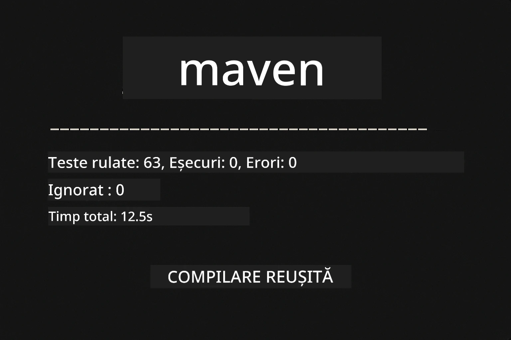
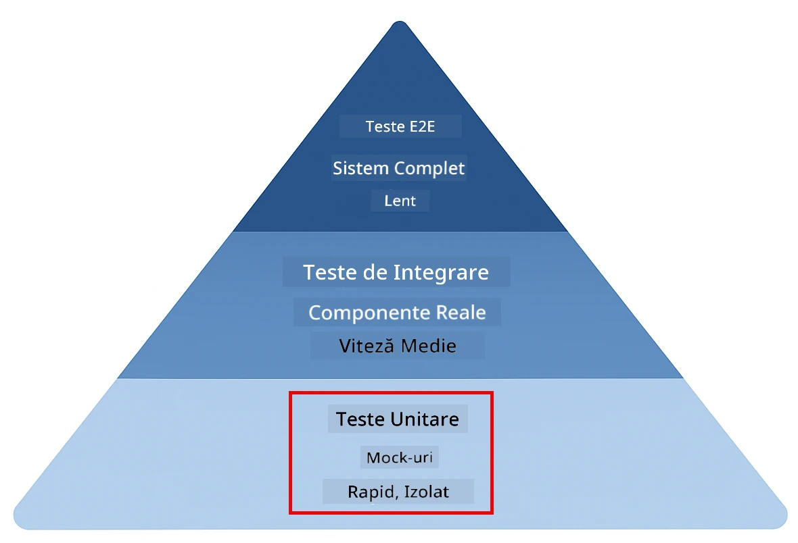
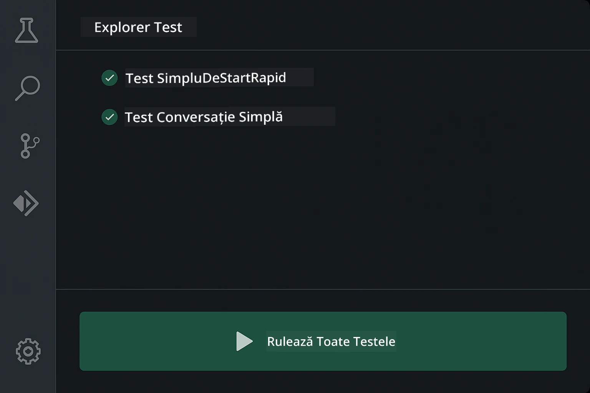
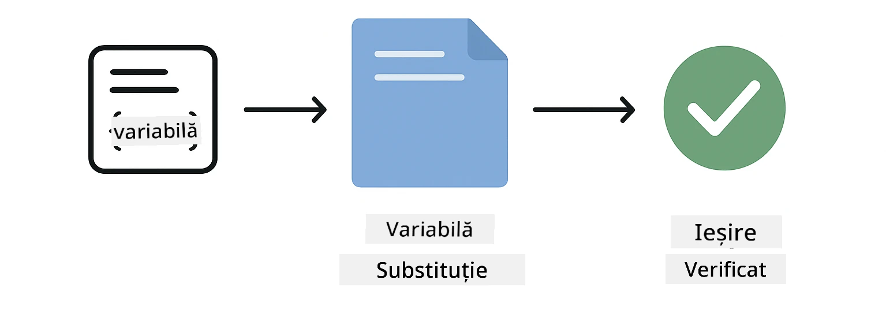
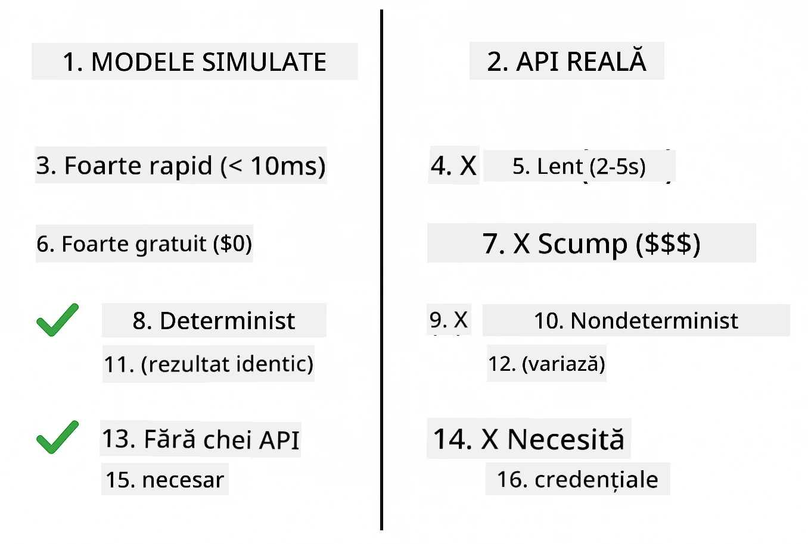
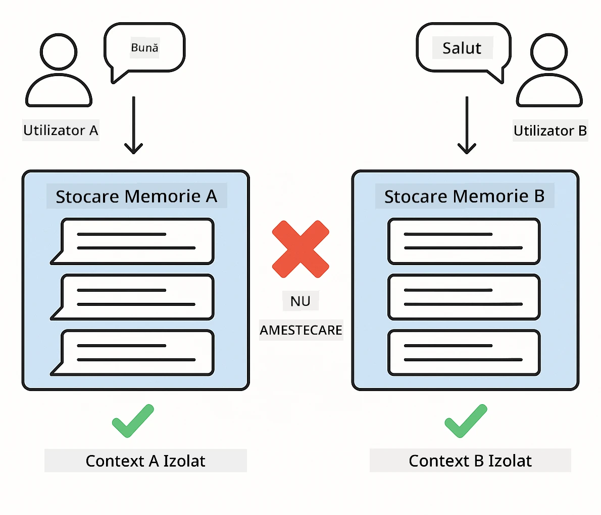
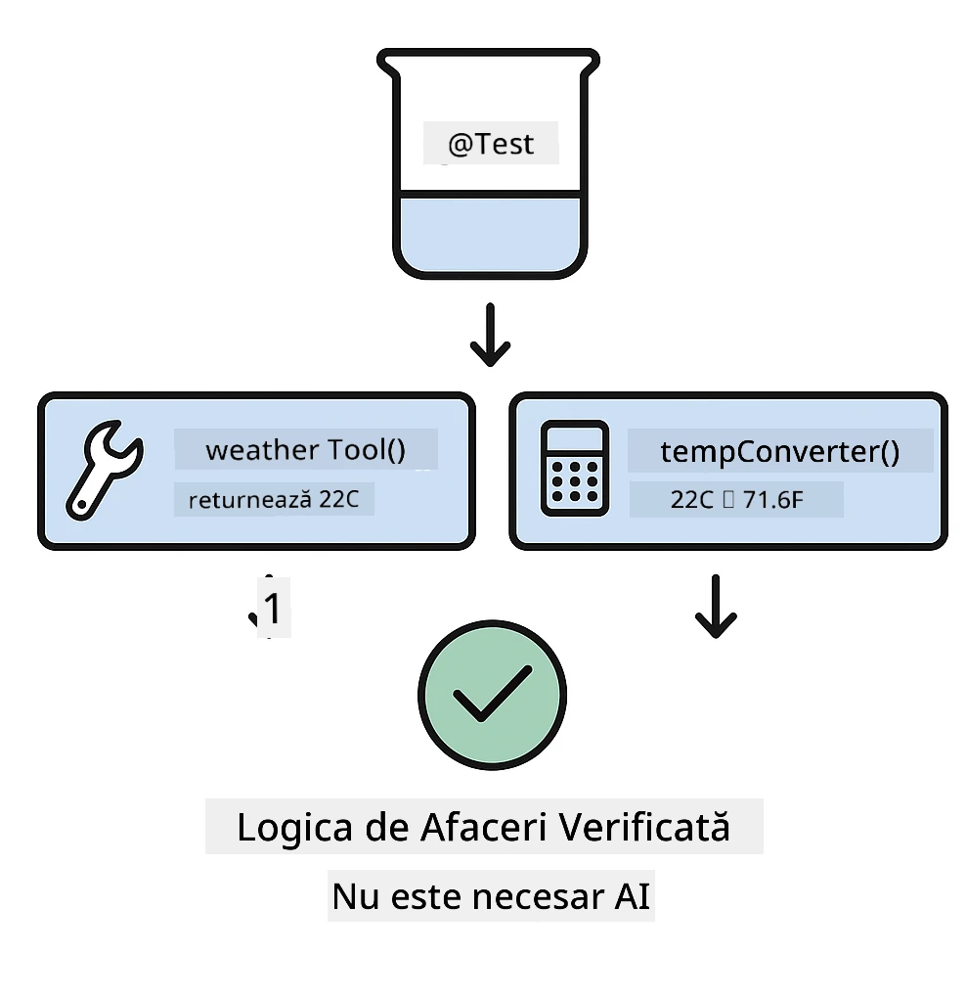
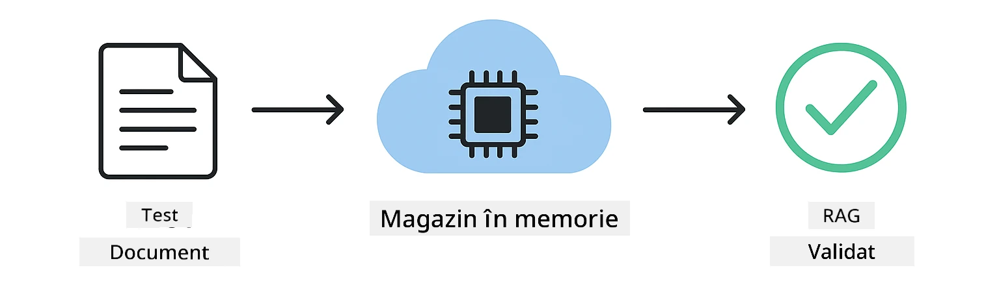

# Testarea aplicațiilor LangChain4j

## Cuprins

- [Pornire rapidă](#pornire-rapidă)
- [Ce acoperă testele](#ce-acoperă-testele)
- [Executarea testelor](#executarea-testelor)
- [Executarea testelor în VS Code](#executarea-testelor-în-vs-code)
- [Modele de testare](#modele-de-testare)
- [Filosofia testării](#filosofia-testării)
- [Pașii următori](#pașii-următori)

Acest ghid te conduce prin testele care demonstrează cum să testezi aplicații AI fără a avea nevoie de chei API sau servicii externe.

## Pornire rapidă

Execută toate testele cu o singură comandă:

**Bash:**
```bash
mvn test
```

**PowerShell:**
```powershell
mvn --% test
```

Când toate testele trec, ar trebui să vezi un rezultat asemănător cu captura de ecran de mai jos — testele rulează fără niciun eșec.



*Executarea cu succes a testelor arătând toate testele trecute fără eșecuri*

## Ce acoperă testele

Acest curs se concentrează pe **teste unitare** care rulează local. Fiecare test demonstrează un concept specific LangChain4j în izolare. Piramida de testare de mai jos arată unde se încadrează testele unitare — ele formează fundația rapidă și fiabilă pe care se construiește restul strategiei tale de testare.



*Piramida de testare care arată echilibrul dintre testele unitare (rapide, izolate), testele de integrare (componente reale) și testele end-to-end. Acest antrenament acoperă testarea unitară.*

| Modul | Teste | Focalizare | Fișiere cheie |
|--------|-------|-------|-----------|
| **01 - Introducere** | 8 | Memorie conversațională și chat cu stări | `SimpleConversationTest.java` |
| **02 - Inginerie Prompt** | 12 | Tipare GPT-5.2, nivele de entuziasm, output structurat | `SimpleGpt5PromptTest.java` |
| **03 - RAG** | 10 | Ingestie documente, embeddings, căutare după similaritate | `DocumentServiceTest.java` |
| **04 - Unelte** | 12 | Apelare funcții și înlănțuire unelte | `SimpleToolsTest.java` |
| **05 - MCP** | 8 | Protocolul Contextului Modelului cu transport stdio | `SimpleMcpTest.java` |

## Executarea testelor

**Execută toate testele din rădăcină:**

**Bash:**
```bash
mvn test
```

**PowerShell:**
```powershell
mvn --% test
```

**Execută testele pentru un modul specific:**

**Bash:**
```bash
cd 01-introduction && mvn test
# Sau din rădăcină
mvn test -pl 01-introduction
```

**PowerShell:**
```powershell
cd 01-introduction; mvn --% test
# Sau din rădăcină
mvn --% test -pl 01-introduction
```

**Execută o singură clasă de test:**

**Bash:**
```bash
mvn test -Dtest=SimpleConversationTest
```

**PowerShell:**
```powershell
mvn --% test -Dtest=SimpleConversationTest
```

**Execută o metodă de test specifică:**

**Bash:**
```bash
mvn test -Dtest=SimpleConversationTest#ar trebui să păstreze istoricul conversației
```

**PowerShell:**
```powershell
mvn --% test -Dtest=SimpleConversationTest#ar trebui să păstreze istoricul conversației
```

## Executarea testelor în VS Code

Dacă folosești Visual Studio Code, Test Explorer oferă o interfață grafică pentru rularea și depanarea testelor.



*Test Explorer din VS Code care arată arborele de test cu toate clasele de test Java și metodele de test individuale*

**Pentru a rula testele în VS Code:**

1. Deschide Test Explorer făcând clic pe pictograma eprubetei din Bara de activități
2. Extinde arborele de test pentru a vedea toate modulele și clasele de test
3. Fă clic pe butonul play de lângă orice test pentru a-l rula individual
4. Fă clic pe „Run All Tests” pentru a executa întregul set
5. Click dreapta pe orice test și selectează „Debug Test” pentru a seta puncte de întrerupere și a parcurge codul

Test Explorer afișează bifele verzi pentru testele care trec și oferă mesaje detaliate de eșec când testele pică.

## Modele de testare

### Model 1: Testarea șabloanelor de prompt

Cel mai simplu model testează șabloanele de prompt fără a apela vreun model AI. Verifici că substituirea variabilelor funcționează corect și prompturile sunt formatate corect.



*Testarea șabloanelor de prompt arătând fluxul de substituție a variabilelor: șablon cu locuri rezervate → valori aplicate → output formatat verificat*

```java
@Test
@DisplayName("Should format prompt template with variables")
void testPromptTemplateFormatting() {
    PromptTemplate template = PromptTemplate.from(
        "Best time to visit {{destination}} for {{activity}}?"
    );
    
    Prompt prompt = template.apply(Map.of(
        "destination", "Paris",
        "activity", "sightseeing"
    ));
    
    assertThat(prompt.text()).isEqualTo("Best time to visit Paris for sightseeing?");
}
```

Acest model verifică că substituirea variabilelor funcționează corect și prompturile sunt formatate așa cum se așteaptă — nu este nevoie de cheie API sau apel la model.

### Model 2: Mocking modelelor de limbaj

Când testezi logica conversației, folosește Mockito pentru a crea modele false care înapoiază răspunsuri prestabilite. Acest lucru face testele rapide, gratuite și deterministe.



*Comparație care arată de ce mock-urile sunt preferate pentru testare: sunt rapide, gratuite, deterministe și nu necesită chei API*

```java
@ExtendWith(MockitoExtension.class)
class SimpleConversationTest {
    
    private ConversationService conversationService;
    
    @Mock
    private OpenAiOfficialChatModel mockChatModel;
    
    @BeforeEach
    void setUp() {
        ChatResponse mockResponse = ChatResponse.builder()
            .aiMessage(AiMessage.from("This is a test response"))
            .build();
        when(mockChatModel.chat(anyList())).thenReturn(mockResponse);
        
        conversationService = new ConversationService(mockChatModel);
    }
    
    @Test
    void shouldMaintainConversationHistory() {
        String conversationId = conversationService.startConversation();
        
        ChatResponse mockResponse1 = ChatResponse.builder()
            .aiMessage(AiMessage.from("Response 1"))
            .build();
        ChatResponse mockResponse2 = ChatResponse.builder()
            .aiMessage(AiMessage.from("Response 2"))
            .build();
        ChatResponse mockResponse3 = ChatResponse.builder()
            .aiMessage(AiMessage.from("Response 3"))
            .build();
        
        when(mockChatModel.chat(anyList()))
            .thenReturn(mockResponse1)
            .thenReturn(mockResponse2)
            .thenReturn(mockResponse3);

        conversationService.chat(conversationId, "First message");
        conversationService.chat(conversationId, "Second message");
        conversationService.chat(conversationId, "Third message");

        List<ChatMessage> history = conversationService.getHistory(conversationId);
        assertThat(history).hasSize(6); // 3 mesaje utilizator + 3 mesaje AI
    }
}
```

Acest model apare în `01-introduction/src/test/java/com/example/langchain4j/service/SimpleConversationTest.java`. Mock-ul asigură un comportament consistent pentru a putea verifica corectitudinea gestionării memoriei.

### Model 3: Testarea izolării conversației

Memoria conversațională trebuie să păstreze separația între mai mulți utilizatori. Acest test verifică că conversațiile nu amestecă contextul.



*Testarea izolării conversației care arată stocuri de memorie separate pentru diferiți utilizatori pentru a preveni amestecarea contextului*

```java
@Test
void shouldIsolateConversationsByid() {
    String conv1 = conversationService.startConversation();
    String conv2 = conversationService.startConversation();
    
    ChatResponse mockResponse = ChatResponse.builder()
        .aiMessage(AiMessage.from("Response"))
        .build();
    when(mockChatModel.chat(anyList())).thenReturn(mockResponse);

    conversationService.chat(conv1, "Message for conversation 1");
    conversationService.chat(conv2, "Message for conversation 2");

    List<ChatMessage> history1 = conversationService.getHistory(conv1);
    List<ChatMessage> history2 = conversationService.getHistory(conv2);
    
    assertThat(history1).hasSize(2);
    assertThat(history2).hasSize(2);
}
```

Fiecare conversație își păstrează istoricul independent. În sistemele de producție, această izolare este critică pentru aplicațiile multi-utilizator.

### Model 4: Testarea uneltelor independent

Uneltele sunt funcții pe care AI le poate apela. Testează-le direct pentru a te asigura că funcționează corect indiferent de deciziile AI.



*Testarea uneltelor independent arătând execuția unei unelte mock fără apeluri AI pentru a verifica logica de business*

```java
@Test
void shouldConvertCelsiusToFahrenheit() {
    TemperatureTool tempTool = new TemperatureTool();
    String result = tempTool.celsiusToFahrenheit(25.0);
    assertThat(result).containsPattern("77[.,]0°F");
}

@Test
void shouldDemonstrateToolChaining() {
    WeatherTool weatherTool = new WeatherTool();
    TemperatureTool tempTool = new TemperatureTool();

    String weatherResult = weatherTool.getCurrentWeather("Seattle");
    assertThat(weatherResult).containsPattern("\\d+°C");

    String conversionResult = tempTool.celsiusToFahrenheit(22.0);
    assertThat(conversionResult).containsPattern("71[.,]6°F");
}
```

Aceste teste din `04-tools/src/test/java/com/example/langchain4j/agents/tools/SimpleToolsTest.java` validează logica uneltelor fără implicarea AI. Exemplul de înlănțuire arată cum output-ul unei unelte alimentează input-ul altei unelte.

### Model 5: Testarea RAG în memorie

Sistemele RAG necesită în mod tradițional baze de date vectoriale și servicii de embedding. Modelul în memorie îți permite să testezi întregul flux fără dependențe externe.



*Flux de testare RAG în memorie arătând procesarea documentelor, stocarea embedding-urilor și căutarea după similaritate fără a necesita o bază de date*

```java
@Test
void testProcessTextDocument() {
    String content = "This is a test document.\nIt has multiple lines.";
    InputStream inputStream = new ByteArrayInputStream(content.getBytes(StandardCharsets.UTF_8));
    
    DocumentService.ProcessedDocument result = 
        documentService.processDocument(inputStream, "test.txt");

    assertNotNull(result);
    assertTrue(result.segments().size() > 0);
    assertEquals("test.txt", result.segments().get(0).metadata().getString("filename"));
}
```

Acest test din `03-rag/src/test/java/com/example/langchain4j/rag/service/DocumentServiceTest.java` creează un document în memorie și verifică segmentarea și gestionarea metadatelor.

### Model 6: Testarea integrării MCP

Modulul MCP testează integrarea Protocolului Contextului Modelului folosind transportul stdio. Aceste teste verifică că aplicația ta poate lansa și comunica cu servere MCP ca subprocese.

Testele din `05-mcp/src/test/java/com/example/langchain4j/mcp/SimpleMcpTest.java` validează comportamentul clientului MCP.

**Rulează-le:**

**Bash:**
```bash
cd 05-mcp && mvn test
```

**PowerShell:**
```powershell
cd 05-mcp; mvn --% test
```

## Filosofia testării

Testează codul tău, nu AI-ul. Testele tale ar trebui să valideze codul scris, verificând cum sunt construite prompturile, cum este gestionată memoria și cum se execută uneltele. Răspunsurile AI variază și nu ar trebui să facă parte din aserțiunile testelor. Întreabă-te dacă șablonul promptului substituie corect variabilele, nu dacă AI oferă răspunsul corect.

Folosește mock-uri pentru modelele de limbaj. Sunt dependențe externe care sunt lente, costisitoare și nedeterministe. Mock-urile fac testele rapide, cu milisecunde în loc de secunde, gratuite fără costuri API și deterministe cu același rezultat de fiecare dată.

Păstrează testele independente. Fiecare test trebuie să-și configureze propriile date, să nu depindă de alte teste și să curețe după sine. Testele trebuie să treacă indiferent de ordinea de execuție.

Testează cazurile-limită dincolo de drumul fericit. Încearcă inputuri goale, inputuri foarte mari, caractere speciale, parametri invalizi și condiții de margine. Acestea dezvăluie adesea bug-uri pe care utilizarea normală nu le expune.

Folosește nume descriptive. Compară `shouldMaintainConversationHistoryAcrossMultipleMessages()` cu `test1()`. Primul îți spune exact ce se testează, făcând debugging-ul defecțiunilor mult mai ușor.

## Pașii următori

Acum că înțelegi modelele de testare, aprofundează fiecare modul:

- **[01 - Introducere](../01-introduction/README.md)** - Învață gestionarea memoriei conversaționale
- **[02 - Inginerie Prompt](../02/prompt-engineering/README.md)** - Stăpânește tiparele de prompting GPT-5.2
- **[03 - RAG](../03-rag/README.md)** - Construiește sisteme de generare augmentată cu recuperare
- **[04 - Unelte](../04-tools/README.md)** - Implementează apelarea funcțiilor și lanțurile de unelte
- **[05 - MCP](../05-mcp/README.md)** - Integrează Protocolul Contextului Modelului

README-ul fiecărui modul oferă explicații detaliate ale conceptelor testate aici.

---

**Navigare:** [← Înapoi la principal](../README.md)

---

<!-- CO-OP TRANSLATOR DISCLAIMER START -->
**Declinare a responsabilității**:
Acest document a fost tradus folosind serviciul de traducere AI [Co-op Translator](https://github.com/Azure/co-op-translator). În timp ce ne străduim pentru acuratețe, vă rugăm să rețineți că traducerile automate pot conține erori sau inexactități. Documentul original în limba sa nativă trebuie considerat sursa autorizată. Pentru informații critice, se recomandă traducerea profesională realizată de un om. Nu ne asumăm responsabilitatea pentru eventualele neînțelegeri sau interpretări greșite care decurg din utilizarea acestei traduceri.
<!-- CO-OP TRANSLATOR DISCLAIMER END -->