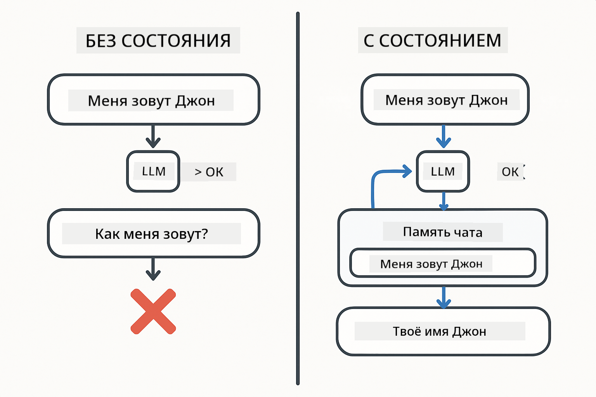
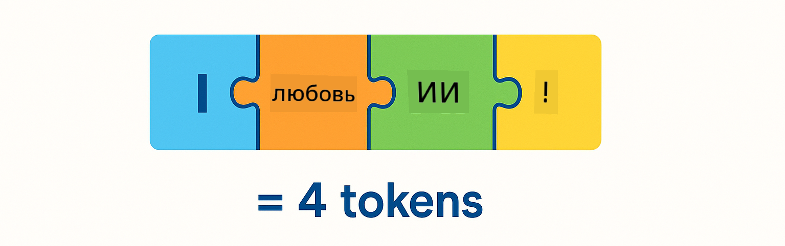
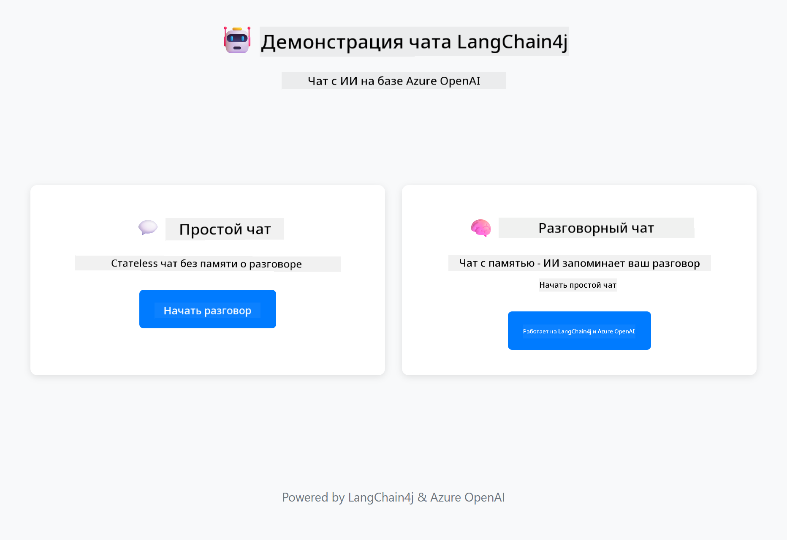
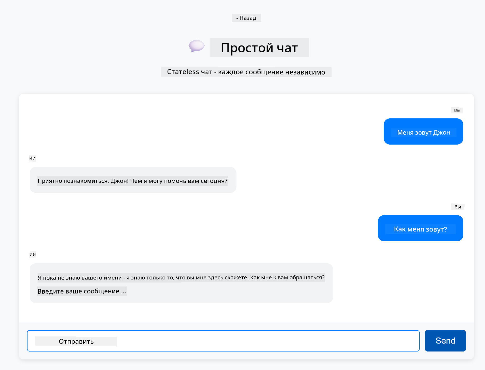

<!--
CO_OP_TRANSLATOR_METADATA:
{
  "original_hash": "c3e07ca58d0b8a3f47d3bf5728541e0a",
  "translation_date": "2025-12-13T13:04:30+00:00",
  "source_file": "01-introduction/README.md",
  "language_code": "ru"
}
-->
# Модуль 01: Начало работы с LangChain4j

## Содержание

- [Чему вы научитесь](../../../01-introduction)
- [Требования](../../../01-introduction)
- [Понимание основной проблемы](../../../01-introduction)
- [Понимание токенов](../../../01-introduction)
- [Как работает память](../../../01-introduction)
- [Как это использует LangChain4j](../../../01-introduction)
- [Развертывание инфраструктуры Azure OpenAI](../../../01-introduction)
- [Запуск приложения локально](../../../01-introduction)
- [Использование приложения](../../../01-introduction)
  - [Статeless чат (левая панель)](../../../01-introduction)
  - [Stateful чат (правая панель)](../../../01-introduction)
- [Следующие шаги](../../../01-introduction)

## Чему вы научитесь

Если вы прошли быстрый старт, вы увидели, как отправлять запросы и получать ответы. Это основа, но для реальных приложений нужно больше. В этом модуле вы научитесь создавать разговорный ИИ, который запоминает контекст и поддерживает состояние — разница между одноразовой демонстрацией и готовым к производству приложением.

Мы будем использовать GPT-5 от Azure OpenAI на протяжении всего руководства, потому что его продвинутые возможности рассуждения делают поведение разных паттернов более очевидным. Когда вы добавите память, вы ясно увидите разницу. Это облегчает понимание того, что каждый компонент приносит вашему приложению.

Вы создадите одно приложение, демонстрирующее оба паттерна:

**Stateless Chat** — каждый запрос независим. Модель не помнит предыдущие сообщения. Это паттерн, который вы использовали в быстром старте.

**Stateful Conversation** — каждый запрос включает историю разговора. Модель поддерживает контекст на протяжении нескольких ходов. Это то, что требуется для производственных приложений.

## Требования

- Подписка Azure с доступом к Azure OpenAI
- Java 21, Maven 3.9+
- Azure CLI (https://learn.microsoft.com/en-us/cli/azure/install-azure-cli)
- Azure Developer CLI (azd) (https://learn.microsoft.com/en-us/azure/developer/azure-developer-cli/install-azd)

> **Примечание:** Java, Maven, Azure CLI и Azure Developer CLI (azd) предустановлены в предоставленном devcontainer.

> **Примечание:** В этом модуле используется GPT-5 на Azure OpenAI. Развертывание настраивается автоматически через `azd up` — не изменяйте имя модели в коде.

## Понимание основной проблемы

Языковые модели являются stateless. Каждый вызов API независим. Если вы отправите "Меня зовут Джон", а затем спросите "Как меня зовут?", модель не знает, что вы только что представились. Она обрабатывает каждый запрос так, как будто это первый разговор в вашей жизни.

Это подходит для простых вопросов и ответов, но бесполезно для реальных приложений. Боты службы поддержки должны помнить, что вы им сказали. Личные помощники нуждаются в контексте. Любой многоходовой разговор требует памяти.



*Разница между stateless (независимые вызовы) и stateful (с учетом контекста) разговорами*

## Понимание токенов

Прежде чем погружаться в разговоры, важно понять токены — базовые единицы текста, которые обрабатывают языковые модели:



*Пример того, как текст разбивается на токены — "I love AI!" становится 4 отдельными единицами обработки*

Токены — это то, как модели ИИ измеряют и обрабатывают текст. Слова, знаки препинания и даже пробелы могут быть токенами. У вашей модели есть ограничение на количество токенов, которые она может обработать за раз (400 000 для GPT-5, с максимумом 272 000 входных токенов и 128 000 выходных токенов). Понимание токенов помогает управлять длиной разговора и затратами.

## Как работает память

Память чата решает проблему stateless, сохраняя историю разговора. Перед отправкой запроса модели фреймворк добавляет релевантные предыдущие сообщения. Когда вы спрашиваете "Как меня зовут?", система фактически отправляет всю историю разговора, позволяя модели видеть, что вы ранее сказали "Меня зовут Джон."

LangChain4j предоставляет реализации памяти, которые делают это автоматически. Вы выбираете, сколько сообщений сохранять, а фреймворк управляет контекстным окном.


*MessageWindowChatMemory поддерживает скользящее окно последних сообщений, автоматически удаляя старые*

## Как это использует LangChain4j

Этот модуль расширяет быстрый старт, интегрируя Spring Boot и добавляя память для разговоров. Вот как компоненты связаны:

**Зависимости** — добавьте две библиотеки LangChain4j:

```xml
<dependency>
    <groupId>dev.langchain4j</groupId>
    <artifactId>langchain4j</artifactId> <!-- Inherited from BOM in root pom.xml -->
</dependency>
<dependency>
    <groupId>dev.langchain4j</groupId>
    <artifactId>langchain4j-open-ai-official</artifactId> <!-- Inherited from BOM in root pom.xml -->
</dependency>
```

**Модель чата** — настройте Azure OpenAI как Spring bean ([LangChainConfig.java](../../../01-introduction/src/main/java/com/example/langchain4j/config/LangChainConfig.java)):

```java
@Bean
public OpenAiOfficialChatModel openAiOfficialChatModel() {
    return OpenAiOfficialChatModel.builder()
            .baseUrl(azureEndpoint)
            .apiKey(azureApiKey)
            .modelName(deploymentName)
            .timeout(Duration.ofMinutes(5))
            .maxRetries(3)
            .build();
}
```

Билдер читает учетные данные из переменных окружения, установленных `azd up`. Установка `baseUrl` на ваш Azure endpoint позволяет клиенту OpenAI работать с Azure OpenAI.

**Память разговора** — отслеживайте историю чата с MessageWindowChatMemory ([ConversationService.java](../../../01-introduction/src/main/java/com/example/langchain4j/service/ConversationService.java)):

```java
ChatMemory memory = MessageWindowChatMemory.withMaxMessages(10);

memory.add(UserMessage.from("My name is John"));
memory.add(AiMessage.from("Nice to meet you, John!"));

memory.add(UserMessage.from("What's my name?"));
AiMessage aiMessage = chatModel.chat(memory.messages()).aiMessage();
memory.add(aiMessage);
```

Создайте память с `withMaxMessages(10)`, чтобы хранить последние 10 сообщений. Добавляйте сообщения пользователя и ИИ с помощью типизированных оберток: `UserMessage.from(text)` и `AiMessage.from(text)`. Получайте историю с помощью `memory.messages()` и отправляйте её модели. Сервис хранит отдельные экземпляры памяти для каждого ID разговора, позволяя нескольким пользователям общаться одновременно.

> **🤖 Попробуйте с [GitHub Copilot](https://github.com/features/copilot) Chat:** Откройте [`ConversationService.java`](../../../01-introduction/src/main/java/com/example/langchain4j/service/ConversationService.java) и спросите:
> - "Как MessageWindowChatMemory решает, какие сообщения удалять, когда окно заполнено?"
> - "Могу ли я реализовать собственное хранилище памяти с использованием базы данных вместо памяти в оперативной памяти?"
> - "Как добавить суммирование для сжатия старой истории разговора?"

Точка доступа stateless чата полностью пропускает память — просто `chatModel.chat(prompt)`, как в быстром старте. Stateful точка доступа добавляет сообщения в память, получает историю и включает этот контекст в каждый запрос. Одна и та же конфигурация модели, разные паттерны.

## Развертывание инфраструктуры Azure OpenAI

**Bash:**
```bash
cd 01-introduction
azd up  # Выберите подписку и расположение (рекомендуется eastus2)
```

**PowerShell:**
```powershell
cd 01-introduction
azd up  # Выберите подписку и расположение (рекомендуется eastus2)
```

> **Примечание:** Если вы столкнулись с ошибкой таймаута (`RequestConflict: Cannot modify resource ... provisioning state is not terminal`), просто запустите `azd up` снова. Ресурсы Azure могут еще развертываться в фоне, и повторная попытка позволит завершить развертывание, когда ресурсы достигнут конечного состояния.

Это сделает следующее:
1. Развернет ресурс Azure OpenAI с моделями GPT-5 и text-embedding-3-small
2. Автоматически создаст файл `.env` в корне проекта с учетными данными
3. Настроит все необходимые переменные окружения

**Проблемы с развертыванием?** Смотрите [README по инфраструктуре](infra/README.md) для подробного устранения неполадок, включая конфликты имен поддоменов, шаги ручного развертывания через Azure Portal и рекомендации по настройке моделей.

**Проверьте успешность развертывания:**

**Bash:**
```bash
cat ../.env  # Должен показывать AZURE_OPENAI_ENDPOINT, API_KEY и т.д.
```

**PowerShell:**
```powershell
Get-Content ..\.env  # Должен показывать AZURE_OPENAI_ENDPOINT, API_KEY и т.д.
```

> **Примечание:** Команда `azd up` автоматически генерирует файл `.env`. Если нужно обновить его позже, вы можете либо отредактировать `.env` вручную, либо сгенерировать заново, выполнив:
>
> **Bash:**
> ```bash
> cd ..
> bash .azd-env.sh
> ```
>
> **PowerShell:**
> ```powershell
> cd ..
> .\.azd-env.ps1
> ```

## Запуск приложения локально

**Проверьте развертывание:**

Убедитесь, что файл `.env` существует в корневой директории с учетными данными Azure:

**Bash:**
```bash
cat ../.env  # Должен показывать AZURE_OPENAI_ENDPOINT, API_KEY, DEPLOYMENT
```

**PowerShell:**
```powershell
Get-Content ..\.env  # Должен показывать AZURE_OPENAI_ENDPOINT, API_KEY, DEPLOYMENT
```

**Запустите приложения:**

**Вариант 1: Использование Spring Boot Dashboard (рекомендуется для пользователей VS Code)**

Dev контейнер включает расширение Spring Boot Dashboard, которое предоставляет визуальный интерфейс для управления всеми приложениями Spring Boot. Вы найдете его на панели активности слева в VS Code (значок Spring Boot).

С помощью Spring Boot Dashboard вы можете:
- Просматривать все доступные приложения Spring Boot в рабочем пространстве
- Запускать/останавливать приложения одним кликом
- Смотреть логи приложений в реальном времени
- Отслеживать статус приложений

Просто нажмите кнопку запуска рядом с "introduction", чтобы запустить этот модуль, или запустите все модули сразу.


**Вариант 2: Использование shell-скриптов**

Запустите все веб-приложения (модули 01-04):

**Bash:**
```bash
cd ..  # Из корневого каталога
./start-all.sh
```

**PowerShell:**
```powershell
cd ..  # Из корневого каталога
.\start-all.ps1
```

Или запустите только этот модуль:

**Bash:**
```bash
cd 01-introduction
./start.sh
```

**PowerShell:**
```powershell
cd 01-introduction
.\start.ps1
```

Оба скрипта автоматически загружают переменные окружения из корневого файла `.env` и соберут JAR-файлы, если их нет.

> **Примечание:** Если вы предпочитаете собирать все модули вручную перед запуском:
>
> **Bash:**
> ```bash
> cd ..  # Go to root directory
> mvn clean package -DskipTests
> ```
>
> **PowerShell:**
> ```powershell
> cd ..  # Go to root directory
> mvn clean package -DskipTests
> ```

Откройте http://localhost:8080 в вашем браузере.

**Для остановки:**

**Bash:**
```bash
./stop.sh  # Только этот модуль
# Или
cd .. && ./stop-all.sh  # Все модули
```

**PowerShell:**
```powershell
.\stop.ps1  # Только этот модуль
# Или
cd ..; .\stop-all.ps1  # Все модули
```

## Использование приложения

Приложение предоставляет веб-интерфейс с двумя реализациями чата, расположенными рядом.



*Панель управления с вариантами Simple Chat (stateless) и Conversational Chat (stateful)*

### Stateless чат (левая панель)

Попробуйте сначала здесь. Скажите "Меня зовут Джон", а затем сразу спросите "Как меня зовут?" Модель не запомнит, потому что каждое сообщение независимо. Это демонстрирует основную проблему базовой интеграции языковой модели — отсутствие контекста разговора.



*ИИ не помнит ваше имя из предыдущего сообщения*

### Stateful чат (правая панель)

Теперь попробуйте ту же последовательность здесь. Скажите "Меня зовут Джон", а затем "Как меня зовут?" На этот раз модель запомнит. Разница в MessageWindowChatMemory — она поддерживает историю разговора и включает её в каждый запрос. Так работает производственный разговорный ИИ.


*ИИ помнит ваше имя из начала разговора*

Обе панели используют одну и ту же модель GPT-5. Единственное отличие — память. Это ясно показывает, что память приносит вашему приложению и почему она необходима для реальных случаев использования.

## Следующие шаги

**Следующий модуль:** [02-prompt-engineering - Инжиниринг подсказок с GPT-5](../02-prompt-engineering/README.md)

---

**Навигация:** [← Предыдущий: Модуль 00 - Быстрый старт](../00-quick-start/README.md) | [Назад к главной](../README.md) | [Следующий: Модуль 02 - Инжиниринг подсказок →](../02-prompt-engineering/README.md)

---

<!-- CO-OP TRANSLATOR DISCLAIMER START -->
**Отказ от ответственности**:  
Этот документ был переведен с помощью сервиса автоматического перевода [Co-op Translator](https://github.com/Azure/co-op-translator). Несмотря на наши усилия обеспечить точность, имейте в виду, что автоматический перевод может содержать ошибки или неточности. Оригинальный документ на его исходном языке следует считать авторитетным источником. Для получения критически важной информации рекомендуется использовать профессиональный перевод, выполненный человеком. Мы не несем ответственности за любые недоразумения или неправильные толкования, возникшие в результате использования данного перевода.
<!-- CO-OP TRANSLATOR DISCLAIMER END -->