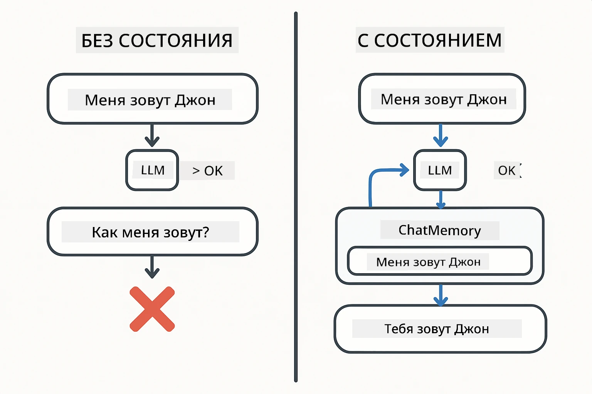
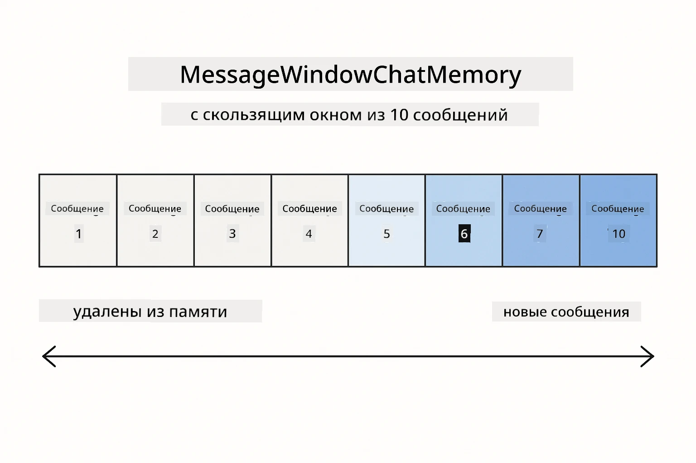
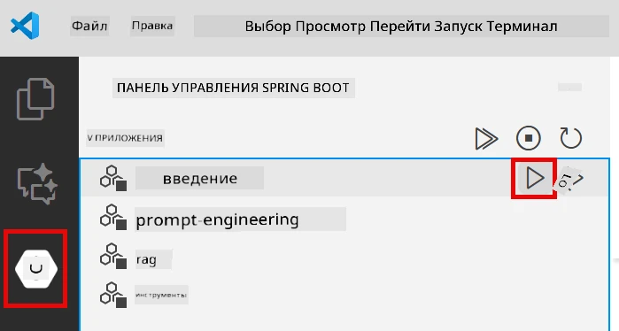
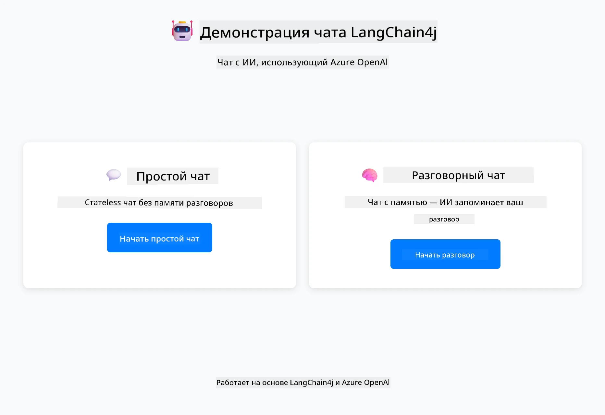
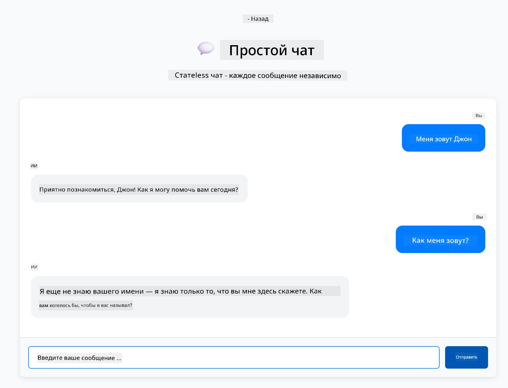
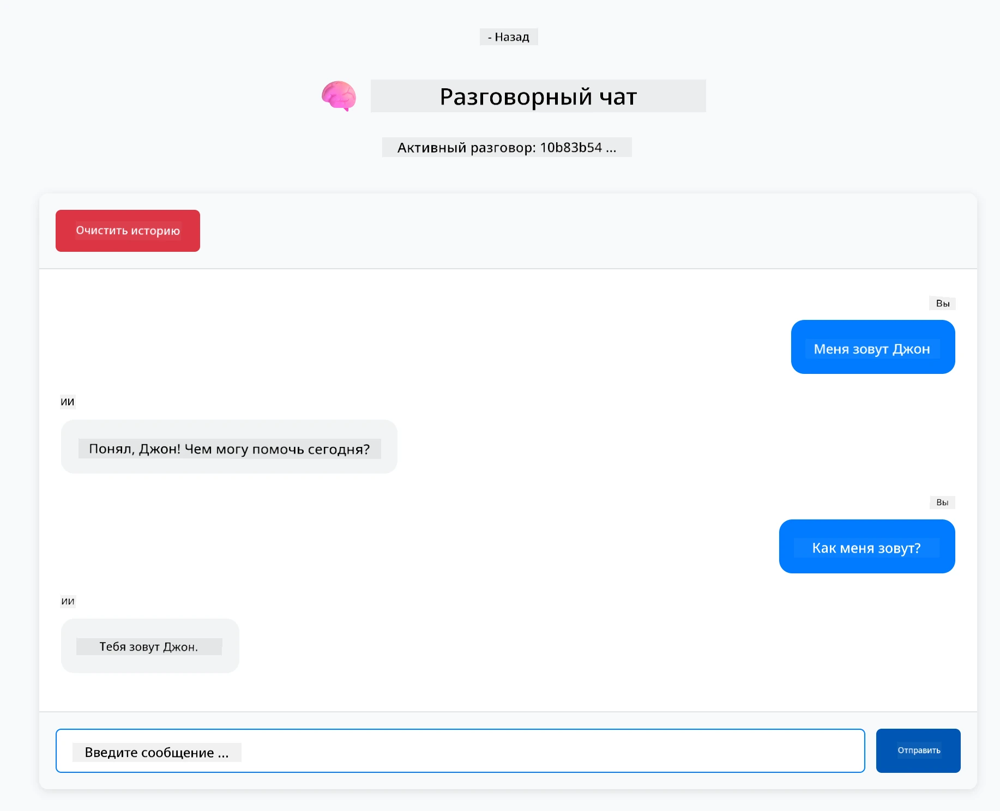

# Модуль 01: Начало работы с LangChain4j

## Содержание

- [Видеообзор](#видеообзор)
- [Чему вы научитесь](#чему-вы-научитесь)
- [Требования](#требования)
- [Понимание основной проблемы](#понимание-основной-проблемы)
- [Понимание токенов](#понимание-токенов)
- [Как работает память](#как-работает-память)
- [Как это использует LangChain4j](#как-это-использует-langchain4j)
- [Развертывание инфраструктуры Azure OpenAI](#развертывание-инфраструктуры-azure-openai)
- [Запуск приложения локально](#запуск-приложения-локально)
- [Использование приложения](#использование-приложения)
  - [Бессостояный чат (левая панель)](#бессостояный-чат-левая-панель)
  - [Состояный чат (правая панель)](#состояный-чат-правая-панель)
- [Следующие шаги](#следующие-шаги)

## Видеообзор

Смотрите эту живую сессию, которая объясняет, как начать работу с этим модулем:

<a href="https://www.youtube.com/live/nl_troDm8rQ?si=6b85S8xGjWnT2fX9"></a>

## Чему вы научитесь

Это ваша отправная точка с LangChain4j и Azure OpenAI. Мы начинаем с основ и приступаем к созданию приложений производственного уровня. Этот модуль сосредоточен на разговорном ИИ, который запоминает контекст и сохраняет состояние — базовых концепциях, на которых строятся все последующие модули.

Мы будем использовать GPT-5.2 от Azure OpenAI на протяжении всего руководства, поскольку его расширенные возможности рассуждения делают поведение различных паттернов более очевидным. Когда вы добавляете память, вы чётко увидите разницу. Это облегчает понимание того, что каждый компонент приносит вашему приложению.

Вы создадите одно приложение, демонстрирующее оба паттерна:

**Бессостояный чат** — каждый запрос независим. У модели нет памяти о предыдущих сообщениях. Это самый простой старт.

**Состояный разговор** — каждый запрос включает историю разговора. Модель поддерживает контекст в нескольких ходах. Это то, что требуется в производственных приложениях.

## Требования

- Подписка Azure с доступом к Azure OpenAI
- Java 21, Maven 3.9+
- Azure CLI (https://learn.microsoft.com/en-us/cli/azure/install-azure-cli)
- Azure Developer CLI (azd) (https://learn.microsoft.com/en-us/azure/developer/azure-developer-cli/install-azd)

> **Примечание:** Java, Maven, Azure CLI и Azure Developer CLI (azd) предустановлены в предоставленном devcontainer.

> **Примечание:** Этот модуль использует GPT-5.2 на Azure OpenAI. Развертывание настраивается автоматически через `azd up` — не изменяйте имя модели в коде.

## Понимание основной проблемы

Языковые модели — бессостояны. Каждый вызов API независим. Если вы отправите "Меня зовут Джон", а потом спросите "Как меня зовут?", модель не понимает, что вы только что представились. Она воспринимает каждый запрос, как первый разговор.

Это приемлемо для простых вопросов и ответов, но бесполезно для реальных приложений. Чат-боты поддержки клиентов должны запоминать, что вы им сказали. Личные помощники нуждаются в контексте. Любой многоходовой разговор требует памяти.

Следующая диаграмма показывает контраст двух подходов — слева бессостояный вызов, который забывает ваше имя; справа — состояный вызов с ChatMemory, который его запоминает.



*Разница между бессостояными (независимыми) и состояными (учитывающими контекст) разговорами*

## Понимание токенов

Прежде чем углубляться в разговоры, важно понять токены — базовые единицы текста, которые обрабатывают языковые модели:


*Пример того, как текст разбивается на токены — "Я люблю ИИ!" превращается в 4 отдельных единицы обработки*

Токены — это то, как модели ИИ измеряют и обрабатывают текст. Слово, пунктуация и даже пробелы могут быть токенами. У вашей модели есть ограничение на количество токенов, которые она может обрабатывать одновременно (400,000 для GPT-5.2, с максимум 272,000 входных токенов и 128,000 выходных). Понимание токенов помогает управлять длиной разговора и расходами.

## Как работает память

Память чата решает проблему бессостояния, сохраняя историю разговора. Перед отправкой вашего запроса модели, фреймворк подставляет релевантные предыдущие сообщения. Когда вы спрашиваете "Как меня зовут?", система фактически отправляет всю историю разговора, позволяя модели увидеть, что вы ранее сказали "Меня зовут Джон."

LangChain4j предоставляет реализации памяти, которые делают это автоматически. Вы выбираете, сколько сообщений хранить, а фреймворк управляет контекстным окном. На диаграмме ниже показано, как MessageWindowChatMemory поддерживает скользящее окно из последних сообщений.



*MessageWindowChatMemory поддерживает скользящее окно последних сообщений, автоматически удаляя старые*

## Как это использует LangChain4j

Этот модуль интегрирует Spring Boot и добавляет память разговора. Вот как компоненты связаны между собой:

**Зависимости** — добавьте две библиотеки LangChain4j:

```xml
<dependency>
    <groupId>dev.langchain4j</groupId>
    <artifactId>langchain4j</artifactId> <!-- Inherited from BOM in root pom.xml -->
</dependency>
<dependency>
    <groupId>dev.langchain4j</groupId>
    <artifactId>langchain4j-open-ai-official</artifactId> <!-- Inherited from BOM in root pom.xml -->
</dependency>
```

**Модель чата** — настройте Azure OpenAI как Spring bean ([LangChainConfig.java](../../../01-introduction/src/main/java/com/example/langchain4j/config/LangChainConfig.java)):

```java
@Bean
public OpenAiOfficialChatModel openAiOfficialChatModel() {
    return OpenAiOfficialChatModel.builder()
            .baseUrl(azureEndpoint)
            .apiKey(azureApiKey)
            .modelName(deploymentName)
            .timeout(Duration.ofMinutes(5))
            .maxRetries(3)
            .build();
}
```

Билдер читает учётные данные из переменных окружения, установленных `azd up`. Установка `baseUrl` на ваш Azure endpoint позволяет клиенту OpenAI работать с Azure OpenAI.

**Память разговора** — отслеживайте историю чата с MessageWindowChatMemory ([ConversationService.java](../../../01-introduction/src/main/java/com/example/langchain4j/service/ConversationService.java)):

```java
ChatMemory memory = MessageWindowChatMemory.withMaxMessages(10);

memory.add(UserMessage.from("My name is John"));
memory.add(AiMessage.from("Nice to meet you, John!"));

memory.add(UserMessage.from("What's my name?"));
AiMessage aiMessage = chatModel.chat(memory.messages()).aiMessage();
memory.add(aiMessage);
```

Создайте память с помощью `withMaxMessages(10)`, чтобы хранить последние 10 сообщений. Добавляйте сообщения пользователя и ИИ с помощью типизированных оболочек: `UserMessage.from(text)` и `AiMessage.from(text)`. Получайте историю с помощью `memory.messages()` и отправляйте её модели. Сервис хранит отдельные экземпляры памяти для каждого ID разговора, позволяя нескольким пользователям общаться одновременно.

> **🤖 Попробуйте с [GitHub Copilot](https://github.com/features/copilot) Chat:** Откройте [`ConversationService.java`](../../../01-introduction/src/main/java/com/example/langchain4j/service/ConversationService.java) и спросите:
> - "Как MessageWindowChatMemory решает, какие сообщения удалять, когда окно заполнено?"
> - "Могу ли я реализовать собственное хранилище памяти, используя базу данных вместо памяти в оперативной памяти?"
> - "Как бы я добавил суммирование для сжатия старой истории разговора?"

Точка доступа бессостояного чата полностью пропускает память — просто `chatModel.chat(prompt)`, как в быстром старте. Состояный endpoint добавляет сообщения в память, получает историю и включает этот контекст в каждый запрос. Конфигурация модели одинаковая, но разные паттерны.

## Развертывание инфраструктуры Azure OpenAI

**Bash:**
```bash
cd 01-introduction
azd up  # Выберите подписку и регион (рекомендуется eastus2)
```

**PowerShell:**
```powershell
cd 01-introduction
azd up  # Выберите подписку и местоположение (рекомендуется eastus2)
```

> **Примечание:** Если вы столкнулись с ошибкой таймаута (`RequestConflict: Cannot modify resource ... provisioning state is not terminal`), просто выполните `azd up` ещё раз. Ресурсы Azure могут ещё развертываться в фоне, и повторная попытка позволит завершить развертывание, когда ресурсы достигнут конечного состояния.

Это выполнит:
1. Развертывание ресурса Azure OpenAI с моделями GPT-5.2 и text-embedding-3-small
2. Автоматическую генерацию файла `.env` в корне проекта с учётными данными
3. Настройку всех необходимых переменных окружения

**Проблемы с развертыванием?** См. [README по инфраструктуре](infra/README.md) для подробного устранения неполадок, включая конфликты имени поддомена, ручные шаги развертывания в Azure Portal и рекомендации по настройке моделей.

**Проверка успешности развертывания:**

**Bash:**
```bash
cat ../.env  # Должен показывать AZURE_OPENAI_ENDPOINT, API_KEY и т.д.
```

**PowerShell:**
```powershell
Get-Content ..\.env  # Должен показать AZURE_OPENAI_ENDPOINT, API_KEY и т.д.
```

> **Примечание:** Команда `azd up` автоматически генерирует файл `.env`. Если потребуется обновить его позже, вы можете либо вручную отредактировать `.env`, либо пересоздать его, выполнив:
>
> **Bash:**
> ```bash
> cd ..
> bash .azd-env.sh
> ```
>
> **PowerShell:**
> ```powershell
> cd ..
> .\.azd-env.ps1
> ```

## Запуск приложения локально

**Проверьте развертывание:**

Убедитесь, что файл `.env` существует в корне с вашими учётными данными Azure. Выполните это из директории модуля (`01-introduction/`):

**Bash:**
```bash
cat ../.env  # Должен показывать AZURE_OPENAI_ENDPOINT, API_KEY, DEPLOYMENT
```

**PowerShell:**
```powershell
Get-Content ..\.env  # Должно показывать AZURE_OPENAI_ENDPOINT, API_KEY, DEPLOYMENT
```

**Запустите приложения:**

**Вариант 1: Использование Spring Boot Dashboard (рекомендуется для пользователей VS Code)**

Dev контейнер включает расширение Spring Boot Dashboard, которое предоставляет визуальный интерфейс для управления всеми приложениями Spring Boot. Вы найдете его в панели активности слева в VS Code (иконка Spring Boot).

Через Spring Boot Dashboard вы можете:
- Видеть все доступные приложения Spring Boot в рабочем пространстве
- Запускать/останавливать приложения одним кликом
- Просматривать логи приложений в реальном времени
- Мониторить статус приложений

Просто нажмите кнопку воспроизведения рядом с "introduction", чтобы запустить этот модуль, или запустите все модули сразу.



*Панель управления Spring Boot в VS Code — запуск, остановка и мониторинг всех модулей из одного места*

**Вариант 2: Использование shell скриптов**

Запустите все веб-приложения (модули 01-04):

**Bash:**
```bash
cd ..  # Из корневого каталога
./start-all.sh
```

**PowerShell:**
```powershell
cd ..  # Из корневого каталога
.\start-all.ps1
```

Или только этот модуль:

**Bash:**
```bash
cd 01-introduction
./start.sh
```

**PowerShell:**
```powershell
cd 01-introduction
.\start.ps1
```

Оба скрипта автоматически загружают переменные окружения из корневого файла `.env` и соберут JAR, если он отсутствует.

> **Примечание:** Если хотите собрать все модули вручную перед запуском:
>
> **Bash:**
> ```bash
> cd ..  # Go to root directory
> mvn clean package -DskipTests
> ```
>
> **PowerShell:**
> ```powershell
> cd ..  # Go to root directory
> mvn clean package -DskipTests
> ```

Откройте в браузере http://localhost:8080.

**Чтобы остановить:**

**Bash:**
```bash
./stop.sh  # Только этот модуль
# Или
cd .. && ./stop-all.sh  # Все модули
```

**PowerShell:**
```powershell
.\stop.ps1  # Только этот модуль
# Или
cd ..; .\stop-all.ps1  # Все модули
```

## Использование приложения

Приложение предоставляет веб-интерфейс с двумя реализациями чатов бок о бок.



*Панель выбора между Простым чатом (бессостояный) и Разговорным чатом (состояный)*

### Бессостояный чат (левая панель)

Попробуйте сначала здесь. Скажите "Меня зовут Джон", а затем сразу спросите "Как меня зовут?" Модель не запомнит, так как каждое сообщение независимо. Это демонстрирует основную проблему базовой интеграции языковой модели — отсутствие контекста разговора.



*ИИ не помнит ваше имя из предыдущего сообщения*

### Состояный чат (правая панель)

Теперь попробуйте ту же последовательность здесь. Скажите "Меня зовут Джон", затем "Как меня зовут?" На этот раз ИИ запомнит. Разница в MessageWindowChatMemory — он поддерживает историю разговора и включает её в каждый запрос. Вот как работает производственный разговорный ИИ.



*ИИ помнит ваше имя из начала разговора*

Обе панели используют одну и ту же модель GPT-5.2. Единственная разница — память. Это понятно показывает, что даёт память вашему приложению и почему она необходима для реальных случаев.

## Следующие шаги

**Следующий модуль:** [02-prompt-engineering - Создание подсказок с GPT-5.2](../02-prompt-engineering/README.md)

---

**Навигация:** [← Назад к Главной](../README.md) | [Вперёд: Модуль 02 - Создание подсказок →](../02-prompt-engineering/README.md)

---

<!-- CO-OP TRANSLATOR DISCLAIMER START -->
**Отказ от ответственности**:
Этот документ был переведен с использованием сервиса машинного перевода [Co-op Translator](https://github.com/Azure/co-op-translator). Несмотря на наши усилия по обеспечению точности, имейте в виду, что автоматический перевод может содержать ошибки или неточности. Оригинальный документ на его исходном языке следует считать авторитетным источником. Для получения критически важной информации рекомендуется обратиться к профессиональному человеческому переводу. Мы не несем ответственности за любые недоразумения или неправильные толкования, возникшие в результате использования этого перевода.
<!-- CO-OP TRANSLATOR DISCLAIMER END -->