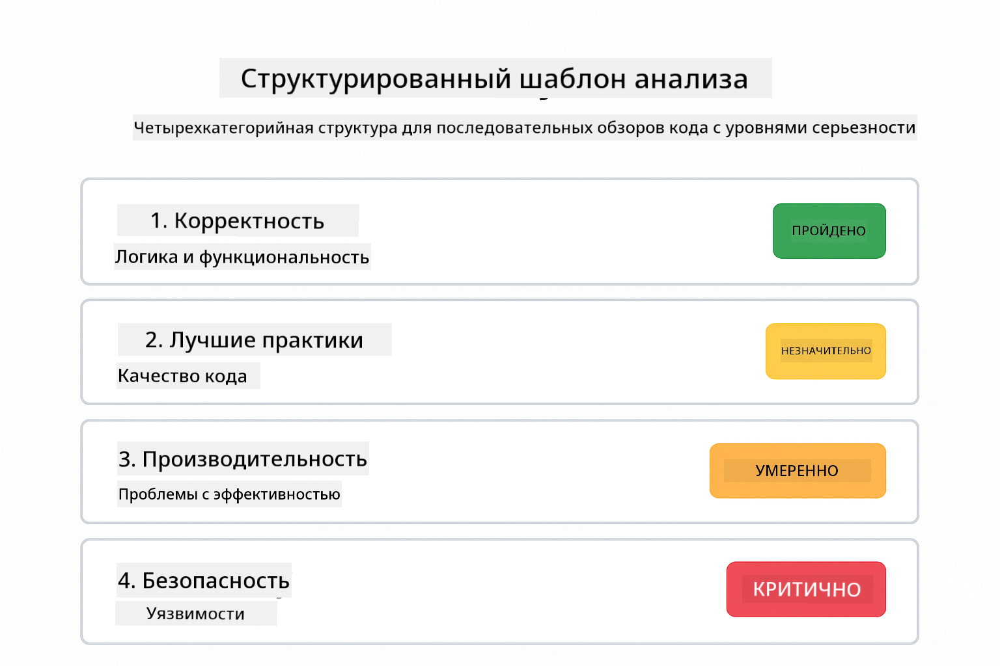
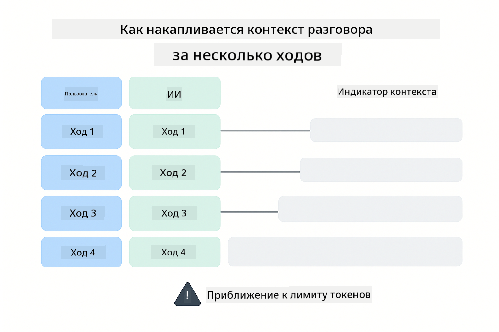
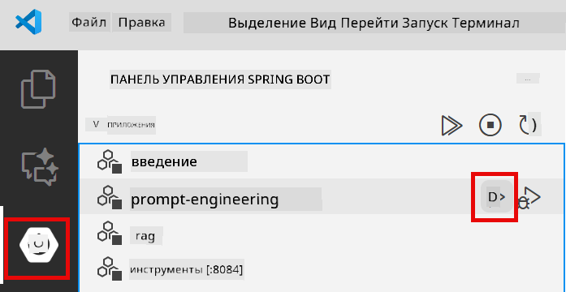
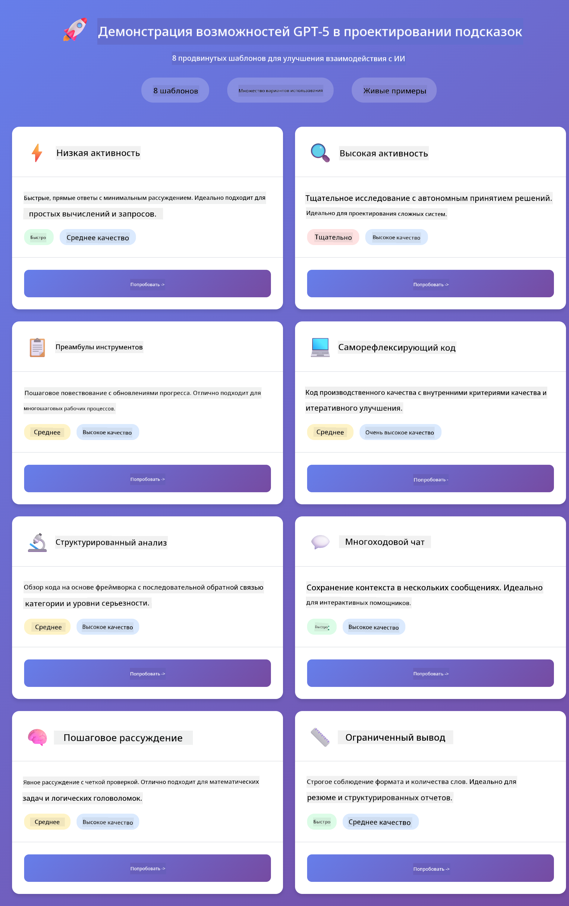
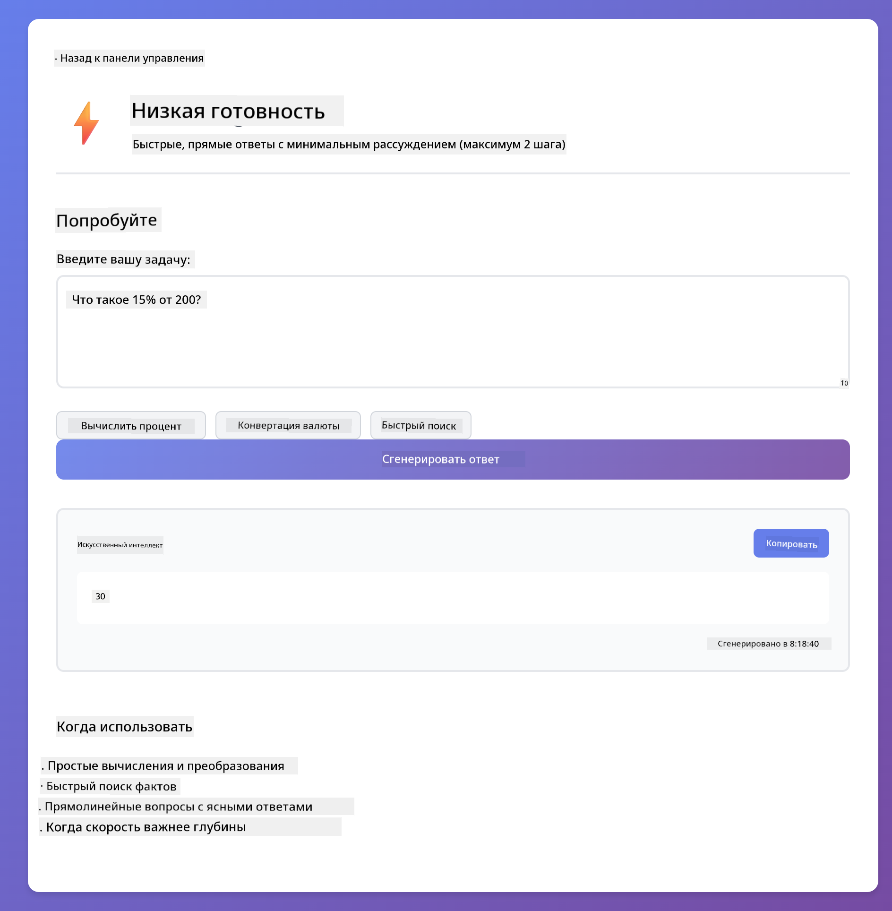
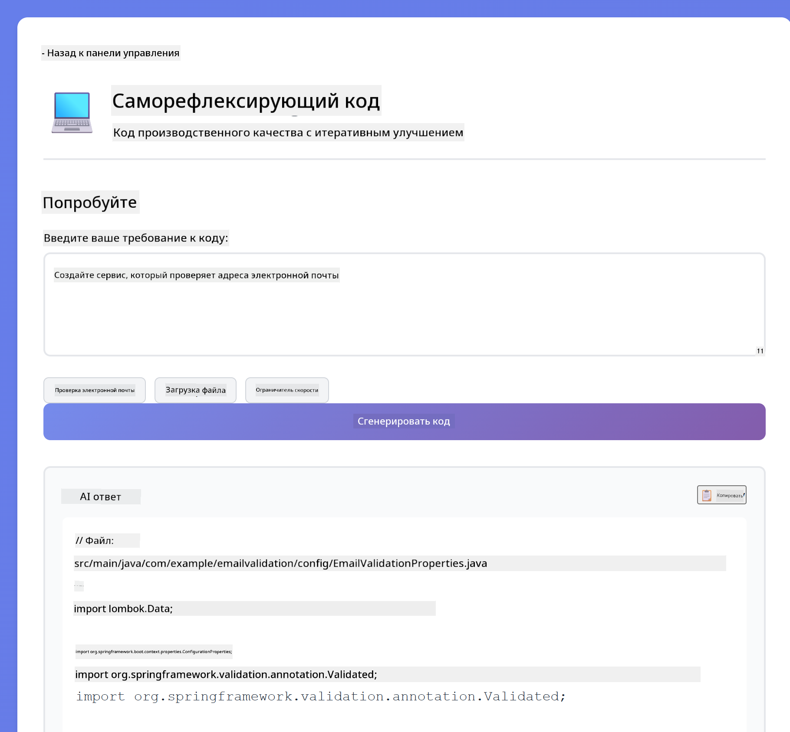
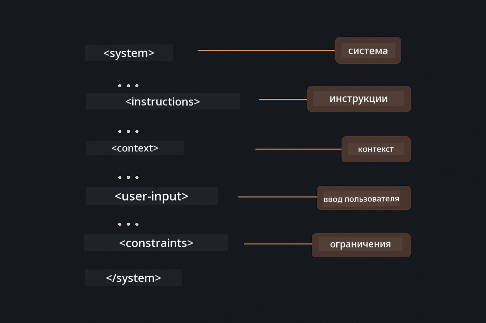

<!--
CO_OP_TRANSLATOR_METADATA:
{
  "original_hash": "8d787826cad7e92bf5cdbd116b1e6116",
  "translation_date": "2025-12-13T15:48:33+00:00",
  "source_file": "02-prompt-engineering/README.md",
  "language_code": "ru"
}
-->
# Модуль 02: Инжиниринг подсказок с GPT-5

## Содержание

- [Чему вы научитесь](../../../02-prompt-engineering)
- [Требования](../../../02-prompt-engineering)
- [Понимание инжиниринга подсказок](../../../02-prompt-engineering)
- [Как это использует LangChain4j](../../../02-prompt-engineering)
- [Основные шаблоны](../../../02-prompt-engineering)
- [Использование существующих ресурсов Azure](../../../02-prompt-engineering)
- [Скриншоты приложения](../../../02-prompt-engineering)
- [Изучение шаблонов](../../../02-prompt-engineering)
  - [Низкая и высокая готовность](../../../02-prompt-engineering)
  - [Выполнение задач (вступления к инструментам)](../../../02-prompt-engineering)
  - [Саморефлексирующий код](../../../02-prompt-engineering)
  - [Структурированный анализ](../../../02-prompt-engineering)
  - [Многоходовой чат](../../../02-prompt-engineering)
  - [Пошаговое рассуждение](../../../02-prompt-engineering)
  - [Ограниченный вывод](../../../02-prompt-engineering)
- [Что вы действительно изучаете](../../../02-prompt-engineering)
- [Следующие шаги](../../../02-prompt-engineering)

## Чему вы научитесь

В предыдущем модуле вы увидели, как память позволяет создавать разговорный ИИ, и использовали модели GitHub для базового взаимодействия. Теперь мы сосредоточимся на том, как вы задаёте вопросы — сами подсказки — используя GPT-5 от Azure OpenAI. То, как вы структурируете свои подсказки, существенно влияет на качество получаемых ответов.

Мы используем GPT-5, потому что он вводит контроль рассуждений — вы можете указать модели, сколько размышлений нужно сделать перед ответом. Это делает разные стратегии подсказок более очевидными и помогает понять, когда использовать каждый подход. Также мы получаем выгоду от меньших ограничений по скорости для GPT-5 в Azure по сравнению с моделями GitHub.

## Требования

- Завершён модуль 01 (развернуты ресурсы Azure OpenAI)
- Файл `.env` в корневой директории с учётными данными Azure (созданный командой `azd up` в модуле 01)

> **Примечание:** Если вы не завершили модуль 01, сначала следуйте инструкциям по развертыванию там.

## Понимание инжиниринга подсказок

Инжиниринг подсказок — это проектирование входного текста, который стабильно даёт нужные вам результаты. Это не просто задавать вопросы — это структурировать запросы так, чтобы модель точно понимала, чего вы хотите и как это предоставить.

Думайте об этом как о даче инструкций коллеге. «Исправь баг» — это расплывчато. «Исправь исключение null pointer в UserService.java на строке 45, добавив проверку на null» — конкретно. Языковые модели работают так же — важна конкретика и структура.

## Как это использует LangChain4j

Этот модуль демонстрирует продвинутые шаблоны подсказок, используя ту же основу LangChain4j из предыдущих модулей, с акцентом на структуру подсказок и контроль рассуждений.


*Как LangChain4j связывает ваши подсказки с Azure OpenAI GPT-5*

**Зависимости** — Модуль 02 использует следующие зависимости langchain4j, определённые в `pom.xml`:
```xml
<dependency>
    <groupId>dev.langchain4j</groupId>
    <artifactId>langchain4j</artifactId> <!-- Inherited from BOM in root pom.xml -->
</dependency>
<dependency>
    <groupId>dev.langchain4j</groupId>
    <artifactId>langchain4j-open-ai-official</artifactId> <!-- Inherited from BOM in root pom.xml -->
</dependency>
```

**Конфигурация OpenAiOfficialChatModel** — [LangChainConfig.java](../../../02-prompt-engineering/src/main/java/com/example/langchain4j/prompts/config/LangChainConfig.java)

Чат-модель вручную настраивается как Spring bean с использованием официального клиента OpenAI, который поддерживает конечные точки Azure OpenAI. Главное отличие от модуля 01 — как мы структурируем подсказки, отправляемые в `chatModel.chat()`, а не сама настройка модели.

**Системные и пользовательские сообщения** — [Gpt5PromptService.java](../../../02-prompt-engineering/src/main/java/com/example/langchain4j/prompts/service/Gpt5PromptService.java)

LangChain4j разделяет типы сообщений для ясности. `SystemMessage` задаёт поведение и контекст ИИ (например, «Вы — ревьюер кода»), а `UserMessage` содержит сам запрос. Такое разделение позволяет поддерживать постоянное поведение ИИ при разных пользовательских запросах.

```java
SystemMessage systemMsg = SystemMessage.from(
    "You are a helpful Java programming expert."
);

UserMessage userMsg = UserMessage.from(
    "Explain what a List is in Java"
);

String response = chatModel.chat(systemMsg, userMsg);
```


*SystemMessage обеспечивает постоянный контекст, а UserMessages содержат отдельные запросы*

**MessageWindowChatMemory для многоходового общения** — Для шаблона многоходового диалога мы повторно используем `MessageWindowChatMemory` из модуля 01. Каждая сессия получает собственный экземпляр памяти, хранящийся в `Map<String, ChatMemory>`, что позволяет вести несколько параллельных разговоров без смешивания контекста.

**Шаблоны подсказок** — Основное внимание здесь уделяется инжинирингу подсказок, а не новым API LangChain4j. Каждый шаблон (низкая готовность, высокая готовность, выполнение задач и т.д.) использует тот же метод `chatModel.chat(prompt)`, но с тщательно структурированными строками подсказок. XML-теги, инструкции и форматирование — всё это часть текста подсказки, а не функций LangChain4j.

**Контроль рассуждений** — Усилия по рассуждению GPT-5 контролируются через инструкции в подсказках, например «максимум 2 шага рассуждений» или «исследовать тщательно». Это техники инжиниринга подсказок, а не настройки LangChain4j. Библиотека просто передаёт ваши подсказки модели.

Главный вывод: LangChain4j предоставляет инфраструктуру (подключение модели через [LangChainConfig.java](../../../02-prompt-engineering/src/main/java/com/example/langchain4j/prompts/config/LangChainConfig.java), память, обработку сообщений через [Gpt5PromptService.java](../../../02-prompt-engineering/src/main/java/com/example/langchain4j/prompts/service/Gpt5PromptService.java)), а этот модуль учит вас создавать эффективные подсказки в рамках этой инфраструктуры.

## Основные шаблоны

Не все задачи требуют одинакового подхода. Одни вопросы требуют быстрых ответов, другие — глубокого анализа. Одни требуют видимых рассуждений, другие — просто результатов. Этот модуль охватывает восемь шаблонов подсказок — каждый оптимизирован для разных сценариев. Вы попробуете все, чтобы понять, когда какой подход работает лучше.


*Обзор восьми шаблонов инжиниринга подсказок и их случаев использования*


*Низкая готовность (быстро, прямо) против высокой готовности (тщательно, исследовательно) подходы к рассуждениям*

**Низкая готовность (быстро и сфокусировано)** — Для простых вопросов, когда нужны быстрые и прямые ответы. Модель делает минимальные рассуждения — максимум 2 шага. Используйте для вычислений, поисков или простых вопросов.

```java
String prompt = """
    <reasoning_effort>low</reasoning_effort>
    <instruction>maximum 2 reasoning steps</instruction>
    
    What is 15% of 200?
    """;

String response = chatModel.chat(prompt);
```

> 💡 **Исследуйте с GitHub Copilot:** Откройте [`Gpt5PromptService.java`](../../../02-prompt-engineering/src/main/java/com/example/langchain4j/prompts/service/Gpt5PromptService.java) и спросите:
> - «В чём разница между шаблонами подсказок с низкой и высокой готовностью?»
> - «Как XML-теги в подсказках помогают структурировать ответ ИИ?»
> - «Когда следует использовать шаблоны саморефлексии, а когда прямые инструкции?»

**Высокая готовность (глубоко и тщательно)** — Для сложных задач, когда нужен всесторонний анализ. Модель исследует тщательно и показывает подробные рассуждения. Используйте для проектирования систем, архитектурных решений или сложных исследований.

```java
String prompt = """
    <reasoning_effort>high</reasoning_effort>
    <instruction>explore thoroughly, show detailed reasoning</instruction>
    
    Design a caching strategy for a high-traffic REST API.
    """;

String response = chatModel.chat(prompt);
```

**Выполнение задач (пошаговый прогресс)** — Для многошаговых рабочих процессов. Модель предоставляет план заранее, рассказывает о каждом шаге в процессе, затем даёт итог. Используйте для миграций, внедрений или любых многошаговых процессов.

```java
String prompt = """
    <task>Create a REST endpoint for user registration</task>
    <preamble>Provide an upfront plan</preamble>
    <narration>Narrate each step as you work</narration>
    <summary>Summarize what was accomplished</summary>
    """;

String response = chatModel.chat(prompt);
```

Подсказки Chain-of-Thought явно просят модель показать процесс рассуждений, что повышает точность для сложных задач. Пошаговое разбиение помогает и людям, и ИИ понять логику.

> **🤖 Попробуйте с [GitHub Copilot](https://github.com/features/copilot) Chat:** Спросите об этом шаблоне:
> - «Как адаптировать шаблон выполнения задач для долгих операций?»
> - «Какие лучшие практики для структурирования вступлений к инструментам в продакшн-приложениях?»
> - «Как захватывать и отображать промежуточные обновления прогресса в UI?»


*План → Выполнение → Итог для многошаговых задач*

**Саморефлексирующий код** — Для генерации кода производственного качества. Модель генерирует код, проверяет его по критериям качества и итеративно улучшает. Используйте при создании новых функций или сервисов.

```java
String prompt = """
    <task>Create an email validation service</task>
    <quality_criteria>
    - Correct logic and error handling
    - Best practices (clean code, proper naming)
    - Performance optimization
    - Security considerations
    </quality_criteria>
    <instruction>Generate code, evaluate against criteria, improve iteratively</instruction>
    """;

String response = chatModel.chat(prompt);
```


*Цикл итеративного улучшения — генерировать, оценивать, выявлять проблемы, улучшать, повторять*

**Структурированный анализ** — Для последовательной оценки. Модель проверяет код по фиксированной схеме (корректность, практики, производительность, безопасность). Используйте для ревью кода или оценки качества.

```java
String prompt = """
    <code>
    public List getUsers() {
        return database.query("SELECT * FROM users");
    }
    </code>
    
    <framework>
    Evaluate using these categories:
    1. Correctness - Logic and functionality
    2. Best Practices - Code quality
    3. Performance - Efficiency concerns
    4. Security - Vulnerabilities
    </framework>
    """;

String response = chatModel.chat(prompt);
```

> **🤖 Попробуйте с [GitHub Copilot](https://github.com/features/copilot) Chat:** Спросите о структурированном анализе:
> - «Как настроить схему анализа для разных типов ревью кода?»
> - «Как лучше всего парсить и программно обрабатывать структурированный вывод?»
> - «Как обеспечить согласованность уровней серьёзности в разных сессиях ревью?»



*Четырёхкатегорийная схема для последовательных ревью кода с уровнями серьёзности*

**Многоходовой чат** — Для разговоров, требующих контекста. Модель запоминает предыдущие сообщения и строит на их основе. Используйте для интерактивной помощи или сложных вопросов и ответов.

```java
ChatMemory memory = MessageWindowChatMemory.withMaxMessages(10);

memory.add(UserMessage.from("What is Spring Boot?"));
AiMessage aiMessage1 = chatModel.chat(memory.messages()).aiMessage();
memory.add(aiMessage1);

memory.add(UserMessage.from("Show me an example"));
AiMessage aiMessage2 = chatModel.chat(memory.messages()).aiMessage();
memory.add(aiMessage2);
```



*Как контекст разговора накапливается за несколько ходов до достижения лимита токенов*

**Пошаговое рассуждение** — Для задач, требующих видимой логики. Модель показывает явные рассуждения на каждом шаге. Используйте для математических задач, логических головоломок или когда нужно понять ход мыслей.

```java
String prompt = """
    <instruction>Show your reasoning step-by-step</instruction>
    
    If a train travels 120 km in 2 hours, then stops for 30 minutes,
    then travels another 90 km in 1.5 hours, what is the average speed
    for the entire journey including the stop?
    """;

String response = chatModel.chat(prompt);
```


*Разбиение задач на явные логические шаги*

**Ограниченный вывод** — Для ответов с конкретными требованиями к формату. Модель строго соблюдает правила формата и длины. Используйте для резюме или когда нужен точный формат вывода.

```java
String prompt = """
    <constraints>
    - Exactly 100 words
    - Bullet point format
    - Technical terms only
    </constraints>
    
    Summarize the key concepts of machine learning.
    """;

String response = chatModel.chat(prompt);
```


*Обеспечение конкретных требований к формату, длине и структуре*

## Использование существующих ресурсов Azure

**Проверьте развертывание:**

Убедитесь, что файл `.env` существует в корневой директории с учётными данными Azure (созданный в модуле 01):
```bash
cat ../.env  # Должен показывать AZURE_OPENAI_ENDPOINT, API_KEY, DEPLOYMENT
```

**Запустите приложение:**

> **Примечание:** Если вы уже запускали все приложения с помощью `./start-all.sh` из модуля 01, этот модуль уже работает на порту 8083. Вы можете пропустить команды запуска ниже и перейти напрямую по адресу http://localhost:8083.

**Вариант 1: Использование Spring Boot Dashboard (рекомендуется для пользователей VS Code)**

В dev-контейнере есть расширение Spring Boot Dashboard, которое предоставляет визуальный интерфейс для управления всеми приложениями Spring Boot. Вы найдёте его на панели активности слева в VS Code (значок Spring Boot).

Через Spring Boot Dashboard вы можете:
- Видеть все доступные приложения Spring Boot в рабочем пространстве
- Запускать/останавливать приложения одним кликом
- Просматривать логи приложений в реальном времени
- Отслеживать статус приложений

Просто нажмите кнопку запуска рядом с «prompt-engineering», чтобы запустить этот модуль, или запустите все модули сразу.



**Вариант 2: Использование shell-скриптов**

Запустите все веб-приложения (модули 01-04):

**Bash:**
```bash
cd ..  # Из корневого каталога
./start-all.sh
```

**PowerShell:**
```powershell
cd ..  # Из корневого каталога
.\start-all.ps1
```

Или запустите только этот модуль:

**Bash:**
```bash
cd 02-prompt-engineering
./start.sh
```

**PowerShell:**
```powershell
cd 02-prompt-engineering
.\start.ps1
```

Оба скрипта автоматически загружают переменные окружения из корневого файла `.env` и соберут JAR-файлы, если их нет.

> **Примечание:** Если вы предпочитаете собирать все модули вручную перед запуском:
>
> **Bash:**
> ```bash
> cd ..  # Go to root directory
> mvn clean package -DskipTests
> ```
>
> **PowerShell:**
> ```powershell
> cd ..  # Go to root directory
> mvn clean package -DskipTests
> ```

Откройте http://localhost:8083 в браузере.

**Для остановки:**

**Bash:**
```bash
./stop.sh  # Только этот модуль
# Или
cd .. && ./stop-all.sh  # Все модули
```

**PowerShell:**
```powershell
.\stop.ps1  # Только этот модуль
# Или
cd ..; .\stop-all.ps1  # Все модули
```

## Скриншоты приложения



*Главная панель с отображением всех 8 шаблонов инжиниринга подсказок с их характеристиками и случаями использования*

## Изучение шаблонов

Веб-интерфейс позволяет экспериментировать с разными стратегиями подсказок. Каждый шаблон решает разные задачи — попробуйте их, чтобы увидеть, когда какой подход лучше всего работает.

### Низкая и высокая готовность

Задайте простой вопрос, например «Сколько будет 15% от 200?» с использованием Низкой готовности. Вы получите мгновенный, прямой ответ. Теперь задайте что-то сложное, например «Разработай стратегию кэширования для высоконагруженного API» с использованием Высокой готовности. Посмотрите, как модель замедляется и даёт подробные рассуждения. Та же модель, та же структура вопроса — но подсказка указывает, сколько размышлять.


*Быстрый расчет с минимальным рассуждением*


*Всеобъемлющая стратегия кэширования (2.8MB)*

### Выполнение задачи (Вступления к инструментам)

Многошаговые рабочие процессы выигрывают от предварительного планирования и повествования о ходе выполнения. Модель описывает, что она будет делать, рассказывает о каждом шаге, затем подводит итоги.


*Создание REST-эндпоинта с пошаговым повествованием (3.9MB)*

### Саморефлексирующий код

Попробуйте "Создать сервис проверки электронной почты". Вместо простого генерации кода и остановки, модель генерирует, оценивает по критериям качества, выявляет слабые места и улучшает. Вы увидите, как она итеративно дорабатывает код до производственного уровня.



*Полноценный сервис проверки электронной почты (5.2MB)*

### Структурированный анализ

Код-ревью требуют последовательных рамок оценки. Модель анализирует код по фиксированным категориям (корректность, практики, производительность, безопасность) с уровнями серьезности.


*Код-ревью на основе фреймворка*

### Многошаговый чат

Спросите "Что такое Spring Boot?", а затем сразу "Покажи пример". Модель помнит ваш первый вопрос и дает именно пример Spring Boot. Без памяти второй вопрос был бы слишком расплывчатым.


*Сохранение контекста между вопросами*

### Пошаговое рассуждение

Выберите математическую задачу и попробуйте решить ее с помощью Пошагового рассуждения и Низкого рвения. Низкое рвение просто дает ответ — быстро, но непрозрачно. Пошаговое рассуждение показывает каждый расчет и решение.


*Математическая задача с явными шагами*

### Ограниченный вывод

Когда нужны конкретные форматы или количество слов, этот шаблон обеспечивает строгое соблюдение. Попробуйте сгенерировать резюме ровно из 100 слов в формате списка.


*Резюме по машинному обучению с контролем формата*

## Чему вы действительно учитесь

**Усилия в рассуждении меняют всё**

GPT-5 позволяет контролировать вычислительные усилия через ваши подсказки. Низкие усилия означают быстрые ответы с минимальным исследованием. Высокие усилия — модель тратит время на глубокое обдумывание. Вы учитесь подбирать усилия под сложность задачи — не тратьте время на простые вопросы, но и не спешите с сложными решениями.

**Структура направляет поведение**

Заметили XML-теги в подсказках? Это не украшение. Модели надежнее следуют структурированным инструкциям, чем свободному тексту. Когда нужны многошаговые процессы или сложная логика, структура помогает модели отслеживать, где она находится и что дальше.



*Анатомия хорошо структурированной подсказки с четкими разделами и организацией в стиле XML*

**Качество через самооценку**

Шаблоны саморефлексии работают, делая критерии качества явными. Вместо надежды, что модель "сделает правильно", вы точно указываете, что значит "правильно": корректная логика, обработка ошибок, производительность, безопасность. Модель может оценить свой вывод и улучшить его. Это превращает генерацию кода из лотереи в процесс.

**Контекст ограничен**

Многошаговые разговоры работают, включая историю сообщений в каждый запрос. Но есть предел — у каждой модели максимальное количество токенов. По мере роста разговоров нужны стратегии, чтобы сохранять релевантный контекст, не превышая лимит. Этот модуль показывает, как работает память; позже вы научитесь, когда суммировать, когда забывать и когда извлекать.

## Следующие шаги

**Следующий модуль:** [03-rag - RAG (генерация с расширенным поиском)](../03-rag/README.md)

---

**Навигация:** [← Предыдущий: Модуль 01 - Введение](../01-introduction/README.md) | [Назад к главной](../README.md) | [Следующий: Модуль 03 - RAG →](../03-rag/README.md)

---

<!-- CO-OP TRANSLATOR DISCLAIMER START -->
**Отказ от ответственности**:  
Этот документ был переведен с помощью сервиса автоматического перевода [Co-op Translator](https://github.com/Azure/co-op-translator). Несмотря на наши усилия по обеспечению точности, имейте в виду, что автоматический перевод может содержать ошибки или неточности. Оригинальный документ на его исходном языке следует считать авторитетным источником. Для получения критически важной информации рекомендуется использовать профессиональный перевод, выполненный человеком. Мы не несем ответственности за любые недоразумения или неправильные толкования, возникшие в результате использования данного перевода.
<!-- CO-OP TRANSLATOR DISCLAIMER END -->