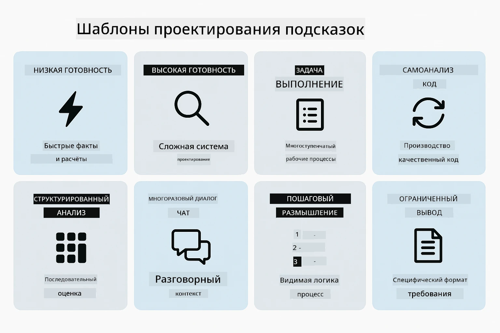
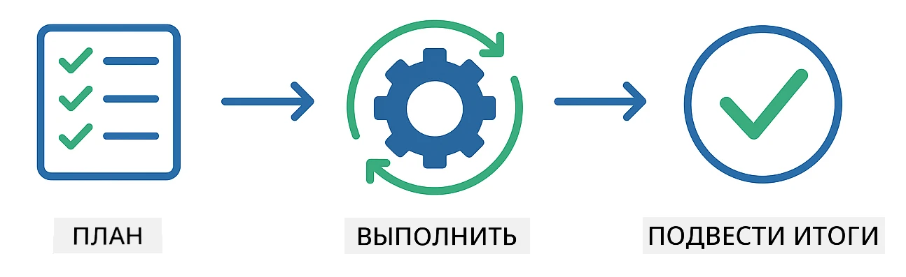
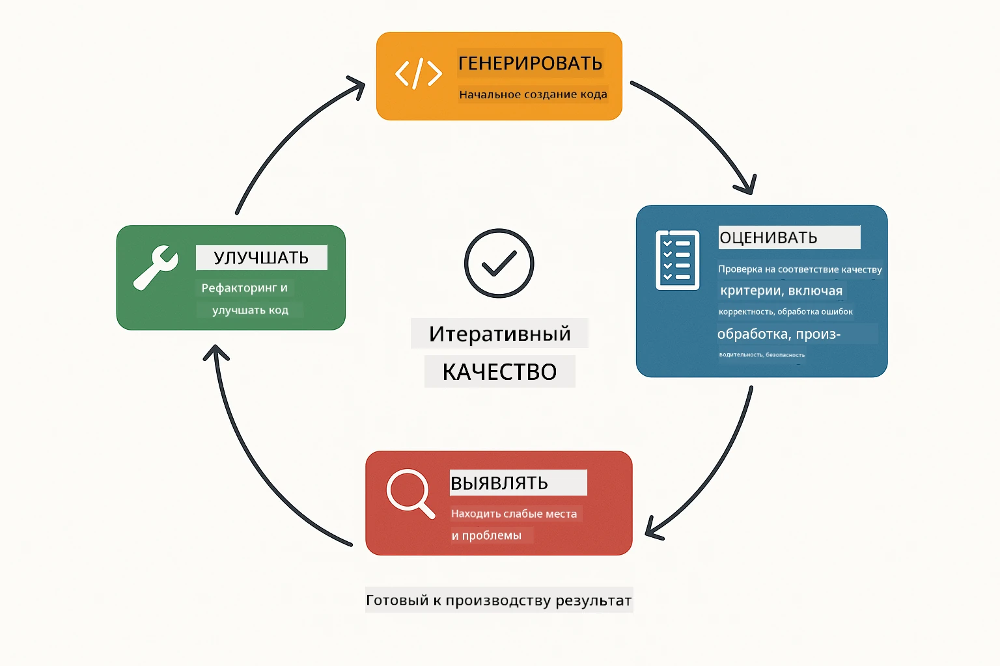
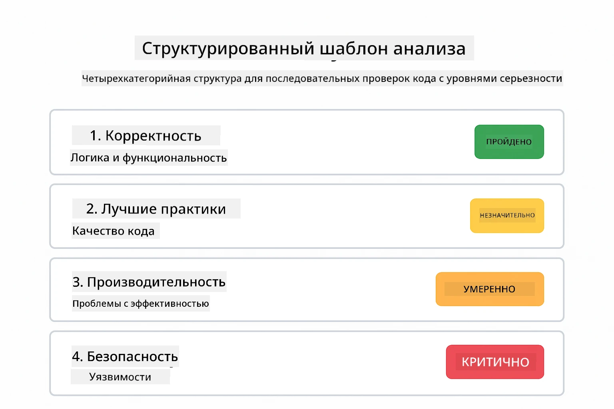
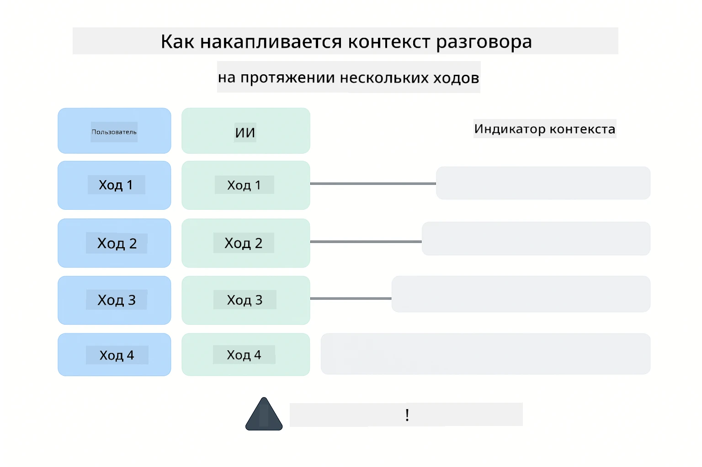
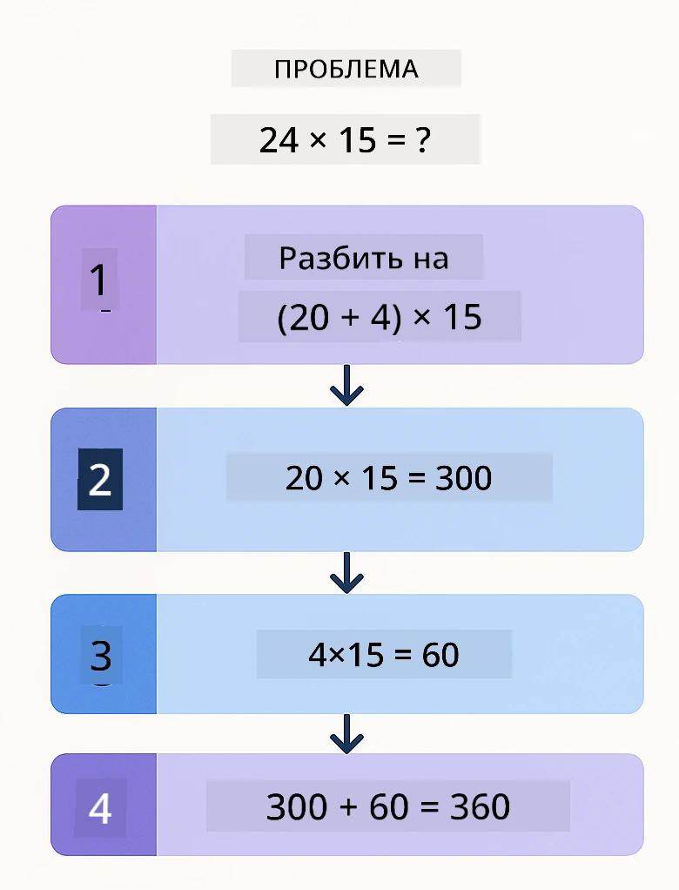
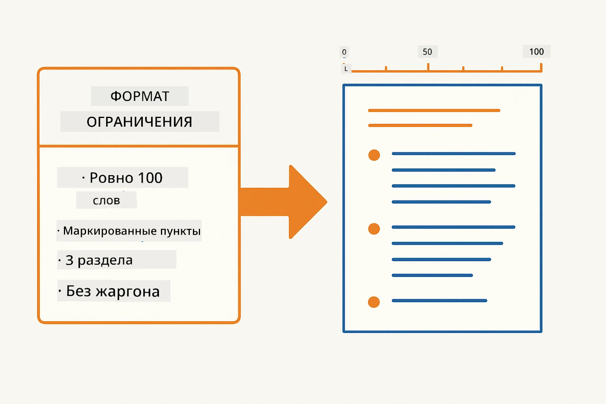
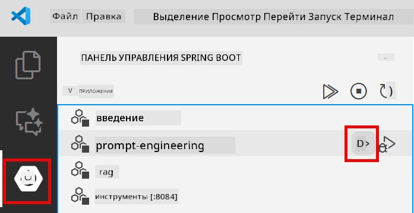
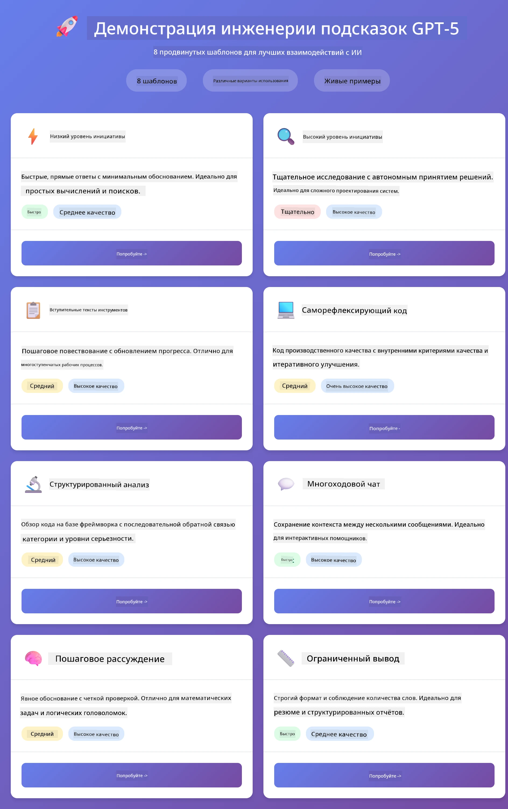
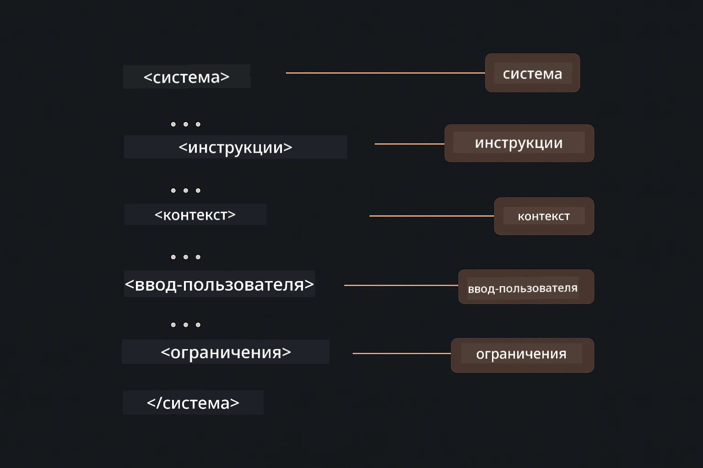

# Модуль 02: Проектирование подсказок с GPT-5.2

## Оглавление

- [Пошаговое видео](#пошаговое-видео)
- [Чему вы научитесь](#чему-вы-научитесь)
- [Требования](#требования)
- [Понимание проектирования подсказок](#понимание-проектирования-подсказок)
- [Основы проектирования подсказок](#основы-проектирования-подсказок)
  - [Подсказки без примеров (Zero-Shot)](#подсказки-без-примеров-zero-shot)
  - [Подсказки с примерами (Few-Shot)](#подсказки-с-примерами-few-shot)
  - [Цепочка рассуждений](#цепочка-рассуждений)
  - [Ролевая формулировка](#ролевая-формулировка)
  - [Шаблоны подсказок](#шаблоны-подсказок)
- [Продвинутые паттерны](#продвинутые-паттерны)
- [Запуск приложения](#запуск-приложения)
- [Скриншоты приложения](#скриншоты-приложения)
- [Изучение паттернов](#изучение-шаблонов)
  - [Низкая и высокая активность](#низкая-vs-высокая-активность-мышления)
  - [Выполнение задач (Вводные тексты для инструментов)](#выполнение-задач-инструкции-по-инструментам)
  - [Саморефлектирующий код](#саморефлексирующий-код)
  - [Структурированный анализ](#структурированный-анализ)
  - [Многоходовой чат](#многошаговый-чат)
  - [Пошаговые рассуждения](#поэтапное-рассуждение)
  - [Ограниченный вывод](#ограниченный-вывод)
- [Чему вы действительно учитесь](#чему-вы-на-самом-деле-учитесь)
- [Следующие шаги](#следующие-шаги)

## Пошаговое видео

Посмотрите эту сессию вживую, где объясняется, как начать работу с этим модулем:

<a href="https://www.youtube.com/live/PJ6aBaE6bog?si=LDshyBrTRodP-wke"></a>

## Чему вы научитесь

Следующая диаграмма предоставляет обзор ключевых тем и навыков, которые вы освоите в этом модуле — от методов уточнения подсказок до пошагового рабочего процесса, который вы будете использовать.


В предыдущем модуле вы узнали, как память обеспечивает диалоговый ИИ на базе Azure OpenAI. Теперь мы сосредоточимся на том, как задавать вопросы — то есть на самих подсказках — используя GPT-5.2 от Azure OpenAI. То, как вы структурируете подсказки, существенно влияет на качество получаемых ответов. Начнем с обзора основных техник создания подсказок, а затем перейдем к восьми продвинутым паттернам, которые полностью используют возможности GPT-5.2.

Мы используем GPT-5.2, потому что он вводит управление рассуждениями — вы можете указать модели, сколько размышлять перед ответом. Это делает стратегии подсказок более очевидными и помогает понять, когда применять каждый из подходов.

## Требования

- Завершенный Модуль 01 (развернуты ресурсы Azure OpenAI)
- Файл `.env` в корневой директории с учетными данными Azure (созданный с помощью `azd up` в Модуле 01)

> **Примечание:** Если вы не завершили Модуль 01, сначала следуйте инструкциям по развертыванию в нем.

## Понимание проектирования подсказок

В основе проектирования подсказок лежит разница между расплывчатыми и точными инструкциями, что иллюстрирует приведенное ниже сравнение.


Проектирование подсказок — это разработка входного текста, который последовательно дает нужные вам результаты. Это не просто вопросы — это структурирование запросов так, чтобы модель точно понимала, чего вы хотите и как это предоставить.

Представьте, что вы даете инструкции коллеге. «Исправь ошибку» — это расплывчато. «Исправь ошибку null pointer exception в UserService.java на строке 45, добавив проверку на null» — конкретно. Языковые модели работают так же — важна точность и структура.

Следующая диаграмма показывает, как LangChain4j вписывается в эту картину — связывая ваши шаблоны подсказок с моделью через строительные блоки SystemMessage и UserMessage.


LangChain4j предоставляет инфраструктуру — подключения к моделям, память и типы сообщений — а паттерны подсказок — это просто тщательно структурированный текст, который вы отправляете через эту инфраструктуру. Ключевые строительные блоки — это `SystemMessage` (которое задает поведение ИИ и роль) и `UserMessage` (которое несет ваш реальный запрос).

## Основы проектирования подсказок

Пять основных техник, показанных ниже, формируют основу эффективного проектирования подсказок. Каждая из них решает разные аспекты вашего взаимодействия с языковыми моделями.


Прежде чем перейти к продвинутым паттернам этого модуля, давайте вспомним пять основных техник создания подсказок. Это базовые строительные блоки, которые должен знать каждый разработчик подсказок.

### Подсказки без примеров (Zero-Shot)

Самый простой подход: дать модели прямую инструкцию без примеров. Модель полностью опирается на свое обучение, чтобы понять и выполнить задачу. Хорошо работает для простых запросов, где ожидаемое поведение очевидно.


*Прямая инструкция без примеров — модель выводит задачу только по инструкции*

```java
String prompt = "Classify this sentiment: 'I absolutely loved the movie!'";
String response = model.chat(prompt);
// Ответ: "Положительно"
```
  
**Когда использовать:** Простая классификация, прямые вопросы, переводы или любые задачи, которые модель может выполнить без дополнительного руководства.

### Подсказки с примерами (Few-Shot)

Предоставьте примеры, которые демонстрируют паттерн, который модель должна повторять. Модель учится формату ввода-вывода по вашим примерам и применяет его к новым входным данным. Это значительно повышает согласованность для задач, где желаемый формат или поведение не очевидны.


*Обучение на примерах — модель распознает паттерн и применяет его к новым данным*

```java
String prompt = """
    Classify the sentiment as positive, negative, or neutral.
    
    Examples:
    Text: "This product exceeded my expectations!" → Positive
    Text: "It's okay, nothing special." → Neutral
    Text: "Waste of money, very disappointed." → Negative
    
    Now classify this:
    Text: "Best purchase I've made all year!"
    """;
String response = model.chat(prompt);
```
  
**Когда использовать:** Пользовательская классификация, согласованное форматирование, задачи в конкретной области или когда результаты zero-shot нестабильны.

### Цепочка рассуждений

Попросите модель показать свои рассуждения шаг за шагом. Вместо прямого ответа модель разлагает проблему и последовательно рассматривает каждый шаг. Это повышает точность при решении задач по математике, логике и многозадачному рассуждению.


*Пошаговое рассуждение — разбиение сложных задач на явные логические шаги*

```java
String prompt = """
    Problem: A store has 15 apples. They sell 8 apples and then 
    receive a shipment of 12 more apples. How many apples do they have now?
    
    Let's solve this step-by-step:
    """;
String response = model.chat(prompt);
// Модель показывает: 15 - 8 = 7, затем 7 + 12 = 19 яблок
```
  
**Когда использовать:** Математические задачи, логические головоломки, отладка или любые задачи, где показ процесса рассуждений повышает точность и доверие.

### Ролевая формулировка

Задайте персонаж или роль ИИ перед тем, как спросить. Это создает контекст, влияющий на тон, глубину и акцент ответа. «Архитектор ПО» даст другие советы, чем «младший разработчик» или «аудитор безопасности».


*Задание контекста и роли — один и тот же вопрос получает разные ответы в зависимости от роли*

```java
String prompt = """
    You are an experienced software architect reviewing code.
    Provide a brief code review for this function:
    
    def calculate_total(items):
        total = 0
        for item in items:
            total = total + item['price']
        return total
    """;
String response = model.chat(prompt);
```
  
**Когда использовать:** Ревью кода, обучение, анализ по конкретной области или когда нужны ответы, адаптированные под уровень экспертизы или точку зрения.

### Шаблоны подсказок

Создавайте повторно используемые подсказки с переменными-заполнителями. Вместо написания новой подсказки каждый раз, определите шаблон один раз и подставляйте разные значения. Класс `PromptTemplate` LangChain4j облегчает это с помощью синтаксиса `{{variable}}`.


*Повторно используемые подсказки с переменными — один шаблон, много применений*

```java
PromptTemplate template = PromptTemplate.from(
    "What's the best time to visit {{destination}} for {{activity}}?"
);

Prompt prompt = template.apply(Map.of(
    "destination", "Paris",
    "activity", "sightseeing"
));

String response = model.chat(prompt.text());
```
  
**Когда использовать:** Повторяющиеся запросы с разными входными данными, пакетная обработка, создание повторно используемых AI-рабочих процессов или в любом сценарии, где структура подсказки остается неизменной, а данные меняются.

---

Эти пять основ обеспечивают вас надежным набором инструментов для большинства задач проектирования подсказок. Остальная часть этого модуля строится на них с помощью **восьми продвинутых паттернов**, которые используют управление рассуждениями, самооценку и возможности структурированного вывода GPT-5.2.

## Продвинутые паттерны

После базовых техник перейдем к восьми продвинутым паттернам, которые делают этот модуль уникальным. Не все задачи требуют одного и того же подхода. Некоторые вопросы требуют быстрых ответов, другие — глубокого осмысления. Некоторые требуют видимых рассуждений, другие — лишь результатов. Каждый паттерн оптимизирован под разные сценарии — а управление рассуждениями GPT-5.2 делает эти различия еще более очевидными.



*Обзор восьми паттернов проектирования подсказок и их случаев использования*

GPT-5.2 добавляет другое измерение этим паттернам: *управление рассуждениями*. Ползунок ниже показывает, как вы можете регулировать усилия мышления модели — от быстрых, прямых ответов до глубокого, тщательного анализа.


*Управление рассуждениями GPT-5.2 позволяет указать, сколько размышлений должна делать модель — от быстрых прямых ответов до глубокого анализа*

**Низкая активность (Быстро и по существу)** — для простых вопросов, где нужны быстрые прямые ответы. Модель делает минимум рассуждений — максимум 2 шага. Используйте для расчетов, запросов к справочнику или простых вопросов.

```java
String prompt = """
    <context_gathering>
    - Search depth: very low
    - Bias strongly towards providing a correct answer as quickly as possible
    - Usually, this means an absolute maximum of 2 reasoning steps
    - If you think you need more time, state what you know and what's uncertain
    </context_gathering>
    
    Problem: What is 15% of 200?
    
    Provide your answer:
    """;

String response = chatModel.chat(prompt);
```
  
> 💡 **Используйте вместе с GitHub Copilot:** Откройте [`Gpt5PromptService.java`](../../../02-prompt-engineering/src/main/java/com/example/langchain4j/prompts/service/Gpt5PromptService.java) и спросите:  
> - «В чем разница между паттернами подсказок с низкой и высокой активностью?»  
> - «Как XML-теги в подсказках помогают структурировать ответ ИИ?»  
> - «Когда лучше использовать паттерны саморефлексии, а когда прямые инструкции?»

**Высокая активность (Глубоко и тщательно)** — для сложных проблем, требующих детального анализа. Модель исследует вопрос глубоко и показывает подробные рассуждения. Используйте для системного проектирования, архитектурных решений или комплексных исследований.

```java
String prompt = """
    Analyze this problem thoroughly and provide a comprehensive solution.
    Consider multiple approaches, trade-offs, and important details.
    Show your analysis and reasoning in your response.
    
    Problem: Design a caching strategy for a high-traffic REST API.
    """;

String response = chatModel.chat(prompt);
```
  
**Выполнение задачи (Пошаговый прогресс)** — для многоэтапных рабочих процессов. Модель сразу дает план, комментирует каждый шаг выполнения, затем подытоживает. Используйте для миграций, реализации или любого многошагового процесса.

```java
String prompt = """
    <task_execution>
    1. First, briefly restate the user's goal in a friendly way
    
    2. Create a step-by-step plan:
       - List all steps needed
       - Identify potential challenges
       - Outline success criteria
    
    3. Execute each step:
       - Narrate what you're doing
       - Show progress clearly
       - Handle any issues that arise
    
    4. Summarize:
       - What was completed
       - Any important notes
       - Next steps if applicable
    </task_execution>
    
    <tool_preambles>
    - Always begin by rephrasing the user's goal clearly
    - Outline your plan before executing
    - Narrate each step as you go
    - Finish with a distinct summary
    </tool_preambles>
    
    Task: Create a REST endpoint for user registration
    
    Begin execution:
    """;

String response = chatModel.chat(prompt);
```
  
Подсказки с цепочкой рассуждений явно просят модель показать процесс мышления, повышая точность для сложных задач. Пошаговое разбиение помогает и людям, и ИИ понять логику.

> **🤖 Попробуйте в чате [GitHub Copilot](https://github.com/features/copilot):** Спросите про этот паттерн:  
> - «Как адаптировать паттерн выполнения задач для длительных операций?»  
> - «Какие лучшие практики структурирования вводных текстов инструментов для продакшена?»  
> - «Как записывать и отображать промежуточные обновления прогресса в UI?»

Следующая диаграмма иллюстрирует рабочий процесс План → Выполнение → Резюме.



*Рабочий процесс План → Выполнение → Резюме для многошаговых задач*

**Саморефлектирующий код** — для генерации кода производственного качества. Модель создает код согласно стандартам производства с правильной обработкой ошибок. Используйте при разработке новых функций или сервисов.

```java
String prompt = """
    Generate Java code with production-quality standards: Create an email validation service
    Keep it simple and include basic error handling.
    """;

String response = chatModel.chat(prompt);
```
  
Диаграмма ниже показывает этот итеративный цикл улучшений — генерация, оценка, выявление слабых мест и доработка до соответствия стандартам.



*Итеративный цикл улучшений — генерация, оценка, выявление проблем, доработка, повтор*

**Структурированный анализ** — для последовательной оценки. Модель проверяет код по фиксированной схеме (корректность, практики, производительность, безопасность, поддерживаемость). Используйте для ревью кода или оценки качества.

```java
String prompt = """
    <analysis_framework>
    You are an expert code reviewer. Analyze the code for:
    
    1. Correctness
       - Does it work as intended?
       - Are there logical errors?
    
    2. Best Practices
       - Follows language conventions?
       - Appropriate design patterns?
    
    3. Performance
       - Any inefficiencies?
       - Scalability concerns?
    
    4. Security
       - Potential vulnerabilities?
       - Input validation?
    
    5. Maintainability
       - Code clarity?
       - Documentation?
    
    <output_format>
    Provide your analysis in this structure:
    - Summary: One-sentence overall assessment
    - Strengths: 2-3 positive points
    - Issues: List any problems found with severity (High/Medium/Low)
    - Recommendations: Specific improvements
    </output_format>
    </analysis_framework>
    
    Code to analyze:
    ```
    public List getUsers() {
        return database.query("SELECT * FROM users");
    }
    ```
    Provide your structured analysis:
    """;

String response = chatModel.chat(prompt);
```
  
> **🤖 Попробуйте в чате [GitHub Copilot](https://github.com/features/copilot):** Спросите про структурированный анализ:  
> - «Как настроить схему анализа для разных типов ревью кода?»  
> - «Как лучше всего программно разбирать и использовать структурированный вывод?»  
> - «Как обеспечить последовательность уровней серьезности в разных сессиях ревью?»

Следующая диаграмма показывает, как эта структурированная схема организует ревью кода по категориям с уровнями серьезности.



*Схема для последовательных ревью кода с уровнями серьезности*

**Многоходовой чат** — для диалогов с контекстом. Модель запоминает предыдущие сообщения и строит ответы на их основе. Используйте для интерактивной помощи или сложных вопросов и ответов.

```java
ChatMemory memory = MessageWindowChatMemory.withMaxMessages(10);

memory.add(UserMessage.from("What is Spring Boot?"));
AiMessage aiMessage1 = chatModel.chat(memory.messages()).aiMessage();
memory.add(aiMessage1);

memory.add(UserMessage.from("Show me an example"));
AiMessage aiMessage2 = chatModel.chat(memory.messages()).aiMessage();
memory.add(aiMessage2);
```
  
Диаграмма ниже визуализирует, как накапливается контекст разговора с каждым ходом и как это связано с лимитом токенов модели.



*Как контекст разговора накапливается за несколько ходов до достижения лимита токенов*

**Пошаговые рассуждения** — для задач, требующих явной логики. Модель показывает явные рассуждения для каждого шага. Используйте для математических задач, логических головоломок или когда нужно понять процесс мышления.

```java
String prompt = """
    <instruction>Show your reasoning step-by-step</instruction>
    
    If a train travels 120 km in 2 hours, then stops for 30 minutes,
    then travels another 90 km in 1.5 hours, what is the average speed
    for the entire journey including the stop?
    """;

String response = chatModel.chat(prompt);
```
  
Диаграмма ниже иллюстрирует, как модель разбивает задачи на явные, пронумерованные логические шаги.


*Разбиение задач на явные логические шаги*

**Ограниченный вывод** – для ответов с особыми требованиями к формату. Модель строго соблюдает правила формата и длины. Используйте это для резюме или когда требуется точная структура вывода.

```java
String prompt = """
    <constraints>
    - Exactly 100 words
    - Bullet point format
    - Technical terms only
    </constraints>
    
    Summarize the key concepts of machine learning.
    """;

String response = chatModel.chat(prompt);
```

Следующая диаграмма показывает, как ограничения направляют модель на создание вывода, строго соответствующего вашим требованиям по формату и длине.



*Принудительное соблюдение требований к формату, длине и структуре*

## Запуск приложения

**Проверка развертывания:**

Убедитесь, что в корневой директории существует файл `.env` с учетными данными Azure (создан в модуле 01). Запустите из каталога модуля (`02-prompt-engineering/`):

**Bash:**
```bash
cat ../.env  # Должен показывать AZURE_OPENAI_ENDPOINT, API_KEY, DEPLOYMENT
```

**PowerShell:**
```powershell
Get-Content ..\.env  # Должен отображать AZURE_OPENAI_ENDPOINT, API_KEY, DEPLOYMENT
```

**Запуск приложения:**

> **Примечание:** Если вы уже запустили все приложения с помощью `./start-all.sh` из корневой директории (как описано в Модуле 01), этот модуль уже работает на порту 8083. Можно пропустить команды запуска ниже и перейти напрямую по адресу http://localhost:8083.

**Вариант 1: Использование Spring Boot Dashboard (рекомендуется для пользователей VS Code)**

В dev-контейнер включено расширение Spring Boot Dashboard, которое предоставляет визуальный интерфейс для управления всеми приложениями Spring Boot. Найдите его в панели действий слева в VS Code (ищите иконку Spring Boot).

Через Spring Boot Dashboard вы можете:
- Видеть все доступные приложения Spring Boot в рабочем пространстве
- Запускать/останавливать приложения одним кликом
- Просматривать логи приложения в реальном времени
- Мониторить статус приложений

Просто нажмите кнопку воспроизведения рядом с «prompt-engineering», чтобы запустить этот модуль, или запустите все модули сразу.



*Spring Boot Dashboard в VS Code — запуск, остановка и мониторинг всех модулей из одного места*

**Вариант 2: Использование shell-скриптов**

Запустите все веб-приложения (модули 01-04):

**Bash:**
```bash
cd ..  # Из корневого каталога
./start-all.sh
```

**PowerShell:**
```powershell
cd ..  # Из корневого каталога
.\start-all.ps1
```

Или запустите только этот модуль:

**Bash:**
```bash
cd 02-prompt-engineering
./start.sh
```

**PowerShell:**
```powershell
cd 02-prompt-engineering
.\start.ps1
```

Оба скрипта автоматически загружают переменные окружения из корневого файла `.env` и соберут JAR-файлы, если их нет.

> **Примечание:** Если вы предпочитаете собирать все модули вручную перед запуском:
>
> **Bash:**
> ```bash
> cd ..  # Go to root directory
> mvn clean package -DskipTests
> ```
>
> **PowerShell:**
> ```powershell
> cd ..  # Go to root directory
> mvn clean package -DskipTests
> ```

Откройте http://localhost:8083 в браузере.

**Для остановки:**

**Bash:**
```bash
./stop.sh  # Только этот модуль
# Или
cd .. && ./stop-all.sh  # Все модули
```

**PowerShell:**
```powershell
.\stop.ps1  # Только этот модуль
# Или
cd ..; .\stop-all.ps1  # Все модули
```

## Скриншоты приложения

Основной интерфейс модуля prompt engineering, где можно экспериментировать сразу с восемью шаблонами.



*Главная панель с отображением всех 8 шаблонов prompt engineering с их характеристиками и вариантами использования*

## Изучение шаблонов

Веб-интерфейс позволяет экспериментировать с разными стратегиями оформления запросов. Каждый шаблон решает разные задачи — попробуйте их, чтобы понять, в каких случаях каждый из них проявляется лучше всего.

> **Примечание: Потоковый vs непотоковый режим** — На каждой странице шаблона есть две кнопки: **🔴 Потоковый ответ (В реальном времени)** и вариант **Непотоковый**. Потоковый режим использует Server-Sent Events (SSE) для отображения токенов по мере их генерации моделью, так вы видите прогресс сразу. Непотоковый режим ждет полного ответа перед отображением. Для запросов с глубокой проработкой (например, High Eagerness, Self-Reflecting Code) непотоковый вызов может занимать очень много времени — иногда минуты — без видимой обратной связи. **Используйте потоковый режим для экспериментов с комплексными запросами**, чтобы видеть работу модели и не думать, что запрос «завис».
>
> **Примечание: Требование к браузеру** — Потоковый режим использует Fetch Streams API (`response.body.getReader()`), который требует полноценный браузер (Chrome, Edge, Firefox, Safari). Он **не работает** во встроенном Simple Browser VS Code, так как его вебвью не поддерживает ReadableStream API. Если вы используете Simple Browser, непотоковые кнопки работают нормально — потоковые затронуты. Для полного опыта открывайте `http://localhost:8083` во внешнем браузере.

### Низкая vs высокая активность мышления

Задайте простой вопрос типа «Сколько будет 15% от 200?» с низкой активностью. Вы получите мгновенный, прямой ответ. Теперь задайте сложный вопрос типа «Спроектируй стратегию кэширования для высоконагруженного API» с высокой активностью. Нажмите **🔴 Потоковый ответ (В реальном времени)** и наблюдайте, как модель последовательно выводит подробные рассуждения. Та же модель, та же структура вопроса — но в запросе указано, сколько размышлений делать.

### Выполнение задач (инструкции по инструментам)

Многошаговые рабочие процессы выигрывают от предварительного планирования и озвучивания прогресса. Модель описывает, что сделает, озвучивает каждый шаг, затем подводит итоги.

### Саморефлексирующий код

Попробуйте «Создать сервис проверки email». Вместо простой генерации кода и остановки, модель генерирует, оценивает по критериям качества, выявляет слабые места и улучшает. Вы увидите, как она итеративно дорабатывает код, пока он не станет готов к продакшену.

### Структурированный анализ

Код-ревью требует единой рамки оценки. Модель анализирует код по фиксированным категориям (корректность, практики, производительность, безопасность) с уровнем серьезности.

### Многошаговый чат

Спросите «Что такое Spring Boot?», затем сразу «Покажи пример». Модель помнит первый вопрос и дает именно пример Spring Boot. Без памяти второй вопрос был бы слишком неопределенным.

### Поэтапное рассуждение

Выберите математическую задачу и попробуйте решить её и с пошаговым рассуждением, и с низкой активностью. Низкая активность просто дает ответ — быстро, но без объяснений. Пошаговое рассуждение показывает все вычисления и логику.

### Ограниченный вывод

Когда нужен конкретный формат или точное количество слов, этот шаблон строго контролирует выполнение. Попробуйте сгенерировать резюме ровно из 100 слов в виде списка.

## Чему вы на самом деле учитесь

**Усилия в рассуждениях меняют всё**

GPT-5.2 позволяет управлять вычислительной нагрузкой с помощью запросов. Низкие усилия — быстрые ответы с минимальным исследованием. Высокие усилия — глубокое, вдумчивое рассуждение модели. Вы учитесь соотносить усилия с сложностью задачи — не тратьте время на простые вопросы, но и не спешите при сложных решениях.

**Структура задает поведение**

Обратили внимание на XML-теги в запросах? Это не украшение. Модели надежнее следуют структурированным инструкциям, чем свободному тексту. Когда нужны многошаговые процессы или сложная логика, структура помогает модели понимать, где она и что делать дальше. На диаграмме ниже разбирается хорошо структурированный запрос с такими тегами как `<system>`, `<instructions>`, `<context>`, `<user-input>` и `<constraints>`, которые организуют инструкции по разделам.



*Анатомия хорошо структурированного запроса с четкими разделами и организацией в стиле XML*

**Качество через самооценку**

Шаблоны с саморефлексией работают, делая критерии качества явными. Вместо надежды, что модель «сделает правильно», вы точно говорите, что значит «правильно»: корректная логика, обработка ошибок, производительность, безопасность. Модель может оценивать собственный вывод и улучшаться. Это превращает генерацию кода из лотереи в процесс.

**Контекст ограничен**

Многошаговые диалоги работают за счет включения истории сообщений в каждый запрос. Но есть предел — у каждой модели максимум токенов. По мере роста беседы нужны стратегии сохранения релевантного контекста, не превышая лимит. Этот модуль показывает работу памяти; позже вы узнаете, когда сворачивать, забывать и вызывать контекст.

## Следующие шаги

**Следующий модуль:** [03-rag - RAG (гибридный генеративный поиск)](../03-rag/README.md)

---

**Навигация:** [← Предыдущий: Модуль 01 - Введение](../01-introduction/README.md) | [Назад к главной](../README.md) | [Далее: Модуль 03 - RAG →](../03-rag/README.md)

---

<!-- CO-OP TRANSLATOR DISCLAIMER START -->
**Отказ от ответственности**:
Этот документ был переведен с использованием сервиса машинного перевода [Co-op Translator](https://github.com/Azure/co-op-translator). Несмотря на наши усилия по обеспечению точности, имейте в виду, что автоматический перевод может содержать ошибки или неточности. Оригинальный документ на его исходном языке следует считать авторитетным источником. Для получения критически важной информации рекомендуется обратиться к профессиональному человеческому переводу. Мы не несем ответственности за любые недоразумения или неправильные толкования, возникшие в результате использования этого перевода.
<!-- CO-OP TRANSLATOR DISCLAIMER END -->