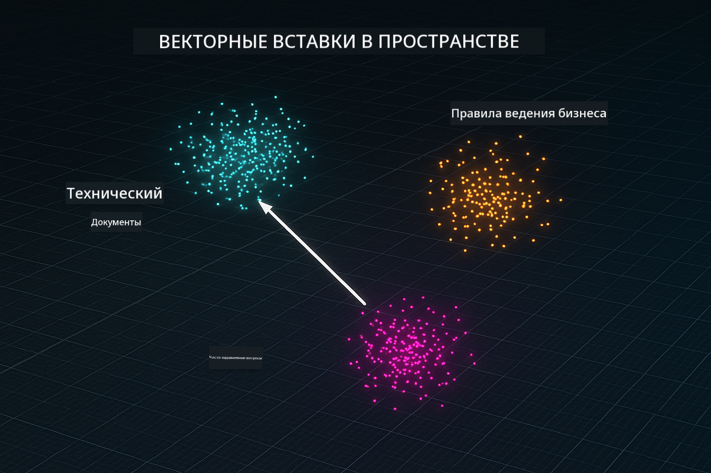
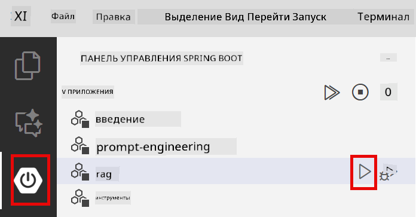
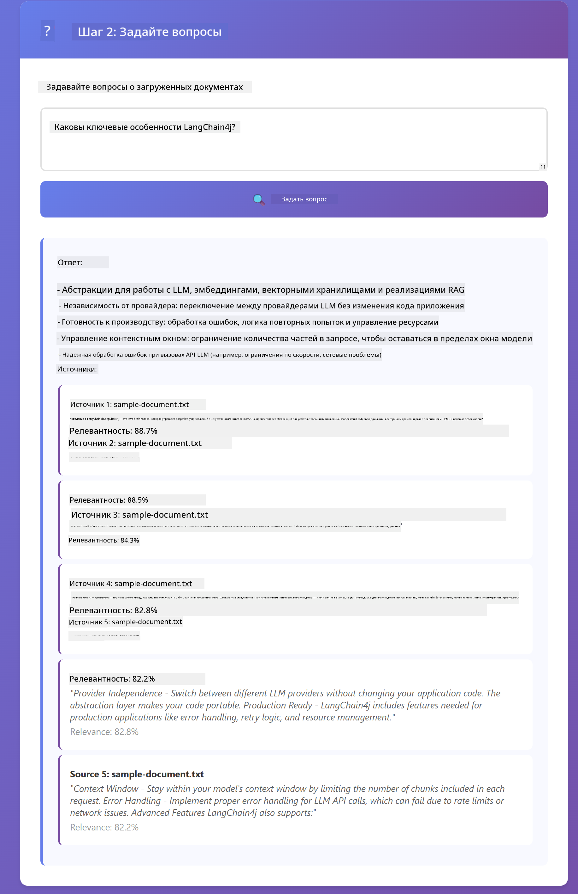

<!--
CO_OP_TRANSLATOR_METADATA:
{
  "original_hash": "f538a51cfd13147d40d84e936a0f485c",
  "translation_date": "2025-12-13T16:44:37+00:00",
  "source_file": "03-rag/README.md",
  "language_code": "ru"
}
-->
# Модуль 03: RAG (Генерация с поддержкой поиска)

## Содержание

- [Чему вы научитесь](../../../03-rag)
- [Требования](../../../03-rag)
- [Понимание RAG](../../../03-rag)
- [Как это работает](../../../03-rag)
  - [Обработка документов](../../../03-rag)
  - [Создание эмбеддингов](../../../03-rag)
  - [Семантический поиск](../../../03-rag)
  - [Генерация ответов](../../../03-rag)
- [Запуск приложения](../../../03-rag)
- [Использование приложения](../../../03-rag)
  - [Загрузка документа](../../../03-rag)
  - [Задавайте вопросы](../../../03-rag)
  - [Проверка источников](../../../03-rag)
  - [Эксперименты с вопросами](../../../03-rag)
- [Ключевые концепции](../../../03-rag)
  - [Стратегия разбиения на части](../../../03-rag)
  - [Оценки сходства](../../../03-rag)
  - [Хранение в памяти](../../../03-rag)
  - [Управление контекстным окном](../../../03-rag)
- [Когда RAG важен](../../../03-rag)
- [Следующие шаги](../../../03-rag)

## Чему вы научитесь

В предыдущих модулях вы научились вести диалоги с ИИ и эффективно структурировать подсказки. Но есть фундаментальное ограничение: языковые модели знают только то, чему их обучали. Они не могут отвечать на вопросы о политике вашей компании, документации проекта или любой информации, на которой их не обучали.

RAG (Генерация с поддержкой поиска) решает эту проблему. Вместо того чтобы пытаться обучить модель вашей информации (что дорого и непрактично), вы даёте ей возможность искать по вашим документам. Когда кто-то задаёт вопрос, система находит релевантную информацию и включает её в подсказку. Модель затем отвечает, основываясь на этом извлечённом контексте.

Думайте о RAG как о предоставлении модели справочной библиотеки. Когда вы задаёте вопрос, система:

1. **Запрос пользователя** — вы задаёте вопрос  
2. **Эмбеддинг** — преобразует ваш вопрос в вектор  
3. **Векторный поиск** — находит похожие части документов  
4. **Сбор контекста** — добавляет релевантные части в подсказку  
5. **Ответ** — LLM генерирует ответ на основе контекста  

Это позволяет моделям отвечать, опираясь на ваши реальные данные, а не только на знания из обучения или выдумывать ответы.


*Рабочий процесс RAG — от запроса пользователя к семантическому поиску и генерации контекстного ответа*

## Требования

- Завершён Модуль 01 (развернуты ресурсы Azure OpenAI)  
- Файл `.env` в корневой директории с учётными данными Azure (созданный командой `azd up` в Модуле 01)  

> **Примечание:** Если вы не завершили Модуль 01, сначала следуйте инструкциям по развертыванию там.

## Как это работает

**Обработка документов** — [DocumentService.java](../../../03-rag/src/main/java/com/example/langchain4j/rag/service/DocumentService.java)

Когда вы загружаете документ, система разбивает его на части — меньшие фрагменты, которые удобно помещаются в контекстное окно модели. Эти части немного перекрываются, чтобы не терять контекст на границах.

```java
Document document = FileSystemDocumentLoader.loadDocument("sample-document.txt");

DocumentSplitter splitter = DocumentSplitters
    .recursive(300, 30, new OpenAiTokenizer());

List<TextSegment> segments = splitter.split(document);
```
  
> **🤖 Попробуйте с [GitHub Copilot](https://github.com/features/copilot) Chat:** Откройте [`DocumentService.java`](../../../03-rag/src/main/java/com/example/langchain4j/rag/service/DocumentService.java) и спросите:  
> - "Как LangChain4j разбивает документы на части и почему важно перекрытие?"  
> - "Какой оптимальный размер части для разных типов документов и почему?"  
> - "Как обрабатывать документы на нескольких языках или со специальным форматированием?"

**Создание эмбеддингов** — [LangChainRagConfig.java](../../../03-rag/src/main/java/com/example/langchain4j/rag/config/LangChainRagConfig.java)

Каждая часть преобразуется в числовое представление, называемое эмбеддингом — по сути, математический отпечаток, который отражает смысл текста. Похожие тексты дают похожие эмбеддинги.

```java
@Bean
public EmbeddingModel embeddingModel() {
    return OpenAiOfficialEmbeddingModel.builder()
        .baseUrl(azureOpenAiEndpoint)
        .apiKey(azureOpenAiKey)
        .modelName(azureEmbeddingDeploymentName)
        .build();
}

EmbeddingStore<TextSegment> embeddingStore = 
    new InMemoryEmbeddingStore<>();
```
  


*Документы представлены в виде векторов в пространстве эмбеддингов — похожее содержимое группируется вместе*

**Семантический поиск** — [RagService.java](../../../03-rag/src/main/java/com/example/langchain4j/rag/service/RagService.java)

Когда вы задаёте вопрос, он тоже преобразуется в эмбеддинг. Система сравнивает эмбеддинг вашего вопроса со всеми эмбеддингами частей документов. Она находит части с наиболее похожим смыслом — не просто совпадение ключевых слов, а именно семантическое сходство.

```java
Embedding queryEmbedding = embeddingModel.embed(question).content();

List<EmbeddingMatch<TextSegment>> matches = 
    embeddingStore.findRelevant(queryEmbedding, 5, 0.7);

for (EmbeddingMatch<TextSegment> match : matches) {
    String relevantText = match.embedded().text();
    double score = match.score();
}
```
  
> **🤖 Попробуйте с [GitHub Copilot](https://github.com/features/copilot) Chat:** Откройте [`RagService.java`](../../../03-rag/src/main/java/com/example/langchain4j/rag/service/RagService.java) и спросите:  
> - "Как работает поиск по сходству с эмбеддингами и что определяет оценку?"  
> - "Какой порог сходства использовать и как он влияет на результаты?"  
> - "Как обрабатывать случаи, когда релевантные документы не найдены?"

**Генерация ответов** — [RagService.java](../../../03-rag/src/main/java/com/example/langchain4j/rag/service/RagService.java)

Самые релевантные части включаются в подсказку для модели. Модель читает эти конкретные части и отвечает на ваш вопрос на основе этой информации. Это предотвращает галлюцинации — модель может отвечать только на основе того, что перед ней.

## Запуск приложения

**Проверьте развертывание:**

Убедитесь, что файл `.env` существует в корневой директории с учётными данными Azure (созданный в Модуле 01):  
```bash
cat ../.env  # Должен показывать AZURE_OPENAI_ENDPOINT, API_KEY, DEPLOYMENT
```
  
**Запустите приложение:**

> **Примечание:** Если вы уже запускали все приложения с помощью `./start-all.sh` из Модуля 01, этот модуль уже работает на порту 8081. Вы можете пропустить команды запуска ниже и перейти сразу на http://localhost:8081.

**Вариант 1: Использование Spring Boot Dashboard (рекомендуется для пользователей VS Code)**

В dev-контейнере установлено расширение Spring Boot Dashboard, которое предоставляет визуальный интерфейс для управления всеми приложениями Spring Boot. Вы найдёте его на панели активности слева в VS Code (значок Spring Boot).

С помощью Spring Boot Dashboard вы можете:  
- Просматривать все доступные приложения Spring Boot в рабочем пространстве  
- Запускать/останавливать приложения одним кликом  
- Смотреть логи приложений в реальном времени  
- Отслеживать статус приложений  

Просто нажмите кнопку запуска рядом с "rag", чтобы запустить этот модуль, или запустите все модули сразу.



**Вариант 2: Использование shell-скриптов**

Запустите все веб-приложения (модули 01-04):

**Bash:**  
```bash
cd ..  # Из корневого каталога
./start-all.sh
```
  
**PowerShell:**  
```powershell
cd ..  # Из корневого каталога
.\start-all.ps1
```
  
Или запустите только этот модуль:

**Bash:**  
```bash
cd 03-rag
./start.sh
```
  
**PowerShell:**  
```powershell
cd 03-rag
.\start.ps1
```
  
Оба скрипта автоматически загружают переменные окружения из корневого файла `.env` и соберут JAR-файлы, если их нет.

> **Примечание:** Если вы предпочитаете собирать все модули вручную перед запуском:  
>  
> **Bash:**  
> ```bash
> cd ..  # Go to root directory
> mvn clean package -DskipTests
> ```
  
> **PowerShell:**  
> ```powershell
> cd ..  # Go to root directory
> mvn clean package -DskipTests
> ```
  
Откройте http://localhost:8081 в браузере.

**Для остановки:**

**Bash:**  
```bash
./stop.sh  # Только этот модуль
# Или
cd .. && ./stop-all.sh  # Все модули
```
  
**PowerShell:**  
```powershell
.\stop.ps1  # Только этот модуль
# Или
cd ..; .\stop-all.ps1  # Все модули
```


## Использование приложения

Приложение предоставляет веб-интерфейс для загрузки документов и задавания вопросов.

<a href="images/rag-homepage.png"></a>

*Интерфейс приложения RAG — загрузите документы и задавайте вопросы*

**Загрузка документа**

Начните с загрузки документа — для тестирования лучше всего подходят TXT-файлы. В этой директории есть `sample-document.txt`, который содержит информацию о возможностях LangChain4j, реализации RAG и лучших практиках — идеально для тестирования системы.

Система обрабатывает ваш документ, разбивает его на части и создаёт эмбеддинги для каждой части. Это происходит автоматически при загрузке.

**Задавайте вопросы**

Теперь задавайте конкретные вопросы о содержимом документа. Попробуйте что-то фактическое, что явно указано в документе. Система ищет релевантные части, включает их в подсказку и генерирует ответ.

**Проверка источников**

Обратите внимание, что каждый ответ содержит ссылки на источники с оценками сходства. Эти оценки (от 0 до 1) показывают, насколько релевантна каждая часть вашему вопросу. Чем выше оценка, тем лучше совпадение. Это позволяет вам проверить ответ по исходному материалу.

<a href="images/rag-query-results.png"></a>

*Результаты запроса с ответом, ссылками на источники и оценками релевантности*

**Эксперименты с вопросами**

Попробуйте разные типы вопросов:  
- Конкретные факты: "Какова основная тема?"  
- Сравнения: "В чём разница между X и Y?"  
- Резюме: "Подведите ключевые моменты по Z"  

Наблюдайте, как меняются оценки релевантности в зависимости от того, насколько хорошо ваш вопрос соответствует содержимому документа.

## Ключевые концепции

**Стратегия разбиения на части**

Документы разбиваются на части по 300 токенов с перекрытием в 30 токенов. Такой баланс обеспечивает достаточный контекст в каждой части, оставаясь достаточно маленькими, чтобы включить несколько частей в подсказку.

**Оценки сходства**

Оценки варьируются от 0 до 1:  
- 0.7-1.0: Очень релевантно, точное совпадение  
- 0.5-0.7: Релевантно, хороший контекст  
- Ниже 0.5: Отфильтровано, слишком непохоже  

Система извлекает только части выше минимального порога для обеспечения качества.

**Хранение в памяти**

Этот модуль использует хранение в памяти для простоты. При перезапуске приложения загруженные документы теряются. В продуктивных системах используют постоянные векторные базы данных, такие как Qdrant или Azure AI Search.

**Управление контекстным окном**

У каждой модели есть максимальный размер контекстного окна. Нельзя включить все части большого документа. Система извлекает топ N самых релевантных частей (по умолчанию 5), чтобы оставаться в пределах лимитов и при этом предоставлять достаточно контекста для точных ответов.

## Когда RAG важен

**Используйте RAG, когда:**  
- Нужно отвечать на вопросы по проприетарным документам  
- Информация часто меняется (политики, цены, спецификации)  
- Требуется точность с указанием источников  
- Содержимое слишком большое для одного запроса  
- Нужны проверяемые, обоснованные ответы  

**Не используйте RAG, когда:**  
- Вопросы требуют общих знаний, которые модель уже имеет  
- Нужны данные в реальном времени (RAG работает с загруженными документами)  
- Содержимое достаточно мало, чтобы включить его напрямую в подсказки  

## Следующие шаги

**Следующий модуль:** [04-tools - AI агенты с инструментами](../04-tools/README.md)

---

**Навигация:** [← Предыдущий: Модуль 02 - Инжиниринг подсказок](../02-prompt-engineering/README.md) | [Назад к главной](../README.md) | [Следующий: Модуль 04 - Инструменты →](../04-tools/README.md)

---

<!-- CO-OP TRANSLATOR DISCLAIMER START -->
**Отказ от ответственности**:  
Этот документ был переведен с помощью сервиса автоматического перевода [Co-op Translator](https://github.com/Azure/co-op-translator). Несмотря на наши усилия обеспечить точность, имейте в виду, что автоматический перевод может содержать ошибки или неточности. Оригинальный документ на его исходном языке следует считать авторитетным источником. Для получения критически важной информации рекомендуется обращаться к профессиональному переводу, выполненному человеком. Мы не несем ответственности за любые недоразумения или неправильные толкования, возникшие в результате использования данного перевода.
<!-- CO-OP TRANSLATOR DISCLAIMER END -->