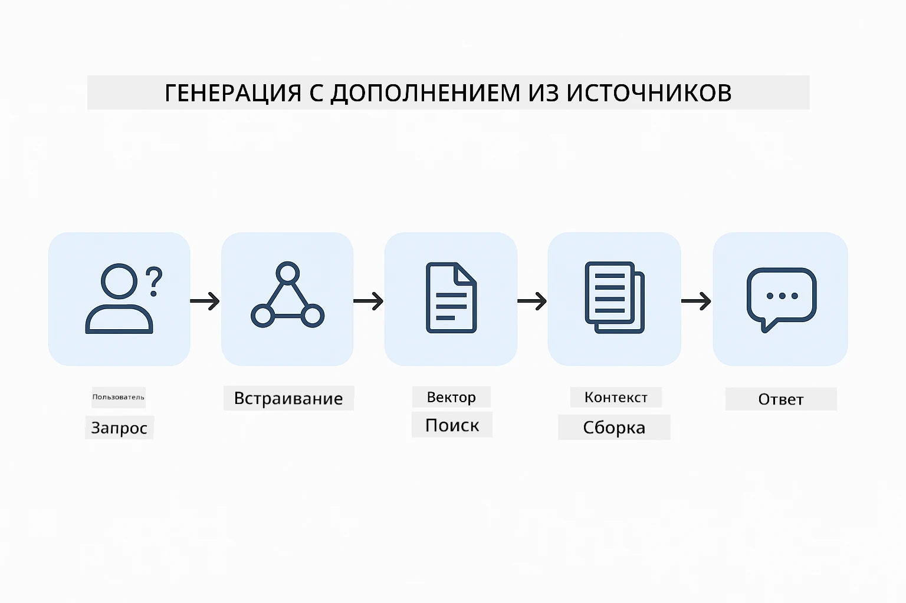
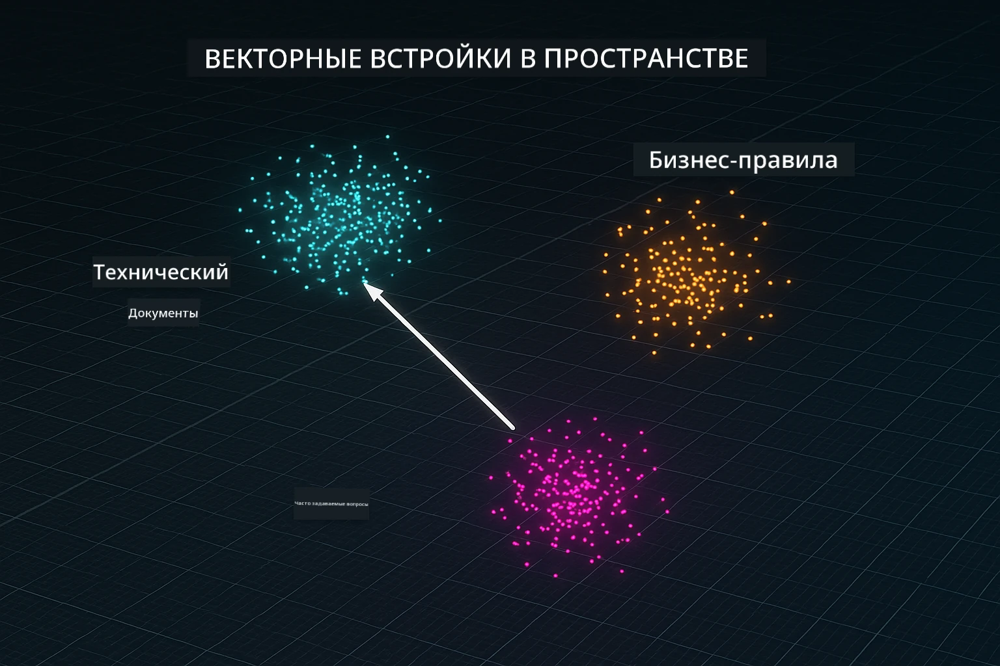
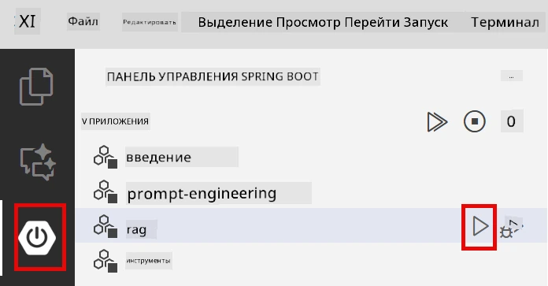
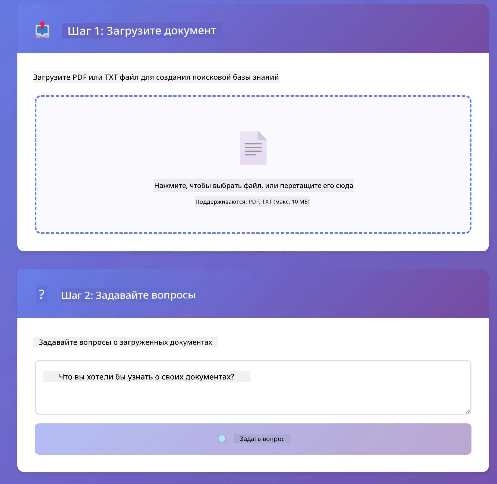
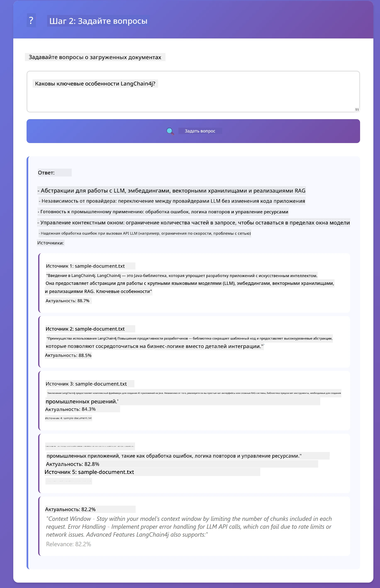

# Модуль 03: RAG (генерация с использованием поиска)

## Содержание

- [Видеообзор](#видеообзор)
- [Чему вы научитесь](#чему-вы-научитесь)
- [Требования](#требования)
- [Понимание RAG](#понимание-rag)
  - [Какой подход RAG используется в этом руководстве?](#какой-подход-rag-используется-в-этом-руководстве)
- [Как это работает](#как-это-работает)
  - [Обработка документов](#обработка-документов)
  - [Создание эмбеддингов](#создание-эмбеддингов)
  - [Семантический поиск](#семантический-поиск)
  - [Генерация ответов](#генерация-ответа)
- [Запуск приложения](#запуск-приложения)
- [Использование приложения](#использование-приложения)
  - [Загрузка документа](#загрузка-документа)
  - [Задавайте вопросы](#задавайте-вопросы)
  - [Проверка ссылок на источники](#проверяйте-ссылки-на-источники)
  - [Эксперименты с вопросами](#экспериментируйте-с-вопросами)
- [Ключевые понятия](#ключевые-концепции)
  - [Стратегия разбиения на части](#стратегия-разбиения-на-куски)
  - [Оценки схожести](#оценки-похожести)
  - [Хранение в памяти](#хранение-в-памяти)
  - [Управление контекстным окном](#управление-контекстным-окном)
- [Когда RAG имеет значение](#когда-rag-имеет-значение)
- [Следующие шаги](#следующие-шаги)

## Видеообзор

Посмотрите эту живую сессию, которая объясняет, как начать работу с этим модулем:

<a href="https://www.youtube.com/watch?v=_olq75ZH_eY"></a>

## Чему вы научитесь

В предыдущих модулях вы научились вести диалоги с ИИ и эффективно структурировать подсказки. Но есть фундаментальное ограничение: языковые модели знают только то, чему они были обучены. Они не могут отвечать на вопросы о политике вашей компании, документации проекта или любой информации, которой не обучались.

RAG (генерация с использованием поиска) решает эту проблему. Вместо того, чтобы пытаться обучить модель вашей информации (что дорого и непрактично), вы даёте ей возможность искать по вашим документам. Когда кто-то задаёт вопрос, система находит соответствующую информацию и включает её в подсказку. Модель затем отвечает, основываясь на найденном контексте.

Думайте о RAG как о предоставлении модели справочной библиотеки. Когда вы задаёте вопрос, система:

1. **Запрос пользователя** — Вы задаёте вопрос
2. **Эмбеддинг** — Преобразует ваш вопрос в вектор
3. **Поиск в векторном пространстве** — Находит схожие части документов
4. **Формирование контекста** — Добавляет релевантные части в подсказку
5. **Ответ** — LLM генерирует ответ на основании контекста

Это закрепляет ответы модели в ваших реальных данных вместо того, чтобы полагаться только на знания из обучения или придумывать ответы.

## Требования

- Закончен [Модуль 01 - Введение](../01-introduction/README.md) (развёрнуты ресурсы Azure OpenAI, включая модель эмбеддинга `text-embedding-3-small`)
- Файл `.env` в корневой директории с учётными данными Azure (создаётся командой `azd up` в Модуле 01)

> **Примечание:** Если вы не завершили Модуль 01, сначала следуйте там инструкциям по развёртыванию. Команда `azd up` развёртывает как GPT чат-модель, так и используемую в этом модуле модель эмбеддинга.

## Понимание RAG

Схема ниже иллюстрирует основную концепцию: вместо того чтобы полагаться только на обучающие данные модели, RAG даёт ей справочную библиотеку ваших документов для обращения к ним перед генерацией каждого ответа.


*Эта схема показывает разницу между стандартной LLM (которая угадывает из обучающих данных) и LLM с RAG (которая сначала обращается к вашим документам).*

Вот как элементы связаны от начала до конца. Вопрос пользователя проходит через четыре этапа — эмбеддинг, поиск по векторам, сбор контекста и генерация ответа — каждый из которых строится на предыдущем:



*Эта схема показывает сквозной конвейер RAG — запрос пользователя проходит через эмбеддинг, поиск по векторам, сбор контекста и генерацию ответа.*

Далее в этом модуле подробно разбирается каждый этап с кодом, который вы можете запускать и модифицировать.

### Какой подход RAG используется в этом руководстве?

LangChain4j предлагает три способа реализовать RAG с разными уровнями абстракции. Схема ниже сравнивает их рядом:


*Эта схема сравнивает три подхода RAG в LangChain4j — Easy, Native и Advanced — показывая их ключевые компоненты и когда использовать каждый.*

| Подход | Что делает | Компромисс |
|---|---|---|
| **Easy RAG** | Автоматически связывает всё через `AiServices` и `ContentRetriever`. Вы аннотируете интерфейс, подключаете ретривер, а LangChain4j за кулисами обрабатывает эмбеддинг, поиск и сбор контекста. | Минимум кода, но вы не видите внутренние этапы. |
| **Native RAG** | Вы сами вызываете модель эмбеддинга, ищете в хранилище, строите подсказку и генерируете ответ — явно каждый шаг. | Больше кода, но каждый этап виден и изменяем. |
| **Advanced RAG** | Использует фреймворк `RetrievalAugmentor` с подключаемыми трансформерами запросов, маршрутизаторами, повторной сортировкой и инжекторами контента для промышленных решений. | Максимальная гибкость, но значительно больше сложности. |

**В этом руководстве используется подход Native.** Каждый шаг конвейера RAG — эмбеддинг запроса, поиск в векторном хранилище, сбор контекста и генерация ответа — написан явно в [`RagService.java`](../../../03-rag/src/main/java/com/example/langchain4j/rag/service/RagService.java). Это сделано намеренно: в учебных целях важнее видеть и понимать каждый этап, чем минимизировать код. Когда вы освоитесь с тем, как всё связано, можете перейти к Easy RAG для быстрых прототипов или Advanced RAG для продакшн-систем.

> **💡 Интересует Easy RAG?** LangChain4j также предлагает *Easy RAG*, где `AiServices` и `ContentRetriever` автоматически обрабатывают эмбеддинг, поиск и сбор подсказок. Этот модуль идёт более явным путём — раскрывая каждый этап конвейера, чтобы вы могли видеть и контролировать его сами.

Схема ниже показывает конвейер Easy RAG. Обратите внимание, как `AiServices` и `EmbeddingStoreContentRetriever` скрывают всю сложность — вы загружаете документ, подключаете ретривер и получаете ответы. Подход Native в этом модуле разбирает каждый из этих скрытых шагов:


*Эта схема показывает конвейер Easy RAG. Сравните с Native подходом из этого модуля: Easy RAG скрывает эмбеддинг, поиск и сбор подсказки за `AiServices` и `ContentRetriever` — вы загружаете документ, подключаете ретривер и получаете ответы. Native подход в этом модуле раскрывает конвейер, чтобы вы вызывали каждый этап (эмбеддинг, поиск, сбор контекста, генерация) самостоятельно, давая полный контроль.*

## Как это работает

Конвейер RAG в этом модуле разбит на четыре этапа, выполняющихся последовательно при каждом вопросе пользователя. Сначала загруженный документ **парсится и разбивается на части**. Эти части затем преобразуются в **векторные эмбеддинги** и сохраняются для математического сравнения. При поступлении запроса система выполняет **семантический поиск** релевантных частей и передаёт их в LLM для **генерации ответа**. Ниже вы найдёте описание каждого этапа с реальным кодом и схемами. Рассмотрим первый шаг.

### Обработка документов

[DocumentService.java](../../../03-rag/src/main/java/com/example/langchain4j/rag/service/DocumentService.java)

Когда вы загружаете документ, система парсит его (PDF или обычный текст), добавляет метаданные, например имя файла, а затем разбивает на части — более мелкие фрагменты, которые удобно помещаются в контекст модели. Части немного перекрываются, чтобы не терять контекст на границах.

```java
// Разобрать загруженный файл и обернуть его в документ LangChain4j
Document document = Document.from(content, metadata);

// Разделить на части по 300 токенов с перекрытием в 30 токенов
DocumentSplitter splitter = DocumentSplitters
    .recursive(300, 30);

List<TextSegment> segments = splitter.split(document);
```

Схема ниже демонстрирует это визуально. Обратите внимание, что каждая часть частично перекрывается с соседними — перекрытие в 30 токенов гарантирует, что важный контекст не теряется между частями:


*Эта схема показывает документ, разбитый на части по 300 токенов с перекрытием в 30 токенов, сохраняя контекст на границах.*

> **🤖 Попробуйте с помощью [GitHub Copilot](https://github.com/features/copilot) Chat:** Откройте [`DocumentService.java`](../../../03-rag/src/main/java/com/example/langchain4j/rag/service/DocumentService.java) и задайте вопросы:
> - "Как LangChain4j разбивает документы на части и почему важно перекрытие?"
> - "Какой оптимальный размер части для разных типов документов и почему?"
> - "Как обрабатывать документы на нескольких языках или с особым форматированием?"

### Создание эмбеддингов

[LangChainRagConfig.java](../../../03-rag/src/main/java/com/example/langchain4j/rag/config/LangChainRagConfig.java)

Каждая часть преобразуется в числовое представление, называемое эмбеддингом — по сути конвертер значений в числа. Модель эмбеддинга не «интеллектуальна», как чат-модель; она не может следовать инструкциям, рассуждать или отвечать на вопросы. Зато она отображает текст в математическое пространство, где схожие значения оказываются рядом — «машина» рядом с «автомобилем», «политика возврата» рядом с «верните мои деньги». Можно представить чат-модель как человека для разговора, а модель эмбеддинга — как отличный файл.

Схема ниже визуализирует эту концепцию — поступает текст, выходят числовые векторы, и схожие значения образуют близкие векторы:


*Эта схема показывает, как модель эмбеддинга преобразует текст в числовые векторы, располагая похожие значения — например "машина" и "автомобиль" — рядом в векторном пространстве.*

```java
@Bean
public EmbeddingModel embeddingModel() {
    return OpenAiOfficialEmbeddingModel.builder()
        .baseUrl(azureOpenAiEndpoint)
        .apiKey(azureOpenAiKey)
        .modelName(azureEmbeddingDeploymentName)
        .build();
}

EmbeddingStore<TextSegment> embeddingStore = 
    new InMemoryEmbeddingStore<>();
```

Диаграмма классов показывает два отдельных потока в конвейере RAG и соответствующие классы LangChain4j. **Поток загрузки** (запускается один раз при загрузке) разбивает документ, создаёт эмбеддинги частей и сохраняет их через `.addAll()`. **Поток запроса** (запускается при каждом запросе пользователя) создаёт эмбеддинг вопроса, ищет в хранилище через `.search()` и передаёт найденный контекст в чат-модель. Оба потока соединяются через общий интерфейс `EmbeddingStore<TextSegment>`:


*Эта схема показывает два потока в конвейере RAG — загрузку и запрос — и как они связаны через общий EmbeddingStore.*

После сохранения эмбеддингов схожий контент естественно группируется в векторном пространстве. Визуализация ниже показывает, как документы по связанным темам образуют соседние точки — именно это делает возможным семантический поиск:



*Эта визуализация показывает, как связанные документы группируются вместе в 3D векторном пространстве, с такими темами, как техническая документация, бизнес-правила и часто задаваемые вопросы, образующими отдельные кластеры.*

При поиске система выполняет четыре шага: эмбеддит документы один раз, эмбеддит запрос при каждом поиске, сравнивает вектор запроса со всеми сохранёнными векторами с помощью косинусного сходства и возвращает топ-K самых релевантных частей. Схема ниже показывает шаги и вовлечённые классы LangChain4j:


*Эта схема показывает четырёхшаговый процесс поиска по эмбеддингам: эмбеддит документы, эмбеддит запрос, сравнивает векторы с помощью косинусного сходства и возвращает топ-K результатов.*

### Семантический поиск

[RagService.java](../../../03-rag/src/main/java/com/example/langchain4j/rag/service/RagService.java)

Когда вы задаёте вопрос, он тоже преобразуется в эмбеддинг. Система сравнивает эмбеддинг вашего вопроса со всеми эмбеддингами частей документов. Она находит части с наиболее схожими значениями — не только совпадающие ключевые слова, но и фактическую семантическую близость.

```java
Embedding queryEmbedding = embeddingModel.embed(question).content();

EmbeddingSearchRequest searchRequest = EmbeddingSearchRequest.builder()
    .queryEmbedding(queryEmbedding)
    .maxResults(5)
    .minScore(0.5)
    .build();

EmbeddingSearchResult<TextSegment> searchResult = embeddingStore.search(searchRequest);
List<EmbeddingMatch<TextSegment>> matches = searchResult.matches();

for (EmbeddingMatch<TextSegment> match : matches) {
    String relevantText = match.embedded().text();
    double score = match.score();
}
```

Схема ниже сравнивает семантический поиск с традиционным поиском по ключевым словам. Поиск по слову "транспортное средство" пропускает часть с «машины и грузовики», но семантический поиск понимает, что они означают одно и то же, и возвращает её как релевантный результат:


*Эта схема сравнивает поиск по ключевым словам с семантическим поиском, показывая, как семантический поиск находит концептуально связанные материалы, даже если точные ключевые слова отличаются.*

В основе лежит косинусное сходство — по сути вопрос "указывают ли эти две стрелки в одном направлении?" Две части могут использовать совершенно разные слова, но если они означают одно и то же, их векторы указывают в одном направлении и набирают оценку, близкую к 1.0:


*Эта диаграмма иллюстрирует косинусное сходство как угол между векторами эмбеддингов — более согласованные векторы имеют оценку ближе к 1.0, что указывает на более высокое семантическое сходство.*

> **🤖 Попробуйте с [GitHub Copilot](https://github.com/features/copilot) Chat:** Откройте [`RagService.java`](../../../03-rag/src/main/java/com/example/langchain4j/rag/service/RagService.java) и спросите:
> - "Как работает поиск по похожести с эмбеддингами и что определяет оценку?"
> - "Какой порог похожести следует использовать и как это влияет на результаты?"
> - "Как обрабатывать случаи, когда не найдено релевантных документов?"

### Генерация ответа

[RagService.java](../../../03-rag/src/main/java/com/example/langchain4j/rag/service/RagService.java)

Самые релевантные куски собираются в структурированный запрос, который включает явные инструкции, извлечённый контекст и вопрос пользователя. Модель читает именно эти куски и отвечает на основе этой информации — она может использовать только то, что у неё перед глазами, что предотвращает галлюцинации.

```java
String context = matches.stream()
    .map(match -> match.embedded().text())
    .collect(Collectors.joining("\n\n"));

String prompt = String.format("""
    Answer the question based on the following context.
    If the answer cannot be found in the context, say so.

    Context:
    %s

    Question: %s

    Answer:""", context, request.question());

String answer = chatModel.chat(prompt);
```

Диаграмма ниже показывает эту сборку в действии — куски с наивысшим баллом из этапа поиска вставляются в шаблон запроса, и `OpenAiOfficialChatModel` генерирует обоснованный ответ:


*Эта диаграмма показывает, как куски с наивысшим баллом собираются в структурированный запрос, позволяя модели генерировать обоснованный ответ на основе ваших данных.*

## Запуск приложения

**Проверка развертывания:**

Убедитесь, что в корневой директории существует файл `.env` с учётными данными Azure (созданный в Модуле 01). Запустите это из директории модуля (`03-rag/`):

**Bash:**
```bash
cat ../.env  # Должен отображать AZURE_OPENAI_ENDPOINT, API_KEY, DEPLOYMENT
```

**PowerShell:**
```powershell
Get-Content ..\.env  # Должен отображать AZURE_OPENAI_ENDPOINT, API_KEY, DEPLOYMENT
```

**Запуск приложения:**

> **Примечание:** Если вы уже запускали все приложения с помощью `./start-all.sh` из корневой директории (как описано в Модуле 01), этот модуль уже работает на порту 8081. Вы можете пропустить команды запуска и перейти напрямую по адресу http://localhost:8081.

**Вариант 1: Использование Spring Boot Dashboard (рекомендуется для пользователей VS Code)**

В контейнере разработчика установлено расширение Spring Boot Dashboard, которое предоставляет визуальный интерфейс для управления всеми приложениями Spring Boot. Вы найдёте его на панели активности слева в VS Code (иконка Spring Boot).

С помощью Spring Boot Dashboard вы можете:
- Просматривать все доступные приложения Spring Boot в рабочем пространстве
- Запускать/останавливать приложения одним кликом
- Просматривать логи приложений в реальном времени
- Отслеживать статус приложений

Просто нажмите кнопку запуска рядом с "rag", чтобы запустить этот модуль, или запустите сразу все модули.



*Этот скриншот показывает Spring Boot Dashboard в VS Code, где можно визуально запускать, останавливать и мониторить приложения.*

**Вариант 2: Использование shell-скриптов**

Запустите все веб-приложения (модули 01-04):

**Bash:**
```bash
cd ..  # Из корневой директории
./start-all.sh
```

**PowerShell:**
```powershell
cd ..  # Из корневого каталога
.\start-all.ps1
```

Или запустите только этот модуль:

**Bash:**
```bash
cd 03-rag
./start.sh
```

**PowerShell:**
```powershell
cd 03-rag
.\start.ps1
```

Оба скрипта автоматически загружают переменные окружения из корневого файла `.env` и собирают JAR-файлы, если они отсутствуют.

> **Примечание:** Если хотите собрать все модули вручную перед запуском:
>
> **Bash:**
> ```bash
> cd ..  # Go to root directory
> mvn clean package -DskipTests
> ```
>
> **PowerShell:**
> ```powershell
> cd ..  # Go to root directory
> mvn clean package -DskipTests
> ```

Откройте http://localhost:8081 в браузере.

**Чтобы остановить:**

**Bash:**
```bash
./stop.sh  # Только этот модуль
# Или
cd .. && ./stop-all.sh  # Все модули
```

**PowerShell:**
```powershell
.\stop.ps1  # Только этот модуль
# Или
cd ..; .\stop-all.ps1  # Все модули
```

## Использование приложения

Приложение предоставляет веб-интерфейс для загрузки документов и задавания вопросов.

<a href="images/rag-homepage.png"></a>

*Этот скриншот показывает интерфейс приложения RAG, где вы загружаете документы и задаёте вопросы.*

### Загрузка документа

Начните с загрузки документа — для тестирования лучше всего подходят TXT-файлы. В этой директории есть `sample-document.txt`, содержащий информацию о функциях LangChain4j, реализации RAG и лучших практиках — идеально для тестирования системы.

Система обрабатывает ваш документ, разбивает его на куски и создаёт эмбеддинги для каждого куска. Это происходит автоматически при загрузке.

### Задавайте вопросы

Теперь задавайте конкретные вопросы о содержании документа. Попробуйте что-то фактическое, что чётко указано в документе. Система ищет релевантные куски, включает их в запрос и генерирует ответ.

### Проверяйте ссылки на источники

Обратите внимание, что каждый ответ включает ссылки на источники с оценками похожести. Эти оценки (от 0 до 1) показывают, насколько каждый кусок был релевантен вашему вопросу. Более высокие оценки означают лучшее совпадение. Это позволяет проверить ответ относительно исходного материала.

<a href="images/rag-query-results.png"></a>

*Этот скриншот показывает результаты запроса с сгенерированным ответом, ссылками на источники и оценками релевантности для каждого извлечённого куска.*

### Экспериментируйте с вопросами

Пробуйте разные типы вопросов:
- Конкретные факты: "Какова основная тема?"
- Сравнения: "В чём разница между X и Y?"
- Итоги: "Суммируй ключевые моменты о Z"

Наблюдайте, как меняются оценки релевантности в зависимости от того, насколько ваш вопрос соответствует содержанию документа.

## Ключевые концепции

### Стратегия разбиения на куски

Документы разбиваются на куски по 300 токенов с перекрытием в 30 токенов. Этот баланс обеспечивает достаточно контекста для каждого куска, при этом размер остаётся достаточно малым, чтобы вместить несколько кусков в запрос.

### Оценки похожести

Каждый извлечённый кусок имеет оценку похожести от 0 до 1, которая указывает, насколько он близок к вопросу пользователя. Диаграмма ниже визуализирует диапазоны оценок и как система использует их для фильтрации результатов:


*Эта диаграмма показывает диапазоны оценок от 0 до 1 с минимальным порогом 0.5, который фильтрует нерелевантные куски.*

Оценки варьируются от 0 до 1:
- 0.7-1.0: Очень релевантно, точное совпадение
- 0.5-0.7: Релевантно, хороший контекст
- Ниже 0.5: Отфильтровано, слишком несхоже

Система извлекает только куски выше минимального порога для обеспечения качества.

Эмбеддинги хорошо работают, когда смысл чётко группируется, но у них есть «слепые зоны». Диаграмма ниже показывает типичные ошибки — слишком большие куски создают слишком размытые векторы, слишком маленькие — лишены контекста, неоднозначные термины указывают на несколько кластеров, а точные совпадения (ID, номера деталей) вообще не работают с эмбеддингами:


*Эта диаграмма показывает типичные ошибки эмбеддингов: куски слишком большие, куски слишком маленькие, неоднозначные термины указывают на несколько кластеров и точные совпадения вроде ID.*

### Хранение в памяти

Для простоты этот модуль использует хранение в памяти. При перезапуске приложения загруженные документы теряются. В продуктивных системах применяются персистентные векторные базы данных, такие как Qdrant или Azure AI Search.

### Управление контекстным окном

Каждая модель имеет максимальный размер контекстного окна. Нельзя включить все куски большого документа. Система выбирает топ N самых релевантных кусков (по умолчанию 5), чтобы уложиться в лимиты и при этом обеспечить достаточный контекст для точных ответов.

## Когда RAG имеет значение

RAG не всегда является правильным подходом. Руководство по принятию решения ниже помогает определить, когда RAG добавляет ценность, а когда достаточно более простых подходов — например, включение контента напрямую в запрос или использование встроенных знаний модели:


*Эта диаграмма показывает руководство по решению, когда RAG добавляет ценность, а когда достаточно более простых методов.*

## Следующие шаги

**Следующий модуль:** [04-tools - AI агенты с инструментами](../04-tools/README.md)

---

**Навигация:** [← Предыдущий: Модуль 02 - Построение запросов](../02-prompt-engineering/README.md) | [Вернуться к оглавлению](../README.md) | [Следующий: Модуль 04 - Инструменты →](../04-tools/README.md)

---

<!-- CO-OP TRANSLATOR DISCLAIMER START -->
**Отказ от ответственности**:
Этот документ был переведен с использованием сервиса машинного перевода [Co-op Translator](https://github.com/Azure/co-op-translator). Несмотря на наши усилия по обеспечению точности, имейте в виду, что автоматический перевод может содержать ошибки или неточности. Оригинальный документ на его исходном языке следует считать авторитетным источником. Для получения критически важной информации рекомендуется обратиться к профессиональному человеческому переводу. Мы не несем ответственности за любые недоразумения или неправильные толкования, возникшие в результате использования этого перевода.
<!-- CO-OP TRANSLATOR DISCLAIMER END -->