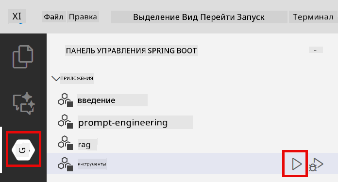

<!--
CO_OP_TRANSLATOR_METADATA:
{
  "original_hash": "aa23f106e7f53270924c9dd39c629004",
  "translation_date": "2025-12-13T18:22:42+00:00",
  "source_file": "04-tools/README.md",
  "language_code": "ru"
}
-->
# Модуль 04: AI-агенты с инструментами

## Содержание

- [Чему вы научитесь](../../../04-tools)
- [Требования](../../../04-tools)
- [Понимание AI-агентов с инструментами](../../../04-tools)
- [Как работает вызов инструментов](../../../04-tools)
  - [Определения инструментов](../../../04-tools)
  - [Принятие решений](../../../04-tools)
  - [Выполнение](../../../04-tools)
  - [Генерация ответа](../../../04-tools)
- [Цепочка инструментов](../../../04-tools)
- [Запуск приложения](../../../04-tools)
- [Использование приложения](../../../04-tools)
  - [Попробуйте простое использование инструментов](../../../04-tools)
  - [Проверьте цепочку инструментов](../../../04-tools)
  - [Просмотрите ход разговора](../../../04-tools)
  - [Наблюдайте за рассуждениями](../../../04-tools)
  - [Экспериментируйте с разными запросами](../../../04-tools)
- [Ключевые концепции](../../../04-tools)
  - [Паттерн ReAct (рассуждение и действие)](../../../04-tools)
  - [Описание инструментов имеет значение](../../../04-tools)
  - [Управление сессиями](../../../04-tools)
  - [Обработка ошибок](../../../04-tools)
- [Доступные инструменты](../../../04-tools)
- [Когда использовать агентов с инструментами](../../../04-tools)
- [Следующие шаги](../../../04-tools)

## Чему вы научитесь

До сих пор вы научились вести диалоги с ИИ, эффективно структурировать подсказки и основывать ответы на ваших документах. Но есть фундаментальное ограничение: языковые модели могут только генерировать текст. Они не могут проверить погоду, выполнять вычисления, запрашивать базы данных или взаимодействовать с внешними системами.

Инструменты меняют это. Предоставляя модели доступ к функциям, которые она может вызывать, вы превращаете её из генератора текста в агента, который может предпринимать действия. Модель решает, когда ей нужен инструмент, какой инструмент использовать и какие параметры передать. Ваш код выполняет функцию и возвращает результат. Модель включает этот результат в свой ответ.

## Требования

- Завершён модуль 01 (развернуты ресурсы Azure OpenAI)
- Файл `.env` в корневой директории с учётными данными Azure (созданный командой `azd up` в модуле 01)

> **Примечание:** Если вы не завершили модуль 01, сначала следуйте инструкциям по развертыванию там.

## Понимание AI-агентов с инструментами

AI-агент с инструментами следует паттерну рассуждения и действия (ReAct):

1. Пользователь задаёт вопрос
2. Агент рассуждает, что ему нужно узнать
3. Агент решает, нужен ли ему инструмент для ответа
4. Если да, агент вызывает соответствующий инструмент с нужными параметрами
5. Инструмент выполняется и возвращает данные
6. Агент включает результат и предоставляет окончательный ответ


*Паттерн ReAct — как AI-агенты чередуют рассуждения и действия для решения задач*

Это происходит автоматически. Вы определяете инструменты и их описания. Модель принимает решения о том, когда и как их использовать.

## Как работает вызов инструментов

**Определения инструментов** - [WeatherTool.java](../../../04-tools/src/main/java/com/example/langchain4j/agents/tools/WeatherTool.java) | [TemperatureTool.java](../../../04-tools/src/main/java/com/example/langchain4j/agents/tools/TemperatureTool.java)

Вы определяете функции с чёткими описаниями и спецификациями параметров. Модель видит эти описания в системном подсказе и понимает, что делает каждый инструмент.

```java
@Component
public class WeatherTool {
    
    @Tool("Get the current weather for a location")
    public String getCurrentWeather(@P("Location name") String location) {
        // Ваша логика поиска погоды
        return "Weather in " + location + ": 22°C, cloudy";
    }
}

@AiService
public interface Assistant {
    String chat(@MemoryId String sessionId, @UserMessage String message);
}

// Ассистент автоматически подключается Spring Boot с:
// - bean ChatModel
// - Все методы @Tool из классов с @Component
// - ChatMemoryProvider для управления сессиями
```

> **🤖 Попробуйте с [GitHub Copilot](https://github.com/features/copilot) Chat:** Откройте [`WeatherTool.java`](../../../04-tools/src/main/java/com/example/langchain4j/agents/tools/WeatherTool.java) и спросите:
> - "Как интегрировать реальный API погоды, например OpenWeatherMap, вместо мок-данных?"
> - "Что делает хорошее описание инструмента, которое помогает ИИ правильно его использовать?"
> - "Как обрабатывать ошибки API и ограничения по количеству запросов в реализации инструментов?"

**Принятие решений**

Когда пользователь спрашивает "Какая погода в Сиэтле?", модель понимает, что нужен инструмент погоды. Она генерирует вызов функции с параметром location, установленным в "Seattle".

**Выполнение** - [AgentService.java](../../../04-tools/src/main/java/com/example/langchain4j/agents/service/AgentService.java)

Spring Boot автоматически внедряет декларативный интерфейс `@AiService` со всеми зарегистрированными инструментами, и LangChain4j автоматически выполняет вызовы инструментов.

> **🤖 Попробуйте с [GitHub Copilot](https://github.com/features/copilot) Chat:** Откройте [`AgentService.java`](../../../04-tools/src/main/java/com/example/langchain4j/agents/service/AgentService.java) и спросите:
> - "Как работает паттерн ReAct и почему он эффективен для AI-агентов?"
> - "Как агент решает, какой инструмент использовать и в каком порядке?"
> - "Что происходит, если выполнение инструмента неудачно — как надёжно обрабатывать ошибки?"

**Генерация ответа**

Модель получает данные о погоде и форматирует их в естественный язык для пользователя.

### Почему использовать декларативные AI-сервисы?

В этом модуле используется интеграция LangChain4j с Spring Boot и декларативными интерфейсами `@AiService`:

- **Автоматическое внедрение Spring Boot** — ChatModel и инструменты автоматически внедряются
- **Паттерн @MemoryId** — автоматическое управление памятью на основе сессий
- **Один экземпляр** — ассистент создаётся один раз и переиспользуется для лучшей производительности
- **Типобезопасное выполнение** — вызов Java-методов напрямую с конвертацией типов
- **Оркестрация нескольких ходов** — автоматическая обработка цепочек инструментов
- **Никакого шаблонного кода** — без ручных вызовов AiServices.builder() или HashMap для памяти

Альтернативные подходы (ручной `AiServices.builder()`) требуют больше кода и не используют преимущества интеграции Spring Boot.

## Цепочка инструментов

**Цепочка инструментов** — AI может вызывать несколько инструментов последовательно. Спросите "Какая погода в Сиэтле и стоит ли брать зонт?" и посмотрите, как он связывает `getCurrentWeather` с рассуждениями о необходимости зонта.

<a href="images/tool-chaining.png"></a>

*Последовательные вызовы инструментов — вывод одного инструмента используется для следующего решения*

**Грациозные ошибки** — спросите погоду в городе, которого нет в мок-данных. Инструмент вернёт сообщение об ошибке, и ИИ объяснит, что помочь не может. Инструменты безопасно обрабатывают ошибки.

Это происходит в одном ходе разговора. Агент самостоятельно оркестрирует несколько вызовов инструментов.

## Запуск приложения

**Проверьте развертывание:**

Убедитесь, что файл `.env` существует в корневой директории с учётными данными Azure (созданный в модуле 01):
```bash
cat ../.env  # Должен показывать AZURE_OPENAI_ENDPOINT, API_KEY, DEPLOYMENT
```

**Запустите приложение:**

> **Примечание:** Если вы уже запускали все приложения с помощью `./start-all.sh` из модуля 01, этот модуль уже работает на порту 8084. Вы можете пропустить команды запуска ниже и перейти напрямую по адресу http://localhost:8084.

**Вариант 1: Использование Spring Boot Dashboard (рекомендуется для пользователей VS Code)**

В dev-контейнере включено расширение Spring Boot Dashboard, которое предоставляет визуальный интерфейс для управления всеми приложениями Spring Boot. Вы найдёте его на панели активности слева в VS Code (значок Spring Boot).

Через Spring Boot Dashboard вы можете:
- Просматривать все доступные приложения Spring Boot в рабочем пространстве
- Запускать/останавливать приложения одним кликом
- Смотреть логи приложений в реальном времени
- Отслеживать статус приложений

Просто нажмите кнопку запуска рядом с "tools", чтобы запустить этот модуль, или запустите все модули сразу.



**Вариант 2: Использование shell-скриптов**

Запустите все веб-приложения (модули 01-04):

**Bash:**
```bash
cd ..  # Из корневого каталога
./start-all.sh
```

**PowerShell:**
```powershell
cd ..  # Из корневого каталога
.\start-all.ps1
```

Или запустите только этот модуль:

**Bash:**
```bash
cd 04-tools
./start.sh
```

**PowerShell:**
```powershell
cd 04-tools
.\start.ps1
```

Оба скрипта автоматически загружают переменные окружения из корневого файла `.env` и соберут JAR-файлы, если их нет.

> **Примечание:** Если вы предпочитаете собрать все модули вручную перед запуском:
>
> **Bash:**
> ```bash
> cd ..  # Go to root directory
> mvn clean package -DskipTests
> ```
>
> **PowerShell:**
> ```powershell
> cd ..  # Go to root directory
> mvn clean package -DskipTests
> ```

Откройте http://localhost:8084 в браузере.

**Для остановки:**

**Bash:**
```bash
./stop.sh  # Только этот модуль
# Или
cd .. && ./stop-all.sh  # Все модули
```

**PowerShell:**
```powershell
.\stop.ps1  # Только этот модуль
# Или
cd ..; .\stop-all.ps1  # Все модули
```

## Использование приложения

Приложение предоставляет веб-интерфейс, где вы можете взаимодействовать с AI-агентом, имеющим доступ к инструментам погоды и конвертации температуры.

<a href="images/tools-homepage.png"></a>

*Интерфейс инструментов AI-агента — быстрые примеры и чат для взаимодействия с инструментами*

**Попробуйте простое использование инструментов**

Начните с простого запроса: "Преобразуй 100 градусов по Фаренгейту в Цельсий". Агент понимает, что нужен инструмент конвертации температуры, вызывает его с правильными параметрами и возвращает результат. Обратите внимание, как естественно это ощущается — вы не указывали, какой инструмент использовать или как его вызвать.

**Проверьте цепочку инструментов**

Теперь попробуйте что-то сложнее: "Какая погода в Сиэтле и переведи её в Фаренгейт?" Смотрите, как агент выполняет это по шагам. Сначала он получает погоду (в Цельсиях), понимает, что нужно конвертировать в Фаренгейт, вызывает инструмент конвертации и объединяет оба результата в один ответ.

**Просмотрите ход разговора**

Интерфейс чата сохраняет историю разговора, позволяя вести многоходовые взаимодействия. Вы можете видеть все предыдущие запросы и ответы, что облегчает отслеживание беседы и понимание, как агент строит контекст на протяжении нескольких обменов.

<a href="images/tools-conversation-demo.png"></a>

*Многоходовой разговор с простыми конверсиями, запросами погоды и цепочкой инструментов*

**Экспериментируйте с разными запросами**

Попробуйте разные комбинации:
- Запросы погоды: "Какая погода в Токио?"
- Конвертации температуры: "Сколько будет 25°C в Кельвинах?"
- Смешанные запросы: "Проверь погоду в Париже и скажи, выше ли там 20°C"

Обратите внимание, как агент интерпретирует естественный язык и сопоставляет его с соответствующими вызовами инструментов.

## Ключевые концепции

**Паттерн ReAct (рассуждение и действие)**

Агент чередует рассуждения (решение, что делать) и действия (использование инструментов). Этот паттерн позволяет автономно решать задачи, а не просто выполнять инструкции.

**Описание инструментов имеет значение**

Качество описаний ваших инструментов напрямую влияет на то, насколько хорошо агент их использует. Чёткие, конкретные описания помогают модели понять, когда и как вызывать каждый инструмент.

**Управление сессиями**

Аннотация `@MemoryId` позволяет автоматически управлять памятью на основе сессий. Каждому ID сессии соответствует свой экземпляр `ChatMemory`, управляемый бином `ChatMemoryProvider`, что исключает необходимость ручного отслеживания памяти.

**Обработка ошибок**

Инструменты могут давать сбои — API могут таймаутить, параметры могут быть неверными, внешние сервисы могут быть недоступны. Продакшн-агенты нуждаются в обработке ошибок, чтобы модель могла объяснять проблемы или пробовать альтернативы.

## Доступные инструменты

**Инструменты погоды** (мок-данные для демонстрации):
- Получение текущей погоды для локации
- Получение прогноза на несколько дней

**Инструменты конвертации температуры**:
- Цельсий в Фаренгейт
- Фаренгейт в Цельсий
- Цельсий в Кельвин
- Кельвин в Цельсий
- Фаренгейт в Кельвин
- Кельвин в Фаренгейт

Это простые примеры, но паттерн распространяется на любые функции: запросы к базам данных, вызовы API, вычисления, операции с файлами или системные команды.

## Когда использовать агентов с инструментами

**Используйте инструменты, когда:**
- Для ответа нужны данные в реальном времени (погода, цены акций, инвентарь)
- Нужно выполнять вычисления, выходящие за рамки простой математики
- Доступ к базам данных или API
- Выполнение действий (отправка писем, создание тикетов, обновление записей)
- Объединение нескольких источников данных

**Не используйте инструменты, когда:**
- Вопросы можно ответить из общих знаний
- Ответ носит чисто разговорный характер
- Задержка инструментов сделает опыт слишком медленным

## Следующие шаги

**Следующий модуль:** [05-mcp - Протокол контекста модели (MCP)](../05-mcp/README.md)

---

**Навигация:** [← Предыдущий: Модуль 03 - RAG](../03-rag/README.md) | [Назад к главной](../README.md) | [Следующий: Модуль 05 - MCP →](../05-mcp/README.md)

---

<!-- CO-OP TRANSLATOR DISCLAIMER START -->
**Отказ от ответственности**:  
Этот документ был переведен с помощью сервиса автоматического перевода [Co-op Translator](https://github.com/Azure/co-op-translator). Несмотря на наши усилия по обеспечению точности, имейте в виду, что автоматический перевод может содержать ошибки или неточности. Оригинальный документ на его исходном языке следует считать авторитетным источником. Для получения критически важной информации рекомендуется использовать профессиональный перевод, выполненный человеком. Мы не несем ответственности за любые недоразумения или неправильные толкования, возникшие в результате использования данного перевода.
<!-- CO-OP TRANSLATOR DISCLAIMER END -->