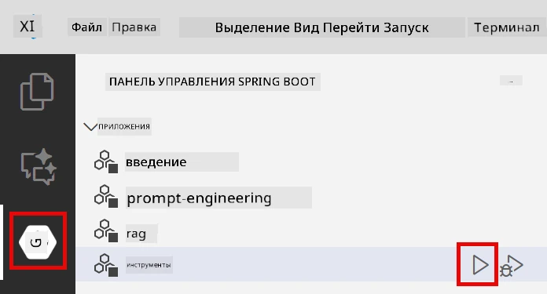
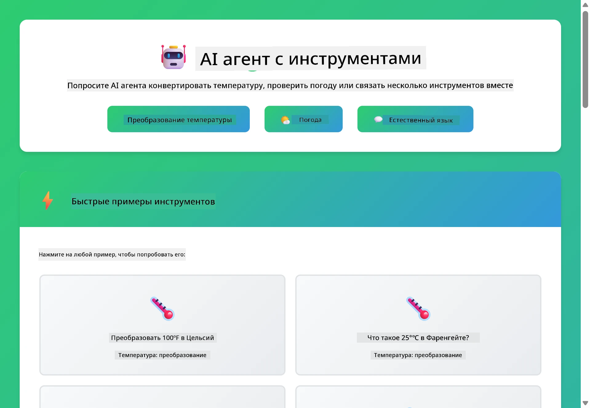
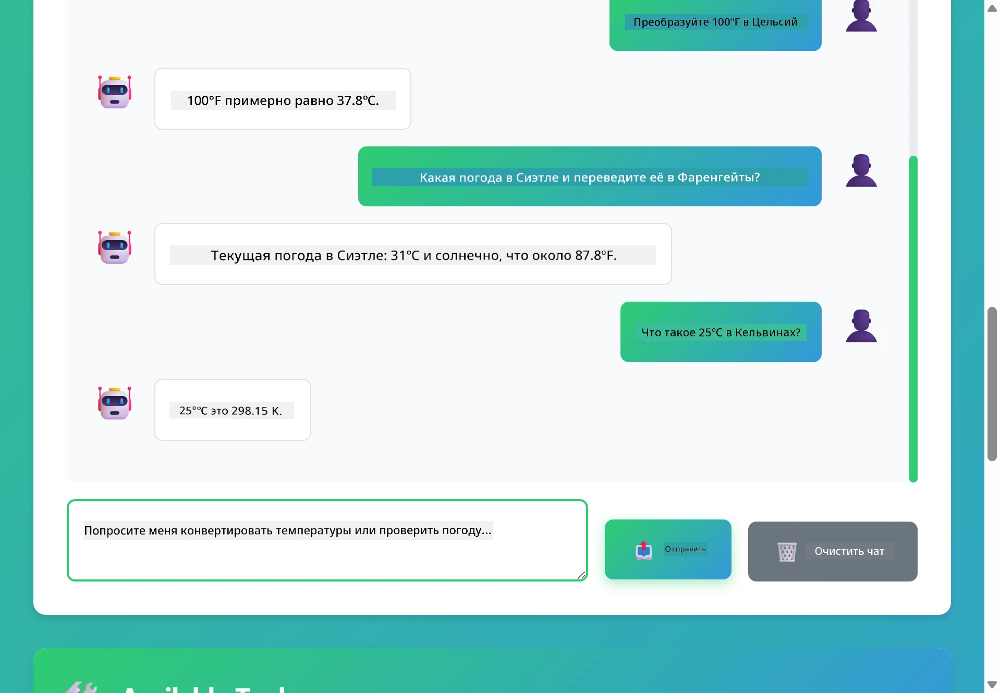

# Модуль 04: AI-агенты с инструментами

## Содержание

- [Видеообзор](#видеообзор)
- [Чему вы научитесь](#чему-вы-научитесь)
- [Требования](#требования)
- [Понимание AI-агентов с инструментами](#понимание-ai-агентов-с-инструментами)
- [Как работает вызов инструмента](#как-работает-вызов-инструмента)
  - [Определения инструментов](#определения-инструментов)
  - [Принятие решений](#принятие-решений)
  - [Выполнение](#выполнение)
  - [Генерация ответа](#генерация-ответа)
  - [Архитектура: Автоматическое связывание Spring Boot](#архитектура-автоматическое-связывание-spring-boot)
- [Цепочки инструментов](#цепочки-инструментов)
- [Запуск приложения](#запуск-приложения)
- [Использование приложения](#использование-приложения)
  - [Попробуйте простой вызов инструмента](#попробуйте-простое-использование-инструментов)
  - [Проверьте цепочку инструментов](#проверьте-цепочку-инструментов)
  - [Посмотрите ход беседы](#просмотрите-ход-разговора)
  - [Экспериментируйте с разными запросами](#экспериментируйте-с-разными-запросами)
- [Ключевые концепции](#основные-понятия)
  - [Шаблон ReAct (Размышления и действия)](#паттерн-react-рассуждение-и-действие)
  - [Важность описаний инструментов](#значение-описаний-инструментов)
  - [Управление сессиями](#управление-сессиями)
  - [Обработка ошибок](#обработка-ошибок)
- [Доступные инструменты](#доступные-инструменты)
- [Когда использовать агентов на основе инструментов](#когда-использовать-агентов-с-инструментами)
- [Инструменты vs RAG](#инструменты-vs-rag)
- [Следующие шаги](#следующие-шаги)

## Видеообзор

Смотрите это живое занятие, в котором объясняется, как начать работу с этим модулем:

<a href="https://www.youtube.com/watch?v=O_J30kZc0rw"></a>

## Чему вы научитесь

До сих пор вы узнали, как вести беседы с ИИ, эффективно структурировать подсказки и основываться на ваших документах в ответах. Но есть фундаментальное ограничение: языковые модели могут только генерировать текст. Они не могут проверить погоду, выполнять вычисления, запрашивать базы данных или взаимодействовать с внешними системами.

Инструменты это меняют. Давая модели доступ к функциям, которые она может вызывать, вы преобразуете её из генератора текста в агента, способного предпринимать действия. Модель решает, когда ей нужен инструмент, какой инструмент использовать и какие параметры передать. Ваш код выполняет функцию и возвращает результат. Модель включает этот результат в свой ответ.

## Требования

- Завершён [Модуль 01 - Введение](../01-introduction/README.md) (развернуты ресурсы Azure OpenAI)
- Рекомендуется пройти предыдущие модули (в этом модуле есть ссылки на [концепции RAG из Модуля 03](../03-rag/README.md) в сравнении Инструменты vs RAG)
- Файл `.env` в корневой директории с учётными данными Azure (создаётся командой `azd up` в Модуле 01)

> **Примечание:** Если вы не завершили Модуль 01, сначала выполните инструкции по развертыванию там.

## Понимание AI-агентов с инструментами

> **📝 Примечание:** Термин «агенты» в этом модуле относится к AI-ассистентам, расширенным возможностями вызова инструментов. Это отличается от шаблонов **Agentic AI** (автономные агенты с планированием, памятью и многоэтапным рассуждением), которые мы рассмотрим в [Модуле 05: MCP](../05-mcp/README.md).

Без инструментов языковая модель может только генерировать текст по своим обучающим данным. Спросите у неё текущую погоду — и она будет угадывать. Дайте ей инструменты, и она сможет вызвать API погоды, выполнить вычисления или запросить базу данных — затем вплетёт эти реальные результаты в ответ.


*Без инструментов модель может только угадывать — с инструментами она может вызывать API, выполнять вычисления и возвращать данные в реальном времени.*

AI-агент с инструментами следует шаблону **Размышления и действий (ReAct)**. Модель не просто отвечает — она размышляет о том, что нужно, действует, вызывая инструмент, наблюдает результат, а затем решает, нужно ли действовать снова или выдать окончательный ответ:

1. **Размышляет** — агент анализирует вопрос пользователя и определяет, какую информацию ему нужно получить
2. **Действует** — агент выбирает подходящий инструмент, формирует правильные параметры и вызывает его
3. **Наблюдает** — агент получает результат работы инструмента и оценивает его
4. **Повторяет или отвечает** — если нужно больше данных, агент возвращается к началу; иначе формирует ответ на естественном языке


*Цикл ReAct — агент размышляет о том, что делать, действует, вызывая инструмент, наблюдает результат и повторяет цикл, пока не сможет выдать окончательный ответ.*

Это происходит автоматически. Вы определяете инструменты и их описания. Модель сама принимает решения, когда и как их использовать.

## Как работает вызов инструмента

### Определения инструментов

[WeatherTool.java](../../../04-tools/src/main/java/com/example/langchain4j/agents/tools/WeatherTool.java) | [TemperatureTool.java](../../../04-tools/src/main/java/com/example/langchain4j/agents/tools/TemperatureTool.java)

Вы определяете функции с понятными описаниями и спецификациями параметров. Модель видит эти описания в системном подсказе и понимает, для чего нужен каждый инструмент.

```java
@Component
public class WeatherTool {
    
    @Tool("Get the current weather for a location")
    public String getCurrentWeather(@P("Location name") String location) {
        // Ваша логика поиска погоды
        return "Weather in " + location + ": 22°C, cloudy";
    }
}

@AiService
public interface Assistant {
    String chat(@MemoryId String sessionId, @UserMessage String message);
}

// Ассистент автоматически подключается с помощью Spring Boot к:
// - bean ChatModel
// - Все методы @Tool из классов с @Component
// - ChatMemoryProvider для управления сессиями
```
  
Ниже диаграмма разбирает каждую аннотацию и показывает, как каждый элемент помогает ИИ понять, когда вызывать инструмент и какие аргументы передавать:


*Анатомия определения инструмента — @Tool сообщает ИИ, когда его использовать, @P описывает каждый параметр, а @AiService объединяет всё вместе при запуске.*

> **🤖 Попробуйте с [GitHub Copilot](https://github.com/features/copilot) Chat:** Откройте [`WeatherTool.java`](../../../04-tools/src/main/java/com/example/langchain4j/agents/tools/WeatherTool.java) и задайте вопросы:
> - «Как интегрировать реальный API погоды, например OpenWeatherMap, вместо мок-данных?»
> - «Что делает хорошее описание инструмента, помогающее ИИ правильно его использовать?»
> - «Как обрабатывать ошибки API и ограничения скорости в реализации инструментов?»

### Принятие решений

Когда пользователь спрашивает «Какая погода в Сиэтле?», модель не выбирает инструмент случайно. Она сравнивает намерение пользователя с описаниями всех доступных инструментов, оценивает релевантность каждого и выбирает лучший вариант. Затем генерирует структурированный вызов функции с правильными параметрами — в данном случае устанавливая `location` в `"Seattle"`.

Если ни один инструмент не подходит для запроса пользователя, модель отвечает на основе собственных знаний. Если подходит несколько, выбирается самый конкретный.


*Модель оценивает каждый доступный инструмент относительно запроса пользователя и выбирает лучший — поэтому важно писать чёткие и конкретные описания инструментов.*

### Выполнение

[AgentService.java](../../../04-tools/src/main/java/com/example/langchain4j/agents/service/AgentService.java)

Spring Boot автоматически связывает декларативный интерфейс `@AiService` со всеми зарегистрированными инструментами, и LangChain4j автоматически выполняет вызовы инструментов. За кулисами полный вызов инструмента проходит через шесть этапов — от вопроса пользователя на естественном языке до ответа на естественном языке:


*Полный процесс — пользователь задаёт вопрос, модель выбирает инструмент, LangChain4j его выполняет, а модель включает результат в естественный ответ.*

За сценой `AiServices` выполняет тот же цикл вызова инструмента для любого инструмента — здесь на примере простого калькулятора. Диаграмма последовательности ниже показывает, что происходит под капотом:


*Цикл вызова инструментов — `AiServices` отправляет ваше сообщение и схемы инструментов LLM, LLM отвечает вызовом функции, например `add(42, 58)`, LangChain4j выполняет метод `Calculator` локально и передаёт результат обратно для окончательного ответа.*

> **🤖 Попробуйте с [GitHub Copilot](https://github.com/features/copilot) Chat:** Откройте [`AgentService.java`](../../../04-tools/src/main/java/com/example/langchain4j/agents/service/AgentService.java) и задайте вопросы:
> - «Как работает шаблон ReAct и почему он эффективен для AI-агентов?»
> - «Как агент выбирает, какой инструмент использовать и в каком порядке?»
> - «Что происходит, если выполнение инструмента не удаётся — как устойчиво обрабатывать ошибки?»

### Генерация ответа

Модель получает данные о погоде и оформляет их в ответ на естественном языке для пользователя.

### Архитектура: Автоматическое связывание Spring Boot

В этом модуле используется интеграция LangChain4j со Spring Boot и декларативными интерфейсами `@AiService`. При запуске Spring Boot автоматически обнаруживает каждый `@Component`, содержащий методы с `@Tool`, ваш бин `ChatModel` и `ChatMemoryProvider` — затем объединяет их все в один интерфейс `Assistant` без шаблонного кода.


*Интерфейс @AiService связывает ChatModel, компоненты инструментов и провайдера памяти — Spring Boot автоматизирует всю проводку.*

Ниже показан полный жизненный цикл запроса в виде диаграммы последовательности — от HTTP-запроса через контроллер, сервис и авто-связанное прокси до выполнения инструмента и обратно:


*Полный жизненный цикл запроса Spring Boot — HTTP-запрос проходит через контроллер и сервис к авто-связанному прокси Assistant, который автоматически управляет LLM и вызовами инструментов.*

Ключевые преимущества подхода:

- **Автоматическое связывание Spring Boot** — автоматическая инъекция ChatModel и инструментов
- **Шаблон @MemoryId** — автоматическое управление памятью на основе сессии
- **Один экземпляр** — Assistant создаётся один раз и переиспользуется для лучшей производительности
- **Типобезопасное выполнение** — вызов Java-методов напрямую с конвертацией типов
- **Многоступенчатое оркестрирование** — автоматическая обработка цепочек инструментов
- **Отсутствие шаблонного кода** — без ручных вызовов `AiServices.builder()` или использования HashMap для памяти

Альтернативные подходы (ручное `AiServices.builder()`) требуют больше кода и не обеспечивают преимуществ интеграции со Spring Boot.

## Цепочки инструментов

**Цепочки инструментов** — реальная сила агентов на основе инструментов проявляется, когда для одного вопроса требуются несколько инструментов. Спросите «Какая погода в Сиэтле по Фаренгейту?» — агент автоматически свяжет два инструмента: сначала вызовет `getCurrentWeather` для получения температуры в Цельсиях, потом передаст это значение в `celsiusToFahrenheit` для конвертации — всё в одном ходе беседы.


*Цепочка инструментов в действии — агент сначала вызывает getCurrentWeather, затем передаёт результат в Цельсиях в celsiusToFahrenheit и выдаёт объединённый ответ.*

**Грациозная обработка неудач** — запросите погоду для города, которого нет в мок-данных. Инструмент вернёт сообщение об ошибке, и ИИ объяснит, что помочь не может, а не аварийно завершит работу. Инструменты отказывают безопасно. Диаграмма ниже сопоставляет оба подхода: с правильной обработкой ошибок агент ловит исключение и отвечает полезно, без неё всё приложение падает:


*Когда инструмент не удаётся, агент ловит ошибку и отвечает с полезным объяснением вместо сбоя.*

Это происходит за один ход беседы. Агент самостоятельно оркестрирует несколько вызовов инструментов.

## Запуск приложения

**Проверьте развертывание:**

Убедитесь, что файл `.env` существует в корневой директории с данными Azure (создаётся в Модуле 01). Выполните это из каталога модуля (`04-tools/`):

**Bash:**  
```bash
cat ../.env  # Должен показывать AZURE_OPENAI_ENDPOINT, API_KEY, DEPLOYMENT
```
  
**PowerShell:**  
```powershell
Get-Content ..\.env  # Должен показывать AZURE_OPENAI_ENDPOINT, API_KEY, DEPLOYMENT
```
  
**Запустите приложение:**

> **Примечание:** Если вы уже запускали все приложения с помощью `./start-all.sh` из корневой директории (как описано в Модуле 01), этот модуль уже запущен на порту 8084. Вы можете пропустить команды запуска ниже и сразу перейти по адресу http://localhost:8084.

**Вариант 1: Использование Spring Boot Dashboard (рекомендуется для пользователей VS Code)**

Контейнер разработки включает расширение Spring Boot Dashboard, которое предоставляет визуальный интерфейс для управления всеми Spring Boot приложениями. Вы найдёте его на панели активности слева в VS Code (иконка Spring Boot).

Из Spring Boot Dashboard вы можете:  
- Просматривать все доступные Spring Boot приложения в рабочем пространстве  
- Запускать/останавливать приложения одним кликом  
- Смотреть логи приложений в реальном времени  
- Следить за состоянием приложений  

Просто нажмите кнопку воспроизведения рядом с "tools" для запуска этого модуля или запустите сразу все модули.

Вот как выглядит Spring Boot Dashboard в VS Code:


*Панель управления Spring Boot в VS Code — запуск, остановка и мониторинг всех модулей из одного места*

**Вариант 2: Использование shell-скриптов**

Запустите все веб-приложения (модули 01-04):

**Bash:**
```bash
cd ..  # Из корневой директории
./start-all.sh
```

**PowerShell:**
```powershell
cd ..  # Из корневого каталога
.\start-all.ps1
```

Или запустите только этот модуль:

**Bash:**
```bash
cd 04-tools
./start.sh
```

**PowerShell:**
```powershell
cd 04-tools
.\start.ps1
```

Оба скрипта автоматически загружают переменные окружения из корневого файла `.env` и соберут JAR-файлы, если они еще не существуют.

> **Примечание:** Если вы предпочитаете собрать все модули вручную перед запуском:
>
> **Bash:**
> ```bash
> cd ..  # Go to root directory
> mvn clean package -DskipTests
> ```
>
> **PowerShell:**
> ```powershell
> cd ..  # Go to root directory
> mvn clean package -DskipTests
> ```

Откройте http://localhost:8084 в вашем браузере.

**Для остановки:**

**Bash:**
```bash
./stop.sh  # Только этот модуль
# Или
cd .. && ./stop-all.sh  # Все модули
```

**PowerShell:**
```powershell
.\stop.ps1  # Только этот модуль
# Или
cd ..; .\stop-all.ps1  # Все модули
```

## Использование приложения

Приложение предоставляет веб-интерфейс, где вы можете взаимодействовать с AI-агентом, имеющим доступ к инструментам погоды и преобразования температуры. Вот как выглядит интерфейс — он включает быстрые примеры и панель чата для отправки запросов:

<a href="images/tools-homepage.png"></a>

*Интерфейс инструментов AI-агента – быстрые примеры и чат для взаимодействия с инструментами*

### Попробуйте простое использование инструментов

Начните с простого запроса: «Преобразуй 100 градусов по Фаренгейту в Цельсий». Агент понимает, что нужно использовать инструмент преобразования температуры, вызывает его с нужными параметрами и возвращает результат. Обратите внимание, насколько естественно это выглядит — вы не указывали, какой именно инструмент использовать или как его вызвать.

### Проверьте цепочку инструментов

Теперь попробуйте что-то сложнее: «Какая погода в Сиэтле и переведите её в Фаренгейт?» Смотрите, как агент выполняет это по шагам. Он сначала получает погоду (которая возвращается в Цельсиях), понимает, что нужно конвертировать в Фаренгейт, вызывает инструмент конвертации и объединяет оба результата в одном ответе.

### Просмотрите ход разговора

Интерфейс чата сохраняет историю разговоров, позволяя вести многошаговое взаимодействие. Вы можете видеть все предыдущие запросы и ответы, что облегчает отслеживание беседы и понимание того, как агент строит контекст на протяжении нескольких обменов.

<a href="images/tools-conversation-demo.png"></a>

*Многошаговый разговор, демонстрирующий простые преобразования, запросы погоды и цепочку инструментов*

### Экспериментируйте с разными запросами

Пробуйте различные комбинации:
- Запросы погоды: «Какая погода в Токио?»
- Преобразования температуры: «Сколько будет 25°C в Кельвинах?»
- Сложные запросы: «Проверь погоду в Париже и скажи, выше ли 20°C»

Обратите внимание, как агент интерпретирует естественный язык и сопоставляет его с соответствующими вызовами инструментов.

## Основные понятия

### Паттерн ReAct (Рассуждение и действие)

Агент чередует рассуждение (решение, что делать) и действие (использование инструментов). Этот паттерн позволяет автономно решать задачи, а не просто отвечать на инструкции.

### Значение описаний инструментов

Качество описаний ваших инструментов напрямую влияет на то, насколько хорошо агент их использует. Ясные и конкретные описания помогают модели понимать, когда и как вызывать каждый инструмент.

### Управление сессиями

Аннотация `@MemoryId` включает автоматическое управление памятью на основе сессий. Каждому идентификатору сессии соответствует собственный экземпляр `ChatMemory`, управляемый бином `ChatMemoryProvider`, так что несколько пользователей могут одновременно взаимодействовать с агентом, не смешивая свои разговоры. Следующая диаграмма показывает, как пользователей направляют в изолированные хранилища памяти на основе их идентификаторов сессий:


*Каждому идентификатору сессии соответствует изолированная история беседы — пользователи никогда не видят сообщения друг друга.*

### Обработка ошибок

Инструменты могут давать сбои — API могут тайм-аутиться, параметры могут быть некорректны, внешние сервисы могут отключаться. Промышленные агенты нуждаются в обработке ошибок, чтобы модель могла объяснить проблему или попытаться альтернативные варианты, а не вызывать сбой всего приложения. Если инструмент вызывает исключение, LangChain4j перехватывает его и передает сообщение об ошибке обратно модели, которая затем может объяснить проблему на естественном языке.

## Доступные инструменты

Следующая диаграмма показывает широкую экосистему инструментов, которые вы можете создавать. Этот модуль демонстрирует инструменты погоды и температуры, но тот же паттерн `@Tool` работает для любых методов Java — от запросов к базе данных до обработки платежей.


*Любой метод Java, аннотированный `@Tool`, становится доступен AI — паттерн распространяется на базы данных, API, электронную почту, операции с файлами и многое другое.*

## Когда использовать агентов с инструментами

Не все запросы требуют использования инструментов. Решение зависит от того, нужно ли ИИ взаимодействовать с внешними системами или он может ответить из собственных знаний. Следующее руководство резюмирует, когда инструменты приносят пользу, а когда они излишни:


*Краткое руководство по выбору — инструменты нужны для данных в реальном времени, вычислений и действий; общие знания и творческие задачи обходятся без них.*

## Инструменты vs RAG

Модули 03 и 04 расширяют возможности ИИ, но принципиально по-разному. RAG даёт модели доступ к **знаниям** через поиск документов. Инструменты дают модели возможность выполнять **действия**, вызывая функции. Следующая диаграмма сравнивает эти два подхода — от того, как работает каждый процесс, до плюсов и минусов:


*RAG извлекает информацию из статических документов — Инструменты выполняют действия и получают динамические, актуальные данные. Многие промышленные системы используют оба подхода вместе.*

На практике многие производственные системы сочетают оба подхода: RAG для обоснования ответов в вашей документации и Инструменты для получения живых данных или выполнения операций.

## Следующие шаги

**Следующий модуль:** [05-mcp - Протокол контекста модели (MCP)](../05-mcp/README.md)

---

**Навигация:** [← Предыдущий: Модуль 03 - RAG](../03-rag/README.md) | [На главную](../README.md) | [Следующий: Модуль 05 - MCP →](../05-mcp/README.md)

---

<!-- CO-OP TRANSLATOR DISCLAIMER START -->
**Отказ от ответственности**:
Этот документ был переведен с использованием сервиса машинного перевода [Co-op Translator](https://github.com/Azure/co-op-translator). Несмотря на наши усилия по обеспечению точности, имейте в виду, что автоматический перевод может содержать ошибки или неточности. Оригинальный документ на его исходном языке следует считать авторитетным источником. Для получения критически важной информации рекомендуется обратиться к профессиональному человеческому переводу. Мы не несем ответственности за любые недоразумения или неправильные толкования, возникшие в результате использования этого перевода.
<!-- CO-OP TRANSLATOR DISCLAIMER END -->