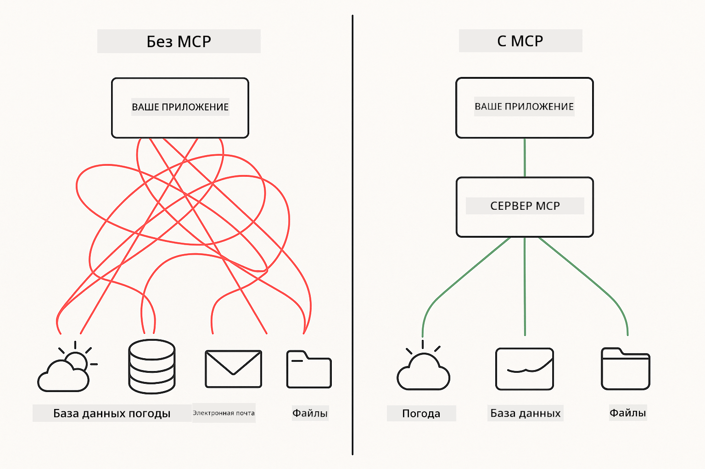
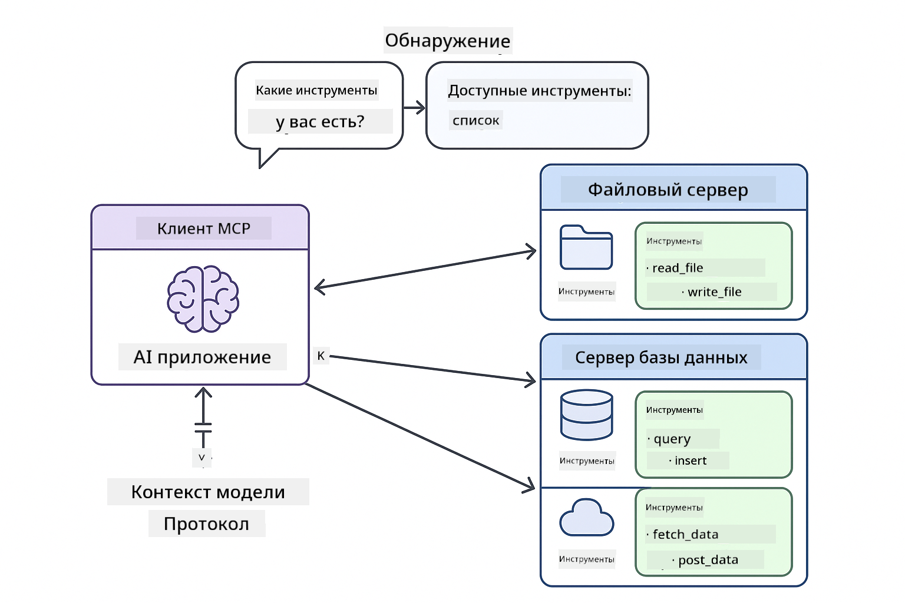

<!--
CO_OP_TRANSLATOR_METADATA:
{
  "original_hash": "c25ec1f10ef156c53e190cdf8b0711ab",
  "translation_date": "2025-12-13T17:36:42+00:00",
  "source_file": "05-mcp/README.md",
  "language_code": "ru"
}
-->
# Модуль 05: Протокол Контекста Модели (MCP)

## Содержание

- [Чему вы научитесь](../../../05-mcp)
- [Понимание MCP](../../../05-mcp)
- [Как работает MCP](../../../05-mcp)
  - [Архитектура клиент-сервер](../../../05-mcp)
  - [Обнаружение инструментов](../../../05-mcp)
  - [Механизмы транспорта](../../../05-mcp)
- [Требования](../../../05-mcp)
- [Что охватывает этот модуль](../../../05-mcp)
- [Быстрый старт](../../../05-mcp)
  - [Пример 1: Удалённый калькулятор (Streamable HTTP)](../../../05-mcp)
  - [Пример 2: Операции с файлами (Stdio)](../../../05-mcp)
  - [Пример 3: Анализ Git (Docker)](../../../05-mcp)
- [Ключевые концепции](../../../05-mcp)
  - [Выбор транспорта](../../../05-mcp)
  - [Обнаружение инструментов](../../../05-mcp)
  - [Управление сессиями](../../../05-mcp)
  - [Кроссплатформенные особенности](../../../05-mcp)
- [Когда использовать MCP](../../../05-mcp)
- [Экосистема MCP](../../../05-mcp)
- [Поздравляем!](../../../05-mcp)
  - [Что дальше?](../../../05-mcp)
- [Устранение неполадок](../../../05-mcp)

## Чему вы научитесь

Вы создали разговорный ИИ, освоили промпты, закрепили ответы на документах и создали агентов с инструментами. Но все эти инструменты были специально разработаны для вашего конкретного приложения. А что если вы могли бы дать вашему ИИ доступ к стандартизированной экосистеме инструментов, которые любой может создавать и делиться ими?

Протокол Контекста Модели (MCP) предоставляет именно это — стандартный способ для ИИ-приложений обнаруживать и использовать внешние инструменты. Вместо написания индивидуальных интеграций для каждого источника данных или сервиса, вы подключаетесь к MCP-серверам, которые предоставляют свои возможности в едином формате. Ваш ИИ-агент может автоматически обнаруживать и использовать эти инструменты.



*До MCP: сложные точечные интеграции. После MCP: один протокол, бесконечные возможности.*

## Понимание MCP

MCP решает фундаментальную проблему в разработке ИИ: каждая интеграция — индивидуальная. Хотите получить доступ к GitHub? Индивидуальный код. Хотите читать файлы? Индивидуальный код. Хотите запросить базу данных? Индивидуальный код. И ни одна из этих интеграций не работает с другими ИИ-приложениями.

MCP стандартизирует это. MCP-сервер предоставляет инструменты с чёткими описаниями и схемами. Любой MCP-клиент может подключиться, обнаружить доступные инструменты и использовать их. Создайте один раз, используйте везде.



*Архитектура Протокола Контекста Модели — стандартизированное обнаружение и выполнение инструментов*

## Как работает MCP

**Архитектура клиент-сервер**

MCP использует модель клиент-сервер. Серверы предоставляют инструменты — чтение файлов, запросы к базам данных, вызовы API. Клиенты (ваше ИИ-приложение) подключаются к серверам и используют их инструменты.

**Обнаружение инструментов**

Когда ваш клиент подключается к MCP-серверу, он спрашивает: «Какие у вас есть инструменты?» Сервер отвечает списком доступных инструментов с описаниями и схемами параметров. Ваш ИИ-агент затем решает, какие инструменты использовать на основе запросов пользователя.

**Механизмы транспорта**

MCP определяет два механизма транспорта: HTTP для удалённых серверов, Stdio для локальных процессов (включая Docker-контейнеры):


*Механизмы транспорта MCP: HTTP для удалённых серверов, Stdio для локальных процессов (включая Docker-контейнеры)*

**Streamable HTTP** — [StreamableHttpDemo.java](../../../05-mcp/src/main/java/com/example/langchain4j/mcp/StreamableHttpDemo.java)

Для удалённых серверов. Ваше приложение делает HTTP-запросы к серверу, работающему где-то в сети. Использует Server-Sent Events для связи в реальном времени.

```java
McpTransport httpTransport = new StreamableHttpMcpTransport.Builder()
    .url("http://localhost:3001/mcp")
    .timeout(Duration.ofSeconds(60))
    .logRequests(true)
    .logResponses(true)
    .build();
```

> **🤖 Попробуйте с [GitHub Copilot](https://github.com/features/copilot) Chat:** Откройте [`StreamableHttpDemo.java`](../../../05-mcp/src/main/java/com/example/langchain4j/mcp/StreamableHttpDemo.java) и спросите:
> - "Чем MCP отличается от прямой интеграции инструментов, как в Модуле 04?"
> - "Каковы преимущества использования MCP для совместного использования инструментов между приложениями?"
> - "Как обрабатывать сбои соединения или тайм-ауты с MCP-серверами?"

**Stdio** — [StdioTransportDemo.java](../../../05-mcp/src/main/java/com/example/langchain4j/mcp/StdioTransportDemo.java)

Для локальных процессов. Ваше приложение запускает сервер как подпроцесс и общается через стандартный ввод/вывод. Полезно для доступа к файловой системе или командных инструментов.

```java
McpTransport stdioTransport = new StdioMcpTransport.Builder()
    .command(List.of(
        npmCmd, "exec",
        "@modelcontextprotocol/server-filesystem@0.6.2",
        resourcesDir
    ))
    .logEvents(false)
    .build();
```

> **🤖 Попробуйте с [GitHub Copilot](https://github.com/features/copilot) Chat:** Откройте [`StdioTransportDemo.java`](../../../05-mcp/src/main/java/com/example/langchain4j/mcp/StdioTransportDemo.java) и спросите:
> - "Как работает транспорт Stdio и когда его использовать вместо HTTP?"
> - "Как LangChain4j управляет жизненным циклом запущенных MCP-серверов?"
> - "Каковы вопросы безопасности при предоставлении ИИ доступа к файловой системе?"

**Docker (использует Stdio)** — [GitRepositoryAnalyzer.java](../../../05-mcp/src/main/java/com/example/langchain4j/mcp/GitRepositoryAnalyzer.java)

Для контейнеризованных сервисов. Использует транспорт stdio для общения с Docker-контейнером через `docker run`. Хорошо подходит для сложных зависимостей или изолированных сред.

```java
McpTransport dockerTransport = new StdioMcpTransport.Builder()
    .command(List.of(
        "docker", "run",
        "-e", "GITHUB_PERSONAL_ACCESS_TOKEN=" + System.getenv("GITHUB_TOKEN"),
        "-v", volumeMapping,
        "-i", "mcp/git"
    ))
    .logEvents(true)
    .build();
```

> **🤖 Попробуйте с [GitHub Copilot](https://github.com/features/copilot) Chat:** Откройте [`GitRepositoryAnalyzer.java`](../../../05-mcp/src/main/java/com/example/langchain4j/mcp/GitRepositoryAnalyzer.java) и спросите:
> - "Как транспорт Docker изолирует MCP-серверы и каковы преимущества?"
> - "Как настроить монтирование томов для обмена данными между хостом и MCP-контейнерами?"
> - "Какие лучшие практики управления жизненным циклом MCP-серверов на базе Docker в продакшене?"

## Запуск примеров

### Требования

- Java 21+, Maven 3.9+
- Node.js 16+ и npm (для MCP-серверов)
- **Docker Desktop** — должен быть **запущен** для Примера 3 (не только установлен)
- Личный токен доступа GitHub, настроенный в файле `.env` (из Модуля 00)

> **Примечание:** Если вы ещё не настроили токен GitHub, смотрите [Модуль 00 - Быстрый старт](../00-quick-start/README.md) для инструкций.

> **⚠️ Пользователи Docker:** Перед запуском Примера 3 убедитесь, что Docker Desktop запущен, выполнив `docker ps`. Если видите ошибки подключения, запустите Docker Desktop и подождите ~30 секунд для инициализации.

## Быстрый старт

**Использование VS Code:** Просто кликните правой кнопкой мыши по любому демонстрационному файлу в Проводнике и выберите **"Run Java"**, или используйте конфигурации запуска из панели Run and Debug (убедитесь, что вы сначала добавили токен в файл `.env`).

**Использование Maven:** Также можно запускать из командной строки с примерами ниже.

**⚠️ Важно:** Некоторые примеры требуют предварительных условий (например, запуск MCP-сервера или сборка Docker-образов). Проверьте требования каждого примера перед запуском.

### Пример 1: Удалённый калькулятор (Streamable HTTP)

Демонстрирует интеграцию инструментов по сети.

**⚠️ Требование:** Сначала нужно запустить MCP-сервер (см. Терминал 1 ниже).

**Терминал 1 — Запуск MCP-сервера:**

**Bash:**
```bash
git clone https://github.com/modelcontextprotocol/servers.git
cd servers/src/everything
npm install
node dist/streamableHttp.js
```

**PowerShell:**
```powershell
git clone https://github.com/modelcontextprotocol/servers.git
cd servers/src/everything
npm install
node dist/streamableHttp.js
```

**Терминал 2 — Запуск примера:**

**Использование VS Code:** Кликните правой кнопкой по `StreamableHttpDemo.java` и выберите **"Run Java"**.

**Использование Maven:**

**Bash:**
```bash
export GITHUB_TOKEN=your_token_here
cd 05-mcp
mvn compile exec:java -Dexec.mainClass=com.example.langchain4j.mcp.StreamableHttpDemo
```

**PowerShell:**
```powershell
$env:GITHUB_TOKEN=your_token_here
cd 05-mcp
mvn --% compile exec:java -Dexec.mainClass=com.example.langchain4j.mcp.StreamableHttpDemo
```

Наблюдайте, как агент обнаруживает доступные инструменты, затем используйте калькулятор для выполнения сложения.

### Пример 2: Операции с файлами (Stdio)

Демонстрирует инструменты на базе локальных подпроцессов.

**✅ Предварительные условия отсутствуют** — MCP-сервер запускается автоматически.

**Использование VS Code:** Кликните правой кнопкой по `StdioTransportDemo.java` и выберите **"Run Java"**.

**Использование Maven:**

**Bash:**
```bash
export GITHUB_TOKEN=your_token_here
cd 05-mcp
mvn compile exec:java -Dexec.mainClass=com.example.langchain4j.mcp.StdioTransportDemo
```

**PowerShell:**
```powershell
$env:GITHUB_TOKEN=your_token_here
cd 05-mcp
mvn --% compile exec:java -Dexec.mainClass=com.example.langchain4j.mcp.StdioTransportDemo
```

Приложение автоматически запускает MCP-сервер файловой системы и читает локальный файл. Обратите внимание, как управление подпроцессом происходит за вас.

**Ожидаемый вывод:**
```
Assistant response: The content of the file is "Kaboom!".
```

### Пример 3: Анализ Git (Docker)

Демонстрирует серверы инструментов в контейнерах.

**⚠️ Требования:** 
1. **Docker Desktop должен быть ЗАПУЩЕН** (не только установлен)
2. **Пользователи Windows:** рекомендуется режим WSL 2 (Настройки Docker Desktop → Общие → "Use the WSL 2 based engine"). Режим Hyper-V требует ручной настройки общего доступа к файлам.
3. Сначала нужно собрать Docker-образ (см. Терминал 1 ниже)

**Проверьте, что Docker запущен:**

**Bash:**
```bash
docker ps  # Должен показывать список контейнеров, а не ошибку
```

**PowerShell:**
```powershell
docker ps  # Должен показывать список контейнеров, а не ошибку
```

Если видите ошибку типа "Cannot connect to Docker daemon" или "The system cannot find the file specified", запустите Docker Desktop и подождите инициализации (~30 секунд).

**Устранение неполадок:**
- Если ИИ сообщает об пустом репозитории или отсутствии файлов, монтирование тома (`-v`) не работает.
- **Пользователи Windows с Hyper-V:** добавьте каталог проекта в Настройки Docker Desktop → Ресурсы → Общий доступ к файлам, затем перезапустите Docker Desktop.
- **Рекомендуемое решение:** переключитесь на режим WSL 2 для автоматического общего доступа к файлам (Настройки → Общие → включить "Use the WSL 2 based engine").

**Терминал 1 — Сборка Docker-образа:**

**Bash:**
```bash
cd servers/src/git
docker build -t mcp/git .
```

**PowerShell:**
```powershell
cd servers/src/git
docker build -t mcp/git .
```

**Терминал 2 — Запуск анализатора:**

**Использование VS Code:** Кликните правой кнопкой по `GitRepositoryAnalyzer.java` и выберите **"Run Java"**.

**Использование Maven:**

**Bash:**
```bash
export GITHUB_TOKEN=your_token_here
cd 05-mcp
mvn compile exec:java -Dexec.mainClass=com.example.langchain4j.mcp.GitRepositoryAnalyzer
```

**PowerShell:**
```powershell
$env:GITHUB_TOKEN=your_token_here
cd 05-mcp
mvn --% compile exec:java -Dexec.mainClass=com.example.langchain4j.mcp.GitRepositoryAnalyzer
```

Приложение запускает Docker-контейнер, монтирует ваш репозиторий и анализирует структуру и содержимое репозитория через ИИ-агента.

## Ключевые концепции

**Выбор транспорта**

Выбирайте в зависимости от расположения ваших инструментов:
- Удалённые сервисы → Streamable HTTP
- Локальная файловая система → Stdio
- Сложные зависимости → Docker

**Обнаружение инструментов**

MCP-клиенты автоматически обнаруживают доступные инструменты при подключении. Ваш ИИ-агент видит описания инструментов и решает, какие использовать на основе запроса пользователя.

**Управление сессиями**

Транспорт Streamable HTTP поддерживает сессии, позволяя вести состояние при взаимодействии с удалёнными серверами. Транспорты Stdio и Docker обычно без состояния.

**Кроссплатформенные особенности**

Примеры автоматически учитывают различия платформ (различия команд Windows и Unix, преобразование путей для Docker). Это важно для продакшен-развёртываний в разных средах.

## Когда использовать MCP

**Используйте MCP, когда:**
- Хотите использовать существующие экосистемы инструментов
- Создаёте инструменты, которые будут использовать несколько приложений
- Интегрируете сторонние сервисы со стандартными протоколами
- Нужно менять реализации инструментов без изменения кода

**Используйте кастомные инструменты (Модуль 04), когда:**
- Создаёте функциональность, специфичную для приложения
- Важна производительность (MCP добавляет накладные расходы)
- Ваши инструменты просты и не будут переиспользоваться
- Нужен полный контроль над выполнением

## Экосистема MCP

Протокол Контекста Модели — открытый стандарт с растущей экосистемой:

- Официальные MCP-серверы для распространённых задач (файловая система, Git, базы данных)
- Серверы, созданные сообществом для различных сервисов
- Стандартизированные описания и схемы инструментов
- Совместимость между фреймворками (работает с любым MCP-клиентом)

Эта стандартизация означает, что инструменты, созданные для одного ИИ-приложения, работают с другими, создавая общую экосистему возможностей.

## Поздравляем!

Вы завершили курс LangChain4j для начинающих. Вы узнали:

- Как создавать разговорный ИИ с памятью (Модуль 01)
- Шаблоны проектирования промптов для разных задач (Модуль 02)
- Закрепление ответов на ваших документах с помощью RAG (Модуль 03)
- Создание ИИ-агентов с кастомными инструментами (Модуль 04)
- Интеграция стандартизированных инструментов через MCP (Модуль 05)

Теперь у вас есть база для создания производственных ИИ-приложений. Изученные концепции применимы независимо от конкретных фреймворков или моделей — это фундаментальные паттерны в инженерии ИИ.

### Что дальше?

После прохождения модулей изучите [Руководство по тестированию](../docs/TESTING.md), чтобы увидеть концепции тестирования LangChain4j в действии.

**Официальные ресурсы:**
- [Документация LangChain4j](https://docs.langchain4j.dev/) — подробные руководства и справочник API
- [GitHub LangChain4j](https://github.com/langchain4j/langchain4j) — исходный код и примеры
- [Учебники LangChain4j](https://docs.langchain4j.dev/tutorials/) — пошаговые руководства для различных сценариев

Спасибо за прохождение курса!

---

**Навигация:** [← Предыдущий: Модуль 04 - Инструменты](../04-tools/README.md) | [Назад к главной](../README.md)

---

## Устранение неполадок

### Синтаксис команды Maven в PowerShell
**Проблема**: Команды Maven завершаются с ошибкой `Unknown lifecycle phase ".mainClass=..."`

**Причина**: PowerShell интерпретирует `=` как оператор присваивания переменной, нарушая синтаксис свойств Maven

**Решение**: Используйте оператор остановки парсинга `--%` перед командой Maven:

**PowerShell:**
```powershell
mvn --% compile exec:java -Dexec.mainClass=com.example.langchain4j.mcp.StreamableHttpDemo
```

**Bash:**
```bash
mvn compile exec:java -Dexec.mainClass=com.example.langchain4j.mcp.StreamableHttpDemo
```

Оператор `--%` сообщает PowerShell передавать все последующие аргументы буквально Maven без интерпретации.

### Проблемы с подключением Docker

**Проблема**: Команды Docker завершаются с ошибкой "Cannot connect to Docker daemon" или "The system cannot find the file specified"

**Причина**: Docker Desktop не запущен или не полностью инициализирован

**Решение**: 
1. Запустите Docker Desktop
2. Подождите ~30 секунд для полной инициализации
3. Проверьте с помощью `docker ps` (должен показать список контейнеров, а не ошибку)
4. Затем выполните ваш пример

### Монтирование томов Docker в Windows

**Проблема**: Анализатор репозитория Git сообщает, что репозиторий пустой или файлов нет

**Причина**: Монтирование тома (`-v`) не работает из-за настроек общего доступа к файлам

**Решение**:
- **Рекомендуется:** Переключиться на режим WSL 2 (Настройки Docker Desktop → Общие → "Use the WSL 2 based engine")
- **Альтернатива (Hyper-V):** Добавьте каталог проекта в Настройки Docker Desktop → Ресурсы → Общий доступ к файлам, затем перезапустите Docker Desktop

---

<!-- CO-OP TRANSLATOR DISCLAIMER START -->
**Отказ от ответственности**:  
Этот документ был переведен с помощью сервиса автоматического перевода [Co-op Translator](https://github.com/Azure/co-op-translator). Несмотря на наши усилия по обеспечению точности, имейте в виду, что автоматический перевод может содержать ошибки или неточности. Оригинальный документ на его исходном языке следует считать авторитетным источником. Для получения критически важной информации рекомендуется использовать профессиональный перевод, выполненный человеком. Мы не несем ответственности за любые недоразумения или неправильные толкования, возникшие в результате использования данного перевода.
<!-- CO-OP TRANSLATOR DISCLAIMER END -->