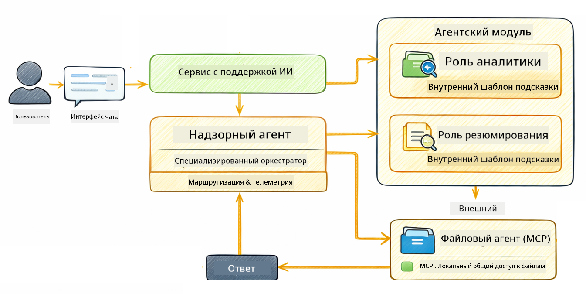

<!--
CO_OP_TRANSLATOR_METADATA:
{
  "original_hash": "f89f4c106d110e4943c055dd1a2f1dff",
  "translation_date": "2025-12-30T19:57:54+00:00",
  "source_file": "05-mcp/README.md",
  "language_code": "ru"
}
-->
# Module 05: Model Context Protocol (MCP)

## Table of Contents

- [Что вы узнаете](../../../05-mcp)
- [Что такое MCP?](../../../05-mcp)
- [Как работает MCP](../../../05-mcp)
- [Agentic Module](../../../05-mcp)
- [Запуск примеров](../../../05-mcp)
  - [Требования](../../../05-mcp)
- [Быстрый старт](../../../05-mcp)
  - [Операции с файлами (Stdio)](../../../05-mcp)
  - [Supervisor Agent](../../../05-mcp)
    - [Понимание вывода](../../../05-mcp)
    - [Объяснение возможностей Agentic Module](../../../05-mcp)
- [Ключевые концепции](../../../05-mcp)
- [Поздравляем!](../../../05-mcp)
  - [Что дальше?](../../../05-mcp)

## What You'll Learn

Вы уже создавали разговорный ИИ, освоили промпты, научились подкреплять ответы документами и создавали агентов с инструментами. Но все эти инструменты были сделаны специально для вашего приложения. А что если вы могли бы предоставить вашему ИИ доступ к стандартизованной экосистеме инструментов, которые любой может создать и поделиться ими? В этом модуле вы узнаете, как это сделать с помощью Model Context Protocol (MCP) и модуля agentic в LangChain4j. Сначала мы показываем простой MCP-читалку файлов, а затем демонстрируем, как её легко интегрировать в сложные agentic-воркфлоу с использованием шаблона Supervisor Agent.

## What is MCP?

Model Context Protocol (MCP) предоставляет именно это — стандартный способ для AI-приложений обнаруживать и использовать внешние инструменты. Вместо того чтобы писать собственные интеграции для каждого источника данных или сервиса, вы подключаетесь к MCP-серверам, которые раскрывают свои возможности в согласованном формате. Ваш агент ИИ затем может автоматически обнаруживать и использовать эти инструменты.


*До MCP: сложные точечные интеграции. После MCP: один протокол, бесконечные возможности.*

MCP решает фундаментальную проблему в разработке ИИ: каждая интеграция — индивидуальна. Хотите получить доступ к GitHub? Пишите кастомный код. Хотите читать файлы? Кастомный код. Хотите запросить базу данных? Кастомный код. И ни одна из этих интеграций не работает с другими AI-приложениями.

MCP стандартизирует это. MCP-сервер раскрывает инструменты с понятными описаниями и схемами параметров. Любой MCP-клиент может подключиться, обнаружить доступные инструменты и использовать их. Напишите один раз — используйте везде.


*Архитектура Model Context Protocol — стандартизованное обнаружение и выполнение инструментов*

## How MCP Works

**Архитектура сервер-клиент**

MCP использует модель клиент-сервер. Серверы предоставляют инструменты — чтение файлов, запросы к базам данных, вызовы API. Клиенты (ваше AI-приложение) подключаются к серверам и используют их инструменты.

Чтобы использовать MCP с LangChain4j, добавьте эту зависимость Maven:

```xml
<dependency>
    <groupId>dev.langchain4j</groupId>
    <artifactId>langchain4j-mcp</artifactId>
    <version>${langchain4j.version}</version>
</dependency>
```

**Обнаружение инструментов**

Когда ваш клиент подключается к MCP-серверу, он спрашивает: "Какие у тебя есть инструменты?" Сервер отвечает списком доступных инструментов, каждый с описаниями и схемами параметров. Ваш агент ИИ затем может решить, какие инструменты использовать на основе запроса пользователя.

**Механизмы транспорта**

MCP поддерживает различные механизмы транспорта. В этом модуле демонстрируется транспорт Stdio для локальных процессов:


*Механизмы транспорта MCP: HTTP для удалённых серверов, Stdio для локальных процессов*

**Stdio** - [StdioTransportDemo.java](../../../05-mcp/src/main/java/com/example/langchain4j/mcp/StdioTransportDemo.java)

Для локальных процессов. Ваше приложение порождает сервер как подпроцесс и общается через стандартный ввод/вывод. Полезно для доступа к файловой системе или командным утилитам.

```java
McpTransport stdioTransport = new StdioMcpTransport.Builder()
    .command(List.of(
        npmCmd, "exec",
        "@modelcontextprotocol/server-filesystem@2025.12.18",
        resourcesDir
    ))
    .logEvents(false)
    .build();
```

> **🤖 Попробуйте с [GitHub Copilot](https://github.com/features/copilot) Chat:** Откройте [`StdioTransportDemo.java`](../../../05-mcp/src/main/java/com/example/langchain4j/mcp/StdioTransportDemo.java) и задайте вопросы:
> - "Как работает транспорт Stdio и когда его следует использовать вместо HTTP?"
> - "Как LangChain4j управляет жизненным циклом порождаемых процессов MCP-сервера?"
> - "Каковы последствия для безопасности при предоставлении ИИ доступа к файловой системе?"

## The Agentic Module

В то время как MCP предоставляет стандартизованные инструменты, модуль **agentic** LangChain4j предоставляет декларативный способ создавать агентов, которые оркестрируют эти инструменты. Аннотация `@Agent` и `AgenticServices` позволяют определять поведение агента через интерфейсы, а не императивный код.

В этом модуле вы изучите шаблон **Supervisor Agent** — продвинутый подход agentic AI, где "супервайзер" динамически решает, каких суб-агентов вызывать на основе запроса пользователя. Мы объединим оба понятия, предоставив одному из наших суб-агентов возможность доступа к файловой системе через MCP.

Чтобы использовать agentic-модуль, добавьте эту зависимость Maven:

```xml
<dependency>
    <groupId>dev.langchain4j</groupId>
    <artifactId>langchain4j-agentic</artifactId>
    <version>${langchain4j.mcp.version}</version>
</dependency>
```

> **⚠️ Экспериментально:** модуль `langchain4j-agentic` является **экспериментальным** и может измениться. Стабильный способ создания AI-ассистентов по-прежнему — `langchain4j-core` с кастомными инструментами (Module 04).

## Running the Examples

### Преимущества

- Java 21+, Maven 3.9+
- Node.js 16+ и npm (для MCP-серверов)
- Переменные окружения, настроенные в файле `.env` (из корневой директории):
  - **Для StdioTransportDemo:** `GITHUB_TOKEN` (GitHub Personal Access Token)
  - **Для SupervisorAgentDemo:** `AZURE_OPENAI_ENDPOINT`, `AZURE_OPENAI_API_KEY`, `AZURE_OPENAI_DEPLOYMENT` (как в Modules 01-04)

> **Примечание:** Если вы ещё не настроили переменные окружения, смотрите [Module 00 - Quick Start](../00-quick-start/README.md) для инструкций, или скопируйте `.env.example` в `.env` в корневой директории и заполните свои значения.

## Quick Start

**Использование VS Code:** Просто кликните правой кнопкой мыши по любому демонстрационному файлу в проводнике и выберите **"Run Java"**, или используйте конфигурации запуска из панели Run and Debug (убедитесь, что вы сначала добавили токен в файл `.env`).

**Использование Maven:** Альтернативно, вы можете запустить из командной строки примеры ниже.

### File Operations (Stdio)

Это демонстрирует инструменты на основе локальных подпроцессов.

**✅ Предварительные требования отсутствуют** — MCP-сервер запускается автоматически.

**Использование VS Code:** Кликните правой кнопкой по `StdioTransportDemo.java` и выберите **"Run Java"**.

**Использование Maven:**

**Bash:**
```bash
export GITHUB_TOKEN=your_token_here
cd 05-mcp
mvn compile exec:java -Dexec.mainClass=com.example.langchain4j.mcp.StdioTransportDemo
```

**PowerShell:**
```powershell
$env:GITHUB_TOKEN=your_token_here
cd 05-mcp
mvn --% compile exec:java -Dexec.mainClass=com.example.langchain4j.mcp.StdioTransportDemo
```

Приложение автоматически порождает MCP-сервер файловой системы и читает локальный файл. Обратите внимание, как управление подпроцессами выполняется за вас.

**Ожидаемый вывод:**
```
Assistant response: The file provides an overview of LangChain4j, an open-source Java library
for integrating Large Language Models (LLMs) into Java applications...
```

### Supervisor Agent




Шаблон **Supervisor Agent** — это **гибкая** форма agentic AI. В отличие от детерминированных воркфлоу (последовательные, циклы, параллельные), Супервайзер использует LLM, чтобы автономно решать, каких агентов вызывать на основе запроса пользователя.

**Комбинация Supervisor и MCP:** В этом примере мы даём `FileAgent` доступ к инструментам файловой системы MCP через `toolProvider(mcpToolProvider)`. Когда пользователь просит "прочитать и проанализировать файл", Супервайзер анализирует запрос и генерирует план исполнения. Затем он направляет запрос `FileAgent`, который использует инструмент MCP `read_file` для получения содержимого. Супервайзер передаёт это содержимое `AnalysisAgent` для интерпретации и при необходимости вызывает `SummaryAgent`, чтобы сократить результаты.

Это демонстрирует, как инструменты MCP бесшовно интегрируются в agentic-воркфлоу — Супервайсеру не нужно знать *как* читаются файлы, только что `FileAgent` умеет это. Супервайзер динамически адаптируется к разным типам запросов и возвращает либо ответ последнего агента, либо сводку всех операций.

**Рекомендуется использовать стартовые скрипты:**

Стартовые скрипты автоматически загружают переменные окружения из корневого файла `.env`:

**Bash:**
```bash
cd 05-mcp
chmod +x start.sh
./start.sh
```

**PowerShell:**
```powershell
cd 05-mcp
.\start.ps1
```

**Использование VS Code:** Кликните правой кнопкой по `SupervisorAgentDemo.java` и выберите **"Run Java"** (убедитесь, что ваш файл `.env` настроен).

**Как работает Супервайзер:**

```java
// Определите несколько агентов с конкретными возможностями
FileAgent fileAgent = AgenticServices.agentBuilder(FileAgent.class)
        .chatModel(model)
        .toolProvider(mcpToolProvider)  // Имеет инструменты MCP для операций с файлами
        .build();

AnalysisAgent analysisAgent = AgenticServices.agentBuilder(AnalysisAgent.class)
        .chatModel(model)
        .build();

SummaryAgent summaryAgent = AgenticServices.agentBuilder(SummaryAgent.class)
        .chatModel(model)
        .build();

// Создайте Супервизора, который координирует этих агентов
SupervisorAgent supervisor = AgenticServices.supervisorBuilder()
        .chatModel(model)  // Модель "planner"
        .subAgents(fileAgent, analysisAgent, summaryAgent)
        .responseStrategy(SupervisorResponseStrategy.SUMMARY)
        .build();

// Супервизор автономно решает, каких агентов вызывать
// Просто передайте запрос на естественном языке - LLM планирует выполнение
String response = supervisor.invoke("Read the file at /path/file.txt and analyze it");
```

См. [SupervisorAgentDemo.java](../../../05-mcp/src/main/java/com/example/langchain4j/mcp/SupervisorAgentDemo.java) для полного примера.

> **🤖 Попробуйте с [GitHub Copilot](https://github.com/features/copilot) Chat:** Откройте [`SupervisorAgentDemo.java`](../../../05-mcp/src/main/java/com/example/langchain4j/mcp/SupervisorAgentDemo.java) и задайте:
> - "Как Супервайзер решает, каких агентов вызвать?"
> - "В чем разница между шаблонами Supervisor и Sequential?"
> - "Как можно настроить поведение планирования Супервайзера?"

#### Understanding the Output

Когда вы запустите демо, вы увидите структурированный пошаговый разбор того, как Супервайзер оркестрирует несколько агентов. Вот что означает каждая секция:

```
======================================================================
  SUPERVISOR AGENT DEMO
======================================================================

This demo shows how a Supervisor Agent orchestrates multiple specialized agents.
The Supervisor uses an LLM to decide which agent to call based on the task.
```

**Заголовок** представляет демо и объясняет основную концепцию: Супервайзер использует LLM (а не жестко запрограммированные правила) для решения, каких агентов вызывать.

```
--- AVAILABLE AGENTS -------------------------------------------------
  [FILE]     FileAgent     - Reads files using MCP filesystem tools
  [ANALYZE]  AnalysisAgent - Analyzes content for structure, tone, and themes
  [SUMMARY]  SummaryAgent  - Creates concise summaries of content
```

**Доступные агенты** показывает три специализированных агента, из которых Супервайзер может выбирать. Каждый агент имеет конкретную способность:
- **FileAgent** может читать файлы, используя инструменты MCP (внешняя возможность)
- **AnalysisAgent** анализирует содержимое (чисто LLM-возможность)
- **SummaryAgent** создаёт сводки (чисто LLM-возможность)

```
--- USER REQUEST -----------------------------------------------------
  "Read the file at .../file.txt and analyze what it's about"
```

**Запрос пользователя** показывает, что было запрошено. Супервайзеру нужно разобрать это и решить, каких агентов вызвать.

```
--- SUPERVISOR ORCHESTRATION -----------------------------------------
  The Supervisor will now decide which agents to invoke and in what order...

  +-- STEP 1: Supervisor chose -> FileAgent (reading file via MCP)
  |
  |   Input: .../file.txt
  |
  |   Result: LangChain4j is an open-source Java library designed to simplify...
  +-- [OK] FileAgent (reading file via MCP) completed

  +-- STEP 2: Supervisor chose -> AnalysisAgent (analyzing content)
  |
  |   Input: LangChain4j is an open-source Java library...
  |
  |   Result: Structure: The content is organized into clear paragraphs that int...
  +-- [OK] AnalysisAgent (analyzing content) completed
```

**Оркестрация Супервайзера** — здесь происходит волшебство. Смотрите, как:
1. Супервайзер **выбрал FileAgent сначала**, потому что в запросе было упоминание "прочитать файл"
2. FileAgent использовал инструмент MCP `read_file` для получения содержимого файла
3. Затем Супервайзер **выбрал AnalysisAgent** и передал ему содержимое файла
4. AnalysisAgent проанализировал структуру, тональность и темы

Обратите внимание, что Супервайзер принимал эти решения **автономно** на основе запроса пользователя — никаких жестко запрограммированных воркфлоу!

**Итоговый ответ** — это синтезированный ответ Супервайзера, объединяющий выводы всех агентов, которых он вызвал. Пример выводит scope агентной системы, показывая сводку и результаты анализа, сохранённые каждым агентом.

```
--- FINAL RESPONSE ---------------------------------------------------
I read the contents of the file and analyzed its structure, tone, and key themes.
The file introduces LangChain4j as an open-source Java library for integrating
large language models...

--- AGENTIC SCOPE (Shared Memory) ------------------------------------
  Agents store their results in a shared scope for other agents to use:
  * summary: LangChain4j is an open-source Java library...
  * analysis: Structure: The content is organized into clear paragraphs that in...
```

### Explanation of Agentic Module Features

В примере демонстрируются несколько продвинутых возможностей agentic-модуля. Давайте ближе рассмотрим Agentic Scope и Agent Listeners.

**Agentic Scope** показывает общую память, куда агенты сохраняют свои результаты с помощью `@Agent(outputKey="...")`. Это позволяет:
- Позже другим агентам получить доступ к выводам предыдущих агентов
- Супервайзеру синтезировать итоговый ответ
- Вам инспектировать то, что произвёл каждый агент

```java
ResultWithAgenticScope<String> result = supervisor.invokeWithAgenticScope(request);
AgenticScope scope = result.agenticScope();
String story = scope.readState("story");
List<AgentInvocation> history = scope.agentInvocations("analysisAgent");
```

**Agent Listeners** позволяют мониторить и отлаживать выполнение агентов. Пошаговый вывод, который вы видите в демо, приходит от AgentListener, который встраивается в каждое вызов агента:
- **beforeAgentInvocation** - Вызывается, когда Супервайзер выбирает агента, позволяя вам увидеть, какой агент был выбран и почему
- **afterAgentInvocation** - Вызывается, когда агент завершает работу, показывая его результат
- **inheritedBySubagents** - Если true, слушатель мониторит всех агентов в иерархии

```java
AgentListener monitor = new AgentListener() {
    private int step = 0;
    
    @Override
    public void beforeAgentInvocation(AgentRequest request) {
        step++;
        System.out.println("  +-- STEP " + step + ": " + request.agentName());
    }
    
    @Override
    public void afterAgentInvocation(AgentResponse response) {
        System.out.println("  +-- [OK] " + response.agentName() + " completed");
    }
    
    @Override
    public boolean inheritedBySubagents() {
        return true; // Распространить на всех подагентов
    }
};
```

Помимо шаблона Supervisor, модуль `langchain4j-agentic` предоставляет несколько мощных шаблонов воркфлоу и функций:

| Pattern | Description | Use Case |
|---------|-------------|----------|
| **Sequential** | Выполнять агентов по порядку, вывод передаётся к следующему | Конвейеры: исследование → анализ → отчёт |
| **Parallel** | Запускать агентов одновременно | Независимые задачи: погода + новости + акции |
| **Loop** | Итерация до выполнения условия | Оценка качества: уточнять до score ≥ 0.8 |
| **Conditional** | Маршрутизация на основе условий | Классификация → перенаправление к специализированному агенту |
| **Human-in-the-Loop** | Добавление контрольных точек с участием человека | Рабочие процессы согласования, ревью контента |

## Key Concepts

**MCP** идеален, когда вы хотите использовать существующие экосистемы инструментов, создавать инструменты, которыми могут пользоваться несколько приложений, интегрировать сторонние сервисы через стандартизованные протоколы или менять реализации инструментов без изменения кода.

**Agentic Module** лучше всего подходит, когда вы хотите декларативные определения агентов с аннотациями `@Agent`, нужен оркестратор воркфлоу (последовательный, цикл, параллельный), предпочитаете дизайн агентов на основе интерфейсов вместо императивного кода, или когда вы комбинируете несколько агентов, которые обмениваются выводами через `outputKey`.

**Шаблон Supervisor Agent** особенно полезен, когда воркфлоу заранее непредсказуем и вы хотите, чтобы LLM принимал решения, когда у вас есть несколько специализированных агентов, требующих динамической оркестрации, при создании разговорных систем, которые направляют к разным возможностям, или когда вам нужно максимально гибкое и адаптивное поведение агента.

## Congratulations!

Вы завершили курс LangChain4j для начинающих. Вы узнали:

- Как строить разговорный ИИ с памятью (Module 01)
- Шаблоны промпт-энжиниринга для различных задач (Module 02)
- Закрепление ответов в ваших документах с помощью RAG (Module 03)
- Создание базовых AI-агентов (ассистентов) с кастомными инструментами (Module 04)
- Интеграция стандартизированных инструментов с модулями LangChain4j MCP и Agentic (Модуль 05)

### Что дальше?

После завершения модулей ознакомьтесь с [Руководством по тестированию](../docs/TESTING.md), чтобы увидеть концепции тестирования LangChain4j в действии.

**Официальные ресурсы:**
- [Документация LangChain4j](https://docs.langchain4j.dev/) - Полные руководства и справочник API
- [Репозиторий LangChain4j на GitHub](https://github.com/langchain4j/langchain4j) - Исходный код и примеры
- [Учебники LangChain4j](https://docs.langchain4j.dev/tutorials/) - Пошаговые руководства для различных сценариев использования

Спасибо за прохождение этого курса!

---

**Навигация:** [← Предыдущий: Модуль 04 - Инструменты](../04-tools/README.md) | [Назад к главной](../README.md)

---

<!-- CO-OP TRANSLATOR DISCLAIMER START -->
Отказ от ответственности:
Этот документ был переведён с помощью сервиса машинного перевода [Co-op Translator](https://github.com/Azure/co-op-translator). Хотя мы стремимся к точности, имейте в виду, что автоматические переводы могут содержать ошибки или неточности. Оригинальный документ на его исходном языке следует считать авторитетным источником. Для критически важной информации рекомендуется привлекать профессионального переводчика. Мы не несем ответственности за любые недоразумения или неверные толкования, возникшие в результате использования данного перевода.
<!-- CO-OP TRANSLATOR DISCLAIMER END -->