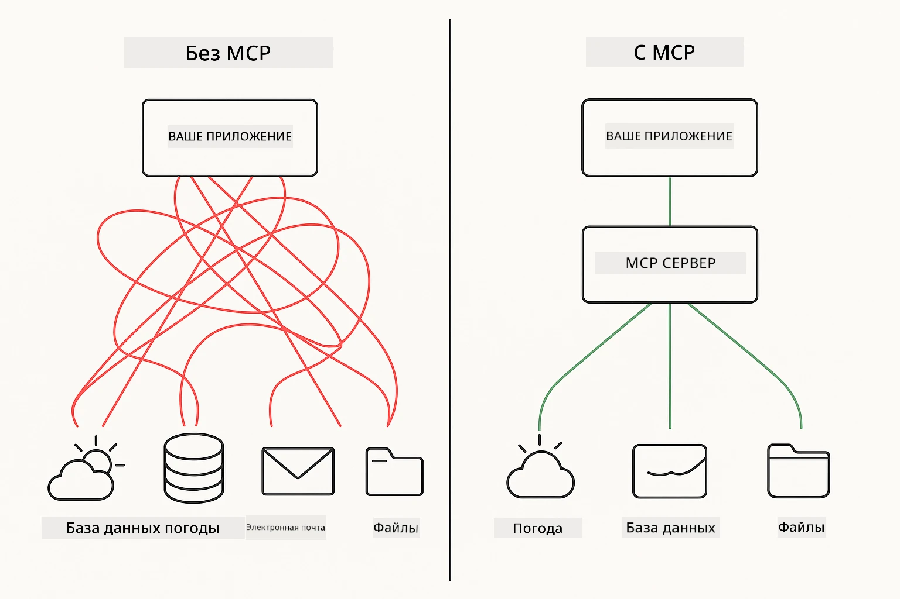
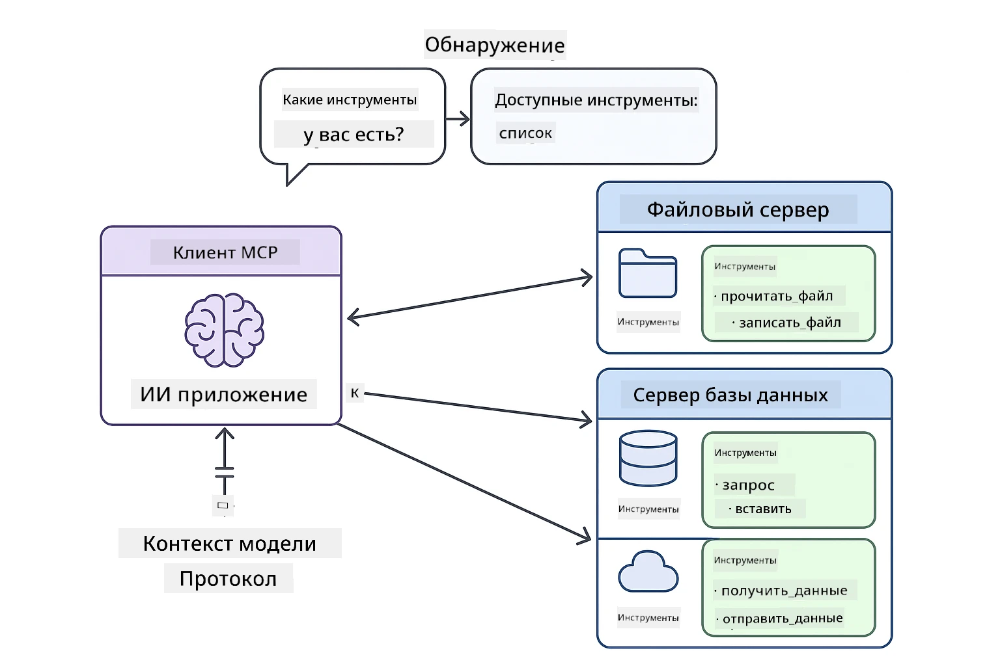
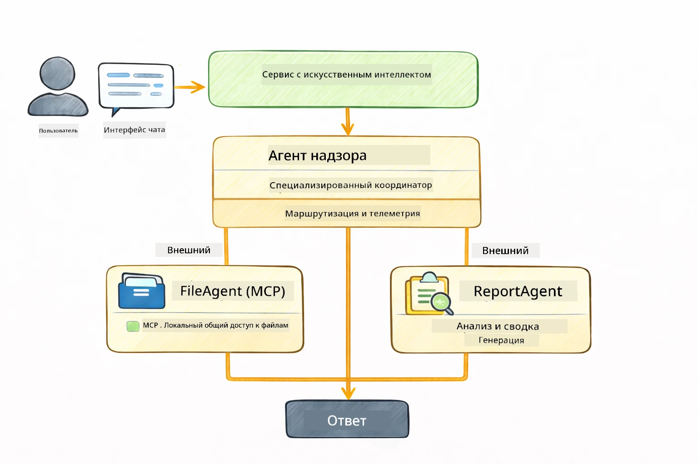

<!--
CO_OP_TRANSLATOR_METADATA:
{
  "original_hash": "6c816d130a1fa47570c11907e72d84ae",
  "translation_date": "2026-01-05T21:32:58+00:00",
  "source_file": "05-mcp/README.md",
  "language_code": "ru"
}
-->
# Модуль 05: Протокол контекста модели (MCP)

## Оглавление

- [Чему вы научитесь](../../../05-mcp)
- [Что такое MCP?](../../../05-mcp)
- [Как работает MCP](../../../05-mcp)
- [Агентский модуль](../../../05-mcp)
- [Запуск примеров](../../../05-mcp)
  - [Требования](../../../05-mcp)
- [Быстрый старт](../../../05-mcp)
  - [Операции с файлами (Stdio)](../../../05-mcp)
  - [Супервизорский агент](../../../05-mcp)
    - [Понимание вывода](../../../05-mcp)
    - [Стратегии ответа](../../../05-mcp)
    - [Объяснение функций агентского модуля](../../../05-mcp)
- [Ключевые концепции](../../../05-mcp)
- [Поздравляем!](../../../05-mcp)
  - [Что дальше?](../../../05-mcp)

## Чему вы научитесь

Вы создали разговорный ИИ, освоили подсказки, основанные на документах ответы и создали агентов с инструментами. Но все эти инструменты были разработаны специально для вашего приложения. А что если бы вы могли предоставить вашему ИИ доступ к стандартизированной экосистеме инструментов, которые может создавать и использовать кто угодно? В этом модуле вы узнаете, как сделать именно это с помощью Протокола контекста модели (MCP) и агентского модуля LangChain4j. Сначала мы покажем простой MCP-читалку файлов, а затем продемонстрируем, как легко её интегрировать в продвинутые агентские рабочие процессы с использованием паттерна Супервизорского агента.

## Что такое MCP?

Протокол контекста модели (MCP) обеспечивает именно это — стандартный способ для ИИ-приложений обнаруживать и использовать внешние инструменты. Вместо того чтобы писать кастомные интеграции для каждого источника данных или сервиса, вы подключаетесь к MCP-серверам, которые предоставляют свои возможности в едином формате. Ваш ИИ-агент может автоматически обнаруживать и использовать эти инструменты.



*До MCP: Сложные точечные интеграции. После MCP: Один протокол — бесконечные возможности.*

MCP решает фундаментальную проблему разработки ИИ: каждая интеграция — уникальна. Хотите получить доступ к GitHub? Кастомный код. Хотите читать файлы? Кастомный код. Хотите делать запросы к базе данных? Кастомный код. И ни одна из этих интеграций не работает с другими ИИ-приложениями.

MCP стандартизирует это. MCP-серверы описывают инструменты с чёткими описаниями и схемами параметров. Любой MCP-клиент может подключиться, обнаружить доступные инструменты и использовать их. Создал один раз — используй везде.



*Архитектура Протокола контекста модели — стандартизированное обнаружение и выполнение инструментов*

## Как работает MCP

**Серверно-клиентская архитектура**

MCP использует модель клиент-сервер. Серверы предоставляют инструменты — чтение файлов, запросы к базам, вызовы API. Клиенты (ваше ИИ-приложение) подключаются к серверам и используют их инструменты.

Чтобы использовать MCP с LangChain4j, добавьте эту зависимость Maven:

```xml
<dependency>
    <groupId>dev.langchain4j</groupId>
    <artifactId>langchain4j-mcp</artifactId>
    <version>${langchain4j.version}</version>
</dependency>
```

**Обнаружение инструментов**

Когда ваш клиент подключается к MCP-серверу, он спрашивает: "Какие у тебя есть инструменты?" Сервер отвечает списком доступных инструментов с описаниями и схемами параметров. Ваш ИИ-агент затем решает, какие инструменты использовать, основываясь на запросах пользователя.

**Механизмы транспорта**

MCP поддерживает разные механизмы транспорта. В этом модуле демонстрируется транспорт Stdio для локальных процессов:


*Механизмы транспорта MCP: HTTP для удалённых серверов, Stdio для локальных процессов*

**Stdio** — [StdioTransportDemo.java](../../../05-mcp/src/main/java/com/example/langchain4j/mcp/StdioTransportDemo.java)

Для локальных процессов. Ваше приложение запускает сервер как подпроцесс и общается с ним через стандартный ввод/вывод. Полезно для доступа к файловой системе или инструментам командной строки.

```java
McpTransport stdioTransport = new StdioMcpTransport.Builder()
    .command(List.of(
        npmCmd, "exec",
        "@modelcontextprotocol/server-filesystem@2025.12.18",
        resourcesDir
    ))
    .logEvents(false)
    .build();
```

> **🤖 Попробуйте с [GitHub Copilot](https://github.com/features/copilot) Chat:** Откройте [`StdioTransportDemo.java`](../../../05-mcp/src/main/java/com/example/langchain4j/mcp/StdioTransportDemo.java) и спросите:
> - "Как работает транспорт Stdio и когда его использовать вместо HTTP?"
> - "Как LangChain4j управляет жизненным циклом запущенных MCP-серверных процессов?"
> - "Какие риски безопасности при предоставлении ИИ доступа к файловой системе?"

## Агентский модуль

В то время как MCP предоставляет стандартизованные инструменты, агентский модуль LangChain4j даёт декларативный способ создания агентов, оркеструющих эти инструменты. Аннотация `@Agent` и `AgenticServices` позволяют определять поведение агента через интерфейсы вместо императивного кода.

В этом модуле вы изучите паттерн **Супервизорский агент** — продвинутый подход агентского ИИ, где агент "супервизор" динамически решает, каких подагентов вызывать в зависимости от запроса пользователя. Мы объединим эти концепции, дав одному из подагентов возможности доступа к файлам через MCP.

Для использования агентского модуля добавьте эту зависимость Maven:

```xml
<dependency>
    <groupId>dev.langchain4j</groupId>
    <artifactId>langchain4j-agentic</artifactId>
    <version>${langchain4j.mcp.version}</version>
</dependency>
```

> **⚠️ Экспериментально:** Модуль `langchain4j-agentic` является **экспериментальным** и может изменяться. Стабильным способом построения ИИ-помощников остаётся `langchain4j-core` с кастомными инструментами (Модуль 04).

## Запуск примеров

### Требования

- Java 21+, Maven 3.9+
- Node.js 16+ и npm (для MCP-серверов)
- Переменные окружения, настроенные в файле `.env` (в корневой папке):
  - `AZURE_OPENAI_ENDPOINT`, `AZURE_OPENAI_API_KEY`, `AZURE_OPENAI_DEPLOYMENT` (как в Модулях 01-04)

> **Примечание:** Если вы ещё не настроили переменные окружения, смотрите [Модуль 00 — Быстрый старт](../00-quick-start/README.md) для инструкций или скопируйте `.env.example` в `.env` в корне и заполните свои значения.

## Быстрый старт

**Использование VS Code:** Просто кликните правой кнопкой на любом демонстрационном файле в Проводнике и выберите **"Run Java"**, или используйте конфигурации запуска из панели Run and Debug (убедитесь, что ваш токен добавлен в `.env`).

**Использование Maven:** Также можно запускать из командной строки, используя примеры ниже.

### Операции с файлами (Stdio)

Демонстрируется работа с локальными инструментами на базе подпроцессов.

**✅ Никаких дополнительных настроек не требуется** — MCP-сервер запускается автоматически.

**Использование стартовых скриптов (рекомендуется):**

Стартовые скрипты автоматически загружают переменные окружения из корневого `.env` файла:

**Bash:**
```bash
cd 05-mcp
chmod +x start-stdio.sh
./start-stdio.sh
```

**PowerShell:**
```powershell
cd 05-mcp
.\start-stdio.ps1
```

**Использование VS Code:** Нажмите правой кнопкой на `StdioTransportDemo.java` и выберите **"Run Java"** (убедитесь, что `.env` настроен).

Приложение автоматически запускает MCP-сервер для файловой системы и читает локальный файл. Обратите внимание, как управление подпроцессом происходит за вас.

**Ожидаемый вывод:**
```
Assistant response: The file provides an overview of LangChain4j, an open-source Java library
for integrating Large Language Models (LLMs) into Java applications...
```

### Супервизорский агент

Паттерн **Супервизорского агента** — это **гибкая** форма агентского ИИ. Супервизор использует LLM для автономного решения, каких агентов вызывать в зависимости от запроса пользователя. В следующем примере мы объединяем MCP-инструменты доступа к файлам с LLM-агентом, создавая рабочий процесс чтения файла → отчёт.

В демо `FileAgent` читает файл через MCP-инструменты файловой системы, а `ReportAgent` генерирует структурированный отчёт с исполнительным резюме (1 предложение), 3 ключевыми пунктами и рекомендациями. Супервизор автоматически оркестрирует этот процесс:



```
┌─────────────┐      ┌──────────────┐
│  FileAgent  │ ───▶ │ ReportAgent  │
│ (MCP tools) │      │  (pure LLM)  │
└─────────────┘      └──────────────┘
   outputKey:           outputKey:
  'fileContent'         'report'
```

Каждый агент сохраняет свой вывод в **Agentic Scope** (общая память), позволяя последующим агентам использовать результаты предыдущих. Это демонстрирует, как MCP-инструменты легко интегрируются в агентские рабочие процессы — Супервизору не нужно знать *как* читаются файлы, достаточно, что `FileAgent` может это делать.

#### Запуск демо

Стартовые скрипты автоматически подгружают переменные окружения из корневого `.env` файла:

**Bash:**
```bash
cd 05-mcp
chmod +x start-supervisor.sh
./start-supervisor.sh
```

**PowerShell:**
```powershell
cd 05-mcp
.\start-supervisor.ps1
```

**Использование VS Code:** Нажмите правой кнопкой на `SupervisorAgentDemo.java` и выберите **"Run Java"** (убедитесь, что `.env` настроен).

#### Как работает Супервизор

```java
// Шаг 1: FileAgent читает файлы с помощью инструментов MCP
FileAgent fileAgent = AgenticServices.agentBuilder(FileAgent.class)
        .chatModel(model)
        .toolProvider(mcpToolProvider)  // Имеет инструменты MCP для операций с файлами
        .build();

// Шаг 2: ReportAgent генерирует структурированные отчеты
ReportAgent reportAgent = AgenticServices.agentBuilder(ReportAgent.class)
        .chatModel(model)
        .build();

// Supervisor организует процесс работы от файла к отчету
SupervisorAgent supervisor = AgenticServices.supervisorBuilder()
        .chatModel(model)
        .subAgents(fileAgent, reportAgent)
        .responseStrategy(SupervisorResponseStrategy.LAST)  // Возвращает окончательный отчет
        .build();

// Supervisor решает, каких агентов вызвать на основе запроса
String response = supervisor.invoke("Read the file at /path/file.txt and generate a report");
```

#### Стратегии ответа

При настройке `SupervisorAgent` вы указываете, как формулировать окончательный ответ пользователю после выполнения подагентами их задач. Доступные стратегии:

| Стратегия | Описание |
|----------|-------------|
| **LAST** | Супервизор возвращает вывод последнего вызванного подагента или инструмента. Полезно, когда последний агент в рабочем процессе специально создан для формирования полного финального ответа (например, "агент-резюме" в исследовательском конвейере). |
| **SUMMARY** | Супервизор использует свой внутренний языковой модуль (LLM) для создания сводки всего взаимодействия и всех результатов подагентов и возвращает эту сводку как финальный ответ. Предоставляет пользователю чистый, агрегированный ответ. |
| **SCORED** | Система использует внутренний LLM для оценки как ответа LAST, так и SUMMARY относительно первоначального запроса пользователя, возвращая тот вывод, который получил более высокий балл. |

См. [SupervisorAgentDemo.java](../../../05-mcp/src/main/java/com/example/langchain4j/mcp/SupervisorAgentDemo.java) для полного кода.

> **🤖 Попробуйте с [GitHub Copilot](https://github.com/features/copilot) Chat:** Откройте [`SupervisorAgentDemo.java`](../../../05-mcp/src/main/java/com/example/langchain4j/mcp/SupervisorAgentDemo.java) и спросите:
> - "Как Супервизор решает, каких агентов вызывать?"
> - "В чём разница между паттернами Супервизор и Последовательный рабочий процесс?"
> - "Как настроить поведение планирования Супервизора?"

#### Понимание вывода

При запуске демо вы увидите структурированное объяснение, как Супервизор управляет несколькими агентами. Вот что означает каждая часть:

```
======================================================================
  FILE → REPORT WORKFLOW DEMO
======================================================================

This demo shows a clear 2-step workflow: read a file, then generate a report.
The Supervisor orchestrates the agents automatically based on the request.
```

**Заголовок** вводит концепцию рабочего процесса: сфокусированный поток от чтения файла до генерации отчёта.

```
--- WORKFLOW ---------------------------------------------------------
  ┌─────────────┐      ┌──────────────┐
  │  FileAgent  │ ───▶ │ ReportAgent  │
  │ (MCP tools) │      │  (pure LLM)  │
  └─────────────┘      └──────────────┘
   outputKey:           outputKey:
   'fileContent'        'report'

--- AVAILABLE AGENTS -------------------------------------------------
  [FILE]   FileAgent   - Reads files via MCP → stores in 'fileContent'
  [REPORT] ReportAgent - Generates structured report → stores in 'report'
```

**Диаграмма рабочего процесса** показывает, как данные переходят между агентами. Каждый агент выполняет свою роль:
- **FileAgent** читает файлы с помощью MCP-инструментов и сохраняет сырой контент в `fileContent`
- **ReportAgent** использует этот контент и создаёт структурированный отчёт в `report`

```
--- USER REQUEST -----------------------------------------------------
  "Read the file at .../file.txt and generate a report on its contents"
```

**Запрос пользователя** показывает задачу. Супервизор разбирает её и решает вызвать FileAgent → ReportAgent.

```
--- SUPERVISOR ORCHESTRATION -----------------------------------------
  The Supervisor decides which agents to invoke and passes data between them...

  +-- STEP 1: Supervisor chose -> FileAgent (reading file via MCP)
  |
  |   Input: .../file.txt
  |
  |   Result: LangChain4j is an open-source, provider-agnostic Java framework for building LLM...
  +-- [OK] FileAgent (reading file via MCP) completed

  +-- STEP 2: Supervisor chose -> ReportAgent (generating structured report)
  |
  |   Input: LangChain4j is an open-source, provider-agnostic Java framew...
  |
  |   Result: Executive Summary...
  +-- [OK] ReportAgent (generating structured report) completed
```

**Оркестрация Супервизора** демонстрирует двухэтапный процесс:
1. **FileAgent** читает файл через MCP и сохраняет контент
2. **ReportAgent** получает контент и создаёт структурированный отчёт

Супервизор принимает эти решения **автономно** на основе запроса пользователя.

```
--- FINAL RESPONSE ---------------------------------------------------
Executive Summary
...

Key Points
...

Recommendations
...

--- AGENTIC SCOPE (Data Flow) ----------------------------------------
  Each agent stores its output for downstream agents to consume:
  * fileContent: LangChain4j is an open-source, provider-agnostic Java framework...
  * report: Executive Summary...
```

#### Объяснение функций агентского модуля

Пример демонстрирует несколько продвинутых функций агентского модуля. Рассмотрим подробнее Agentic Scope и Agent Listeners.

**Agentic Scope** — это общая память, где агенты сохраняют результаты с помощью `@Agent(outputKey="...")`. Это позволяет:
- Последующим агентам получать данные предыдущих
- Супервизору создавать итоговый ответ
- Вам изучать, что каждый агент произвёл

```java
ResultWithAgenticScope<String> result = supervisor.invokeWithAgenticScope(request);
AgenticScope scope = result.agenticScope();
String fileContent = scope.readState("fileContent");  // Исходные данные файла от FileAgent
String report = scope.readState("report");            // Структурированный отчет от ReportAgent
```

**Agent Listeners** позволяют отслеживать и отлаживать выполнение агентов. Пошаговый вывод, который виден в демо, идёт от AgentListener, который подключён к каждому вызову агента:
- **beforeAgentInvocation** — вызывается, когда Супервизор выбирает агента, позволяя увидеть, какого агента и почему выбрали
- **afterAgentInvocation** — вызывается при завершении агента и показывает его результат
- **inheritedBySubagents** — если true, слушатель отслеживает всех агентов в иерархии

```java
AgentListener monitor = new AgentListener() {
    private int step = 0;
    
    @Override
    public void beforeAgentInvocation(AgentRequest request) {
        step++;
        System.out.println("  +-- STEP " + step + ": " + request.agentName());
    }
    
    @Override
    public void afterAgentInvocation(AgentResponse response) {
        System.out.println("  +-- [OK] " + response.agentName() + " completed");
    }
    
    @Override
    public boolean inheritedBySubagents() {
        return true; // Распространить на всех подагентов
    }
};
```

Кроме паттерна Супервизора, модуль `langchain4j-agentic` включает в себя несколько мощных паттернов рабочих процессов и возможностей:

| Паттерн | Описание | Применение |
|---------|-------------|----------|
| **Последовательный** | Выполнение агентов по порядку, вывод идёт следующему | Конвейеры: исследование → анализ → отчёт |
| **Параллельный** | Одновременный запуск агентов | Независимые задачи: погода + новости + акции |
| **Цикл** | Итерация до выполнения условия | Оценка качества: уточнение до score ≥ 0.8 |
| **Условный** | Маршрутизация на основе условий | Классификация → перевод к спецагенту |
| **Человек в петле** | Добавление человеко-проверок | Рабочие процессы одобрения, обзор контента |

## Ключевые концепции

Теперь, когда вы познакомились с MCP и агентским модулем на практике, подведём итоги, когда использовать каждый из подходов.

**MCP** идеально подходит, когда вы хотите использовать существующую экосистему инструментов, создавать инструменты, которыми могут пользоваться несколько приложений, интегрировать сторонние сервисы через стандартные протоколы или менять реализации инструментов без изменения кода.

**Агентский модуль** лучше всего подходит, если вам нужны декларативные определения агентов через аннотации `@Agent`, необходима оркестрация рабочих процессов (последовательная, цикличная, параллельная), предпочтителен дизайн агентов на основе интерфейсов вместо императивного кода или если вы комбинируете несколько агентов, которые обмениваются результатами через `outputKey`.

**Паттерн Супервизорского агента** особенно полезен, когда рабочий процесс нельзя предсказать заранее и вы хотите, чтобы LLM принимал решение, когда есть несколько специализированных агентов для динамической оркестрации, при создании разговорных систем, маршрутизирующих к разным возможностям, или когда нужна самая гибкая, адаптивная поведение агента.
## Поздравляем!

Вы завершили курс LangChain4j для начинающих. Вы узнали:

- Как создавать разговорный ИИ с памятью (Модуль 01)
- Шаблоны проектирования подсказок для разных задач (Модуль 02)
- Привязку ответов к вашим документам с помощью RAG (Модуль 03)
- Создание базовых ИИ-агентов (ассистентов) с пользовательскими инструментами (Модуль 04)
- Интеграцию стандартизированных инструментов с LangChain4j MCP и модулями Agentic (Модуль 05)

### Что дальше?

После завершения модулей ознакомьтесь с [Руководством по тестированию](../docs/TESTING.md), чтобы увидеть концепции тестирования LangChain4j на практике.

**Официальные ресурсы:**
- [Документация LangChain4j](https://docs.langchain4j.dev/) — Подробные руководства и справочник API
- [GitHub LangChain4j](https://github.com/langchain4j/langchain4j) — Исходный код и примеры
- [Учебники LangChain4j](https://docs.langchain4j.dev/tutorials/) — Пошаговые учебники для различных вариантов использования

Спасибо за прохождение этого курса!

---

**Навигация:** [← Назад: Модуль 04 - Инструменты](../04-tools/README.md) | [Вернуться на главную](../README.md)

---

<!-- CO-OP TRANSLATOR DISCLAIMER START -->
**Отказ от ответственности**:  
Данный документ был переведен с помощью сервиса машинного перевода [Co-op Translator](https://github.com/Azure/co-op-translator). Несмотря на наши усилия по обеспечению точности, просим учитывать, что автоматические переводы могут содержать ошибки или неточности. Оригинальный документ на родном языке следует считать авторитетным источником. Для получения критически важной информации рекомендуется использовать профессиональный перевод, выполненный человеком. Мы не несем ответственности за любые недоразумения или ошибки в интерпретации, возникшие в результате использования данного перевода.
<!-- CO-OP TRANSLATOR DISCLAIMER END -->