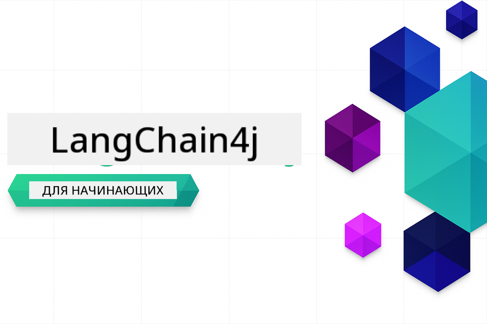
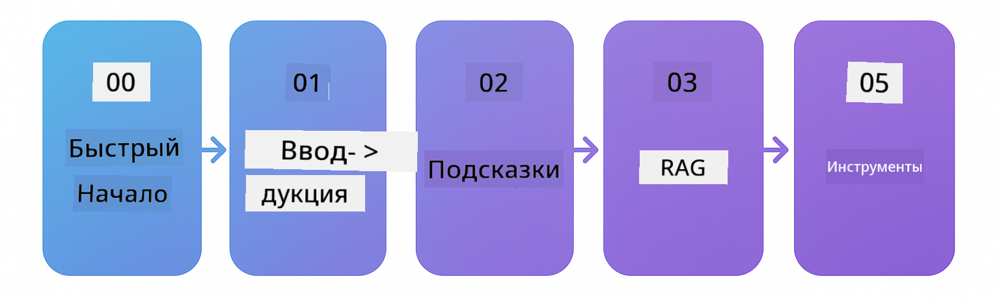

<!--
CO_OP_TRANSLATOR_METADATA:
{
  "original_hash": "d1499d1abf7e653e94fde35644629500",
  "translation_date": "2025-12-18T09:25:55+00:00",
  "source_file": "README.md",
  "language_code": "ru"
}
-->


### 🌐 Поддержка нескольких языков

#### Поддерживается через GitHub Action (автоматически и всегда актуально)

<!-- CO-OP TRANSLATOR LANGUAGES TABLE START -->
[Арабский](../ar/README.md) | [Бенгальский](../bn/README.md) | [Болгарский](../bg/README.md) | [Бирманский (Мьянма)](../my/README.md) | [Китайский (упрощённый)](../zh/README.md) | [Китайский (традиционный, Гонконг)](../hk/README.md) | [Китайский (традиционный, Макао)](../mo/README.md) | [Китайский (традиционный, Тайвань)](../tw/README.md) | [Хорватский](../hr/README.md) | [Чешский](../cs/README.md) | [Датский](../da/README.md) | [Нидерландский](../nl/README.md) | [Эстонский](../et/README.md) | [Финский](../fi/README.md) | [Французский](../fr/README.md) | [Немецкий](../de/README.md) | [Греческий](../el/README.md) | [Иврит](../he/README.md) | [Хинди](../hi/README.md) | [Венгерский](../hu/README.md) | [Индонезийский](../id/README.md) | [Итальянский](../it/README.md) | [Японский](../ja/README.md) | [Каннада](../kn/README.md) | [Корейский](../ko/README.md) | [Литовский](../lt/README.md) | [Малайский](../ms/README.md) | [Малаялам](../ml/README.md) | [Маратхи](../mr/README.md) | [Непальский](../ne/README.md) | [Нигерийский пиджин](../pcm/README.md) | [Норвежский](../no/README.md) | [Персидский (фарси)](../fa/README.md) | [Польский](../pl/README.md) | [Португальский (Бразилия)](../br/README.md) | [Португальский (Португалия)](../pt/README.md) | [Пенджаби (гурмукхи)](../pa/README.md) | [Румынский](../ro/README.md) | [Русский](./README.md) | [Сербский (кириллица)](../sr/README.md) | [Словацкий](../sk/README.md) | [Словенский](../sl/README.md) | [Испанский](../es/README.md) | [Суахили](../sw/README.md) | [Шведский](../sv/README.md) | [Тагальский (филиппинский)](../tl/README.md) | [Тамильский](../ta/README.md) | [Телугу](../te/README.md) | [Тайский](../th/README.md) | [Турецкий](../tr/README.md) | [Украинский](../uk/README.md) | [Урду](../ur/README.md) | [Вьетнамский](../vi/README.md)
<!-- CO-OP TRANSLATOR LANGUAGES TABLE END -->

# LangChain4j для начинающих

Курс по созданию AI-приложений с LangChain4j и Azure OpenAI GPT-5, от базового чата до AI-агентов.

**Новичок в LangChain4j?** Ознакомьтесь со [Словарём](docs/GLOSSARY.md) для определения ключевых терминов и понятий.

## Содержание

1. [Быстрый старт](00-quick-start/README.md) - Начало работы с LangChain4j
2. [Введение](01-introduction/README.md) - Изучение основ LangChain4j
3. [Проектирование подсказок](02-prompt-engineering/README.md) - Освоение эффективного дизайна подсказок
4. [RAG (генерация с использованием поиска)](03-rag/README.md) - Создание интеллектуальных систем на основе знаний
5. [Инструменты](04-tools/README.md) - Интеграция внешних инструментов и API с AI-агентами
6. [MCP (протокол контекста модели)](05-mcp/README.md) - Работа с протоколом контекста модели
---

## Учебный путь

> **Быстрый старт**

1. Форкните этот репозиторий в свой аккаунт GitHub
2. Нажмите **Code** → вкладка **Codespaces** → **...** → **New with options...**
3. Используйте настройки по умолчанию – будет выбран контейнер разработки, созданный для этого курса
4. Нажмите **Create codespace**
5. Подождите 5-10 минут, пока среда будет готова
6. Перейдите сразу к [Быстрому старту](./00-quick-start/README.md), чтобы начать!

> **Предпочитаете клонировать локально?**
>
> В этом репозитории более 50 переводов на разные языки, что значительно увеличивает размер загрузки. Чтобы клонировать без переводов, используйте sparse checkout:
> ```bash
> git clone --filter=blob:none --sparse https://github.com/microsoft/LangChain4j-for-Beginners.git
> cd LangChain4j-for-Beginners
> git sparse-checkout set --no-cone '/*' '!translations' '!translated_images'
> ```
> Это даст вам всё необходимое для прохождения курса с гораздо более быстрой загрузкой.

Начните с модуля [Быстрый старт](00-quick-start/README.md) и проходите каждый модуль, чтобы шаг за шагом развивать свои навыки. Вы попробуете базовые примеры, чтобы понять основы, прежде чем перейти к модулю [Введение](01-introduction/README.md) для более глубокого изучения с GPT-5.



После завершения модулей изучите [Руководство по тестированию](docs/TESTING.md), чтобы увидеть концепции тестирования LangChain4j в действии.

> **Примечание:** В этом обучении используются как GitHub Models, так и Azure OpenAI. Модули [Быстрый старт](00-quick-start/README.md) и [MCP](05-mcp/README.md) используют GitHub Models (подписка Azure не требуется), а модули 1-4 используют Azure OpenAI GPT-5.


## Обучение с GitHub Copilot

Чтобы быстро начать кодировать, откройте этот проект в GitHub Codespace или в вашей локальной IDE с предоставленным devcontainer. Devcontainer, используемый в этом курсе, предварительно настроен с GitHub Copilot для совместного программирования с AI.

Каждый пример кода содержит предложенные вопросы, которые вы можете задать GitHub Copilot для углубления понимания. Ищите подсказки 💡/🤖 в:

- **Заголовках Java-файлов** - вопросы, специфичные для каждого примера
- **README модулей** - подсказки для исследования после примеров кода

**Как использовать:** Откройте любой файл с кодом и задайте Copilot предложенные вопросы. Он имеет полный контекст кода и может объяснять, расширять и предлагать альтернативы.

Хотите узнать больше? Ознакомьтесь с [Copilot для совместного программирования с AI](https://aka.ms/GitHubCopilotAI).


## Дополнительные ресурсы

<!-- CO-OP TRANSLATOR OTHER COURSES START -->
### LangChain
[](https://aka.ms/langchain4j-for-beginners)
[](https://aka.ms/langchainjs-for-beginners?WT.mc_id=m365-94501-dwahlin)

---

### Azure / Edge / MCP / Агенты
[](https://github.com/microsoft/AZD-for-beginners?WT.mc_id=academic-105485-koreyst)
[](https://github.com/microsoft/edgeai-for-beginners?WT.mc_id=academic-105485-koreyst)
[](https://github.com/microsoft/mcp-for-beginners?WT.mc_id=academic-105485-koreyst)
[](https://github.com/microsoft/ai-agents-for-beginners?WT.mc_id=academic-105485-koreyst)

---
 
### Серия по генеративному ИИ
[](https://github.com/microsoft/generative-ai-for-beginners?WT.mc_id=academic-105485-koreyst)
[-9333EA?style=for-the-badge&labelColor=E5E7EB&color=9333EA)](https://github.com/microsoft/Generative-AI-for-beginners-dotnet?WT.mc_id=academic-105485-koreyst)
[-C084FC?style=for-the-badge&labelColor=E5E7EB&color=C084FC)](https://github.com/microsoft/generative-ai-for-beginners-java?WT.mc_id=academic-105485-koreyst)
[-E879F9?style=for-the-badge&labelColor=E5E7EB&color=E879F9)](https://github.com/microsoft/generative-ai-with-javascript?WT.mc_id=academic-105485-koreyst)

---
 
### Основное обучение
[](https://aka.ms/ml-beginners?WT.mc_id=academic-105485-koreyst)
[](https://aka.ms/datascience-beginners?WT.mc_id=academic-105485-koreyst)
[](https://aka.ms/ai-beginners?WT.mc_id=academic-105485-koreyst)
[](https://github.com/microsoft/Security-101?WT.mc_id=academic-96948-sayoung)
[](https://aka.ms/webdev-beginners?WT.mc_id=academic-105485-koreyst)
[](https://aka.ms/iot-beginners?WT.mc_id=academic-105485-koreyst)
[](https://github.com/microsoft/xr-development-for-beginners?WT.mc_id=academic-105485-koreyst)

---
 
### Серия Copilot
[](https://aka.ms/GitHubCopilotAI?WT.mc_id=academic-105485-koreyst)
[](https://github.com/microsoft/mastering-github-copilot-for-dotnet-csharp-developers?WT.mc_id=academic-105485-koreyst)
[](https://github.com/microsoft/CopilotAdventures?WT.mc_id=academic-105485-koreyst)
<!-- CO-OP TRANSLATOR OTHER COURSES END -->

## Получение помощи

Если вы застряли или у вас есть вопросы по созданию AI-приложений, присоединяйтесь:

[](https://aka.ms/foundry/discord)

Если у вас есть отзывы о продукте или ошибки при разработке, посетите:

[](https://aka.ms/foundry/forum)

## Лицензия

Лицензия MIT - см. файл [LICENSE](../../LICENSE) для подробностей.

---

<!-- CO-OP TRANSLATOR DISCLAIMER START -->
**Отказ от ответственности**:  
Этот документ был переведен с помощью сервиса автоматического перевода [Co-op Translator](https://github.com/Azure/co-op-translator). Несмотря на наши усилия обеспечить точность, имейте в виду, что автоматический перевод может содержать ошибки или неточности. Оригинальный документ на его исходном языке следует считать авторитетным источником. Для критически важной информации рекомендуется использовать профессиональный перевод, выполненный человеком. Мы не несем ответственности за любые недоразумения или неправильные толкования, возникшие в результате использования данного перевода.
<!-- CO-OP TRANSLATOR DISCLAIMER END -->