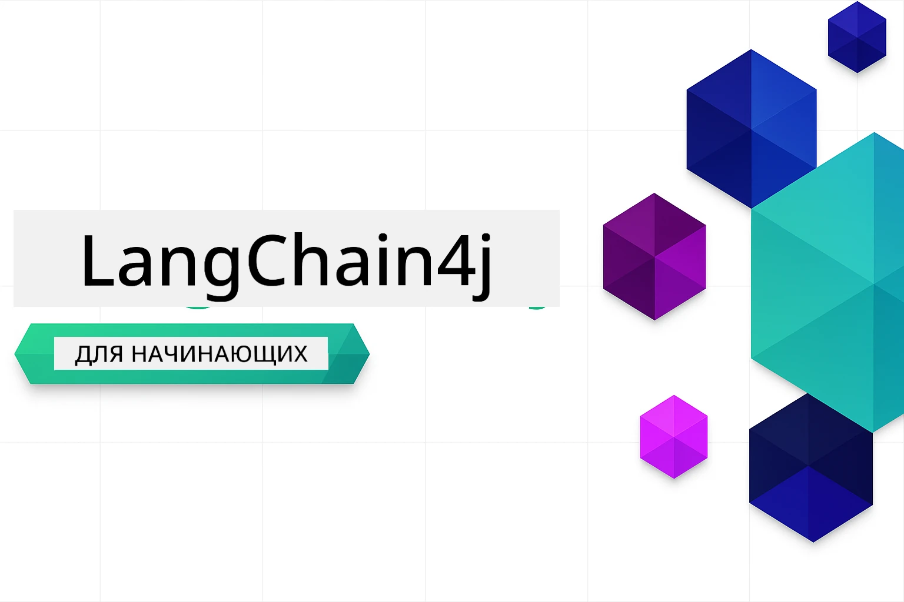

# LangChain4j для начинающих

Курс по созданию AI-приложений с LangChain4j и Azure OpenAI GPT-5.2, от базового чата до AI-агентов.

### 🌐 Поддержка нескольких языков

#### Поддерживается через GitHub Action (автоматически и всегда актуально)

<!-- CO-OP TRANSLATOR LANGUAGES TABLE START -->
[Арабский](../ar/README.md) | [Бенгали](../bn/README.md) | [Болгарский](../bg/README.md) | [Бирманский (Мьянма)](../my/README.md) | [Китайский (упрощённый)](../zh-CN/README.md) | [Китайский (традиционный, Гонконг)](../zh-HK/README.md) | [Китайский (традиционный, Макао)](../zh-MO/README.md) | [Китайский (традиционный, Тайвань)](../zh-TW/README.md) | [Хорватский](../hr/README.md) | [Чешский](../cs/README.md) | [Датский](../da/README.md) | [Нидерландский](../nl/README.md) | [Эстонский](../et/README.md) | [Финский](../fi/README.md) | [Французский](../fr/README.md) | [Немецкий](../de/README.md) | [Греческий](../el/README.md) | [Иврит](../he/README.md) | [Хинди](../hi/README.md) | [Венгерский](../hu/README.md) | [Индонезийский](../id/README.md) | [Итальянский](../it/README.md) | [Японский](../ja/README.md) | [Каннада](../kn/README.md) | [Кхмерский](../km/README.md) | [Корейский](../ko/README.md) | [Литовский](../lt/README.md) | [Малайский](../ms/README.md) | [Малаялам](../ml/README.md) | [Маратхи](../mr/README.md) | [Непальский](../ne/README.md) | [Нигерийский пиджин](../pcm/README.md) | [Норвежский](../no/README.md) | [Персидский (фарси)](../fa/README.md) | [Польский](../pl/README.md) | [Португальский (Бразилия)](../pt-BR/README.md) | [Португальский (Португалия)](../pt-PT/README.md) | [Пенджаби (гурмукхи)](../pa/README.md) | [Румынский](../ro/README.md) | [Русский](./README.md) | [Сербский (кириллица)](../sr/README.md) | [Словацкий](../sk/README.md) | [Словенский](../sl/README.md) | [Испанский](../es/README.md) | [Свахили](../sw/README.md) | [Шведский](../sv/README.md) | [Тагалог (филиппинский)](../tl/README.md) | [Тамильский](../ta/README.md) | [Телугу](../te/README.md) | [Тайский](../th/README.md) | [Турецкий](../tr/README.md) | [Украинский](../uk/README.md) | [Урду](../ur/README.md) | [Вьетнамский](../vi/README.md)

> **Предпочитаете клонировать локально?**
>
> В этом репозитории есть переводы на 50+ языков, что значительно увеличивает размер загрузки. Чтобы клонировать без переводов, используйте sparse checkout:
>
> **Bash / macOS / Linux:**
> ```bash
> git clone --filter=blob:none --sparse https://github.com/microsoft/LangChain4j-for-Beginners.git
> cd LangChain4j-for-Beginners
> git sparse-checkout set --no-cone '/*' '!translations' '!translated_images'
> ```
>
> **CMD (Windows):**
> ```cmd
> git clone --filter=blob:none --sparse https://github.com/microsoft/LangChain4j-for-Beginners.git
> cd LangChain4j-for-Beginners
> git sparse-checkout set --no-cone "/*" "!translations" "!translated_images"
> ```
>
> Это даст вам все необходимое для прохождения курса с гораздо более быстрой загрузкой.
<!-- CO-OP TRANSLATOR LANGUAGES TABLE END -->

## Содержание

1. [Введение](01-introduction/README.md) - Изучите основы LangChain4j
2. [Создание запросов (Prompt Engineering)](02-prompt-engineering/README.md) - Освойте эффективный дизайн запросов
3. [RAG (Retrieval-Augmented Generation)](03-rag/README.md) - Создавайте интеллектуальные системы на основе знаний
4. [Инструменты](04-tools/README.md) - Интегрируйте внешние инструменты и простых помощников
5. [MCP (Model Context Protocol)](05-mcp/README.md) - Работайте с протоколом контекста модели (MCP) и агентскими модулями

### Видеоруководства

Каждый модуль сопровождается живой сессией, на которой мы шаг за шагом разберём концепции и код.

| Модуль | Видео |
|--------|-------|
| 01 - Введение | [Начало работы с LangChain4j](https://www.youtube.com/live/nl_troDm8rQ) |
| 02 - Создание запросов | [Создание запросов с LangChain4j](https://www.youtube.com/live/PJ6aBaE6bog) |
| 03 - RAG | [RAG с LangChain4j](https://www.youtube.com/watch?v=_olq75ZH_eY) |
| 04 - Инструменты & 05 - MCP | [AI-агенты с инструментами и MCP](https://www.youtube.com/watch?v=O_J30kZc0rw) |

---

## Учебный путь

**Новичок в LangChain4j?** Ознакомьтесь со [Словарём](docs/GLOSSARY.md) для определения ключевых терминов и понятий.

> **Быстрый старт**

1. Форкните этот репозиторий в свой аккаунт GitHub
2. Нажмите **Code** → вкладка **Codespaces** → **...** → **New with options...**
3. Используйте настройки по умолчанию – это выберет контейнер для разработки, подготовленный для этого курса
4. Нажмите **Create codespace**
5. Подождите 5-10 минут, пока среда будет готова
6. Перейдите прямо к [Введению](./01-introduction/README.md), чтобы начать!

После прохождения модулей изучите [Руководство по тестированию](docs/TESTING.md), чтобы увидеть концепции тестирования LangChain4j в действии.

> **Примечание:** Это обучение использует Azure OpenAI. Если у вас его нет, начните с [БЕСПЛАТНОГО аккаунта Azure](https://aka.ms/azure-free-account).


## Обучение с GitHub Copilot

Чтобы быстро начать писать код, откройте этот проект в GitHub Codespace или в вашем локальном IDE с предоставленным devcontainer. Devcontainer, используемый в этом курсе, предварительно настроен с GitHub Copilot для совместного программирования с AI.

Каждый пример кода содержит предлагаемые вопросы, которые вы можете задать GitHub Copilot для углубления понимания. Ищите подсказки 💡/🤖 в:

- **Заголовках Java-файлов** – Вопросы, специфичные для каждого примера
- **README модулей** – Подсказки для исследования после примеров кода

**Как использовать:** Откройте любой файл с кодом и задайте Copilot предложенные вопросы. Он имеет полный контекст кода и может объяснять, расширять и предлагать альтернативы.

Хотите узнать больше? Посмотрите [Copilot для совместного программирования с AI](https://aka.ms/GitHubCopilotAI).


## Дополнительные ресурсы

<!-- CO-OP TRANSLATOR OTHER COURSES START -->
### LangChain
[](https://aka.ms/langchain4j-for-beginners)
[](https://aka.ms/langchainjs-for-beginners?WT.mc_id=m365-94501-dwahlin)
[](https://github.com/microsoft/langchain-for-beginners?WT.mc_id=m365-94501-dwahlin)
---

### Azure / Edge / MCP / Агенты
[](https://github.com/microsoft/AZD-for-beginners?WT.mc_id=academic-105485-koreyst)
[](https://github.com/microsoft/edgeai-for-beginners?WT.mc_id=academic-105485-koreyst)
[](https://github.com/microsoft/mcp-for-beginners?WT.mc_id=academic-105485-koreyst)
[](https://github.com/microsoft/ai-agents-for-beginners?WT.mc_id=academic-105485-koreyst)

---
 
### Серия по генеративному ИИ
[](https://github.com/microsoft/generative-ai-for-beginners?WT.mc_id=academic-105485-koreyst)
[-9333EA?style=for-the-badge&labelColor=E5E7EB&color=9333EA)](https://github.com/microsoft/Generative-AI-for-beginners-dotnet?WT.mc_id=academic-105485-koreyst)
[-C084FC?style=for-the-badge&labelColor=E5E7EB&color=C084FC)](https://github.com/microsoft/generative-ai-for-beginners-java?WT.mc_id=academic-105485-koreyst)
[-E879F9?style=for-the-badge&labelColor=E5E7EB&color=E879F9)](https://github.com/microsoft/generative-ai-with-javascript?WT.mc_id=academic-105485-koreyst)

---
 
### Основы обучения
[](https://aka.ms/ml-beginners?WT.mc_id=academic-105485-koreyst)
[](https://aka.ms/datascience-beginners?WT.mc_id=academic-105485-koreyst)
[](https://aka.ms/ai-beginners?WT.mc_id=academic-105485-koreyst)
[](https://github.com/microsoft/Security-101?WT.mc_id=academic-96948-sayoung)

[](https://aka.ms/webdev-beginners?WT.mc_id=academic-105485-koreyst)
[](https://aka.ms/iot-beginners?WT.mc_id=academic-105485-koreyst)
[](https://github.com/microsoft/xr-development-for-beginners?WT.mc_id=academic-105485-koreyst)

---
 
### Серия Copilot
[](https://aka.ms/GitHubCopilotAI?WT.mc_id=academic-105485-koreyst)
[](https://github.com/microsoft/mastering-github-copilot-for-dotnet-csharp-developers?WT.mc_id=academic-105485-koreyst)
[](https://github.com/microsoft/CopilotAdventures?WT.mc_id=academic-105485-koreyst)
<!-- CO-OP TRANSLATOR OTHER COURSES END -->

## Получение Помощи

Если вы застряли или у вас есть вопросы по созданию AI-приложений, присоединяйтесь:

[](https://aka.ms/foundry/discord)

Если у вас есть отзывы о продукте или ошибки при создании, посетите:

[](https://aka.ms/foundry/forum)

## Лицензия

Лицензия MIT — см. файл [LICENSE](../../LICENSE) для подробностей.

---

<!-- CO-OP TRANSLATOR DISCLAIMER START -->
**Отказ от ответственности**:
Этот документ был переведен с использованием сервиса машинного перевода [Co-op Translator](https://github.com/Azure/co-op-translator). Несмотря на наши усилия по обеспечению точности, имейте в виду, что автоматический перевод может содержать ошибки или неточности. Оригинальный документ на его исходном языке следует считать авторитетным источником. Для получения критически важной информации рекомендуется обратиться к профессиональному человеческому переводу. Мы не несем ответственности за любые недоразумения или неправильные толкования, возникшие в результате использования этого перевода.
<!-- CO-OP TRANSLATOR DISCLAIMER END -->