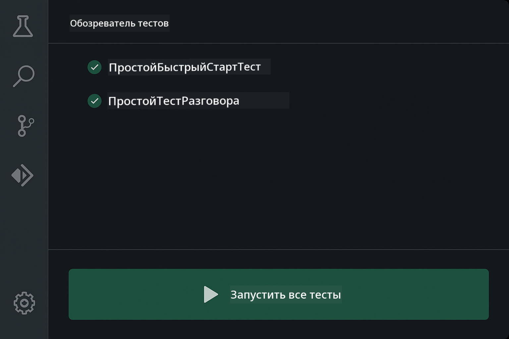
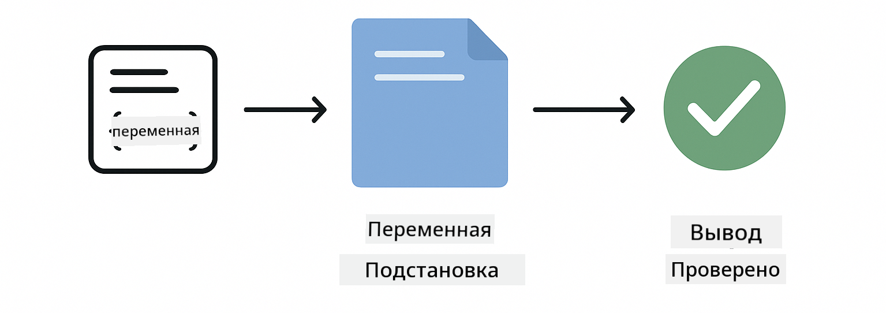
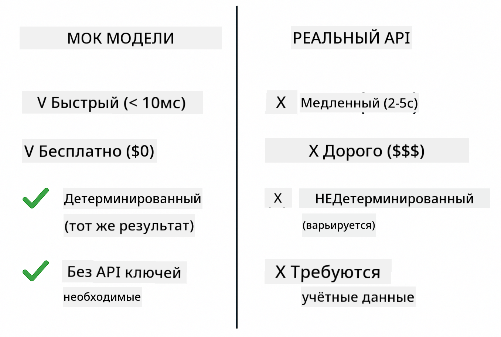
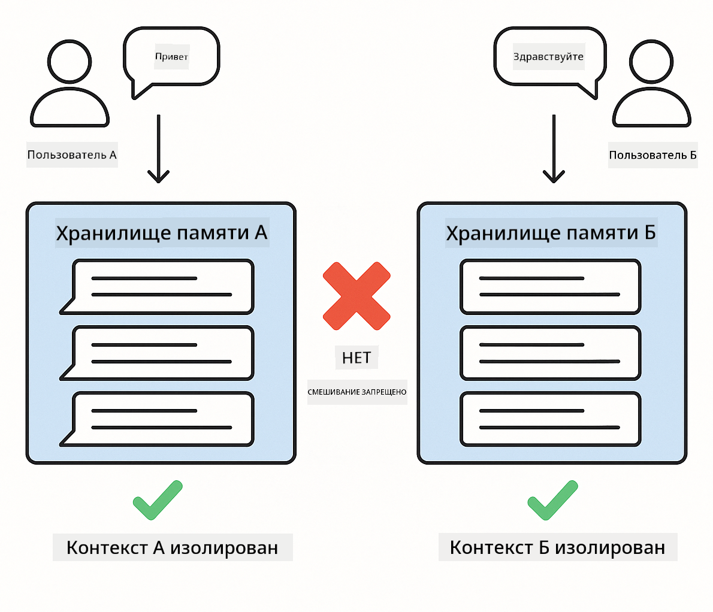
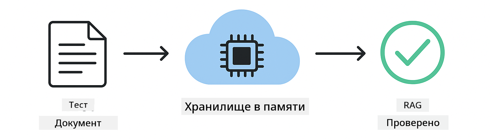

<!--
CO_OP_TRANSLATOR_METADATA:
{
  "original_hash": "b975537560c404d5f254331832811e78",
  "translation_date": "2025-12-13T20:35:44+00:00",
  "source_file": "docs/TESTING.md",
  "language_code": "ru"
}
-->
# Тестирование приложений LangChain4j

## Содержание

- [Быстрый старт](../../../docs)
- [Что покрывают тесты](../../../docs)
- [Запуск тестов](../../../docs)
- [Запуск тестов в VS Code](../../../docs)
- [Паттерны тестирования](../../../docs)
- [Философия тестирования](../../../docs)
- [Следующие шаги](../../../docs)

Это руководство проведет вас через тесты, которые демонстрируют, как тестировать AI-приложения без необходимости в API-ключах или внешних сервисах.

## Быстрый старт

Запустите все тесты одной командой:

**Bash:**
```bash
mvn test
```

**PowerShell:**
```powershell
mvn --% test
```


*Успешное выполнение тестов, показывающее, что все тесты прошли без ошибок*

## Что покрывают тесты

Этот курс сосредоточен на **юнит-тестах**, которые запускаются локально. Каждый тест демонстрирует конкретную концепцию LangChain4j в изоляции.


*Пирамида тестирования, показывающая баланс между юнит-тестами (быстрыми, изолированными), интеграционными тестами (реальные компоненты) и end-to-end тестами (полная система с Docker). Это обучение охватывает юнит-тестирование.*

| Модуль | Тесты | Фокус | Ключевые файлы |
|--------|-------|-------|----------------|
| **00 - Быстрый старт** | 6 | Шаблоны подсказок и подстановка переменных | `SimpleQuickStartTest.java` |
| **01 - Введение** | 8 | Память разговора и состояние чата | `SimpleConversationTest.java` |
| **02 - Инжиниринг подсказок** | 12 | Паттерны GPT-5, уровни готовности, структурированный вывод | `SimpleGpt5PromptTest.java` |
| **03 - RAG** | 10 | Загрузка документов, эмбеддинги, поиск по сходству | `DocumentServiceTest.java` |
| **04 - Инструменты** | 12 | Вызов функций и цепочки инструментов | `SimpleToolsTest.java` |
| **05 - MCP** | 15 | Протокол контекста модели с Docker | `SimpleMcpTest.java`, `McpDockerTransportTest.java` |

## Запуск тестов

**Запуск всех тестов из корня:**

**Bash:**
```bash
mvn test
```

**PowerShell:**
```powershell
mvn --% test
```

**Запуск тестов для конкретного модуля:**

**Bash:**
```bash
cd 01-introduction && mvn test
# Или от корня
mvn test -pl 01-introduction
```

**PowerShell:**
```powershell
cd 01-introduction; mvn --% test
# Или от корня
mvn --% test -pl 01-introduction
```

**Запуск одного тестового класса:**

**Bash:**
```bash
mvn test -Dtest=SimpleConversationTest
```

**PowerShell:**
```powershell
mvn --% test -Dtest=SimpleConversationTest
```

**Запуск конкретного тестового метода:**

**Bash:**
```bash
mvn test -Dtest=SimpleConversationTest#следуетСохранятьИсториюРазговора
```

**PowerShell:**
```powershell
mvn --% test -Dtest=SimpleConversationTest#следуетСохранятьИсториюРазговора
```

## Запуск тестов в VS Code

Если вы используете Visual Studio Code, Test Explorer предоставляет графический интерфейс для запуска и отладки тестов.



*Test Explorer в VS Code, показывающий дерево тестов со всеми Java-классами и отдельными тестовыми методами*

**Чтобы запустить тесты в VS Code:**

1. Откройте Test Explorer, нажав на иконку колбы в панели активности
2. Разверните дерево тестов, чтобы увидеть все модули и классы тестов
3. Нажмите кнопку воспроизведения рядом с любым тестом, чтобы запустить его отдельно
4. Нажмите "Run All Tests" для запуска всего набора
5. Щелкните правой кнопкой мыши по тесту и выберите "Debug Test" для установки точек останова и пошагового выполнения кода

Test Explorer показывает зеленые галочки для успешных тестов и предоставляет подробные сообщения об ошибках при сбоях.

## Паттерны тестирования


*Шесть паттернов тестирования для приложений LangChain4j: шаблоны подсказок, мокинг моделей, изоляция разговоров, тестирование инструментов, in-memory RAG и интеграция с Docker*

### Паттерн 1: Тестирование шаблонов подсказок

Самый простой паттерн тестирует шаблоны подсказок без вызова AI-модели. Вы проверяете, что подстановка переменных работает корректно, а подсказки форматируются как ожидается.



*Тестирование шаблонов подсказок, показывающее поток подстановки переменных: шаблон с заполнителями → примененные значения → проверенный форматированный вывод*

```java
@Test
@DisplayName("Should format prompt template with variables")
void testPromptTemplateFormatting() {
    PromptTemplate template = PromptTemplate.from(
        "Best time to visit {{destination}} for {{activity}}?"
    );
    
    Prompt prompt = template.apply(Map.of(
        "destination", "Paris",
        "activity", "sightseeing"
    ));
    
    assertThat(prompt.text()).isEqualTo("Best time to visit Paris for sightseeing?");
}
```

Этот тест находится в `00-quick-start/src/test/java/com/example/langchain4j/quickstart/SimpleQuickStartTest.java`.

**Запустите его:**

**Bash:**
```bash
cd 00-quick-start && mvn test -Dtest=SimpleQuickStartTest#тестированиеФорматированияШаблонаПодсказки
```

**PowerShell:**
```powershell
cd 00-quick-start; mvn --% test -Dtest=SimpleQuickStartTest#тестированиеФорматированияШаблонаПодсказки
```

### Паттерн 2: Мокинг языковых моделей

При тестировании логики разговора используйте Mockito для создания фейковых моделей, которые возвращают заранее определённые ответы. Это делает тесты быстрыми, бесплатными и детерминированными.



*Сравнение, показывающее, почему для тестирования предпочтительнее моки: они быстрые, бесплатные, детерминированные и не требуют API-ключей*

```java
@ExtendWith(MockitoExtension.class)
class SimpleConversationTest {
    
    private ConversationService conversationService;
    
    @Mock
    private OpenAiOfficialChatModel mockChatModel;
    
    @BeforeEach
    void setUp() {
        ChatResponse mockResponse = ChatResponse.builder()
            .aiMessage(AiMessage.from("This is a test response"))
            .build();
        when(mockChatModel.chat(anyList())).thenReturn(mockResponse);
        
        conversationService = new ConversationService(mockChatModel);
    }
    
    @Test
    void shouldMaintainConversationHistory() {
        String conversationId = conversationService.startConversation();
        
        ChatResponse mockResponse1 = ChatResponse.builder()
            .aiMessage(AiMessage.from("Response 1"))
            .build();
        ChatResponse mockResponse2 = ChatResponse.builder()
            .aiMessage(AiMessage.from("Response 2"))
            .build();
        ChatResponse mockResponse3 = ChatResponse.builder()
            .aiMessage(AiMessage.from("Response 3"))
            .build();
        
        when(mockChatModel.chat(anyList()))
            .thenReturn(mockResponse1)
            .thenReturn(mockResponse2)
            .thenReturn(mockResponse3);

        conversationService.chat(conversationId, "First message");
        conversationService.chat(conversationId, "Second message");
        conversationService.chat(conversationId, "Third message");

        List<ChatMessage> history = conversationService.getHistory(conversationId);
        assertThat(history).hasSize(6); // 3 сообщения от пользователя + 3 сообщения от ИИ
    }
}
```

Этот паттерн встречается в `01-introduction/src/test/java/com/example/langchain4j/service/SimpleConversationTest.java`. Мок обеспечивает стабильное поведение, чтобы вы могли проверить правильность управления памятью.

### Паттерн 3: Тестирование изоляции разговоров

Память разговора должна хранить данные разных пользователей отдельно. Этот тест проверяет, что контексты разговоров не смешиваются.



*Тестирование изоляции разговоров, показывающее отдельные хранилища памяти для разных пользователей, чтобы предотвратить смешивание контекстов*

```java
@Test
void shouldIsolateConversationsByid() {
    String conv1 = conversationService.startConversation();
    String conv2 = conversationService.startConversation();
    
    ChatResponse mockResponse = ChatResponse.builder()
        .aiMessage(AiMessage.from("Response"))
        .build();
    when(mockChatModel.chat(anyList())).thenReturn(mockResponse);

    conversationService.chat(conv1, "Message for conversation 1");
    conversationService.chat(conv2, "Message for conversation 2");

    List<ChatMessage> history1 = conversationService.getHistory(conv1);
    List<ChatMessage> history2 = conversationService.getHistory(conv2);
    
    assertThat(history1).hasSize(2);
    assertThat(history2).hasSize(2);
}
```

Каждый разговор поддерживает свою независимую историю. В продуктивных системах такая изоляция критична для многопользовательских приложений.

### Паттерн 4: Тестирование инструментов отдельно

Инструменты — это функции, которые AI может вызывать. Тестируйте их напрямую, чтобы убедиться, что они работают корректно независимо от решений AI.


*Тестирование инструментов отдельно, показывающее выполнение мок-инструментов без вызовов AI для проверки бизнес-логики*

```java
@Test
void shouldConvertCelsiusToFahrenheit() {
    TemperatureTool tempTool = new TemperatureTool();
    String result = tempTool.celsiusToFahrenheit(25.0);
    assertThat(result).containsPattern("77[.,]0°F");
}

@Test
void shouldDemonstrateToolChaining() {
    WeatherTool weatherTool = new WeatherTool();
    TemperatureTool tempTool = new TemperatureTool();

    String weatherResult = weatherTool.getCurrentWeather("Seattle");
    assertThat(weatherResult).containsPattern("\\d+°C");

    String conversionResult = tempTool.celsiusToFahrenheit(22.0);
    assertThat(conversionResult).containsPattern("71[.,]6°F");
}
```

Эти тесты из `04-tools/src/test/java/com/example/langchain4j/agents/tools/SimpleToolsTest.java` проверяют логику инструментов без участия AI. Пример цепочки показывает, как вывод одного инструмента передается на вход другому.

### Паттерн 5: Тестирование RAG в памяти

Системы RAG традиционно требуют векторных баз данных и сервисов эмбеддингов. Паттерн in-memory позволяет тестировать весь конвейер без внешних зависимостей.



*Рабочий процесс тестирования RAG в памяти, показывающий разбор документов, хранение эмбеддингов и поиск по сходству без необходимости в базе данных*

```java
@Test
void testProcessTextDocument() {
    String content = "This is a test document.\nIt has multiple lines.";
    InputStream inputStream = new ByteArrayInputStream(content.getBytes(StandardCharsets.UTF_8));
    
    DocumentService.ProcessedDocument result = 
        documentService.processDocument(inputStream, "test.txt");

    assertNotNull(result);
    assertTrue(result.segments().size() > 0);
    assertEquals("test.txt", result.segments().get(0).metadata().getString("filename"));
}
```

Этот тест из `03-rag/src/test/java/com/example/langchain4j/rag/service/DocumentServiceTest.java` создает документ в памяти и проверяет разбиение на части и обработку метаданных.

### Паттерн 6: Интеграционное тестирование с Docker

Некоторые функции требуют реальной инфраструктуры. Модуль MCP использует Testcontainers для запуска Docker-контейнеров для интеграционных тестов. Они проверяют, что ваш код работает с реальными сервисами, сохраняя изоляцию тестов.


*Интеграционное тестирование MCP с Testcontainers, показывающее автоматический жизненный цикл контейнеров: запуск, выполнение тестов, остановка и очистка*

Тесты в `05-mcp/src/test/java/com/example/langchain4j/mcp/McpDockerTransportTest.java` требуют запущенного Docker.

**Запустите их:**

**Bash:**
```bash
cd 05-mcp && mvn test
```

**PowerShell:**
```powershell
cd 05-mcp; mvn --% test
```

## Философия тестирования

Тестируйте ваш код, а не AI. Ваши тесты должны проверять написанный вами код, контролируя, как строятся подсказки, как управляется память и как выполняются инструменты. Ответы AI варьируются и не должны быть частью утверждений тестов. Спрашивайте себя, правильно ли ваш шаблон подсказки подставляет переменные, а не дает ли AI правильный ответ.

Используйте моки для языковых моделей. Это внешние зависимости, которые медленные, дорогие и недетерминированные. Мокинг делает тесты быстрыми — миллисекунды вместо секунд, бесплатными — без затрат на API, и детерминированными — с одинаковым результатом каждый раз.

Держите тесты независимыми. Каждый тест должен настраивать свои данные, не полагаться на другие тесты и очищать за собой. Тесты должны проходить независимо от порядка выполнения.

Тестируйте крайние случаи, выходящие за рамки стандартного сценария. Пробуйте пустые входные данные, очень большие данные, специальные символы, неверные параметры и граничные условия. Они часто выявляют баги, которые обычное использование не показывает.

Используйте описательные имена. Сравните `shouldMaintainConversationHistoryAcrossMultipleMessages()` с `test1()`. Первое точно говорит, что тестируется, облегчая отладку при ошибках.

## Следующие шаги

Теперь, когда вы понимаете паттерны тестирования, углубитесь в каждый модуль:

- **[00 - Быстрый старт](../00-quick-start/README.md)** - Начните с основ шаблонов подсказок
- **[01 - Введение](../01-introduction/README.md)** - Изучите управление памятью разговоров
- **[02 - Инжиниринг подсказок](../02-prompt-engineering/README.md)** - Освойте паттерны подсказок GPT-5
- **[03 - RAG](../03-rag/README.md)** - Создавайте системы с дополнением извлечением
- **[04 - Инструменты](../04-tools/README.md)** - Реализуйте вызов функций и цепочки инструментов
- **[05 - MCP](../05-mcp/README.md)** - Интегрируйте Протокол Контекста Модели с Docker

README каждого модуля содержит подробные объяснения концепций, протестированных здесь.

---

**Навигация:** [← Назад к главной](../README.md)

---

<!-- CO-OP TRANSLATOR DISCLAIMER START -->
**Отказ от ответственности**:  
Этот документ был переведен с помощью сервиса автоматического перевода [Co-op Translator](https://github.com/Azure/co-op-translator). Несмотря на наши усилия по обеспечению точности, имейте в виду, что автоматический перевод может содержать ошибки или неточности. Оригинальный документ на его исходном языке следует считать авторитетным источником. Для получения критически важной информации рекомендуется использовать профессиональный перевод, выполненный человеком. Мы не несем ответственности за любые недоразумения или неправильные толкования, возникшие в результате использования данного перевода.
<!-- CO-OP TRANSLATOR DISCLAIMER END -->