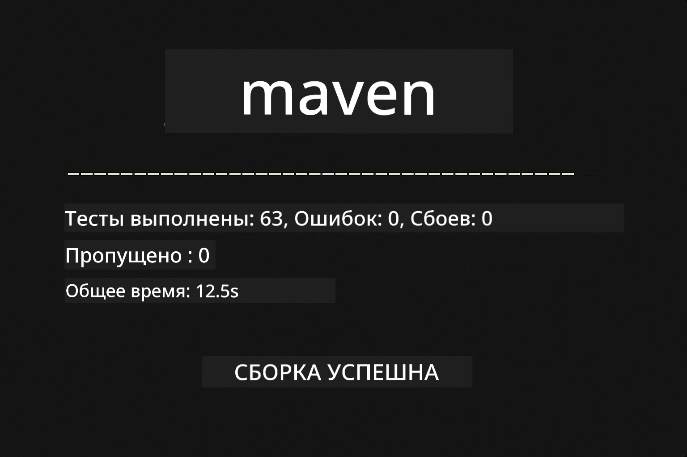
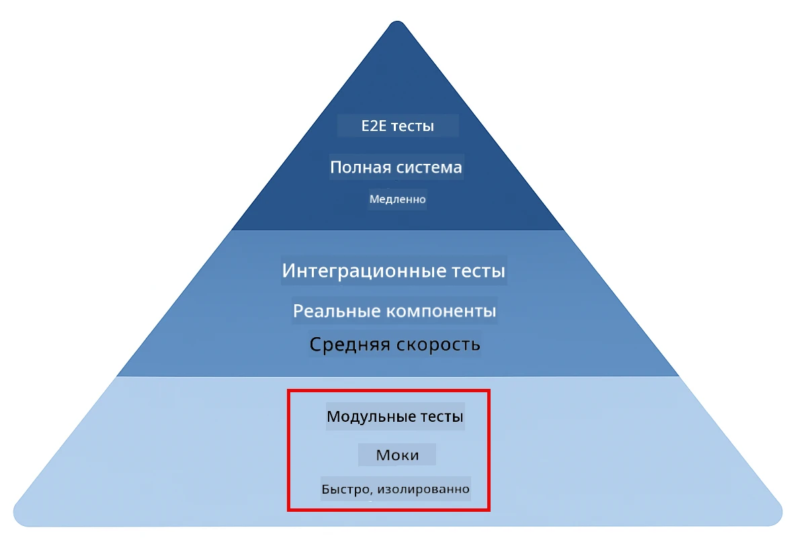
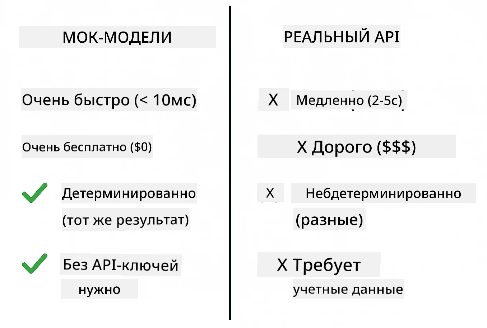
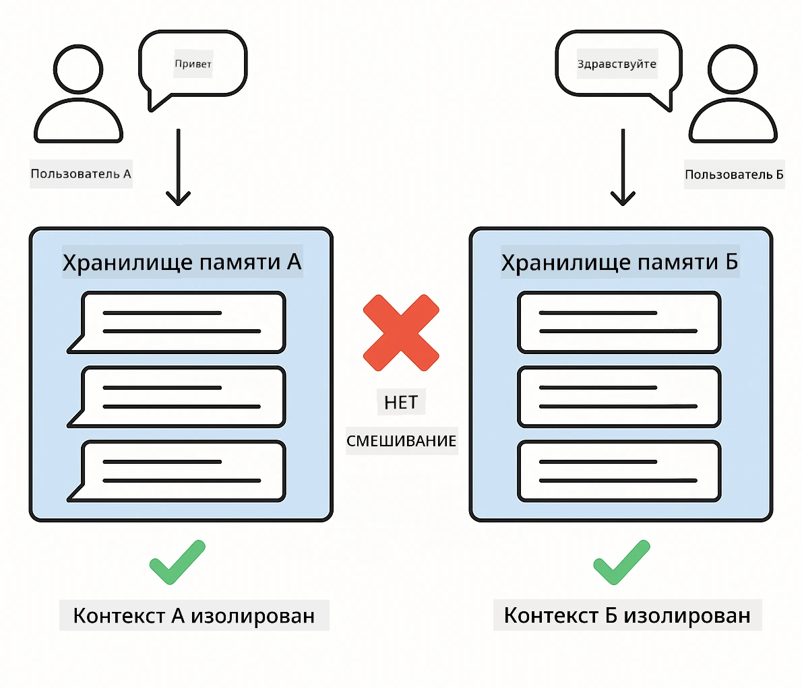
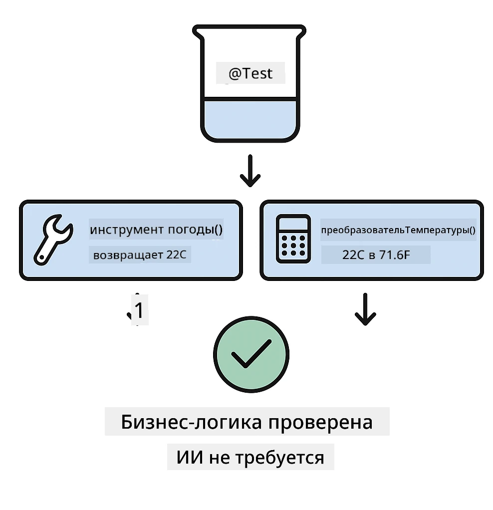

# Тестирование приложений LangChain4j

## Содержание

- [Быстрый старт](../../../docs)
- [Что покрывают тесты](../../../docs)
- [Запуск тестов](../../../docs)
- [Запуск тестов в VS Code](../../../docs)
- [Шаблоны тестирования](../../../docs)
- [Философия тестирования](../../../docs)
- [Дальнейшие шаги](../../../docs)

Это руководство проведёт вас через тесты, демонстрирующие, как тестировать приложения ИИ без необходимости использования API-ключей или внешних сервисов.

## Быстрый старт

Запустите все тесты одной командой:

**Bash:**
```bash
mvn test
```

**PowerShell:**
```powershell
mvn --% test
```



*Успешное выполнение тестов, показывающее, что все тесты прошли без сбоев*

## Что покрывают тесты

Этот курс сосредоточен на **юнит-тестах**, которые выполняются локально. Каждый тест демонстрирует конкретную концепцию LangChain4j в изоляции.



*Пирамида тестирования, показывающая баланс между юнит-тестами (быстро, изолировано), интеграционными тестами (реальные компоненты) и end-to-end тестами. Это обучение охватывает юнит-тестирование.*

| Модуль | Тесты | Фокус | Ключевые файлы |
|--------|-------|-------|-----------|
| **00 - Быстрый старт** | 6 | Шаблоны подсказок и подстановка переменных | `SimpleQuickStartTest.java` |
| **01 - Введение** | 8 | Память разговора и stateful-чат | `SimpleConversationTest.java` |
| **02 - Инженерия подсказок** | 12 | Шаблоны GPT-5, уровни готовности, структурированный вывод | `SimpleGpt5PromptTest.java` |
| **03 - RAG** | 10 | Загрузка документов, эмбеддинги, поиск по сходству | `DocumentServiceTest.java` |
| **04 - Инструменты** | 12 | Вызов функций и цепочка инструментов | `SimpleToolsTest.java` |
| **05 - MCP** | 8 | Model Context Protocol с транспортом stdio | `SimpleMcpTest.java` |

## Запуск тестов

**Запустить все тесты из корня:**

**Bash:**
```bash
mvn test
```

**PowerShell:**
```powershell
mvn --% test
```

**Запустить тесты для конкретного модуля:**

**Bash:**
```bash
cd 01-introduction && mvn test
# Или от root
mvn test -pl 01-introduction
```

**PowerShell:**
```powershell
cd 01-introduction; mvn --% test
# Или от root
mvn --% test -pl 01-introduction
```

**Запустить один класс тестов:**

**Bash:**
```bash
mvn test -Dtest=SimpleConversationTest
```

**PowerShell:**
```powershell
mvn --% test -Dtest=SimpleConversationTest
```

**Запустить конкретный тестовый метод:**

**Bash:**
```bash
mvn test -Dtest=SimpleConversationTest#должен сохранять историю разговора
```

**PowerShell:**
```powershell
mvn --% test -Dtest=SimpleConversationTest#следует сохранять историю разговора
```

## Запуск тестов в VS Code

Если вы используете Visual Studio Code, Test Explorer предоставляет графический интерфейс для запуска и отладки тестов.


*Обозреватель тестов VS Code, показывающий дерево тестов со всеми классами тестов Java и отдельными тестовыми методами*

**Чтобы запустить тесты в VS Code:**

1. Откройте Test Explorer, нажав на значок колбы в панели активностей
2. Разверните дерево тестов, чтобы увидеть все модули и классы тестов
3. Нажмите кнопку запуска рядом с любым тестом, чтобы выполнить его отдельно
4. Нажмите «Run All Tests», чтобы выполнить весь набор
5. Щёлкните правой кнопкой мыши по любому тесту и выберите «Debug Test», чтобы выставить точки останова и пошагово пройти код

Обозреватель тестов показывает зелёные галочки для успешно пройденных тестов и предоставляет подробные сообщения об ошибках при неудачах.

## Шаблоны тестирования

### Шаблон 1: Тестирование шаблонов подсказок

Самый простой шаблон тестирует шаблоны подсказок без обращения к какой-либо модели ИИ. Вы проверяете, что подстановка переменных работает правильно и подсказки отформатированы как ожидается.


*Тестирование шаблонов подсказок, показывающее поток подстановки переменных: шаблон с заполнителями → применённые значения → проверенный отформатированный вывод*

```java
@Test
@DisplayName("Should format prompt template with variables")
void testPromptTemplateFormatting() {
    PromptTemplate template = PromptTemplate.from(
        "Best time to visit {{destination}} for {{activity}}?"
    );
    
    Prompt prompt = template.apply(Map.of(
        "destination", "Paris",
        "activity", "sightseeing"
    ));
    
    assertThat(prompt.text()).isEqualTo("Best time to visit Paris for sightseeing?");
}
```

Этот тест находится в `00-quick-start/src/test/java/com/example/langchain4j/quickstart/SimpleQuickStartTest.java`.

**Запустите его:**

**Bash:**
```bash
cd 00-quick-start && mvn test -Dtest=SimpleQuickStartTest#тест форматирования шаблона подсказки
```

**PowerShell:**
```powershell
cd 00-quick-start; mvn --% test -Dtest=SimpleQuickStartTest#тест форматирования шаблона подсказки
```

### Шаблон 2: Мокирование языковых моделей

При тестировании логики разговоров используйте Mockito для создания фейковых моделей, которые возвращают предопределённые ответы. Это делает тесты быстрыми, бесплатными и детерминированными.



*Сравнение, показывающее, почему для тестирования предпочтительны моки: они быстрые, бесплатные, детерминированные и не требуют API-ключей*

```java
@ExtendWith(MockitoExtension.class)
class SimpleConversationTest {
    
    private ConversationService conversationService;
    
    @Mock
    private OpenAiOfficialChatModel mockChatModel;
    
    @BeforeEach
    void setUp() {
        ChatResponse mockResponse = ChatResponse.builder()
            .aiMessage(AiMessage.from("This is a test response"))
            .build();
        when(mockChatModel.chat(anyList())).thenReturn(mockResponse);
        
        conversationService = new ConversationService(mockChatModel);
    }
    
    @Test
    void shouldMaintainConversationHistory() {
        String conversationId = conversationService.startConversation();
        
        ChatResponse mockResponse1 = ChatResponse.builder()
            .aiMessage(AiMessage.from("Response 1"))
            .build();
        ChatResponse mockResponse2 = ChatResponse.builder()
            .aiMessage(AiMessage.from("Response 2"))
            .build();
        ChatResponse mockResponse3 = ChatResponse.builder()
            .aiMessage(AiMessage.from("Response 3"))
            .build();
        
        when(mockChatModel.chat(anyList()))
            .thenReturn(mockResponse1)
            .thenReturn(mockResponse2)
            .thenReturn(mockResponse3);

        conversationService.chat(conversationId, "First message");
        conversationService.chat(conversationId, "Second message");
        conversationService.chat(conversationId, "Third message");

        List<ChatMessage> history = conversationService.getHistory(conversationId);
        assertThat(history).hasSize(6); // 3 сообщения пользователя + 3 сообщения ИИ
    }
}
```

Этот шаблон встречается в `01-introduction/src/test/java/com/example/langchain4j/service/SimpleConversationTest.java`. Мок гарантирует согласованное поведение, чтобы вы могли проверить корректность управления памятью.

### Шаблон 3: Тестирование изоляции разговоров

Память разговоров должна сохранять разделение между несколькими пользователями. Этот тест проверяет, что контексты разговоров не смешиваются.



*Тестирование изоляции разговоров, показывающее отдельные хранилища памяти для разных пользователей, чтобы предотвратить смешение контекстов*

```java
@Test
void shouldIsolateConversationsByid() {
    String conv1 = conversationService.startConversation();
    String conv2 = conversationService.startConversation();
    
    ChatResponse mockResponse = ChatResponse.builder()
        .aiMessage(AiMessage.from("Response"))
        .build();
    when(mockChatModel.chat(anyList())).thenReturn(mockResponse);

    conversationService.chat(conv1, "Message for conversation 1");
    conversationService.chat(conv2, "Message for conversation 2");

    List<ChatMessage> history1 = conversationService.getHistory(conv1);
    List<ChatMessage> history2 = conversationService.getHistory(conv2);
    
    assertThat(history1).hasSize(2);
    assertThat(history2).hasSize(2);
}
```

Каждый разговор поддерживает свою собственную независимую историю. В продуктивных системах такая изоляция критична для многопользовательских приложений.

### Шаблон 4: Тестирование инструментов по отдельности

Инструменты — это функции, которые может вызывать ИИ. Тестируйте их напрямую, чтобы убедиться, что они работают корректно независимо от решений ИИ.



*Тестирование инструментов отдельно, показывающее выполнение замоканных инструментов без вызовов ИИ для проверки бизнес-логики*

```java
@Test
void shouldConvertCelsiusToFahrenheit() {
    TemperatureTool tempTool = new TemperatureTool();
    String result = tempTool.celsiusToFahrenheit(25.0);
    assertThat(result).containsPattern("77[.,]0°F");
}

@Test
void shouldDemonstrateToolChaining() {
    WeatherTool weatherTool = new WeatherTool();
    TemperatureTool tempTool = new TemperatureTool();

    String weatherResult = weatherTool.getCurrentWeather("Seattle");
    assertThat(weatherResult).containsPattern("\\d+°C");

    String conversionResult = tempTool.celsiusToFahrenheit(22.0);
    assertThat(conversionResult).containsPattern("71[.,]6°F");
}
```

Эти тесты из `04-tools/src/test/java/com/example/langchain4j/agents/tools/SimpleToolsTest.java` проверяют логику инструментов без участия ИИ. Пример сцепления показывает, как вывод одного инструмента поступает на вход другого.

### Шаблон 5: Тестирование RAG в памяти

Системы RAG традиционно требуют векторных баз данных и сервисов эмбеддингов. Паттерн в памяти позволяет протестировать весь конвейер без внешних зависимостей.


*Рабочий процесс тестирования RAG в памяти, показывающий разбор документов, хранение эмбеддингов и поиск по сходству без необходимости в базе данных*

```java
@Test
void testProcessTextDocument() {
    String content = "This is a test document.\nIt has multiple lines.";
    InputStream inputStream = new ByteArrayInputStream(content.getBytes(StandardCharsets.UTF_8));
    
    DocumentService.ProcessedDocument result = 
        documentService.processDocument(inputStream, "test.txt");

    assertNotNull(result);
    assertTrue(result.segments().size() > 0);
    assertEquals("test.txt", result.segments().get(0).metadata().getString("filename"));
}
```

Этот тест из `03-rag/src/test/java/com/example/langchain4j/rag/service/DocumentServiceTest.java` создаёт документ в памяти и проверяет разбиение на фрагменты и обработку метаданных.

### Шаблон 6: Интеграционное тестирование MCP

Модуль MCP тестирует интеграцию протокола Model Context с использованием транспорта stdio. Эти тесты проверяют, что ваше приложение может порождать и общаться с MCP-серверами как с подпроцессами.

Тесты в `05-mcp/src/test/java/com/example/langchain4j/mcp/SimpleMcpTest.java` проверяют поведение MCP-клиента.

**Запустите их:**

**Bash:**
```bash
cd 05-mcp && mvn test
```

**PowerShell:**
```powershell
cd 05-mcp; mvn --% test
```

## Философия тестирования

Тестируйте ваш код, а не ИИ. Ваши тесты должны проверять написанный вами код, проверяя, как конструируются подсказки, как управляется память и как выполняются инструменты. Ответы ИИ вариативны и не должны быть частью утверждений тестов. Спрашивайте себя, правильно ли ваш шаблон подсказки подставляет переменные, а не даёт ли ИИ правильный ответ.

Используйте моки для языковых моделей. Это внешние зависимости, которые медленные, дорогие и недетерминированные. Мокирование делает тесты быстрыми (миллисекунды вместо секунд), бесплатными (без затрат на API) и детерминированными (один и тот же результат каждый раз).

Держите тесты независимыми. Каждый тест должен создавать свои данные, не полагаться на другие тесты и очищать за собой. Тесты должны проходить независимо от порядка выполнения.

Тестируйте граничные случаи, выходя за рамки обычного сценария. Пробуйте пустые входные данные, очень большие входы, специальные символы, недопустимые параметры и пограничные условия. Они часто выявляют баги, которые обычное использование не обнаруживает.

Используйте описательные имена. Сравните `shouldMaintainConversationHistoryAcrossMultipleMessages()` и `test1()`. Первое точно говорит, что тестируется, что значительно упрощает отладку при сбоях.

## Дальнейшие шаги

Теперь, когда вы понимаете шаблоны тестирования, погрузитесь глубже в каждый модуль:

- **[00 - Быстрый старт](../00-quick-start/README.md)** - Начните с основ шаблонов подсказок
- **[01 - Введение](../01-introduction/README.md)** - Изучите управление памятью разговоров
- **[02 - Инженерия подсказок](../02-prompt-engineering/README.md)** - Освойте шаблоны подсказок GPT-5
- **[03 - RAG](../03-rag/README.md)** - Постройте системы retrieval-augmented generation
- **[04 - Инструменты](../04-tools/README.md)** - Реализуйте вызов функций и цепочки инструментов
- **[05 - MCP](../05-mcp/README.md)** - Интегрируйте протокол Model Context

README каждого модуля содержит подробные объяснения концепций, протестированных здесь.

---

**Навигация:** [← Назад на главную](../README.md)

---

<!-- CO-OP TRANSLATOR DISCLAIMER START -->
Отказ от ответственности:
Этот документ переведён с помощью сервиса машинного перевода на базе ИИ [Co-op Translator](https://github.com/Azure/co-op-translator). Несмотря на наши усилия по обеспечению точности, имейте в виду, что автоматические переводы могут содержать ошибки или неточности. Исходный документ на его оригинальном языке следует считать авторитетным источником. Для критически важной информации рекомендуется профессиональный (человеческий) перевод. Мы не несем ответственности за любые недоразумения или неверные толкования, возникшие в результате использования этого перевода.
<!-- CO-OP TRANSLATOR DISCLAIMER END -->