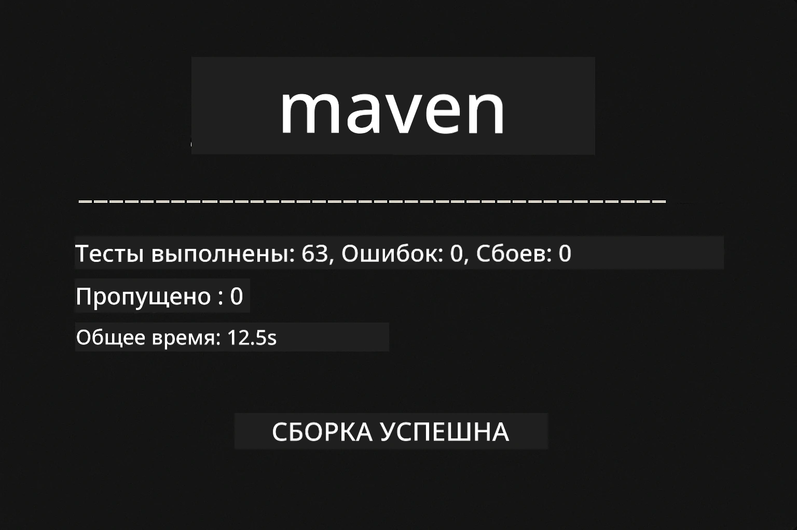
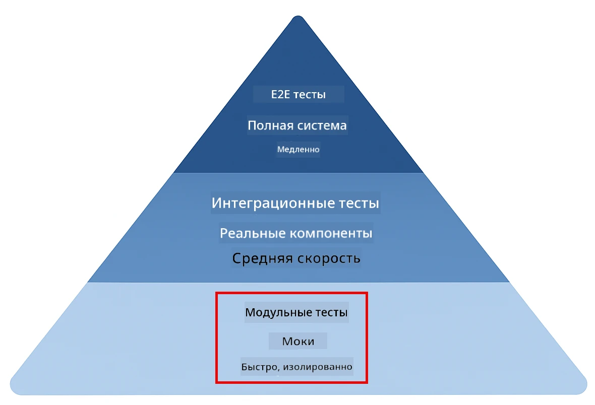
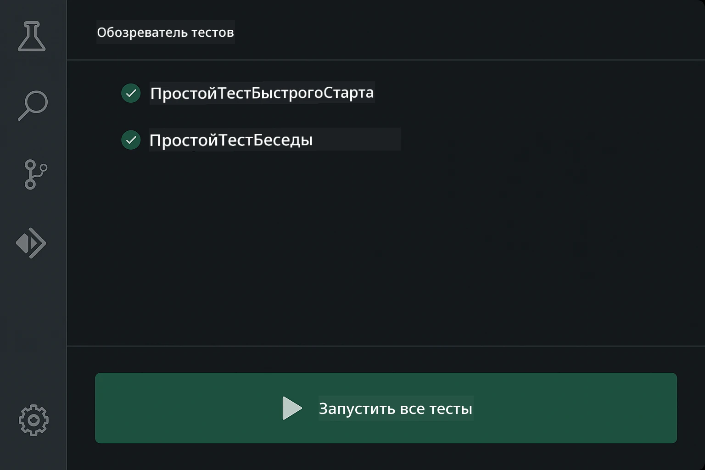
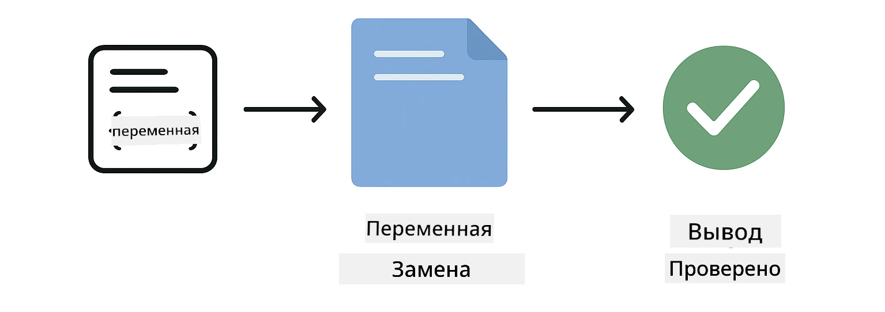
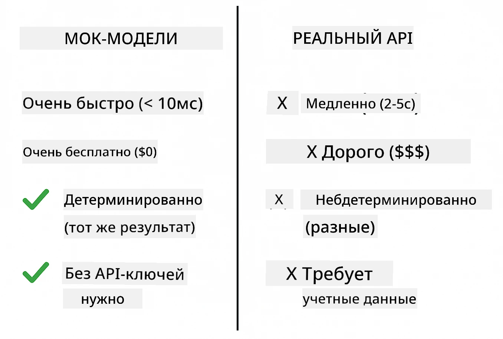
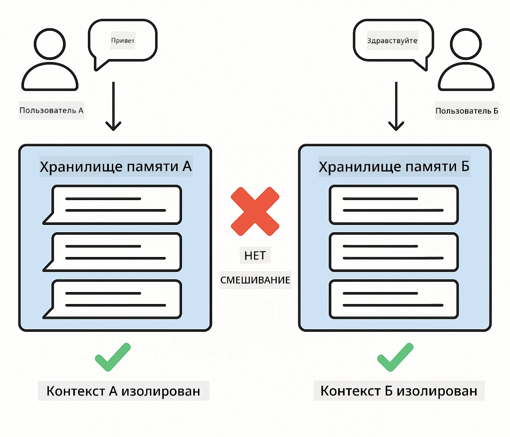
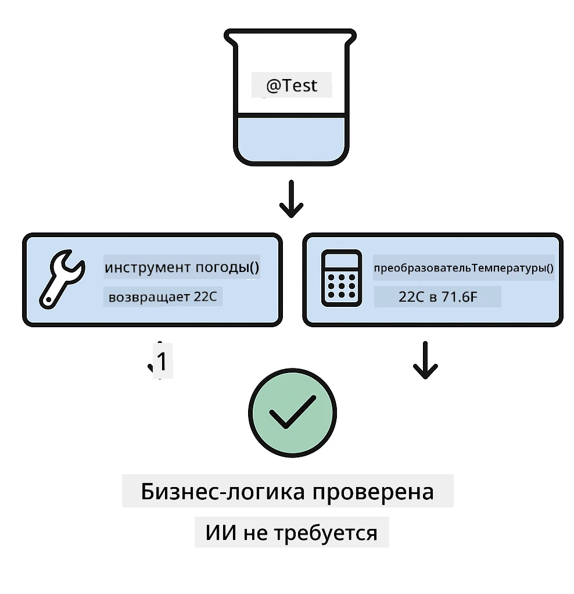
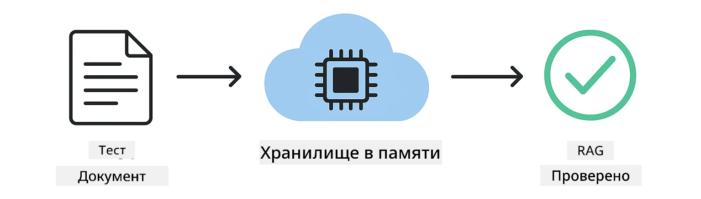

# Тестирование приложений LangChain4j

## Содержание

- [Быстрый старт](#быстрый-старт)
- [Что охватывают тесты](#что-охватывают-тесты)
- [Запуск тестов](#запуск-тестов)
- [Запуск тестов в VS Code](#запуск-тестов-в-vs-code)
- [Паттерны тестирования](#паттерны-тестирования)
- [Философия тестирования](#философия-тестирования)
- [Дальнейшие шаги](#дальнейшие-шаги)

Это руководство проведет вас через тесты, которые демонстрируют, как тестировать AI-приложения без необходимости использования API-ключей или внешних сервисов.

## Быстрый старт

Запустите все тесты одной командой:

**Bash:**
```bash
mvn test
```

**PowerShell:**
```powershell
mvn --% test
```

Когда все тесты пройдут, вы увидите вывод, похожий на скриншот ниже — все тесты выполнены без ошибок.



*Успешное выполнение тестов с нулевым числом ошибок*

## Что охватывают тесты

Этот курс сосредоточен на **модульных тестах**, которые выполняются локально. Каждый тест демонстрирует конкретную концепцию LangChain4j в изоляции. Пирамида тестирования ниже показывает, где размещаются модульные тесты — они образуют быстрый и надежный фундамент для всей вашей стратегии тестирования.



*Пирамида тестирования, показывающая баланс между модульными тестами (быстрыми, изолированными), интеграционными тестами (с реальными компонентами) и end-to-end тестами. В этом обучении рассматривается модульное тестирование.*

| Модуль | Тесты | Фокус | Ключевые файлы |
|--------|-------|-------|-----------|
| **01 - Введение** | 8 | Память диалога и состоянийный чат | `SimpleConversationTest.java` |
| **02 - Создание шаблонов запросов** | 12 | Паттерны GPT-5.2, уровни готовности, структурированный вывод | `SimpleGpt5PromptTest.java` |
| **03 - RAG** | 10 | Ввод документов, векторные представления, поиск по сходству | `DocumentServiceTest.java` |
| **04 - Инструменты** | 12 | Вызов функций и цепочки инструментов | `SimpleToolsTest.java` |
| **05 - MCP** | 8 | Протокол контекста модели с транспортом stdio | `SimpleMcpTest.java` |

## Запуск тестов

**Запуск всех тестов из корня:**

**Bash:**
```bash
mvn test
```

**PowerShell:**
```powershell
mvn --% test
```

**Запуск тестов для конкретного модуля:**

**Bash:**
```bash
cd 01-introduction && mvn test
# Или из root
mvn test -pl 01-introduction
```

**PowerShell:**
```powershell
cd 01-introduction; mvn --% test
# Или из корня
mvn --% test -pl 01-introduction
```

**Запуск одного класса тестов:**

**Bash:**
```bash
mvn test -Dtest=SimpleConversationTest
```

**PowerShell:**
```powershell
mvn --% test -Dtest=SimpleConversationTest
```

**Запуск конкретного метода теста:**

**Bash:**
```bash
mvn test -Dtest=SimpleConversationTest#следуетСохранятьИсториюРазговоров
```

**PowerShell:**
```powershell
mvn --% test -Dtest=SimpleConversationTest#следуетПоддерживатьИсториюБеседы
```

## Запуск тестов в VS Code

Если вы используете Visual Studio Code, Test Explorer предоставляет графический интерфейс для запуска и отладки тестов.



*Test Explorer в VS Code показывает дерево тестов со всеми классами и отдельными методами тестов на Java*

**Чтобы запустить тесты в VS Code:**

1. Откройте Test Explorer, нажав на иконку стакана в панели активности
2. Разверните дерево тестов, чтобы увидеть все модули и классы тестов
3. Нажмите кнопку запуска рядом с любым тестом для отдельного запуска
4. Нажмите "Запустить все тесты" для выполнения всего набора
5. Щелкните правой кнопкой мыши по тесту и выберите "Отладить тест", чтобы установить точки останова и пошагово выполнить код

Test Explorer показывает зеленые галочки для прошедших тестов и предоставляет подробные сообщения при ошибках.

## Паттерны тестирования

### Паттерн 1: Тестирование шаблонов запросов

Самый простой паттерн тестирует шаблоны запросов без вызова AI-модели. Вы проверяете, что подстановка переменных работает правильно и шаблоны форматируются как ожидается.



*Тестирование шаблонов запросов с показом замещения переменных: шаблон с заполнителями → примененные значения → проверенный отформатированный вывод*

```java
@Test
@DisplayName("Should format prompt template with variables")
void testPromptTemplateFormatting() {
    PromptTemplate template = PromptTemplate.from(
        "Best time to visit {{destination}} for {{activity}}?"
    );
    
    Prompt prompt = template.apply(Map.of(
        "destination", "Paris",
        "activity", "sightseeing"
    ));
    
    assertThat(prompt.text()).isEqualTo("Best time to visit Paris for sightseeing?");
}
```

Этот паттерн проверяет корректность подстановки переменных и правильность форматирования шаблонов — не требуется API-ключ или вызов модели.

### Паттерн 2: Мокирование языковых моделей

При тестировании логики диалогов используйте Mockito для создания фиктивных моделей, которые возвращают предопределённые ответы. Это делает тесты быстрыми, бесплатными и детерминированными.



*Сравнение, почему для тестирования предпочитают моки: они быстрые, бесплатные, детерминированные и не требуют API-ключей*

```java
@ExtendWith(MockitoExtension.class)
class SimpleConversationTest {
    
    private ConversationService conversationService;
    
    @Mock
    private OpenAiOfficialChatModel mockChatModel;
    
    @BeforeEach
    void setUp() {
        ChatResponse mockResponse = ChatResponse.builder()
            .aiMessage(AiMessage.from("This is a test response"))
            .build();
        when(mockChatModel.chat(anyList())).thenReturn(mockResponse);
        
        conversationService = new ConversationService(mockChatModel);
    }
    
    @Test
    void shouldMaintainConversationHistory() {
        String conversationId = conversationService.startConversation();
        
        ChatResponse mockResponse1 = ChatResponse.builder()
            .aiMessage(AiMessage.from("Response 1"))
            .build();
        ChatResponse mockResponse2 = ChatResponse.builder()
            .aiMessage(AiMessage.from("Response 2"))
            .build();
        ChatResponse mockResponse3 = ChatResponse.builder()
            .aiMessage(AiMessage.from("Response 3"))
            .build();
        
        when(mockChatModel.chat(anyList()))
            .thenReturn(mockResponse1)
            .thenReturn(mockResponse2)
            .thenReturn(mockResponse3);

        conversationService.chat(conversationId, "First message");
        conversationService.chat(conversationId, "Second message");
        conversationService.chat(conversationId, "Third message");

        List<ChatMessage> history = conversationService.getHistory(conversationId);
        assertThat(history).hasSize(6); // 3 сообщения от пользователя + 3 сообщения от ИИ
    }
}
```

Этот паттерн встречается в `01-introduction/src/test/java/com/example/langchain4j/service/SimpleConversationTest.java`. Мок обеспечивает стабильное поведение, чтобы проверить правильность управления памятью.

### Паттерн 3: Тестирование изоляции диалогов

Память диалога должна сохранять разделение между несколькими пользователями. Этот тест проверяет, что диалоги не смешивают контексты.



*Тестирование изоляции диалогов с раздельными хранилищами памяти для разных пользователей для предотвращения смешивания контекстов*

```java
@Test
void shouldIsolateConversationsByid() {
    String conv1 = conversationService.startConversation();
    String conv2 = conversationService.startConversation();
    
    ChatResponse mockResponse = ChatResponse.builder()
        .aiMessage(AiMessage.from("Response"))
        .build();
    when(mockChatModel.chat(anyList())).thenReturn(mockResponse);

    conversationService.chat(conv1, "Message for conversation 1");
    conversationService.chat(conv2, "Message for conversation 2");

    List<ChatMessage> history1 = conversationService.getHistory(conv1);
    List<ChatMessage> history2 = conversationService.getHistory(conv2);
    
    assertThat(history1).hasSize(2);
    assertThat(history2).hasSize(2);
}
```

Каждый диалог ведет собственную независимую историю. В продуктивных системах такая изоляция важна для многопользовательских приложений.

### Паттерн 4: Тестирование инструментов отдельно

Инструменты — это функции, которые AI может вызывать. Тестируйте их напрямую, чтобы убедиться, что они работают правильно независимо от решений AI.



*Тестирование инструментов отдельно с показом выполнения мок-инструментов без вызова AI для проверки бизнес-логики*

```java
@Test
void shouldConvertCelsiusToFahrenheit() {
    TemperatureTool tempTool = new TemperatureTool();
    String result = tempTool.celsiusToFahrenheit(25.0);
    assertThat(result).containsPattern("77[.,]0°F");
}

@Test
void shouldDemonstrateToolChaining() {
    WeatherTool weatherTool = new WeatherTool();
    TemperatureTool tempTool = new TemperatureTool();

    String weatherResult = weatherTool.getCurrentWeather("Seattle");
    assertThat(weatherResult).containsPattern("\\d+°C");

    String conversionResult = tempTool.celsiusToFahrenheit(22.0);
    assertThat(conversionResult).containsPattern("71[.,]6°F");
}
```

Эти тесты из `04-tools/src/test/java/com/example/langchain4j/agents/tools/SimpleToolsTest.java` проверяют логику инструментов без участия AI. Пример цепочки показывает, как выход одного инструмента становится входом другого.

### Паттерн 5: Тестирование RAG в памяти

Системы RAG обычно требуют векторных баз данных и сервисов эмбеддингов. Паттерн in-memory позволяет протестировать весь процесс без внешних зависимостей.



*Рабочий процесс тестирования RAG в памяти: парсинг документа, хранение эмбеддингов и поиск по сходству без необходимости базы данных*

```java
@Test
void testProcessTextDocument() {
    String content = "This is a test document.\nIt has multiple lines.";
    InputStream inputStream = new ByteArrayInputStream(content.getBytes(StandardCharsets.UTF_8));
    
    DocumentService.ProcessedDocument result = 
        documentService.processDocument(inputStream, "test.txt");

    assertNotNull(result);
    assertTrue(result.segments().size() > 0);
    assertEquals("test.txt", result.segments().get(0).metadata().getString("filename"));
}
```

Этот тест из `03-rag/src/test/java/com/example/langchain4j/rag/service/DocumentServiceTest.java` создает документ в памяти и проверяет нарезку на чанки и работу с метаданными.

### Паттерн 6: Интеграционное тестирование MCP

Модуль MCP тестирует интеграцию Протокола Контекста Модели с использованием транспорта stdio. Эти тесты проверяют, что ваше приложение может запускать и общаться с MCP-серверами как подпроцессами.

Тесты в `05-mcp/src/test/java/com/example/langchain4j/mcp/SimpleMcpTest.java` проверяют поведение MCP клиента.

**Запустите их:**

**Bash:**
```bash
cd 05-mcp && mvn test
```

**PowerShell:**
```powershell
cd 05-mcp; mvn --% test
```

## Философия тестирования

Тестируйте ваш код, а не AI. Ваши тесты должны проверять написанный вами код, контролируя построение шаблонов запросов, управление памятью и выполнение инструментов. Ответы AI меняются и не должны входить в утверждения тестов. Спрашивайте себя, правильно ли подставляются переменные в шаблоне запросов, а не дает ли AI правильный ответ.

Используйте моки для языковых моделей. Это внешние зависимости, которые медленные, дорогие и недетерминированные. Мокирование делает тесты быстрыми (миллисекунды вместо секунд), бесплатными (отсутствие расходов на API) и детерминированными (одинаковый результат каждое выполнение).

Держите тесты независимыми. Каждый тест должен создавать собственные данные, не зависеть от других тестов и очищаться после себя. Тесты должны проходить вне зависимости от порядка выполнения.

Тестируйте пограничные случаи, выходящие за рамки нормального сценария. Пробуйте пустые входные данные, очень большие объемы, специальные символы, некорректные параметры и граничные условия. Именно они часто выявляют баги, неочевидные при обычном использовании.

Используйте описательные имена. Сравните `shouldMaintainConversationHistoryAcrossMultipleMessages()` и `test1()`. Первое говорит вам точно, что тестируется, упрощая отладку при ошибках.

## Дальнейшие шаги

Теперь, когда вы понимаете паттерны тестирования, углубитесь в каждый модуль:

- **[01 - Введение](../01-introduction/README.md)** — Узнайте про управление памятью диалога
- **[02 - Создание шаблонов запросов](../02/prompt-engineering/README.md)** — Освойте паттерны создания запросов GPT-5.2
- **[03 - RAG](../03-rag/README.md)** — Создавайте системы расширенного генеративного поиска
- **[04 - Инструменты](../04-tools/README.md)** — Реализуйте вызов функций и цепочки инструментов
- **[05 - MCP](../05-mcp/README.md)** — Интегрируйте Протокол Контекста Модели

README каждого модуля содержит подробные объяснения концепций, проверяемых здесь.

---

**Навигация:** [← Назад к главной](../README.md)

---

<!-- CO-OP TRANSLATOR DISCLAIMER START -->
**Отказ от ответственности**:
Этот документ был переведен с использованием сервиса машинного перевода [Co-op Translator](https://github.com/Azure/co-op-translator). Несмотря на наши усилия по обеспечению точности, имейте в виду, что автоматический перевод может содержать ошибки или неточности. Оригинальный документ на его исходном языке следует считать авторитетным источником. Для получения критически важной информации рекомендуется обратиться к профессиональному человеческому переводу. Мы не несем ответственности за любые недоразумения или неправильные толкования, возникшие в результате использования этого перевода.
<!-- CO-OP TRANSLATOR DISCLAIMER END -->