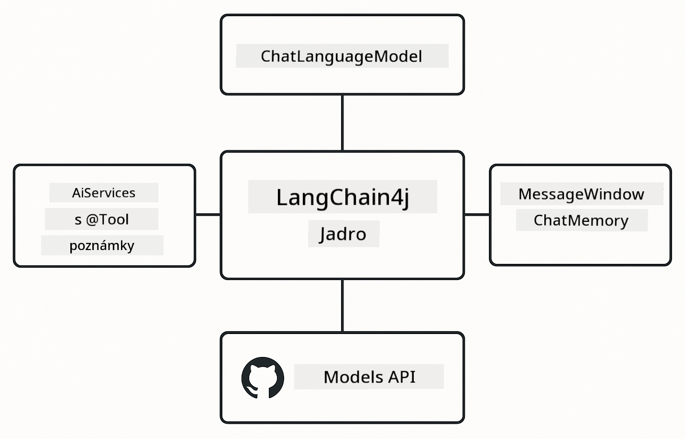

<!--
CO_OP_TRANSLATOR_METADATA:
{
  "original_hash": "377b3e3e6f8d02965bf0fbbc9ccb45c5",
  "translation_date": "2025-12-13T15:15:01+00:00",
  "source_file": "00-quick-start/README.md",
  "language_code": "sk"
}
-->
# Module 00: Rýchly štart

## Obsah

- [Úvod](../../../00-quick-start)
- [Čo je LangChain4j?](../../../00-quick-start)
- [Závislosti LangChain4j](../../../00-quick-start)
- [Predpoklady](../../../00-quick-start)
- [Nastavenie](../../../00-quick-start)
  - [1. Získajte svoj GitHub token](../../../00-quick-start)
  - [2. Nastavte svoj token](../../../00-quick-start)
- [Spustenie príkladov](../../../00-quick-start)
  - [1. Základný chat](../../../00-quick-start)
  - [2. Vzory promptov](../../../00-quick-start)
  - [3. Volanie funkcií](../../../00-quick-start)
  - [4. Otázky a odpovede k dokumentu (RAG)](../../../00-quick-start)
- [Čo každý príklad ukazuje](../../../00-quick-start)
- [Ďalšie kroky](../../../00-quick-start)
- [Riešenie problémov](../../../00-quick-start)

## Úvod

Tento rýchly štart je určený na to, aby ste sa čo najrýchlejšie zoznámili a začali pracovať s LangChain4j. Pokrýva úplné základy tvorby AI aplikácií s LangChain4j a GitHub modelmi. V ďalších moduloch použijete Azure OpenAI s LangChain4j na vytváranie pokročilejších aplikácií.

## Čo je LangChain4j?

LangChain4j je Java knižnica, ktorá zjednodušuje tvorbu aplikácií poháňaných AI. Namiesto práce s HTTP klientmi a parsovaním JSON pracujete s čistými Java API.

„Reťazec“ v LangChain znamená spájanie viacerých komponentov – môžete spojiť prompt s modelom a parserom, alebo spojiť viac AI volaní, kde výstup jedného slúži ako vstup ďalšieho. Tento rýchly štart sa zameriava na základy predtým, než preskúmate zložitejšie reťazce.


*Spájanie komponentov v LangChain4j – stavebné bloky sa prepájajú a vytvárajú výkonné AI pracovné postupy*

Použijeme tri základné komponenty:

**ChatLanguageModel** – rozhranie pre interakcie s AI modelom. Zavolajte `model.chat("prompt")` a získate odpoveď ako reťazec. Používame `OpenAiOfficialChatModel`, ktorý funguje s OpenAI-kompatibilnými endpointmi ako GitHub Models.

**AiServices** – vytvára typovo bezpečné rozhrania AI služieb. Definujte metódy, označte ich anotáciou `@Tool` a LangChain4j sa postará o orchestráciu. AI automaticky volá vaše Java metódy podľa potreby.

**MessageWindowChatMemory** – udržiava históriu konverzácie. Bez toho je každá požiadavka nezávislá. S ňou si AI pamätá predchádzajúce správy a udržiava kontext cez viacero kôl.



*Architektúra LangChain4j – základné komponenty spolupracujú na poháňaní vašich AI aplikácií*

## Závislosti LangChain4j

Tento rýchly štart používa dve Maven závislosti v [`pom.xml`](../../../00-quick-start/pom.xml):

```xml
<!-- Core LangChain4j library -->
<dependency>
    <groupId>dev.langchain4j</groupId>
    <artifactId>langchain4j</artifactId> <!-- Inherited from BOM in root pom.xml -->
</dependency>

<!-- OpenAI integration (works with GitHub Models) -->
<dependency>
    <groupId>dev.langchain4j</groupId>
    <artifactId>langchain4j-open-ai-official</artifactId> <!-- Inherited from BOM in root pom.xml -->
</dependency>
```

Modul `langchain4j-open-ai-official` poskytuje triedu `OpenAiOfficialChatModel`, ktorá sa pripája k OpenAI-kompatibilným API. GitHub Models používa rovnaký formát API, takže nie je potrebný žiadny špeciálny adaptér – stačí nastaviť základnú URL na `https://models.github.ai/inference`.

## Predpoklady

**Používate Dev Container?** Java a Maven sú už nainštalované. Potrebujete len GitHub Personal Access Token.

**Lokálny vývoj:**
- Java 21+, Maven 3.9+
- GitHub Personal Access Token (návod nižšie)

> **Poznámka:** Tento modul používa `gpt-4.1-nano` z GitHub Models. Nemodifikujte názov modelu v kóde – je nakonfigurovaný pre GitHub dostupné modely.

## Nastavenie

### 1. Získajte svoj GitHub token

1. Prejdite na [GitHub Nastavenia → Personal Access Tokens](https://github.com/settings/personal-access-tokens)
2. Kliknite na „Generate new token“
3. Nastavte popisný názov (napr. „LangChain4j Demo“)
4. Nastavte platnosť (odporúčané 7 dní)
5. V sekcii „Account permissions“ nájdite „Models“ a nastavte na „Read-only“
6. Kliknite na „Generate token“
7. Skopírujte a uložte token – už ho neuvidíte

### 2. Nastavte svoj token

**Možnosť 1: Použitie VS Code (odporúčané)**

Ak používate VS Code, pridajte token do súboru `.env` v koreňovom adresári projektu:

Ak súbor `.env` neexistuje, skopírujte `.env.example` do `.env` alebo vytvorte nový `.env` súbor v koreňovom adresári.

**Príklad `.env` súboru:**
```bash
# V /workspaces/LangChain4j-for-Beginners/.env
GITHUB_TOKEN=your_token_here
```

Potom môžete jednoducho kliknúť pravým tlačidlom na ktorýkoľvek demo súbor (napr. `BasicChatDemo.java`) v Prieskumníkovi a vybrať **„Run Java“** alebo použiť spúšťacie konfigurácie z panela Run and Debug.

**Možnosť 2: Použitie terminálu**

Nastavte token ako premennú prostredia:

**Bash:**
```bash
export GITHUB_TOKEN=your_token_here
```

**PowerShell:**
```powershell
$env:GITHUB_TOKEN=your_token_here
```

## Spustenie príkladov

**Použitie VS Code:** Jednoducho kliknite pravým tlačidlom na ktorýkoľvek demo súbor v Prieskumníkovi a vyberte **„Run Java“**, alebo použite spúšťacie konfigurácie z panela Run and Debug (predtým si pridajte token do `.env` súboru).

**Použitie Maven:** Alternatívne môžete spustiť z príkazového riadku:

### 1. Základný chat

**Bash:**
```bash
mvn compile exec:java -Dexec.mainClass=com.example.langchain4j.quickstart.BasicChatDemo
```

**PowerShell:**
```powershell
mvn --% compile exec:java -Dexec.mainClass=com.example.langchain4j.quickstart.BasicChatDemo
```

### 2. Vzory promptov

**Bash:**
```bash
mvn compile exec:java -Dexec.mainClass=com.example.langchain4j.quickstart.PromptEngineeringDemo
```

**PowerShell:**
```powershell
mvn --% compile exec:java -Dexec.mainClass=com.example.langchain4j.quickstart.PromptEngineeringDemo
```

Ukazuje zero-shot, few-shot, chain-of-thought a role-based prompting.

### 3. Volanie funkcií

**Bash:**
```bash
mvn compile exec:java -Dexec.mainClass=com.example.langchain4j.quickstart.ToolIntegrationDemo
```

**PowerShell:**
```powershell
mvn --% compile exec:java -Dexec.mainClass=com.example.langchain4j.quickstart.ToolIntegrationDemo
```

AI automaticky volá vaše Java metódy podľa potreby.

### 4. Otázky a odpovede k dokumentu (RAG)

**Bash:**
```bash
mvn compile exec:java -Dexec.mainClass=com.example.langchain4j.quickstart.SimpleReaderDemo
```

**PowerShell:**
```powershell
mvn --% compile exec:java -Dexec.mainClass=com.example.langchain4j.quickstart.SimpleReaderDemo
```

Pýtajte sa otázky o obsahu v `document.txt`.

## Čo každý príklad ukazuje

**Základný chat** - [BasicChatDemo.java](../../../00-quick-start/src/main/java/com/example/langchain4j/quickstart/BasicChatDemo.java)

Začnite tu, aby ste videli LangChain4j v jeho najjednoduchšej podobe. Vytvoríte `OpenAiOfficialChatModel`, pošlete prompt cez `.chat()` a dostanete odpoveď. Ukazuje to základy: ako inicializovať modely s vlastnými endpointmi a API kľúčmi. Keď pochopíte tento vzor, všetko ostatné na ňom staviate.

```java
ChatLanguageModel model = OpenAiOfficialChatModel.builder()
    .baseUrl("https://models.github.ai/inference")
    .apiKey(System.getenv("GITHUB_TOKEN"))
    .modelName("gpt-4.1-nano")
    .build();

String response = model.chat("What is LangChain4j?");
System.out.println(response);
```

> **🤖 Vyskúšajte s [GitHub Copilot](https://github.com/features/copilot) Chat:** Otvorte [`BasicChatDemo.java`](../../../00-quick-start/src/main/java/com/example/langchain4j/quickstart/BasicChatDemo.java) a spýtajte sa:
> - „Ako by som v tomto kóde prepol z GitHub Models na Azure OpenAI?“
> - „Aké ďalšie parametre môžem nastaviť v OpenAiOfficialChatModel.builder()?“
> - „Ako pridať streamovanie odpovedí namiesto čakania na kompletnú odpoveď?“

**Prompt Engineering** - [PromptEngineeringDemo.java](../../../00-quick-start/src/main/java/com/example/langchain4j/quickstart/PromptEngineeringDemo.java)

Keď už viete, ako komunikovať s modelom, preskúmajme, čo mu hovoríte. Toto demo používa rovnaké nastavenie modelu, ale ukazuje štyri rôzne vzory promptov. Vyskúšajte zero-shot prompt pre priame inštrukcie, few-shot prompty, ktoré sa učia z príkladov, chain-of-thought prompty, ktoré odhaľujú kroky uvažovania, a role-based prompty, ktoré nastavujú kontext. Uvidíte, ako rovnaký model dáva dramaticky odlišné výsledky podľa toho, ako formulujete požiadavku.

```java
PromptTemplate template = PromptTemplate.from(
    "What's the best time to visit {{destination}} for {{activity}}?"
);

Prompt prompt = template.apply(Map.of(
    "destination", "Paris",
    "activity", "sightseeing"
));

String response = model.chat(prompt.text());
```

> **🤖 Vyskúšajte s [GitHub Copilot](https://github.com/features/copilot) Chat:** Otvorte [`PromptEngineeringDemo.java`](../../../00-quick-start/src/main/java/com/example/langchain4j/quickstart/PromptEngineeringDemo.java) a spýtajte sa:
> - „Aký je rozdiel medzi zero-shot a few-shot promptingom a kedy použiť ktorý?“
> - „Ako parameter temperature ovplyvňuje odpovede modelu?“
> - „Aké sú techniky na zabránenie prompt injection útokom v produkcii?“
> - „Ako vytvoriť znovupoužiteľné objekty PromptTemplate pre bežné vzory?“

**Integrácia nástrojov** - [ToolIntegrationDemo.java](../../../00-quick-start/src/main/java/com/example/langchain4j/quickstart/ToolIntegrationDemo.java)

Tu LangChain4j ukazuje svoju silu. Použijete `AiServices` na vytvorenie AI asistenta, ktorý môže volať vaše Java metódy. Stačí označiť metódy anotáciou `@Tool("popis")` a LangChain4j sa postará o zvyšok – AI automaticky rozhodne, kedy použiť ktorý nástroj podľa požiadaviek používateľa. Ukazuje to volanie funkcií, kľúčovú techniku na tvorbu AI, ktorá môže vykonávať akcie, nielen odpovedať na otázky.

```java
@Tool("Performs addition of two numeric values")
public double add(double a, double b) {
    return a + b;
}

MathAssistant assistant = AiServices.create(MathAssistant.class, model);
String response = assistant.chat("What is 25 plus 17?");
```

> **🤖 Vyskúšajte s [GitHub Copilot](https://github.com/features/copilot) Chat:** Otvorte [`ToolIntegrationDemo.java`](../../../00-quick-start/src/main/java/com/example/langchain4j/quickstart/ToolIntegrationDemo.java) a spýtajte sa:
> - „Ako funguje anotácia @Tool a čo s ňou LangChain4j robí na pozadí?“
> - „Môže AI volať viac nástrojov za sebou na riešenie zložitých problémov?“
> - „Čo sa stane, ak nástroj vyhodí výnimku – ako mám riešiť chyby?“
> - „Ako by som integroval skutočné API namiesto tohto príkladu kalkulačky?“

**Otázky a odpovede k dokumentu (RAG)** - [SimpleReaderDemo.java](../../../00-quick-start/src/main/java/com/example/langchain4j/quickstart/SimpleReaderDemo.java)

Tu uvidíte základy RAG (retrieval-augmented generation). Namiesto spoliehania sa na trénovacie dáta modelu načítate obsah z [`document.txt`](../../../00-quick-start/document.txt) a zahrniete ho do promptu. AI odpovedá na základe vášho dokumentu, nie všeobecných znalostí. Toto je prvý krok k tvorbe systémov, ktoré môžu pracovať s vašimi vlastnými dátami.

```java
Document document = FileSystemDocumentLoader.loadDocument("document.txt");
String content = document.text();

String prompt = "Based on this document: " + content + 
                "\nQuestion: What is the main topic?";
String response = model.chat(prompt);
```

> **Poznámka:** Tento jednoduchý prístup načíta celý dokument do promptu. Pri veľkých súboroch (>10KB) prekročíte limity kontextu. Modul 03 pokrýva delenie na časti a vektorové vyhľadávanie pre produkčné RAG systémy.

> **🤖 Vyskúšajte s [GitHub Copilot](https://github.com/features/copilot) Chat:** Otvorte [`SimpleReaderDemo.java`](../../../00-quick-start/src/main/java/com/example/langchain4j/quickstart/SimpleReaderDemo.java) a spýtajte sa:
> - „Ako RAG zabraňuje AI halucináciám v porovnaní s použitím trénovacích dát modelu?“
> - „Aký je rozdiel medzi týmto jednoduchým prístupom a použitím vektorových embeddingov na vyhľadávanie?“
> - „Ako by som to škáloval na viacero dokumentov alebo väčšie znalostné bázy?“
> - „Aké sú najlepšie praktiky na štruktúrovanie promptu, aby AI používala len poskytnutý kontext?“

## Ladenie

Príklady obsahujú `.logRequests(true)` a `.logResponses(true)`, aby sa zobrazovali API volania v konzole. Pomáha to riešiť problémy s autentifikáciou, limitmi alebo neočakávanými odpoveďami. V produkcii tieto príznaky odstráňte, aby ste znížili šum v logoch.

## Ďalšie kroky

**Ďalší modul:** [01-introduction - Začíname s LangChain4j a gpt-5 na Azure](../01-introduction/README.md)

---

**Navigácia:** [← Späť na hlavnú stránku](../README.md) | [Ďalej: Modul 01 - Úvod →](../01-introduction/README.md)

---

## Riešenie problémov

### Prvé zostavenie Maven

**Problém:** Počiatočné `mvn clean compile` alebo `mvn package` trvá dlho (10-15 minút)

**Príčina:** Maven musí pri prvom zostavení stiahnuť všetky závislosti projektu (Spring Boot, LangChain4j knižnice, Azure SDK a pod.).

**Riešenie:** Toto je normálne správanie. Následné zostavenia budú oveľa rýchlejšie, pretože závislosti sú uložené v cache lokálne. Dĺžka sťahovania závisí od rýchlosti vašej siete.

### Syntax Maven príkazov v PowerShell

**Problém:** Maven príkazy zlyhávajú s chybou `Unknown lifecycle phase ".mainClass=..."`

**Príčina:** PowerShell interpretuje `=` ako operátor priradenia pre premenné, čo narušuje syntax Maven vlastností.

**Riešenie:** Použite operátor zastavenia parsovania `--%` pred Maven príkazom:

**PowerShell:**
```powershell
mvn --% compile exec:java -Dexec.mainClass=com.example.langchain4j.quickstart.BasicChatDemo
```

**Bash:**
```bash
mvn compile exec:java -Dexec.mainClass=com.example.langchain4j.quickstart.BasicChatDemo
```

Operátor `--%` hovorí PowerShellu, aby všetky nasledujúce argumenty odovzdal Maven doslovne bez interpretácie.

### Zobrazenie emoji vo Windows PowerShell

**Problém:** AI odpovede zobrazujú nezmyselné znaky (napr. `????` alebo `â??`) namiesto emoji v PowerShelli

**Príčina:** Predvolené kódovanie PowerShellu nepodporuje UTF-8 emoji

**Riešenie:** Spustite tento príkaz pred spustením Java aplikácií:
```cmd
chcp 65001
```

Tým sa vynúti UTF-8 kódovanie v termináli. Alternatívne použite Windows Terminal, ktorý má lepšiu podporu Unicode.

---

<!-- CO-OP TRANSLATOR DISCLAIMER START -->
**Zrieknutie sa zodpovednosti**:
Tento dokument bol preložený pomocou AI prekladateľskej služby [Co-op Translator](https://github.com/Azure/co-op-translator). Aj keď sa snažíme o presnosť, majte prosím na pamäti, že automatizované preklady môžu obsahovať chyby alebo nepresnosti. Pôvodný dokument v jeho rodnom jazyku by mal byť považovaný za autoritatívny zdroj. Pre kritické informácie sa odporúča profesionálny ľudský preklad. Nie sme zodpovední za akékoľvek nedorozumenia alebo nesprávne interpretácie vyplývajúce z použitia tohto prekladu.
<!-- CO-OP TRANSLATOR DISCLAIMER END -->