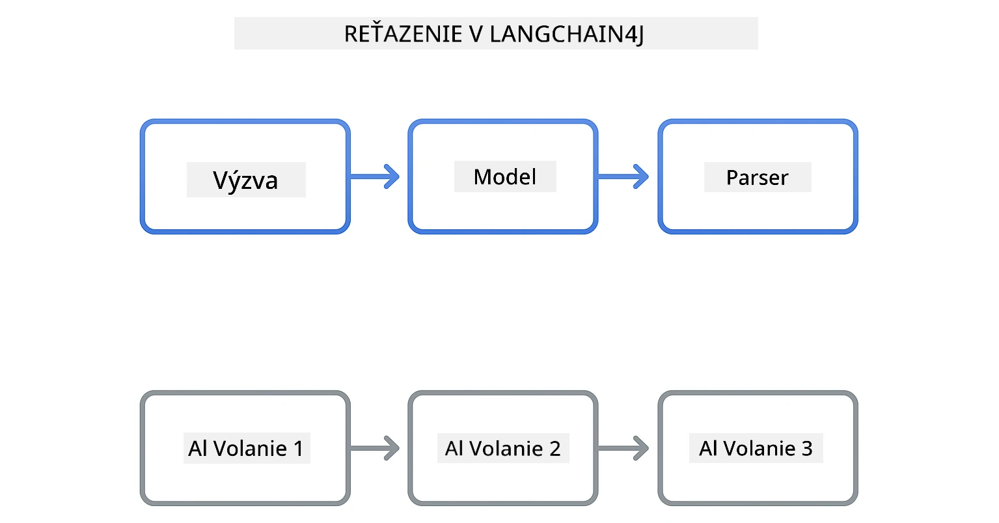
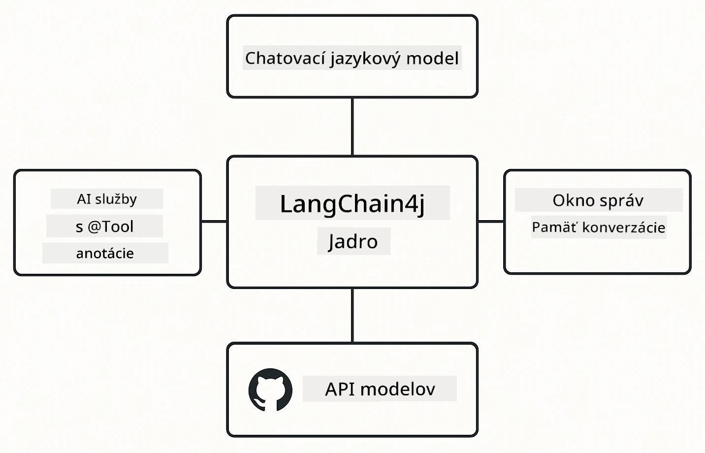

# Modul 00: Rýchly štart

## Obsah

- [Úvod](../../../00-quick-start)
- [Čo je LangChain4j?](../../../00-quick-start)
- [Závislosti LangChain4j](../../../00-quick-start)
- [Požiadavky](../../../00-quick-start)
- [Nastavenie](../../../00-quick-start)
  - [1. Získajte svoj GitHub token](../../../00-quick-start)
  - [2. Nastavte svoj token](../../../00-quick-start)
- [Spustenie príkladov](../../../00-quick-start)
  - [1. Základný chat](../../../00-quick-start)
  - [2. Vzory promptov](../../../00-quick-start)
  - [3. Volanie funkcií](../../../00-quick-start)
  - [4. Otázky a odpovede na dokumenty (RAG)](../../../00-quick-start)
  - [5. Zodpovedná umelá inteligencia](../../../00-quick-start)
- [Čo každý príklad ukazuje](../../../00-quick-start)
- [Ďalšie kroky](../../../00-quick-start)
- [Riešenie problémov](../../../00-quick-start)

## Úvod

Tento rýchly štart vám má pomôcť čo najrýchlejšie začať s LangChain4j. Pokrýva úplné základy tvorby AI aplikácií s LangChain4j a GitHub modelmi. V ďalších moduloch použijete Azure OpenAI s LangChain4j na vytvorenie pokročilejších aplikácií.

## Čo je LangChain4j?

LangChain4j je Java knižnica, ktorá zjednodušuje tvorbu aplikácií poháňaných umelou inteligenciou. Namiesto práce s HTTP klientmi a parsovaním JSON-u pracujete s čistými Java API.

"Reťazec" v LangChain znamená spájanie viacerých komponentov dohromady - môžete spojiť prompt s modelom, ten s parserom, alebo zladiť viac AI volaní tak, že výstup jedného slúži ako vstup do ďalšieho. Tento rýchly štart sa zameriava na základy pred tým, ako preskúmate zložitejšie reťazce.



*Spájanie komponentov v LangChain4j – stavebné kamene sa prepájajú na vytvorenie výkonných AI pracovných tokov*

Použijeme tri hlavné komponenty:

**ChatLanguageModel** – rozhranie pre interakcie s AI modelom. Zavolajte `model.chat("prompt")` a získate textovú odpoveď. Používame `OpenAiOfficialChatModel`, ktorý pracuje s OpenAI-kompatibilnými endpointmi ako GitHub Models.

**AiServices** – vytvára typovo bezpečné AI servisné rozhrania. Definujte metódy, anotujte ich `@Tool` a LangChain4j sa postará o orchestráciu. AI automaticky volá vaše Java metódy, keď to potrebuje.

**MessageWindowChatMemory** – udržiava históriu konverzácie. Bez neho je každá požiadavka nezávislá. S ním si AI pamätá predchádzajúce správy a udržuje kontext v priebehu viacerých kôl.



*Architektúra LangChain4j – hlavné komponenty spolupracujú na poháňaní vašich AI aplikácií*

## Závislosti LangChain4j

Tento rýchly štart používa dve Maven závislosti v [`pom.xml`](../../../00-quick-start/pom.xml):

```xml
<!-- Core LangChain4j library -->
<dependency>
    <groupId>dev.langchain4j</groupId>
    <artifactId>langchain4j</artifactId> <!-- Inherited from BOM in root pom.xml -->
</dependency>

<!-- OpenAI integration (works with GitHub Models) -->
<dependency>
    <groupId>dev.langchain4j</groupId>
    <artifactId>langchain4j-open-ai-official</artifactId> <!-- Inherited from BOM in root pom.xml -->
</dependency>
```
  
Modul `langchain4j-open-ai-official` poskytuje triedu `OpenAiOfficialChatModel`, ktorá sa pripája k OpenAI-kompatibilným API. GitHub Models používa rovnaký formát API, takže nie je potrebný žiadny špeciálny adaptér – stačí nastaviť základnú URL na `https://models.github.ai/inference`.

## Požiadavky

**Používate Dev Container?** Java a Maven sú už nainštalované. Potrebujete iba GitHub osobný prístupový token.

**Lokálny vývoj:**
- Java 21+, Maven 3.9+
- GitHub osobný prístupový token (návod nižšie)

> **Poznámka:** Tento modul používa model `gpt-4.1-nano` z GitHub Models. Nemajte zmenený názov modelu v kóde – je nakonfigurovaný tak, aby fungoval s dostupnými modelmi GitHub.

## Nastavenie

### 1. Získajte svoj GitHub token

1. Choďte na [GitHub Nastavenia → Osobné prístupové tokeny](https://github.com/settings/personal-access-tokens)
2. Kliknite na "Generate new token"
3. Nastavte popisný názov (napr. „LangChain4j Demo“)
4. Nastavte expiráciu (odporúča sa 7 dní)
5. V sekcii "Oprávnenia účtu" nájdite "Models" a nastavte na „Iba na čítanie“
6. Kliknite na "Generate token"
7. Skopírujte a uložte svoj token – už ho viac neuvidíte

### 2. Nastavte svoj token

**Možnosť 1: Použitie VS Code (odporúčané)**

Ak používate VS Code, pridajte token do súboru `.env` v koreňovom adresári projektu:

Ak súbor `.env` neexistuje, skopírujte `.env.example` do `.env` alebo vytvorte nový `.env` súbor.

**Príklad `.env` súboru:**
```bash
# V /workspaces/LangChain4j-for-Beginners/.env
GITHUB_TOKEN=your_token_here
```
  
Potom môžete jednoducho kliknúť pravým tlačidlom na ktorýkoľvek demo súbor (napr. `BasicChatDemo.java`) v Prieskumníkovi a vybrať **„Run Java“** alebo použiť spúšťacie konfigurácie z panela Run and Debug.

**Možnosť 2: Použitie Terminálu**

Nastavte token ako premennú prostredia:

**Bash:**
```bash
export GITHUB_TOKEN=your_token_here
```
  
**PowerShell:**
```powershell
$env:GITHUB_TOKEN=your_token_here
```
  
## Spustenie príkladov

**Použitie VS Code:** Jednoducho kliknite pravým tlačidlom na ktorýkoľvek demo súbor v Prieskumníkovi a vyberte **„Run Java“**, alebo použite spúšťacie konfigurácie z panela Run and Debug (predtým si zadajte token do `.env` súboru).

**Použitie Maven:** Alternatívne môžete spustiť cez príkazový riadok:

### 1. Základný chat

**Bash:**
```bash
mvn compile exec:java -Dexec.mainClass=com.example.langchain4j.quickstart.BasicChatDemo
```
  
**PowerShell:**
```powershell
mvn --% compile exec:java -Dexec.mainClass=com.example.langchain4j.quickstart.BasicChatDemo
```
  
### 2. Vzory promptov

**Bash:**
```bash
mvn compile exec:java -Dexec.mainClass=com.example.langchain4j.quickstart.PromptEngineeringDemo
```
  
**PowerShell:**
```powershell
mvn --% compile exec:java -Dexec.mainClass=com.example.langchain4j.quickstart.PromptEngineeringDemo
```
  
Ukazuje zero-shot, few-shot, chain-of-thought a role-based prompting.

### 3. Volanie funkcií

**Bash:**
```bash
mvn compile exec:java -Dexec.mainClass=com.example.langchain4j.quickstart.ToolIntegrationDemo
```
  
**PowerShell:**
```powershell
mvn --% compile exec:java -Dexec.mainClass=com.example.langchain4j.quickstart.ToolIntegrationDemo
```
  
AI automaticky volá vaše Java metódy, keď je to potrebné.

### 4. Otázky a odpovede na dokumenty (RAG)

**Bash:**
```bash
mvn compile exec:java -Dexec.mainClass=com.example.langchain4j.quickstart.SimpleReaderDemo
```
  
**PowerShell:**
```powershell
mvn --% compile exec:java -Dexec.mainClass=com.example.langchain4j.quickstart.SimpleReaderDemo
```
  
Pýtajte sa otázky o obsahu v `document.txt`.

### 5. Zodpovedná umelá inteligencia

**Bash:**
```bash
mvn compile exec:java -Dexec.mainClass=com.example.langchain4j.quickstart.ResponsibleAIDemo
```
  
**PowerShell:**
```powershell
mvn --% compile exec:java -Dexec.mainClass=com.example.langchain4j.quickstart.ResponsibleAIDemo
```
  
Ukazuje, ako AI bezpečnostné filtre blokujú škodlivý obsah.

## Čo každý príklad ukazuje

**Základný chat** - [BasicChatDemo.java](../../../00-quick-start/src/main/java/com/example/langchain4j/quickstart/BasicChatDemo.java)

Začnite tu, aby ste videli LangChain4j v jeho najjednoduchšej podobe. Vytvoríte `OpenAiOfficialChatModel`, pošlete prompt s `.chat()` a dostanete odpoveď. Toto predstavuje základ: ako inicializovať modely s vlastnými endpointmi a API kľúčmi. Keď toto pochopíte, všetko ostatné na tom stojí.

```java
ChatLanguageModel model = OpenAiOfficialChatModel.builder()
    .baseUrl("https://models.github.ai/inference")
    .apiKey(System.getenv("GITHUB_TOKEN"))
    .modelName("gpt-4.1-nano")
    .build();

String response = model.chat("What is LangChain4j?");
System.out.println(response);
```
  
> **🤖 Vyskúšajte s [GitHub Copilot](https://github.com/features/copilot) Chat:** Otvorte [`BasicChatDemo.java`](../../../00-quick-start/src/main/java/com/example/langchain4j/quickstart/BasicChatDemo.java) a spýtajte sa:
> - „Ako by som prešiel z GitHub Models na Azure OpenAI v tomto kóde?“
> - „Aké ďalšie parametre môžem nastaviť v OpenAiOfficialChatModel.builder()?“
> - „Ako pridám streamovanie odpovedí namiesto čakania na kompletnú odpoveď?“

**Inžinierstvo promptov** - [PromptEngineeringDemo.java](../../../00-quick-start/src/main/java/com/example/langchain4j/quickstart/PromptEngineeringDemo.java)

Teraz, keď viete, ako hovoriť s modelom, preskúmajme, čo mu hovoríte. Tento demo používa rovnaké nastavenie modelu, ale ukazuje štyri rôzne vzory promptovania. Vyskúšajte zero-shot prompt pre priame pokyny, few-shot prompt, ktorý sa učí z príkladov, chain-of-thought prompt, ktorý odhaľuje kroky uvažovania, a role-based prompt, ktorý nastavuje kontext. Uvidíte, ako rovnaký model poskytuje dramaticky odlišné výsledky v závislosti od toho, ako požiadavku formulujete.

```java
PromptTemplate template = PromptTemplate.from(
    "What's the best time to visit {{destination}} for {{activity}}?"
);

Prompt prompt = template.apply(Map.of(
    "destination", "Paris",
    "activity", "sightseeing"
));

String response = model.chat(prompt.text());
```
  
> **🤖 Vyskúšajte s [GitHub Copilot](https://github.com/features/copilot) Chat:** Otvorte [`PromptEngineeringDemo.java`](../../../00-quick-start/src/main/java/com/example/langchain4j/quickstart/PromptEngineeringDemo.java) a spýtajte sa:
> - „Aký je rozdiel medzi zero-shot a few-shot promptovaním a kedy použiť ktoré?“
> - „Ako parameter teploty ovplyvňuje odpovede modelu?“
> - „Aké sú techniky na zabránenie prompt injection útokom v produkcii?“
> - „Ako môžem vytvoriť znovu použiteľné objekty PromptTemplate pre bežné vzory?“

**Integrácia nástrojov** - [ToolIntegrationDemo.java](../../../00-quick-start/src/main/java/com/example/langchain4j/quickstart/ToolIntegrationDemo.java)

Tu sa LangChain4j stáva výkonným. Použijete `AiServices` na vytvorenie AI asistenta, ktorý môže volať vaše Java metódy. Len anotujete metódy s `@Tool("popis")` a LangChain4j sa postará o zvyšok – AI automaticky rozhoduje, kedy použiť ktorý nástroj podľa požiadaviek používateľa. Toto demonštruje volanie funkcií, kľúčovú techniku na vytváranie AI, ktorá môže konať, nie len odpovedať na otázky.

```java
@Tool("Performs addition of two numeric values")
public double add(double a, double b) {
    return a + b;
}

MathAssistant assistant = AiServices.create(MathAssistant.class, model);
String response = assistant.chat("What is 25 plus 17?");
```
  
> **🤖 Vyskúšajte s [GitHub Copilot](https://github.com/features/copilot) Chat:** Otvorte [`ToolIntegrationDemo.java`](../../../00-quick-start/src/main/java/com/example/langchain4j/quickstart/ToolIntegrationDemo.java) a spýtajte sa:
> - „Ako funguje anotácia @Tool a čo s ňou LangChain4j robí na pozadí?“
> - „Môže AI zavolať viaceré nástroje v poradí na vyriešenie komplexných problémov?“
> - „Čo sa stane, ak nástroj vyhodí výnimku – ako mám riešiť chyby?“
> - „Ako by som integroval reálne API namiesto tohto príkladu kalkulačky?“

**Otázky a odpovede na dokumenty (RAG)** - [SimpleReaderDemo.java](../../../00-quick-start/src/main/java/com/example/langchain4j/quickstart/SimpleReaderDemo.java)

Tu uvidíte základy RAG (retrieval-augmented generation). Namiesto spoliehania sa na trénovacie dáta modelu načítate obsah z [`document.txt`](../../../00-quick-start/document.txt) a zahrniete ho do promptu. AI odpovedá na základe vášho dokumentu, nie všeobecných znalostí modelu. Toto je prvý krok k vytváraniu systémov, ktoré dokážu pracovať s vlastnými dátami.

```java
Document document = FileSystemDocumentLoader.loadDocument("document.txt");
String content = document.text();

String prompt = "Based on this document: " + content + 
                "\nQuestion: What is the main topic?";
String response = model.chat(prompt);
```
  
> **Poznámka:** Tento jednoduchý prístup načíta celý dokument do promptu. Pri veľkých súboroch (>10KB) prekročíte limit kontextu. Modul 03 sa venuje delenému spracovaniu a vektorovému vyhľadávaniu pre produkčné RAG systémy.

> **🤖 Vyskúšajte s [GitHub Copilot](https://github.com/features/copilot) Chat:** Otvorte [`SimpleReaderDemo.java`](../../../00-quick-start/src/main/java/com/example/langchain4j/quickstart/SimpleReaderDemo.java) a spýtajte sa:
> - „Ako RAG zabraňuje halucináciám AI v porovnaní s využitím tréningových dát modelu?“
> - „Aký je rozdiel medzi týmto jednoduchým prístupom a použitím vektorových embeddingov pre vyhľadávanie?“
> - „Ako by som to škáloval pre viaceré dokumenty alebo väčšie databázy znalostí?“
> - „Aké sú najlepšie postupy pre štruktúrovanie promptu, aby AI použila len poskytnutý kontext?“

**Zodpovedná umelá inteligencia** - [ResponsibleAIDemo.java](../../../00-quick-start/src/main/java/com/example/langchain4j/quickstart/ResponsibleAIDemo.java)

Budujte bezpečnosť AI s obrannou hĺbkou. Tento demo ukazuje dve vrstvy ochrany, ktoré spolupracujú:

**Časť 1: LangChain4j ochranné pravidlá vstupu (Input Guardrails)** – Blokujte nebezpečné prompty pred tým, než sa dostanú k LLM. Vytvárajte vlastné pravidlá, ktoré kontrolujú zakázané kľúčové slová alebo vzory. Bežia vo vašom kóde, sú rýchle a bezplatné.

```java
class DangerousContentGuardrail implements InputGuardrail {
    @Override
    public InputGuardrailResult validate(UserMessage userMessage) {
        String text = userMessage.singleText().toLowerCase();
        if (text.contains("explosives")) {
            return fatal("Blocked: contains prohibited keyword");
        }
        return success();
    }
}
```
  
**Časť 2: Bezpečnostné filtre poskytovateľa** – GitHub Models má zabudované filtre, ktoré zachytia to, čo vaše pravidlá môžu prehliadnuť. Uvidíte tvrdé bloky (HTTP 400 chyby) pre vážne porušenia a jemné odmietnutia, kde AI zdvorilo odmietne.

> **🤖 Vyskúšajte s [GitHub Copilot](https://github.com/features/copilot) Chat:** Otvorte [`ResponsibleAIDemo.java`](../../../00-quick-start/src/main/java/com/example/langchain4j/quickstart/ResponsibleAIDemo.java) a spýtajte sa:
> - „Čo je InputGuardrail a ako vytvorím vlastný?“
> - „Aký je rozdiel medzi tvrdým blokom a jemným odmietnutím?“
> - „Prečo používať súčasne guardrails a filtre poskytovateľa?“

## Ďalšie kroky

**Ďalší modul:** [01-introduction - Začíname s LangChain4j a gpt-5 na Azure](../01-introduction/README.md)

---

**Navigácia:** [← Späť na Hlavnú stránku](../README.md) | [Ďalej: Modul 01 - Úvod →](../01-introduction/README.md)

---

## Riešenie problémov

### Prvý Maven build

**Problém:** Počiatočný `mvn clean compile` alebo `mvn package` trvá dlho (10–15 minút)

**Príčina:** Maven potrebuje pri prvom compile stiahnuť všetky závislosti projektu (Spring Boot, LangChain4j knižnice, Azure SDK a pod.).

**Riešenie:** Toto je normálne správanie. Následné buildy budú výrazne rýchlejšie, pretože závislosti sú uložené v cache lokálne. Dĺžka sťahovania závisí od rýchlosti vašej siete.

### Syntax príkazov Maven v PowerShell

**Problém:** Maven príkazy zlyhajú s chybou `Unknown lifecycle phase ".mainClass=..."`

**Príčina:** PowerShell interpretuje `=` ako operátor priradenia pre premenné, čo narúša syntax vlastností Maven.
**Riešenie**: Použite operátor zastavenia parsovania `--%` pred príkazom Maven:

**PowerShell:**
```powershell
mvn --% compile exec:java -Dexec.mainClass=com.example.langchain4j.quickstart.BasicChatDemo
```

**Bash:**
```bash
mvn compile exec:java -Dexec.mainClass=com.example.langchain4j.quickstart.BasicChatDemo
```

Operátor `--%` hovorí PowerShellu, aby všetky nasledujúce argumenty odovzdal priamo do Mavenu bez interpretácie.

### Zobrazenie emodži vo Windows PowerShell

**Problém**: Odpovede AI zobrazujú nezmyselné znaky (napr. `????` alebo `â??`) namiesto emodži v PowerShelli

**Príčina**: Predvolené kódovanie PowerShellu nepodporuje UTF-8 emodži

**Riešenie**: Spustite tento príkaz pred spustením Java aplikácií:
```cmd
chcp 65001
```

Tým sa v termináli vynúti kódovanie UTF-8. Alternatívne použite Windows Terminal, ktorý má lepšiu podporu Unicode.

### Ladenie volaní API

**Problém**: Chyby overenia, limity rýchlosti alebo neočakávané odpovede od AI modelu

**Riešenie**: Príklady obsahujú `.logRequests(true)` a `.logResponses(true)`, ktoré zobrazujú volania API v konzole. To pomáha pri riešení chýb overenia, limitov rýchlosti alebo neočakávaných odpovedí. V produkcii tieto príznaky odstráňte, aby ste znížili množstvo výpisov.

---

<!-- CO-OP TRANSLATOR DISCLAIMER START -->
**Zrieknutie sa zodpovednosti**:
Tento dokument bol preložený pomocou AI prekladateľskej služby [Co-op Translator](https://github.com/Azure/co-op-translator). Hoci sa snažíme o presnosť, berte prosím na vedomie, že automatické preklady môžu obsahovať chyby alebo nepresnosti. Originálny dokument v jeho pôvodnom jazyku by mal byť považovaný za autoritatívny zdroj. Pre dôležité informácie sa odporúča profesionálny ľudský preklad. Nie sme zodpovední za akékoľvek nedorozumenia alebo nesprávne interpretácie vzniknuté použitím tohto prekladu.
<!-- CO-OP TRANSLATOR DISCLAIMER END -->