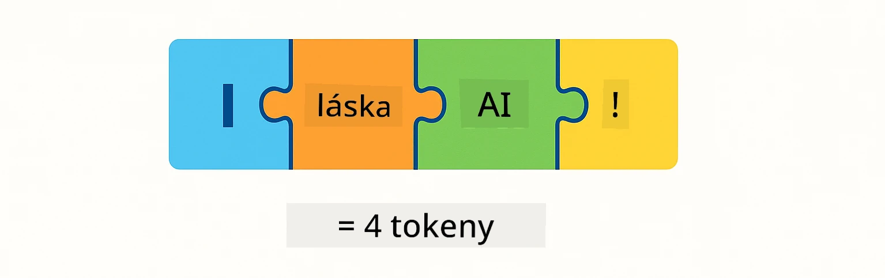
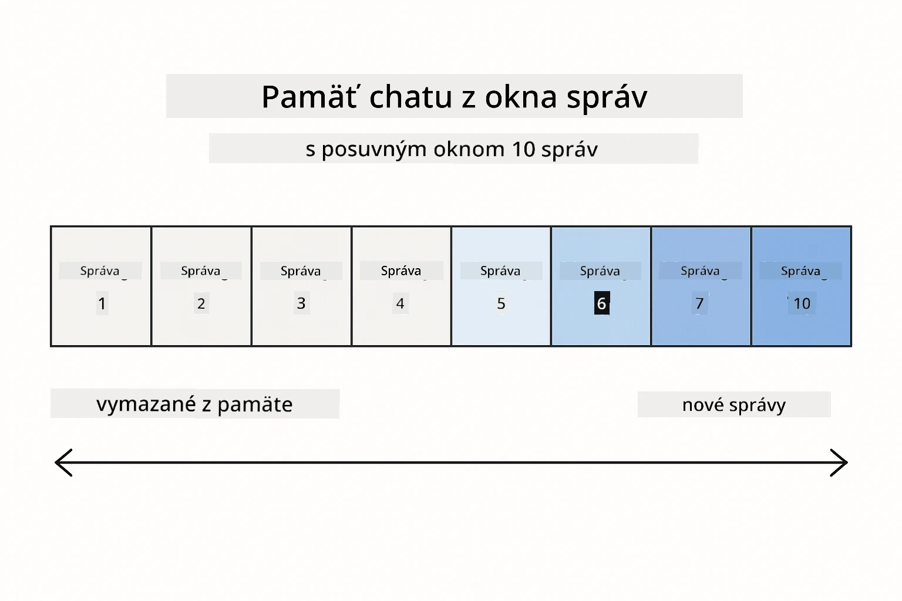
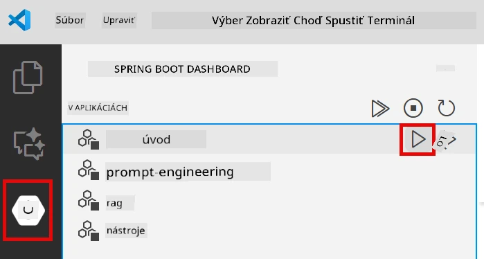
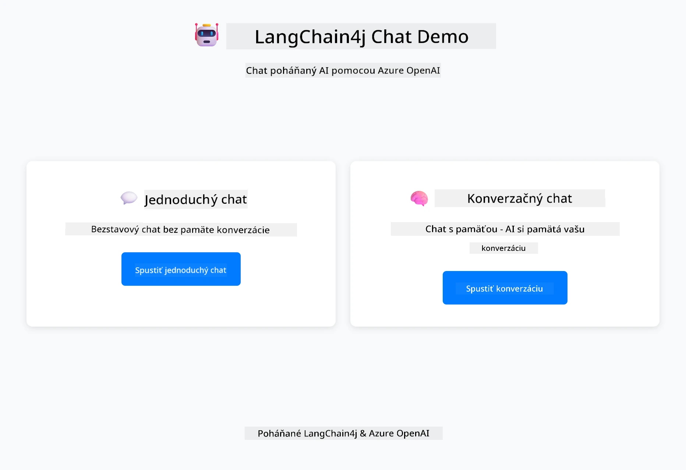
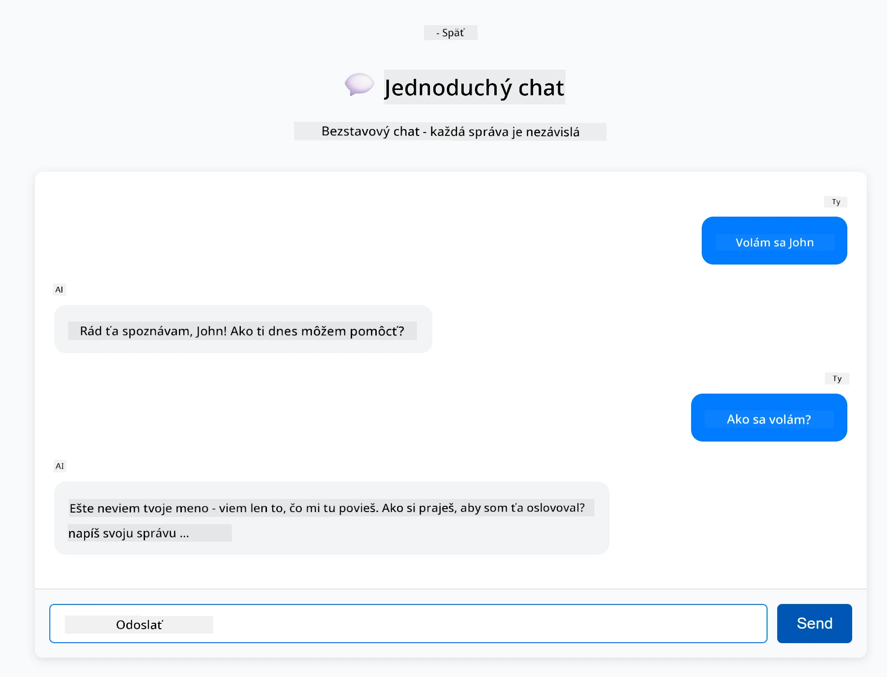
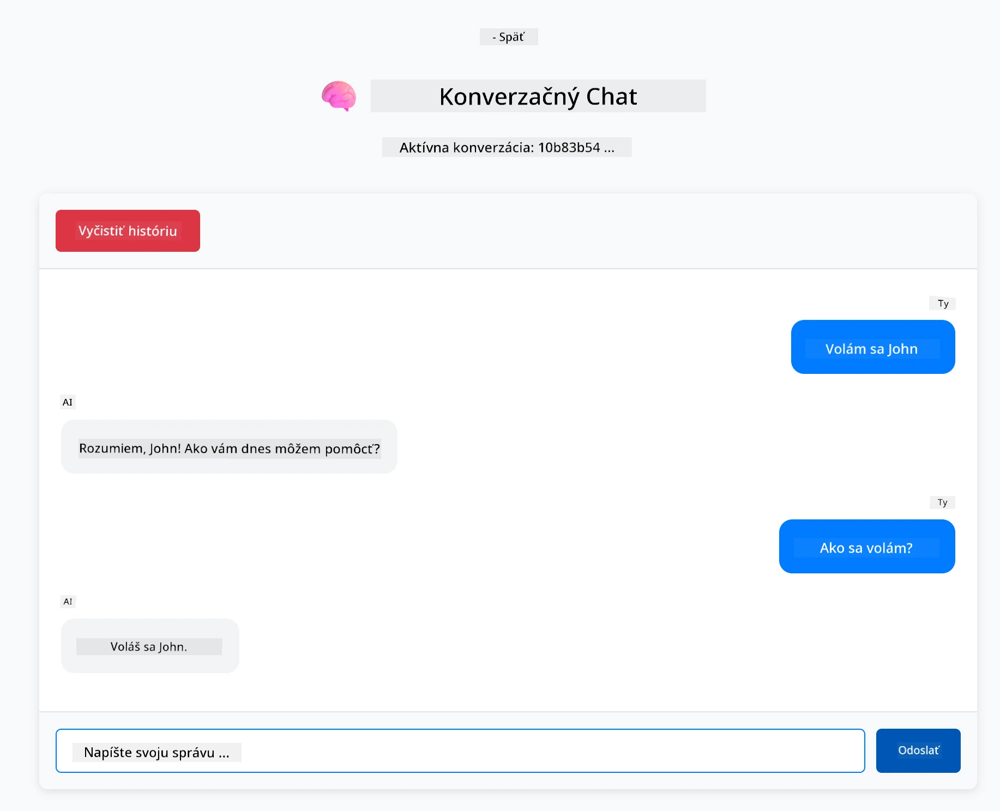

# Modul 01: Začíname s LangChain4j

## Obsah

- [Čo sa naučíte](../../../01-introduction)
- [Predpoklady](../../../01-introduction)
- [Pochopenie základného problému](../../../01-introduction)
- [Pochopenie tokenov](../../../01-introduction)
- [Ako funguje pamäť](../../../01-introduction)
- [Ako toto používa LangChain4j](../../../01-introduction)
- [Nasadenie infraštruktúry Azure OpenAI](../../../01-introduction)
- [Spustenie aplikácie lokálne](../../../01-introduction)
- [Používanie aplikácie](../../../01-introduction)
  - [Stateless chat (ľavý panel)](../../../01-introduction)
  - [Stateful chat (pravý panel)](../../../01-introduction)
- [Ďalšie kroky](../../../01-introduction)

## Čo sa naučíte

Ak ste dokončili rýchly štart, videli ste, ako posielať výzvy a získavať odpovede. To je základ, ale skutočné aplikácie potrebujú viac. Tento modul vás naučí, ako vytvoriť konverzačné AI, ktoré si pamätá kontext a udržiava stav - rozdiel medzi jednorazovou ukážkou a aplikáciou pripravenou na produkciu.

V celom návode budeme používať GPT-5 od Azure OpenAI, pretože jeho pokročilé schopnosti uvažovania robia správanie rôznych vzorov zreteľnejším. Keď pridáte pamäť, jasne uvidíte rozdiel. To uľahčuje pochopenie, čo každý komponent prináša vašej aplikácii.

Vytvoríte jednu aplikáciu, ktorá demonštruje oba vzory:

**Stateless chat** - Každý požiadavok je nezávislý. Model si nepamätá predchádzajúce správy. Toto je vzor, ktorý ste použili v rýchlom štarte.

**Stateful konverzácia** - Každý požiadavok obsahuje históriu konverzácie. Model udržiava kontext cez viacero kôl. Toto je to, čo vyžadujú produkčné aplikácie.

## Predpoklady

- Predplatné Azure s prístupom k Azure OpenAI
- Java 21, Maven 3.9+
- Azure CLI (https://learn.microsoft.com/en-us/cli/azure/install-azure-cli)
- Azure Developer CLI (azd) (https://learn.microsoft.com/en-us/azure/developer/azure-developer-cli/install-azd)

> **Poznámka:** Java, Maven, Azure CLI a Azure Developer CLI (azd) sú predinštalované v poskytnutom devcontaineri.

> **Poznámka:** Tento modul používa GPT-5 na Azure OpenAI. Nasadenie je automaticky nakonfigurované cez `azd up` - nemeníte názov modelu v kóde.

## Pochopenie základného problému

Jazykové modely sú bezstavové. Každé volanie API je nezávislé. Ak pošlete "Volám sa John" a potom sa opýtate "Ako sa volám?", model netuší, že ste sa práve predstavili. Každý požiadavok spracováva, akoby to bola vaša prvá konverzácia.

To je v poriadku pre jednoduché otázky a odpovede, ale na skutočné aplikácie to nestačí. Chatboti zákazníckej podpory si musia pamätať, čo ste im povedali. Osobní asistenti potrebujú kontext. Každá viackolová konverzácia vyžaduje pamäť.


*Rozdiel medzi bezstavovými (nezávislými volaniami) a stavovými (s vedomím kontextu) konverzáciami*

## Pochopenie tokenov

Predtým, než sa pustíte do konverzácií, je dôležité pochopiť tokeny - základné jednotky textu, ktoré jazykové modely spracovávajú:



*Príklad, ako sa text rozkladá na tokeny - "I love AI!" sa stáva 4 samostatnými spracovateľskými jednotkami*

Tokeny sú spôsob, akým AI modely merajú a spracovávajú text. Slová, interpunkcia a dokonca aj medzery môžu byť tokeny. Váš model má limit, koľko tokenov môže spracovať naraz (400 000 pre GPT-5, s až 272 000 vstupnými tokenmi a 128 000 výstupnými tokenmi). Pochopenie tokenov vám pomôže riadiť dĺžku konverzácie a náklady.

## Ako funguje pamäť

Pamäť chatu rieši problém bezstavovosti tým, že udržiava históriu konverzácie. Pred odoslaním požiadavky modelu rámec pridá relevantné predchádzajúce správy. Keď sa opýtate "Ako sa volám?", systém v skutočnosti pošle celú históriu konverzácie, čo umožní modelu vidieť, že ste predtým povedali "Volám sa John."

LangChain4j poskytuje implementácie pamäte, ktoré to automaticky zvládajú. Vy si vyberiete, koľko správ chcete uchovať, a rámec spravuje kontextové okno.



*MessageWindowChatMemory udržiava posuvné okno nedávnych správ, automaticky vyhadzujúc staré*

## Ako toto používa LangChain4j

Tento modul rozširuje rýchly štart integráciou Spring Boot a pridáva pamäť konverzácie. Takto do seba zapadajú jednotlivé časti:

**Závislosti** - Pridajte dve knižnice LangChain4j:

```xml
<dependency>
    <groupId>dev.langchain4j</groupId>
    <artifactId>langchain4j</artifactId> <!-- Inherited from BOM in root pom.xml -->
</dependency>
<dependency>
    <groupId>dev.langchain4j</groupId>
    <artifactId>langchain4j-open-ai-official</artifactId> <!-- Inherited from BOM in root pom.xml -->
</dependency>
```

**Chat model** - Nakonfigurujte Azure OpenAI ako Spring bean ([LangChainConfig.java](../../../01-introduction/src/main/java/com/example/langchain4j/config/LangChainConfig.java)):

```java
@Bean
public OpenAiOfficialChatModel openAiOfficialChatModel() {
    return OpenAiOfficialChatModel.builder()
            .baseUrl(azureEndpoint)
            .apiKey(azureApiKey)
            .modelName(deploymentName)
            .timeout(Duration.ofMinutes(5))
            .maxRetries(3)
            .build();
}
```

Builder číta poverenia z environmentálnych premenných nastavených `azd up`. Nastavenie `baseUrl` na váš Azure endpoint umožňuje klientovi OpenAI pracovať s Azure OpenAI.

**Pamäť konverzácie** - Sledujte históriu chatu pomocou MessageWindowChatMemory ([ConversationService.java](../../../01-introduction/src/main/java/com/example/langchain4j/service/ConversationService.java)):

```java
ChatMemory memory = MessageWindowChatMemory.withMaxMessages(10);

memory.add(UserMessage.from("My name is John"));
memory.add(AiMessage.from("Nice to meet you, John!"));

memory.add(UserMessage.from("What's my name?"));
AiMessage aiMessage = chatModel.chat(memory.messages()).aiMessage();
memory.add(aiMessage);
```

Vytvorte pamäť s `withMaxMessages(10)`, aby ste uchovali posledných 10 správ. Pridávajte správy používateľa a AI s typovanými obalmi: `UserMessage.from(text)` a `AiMessage.from(text)`. Históriu získate cez `memory.messages()` a pošlete ju modelu. Služba ukladá samostatné inštancie pamäte pre každé ID konverzácie, čo umožňuje viacerým používateľom chatovať súčasne.

> **🤖 Vyskúšajte s [GitHub Copilot](https://github.com/features/copilot) Chat:** Otvorte [`ConversationService.java`](../../../01-introduction/src/main/java/com/example/langchain4j/service/ConversationService.java) a opýtajte sa:
> - "Ako MessageWindowChatMemory rozhoduje, ktoré správy vyhodiť, keď je okno plné?"
> - "Môžem implementovať vlastné ukladanie pamäte pomocou databázy namiesto pamäte v RAM?"
> - "Ako by som pridal zhrnutie na kompresiu starej histórie konverzácie?"

Stateless chat endpoint úplne vynecháva pamäť - len `chatModel.chat(prompt)` ako v rýchlom štarte. Stateful endpoint pridáva správy do pamäte, získava históriu a zahrňuje tento kontext pri každom požiadavku. Rovnaká konfigurácia modelu, rôzne vzory.

## Nasadenie Azure OpenAI infraštruktúry

**Bash:**
```bash
cd 01-introduction
azd up  # Vyberte predplatné a umiestnenie (odporúča sa eastus2)
```

**PowerShell:**
```powershell
cd 01-introduction
azd up  # Vyberte predplatné a umiestnenie (odporúča sa eastus2)
```

> **Poznámka:** Ak narazíte na chybu timeoutu (`RequestConflict: Cannot modify resource ... provisioning state is not terminal`), jednoducho spustite `azd up` znova. Azure zdroje môžu byť stále v procese nasadzovania na pozadí a opakovaný pokus umožní dokončenie nasadenia, keď zdroje dosiahnu konečný stav.

Toto vykoná:
1. Nasadí Azure OpenAI zdroj s modelmi GPT-5 a text-embedding-3-small
2. Automaticky vygeneruje `.env` súbor v koreňovom adresári projektu s povereniami
3. Nastaví všetky potrebné environmentálne premenné

**Máte problémy s nasadením?** Pozrite si [Infrastructure README](infra/README.md) pre podrobné riešenie problémov vrátane konfliktov názvov subdomén, manuálnych krokov nasadenia cez Azure Portal a usmernení pre konfiguráciu modelu.

**Overenie úspešnosti nasadenia:**

**Bash:**
```bash
cat ../.env  # Malo by zobraziť AZURE_OPENAI_ENDPOINT, API_KEY, atď.
```

**PowerShell:**
```powershell
Get-Content ..\.env  # Malo by zobraziť AZURE_OPENAI_ENDPOINT, API_KEY, atď.
```

> **Poznámka:** Príkaz `azd up` automaticky generuje `.env` súbor. Ak ho potrebujete neskôr aktualizovať, môžete buď manuálne upraviť `.env` súbor, alebo ho znovu vygenerovať spustením:
>
> **Bash:**
> ```bash
> cd ..
> bash .azd-env.sh
> ```
>
> **PowerShell:**
> ```powershell
> cd ..
> .\.azd-env.ps1
> ```

## Spustenie aplikácie lokálne

**Overenie nasadenia:**

Uistite sa, že `.env` súbor existuje v koreňovom adresári s povereniami Azure:

**Bash:**
```bash
cat ../.env  # Malo by zobraziť AZURE_OPENAI_ENDPOINT, API_KEY, DEPLOYMENT
```

**PowerShell:**
```powershell
Get-Content ..\.env  # Malo by zobraziť AZURE_OPENAI_ENDPOINT, API_KEY, DEPLOYMENT
```

**Spustenie aplikácií:**

**Možnosť 1: Použitie Spring Boot Dashboard (odporúčané pre používateľov VS Code)**

Dev container obsahuje rozšírenie Spring Boot Dashboard, ktoré poskytuje vizuálne rozhranie na správu všetkých Spring Boot aplikácií. Nájdete ho v Activity Bar na ľavej strane VS Code (ikona Spring Boot).

Zo Spring Boot Dashboard môžete:
- Vidieť všetky dostupné Spring Boot aplikácie v pracovnom priestore
- Jedným kliknutím spustiť/zastaviť aplikácie
- Zobraziť logy aplikácie v reálnom čase
- Monitorovať stav aplikácie

Jednoducho kliknite na tlačidlo prehrávania vedľa "introduction" pre spustenie tohto modulu, alebo spustite všetky moduly naraz.



**Možnosť 2: Použitie shell skriptov**

Spustite všetky webové aplikácie (moduly 01-04):

**Bash:**
```bash
cd ..  # Z koreňového adresára
./start-all.sh
```

**PowerShell:**
```powershell
cd ..  # Z koreňového adresára
.\start-all.ps1
```

Alebo spustite len tento modul:

**Bash:**
```bash
cd 01-introduction
./start.sh
```

**PowerShell:**
```powershell
cd 01-introduction
.\start.ps1
```

Oba skripty automaticky načítajú environmentálne premenné z koreňového `.env` súboru a zostavia JAR súbory, ak ešte neexistujú.

> **Poznámka:** Ak chcete pred spustením manuálne zostaviť všetky moduly:
>
> **Bash:**
> ```bash
> cd ..  # Go to root directory
> mvn clean package -DskipTests
> ```
>
> **PowerShell:**
> ```powershell
> cd ..  # Go to root directory
> mvn clean package -DskipTests
> ```

Otvorte http://localhost:8080 vo vašom prehliadači.

**Na zastavenie:**

**Bash:**
```bash
./stop.sh  # Len tento modul
# Alebo
cd .. && ./stop-all.sh  # Všetky moduly
```

**PowerShell:**
```powershell
.\stop.ps1  # Len tento modul
# Alebo
cd ..; .\stop-all.ps1  # Všetky moduly
```

## Používanie aplikácie

Aplikácia poskytuje webové rozhranie s dvoma implementáciami chatu vedľa seba.



*Dashboard zobrazujúci možnosti Jednoduchý chat (bezstavový) a Konverzačný chat (stavový)*

### Stateless chat (ľavý panel)

Vyskúšajte najskôr toto. Povedzte "Volám sa John" a potom hneď "Ako sa volám?" Model si to nepamätá, pretože každá správa je nezávislá. Toto demonštruje základný problém integrácie jazykového modelu - žiadny kontext konverzácie.



*AI si nepamätá vaše meno z predchádzajúcej správy*

### Stateful chat (pravý panel)

Teraz vyskúšajte rovnakú sekvenciu tu. Povedzte "Volám sa John" a potom "Ako sa volám?" Tentoraz si to pamätá. Rozdiel je v MessageWindowChatMemory - udržiava históriu konverzácie a zahrňuje ju do každého požiadavku. Takto funguje produkčné konverzačné AI.



*AI si pamätá vaše meno z predchádzajúcej časti konverzácie*

Oba panely používajú rovnaký model GPT-5. Jediný rozdiel je pamäť. To jasne ukazuje, čo pamäť prináša vašej aplikácii a prečo je nevyhnutná pre reálne použitie.

## Ďalšie kroky

**Ďalší modul:** [02-prompt-engineering - Prompt Engineering s GPT-5](../02-prompt-engineering/README.md)

---

**Navigácia:** [← Predchádzajúci: Modul 00 - Rýchly štart](../00-quick-start/README.md) | [Späť na hlavnú stránku](../README.md) | [Ďalší: Modul 02 - Prompt Engineering →](../02-prompt-engineering/README.md)

---

<!-- CO-OP TRANSLATOR DISCLAIMER START -->
**Zrieknutie sa zodpovednosti**:
Tento dokument bol preložený pomocou AI prekladateľskej služby [Co-op Translator](https://github.com/Azure/co-op-translator). Aj keď sa snažíme o presnosť, prosím, majte na pamäti, že automatizované preklady môžu obsahovať chyby alebo nepresnosti. Pôvodný dokument v jeho rodnom jazyku by mal byť považovaný za autoritatívny zdroj. Pre kritické informácie sa odporúča profesionálny ľudský preklad. Nie sme zodpovední za akékoľvek nedorozumenia alebo nesprávne interpretácie vyplývajúce z použitia tohto prekladu.
<!-- CO-OP TRANSLATOR DISCLAIMER END -->