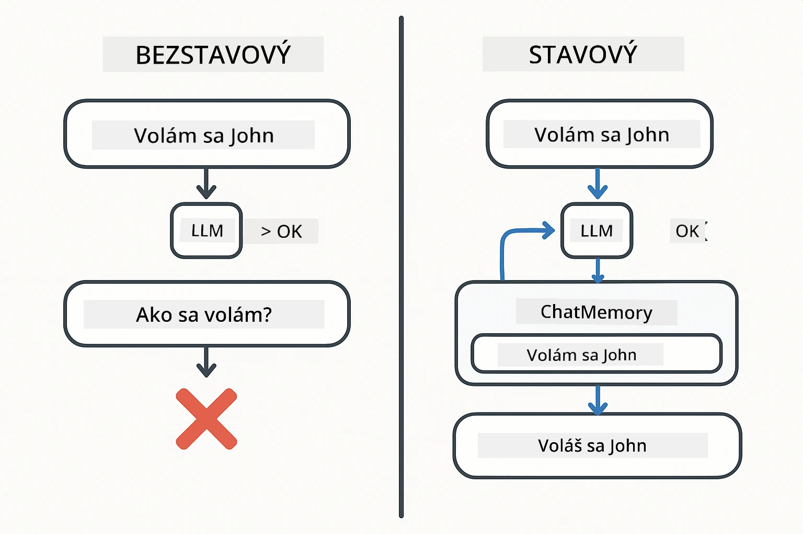
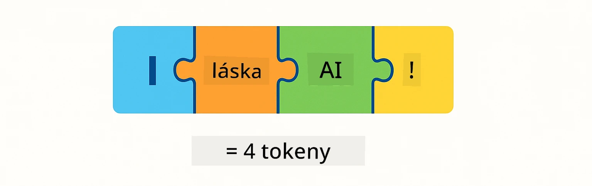
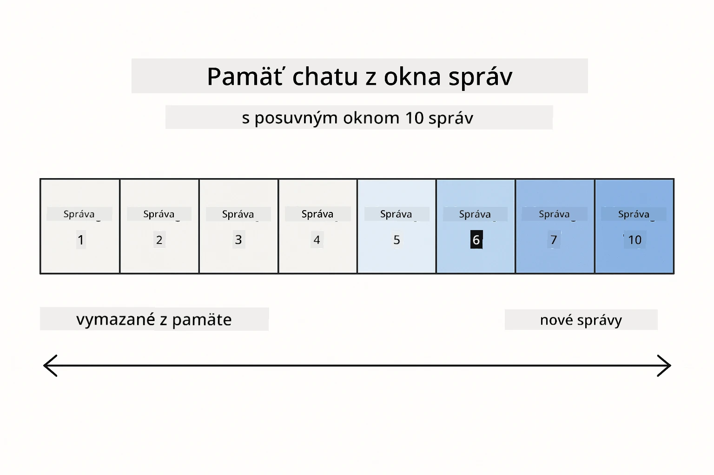
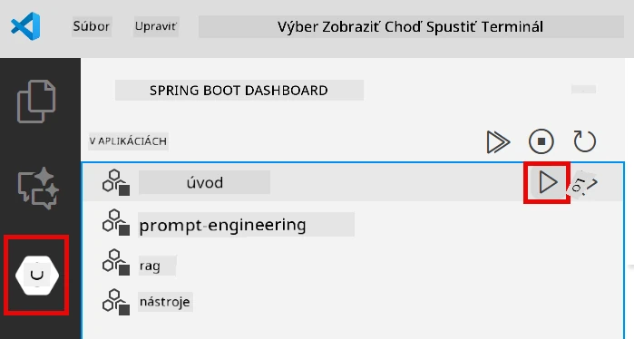
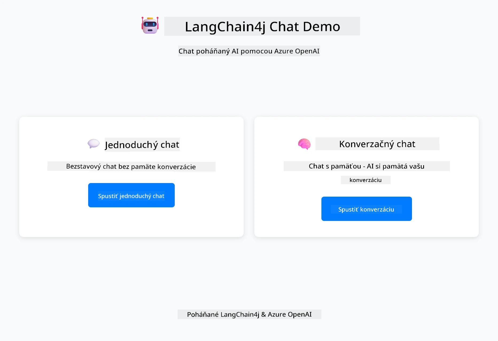
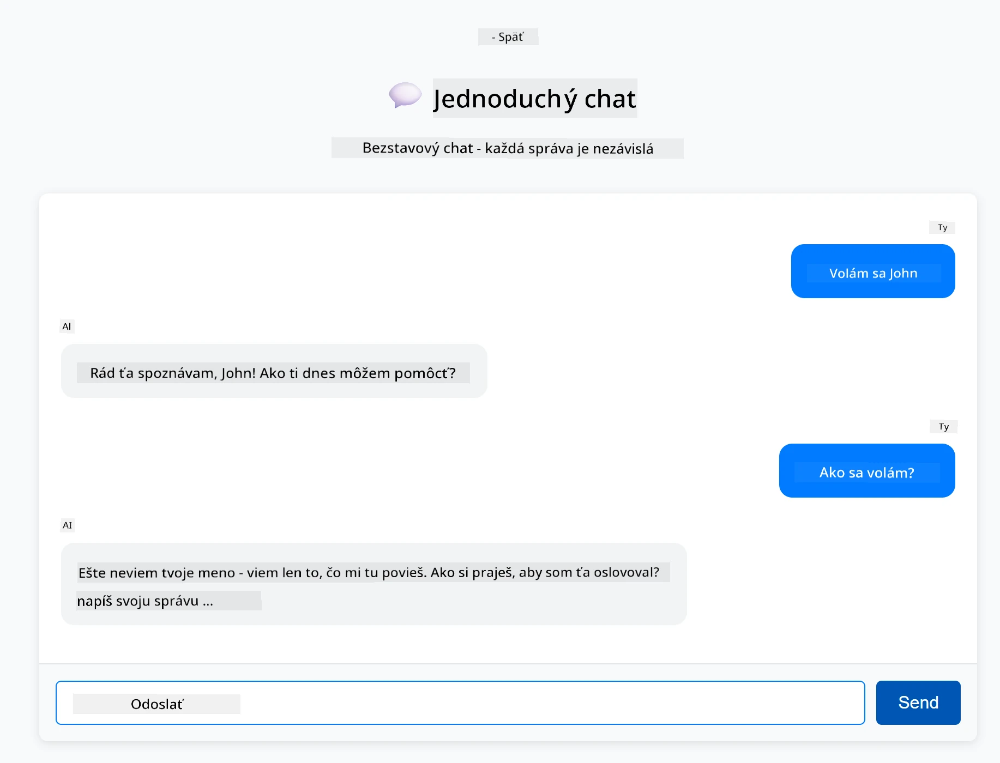
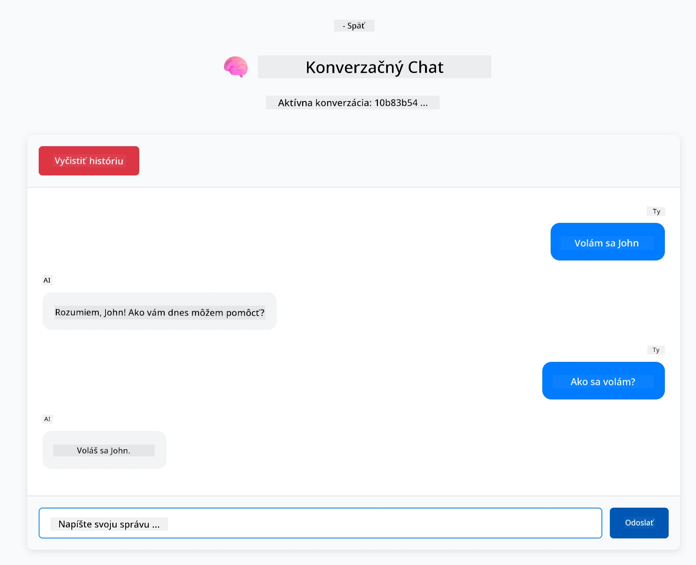

# Modul 01: Začíname s LangChain4j

## Obsah

- [Video prehliadka](#video-prehliadka)
- [Čo sa naučíte](#čo-sa-naučíte)
- [Predpoklady](#predpoklady)
- [Pochopenie základného problému](#pochopenie-základného-problému)
- [Pochopenie tokenov](#pochopenie-tokenov)
- [Ako funguje pamäť](#ako-funguje-pamäť)
- [Ako to využíva LangChain4j](#ako-to-využíva-langchain4j)
- [Nasadenie infraštruktúry Azure OpenAI](#nasadenie-infraštruktúry-azure-openai)
- [Spustenie aplikácie lokálne](#spustenie-aplikácie-lokálne)
- [Použitie aplikácie](#použitie-aplikácie)
  - [Stateless Chat (ľavý panel)](#stateless-chat-ľavý-panel)
  - [Stateful Chat (pravý panel)](#stateful-chat-pravý-panel)
- [Ďalšie kroky](#ďalšie-kroky)

## Video prehliadka

Pozrite si toto živé vysielanie, ktoré vysvetľuje, ako začať s týmto modulom:

<a href="https://www.youtube.com/live/nl_troDm8rQ?si=6b85S8xGjWnT2fX9"></a>

## Čo sa naučíte

Toto je váš východiskový bod s LangChain4j a Azure OpenAI. Začíname základmi a začíname stavať produkčné aplikácie. Tento modul sa zameriava na konverzačné AI, ktorá si pamätá kontext a udržiava stav — základné koncepty, na ktorých sú postavené všetky neskoršie moduly.

Budeme používať Azure OpenAI GPT-5.2 cez celý tento návod, pretože jeho pokročilé schopnosti logického uvažovania robia správanie rôznych vzorov jasnejším. Keď pridáte pamäť, jasne uvidíte rozdiel. To uľahčuje pochopenie toho, čo každý komponent vášmu riešeniu prináša.

Vybudujete jednu aplikáciu, ktorá demonštruje oba vzory:

**Stateless Chat** – Každý request je nezávislý. Model si nepamätá predchádzajúce správy. Toto je najjednoduchšia východisková možnosť.

**Stateful Conversation** – Každý request obsahuje históriu konverzácie. Model udržiava kontext naprieč viacerými kolami. Toto je to, čo produkčné aplikácie vyžadujú.

## Predpoklady

- Predplatné Azure s prístupom k Azure OpenAI
- Java 21, Maven 3.9+
- Azure CLI (https://learn.microsoft.com/en-us/cli/azure/install-azure-cli)
- Azure Developer CLI (azd) (https://learn.microsoft.com/en-us/azure/developer/azure-developer-cli/install-azd)

> **Poznámka:** Java, Maven, Azure CLI a Azure Developer CLI (azd) sú predinštalované v poskytnutom devcontainery.

> **Poznámka:** Tento modul používa GPT-5.2 na Azure OpenAI. Nasadenie je automaticky nakonfigurované cez `azd up` – nemeniť názov modelu v kóde.

## Pochopenie základného problému

Jazykové modely sú bezstavové. Každé API volanie je nezávislé. Ak pošlete "Volám sa John" a potom sa opýtate "Ako sa volám?", model nemá poňatia, že ste sa práve predstavili. Každý request spracováva, akoby to bola vaša prvá konverzácia.

To je v poriadku pre jednoduché otázky a odpovede, ale nepoužiteľné pre skutočné aplikácie. Boti zákazníckej podpory potrebujú pamätať, čo ste im povedali. Osobní asistenti potrebujú kontext. Akákoľvek viackolová konverzácia vyžaduje pamäť.

Nasledujúci diagram ukazuje kontrast dvoch prístupov – vľavo bezstavové volanie, ktoré zabúda vaše meno; vpravo stavové volanie s ChatMemory, ktoré si meno pamätá.



*Rozdiel medzi bezstavovými (nezávislé volania) a stavovými (s vedomím kontextu) konverzáciami*

## Pochopenie tokenov

Pred zanorením sa do konverzácií je dôležité pochopiť tokeny – základné jednotky textu, ktoré jazykové modely spracúvajú:



*Príklad, ako je text rozdelený na tokeny – "I love AI!" sa stáva 4 samostatnými spracovacími jednotkami*

Tokeny sú, ako AI modely merajú a spracúvajú text. Slová, interpunkcia a dokonca aj medzery môžu byť tokeny. Váš model má limit, koľko tokenov môže naraz spracovať (400 000 pri GPT-5.2, s maximálne 272 000 vstupných tokenov a 128 000 výstupných tokenov). Pochopenie tokenov vám pomáha riadiť dĺžku konverzácie a náklady.

## Ako funguje pamäť

Pamäť chatov rieši problém bezstavovosti tým, že udržiava históriu konverzácie. Pred odoslaním požiadavky do modelu framework pridá relevantné predchádzajúce správy. Keď sa opýtate "Ako sa volám?", systém vlastne pošle celú históriu konverzácie, čo umožní modelu vidieť, že ste predtým povedali "Volám sa John."

LangChain4j poskytuje implementácie pamäte, ktoré to automaticky zvládajú. Vyberiete, koľko správ chcete uchovať, a framework spravuje kontextové okno. Nižšie uvedený diagram ukazuje, ako MessageWindowChatMemory udržiava kĺzavé okno nedávnych správ.



*MessageWindowChatMemory udržiava kĺzavé okno nedávnych správ, automaticky vyhadzuje tie staršie*

## Ako to využíva LangChain4j

Tento modul integruje Spring Boot a pridáva pamäť konverzácie. Takto spolu diely zapadajú:

**Závislosti** – Pridajte dve knižnice LangChain4j:

```xml
<dependency>
    <groupId>dev.langchain4j</groupId>
    <artifactId>langchain4j</artifactId> <!-- Inherited from BOM in root pom.xml -->
</dependency>
<dependency>
    <groupId>dev.langchain4j</groupId>
    <artifactId>langchain4j-open-ai-official</artifactId> <!-- Inherited from BOM in root pom.xml -->
</dependency>
```

**Chatovací model** – Nakonfigurujte Azure OpenAI ako Spring bean ([LangChainConfig.java](../../../01-introduction/src/main/java/com/example/langchain4j/config/LangChainConfig.java)):

```java
@Bean
public OpenAiOfficialChatModel openAiOfficialChatModel() {
    return OpenAiOfficialChatModel.builder()
            .baseUrl(azureEndpoint)
            .apiKey(azureApiKey)
            .modelName(deploymentName)
            .timeout(Duration.ofMinutes(5))
            .maxRetries(3)
            .build();
}
```

Builder číta prihlasovacie údaje z environmentálnych premenných nastavených cez `azd up`. Nastavenie `baseUrl` na váš Azure endpoint umožní OpenAI klientovi pracovať s Azure OpenAI.

**Pamäť konverzácie** – Sledujte históriu chatu pomocou MessageWindowChatMemory ([ConversationService.java](../../../01-introduction/src/main/java/com/example/langchain4j/service/ConversationService.java)):

```java
ChatMemory memory = MessageWindowChatMemory.withMaxMessages(10);

memory.add(UserMessage.from("My name is John"));
memory.add(AiMessage.from("Nice to meet you, John!"));

memory.add(UserMessage.from("What's my name?"));
AiMessage aiMessage = chatModel.chat(memory.messages()).aiMessage();
memory.add(aiMessage);
```

Vytvorte pamäť s `withMaxMessages(10)` pre uchovanie posledných 10 správ. Pridávajte správy používateľa a AI s typovanými wrappermi: `UserMessage.from(text)` a `AiMessage.from(text)`. Históriu získate cez `memory.messages()` a pošlete modelu. Služba udržiava samostatné inštancie pamäte pre každý ID konverzácie, čo umožňuje viacerým používateľom chatovať súčasne.

> **🤖 Vyskúšajte s [GitHub Copilot](https://github.com/features/copilot) Chat:** Otvorte [`ConversationService.java`](../../../01-introduction/src/main/java/com/example/langchain4j/service/ConversationService.java) a spýtajte sa:
> - "Ako MessageWindowChatMemory rozhoduje, ktoré správy zahodiť, keď je okno plné?"
> - "Môžem implementovať vlastné uloženie pamäte pomocou databázy namiesto pamäte v RAM?"
> - "Ako by som pridal sumarizáciu na kompresiu starej histórie konverzácie?"

Bezstavový chat endpoint úplne ignoruje pamäť – stačí `chatModel.chat(prompt)` ako v rýchlom štarte. Stavový endpoint pridáva správy do pamäte, získava históriu a zahŕňa ju v každom requeste. Rovnaká konfigurácia modelu, rôzne vzory.

## Nasadenie infraštruktúry Azure OpenAI

**Bash:**
```bash
cd 01-introduction
azd up  # Vyberte predplatné a umiestnenie (odporúča sa eastus2)
```

**PowerShell:**
```powershell
cd 01-introduction
azd up  # Vyberte predplatné a lokalitu (odporúča sa eastus2)
```


> **Poznámka:** Ak narazíte na chybu časového limitu (`RequestConflict: Cannot modify resource ... provisioning state is not terminal`), jednoducho spustite `azd up` znovu. Azure zdroje môžu byť stále procesne vytvárané na pozadí a opakovaný pokus umožní nasadenie dokončiť, keď zdroje dosiahnu konečný stav.

Toto zabezpečí:
1. Nasadenie Azure OpenAI zdroja s GPT-5.2 a modelmi text-embedding-3-small
2. Automatické vygenerovanie `.env` súboru v koreňovom adresári projektu s údajmi pre prístup
3. Nastavenie všetkých potrebných environmentálnych premenných

**Máte problémy s nasadením?** Pozrite si [Infrastructure README](infra/README.md) pre podrobnú pomoc vrátane konfliktov s názvami subdomén, manuálne kroky nasadenia cez Azure Portal a návod na nastavenie modelov.

**Overte, že nasadenie prebehlo úspešne:**

**Bash:**
```bash
cat ../.env  # Mal by zobraziť AZURE_OPENAI_ENDPOINT, API_KEY a pod.
```

**PowerShell:**
```powershell
Get-Content ..\.env  # Malo by zobraziť AZURE_OPENAI_ENDPOINT, API_KEY, atď.
```


> **Poznámka:** Príkaz `azd up` automaticky vygeneruje `.env` súbor. Ak ho potrebujete neskôr aktualizovať, môžete buď editovať `.env` manuálne, alebo ho znovu vygenerovať spustením:
>
> **Bash:**
> ```bash
> cd ..
> bash .azd-env.sh
> ```
>
> **PowerShell:**
> ```powershell
> cd ..
> .\.azd-env.ps1
> ```


## Spustenie aplikácie lokálne

**Overenie nasadenia:**

Uistite sa, že `.env` súbor je v koreňovom adresári s Azure údajmi. Spustite z adresára modulu (`01-introduction/`):

**Bash:**
```bash
cat ../.env  # Malo by zobraziť AZURE_OPENAI_ENDPOINT, API_KEY, DEPLOYMENT
```

**PowerShell:**
```powershell
Get-Content ..\.env  # Malo by zobraziť AZURE_OPENAI_ENDPOINT, API_KEY, DEPLOYMENT
```


**Spustenie aplikácií:**

**Možnosť 1: Použitie Spring Boot Dashboard (odporúčané pre VS Code používateľov)**

Devcontainer obsahuje rozšírenie Spring Boot Dashboard, ktoré poskytuje vizuálne rozhranie na správu všetkých Spring Boot aplikácií. Nájdete ho v Activity Bar na ľavej strane VS Code (hľadajte ikonu Spring Boot).

Z Spring Boot Dashboard môžete:
- vidieť všetky dostupné Spring Boot aplikácie v pracovnom priestore
- jedným kliknutím spustiť/zastaviť aplikácie
- sledovať logy aplikácie v reálnom čase
- monitorovať stav aplikácií

Jednoducho kliknite na tlačidlo spustiť vedľa "introduction" na spustenie tohto modulu, alebo spustite všetky moduly naraz.



*Spring Boot Dashboard vo VS Code — spúšťajte, zastavujte a sledujte všetky moduly na jednom mieste*

**Možnosť 2: Použitie shell skriptov**

Spustite všetky webové aplikácie (moduly 01-04):

**Bash:**
```bash
cd ..  # Z koreňového adresára
./start-all.sh
```

**PowerShell:**
```powershell
cd ..  # Zo základného adresára
.\start-all.ps1
```


Alebo spustite len tento modul:

**Bash:**
```bash
cd 01-introduction
./start.sh
```

**PowerShell:**
```powershell
cd 01-introduction
.\start.ps1
```


Obe skripty automaticky načítajú environmentálne premenné zo súboru `.env` v koreňovom adresári a zostavia JAR súbory, ak ešte neexistujú.

> **Poznámka:** Ak preferujete manuálne zostavenie všetkých modulov pred spustením:
>
> **Bash:**
> ```bash
> cd ..  # Go to root directory
> mvn clean package -DskipTests
> ```
>
> **PowerShell:**
> ```powershell
> cd ..  # Go to root directory
> mvn clean package -DskipTests
> ```


Otvorte http://localhost:8080 vo vašom prehliadači.

**Ako zastaviť:**

**Bash:**
```bash
./stop.sh  # Iba tento modul
# Alebo
cd .. && ./stop-all.sh  # Všetky moduly
```

**PowerShell:**
```powershell
.\stop.ps1  # Len tento modul
# Alebo
cd ..; .\stop-all.ps1  # Všetky moduly
```


## Použitie aplikácie

Aplikácia poskytuje webové rozhranie s dvoma chat implementáciami vedľa seba.



*Dashboard zobrazuje obidve možnosti – Jednoduchý chat (bezstavový) a Konverzačný chat (stavový)*

### Stateless Chat (ľavý panel)

Vyskúšajte najskôr toto. Spýtajte sa "Volám sa John" a potom hneď "Ako sa volám?" Model si nepamätá, pretože každá správa je nezávislá. To demonštruje základný problém integrácie jazykového modelu – bez kontextu konverzácie.



*AI si nepamätá vaše meno z predchádzajúcej správy*

### Stateful Chat (pravý panel)

Teraz skúste rovnakú sériu tu. Spýtajte sa "Volám sa John" a potom "Ako sa volám?" Tentokrát si pamätá. Rozdiel je MessageWindowChatMemory – udržiava históriu konverzácie a zahrňuje ju do každého requestu. Takto funguje produkčné konverzačné AI.



*AI si pamätá vaše meno z predchádzajúcej konverzácie*

Oba panely používajú rovnaký model GPT-5.2. Jediný rozdiel je pamäť. Toto jasne ukazuje, čo pamäť prináša vášmu riešeniu a prečo je nevyhnutná pre reálne použitie.

## Ďalšie kroky

**Ďalší modul:** [02-prompt-engineering - Tvorba promptov s GPT-5.2](../02-prompt-engineering/README.md)

---

**Navigácia:** [← Späť na hlavnú stránku](../README.md) | [Ďalej: Modul 02 - Tvorba promptov →](../02-prompt-engineering/README.md)

---

<!-- CO-OP TRANSLATOR DISCLAIMER START -->
**Vyhlásenie o zodpovednosti**:
Tento dokument bol preložený pomocou AI prekladateľskej služby [Co-op Translator](https://github.com/Azure/co-op-translator). Hoci sa snažíme o presnosť, vezmite prosím na vedomie, že automatické preklady môžu obsahovať chyby alebo nepresnosti. Pôvodný dokument v jeho natívnom jazyku by mal byť považovaný za autoritatívny zdroj. Pre kritické informácie sa odporúča profesionálny ľudský preklad. Nie sme zodpovední za žiadne nedorozumenia alebo nesprávne interpretácie vyplývajúce z použitia tohto prekladu.
<!-- CO-OP TRANSLATOR DISCLAIMER END -->