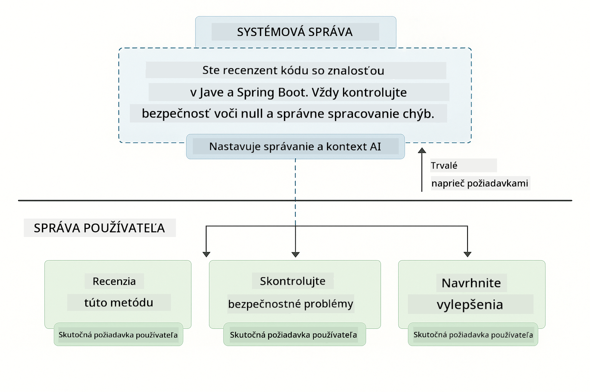
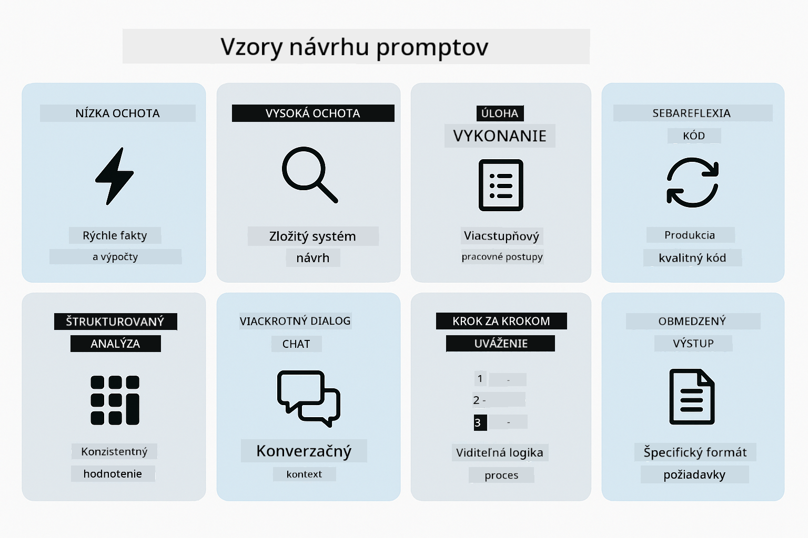
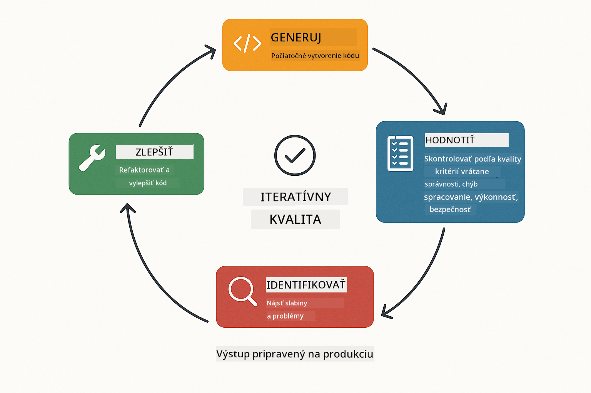
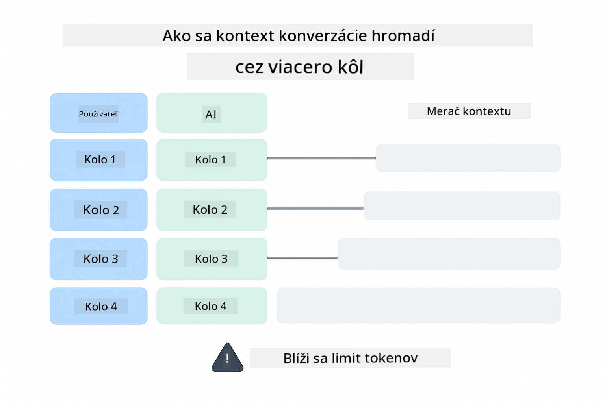
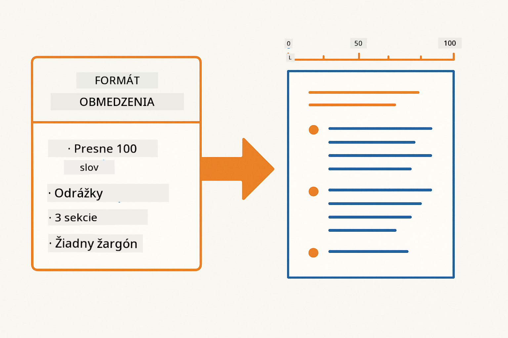
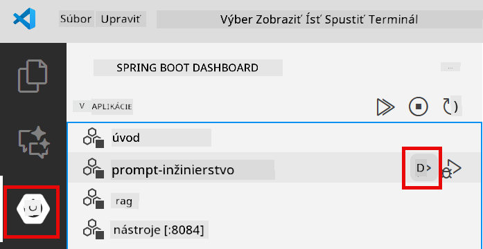
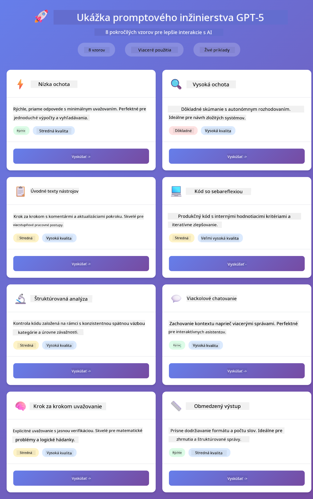
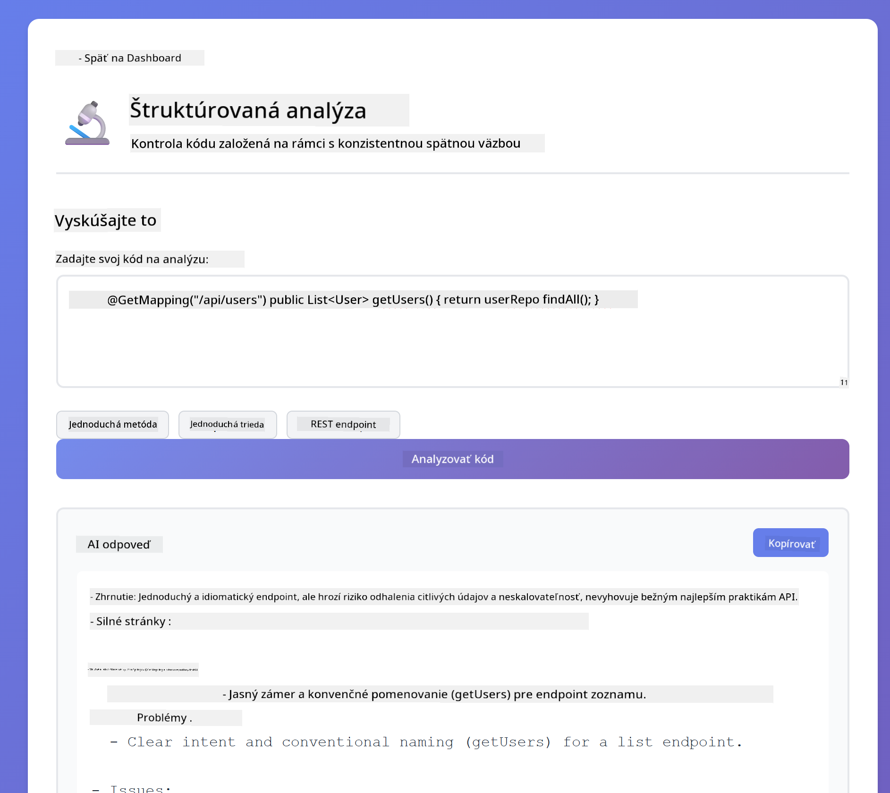
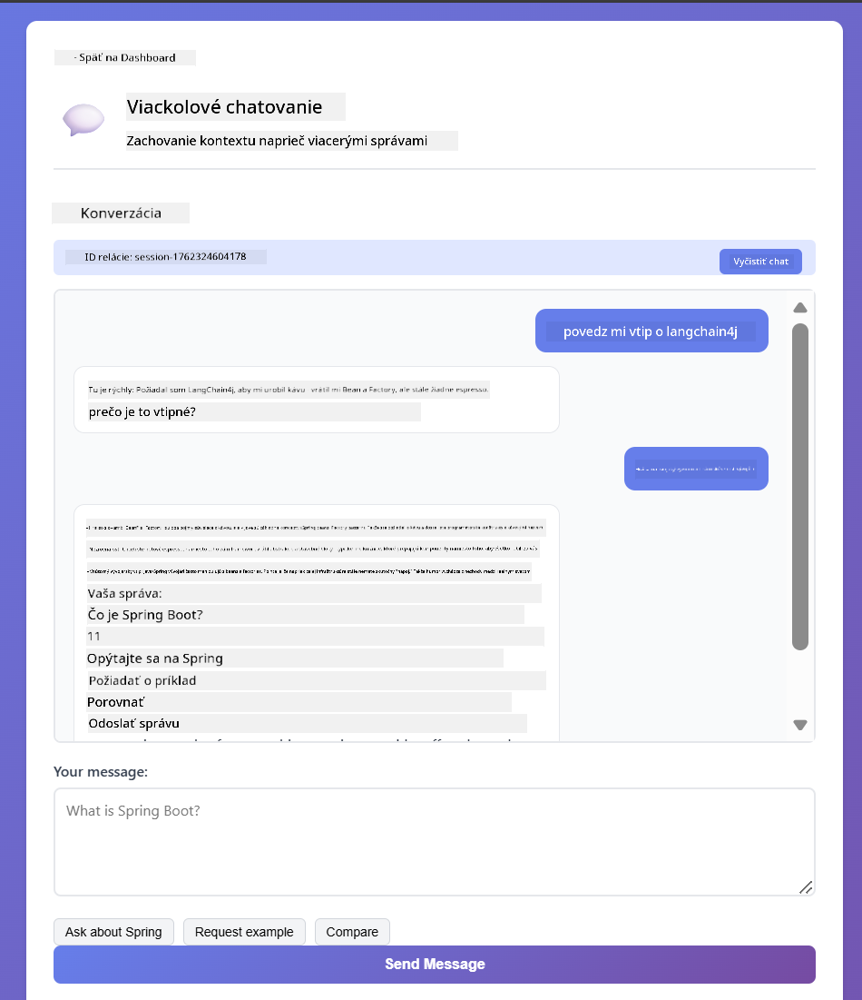

<!--
CO_OP_TRANSLATOR_METADATA:
{
  "original_hash": "8d787826cad7e92bf5cdbd116b1e6116",
  "translation_date": "2025-12-13T16:23:56+00:00",
  "source_file": "02-prompt-engineering/README.md",
  "language_code": "sk"
}
-->
# Modul 02: Prompt Engineering s GPT-5

## Obsah

- [Čo sa naučíte](../../../02-prompt-engineering)
- [Predpoklady](../../../02-prompt-engineering)
- [Pochopenie prompt engineeringu](../../../02-prompt-engineering)
- [Ako to využíva LangChain4j](../../../02-prompt-engineering)
- [Základné vzory](../../../02-prompt-engineering)
- [Použitie existujúcich Azure zdrojov](../../../02-prompt-engineering)
- [Snímky obrazovky aplikácie](../../../02-prompt-engineering)
- [Preskúmanie vzorov](../../../02-prompt-engineering)
  - [Nízka vs vysoká ochota](../../../02-prompt-engineering)
  - [Vykonávanie úloh (úvody k nástrojom)](../../../02-prompt-engineering)
  - [Sebareflexívny kód](../../../02-prompt-engineering)
  - [Štruktúrovaná analýza](../../../02-prompt-engineering)
  - [Viackolové chatovanie](../../../02-prompt-engineering)
  - [Krok za krokom uvažovanie](../../../02-prompt-engineering)
  - [Obmedzený výstup](../../../02-prompt-engineering)
- [Čo sa naozaj učíte](../../../02-prompt-engineering)
- [Ďalšie kroky](../../../02-prompt-engineering)

## Čo sa naučíte

V predchádzajúcom module ste videli, ako pamäť umožňuje konverzačnú AI a použili ste GitHub Models pre základné interakcie. Teraz sa zameriame na to, ako kladiete otázky – samotné prompt-y – pomocou Azure OpenAI GPT-5. Spôsob, akým štruktúrujete svoje prompt-y, dramaticky ovplyvňuje kvalitu odpovedí, ktoré dostanete.

Použijeme GPT-5, pretože zavádza kontrolu uvažovania – môžete modelu povedať, koľko premýšľania má vykonať pred odpoveďou. To robí rôzne stratégie promptovania zreteľnejšími a pomáha vám pochopiť, kedy použiť ktorý prístup. Tiež využijeme menej limitov rýchlosti Azure pre GPT-5 v porovnaní s GitHub Models.

## Predpoklady

- Dokončený Modul 01 (nasadené Azure OpenAI zdroje)
- Súbor `.env` v koreňovom adresári s Azure povereniami (vytvorený pomocou `azd up` v Module 01)

> **Poznámka:** Ak ste Modul 01 nedokončili, najprv postupujte podľa inštrukcií na nasadenie tam.

## Pochopenie prompt engineeringu

Prompt engineering je o navrhovaní vstupného textu, ktorý vám konzistentne prináša požadované výsledky. Nie je to len o kladení otázok – ide o štruktúrovanie požiadaviek tak, aby model presne pochopil, čo chcete a ako to doručiť.

Predstavte si to ako dávanie inštrukcií kolegovi. „Oprav chybu“ je nejasné. „Oprav výnimku null pointer v UserService.java na riadku 45 pridaním kontroly null“ je konkrétne. Jazykové modely fungujú rovnako – dôležitá je špecifickosť a štruktúra.

## Ako to využíva LangChain4j

Tento modul demonštruje pokročilé vzory promptovania pomocou tej istej LangChain4j základne z predchádzajúcich modulov, so zameraním na štruktúru promptov a kontrolu uvažovania.


*Ako LangChain4j prepája vaše prompt-y s Azure OpenAI GPT-5*

**Závislosti** – Modul 02 používa nasledujúce langchain4j závislosti definované v `pom.xml`:
```xml
<dependency>
    <groupId>dev.langchain4j</groupId>
    <artifactId>langchain4j</artifactId> <!-- Inherited from BOM in root pom.xml -->
</dependency>
<dependency>
    <groupId>dev.langchain4j</groupId>
    <artifactId>langchain4j-open-ai-official</artifactId> <!-- Inherited from BOM in root pom.xml -->
</dependency>
```

**Konfigurácia OpenAiOfficialChatModel** – [LangChainConfig.java](../../../02-prompt-engineering/src/main/java/com/example/langchain4j/prompts/config/LangChainConfig.java)

Chat model je manuálne nakonfigurovaný ako Spring bean pomocou oficiálneho OpenAI klienta, ktorý podporuje Azure OpenAI endpointy. Kľúčový rozdiel oproti Modulu 01 je v tom, ako štruktúrujeme prompt-y odosielané do `chatModel.chat()`, nie v samotnom nastavení modelu.

**Systémové a používateľské správy** – [Gpt5PromptService.java](../../../02-prompt-engineering/src/main/java/com/example/langchain4j/prompts/service/Gpt5PromptService.java)

LangChain4j rozdeľuje typy správ pre prehľadnosť. `SystemMessage` nastavuje správanie a kontext AI (napr. „Ste recenzent kódu“), zatiaľ čo `UserMessage` obsahuje samotnú požiadavku. Toto rozdelenie umožňuje udržiavať konzistentné správanie AI naprieč rôznymi používateľskými dotazmi.

```java
SystemMessage systemMsg = SystemMessage.from(
    "You are a helpful Java programming expert."
);

UserMessage userMsg = UserMessage.from(
    "Explain what a List is in Java"
);

String response = chatModel.chat(systemMsg, userMsg);
```



*SystemMessage poskytuje trvalý kontext, zatiaľ čo UserMessages obsahujú jednotlivé požiadavky*

**MessageWindowChatMemory pre viackolové konverzácie** – Pre vzor viackolovej konverzácie znovu používame `MessageWindowChatMemory` z Modulu 01. Každá relácia má svoju vlastnú inštanciu pamäte uloženú v `Map<String, ChatMemory>`, čo umožňuje viacero súbežných konverzácií bez miešania kontextu.

**Šablóny promptov** – Skutočný dôraz je tu na prompt engineering, nie na nové LangChain4j API. Každý vzor (nízka ochota, vysoká ochota, vykonávanie úloh atď.) používa tú istú metódu `chatModel.chat(prompt)`, ale s dôkladne štruktúrovanými prompt reťazcami. XML tagy, inštrukcie a formátovanie sú súčasťou textu promptu, nie funkcií LangChain4j.

**Kontrola uvažovania** – Úsilie o uvažovanie GPT-5 je riadené inštrukciami v promptoch ako „maximálne 2 kroky uvažovania“ alebo „dôkladne preskúmaj“. Toto sú techniky prompt engineeringu, nie konfigurácie LangChain4j. Knižnica jednoducho doručuje vaše prompt-y modelu.

Hlavné zhrnutie: LangChain4j poskytuje infraštruktúru (pripojenie modelu cez [LangChainConfig.java](../../../02-prompt-engineering/src/main/java/com/example/langchain4j/prompts/config/LangChainConfig.java), pamäť, spracovanie správ cez [Gpt5PromptService.java](../../../02-prompt-engineering/src/main/java/com/example/langchain4j/prompts/service/Gpt5PromptService.java)), zatiaľ čo tento modul vás učí, ako vytvárať efektívne prompt-y v rámci tejto infraštruktúry.

## Základné vzory

Nie všetky problémy vyžadujú rovnaký prístup. Niektoré otázky potrebujú rýchle odpovede, iné hlboké uvažovanie. Niektoré vyžadujú viditeľné uvažovanie, iné len výsledky. Tento modul pokrýva osem vzorov promptovania – každý optimalizovaný pre rôzne scenáre. Vyskúšate si ich všetky, aby ste sa naučili, kedy ktorý prístup funguje najlepšie.



*Prehľad ôsmich vzorov prompt engineeringu a ich použitia*


*Nízka ochota (rýchle, priame) vs vysoká ochota (dôkladné, prieskumné) prístupy k uvažovaniu*

**Nízka ochota (rýchle a zamerané)** – Pre jednoduché otázky, kde chcete rýchle, priame odpovede. Model vykonáva minimálne uvažovanie – maximálne 2 kroky. Použite to pre výpočty, vyhľadávania alebo priamočiare otázky.

```java
String prompt = """
    <reasoning_effort>low</reasoning_effort>
    <instruction>maximum 2 reasoning steps</instruction>
    
    What is 15% of 200?
    """;

String response = chatModel.chat(prompt);
```

> 💡 **Preskúmajte s GitHub Copilot:** Otvorte [`Gpt5PromptService.java`](../../../02-prompt-engineering/src/main/java/com/example/langchain4j/prompts/service/Gpt5PromptService.java) a opýtajte sa:
> - „Aký je rozdiel medzi nízkou a vysokou ochotou v promptovacích vzoroch?“
> - „Ako XML tagy v promptoch pomáhajú štruktúrovať odpoveď AI?“
> - „Kedy by som mal použiť vzory sebareflexie vs priame inštrukcie?“

**Vysoká ochota (hlboké a dôkladné)** – Pre zložité problémy, kde chcete komplexnú analýzu. Model dôkladne skúma a ukazuje podrobné uvažovanie. Použite to pre návrh systémov, architektonické rozhodnutia alebo komplexný výskum.

```java
String prompt = """
    <reasoning_effort>high</reasoning_effort>
    <instruction>explore thoroughly, show detailed reasoning</instruction>
    
    Design a caching strategy for a high-traffic REST API.
    """;

String response = chatModel.chat(prompt);
```

**Vykonávanie úloh (postup krok za krokom)** – Pre viacstupňové pracovné postupy. Model poskytuje plán vopred, komentuje každý krok počas práce a potom dáva zhrnutie. Použite to pre migrácie, implementácie alebo akýkoľvek viacstupňový proces.

```java
String prompt = """
    <task>Create a REST endpoint for user registration</task>
    <preamble>Provide an upfront plan</preamble>
    <narration>Narrate each step as you work</narration>
    <summary>Summarize what was accomplished</summary>
    """;

String response = chatModel.chat(prompt);
```

Chain-of-Thought promptovanie explicitne žiada model, aby ukázal svoj proces uvažovania, čo zlepšuje presnosť pri zložitých úlohách. Postupné rozdelenie pomáha ľuďom aj AI pochopiť logiku.

> **🤖 Vyskúšajte s [GitHub Copilot](https://github.com/features/copilot) Chat:** Opýtajte sa na tento vzor:
> - „Ako by som prispôsobil vzor vykonávania úloh pre dlhodobé operácie?“
> - „Aké sú najlepšie praktiky pre štruktúrovanie úvodov k nástrojom v produkčných aplikáciách?“
> - „Ako môžem zachytiť a zobraziť priebežné aktualizácie pokroku v UI?“


*Plán → Vykonaj → Zhrň pracovný tok pre viacstupňové úlohy*

**Sebareflexívny kód** – Pre generovanie kódu produkčnej kvality. Model generuje kód, kontroluje ho podľa kvalitatívnych kritérií a iteratívne ho zlepšuje. Použite to pri tvorbe nových funkcií alebo služieb.

```java
String prompt = """
    <task>Create an email validation service</task>
    <quality_criteria>
    - Correct logic and error handling
    - Best practices (clean code, proper naming)
    - Performance optimization
    - Security considerations
    </quality_criteria>
    <instruction>Generate code, evaluate against criteria, improve iteratively</instruction>
    """;

String response = chatModel.chat(prompt);
```



*Iteračný cyklus zlepšovania – generuj, vyhodnoť, identifikuj problémy, zlepši, opakuj*

**Štruktúrovaná analýza** – Pre konzistentné hodnotenie. Model kontroluje kód pomocou pevného rámca (správnosť, praktiky, výkon, bezpečnosť). Použite to pre revízie kódu alebo hodnotenia kvality.

```java
String prompt = """
    <code>
    public List getUsers() {
        return database.query("SELECT * FROM users");
    }
    </code>
    
    <framework>
    Evaluate using these categories:
    1. Correctness - Logic and functionality
    2. Best Practices - Code quality
    3. Performance - Efficiency concerns
    4. Security - Vulnerabilities
    </framework>
    """;

String response = chatModel.chat(prompt);
```

> **🤖 Vyskúšajte s [GitHub Copilot](https://github.com/features/copilot) Chat:** Opýtajte sa na štruktúrovanú analýzu:
> - „Ako môžem prispôsobiť rámec analýzy pre rôzne typy revízií kódu?“
> - „Aký je najlepší spôsob, ako programovo spracovať a reagovať na štruktúrovaný výstup?“
> - „Ako zabezpečiť konzistentné úrovne závažnosti naprieč rôznymi revíznymi reláciami?“


*Štvor-kategóriový rámec pre konzistentné revízie kódu s úrovňami závažnosti*

**Viackolové chatovanie** – Pre konverzácie, ktoré potrebujú kontext. Model si pamätá predchádzajúce správy a nadväzuje na ne. Použite to pre interaktívne pomocné relácie alebo zložité otázky a odpovede.

```java
ChatMemory memory = MessageWindowChatMemory.withMaxMessages(10);

memory.add(UserMessage.from("What is Spring Boot?"));
AiMessage aiMessage1 = chatModel.chat(memory.messages()).aiMessage();
memory.add(aiMessage1);

memory.add(UserMessage.from("Show me an example"));
AiMessage aiMessage2 = chatModel.chat(memory.messages()).aiMessage();
memory.add(aiMessage2);
```



*Ako sa kontext konverzácie hromadí počas viacerých kôl až do dosiahnutia limitu tokenov*

**Krok za krokom uvažovanie** – Pre problémy vyžadujúce viditeľnú logiku. Model ukazuje explicitné uvažovanie pre každý krok. Použite to pre matematické problémy, logické hádanky alebo keď potrebujete pochopiť proces myslenia.

```java
String prompt = """
    <instruction>Show your reasoning step-by-step</instruction>
    
    If a train travels 120 km in 2 hours, then stops for 30 minutes,
    then travels another 90 km in 1.5 hours, what is the average speed
    for the entire journey including the stop?
    """;

String response = chatModel.chat(prompt);
```


*Rozkladanie problémov na explicitné logické kroky*

**Obmedzený výstup** – Pre odpovede so špecifickými požiadavkami na formát. Model prísne dodržiava pravidlá formátu a dĺžky. Použite to pre zhrnutia alebo keď potrebujete presnú štruktúru výstupu.

```java
String prompt = """
    <constraints>
    - Exactly 100 words
    - Bullet point format
    - Technical terms only
    </constraints>
    
    Summarize the key concepts of machine learning.
    """;

String response = chatModel.chat(prompt);
```



*Vynucovanie špecifických požiadaviek na formát, dĺžku a štruktúru*

## Použitie existujúcich Azure zdrojov

**Overenie nasadenia:**

Uistite sa, že súbor `.env` existuje v koreňovom adresári s Azure povereniami (vytvorený počas Modulu 01):
```bash
cat ../.env  # Malo by zobraziť AZURE_OPENAI_ENDPOINT, API_KEY, DEPLOYMENT
```

**Spustenie aplikácie:**

> **Poznámka:** Ak ste už spustili všetky aplikácie pomocou `./start-all.sh` z Modulu 01, tento modul už beží na porte 8083. Môžete preskočiť spúšťacie príkazy nižšie a ísť priamo na http://localhost:8083.

**Možnosť 1: Použitie Spring Boot Dashboard (odporúčané pre používateľov VS Code)**

Vývojársky kontajner obsahuje rozšírenie Spring Boot Dashboard, ktoré poskytuje vizuálne rozhranie na správu všetkých Spring Boot aplikácií. Nájdete ho v Activity Bar na ľavej strane VS Code (ikona Spring Boot).

Zo Spring Boot Dashboard môžete:
- Vidieť všetky dostupné Spring Boot aplikácie v pracovnom priestore
- Jedným kliknutím spustiť/zastaviť aplikácie
- Zobraziť logy aplikácií v reálnom čase
- Monitorovať stav aplikácií

Jednoducho kliknite na tlačidlo play vedľa „prompt-engineering“ pre spustenie tohto modulu, alebo spustite všetky moduly naraz.



**Možnosť 2: Použitie shell skriptov**

Spustite všetky webové aplikácie (moduly 01-04):

**Bash:**
```bash
cd ..  # Z koreňového adresára
./start-all.sh
```

**PowerShell:**
```powershell
cd ..  # Z koreňového adresára
.\start-all.ps1
```

Alebo spustite len tento modul:

**Bash:**
```bash
cd 02-prompt-engineering
./start.sh
```

**PowerShell:**
```powershell
cd 02-prompt-engineering
.\start.ps1
```

Oba skripty automaticky načítajú premenné prostredia zo súboru `.env` v koreňovom adresári a zostavia JAR súbory, ak neexistujú.

> **Poznámka:** Ak chcete pred spustením manuálne zostaviť všetky moduly:
>
> **Bash:**
> ```bash
> cd ..  # Go to root directory
> mvn clean package -DskipTests
> ```
>
> **PowerShell:**
> ```powershell
> cd ..  # Go to root directory
> mvn clean package -DskipTests
> ```

Otvorte http://localhost:8083 vo vašom prehliadači.

**Na zastavenie:**

**Bash:**
```bash
./stop.sh  # Len tento modul
# Alebo
cd .. && ./stop-all.sh  # Všetky moduly
```

**PowerShell:**
```powershell
.\stop.ps1  # Len tento modul
# Alebo
cd ..; .\stop-all.ps1  # Všetky moduly
```

## Snímky obrazovky aplikácie



*Hlavný dashboard zobrazujúci všetkých 8 vzorov prompt engineeringu s ich charakteristikami a prípadmi použitia*

## Preskúmanie vzorov

Webové rozhranie vám umožňuje experimentovať s rôznymi stratégiami promptovania. Každý vzor rieši iné problémy – vyskúšajte ich, aby ste videli, kedy ktorý prístup najviac vyniká.

### Nízka vs vysoká ochota

Opýtajte sa jednoduchú otázku ako „Čo je 15 % z 200?“ pomocou Nízkej ochoty. Dostanete okamžitú, priamu odpoveď. Teraz sa opýtajte niečo zložité ako „Navrhnite caching stratégiu pre API s vysokou návštevnosťou“ pomocou Vysokej ochoty. Sledujte, ako model spomalí a poskytne podrobné uvažovanie. Rovnaký model, rovnaká štruktúra otázky – ale prompt mu hovorí, koľko má premýšľať.


*Rýchly výpočet s minimálnym uvažovaním*


*Komplexná stratégia ukladania do vyrovnávacej pamäte (2,8 MB)*

### Vykonávanie úloh (Úvodné texty nástrojov)

Viacstupňové pracovné postupy profitujú z vopred plánovania a komentovania priebehu. Model načrtne, čo urobí, komentuje každý krok a potom zhrnie výsledky.


*Vytvorenie REST endpointu s komentovaním krok za krokom (3,9 MB)*

### Sebareflektujúci kód

Skúste "Vytvoriť službu na overenie e-mailu". Namiesto toho, aby model len vygeneroval kód a zastavil sa, generuje, hodnotí podľa kritérií kvality, identifikuje slabé miesta a zlepšuje. Uvidíte, ako iteruje, kým kód nespĺňa produkčné štandardy.


*Kompletná služba na overenie e-mailu (5,2 MB)*

### Štruktúrovaná analýza

Kontroly kódu potrebujú konzistentné hodnotiace rámce. Model analyzuje kód pomocou pevných kategórií (správnosť, praktiky, výkon, bezpečnosť) s úrovňami závažnosti.



*Kontrola kódu založená na rámci*

### Viackolový chat

Opýtajte sa "Čo je Spring Boot?" a hneď potom "Ukáž mi príklad". Model si pamätá vašu prvú otázku a poskytne vám konkrétny príklad Spring Boot. Bez pamäte by druhá otázka bola príliš nejasná.



*Zachovanie kontextu medzi otázkami*

### Uvažovanie krok za krokom

Vyberte si matematický problém a vyskúšajte ho s Uvažovaním krok za krokom a s Nízkou ochotou. Nízka ochota vám len dá odpoveď – rýchlo, ale neprehľadne. Uvažovanie krok za krokom vám ukáže každý výpočet a rozhodnutie.


*Matematický problém s explicitnými krokmi*

### Obmedzený výstup

Keď potrebujete konkrétne formáty alebo počet slov, tento vzor vynucuje prísne dodržiavanie. Skúste vygenerovať zhrnutie s presne 100 slovami v bodoch.


*Zhrnutie strojového učenia s kontrolou formátu*

## Čo sa naozaj učíte

**Úsilie o uvažovanie mení všetko**

GPT-5 vám umožňuje ovládať výpočtové úsilie cez vaše podnety. Nízke úsilie znamená rýchle odpovede s minimálnym skúmaním. Vysoké úsilie znamená, že model si dá čas na hlboké premýšľanie. Učíte sa prispôsobiť úsilie zložitosti úlohy – nestrácajte čas na jednoduché otázky, ale ani neponáhľajte zložité rozhodnutia.

**Štruktúra riadi správanie**

Všimli ste si XML značky v podnetoch? Nie sú len dekoratívne. Modely spoľahlivejšie nasledujú štruktúrované inštrukcie než voľný text. Keď potrebujete viacstupňové procesy alebo zložitú logiku, štruktúra pomáha modelu sledovať, kde sa nachádza a čo nasleduje.


*Anatómia dobre štruktúrovaného podnetu s jasnými sekciami a organizáciou v štýle XML*

**Kvalita cez seba-hodnotenie**

Vzory sebareflexie fungujú tak, že robia kritériá kvality explicitnými. Namiesto toho, aby ste dúfali, že model "urobí to správne", presne mu poviete, čo znamená "správne": správna logika, spracovanie chýb, výkon, bezpečnosť. Model potom môže vyhodnotiť svoj výstup a zlepšiť sa. To mení generovanie kódu z lotérie na proces.

**Kontext je konečný**

Viackolové konverzácie fungujú tak, že ku každej požiadavke sa pridáva história správ. Ale existuje limit – každý model má maximálny počet tokenov. Ako konverzácie rastú, budete potrebovať stratégie, ako udržať relevantný kontext bez prekročenia limitu. Tento modul vám ukáže, ako pamäť funguje; neskôr sa naučíte, kedy zhrnúť, kedy zabudnúť a kedy vyhľadať.

## Ďalšie kroky

**Ďalší modul:** [03-rag - RAG (Retrieval-Augmented Generation)](../03-rag/README.md)

---

**Navigácia:** [← Predchádzajúci: Modul 01 - Úvod](../01-introduction/README.md) | [Späť na hlavnú stránku](../README.md) | [Ďalší: Modul 03 - RAG →](../03-rag/README.md)

---

<!-- CO-OP TRANSLATOR DISCLAIMER START -->
**Zrieknutie sa zodpovednosti**:
Tento dokument bol preložený pomocou AI prekladateľskej služby [Co-op Translator](https://github.com/Azure/co-op-translator). Aj keď sa snažíme o presnosť, prosím, majte na pamäti, že automatizované preklady môžu obsahovať chyby alebo nepresnosti. Pôvodný dokument v jeho rodnom jazyku by mal byť považovaný za autoritatívny zdroj. Pre kritické informácie sa odporúča profesionálny ľudský preklad. Nie sme zodpovední za akékoľvek nedorozumenia alebo nesprávne interpretácie vyplývajúce z použitia tohto prekladu.
<!-- CO-OP TRANSLATOR DISCLAIMER END -->