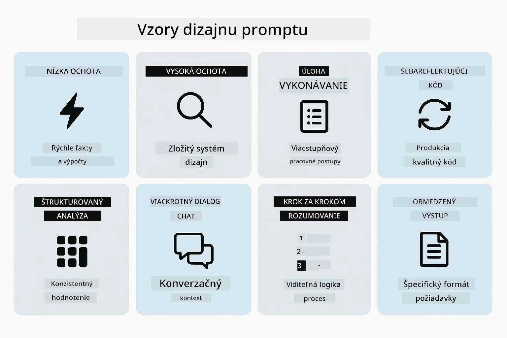
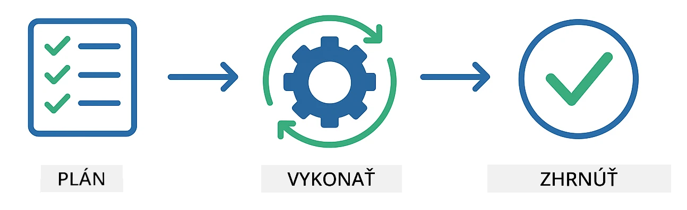
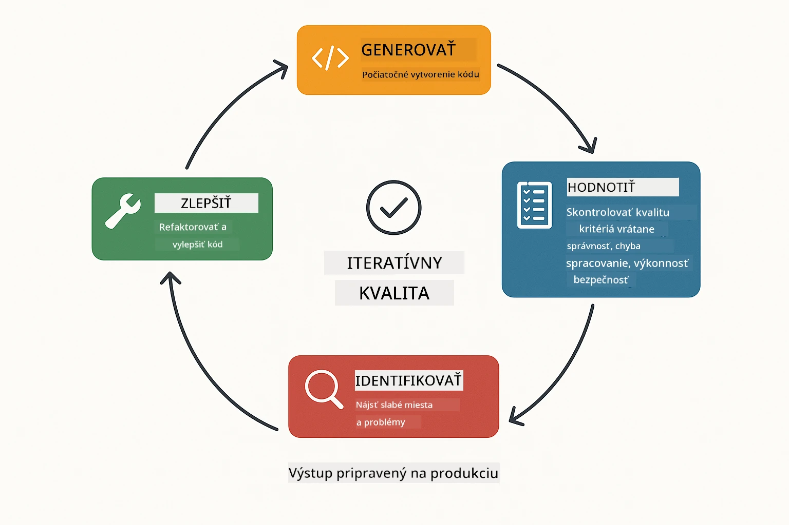
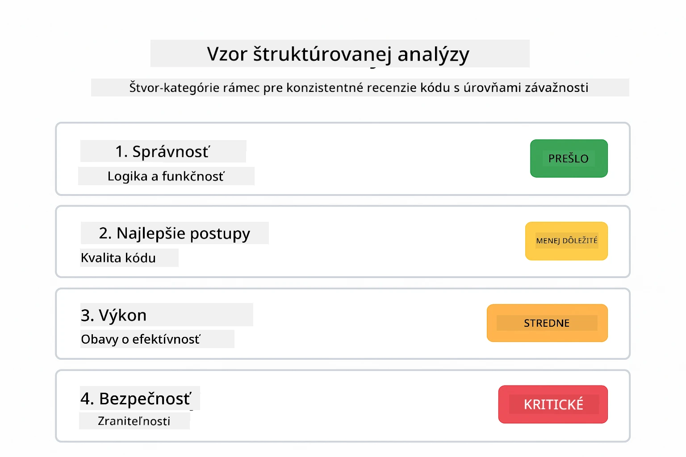
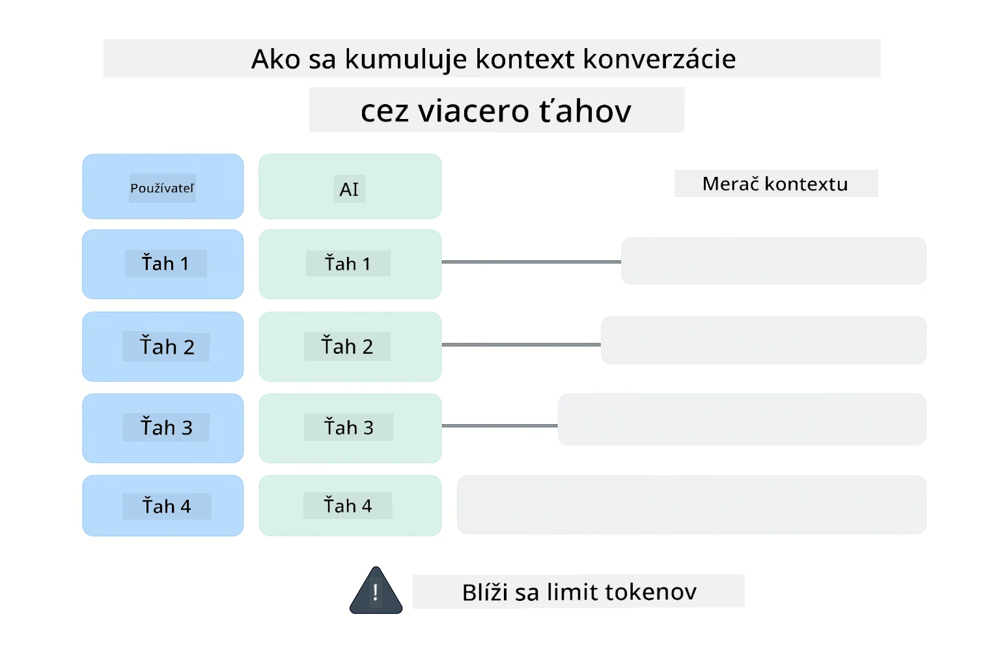
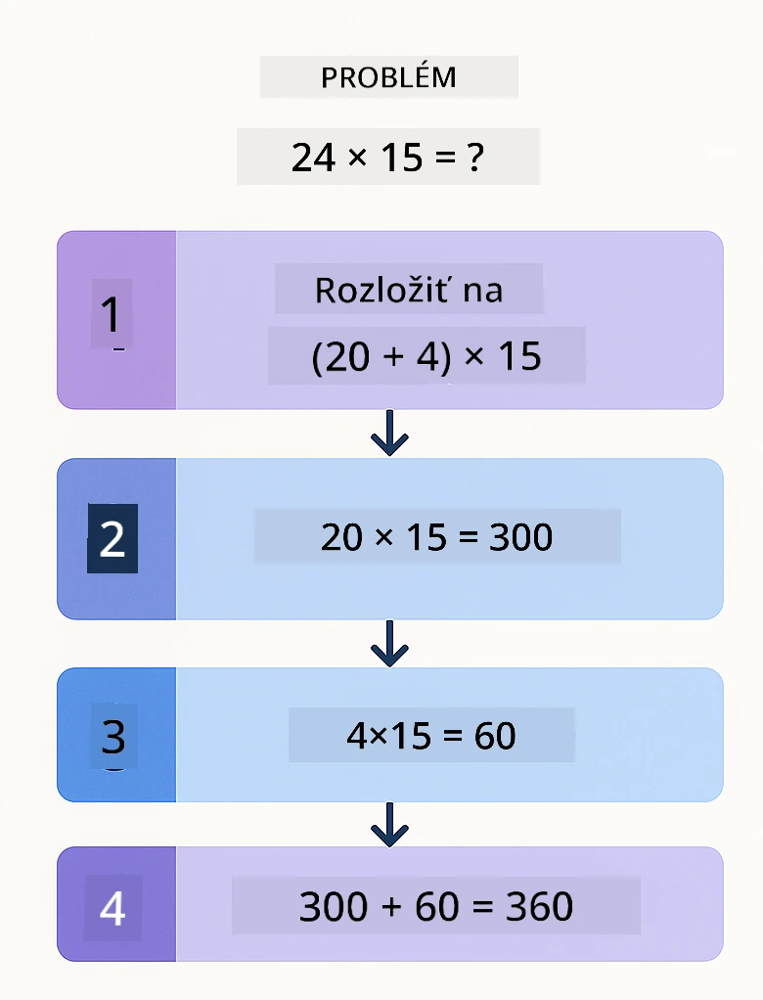
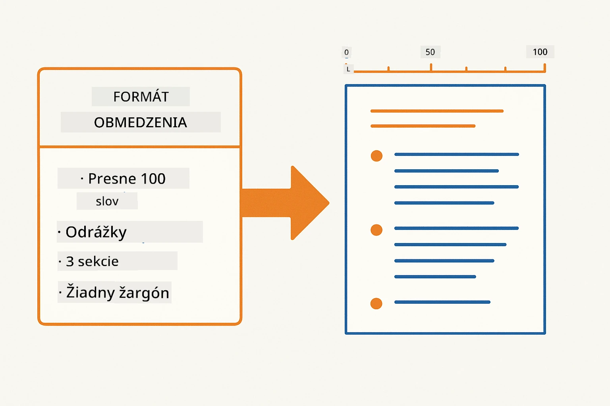
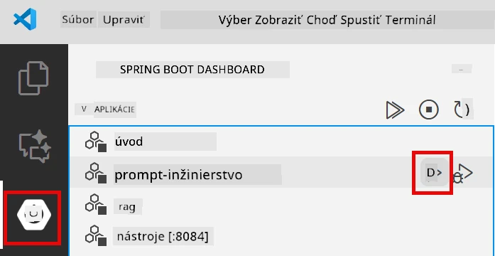
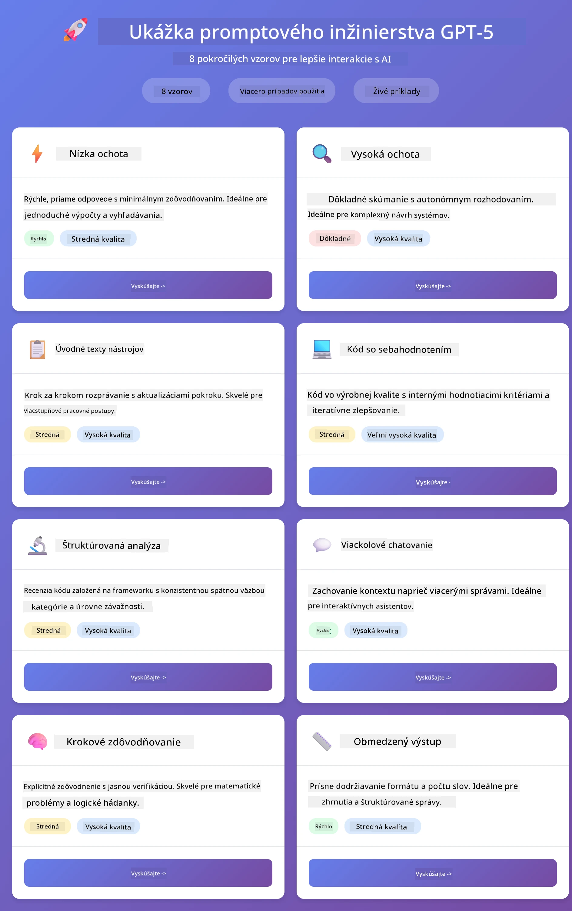
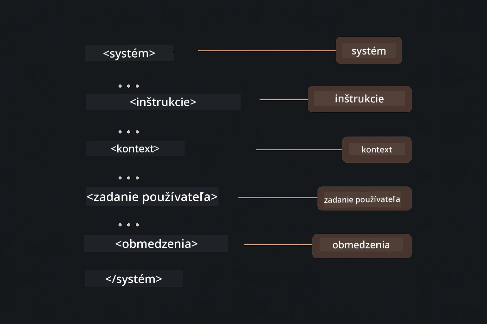

# Modul 02: Inžinierstvo promptov s GPT-5.2

## Obsah

- [Video prehliadka](#video-prehliadka)
- [Čo sa naučíte](#čo-sa-naučíte)
- [Predpoklady](#predpoklady)
- [Pochopenie inžinierstva promptov](#pochopenie-inžinierstva-promptov)
- [Základy inžinierstva promptov](#základy-inžinierstva-promptov)
  - [Zero-Shot prompting](#zero-shot-prompting)
  - [Few-Shot prompting](#few-shot-prompting)
  - [Ťaž ťaže myslenia (Chain of Thought)](#ťaž-ťaže-myslenia-chain-of-thought)
  - [Role-Based prompting](#role-based-prompting)
  - [Šablóny promptov](#šablóny-promptov)
- [Pokročilé vzory](#pokročilé-vzory)
- [Spustenie aplikácie](#spustenie-aplikácie)
- [Snímky obrazovky aplikácie](#snímky-obrazovky-aplikácie)
- [Preskúmanie vzorov](#preskúmanie-vzorov)
  - [Nízka vs vysoká ochota (Eagerness)](#nízká-verzus-vysoká-snaživosť)
  - [Vykonávanie úloh (Predslovy nástrojov)](#vykonanie-úlohy-tool-preambles)
  - [Sebareflexia kódu](#sebareflektujúci-kód)
  - [Štruktúrovaná analýza](#štruktúrovaná-analýza)
  - [Viackolový chat](#viackolový-chat)
  - [Krok za krokom uvažovanie](#krok-za-krokom-uvažovanie)
  - [Obmedzený výstup](#obmedzený-výstup)
- [Čo sa naozaj učíte](#čo-sa-naozaj-učíte)
- [Ďalšie kroky](#ďalšie-kroky)

## Video prehliadka

Pozrite si túto živú reláciu, ktorá vysvetľuje, ako začať s týmto modulom:

<a href="https://www.youtube.com/live/PJ6aBaE6bog?si=LDshyBrTRodP-wke"></a>

## Čo sa naučíte

Nasledujúci diagram poskytuje prehľad kľúčových tém a zručností, ktoré v tomto module rozviniete — od techník dolaďovania promptov až po krok za krokom pracovný postup, ktorý budete nasledovať.


V predchádzajúcom module ste videli, ako pamäť umožňuje konverzačné AI s Azure OpenAI. Teraz sa zameriame na to, ako klásť otázky — samotné prompty — pomocou GPT-5.2 od Azure OpenAI. Spôsob, akým štruktúrujete svoje prompty, výrazne ovplyvňuje kvalitu odpovedí, ktoré dostanete. Začneme prehľadom základných techník promptovania a potom prejdeme k ôsmim pokročilým vzorom, ktoré využívajú plný potenciál GPT-5.2.

Použijeme GPT-5.2, pretože predstavuje ovládanie uvažovania - môžete modelu povedať, koľko času má myslieť pred odpoveďou. To robí rôzne stratégie promptovania jasnejšími a pomáha pochopiť, kedy použiť ktorý prístup.

## Predpoklady

- Dokončený Modul 01 (nasadené zdroje Azure OpenAI)
- Súbor `.env` v koreňovom adresári s povereniami Azure (vytvorený pomocou `azd up` v Module 01)

> **Poznámka:** Ak ste Modúl 01 neabsolvovali, najskôr postupujte podľa pokynov na nasadenie tam uvedených.

## Pochopenie inžinierstva promptov

V jadre je inžinierstvo promptov rozdiel medzi nejasnými a presnými inštrukciami, ako ukazuje nasledujúce porovnanie.


Inžinierstvo promptov je o navrhovaní vstupného textu, ktorý dôsledne prináša požadované výsledky. Nejde len o kladenie otázok – ide o štruktúrovanie požiadaviek tak, aby model presne pochopil, čo chcete a ako to má dodať.

Predstavte si to ako poskytovanie inštrukcií kolegovi. „Oprav chybu“ je nejasné. „Oprav NullPointerException v UserService.java na riadku 45 pridaním kontroly null“ je špecifické. Jazykové modely fungujú rovnako – dôležitá je špecifickosť a štruktúra.

Nasledujúci diagram ukazuje, ako do toho zapadá LangChain4j — prepájajúc vaše vzory promptov s modelom cez stavebný blok SystemMessage a UserMessage.


LangChain4j poskytuje infraštruktúru — pripojenia k modelom, pamäť a typy správ — zatiaľ čo vzory promptov sú len starostlivo štruktúrovaným textom, ktorý posielate touto infraštruktúrou. Kľúčovými stavebnými blokmi sú `SystemMessage` (ktorý nastavuje správanie AI a jej rolu) a `UserMessage` (ktorý nesie vašu reálnu požiadavku).

## Základy inžinierstva promptov

Päť základných techník uvedených nižšie tvorí základ efektívneho inžinierstva promptov. Každá sa zameriava na iný aspekt komunikácie s jazykovými modelmi.


Predtým, než sa pustíme do pokročilých vzorov v tomto module, pozrime sa na päť základných techník promptovania. Sú to stavebné kamene, ktoré by mal každý prompt inžinier poznať.

### Zero-Shot prompting

Najjednoduchší prístup: dajte modelu priamu inštrukciu bez príkladov. Model sa spolieha výhradne na svoje tréningové dáta, aby pochopil a vykonal úlohu. Funguje to dobre pre priamočiare požiadavky, kde je očakávané správanie zrejmé.


*Priama inštrukcia bez príkladov — model odvodí úlohu iba z inštrukcie*

```java
String prompt = "Classify this sentiment: 'I absolutely loved the movie!'";
String response = model.chat(prompt);
// Odpoveď: "Pozitívne"
```

**Kedy použiť:** Jednoduché klasifikácie, priame otázky, preklady alebo akákoľvek úloha, ktorú model zvládne bez ďalších pokynov.

### Few-Shot prompting

Poskytnite príklady, ktoré demonštrujú vzor, podľa ktorého má model postupovať. Model sa z vašich príkladov naučí očakávaný formát vstupu a výstupu a aplikuje ho na nové vstupy. Výrazne to zlepšuje konzistentnosť pri úlohách, kde nie je formát alebo správanie zrejmé.


*Naučenie sa z príkladov — model identifikuje vzor a aplikuje ho na nové vstupy*

```java
String prompt = """
    Classify the sentiment as positive, negative, or neutral.
    
    Examples:
    Text: "This product exceeded my expectations!" → Positive
    Text: "It's okay, nothing special." → Neutral
    Text: "Waste of money, very disappointed." → Negative
    
    Now classify this:
    Text: "Best purchase I've made all year!"
    """;
String response = model.chat(prompt);
```

**Kedy použiť:** Vlastné klasifikácie, konzistentné formátovanie, úlohy špecifické pre danú doménu alebo keď sú výsledky pri zero-shot nekonzistentné.

### Ťaž ťaže myslenia (Chain of Thought)

Požiadajte model, aby ukázal svoje uvažovanie krok za krokom. Namiesto toho, aby preskočil priamo na odpoveď, model rozdelí problém a prejde každou časťou explicitne. To zlepšuje presnosť pri matematike, logike a viacstupňovom uvažovaní.


*Krok za krokom uvažovanie — rozkladanie zložitých problémov na explicitné logické kroky*

```java
String prompt = """
    Problem: A store has 15 apples. They sell 8 apples and then 
    receive a shipment of 12 more apples. How many apples do they have now?
    
    Let's solve this step-by-step:
    """;
String response = model.chat(prompt);
// Model ukazuje: 15 - 8 = 7, potom 7 + 12 = 19 jabĺk
```

**Kedy použiť:** Matematické problémy, logické hádanky, ladenie chýb alebo akákoľvek úloha, kde zobrazenie uvažovacieho procesu zvyšuje presnosť a dôveru.

### Role-Based prompting

Nastavte personu alebo rolu AI pred položením otázky. Poskytuje to kontext, ktorý formuje tón, hĺbku a zameranie odpovede. „Softvérový architekt“ dáva iné rady ako „junior vývojár“ alebo „audítor bezpečnosti“.


*Nastavenie kontextu a persony — tá istá otázka dostane inú odpoveď podľa priradenej roly*

```java
String prompt = """
    You are an experienced software architect reviewing code.
    Provide a brief code review for this function:
    
    def calculate_total(items):
        total = 0
        for item in items:
            total = total + item['price']
        return total
    """;
String response = model.chat(prompt);
```

**Kedy použiť:** Kontroly kódu, doučovanie, analýzy špecifické pre doménu alebo keď potrebujete odpovede prispôsobené určitej odbornej úrovni alebo perspektíve.

### Šablóny promptov

Vytvárajte znovupoužiteľné prompty s premennými zástupcami. Namiesto písania nového promptu zakaždým definujte šablónu raz a dopĺňajte rôzne hodnoty. Trieda `PromptTemplate` v LangChain4j to uľahčuje pomocou syntaxe `{{variable}}`.


*Znovupoužiteľné prompty s premennými zástupcami — jedna šablóna, mnoho použitia*

```java
PromptTemplate template = PromptTemplate.from(
    "What's the best time to visit {{destination}} for {{activity}}?"
);

Prompt prompt = template.apply(Map.of(
    "destination", "Paris",
    "activity", "sightseeing"
));

String response = model.chat(prompt.text());
```

**Kedy použiť:** Opakované otázky s rôznymi vstupmi, hromadné spracovanie, tvorba znovupoužiteľných AI pracovných tokov alebo akýkoľvek scenár, kde štruktúra promptu zostáva rovnaká, ale menia sa dáta.

---

Tieto päť základov vám poskytuje pevný nástrojový set pre väčšinu úloh promptovania. Zvyšok tohto modulu na nich stavia pomocou **osem pokročilých vzorov**, ktoré využívajú ovládanie uvažovania, sebahodnotenie a štruktúrované výstupy GPT-5.2.

## Pokročilé vzory

Po pokrytí základov prejdime na osem pokročilých vzorov, ktoré robia tento modul jedinečným. Nie všetky problémy vyžadujú rovnaký prístup. Niektoré otázky potrebujú rýchle odpovede, iné hlboké uvažovanie. Niektoré potrebujú viditeľné uvažovanie, iné len výsledky. Každý vzor nižšie je optimalizovaný pre iný scenár — a ovládanie uvažovania GPT-5.2 robí rozdiely ešte výraznejšími.



*Prehľad ôsmich vzorov inžinierstva promptov a ich prípadov použitia*

GPT-5.2 pridáva ďalší rozmer k týmto vzorom: *ovládanie uvažovania*. Posuvník nižšie ukazuje, ako môžete nastaviť úsilie modelu o premýšľanie — od rýchlych, priamych odpovedí po hlbokú, dôkladnú analýzu.


*Ovládanie uvažovania GPT-5.2 vám umožňuje špecifikovať, koľko má model myslieť — od rýchlych priamych odpovedí po hlboký prieskum*

**Nízka ochota (Rýchle a zamerané)** - Pre jednoduché otázky, kde chcete rýchle, priame odpovede. Model robí minimálne uvažovanie - maximálne 2 kroky. Použite to na výpočty, vyhľadávania alebo priamočiare otázky.

```java
String prompt = """
    <context_gathering>
    - Search depth: very low
    - Bias strongly towards providing a correct answer as quickly as possible
    - Usually, this means an absolute maximum of 2 reasoning steps
    - If you think you need more time, state what you know and what's uncertain
    </context_gathering>
    
    Problem: What is 15% of 200?
    
    Provide your answer:
    """;

String response = chatModel.chat(prompt);
```

> 💡 **Preskúmajte s GitHub Copilot:** Otvorte [`Gpt5PromptService.java`](../../../02-prompt-engineering/src/main/java/com/example/langchain4j/prompts/service/Gpt5PromptService.java) a spýtajte sa:
> - „Aký je rozdiel medzi nízkou a vysokou ochotou v promptovacích vzoroch?“
> - „Ako pomáhajú XML značky v promptoch štruktúrovať odpoveď AI?“
> - „Kedy by som mal použiť vzory sebareflexie namiesto priamej inštrukcie?“

**Vysoká ochota (Hlboké a dôkladné)** - Pre zložité problémy, kde chcete komplexnú analýzu. Model skúma dôkladne a ukazuje detailné uvažovanie. Použite to na návrhy systémov, rozhodnutia o architektúre alebo zložité výskumy.

```java
String prompt = """
    Analyze this problem thoroughly and provide a comprehensive solution.
    Consider multiple approaches, trade-offs, and important details.
    Show your analysis and reasoning in your response.
    
    Problem: Design a caching strategy for a high-traffic REST API.
    """;

String response = chatModel.chat(prompt);
```

**Vykonávanie úloh (Pokrok krok za krokom)** - Pre viacstupňové pracovné toky. Model poskytne dopredu plán, rozpráva každý krok počas práce a potom dá zhrnutie. Použite to na migrácie, implementácie alebo akýkoľvek proces s viacerými krokmi.

```java
String prompt = """
    <task_execution>
    1. First, briefly restate the user's goal in a friendly way
    
    2. Create a step-by-step plan:
       - List all steps needed
       - Identify potential challenges
       - Outline success criteria
    
    3. Execute each step:
       - Narrate what you're doing
       - Show progress clearly
       - Handle any issues that arise
    
    4. Summarize:
       - What was completed
       - Any important notes
       - Next steps if applicable
    </task_execution>
    
    <tool_preambles>
    - Always begin by rephrasing the user's goal clearly
    - Outline your plan before executing
    - Narrate each step as you go
    - Finish with a distinct summary
    </tool_preambles>
    
    Task: Create a REST endpoint for user registration
    
    Begin execution:
    """;

String response = chatModel.chat(prompt);
```

Chain-of-Thought prompting explicitne žiada model, aby ukázal svoj uvažovací proces, čím sa zlepšuje presnosť pri zložitých úlohách. Postupné rozkladanie pomáha pochopiť logiku ľuďom aj AI.

> **🤖 Vyskúšajte s chatom [GitHub Copilot](https://github.com/features/copilot):** Spýtajte sa na tento vzor:
> - „Ako by som prispôsobil vzor vykonávania úloh pre dlhodobé operácie?“
> - „Aké sú najlepšie praktiky pre štruktúrovanie predslovov nástrojov v produkčných aplikáciách?“
> - „Ako môžem zachytiť a zobraziť priebežné aktualizácie pokroku v UI?“

Nasledujúci diagram znázorňuje pracovný tok Plánuj → Vykonaj → Zhrň.



*Pracovný tok Plánuj → Vykonaj → Zhrň pre viacstupňové úlohy*

**Sebareflexia kódu** - Na generovanie kódu vhodného pre produkciu. Model generuje kód podľa produkčných štandardov s riadnym zvládaním chýb. Použite to pri tvorbe nových funkcií alebo služieb.

```java
String prompt = """
    Generate Java code with production-quality standards: Create an email validation service
    Keep it simple and include basic error handling.
    """;

String response = chatModel.chat(prompt);
```

Nasledujúci diagram ukazuje túto iteratívnu slučku zlepšovania — generuj, vyhodnoť, identifikuj slabiny a dolaďuj, kým kód nespĺňa produkčné štandardy.



*Iteratívna slučka zlepšovania - generovať, hodnotiť, identifikovať problémy, zdokonaľovať, opakovať*

**Štruktúrovaná analýza** - Pre konzistentné hodnotenie. Model kontroluje kód pomocou pevného rámca (správnosť, praktiky, výkon, bezpečnosť, udržiavateľnosť). Použite to na kódové revízie alebo hodnotenia kvality.

```java
String prompt = """
    <analysis_framework>
    You are an expert code reviewer. Analyze the code for:
    
    1. Correctness
       - Does it work as intended?
       - Are there logical errors?
    
    2. Best Practices
       - Follows language conventions?
       - Appropriate design patterns?
    
    3. Performance
       - Any inefficiencies?
       - Scalability concerns?
    
    4. Security
       - Potential vulnerabilities?
       - Input validation?
    
    5. Maintainability
       - Code clarity?
       - Documentation?
    
    <output_format>
    Provide your analysis in this structure:
    - Summary: One-sentence overall assessment
    - Strengths: 2-3 positive points
    - Issues: List any problems found with severity (High/Medium/Low)
    - Recommendations: Specific improvements
    </output_format>
    </analysis_framework>
    
    Code to analyze:
    ```
    public List getUsers() {
        return database.query("SELECT * FROM users");
    }
    ```
    Provide your structured analysis:
    """;

String response = chatModel.chat(prompt);
```

> **🤖 Vyskúšajte s chatom [GitHub Copilot](https://github.com/features/copilot):** Spýtajte sa na štruktúrovanú analýzu:
> - „Ako si môžem prispôsobiť rámec analýzy pre rôzne typy kódových revízií?“
> - „Aký je najlepší spôsob, ako programovo spracovať a reagovať na štruktúrovaný výstup?“
> - „Ako zabezpečiť konzistentné úrovne závažnosti naprieč rôznymi kontrolnými reláciami?“

Nasledujúci diagram ukazuje, ako tento štruktúrovaný rámec organizuje kontrolu kódu do konzistentných kategórií s úrovňami závažnosti.



*Rámec pre konzistentné revízie kódu s úrovňami závažnosti*

**Viackolový chat** - Pre konverzácie, ktoré potrebujú kontext. Model si pamätá predchádzajúce správy a nadväzuje na ne. Použite to na interaktívne pomoci alebo zložité otázky a odpovede.

```java
ChatMemory memory = MessageWindowChatMemory.withMaxMessages(10);

memory.add(UserMessage.from("What is Spring Boot?"));
AiMessage aiMessage1 = chatModel.chat(memory.messages()).aiMessage();
memory.add(aiMessage1);

memory.add(UserMessage.from("Show me an example"));
AiMessage aiMessage2 = chatModel.chat(memory.messages()).aiMessage();
memory.add(aiMessage2);
```

Nasledujúci diagram vizualizuje, ako sa kontext konverzácie hromadí s každým kolom a ako súvisí so limitom tokenov modelu.



*Ako sa kontext konverzácie hromadí počas viacerých kôl až do dosiahnutia limitu tokenov*

**Krok za krokom uvažovanie** - Pre problémy vyžadujúce viditeľnú logiku. Model ukazuje explicitné uvažovanie pre každý krok. Použite to na matematické problémy, logické hádanky alebo ak potrebujete pochopiť uvažovací proces.

```java
String prompt = """
    <instruction>Show your reasoning step-by-step</instruction>
    
    If a train travels 120 km in 2 hours, then stops for 30 minutes,
    then travels another 90 km in 1.5 hours, what is the average speed
    for the entire journey including the stop?
    """;

String response = chatModel.chat(prompt);
```

Nasledujúci diagram ilustruje, ako model rozkladá problémy na explicitné, očíslované logické kroky.


*Rozkladanie problémov na explicitné logické kroky*

**Obmedzený výstup** – Pre odpovede so špecifickými požiadavkami na formát. Model prísne dodržiava pravidlá formátu a dĺžky. Použite to na zhrnutia alebo keď potrebujete presnú štruktúru výstupu.

```java
String prompt = """
    <constraints>
    - Exactly 100 words
    - Bullet point format
    - Technical terms only
    </constraints>
    
    Summarize the key concepts of machine learning.
    """;

String response = chatModel.chat(prompt);
```

Nasledujúci diagram ukazuje, ako obmedzenia vedú model k vytváraniu výstupu, ktorý prísne dodržiava vaše požiadavky na formát a dĺžku.



*Vynucovanie konkrétnych požiadaviek na formát, dĺžku a štruktúru*

## Spustenie aplikácie

**Overenie nasadenia:**

Uistite sa, že súbor `.env` existuje v koreňovom adresári s prihlasovacími údajmi Azure (vytvorený počas Modulu 01). Spustite toto z adresára modulu (`02-prompt-engineering/`):

**Bash:**
```bash
cat ../.env  # Malo by zobraziť AZURE_OPENAI_ENDPOINT, API_KEY, DEPLOYMENT
```

**PowerShell:**
```powershell
Get-Content ..\.env  # Malo by zobraziť AZURE_OPENAI_ENDPOINT, API_KEY, DEPLOYMENT
```

**Spustenie aplikácie:**

> **Poznámka:** Ak ste už spustili všetky aplikácie pomocou `./start-all.sh` z koreňového adresára (ako je popísané v Module 01), tento modul už beží na porte 8083. Môžete preto preskočiť nižšie uvedené príkazy na spustenie a ísť priamo na http://localhost:8083.

**Možnosť 1: Použitie Spring Boot Dashboard (Odporúčané pre používateľov VS Code)**

Vývojový kontajner obsahuje rozšírenie Spring Boot Dashboard, ktoré poskytuje vizuálne rozhranie na správu všetkých Spring Boot aplikácií. Nájdete ho na bočnom paneli vľavo vo VS Code (ikona Spring Boot).

Zo Spring Boot Dashboard môžete:
- Vidieť všetky dostupné Spring Boot aplikácie v pracovnom priestore
- Spustiť/zastaviť aplikácie jediným kliknutím
- Sledovať logy aplikácie v reálnom čase
- Monitorovať stav aplikácie

Jednoducho kliknite na tlačidlo pre spustenie vedľa "prompt-engineering" pre spustenie tohto modulu, alebo spustite všetky moduly naraz.



*Spring Boot Dashboard vo VS Code — spustite, zastavte a monitorujte všetky moduly z jedného miesta*

**Možnosť 2: Použitie shell skriptov**

Spustite všetky webové aplikácie (moduly 01-04):

**Bash:**
```bash
cd ..  # Z koreňového adresára
./start-all.sh
```

**PowerShell:**
```powershell
cd ..  # Z koreňového adresára
.\start-all.ps1
```

Alebo spustite len tento modul:

**Bash:**
```bash
cd 02-prompt-engineering
./start.sh
```

**PowerShell:**
```powershell
cd 02-prompt-engineering
.\start.ps1
```

Oba skripty automaticky načítajú premenné prostredia z koreňového súboru `.env` a zostavia JARy, ak ešte neexistujú.

> **Poznámka:** Ak chcete radšej zostaviť všetky moduly manuálne pred spustením:
>
> **Bash:**
> ```bash
> cd ..  # Go to root directory
> mvn clean package -DskipTests
> ```
>
> **PowerShell:**
> ```powershell
> cd ..  # Go to root directory
> mvn clean package -DskipTests
> ```

Otvorte http://localhost:8083 vo vašom prehliadači.

**Na zastavenie:**

**Bash:**
```bash
./stop.sh  # Tento modul iba
# Alebo
cd .. && ./stop-all.sh  # Všetky moduly
```

**PowerShell:**
```powershell
.\stop.ps1  # Len tento modul
# Alebo
cd ..; .\stop-all.ps1  # Všetky moduly
```

## Snímky obrazovky aplikácie

Tu je hlavné rozhranie modulu prompt engineering, kde môžete experimentovať so všetkými ôsmimi vzormi vedľa seba.



*Hlavný dashboard zobrazujúci všetkých 8 vzorov prompt engineering s ich charakteristikami a prípadmi použitia*

## Preskúmanie vzorov

Webové rozhranie vám umožňuje experimentovať s rôznymi stratégiami promptovania. Každý vzor rieši iné problémy – vyskúšajte ich, aby ste videli, kedy každý prístup exceluje.

> **Poznámka: Streaming vs Non-Streaming** — Každá stránka vzoru ponúka dve tlačidlá: **🔴 Stream Response (Live)** a **Non-streaming** možnosť. Streaming používa Server-Sent Events (SSE) na zobrazovanie tokenov v reálnom čase, ako ich model generuje, takže vidíte priebeh okamžite. Non-streaming možnosť počká na celú odpoveď pred zobrazením. Pre prompt-y, ktoré vyžadujú hlboké uvažovanie (napr. High Eagerness, Self-Reflecting Code) môže non-streaming volanie trvať veľmi dlho – niekedy minúty – bez viditeľnej spätnej väzby. **Používajte streaming pri experimentovaní s komplexnými promptmi**, aby ste videli model pracovať a predišli dojmu, že požiadavka stroskotala.
>
> **Poznámka: Požiadavka na prehliadač** — Funkcia streamingu používa Fetch Streams API (`response.body.getReader()`), ktoré vyžaduje plnohodnotný prehliadač (Chrome, Edge, Firefox, Safari). Nepracuje vo VS Code zabudovanom Simple Browser, pretože jeho webview nepodporuje ReadableStream API. Ak používate Simple Browser, non-streaming tlačidlá budú fungovať normálne – postihnuté sú len tlačidlá streamingu. Pre plný zážitok otvorte `http://localhost:8083` v externom prehliadači.

### Nízká verzus vysoká snaživosť

Opýtajte sa jednoduchú otázku ako "Koľko je 15% z 200?" s nízkou snaživosťou. Dostanete okamžitú, priamu odpoveď. Teraz sa spýtajte niečo zložité ako "Navrhnite stratégiu cachovania pre API s vysokou záťažou" s vysokou snaživosťou. Kliknite na **🔴 Stream Response (Live)** a sledujte, ako sa podrobné uvažovanie modelu zobrazuje token po tokene. Rovnaký model, rovnaká štruktúra otázky – ale prompt hovorí, koľko má model premýšľať.

### Vykonanie úlohy (Tool Preambles)

Viacstupňové pracovné postupy profitujú z vopred naplánovania a rozprávania priebehu. Model načrtne, čo urobí, popisuje každý krok a potom zhrnie výsledky.

### Sebareflektujúci kód

Vyskúšajte "Vytvor službu na validáciu e-mailov". Namiesto toho, aby len generoval kód a skončil, model vytvára, vyhodnocuje podľa kritérií kvality, identifikuje slabé miesta a zlepšuje. Uvidíte, ako iteruje, kým kód nespĺňa produkčné štandardy.

### Štruktúrovaná analýza

Code review vyžaduje konzistentné hodnotiace rámce. Model analyzuje kód pomocou pevných kategórií (správnosť, praktiky, výkon, bezpečnosť) so stupňami závažnosti.

### Viackolový chat

Opýtajte sa "Čo je Spring Boot?" a hneď potom "Ukáž mi príklad". Model si pamätá vašu prvú otázku a poskytne konkrétny príklad Spring Boot. Bez pamäte by druhá otázka bola príliš nejasná.

### Krok za krokom uvažovanie

Vyberte matematický problém a vyskúšajte ho s Krok za krokom uvažovaním aj s nízkou snaživosťou. Nízka snaživosť len dáva odpoveď – rýchlo, ale neprehľadne. Krok za krokom vám ukáže každý výpočet a rozhodnutie.

### Obmedzený výstup

Keď potrebujete konkrétny formát alebo počet slov, tento vzor vynucuje prísne dodržiavanie. Vyskúšajte generovať zhrnutie presne so 100 slovami v bodoch.

## Čo sa naozaj učíte

**Úsilie o uvažovanie mení všetko**

GPT-5.2 vám umožňuje ovládať výpočtové úsilie cez vaše prompty. Nízke úsilie znamená rýchle odpovede s minimálnym preskúmaním. Vysoké úsilie znamená, že model si dá čas na hlboké premýšľanie. Učíte sa prispôsobiť úsilie zložitosti úlohy – nestrácajte čas na jednoduché otázky, ale ani neponáhľajte zložité rozhodnutia.

**Štruktúra riadi správanie**

Všímajte si XML značky v promptoch? Nie sú dekoratívne. Modely spoľahlivejšie dodržiavajú štruktúrované inštrukcie než voľný text. Ak potrebujete viacstupňové procesy alebo komplexnú logiku, štruktúra pomáha modelu sledovať, kde sa nachádza a čo príde ďalej. Nižšie uvedený diagram rozkladá dobre štruktúrovaný prompt, ukazujúc, ako značky ako `<system>`, `<instructions>`, `<context>`, `<user-input>`, a `<constraints>` organizujú vaše inštrukcie do jasných sekcií.



*Anatómia dobre štruktúrovaného promptu s jasnými sekciami a XML-štýlovou organizáciou*

**Kvalita cez seba-hodnotenie**

Sebareflektujúce vzory fungujú tak, že robia kritériá kvality explicitnými. Namiesto toho, aby ste dúfali, že model „to spraví správne“, presne mu hovoríte, čo „správne“ znamená: korektná logika, spracovanie chýb, výkon, bezpečnosť. Model potom môže vyhodnotiť svoj vlastný výstup a zlepšiť ho. Tým sa generovanie kódu mení z lotérie na proces.

**Kontext je konečný**

Viackolové konverzácie fungujú tak, že každý požiadavok obsahuje históriu správ. Ale je tu limit – každý model má maximálny počet tokenov. Ako konverzácie rastú, budete potrebovať stratégie na udržanie relevantného kontextu bez prekročenia limitu. Tento modul vás naučí, ako pamäť funguje; neskôr sa naučíte, kedy zhrnúť, kedy zabudnúť a kedy vyhľadať.

## Ďalšie kroky

**Nasledujúci modul:** [03-rag - RAG (Retrieval-Augmented Generation)](../03-rag/README.md)

---

**Navigácia:** [← Predchádzajúci: Modul 01 - Úvod](../01-introduction/README.md) | [Späť na hlavnú stránku](../README.md) | [Ďalší: Modul 03 - RAG →](../03-rag/README.md)

---

<!-- CO-OP TRANSLATOR DISCLAIMER START -->
**Vyhlásenie o zodpovednosti**:
Tento dokument bol preložený pomocou AI prekladateľskej služby [Co-op Translator](https://github.com/Azure/co-op-translator). Hoci sa snažíme o presnosť, vezmite prosím na vedomie, že automatické preklady môžu obsahovať chyby alebo nepresnosti. Pôvodný dokument v jeho natívnom jazyku by mal byť považovaný za autoritatívny zdroj. Pre kritické informácie sa odporúča profesionálny ľudský preklad. Nie sme zodpovední za žiadne nedorozumenia alebo nesprávne interpretácie vyplývajúce z použitia tohto prekladu.
<!-- CO-OP TRANSLATOR DISCLAIMER END -->