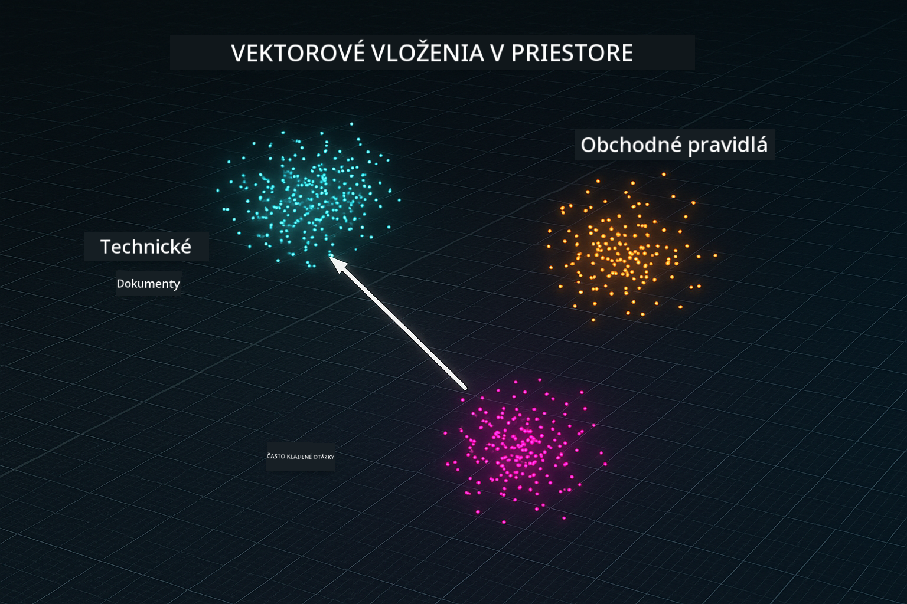
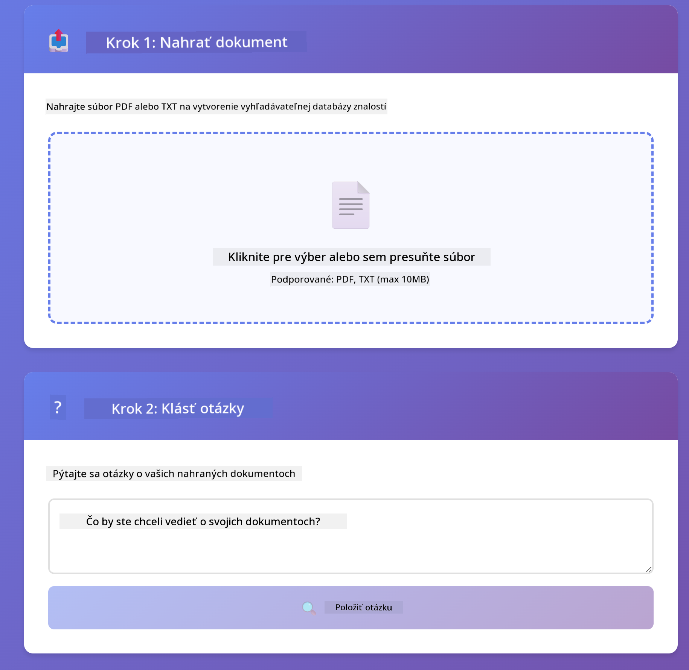

<!--
CO_OP_TRANSLATOR_METADATA:
{
  "original_hash": "f538a51cfd13147d40d84e936a0f485c",
  "translation_date": "2025-12-13T17:14:50+00:00",
  "source_file": "03-rag/README.md",
  "language_code": "sk"
}
-->
# Modul 03: RAG (Retrieval-Augmented Generation)

## Obsah

- [Čo sa naučíte](../../../03-rag)
- [Predpoklady](../../../03-rag)
- [Pochopenie RAG](../../../03-rag)
- [Ako to funguje](../../../03-rag)
  - [Spracovanie dokumentov](../../../03-rag)
  - [Vytváranie embeddingov](../../../03-rag)
  - [Sémantické vyhľadávanie](../../../03-rag)
  - [Generovanie odpovedí](../../../03-rag)
- [Spustenie aplikácie](../../../03-rag)
- [Používanie aplikácie](../../../03-rag)
  - [Nahranie dokumentu](../../../03-rag)
  - [Klásť otázky](../../../03-rag)
  - [Skontrolovať zdrojové odkazy](../../../03-rag)
  - [Experimentovať s otázkami](../../../03-rag)
- [Kľúčové koncepty](../../../03-rag)
  - [Stratégia rozdeľovania na kúsky](../../../03-rag)
  - [Skóre podobnosti](../../../03-rag)
  - [Ukladanie v pamäti](../../../03-rag)
  - [Správa kontextového okna](../../../03-rag)
- [Kedy je RAG dôležité](../../../03-rag)
- [Ďalšie kroky](../../../03-rag)

## Čo sa naučíte

V predchádzajúcich moduloch ste sa naučili viesť rozhovory s AI a efektívne štruktúrovať svoje prompt-y. Ale existuje základné obmedzenie: jazykové modely vedia len to, čo sa naučili počas tréningu. Nevedia odpovedať na otázky o politikách vašej spoločnosti, dokumentácii vášho projektu alebo o informáciách, na ktorých neboli trénované.

RAG (Retrieval-Augmented Generation) tento problém rieši. Namiesto toho, aby ste model učili vaše informácie (čo je drahé a nepraktické), dáte mu možnosť vyhľadávať vo vašich dokumentoch. Keď niekto položí otázku, systém nájde relevantné informácie a zahrnie ich do promptu. Model potom odpovie na základe tohto získaného kontextu.

Predstavte si RAG ako poskytnutie referenčnej knižnice modelu. Keď položíte otázku, systém:

1. **Používateľský dotaz** - Položíte otázku
2. **Embedding** - Prevedie vašu otázku na vektor
3. **Vektorové vyhľadávanie** - Nájde podobné kúsky dokumentov
4. **Zostavenie kontextu** - Pridá relevantné kúsky do promptu
5. **Odpoveď** - LLM vygeneruje odpoveď na základe kontextu

Týmto spôsobom sú odpovede modelu zakotvené vo vašich skutočných dátach namiesto spoliehania sa na jeho tréningové znalosti alebo vymýšľanie odpovedí.


*Priebeh RAG - od používateľského dotazu cez sémantické vyhľadávanie až po generovanie kontextovej odpovede*

## Predpoklady

- Dokončený Modul 01 (nasadené Azure OpenAI zdroje)
- Súbor `.env` v koreňovom adresári s Azure povereniami (vytvorený príkazom `azd up` v Module 01)

> **Poznámka:** Ak ste ešte nedokončili Modul 01, najskôr postupujte podľa inštrukcií na nasadenie tam.

## Ako to funguje

**Spracovanie dokumentov** - [DocumentService.java](../../../03-rag/src/main/java/com/example/langchain4j/rag/service/DocumentService.java)

Keď nahráte dokument, systém ho rozdelí na kúsky - menšie časti, ktoré sa pohodlne zmestia do kontextového okna modelu. Tieto kúsky sa mierne prekrývajú, aby sa neztratil kontext na hraniciach.

```java
Document document = FileSystemDocumentLoader.loadDocument("sample-document.txt");

DocumentSplitter splitter = DocumentSplitters
    .recursive(300, 30, new OpenAiTokenizer());

List<TextSegment> segments = splitter.split(document);
```

> **🤖 Vyskúšajte s [GitHub Copilot](https://github.com/features/copilot) Chat:** Otvorte [`DocumentService.java`](../../../03-rag/src/main/java/com/example/langchain4j/rag/service/DocumentService.java) a spýtajte sa:
> - "Ako LangChain4j rozdeľuje dokumenty na kúsky a prečo je dôležité prekrývanie?"
> - "Aká je optimálna veľkosť kúskov pre rôzne typy dokumentov a prečo?"
> - "Ako spracovať dokumenty v rôznych jazykoch alebo so špeciálnym formátovaním?"

**Vytváranie embeddingov** - [LangChainRagConfig.java](../../../03-rag/src/main/java/com/example/langchain4j/rag/config/LangChainRagConfig.java)

Každý kúsok sa prevedie na číselnú reprezentáciu nazývanú embedding - v podstate matematický odtlačok, ktorý zachytáva význam textu. Podobný text produkuje podobné embeddingy.

```java
@Bean
public EmbeddingModel embeddingModel() {
    return OpenAiOfficialEmbeddingModel.builder()
        .baseUrl(azureOpenAiEndpoint)
        .apiKey(azureOpenAiKey)
        .modelName(azureEmbeddingDeploymentName)
        .build();
}

EmbeddingStore<TextSegment> embeddingStore = 
    new InMemoryEmbeddingStore<>();
```



*Dokumenty reprezentované ako vektory v embeddingovom priestore - podobný obsah sa zoskupuje*

**Sémantické vyhľadávanie** - [RagService.java](../../../03-rag/src/main/java/com/example/langchain4j/rag/service/RagService.java)

Keď položíte otázku, vaša otázka sa tiež prevedie na embedding. Systém porovná embedding vašej otázky so všetkými embeddingmi kúskov dokumentov. Nájde kúsky s najpodobnejším významom - nielen podľa kľúčových slov, ale podľa skutočnej sémantickej podobnosti.

```java
Embedding queryEmbedding = embeddingModel.embed(question).content();

List<EmbeddingMatch<TextSegment>> matches = 
    embeddingStore.findRelevant(queryEmbedding, 5, 0.7);

for (EmbeddingMatch<TextSegment> match : matches) {
    String relevantText = match.embedded().text();
    double score = match.score();
}
```

> **🤖 Vyskúšajte s [GitHub Copilot](https://github.com/features/copilot) Chat:** Otvorte [`RagService.java`](../../../03-rag/src/main/java/com/example/langchain4j/rag/service/RagService.java) a spýtajte sa:
> - "Ako funguje vyhľadávanie podobnosti s embeddingmi a čo určuje skóre?"
> - "Aký prah podobnosti by som mal použiť a ako ovplyvňuje výsledky?"
> - "Ako riešiť prípady, keď sa nenájdu žiadne relevantné dokumenty?"

**Generovanie odpovedí** - [RagService.java](../../../03-rag/src/main/java/com/example/langchain4j/rag/service/RagService.java)

Najrelevantnejšie kúsky sa zahrnú do promptu pre model. Model si prečíta tieto konkrétne kúsky a odpovie na vašu otázku na základe týchto informácií. Tým sa zabráni halucináciám - model môže odpovedať len z toho, čo má pred sebou.

## Spustenie aplikácie

**Overenie nasadenia:**

Uistite sa, že súbor `.env` existuje v koreňovom adresári s Azure povereniami (vytvorený počas Modulu 01):
```bash
cat ../.env  # Malo by zobraziť AZURE_OPENAI_ENDPOINT, API_KEY, DEPLOYMENT
```

**Spustenie aplikácie:**

> **Poznámka:** Ak ste už spustili všetky aplikácie pomocou `./start-all.sh` z Modulu 01, tento modul už beží na porte 8081. Môžete preskočiť spúšťacie príkazy nižšie a ísť priamo na http://localhost:8081.

**Možnosť 1: Použitie Spring Boot Dashboard (odporúčané pre používateľov VS Code)**

Vývojársky kontajner obsahuje rozšírenie Spring Boot Dashboard, ktoré poskytuje vizuálne rozhranie na správu všetkých Spring Boot aplikácií. Nájdete ho v Activity Bar na ľavej strane VS Code (ikona Spring Boot).

Zo Spring Boot Dashboard môžete:
- Vidieť všetky dostupné Spring Boot aplikácie v pracovnom priestore
- Jedným kliknutím spustiť/zastaviť aplikácie
- Zobraziť logy aplikácie v reálnom čase
- Monitorovať stav aplikácie

Jednoducho kliknite na tlačidlo play vedľa "rag" pre spustenie tohto modulu, alebo spustite všetky moduly naraz.


**Možnosť 2: Použitie shell skriptov**

Spustite všetky webové aplikácie (moduly 01-04):

**Bash:**
```bash
cd ..  # Z koreňového adresára
./start-all.sh
```

**PowerShell:**
```powershell
cd ..  # Z koreňového adresára
.\start-all.ps1
```

Alebo spustite len tento modul:

**Bash:**
```bash
cd 03-rag
./start.sh
```

**PowerShell:**
```powershell
cd 03-rag
.\start.ps1
```

Oba skripty automaticky načítajú premenné prostredia zo súboru `.env` v koreňovom adresári a zostavia JAR súbory, ak ešte neexistujú.

> **Poznámka:** Ak chcete najskôr manuálne zostaviť všetky moduly pred spustením:
>
> **Bash:**
> ```bash
> cd ..  # Go to root directory
> mvn clean package -DskipTests
> ```
>
> **PowerShell:**
> ```powershell
> cd ..  # Go to root directory
> mvn clean package -DskipTests
> ```

Otvorte http://localhost:8081 vo vašom prehliadači.

**Na zastavenie:**

**Bash:**
```bash
./stop.sh  # Len tento modul
# Alebo
cd .. && ./stop-all.sh  # Všetky moduly
```

**PowerShell:**
```powershell
.\stop.ps1  # Len tento modul
# Alebo
cd ..; .\stop-all.ps1  # Všetky moduly
```

## Používanie aplikácie

Aplikácia poskytuje webové rozhranie na nahrávanie dokumentov a kladenie otázok.

<a href="images/rag-homepage.png"></a>

*Rozhranie aplikácie RAG - nahrávajte dokumenty a kladte otázky*

**Nahranie dokumentu**

Začnite nahraním dokumentu - pre testovanie najlepšie fungujú TXT súbory. V tomto adresári je k dispozícii `sample-document.txt`, ktorý obsahuje informácie o funkciách LangChain4j, implementácii RAG a najlepších postupoch - ideálne na testovanie systému.

Systém spracuje váš dokument, rozdelí ho na kúsky a vytvorí embeddingy pre každý kúsok. Toto sa deje automaticky pri nahrávaní.

**Klásť otázky**

Teraz položte konkrétne otázky o obsahu dokumentu. Skúste niečo faktické, čo je jasne uvedené v dokumente. Systém vyhľadá relevantné kúsky, zahrnie ich do promptu a vygeneruje odpoveď.

**Skontrolovať zdrojové odkazy**

Všimnite si, že každá odpoveď obsahuje zdrojové odkazy so skóre podobnosti. Tieto skóre (od 0 do 1) ukazujú, ako relevantný bol každý kúsok pre vašu otázku. Vyššie skóre znamená lepšiu zhodu. To vám umožní overiť odpoveď voči zdrojovému materiálu.

<a href="images/rag-query-results.png"></a>

*Výsledky dotazu zobrazujú odpoveď so zdrojovými odkazmi a skóre relevantnosti*

**Experimentovať s otázkami**

Vyskúšajte rôzne typy otázok:
- Konkrétne fakty: "Aká je hlavná téma?"
- Porovnania: "Aký je rozdiel medzi X a Y?"
- Zhrnutia: "Zhrňte kľúčové body o Z"

Sledujte, ako sa skóre relevantnosti mení podľa toho, ako dobre vaša otázka zodpovedá obsahu dokumentu.

## Kľúčové koncepty

**Stratégia rozdeľovania na kúsky**

Dokumenty sa rozdeľujú na kúsky po 300 tokenoch s 30 tokenmi prekrývania. Tento kompromis zabezpečuje, že každý kúsok má dostatok kontextu, aby bol zmysluplný, a zároveň je dostatočne malý na to, aby sa do promptu zmestilo viac kúskov.

**Skóre podobnosti**

Skóre sa pohybujú od 0 do 1:
- 0,7-1,0: Vysoko relevantné, presná zhoda
- 0,5-0,7: Relevantné, dobrý kontext
- Pod 0,5: Filtrované, príliš odlišné

Systém vyhľadáva len kúsky nad minimálnym prahom, aby zabezpečil kvalitu.

**Ukladanie v pamäti**

Tento modul používa ukladanie v pamäti pre jednoduchosť. Po reštarte aplikácie sa nahrané dokumenty stratia. Produkčné systémy používajú perzistentné vektorové databázy ako Qdrant alebo Azure AI Search.

**Správa kontextového okna**

Každý model má maximálne kontextové okno. Nemôžete zahrnúť všetky kúsky z veľkého dokumentu. Systém vyberá top N najrelevantnejších kúskov (predvolene 5), aby zostal v limitoch a zároveň poskytol dostatok kontextu pre presné odpovede.

## Kedy je RAG dôležité

**Používajte RAG, keď:**
- Odpovedáte na otázky o proprietárnych dokumentoch
- Informácie sa často menia (politiky, ceny, špecifikácie)
- Presnosť vyžaduje uvedenie zdroja
- Obsah je príliš veľký na zahrnutie do jedného promptu
- Potrebujete overiteľné, zakotvené odpovede

**Nepoužívajte RAG, keď:**
- Otázky vyžadujú všeobecné znalosti, ktoré model už má
- Potrebujete dáta v reálnom čase (RAG pracuje s nahranými dokumentmi)
- Obsah je dostatočne malý na priame zahrnutie do promptu

## Ďalšie kroky

**Ďalší modul:** [04-tools - AI agenti s nástrojmi](../04-tools/README.md)

---

**Navigácia:** [← Predchádzajúci: Modul 02 - Prompt Engineering](../02-prompt-engineering/README.md) | [Späť na hlavnú stránku](../README.md) | [Ďalší: Modul 04 - Nástroje →](../04-tools/README.md)

---

<!-- CO-OP TRANSLATOR DISCLAIMER START -->
**Zrieknutie sa zodpovednosti**:
Tento dokument bol preložený pomocou AI prekladateľskej služby [Co-op Translator](https://github.com/Azure/co-op-translator). Aj keď sa snažíme o presnosť, prosím, majte na pamäti, že automatizované preklady môžu obsahovať chyby alebo nepresnosti. Originálny dokument v jeho pôvodnom jazyku by mal byť považovaný za autoritatívny zdroj. Pre kritické informácie sa odporúča profesionálny ľudský preklad. Nie sme zodpovední za akékoľvek nedorozumenia alebo nesprávne interpretácie vyplývajúce z použitia tohto prekladu.
<!-- CO-OP TRANSLATOR DISCLAIMER END -->