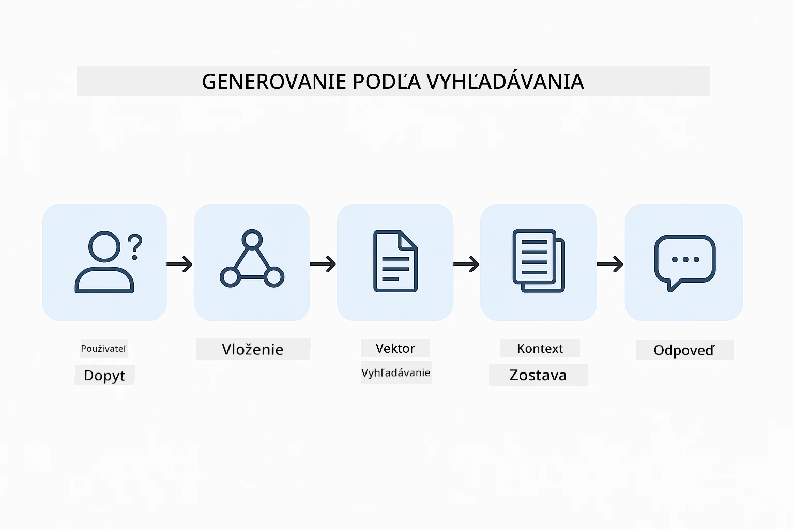
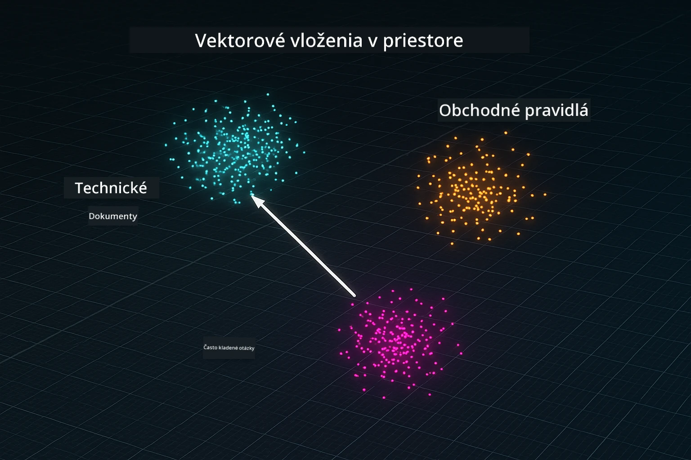
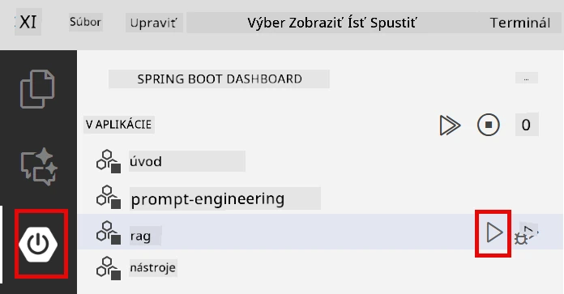
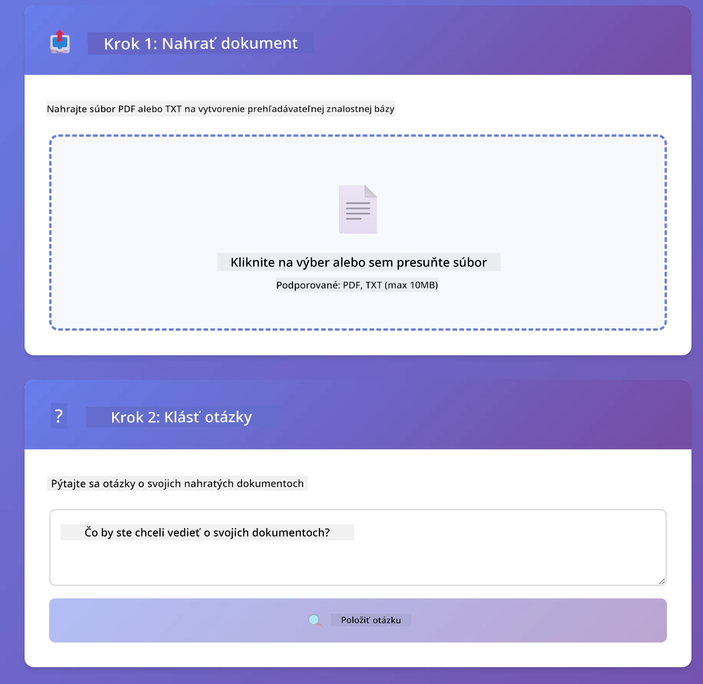
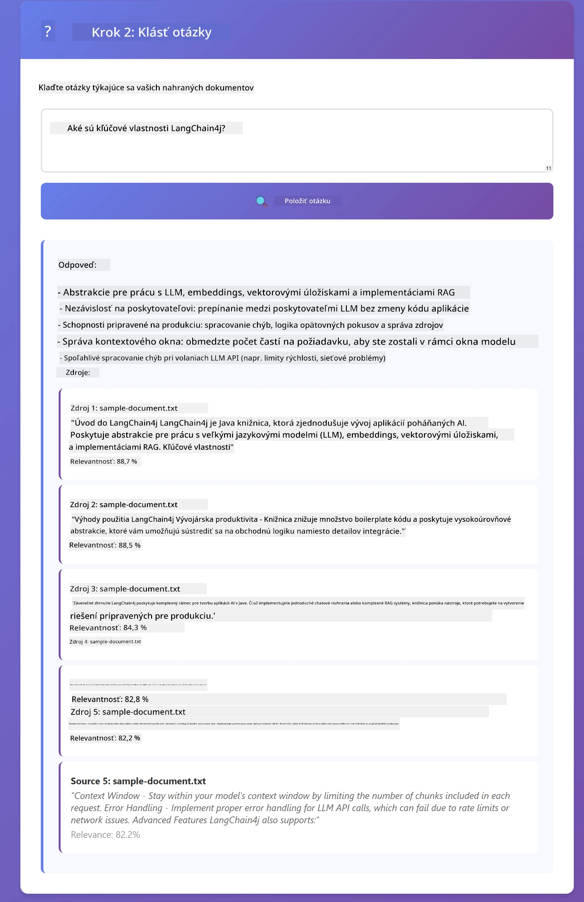

# Modul 03: RAG (Generovanie s podporou vyhľadávania)

## Obsah

- [Video Prezentácia](#video-prezentácia)
- [Čo sa naučíte](#čo-sa-naučíte)
- [Predpoklady](#predpoklady)
- [Pochopenie RAG](#pochopenie-rag)
  - [Ktorý RAG prístup tento tutoriál používa?](#ktorý-rag-prístup-tento-tutoriál-používa)
- [Ako to funguje](#ako-to-funguje)
  - [Spracovanie dokumentov](#spracovanie-dokumentov)
  - [Vytváranie embedov](#vytváranie-embedov)
  - [Sémantické vyhľadávanie](#sémantické-vyhľadávanie)
  - [Generovanie odpovedí](#generovanie-odpovedí)
- [Spustenie aplikácie](#spustenie-aplikácie)
- [Používanie aplikácie](#používanie-aplikácie)
  - [Nahratie dokumentu](#nahranie-dokumentu)
  - [Kladenie otázok](#kladenie-otázok)
  - [Skontrolovať zdrojové odkazy](#skontrolujte-referencie-zdrojov)
  - [Experimentovanie s otázkami](#experimentujte-s-otázkami)
- [Kľúčové koncepty](#kľúčové-koncepty)
  - [Stratégia rozdelenia na časti](#stratégia-delenia-na-segmenty)
  - [Skóre podobnosti](#hodnotenia-podobnosti)
  - [Ukladanie v pamäti](#ukladanie-v-pamäti)
  - [Správa kontextového okna](#správa-kontextového-okna)
- [Kedy je RAG dôležitý](#kedy-je-rag-dôležité)
- [Ďalšie kroky](#ďalšie-kroky)

## Video Prezentácia

Pozrite si toto živé vysielanie, ktoré vysvetľuje, ako začať s týmto modulom:

<a href="https://www.youtube.com/watch?v=_olq75ZH_eY"></a>

## Čo sa naučíte

V predchádzajúcich moduloch ste sa naučili viesť rozhovory s AI a efektívne štruktúrovať svoje prompt-y. Ale je tu zásadné obmedzenie: jazykové modely vedia len to, čo sa naučili počas trénovania. Nevedia odpovedať na otázky o firemných politikách, dokumentácii vašich projektov alebo o informáciách, na ktorých neboli trénované.

RAG (Generovanie s podporou vyhľadávania) tento problém rieši. Namiesto toho, aby ste model učili vaše informácie (čo je nákladné a nepraktické), dáte mu možnosť vyhľadávať vo vašich dokumentoch. Keď niekto položí otázku, systém nájde relevantné informácie a zahrnie ich do promptu. Model potom odpovie na základe tohto získaného kontextu.

Predstavte si RAG ako referenčnú knižnicu pre model. Keď položíte otázku, systém:

1. **Používateľská otázka** - Položíte otázku  
2. **Embedovanie** - Premení vašu otázku na vektor  
3. **Vyhľadávanie vo vektoroch** - Nájde podobné časti dokumentu  
4. **Sestavenie kontextu** - Pridá relevantné časti k promptu  
5. **Odpoveď** - LLM vytvorí odpoveď založenú na kontexte  

Týmto sa odpovede modelu zakladajú na vašich reálnych dátach namiesto toho, aby sa spoliehali len na vedomosti zo školenia či vymýšľali odpovede.

## Predpoklady

- Dokončené [Modul 01 - Úvod](../01-introduction/README.md) (nasadené Azure OpenAI zdroje vrátane embedding modelu `text-embedding-3-small`)  
- `.env` súbor v koreňovom adresári so Azure povereniami (vytvorený príkazom `azd up` v Module 01)  

> **Poznámka:** Ak ste Modulu 01 nedokončili, najskôr postupujte podľa jeho inštrukcií. Príkaz `azd up` nasadzuje ako GPT chat model, tak embedding model používaný v tomto module.

## Pochopenie RAG

Nasledujúci diagram ilustruje základný koncept: namiesto spoliehania sa len na tréningové dáta modelu, RAG mu poskytuje referenčnú knižnicu vašich dokumentov, ktoré môže konzultovať pred generovaním každej odpovede.


*Tento diagram ukazuje rozdiel medzi štandardným LLM (ktorý háda z tréningových dát) a RAG vylepšeným LLM (ktorý najskôr konzultuje vaše dokumenty).*

Tu je, ako sú jednotlivé časti prepojené koniec-koncov. Otázka používateľa prechádza štyrmi fázami — embedovaním, vyhľadávaním vo vektore, zostavením kontextu a generovaním odpovede — pričom každá fáza nadväzuje na predchádzajúcu:



*Diagram ukazuje end-to-end RAG pipeline — používateľská otázka prechádza embedovaním, vyhľadávaním, zostavením kontextu a generovaním odpovedí.*

Zvyšok tohto modulu podrobne prechádza každou fázou s ukážkovým kódom, ktorý si môžete spustiť a upravovať.

### Ktorý RAG prístup tento tutoriál používa?

LangChain4j ponúka tri spôsoby implementácie RAG, každý s inou úrovňou abstrakcie. Nasledujúci diagram ich porovnáva vedľa seba:


*Diagram porovnáva tri LangChain4j RAG prístupy — Easy, Native a Advanced — zobrazujúc ich kľúčové komponenty a situácie, kedy ich použiť.*

| Prístup | Čo robí | Kompromis |
|---|---|---|
| **Easy RAG** | Všetko automaticky prepája cez `AiServices` a `ContentRetriever`. Anotovanie rozhrania, pripojenie retrievera a LangChain4j za vás spracuje embedovanie, vyhľadávanie a zostavenie promptu. | Minimálny kód, ale nevidíte, čo sa deje v každom kroku. |
| **Native RAG** | Vyvolávate embedding model, vyhľadávate v store, budujete prompt a generujete odpoveď sami — po jednom explicitnom kroku. | Viac kódu, ale každá fáza je viditeľná a modifikovateľná. |
| **Advanced RAG** | Používa framework `RetrievalAugmentor` s pluggable transformátormi, routermi, re-rankerami a content injectormi pre produkčné pipeline. | Maximálna flexibilita, ale výrazne zložitejšie. |

**Tento tutoriál používa Native prístup.** Každý krok RAG pipeline — embedovanie otázky, vyhľadávanie vo vektorovom úložisku, zostavenie kontextu a generovanie odpovede — je explicitne napísaný v [`RagService.java`](../../../03-rag/src/main/java/com/example/langchain4j/rag/service/RagService.java). Toto je zámerné: ako vzdelávací materiál je dôležitejšie, aby ste videli a pochopili každý krok, než aby bol kód minimalizovaný. Keď si osvojíte, ako to všetko zapadá, môžete prejsť na Easy RAG pre rýchle prototypy alebo Advanced RAG pre produkčné systémy.

> **💡 Zaujíma vás Easy RAG?** LangChain4j tiež ponúka *Easy RAG* prístup, kde `AiServices` a `ContentRetriever` automaticky riešia embedovanie, vyhľadávanie a zostavenie promptu. Tento modul ide explicitnejšou cestou — rozbíja pipeline, aby ste mohli každý krok vidieť a riadiť sami.

Nasledujúci diagram ukazuje Easy RAG pipeline. Všimnite si, ako `AiServices` a `EmbeddingStoreContentRetriever` skrývajú celú komplexnosť — načítate dokument, pripojíte retriever, a dostanete odpovede. Native prístup v tomto module jednotlivé kroky odhaľuje:


*Diagram ukazuje Easy RAG pipeline. Porovnajte to s Native prístupom použitým v tomto module: Easy RAG skrýva embedovanie, vyhľadávanie a zostavenie promptu za `AiServices` a `ContentRetriever` — načítate dokument, pripojíte retriever a dostanete odpovede. Native prístup jednotlivé kroky otvára, takže ich voláte sami (embedovať, vyhľadávať, zostaviť kontext, generovať), čím máte plnú viditeľnosť a kontrolu.*

## Ako to funguje

RAG pipeline v tomto module sa skladá zo štyroch fáz, ktoré sa vykonávajú za sebou vždy, keď používateľ položí otázku. Najprv sa nahraný dokument **analyzuje a rozdelí** na zvládnuteľné časti. Tieto časti sa potom prevedú na **vektorové embedy** a uloží sa ich reprezentácia, aby sa dali matematicky porovnávať. Keď príde dopyt, systém vykoná **sémantické vyhľadávanie** na nájdenie najrelevantnejších častí a nakoniec ich odovzdá ako kontext LLM pre **generovanie odpovede**. Nižšie prejdeme každú fázu s reálnym kódom a diagramami. Pozrime sa na prvý krok.

### Spracovanie dokumentov

[DocumentService.java](../../../03-rag/src/main/java/com/example/langchain4j/rag/service/DocumentService.java)

Keď nahráte dokument, systém ho analyzuje (PDF alebo čistý text), pripojí metaúdaje ako názov súboru a rozdelí ho na časti — menšie kúsky, ktoré pohodlne vojdú do kontextového okna modelu. Tieto časti sa mierne prekrývajú, aby sa nezstratil kontext na hraniciach.

```java
// Analyzujte nahraný súbor a zabaľte ho do dokumentu LangChain4j
Document document = Document.from(content, metadata);

// Rozdeľte na kúsky po 300 tokenoch s 30-tokenovým prekrytím
DocumentSplitter splitter = DocumentSplitters
    .recursive(300, 30);

List<TextSegment> segments = splitter.split(document);
```
  
Nasledujúci diagram vizualizuje tento proces. Všimnite si, že každá časť si s susedmi zdieľa niekoľko tokenov — 30-tokenové prekrytie zabezpečuje, že žiadny dôležitý kontext nepadne medzi praskliny:


*Diagram ukazuje, ako je dokument rozdelený do 300-tokenových častí s 30-tokenovým prekrytím, čím sa zachováva kontext na hraniciach častí.*

> **🤖 Vyskúšajte s [GitHub Copilot](https://github.com/features/copilot) Chat:** Otvorte [`DocumentService.java`](../../../03-rag/src/main/java/com/example/langchain4j/rag/service/DocumentService.java) a spýtajte sa:  
> - "Ako LangChain4j rozdeľuje dokumenty na časti a prečo je prekrytie dôležité?"  
> - "Aká je optimálna veľkosť častí pre rôzne typy dokumentov a prečo?"  
> - "Ako spracovať dokumenty v viacerých jazykoch alebo so špeciálnym formátovaním?"

### Vytváranie embedov

[LangChainRagConfig.java](../../../03-rag/src/main/java/com/example/langchain4j/rag/config/LangChainRagConfig.java)

Každá časť sa prevedie na číselnú reprezentáciu nazývanú embedding — v podstate prevodník významu na čísla. Embedding model nie je "inteligentný" ako chat model; nedokáže dodržiavať inštrukcie, dedukovať ani odpovedať na otázky. Čo dokáže, je premapovať text do matematického priestoru, kde sa podobné významy nachádzajú blízko seba — napríklad "auto" blízko "automobil," "politika vrátenia" blízko "vráť mi peniaze." Predstavte si chat model ako osobu, s ktorou môžete hovoriť; embedding model ako špičkový systém na triedenie.

Nasledujúci diagram znázorňuje tento koncept — text ide dovnútra, vychádzajú numerické vektory, a podobné významy produkujú vektory vedľa seba:


*Diagram ukazuje, ako embedding model prevádza text na číselné vektory, pričom podobné významy — ako "auto" a "automobil" — sú umiestnené blízko seba vo vektorovom priestore.*

```java
@Bean
public EmbeddingModel embeddingModel() {
    return OpenAiOfficialEmbeddingModel.builder()
        .baseUrl(azureOpenAiEndpoint)
        .apiKey(azureOpenAiKey)
        .modelName(azureEmbeddingDeploymentName)
        .build();
}

EmbeddingStore<TextSegment> embeddingStore = 
    new InMemoryEmbeddingStore<>();
```
  
Nižšie uvedený diagram tried ukazuje dva samostatné toky v RAG pipeline a LangChain4j triedy ich realizujúce. **Ingestný tok** (spustí sa raz pri nahrávaní) rozdeľuje dokument, embeduje časti a ukladá cez `.addAll()`. **Dopytový tok** (beží pri každom dopyte používateľa) embeduje otázku, vyhľadáva v store cez `.search()` a odovzdáva nájdený kontext chat modelu. Oba toky sa prepájajú cez zdieľané rozhranie `EmbeddingStore<TextSegment>`:


*Diagram zobrazuje dva toky v RAG pipeline — ingestný a dopytový — a ich prepojenie cez zdieľané EmbeddingStore.*

Keď sú embedy uložené, podobný obsah sa prirodzene zoskupuje vektorovo priestorovo. Vizualizácia nižšie ukazuje, ako dokumenty o súvisiacich témach vytvárajú blízke body, čo umožňuje sémantické vyhľadávanie:



*Vizualizácia ukazuje, ako sa dokumenty s podobnou tématikou zoskupujú v 3D vektorovom priestore do samostatných zhlukov, ako sú Technická dokumentácia, Obchodné pravidlá a FAQ.*

Keď používateľ vyhľadáva, systém nasleduje štyri kroky: embedovanie dokumentov raz, embedovanie otázky pri každom vyhľadávaní, porovnanie otázkového vektora so všetkými uloženými vektormi pomocou kosínovej podobnosti a vrátenie top-K najlepších častí. Diagram nižšie prechádza každý krok a zúčastnené LangChain4j triedy:


*Diagram ukazuje štvorkrokový proces embedding vyhľadávania: embedovať dokumenty, embedovať otázku, porovnať vektory pomocou kosínovej podobnosti a vrátiť top-K výsledkov.*

### Sémantické vyhľadávanie

[RagService.java](../../../03-rag/src/main/java/com/example/langchain4j/rag/service/RagService.java)

Keď položíte otázku, táto otázka sa tiež prevedie na embedding. Systém porovná embedding vašej otázky so všetkými embeddingami častí dokumentu. Nájde časti s najpodobnejším významom — nielen zhodu kľúčových slov, ale skutočnú sémantickú podobnosť.

```java
Embedding queryEmbedding = embeddingModel.embed(question).content();

EmbeddingSearchRequest searchRequest = EmbeddingSearchRequest.builder()
    .queryEmbedding(queryEmbedding)
    .maxResults(5)
    .minScore(0.5)
    .build();

EmbeddingSearchResult<TextSegment> searchResult = embeddingStore.search(searchRequest);
List<EmbeddingMatch<TextSegment>> matches = searchResult.matches();

for (EmbeddingMatch<TextSegment> match : matches) {
    String relevantText = match.embedded().text();
    double score = match.score();
}
```
  
Nasledujúci diagram porovnáva sémantické vyhľadávanie s tradičným vyhľadávaním podľa kľúčových slov. Vyhľadávanie podľa kľúčového slova „vozidlo“ prehliadne časť o „autách a nákladiakoch,“ ale sémantické vyhľadávanie chápe, že ide o to isté a vráti ju ako vysoko hodnotený výsledok:


*Diagram porovnáva vyhľadávanie podľa kľúčových slov so sémantickým vyhľadávaním, ktoré vracia obsah konceptuálne príbuzný, aj keď sa kľúčové slová líšia.*

V základe sa podobnosť meria pomocou kosínovej podobnosti — v podstate otázkou „ukazujú tieto dva šípy rovnakým smerom?“ Dve časti môžu použiť úplne odlišné slová, ale ak majú rovnaký význam, vektory smerujú podobne a skóre je blízke 1.0:


*Táto schéma znázorňuje kosínusovú podobnosť ako uhol medzi vektormi embedingov — viac zladené vektory majú skóre bližšie k 1,0, čo naznačuje vyššiu sémantickú podobnosť.*

> **🤖 Vyskúšajte s [GitHub Copilot](https://github.com/features/copilot) Chat:** Otvorte [`RagService.java`](../../../03-rag/src/main/java/com/example/langchain4j/rag/service/RagService.java) a opýtajte sa:
> - "Ako funguje vyhľadávanie podobnosti s embeddingami a čo určuje skóre?"
> - "Akú prahovú hodnotu podobnosti by som mal použiť a ako ovplyvňuje výsledky?"
> - "Ako riešim prípady, keď nie sú nájdené relevantné dokumenty?"

### Generovanie odpovedí

[RagService.java](../../../03-rag/src/main/java/com/example/langchain4j/rag/service/RagService.java)

Najrelevantnejšie segmenty sú zostavené do štruktúrovaného promptu, ktorý obsahuje explicitné inštrukcie, získaný kontext a otázku používateľa. Model číta tieto konkrétne segmenty a odpovedá na základe týchto informácií — môže použiť iba to, čo má pred sebou, čo zabraňuje halucináciám.

```java
String context = matches.stream()
    .map(match -> match.embedded().text())
    .collect(Collectors.joining("\n\n"));

String prompt = String.format("""
    Answer the question based on the following context.
    If the answer cannot be found in the context, say so.

    Context:
    %s

    Question: %s

    Answer:""", context, request.question());

String answer = chatModel.chat(prompt);
```

Nižšie znázorňuje táto schéma tento proces zostavenia — najvyššie skórujúce segmenty zo skúšobného kroku sú vložené do šablóny promptu a `OpenAiOfficialChatModel` generuje podloženú odpoveď:


*Táto schéma ukazuje, ako sú najlepšie skórujúce segmenty zostavené do štruktúrovaného promptu, čo modelu umožňuje generovať podloženú odpoveď z vašich dát.*

## Spustenie aplikácie

**Overenie nasadenia:**

Uistite sa, že v koreňovom adresári existuje súbor `.env` s Azure povereniami (vytvorený počas Modulu 01). Spustite toto z adresára modulu (`03-rag/`):

**Bash:**
```bash
cat ../.env  # Malo by zobraziť AZURE_OPENAI_ENDPOINT, API_KEY, DEPLOYMENT
```

**PowerShell:**
```powershell
Get-Content ..\.env  # Malo by zobraziť AZURE_OPENAI_ENDPOINT, API_KEY, DEPLOYMENT
```

**Spustenie aplikácie:**

> **Poznámka:** Ak ste už všetky aplikácie spustili pomocou `./start-all.sh` z koreňového adresára (ako je popísané v Module 01), tento modul už beží na porte 8081. Môžete preskočiť príkazy na spustenie nižšie a prejsť priamo na http://localhost:8081.

**Možnosť 1: Použitie Spring Boot Dashboard (Odporúčané pre používateľov VS Code)**

Vývojové kontajner obsahuje rozšírenie Spring Boot Dashboard, ktoré poskytuje vizuálne rozhranie na správu všetkých Spring Boot aplikácií. Nájdete ho v Activity Bar na ľavej strane VS Code (ikona Spring Boot).

Z Spring Boot Dashboard môžete:
- Vidieť všetky dostupné Spring Boot aplikácie v pracovnom priestore
- Jedným kliknutím spúšťať alebo zastavovať aplikácie
- Pozerať logy aplikácií v reálnom čase
- Monitorovať stav aplikácií

Jednoducho kliknite na tlačidlo prehrávania vedľa „rag“ na spustenie tohto modulu, alebo spustite všetky moduly naraz.



*Táto snímka obrazovky zobrazuje Spring Boot Dashboard v VS Code, kde môžete vizuálne spúšťať, zastavovať a monitorovať aplikácie.*

**Možnosť 2: Použitie shell skriptov**

Spustiť všetky webové aplikácie (moduly 01-04):

**Bash:**
```bash
cd ..  # Z koreňového adresára
./start-all.sh
```

**PowerShell:**
```powershell
cd ..  # Z koreňového adresára
.\start-all.ps1
```

Alebo spustiť len tento modul:

**Bash:**
```bash
cd 03-rag
./start.sh
```

**PowerShell:**
```powershell
cd 03-rag
.\start.ps1
```

Obidva skripty automaticky načítajú premenné prostredia zo súboru `.env` v koreňovom adresári a postavia JAR súbory, ak ešte neexistujú.

> **Poznámka:** Ak preferujete najprv manuálne zostaviť všetky moduly pred spustením:
>
> **Bash:**
> ```bash
> cd ..  # Go to root directory
> mvn clean package -DskipTests
> ```
>
> **PowerShell:**
> ```powershell
> cd ..  # Go to root directory
> mvn clean package -DskipTests
> ```

Otvorte v prehliadači http://localhost:8081.

**Na zastavenie:**

**Bash:**
```bash
./stop.sh  # Iba tento modul
# Alebo
cd .. && ./stop-all.sh  # Všetky moduly
```

**PowerShell:**
```powershell
.\stop.ps1  # Len tento modul
# Alebo
cd ..; .\stop-all.ps1  # Všetky moduly
```

## Používanie aplikácie

Aplikácia poskytuje webové rozhranie na nahrávanie dokumentov a kladenie otázok.

<a href="images/rag-homepage.png"></a>

*Táto snímka obrazovky zobrazuje rozhranie RAG aplikácie, kde nahrávate dokumenty a kladiete otázky.*

### Nahranie dokumentu

Začnite nahraním dokumentu — na testovanie najlepšie fungujú TXT súbory. V tomto adresári je k dispozícii `sample-document.txt`, ktorý obsahuje informácie o funkciách LangChain4j, implementácii RAG a osvedčených postupoch — ideálny na testovanie systému.

Systém spracuje váš dokument, rozdelí ho na časti a vytvorí embeddingy pre každú časť. Toto prebieha automaticky pri nahraní.

### Kladenie otázok

Teraz sa môžete pýtať konkrétne otázky o obsahu dokumentu. Skúste niečo faktické, čo je jasne uvedené v dokumente. Systém vyhľadá relevantné segmenty, zahrnie ich do promptu a vygeneruje odpoveď.

### Skontrolujte referencie zdrojov

Všimnite si, že každá odpoveď obsahuje referencie na zdroje spolu s hodnoteniami podobnosti. Tieto skóre (0 až 1) ukazujú, ako relevantný každý segment bol pre vašu otázku. Vyššie skóre znamená lepšiu zhody. Toto vám umožňuje overiť odpoveď s pôvodným materiálom.

<a href="images/rag-query-results.png"></a>

*Táto snímka obrazovky zobrazuje výsledky dotazu s vygenerovanou odpoveďou, referenciami na zdroje a skóre relevantnosti pre každý získaný segment.*

### Experimentujte s otázkami

Vyskúšajte rôzne druhy otázok:
- Konkrétne fakty: "Aká je hlavná téma?"
- Porovnania: "V čom sa líši X od Y?"
- Zhrnutia: "Zhrňte kľúčové body o Z"

Sledujte, ako sa skóre relevantnosti mení podľa toho, ako dobre vaša otázka zodpovedá obsahu dokumentu.

## Kľúčové koncepty

### Stratégia delenia na segmenty

Dokumenty sa rozdeľujú na segmenty po 300 tokenoch s prekrytím 30 tokenov. Tento kompromis zabezpečuje, že každý segment má dostatok kontextu na zmysluplné chápanie, zároveň je dosť malý na to, aby sa v promptu zmestilo viac segmentov.

### Hodnotenia podobnosti

Každý získaný segment má skóre podobnosti medzi 0 a 1, ktoré indikuje, ako veľmi sa zhoduje s otázkou používateľa. Nižšie uvedená schéma vizualizuje rozsahy skóre a spôsob, akým systém filtruje výsledky:


*Táto schéma zobrazuje rozsahy skóre od 0 do 1, s minimálnym prahom 0,5, ktorý filtruje irelevantné segmenty.*

Skóre sa pohybuje od 0 do 1:
- 0,7-1,0: Vysoko relevantné, presná zhoda
- 0,5-0,7: Relevantné, dobrý kontext
- Pod 0,5: Vylúčené, príliš nezhodné

Systém vyhľadáva iba segmenty nad minimálnym prahom, aby zabezpečil kvalitu.

Embeddingy dobre fungujú, keď sa významy jasne zhlukujú, ale majú aj slabé miesta. Nižšie uvedená schéma zobrazuje bežné chyby — príliš veľké segmenty produkujú nejasné vektory, príliš malé segmenty nemajú kontext, nejednoznačné pojmy ukazujú na viacero zhlukov a presné vyhľadávanie zhodných hodnôt (ID, dielenské čísla) embeddingy vôbec nepodporujú:


*Táto schéma ukazuje bežné chyby embeddingov: príliš veľké segmenty, príliš malé segmenty, nejednoznačné pojmy, ktoré ukazujú na viacero zhlukov, a presné vyhľadávanie ako ID.*

### Ukladanie v pamäti

Tento modul používa pre jednoduchosť ukladanie v pamäti. Po reštarte aplikácie sa nahraté dokumenty stratia. Produkčné systémy používajú perzistentné vektorové databázy ako Qdrant alebo Azure AI Search.

### Správa kontextového okna

Každý model má maximálnu veľkosť kontextového okna. Nemôžete zahrnúť každý segment z veľkého dokumentu. Systém získava top N najrelevantnejších segmentov (štandardne 5), aby zostal v limitách a zároveň poskytol dostatok kontextu na presné odpovede.

## Kedy je RAG dôležité

RAG nie je vždy správny prístup. Nižšie uvedený rozhodovací návod vám pomôže určiť, kedy RAG prináša hodnotu a kedy sú jednoduchšie prístupy — ako zahrnutie obsahu priamo do promptu alebo spoliehanie sa na vstavané znalosti modelu — postačujúce:


*Táto schéma zobrazuje rozhodovací návod, kedy RAG prináša hodnotu oproti jednoduchším prístupom.*

## Ďalšie kroky

**Ďalší modul:** [04-tools - AI Agenti s nástrojmi](../04-tools/README.md)

---

**Navigácia:** [← Predchádzajúci: Modul 02 - Prompt Engineering](../02-prompt-engineering/README.md) | [Späť na hlavnú stránku](../README.md) | [Ďalší: Modul 04 - Tools →](../04-tools/README.md)

---

<!-- CO-OP TRANSLATOR DISCLAIMER START -->
**Vyhlásenie o zodpovednosti**:
Tento dokument bol preložený pomocou AI prekladateľskej služby [Co-op Translator](https://github.com/Azure/co-op-translator). Hoci sa snažíme o presnosť, vezmite prosím na vedomie, že automatické preklady môžu obsahovať chyby alebo nepresnosti. Pôvodný dokument v jeho natívnom jazyku by mal byť považovaný za autoritatívny zdroj. Pre kritické informácie sa odporúča profesionálny ľudský preklad. Nie sme zodpovední za žiadne nedorozumenia alebo nesprávne interpretácie vyplývajúce z použitia tohto prekladu.
<!-- CO-OP TRANSLATOR DISCLAIMER END -->