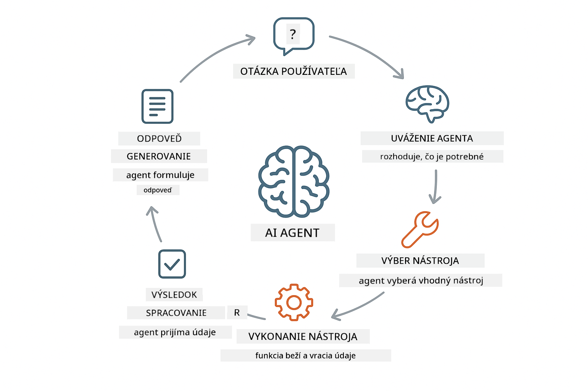
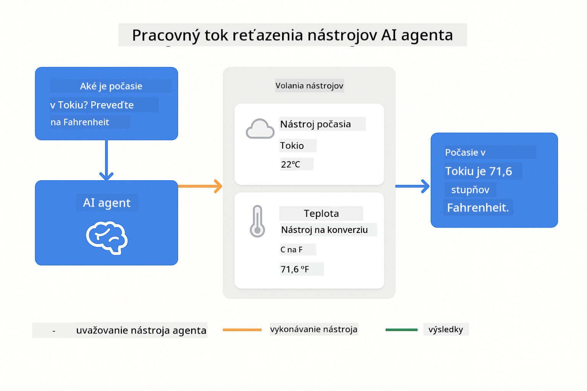
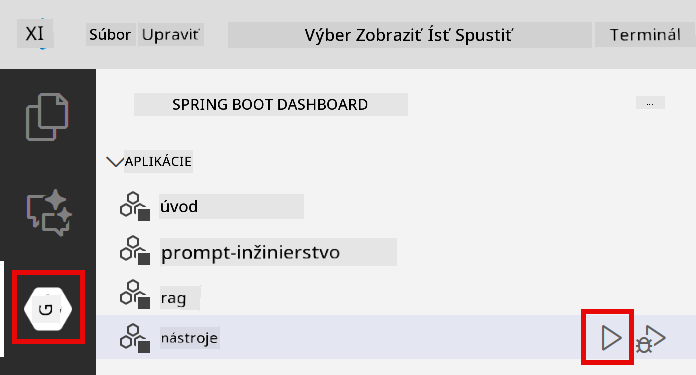
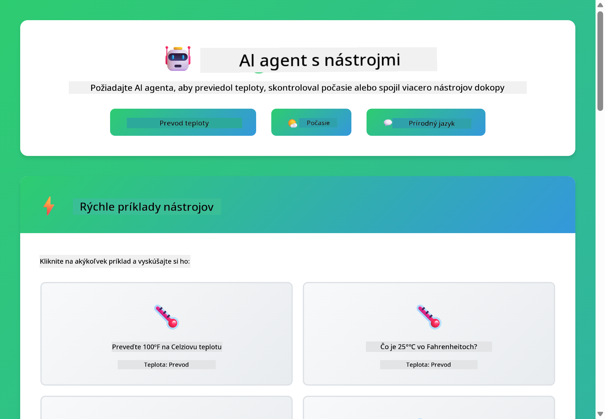
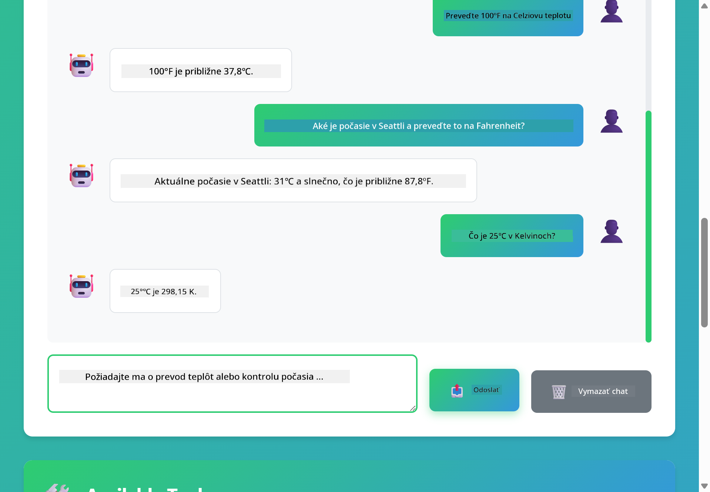

<!--
CO_OP_TRANSLATOR_METADATA:
{
  "original_hash": "13ec450c12cdd1a863baa2b778f27cd7",
  "translation_date": "2025-12-31T04:36:09+00:00",
  "source_file": "04-tools/README.md",
  "language_code": "sk"
}
-->
# Modul 04: AI agenti s nástrojmi

## Obsah

- [Čo sa naučíte](../../../04-tools)
- [Požiadavky](../../../04-tools)
- [Pochopenie AI agentov s nástrojmi](../../../04-tools)
- [Ako funguje volanie nástrojov](../../../04-tools)
  - [Definície nástrojov](../../../04-tools)
  - [Rozhodovanie](../../../04-tools)
  - [Vykonanie](../../../04-tools)
  - [Generovanie odpovede](../../../04-tools)
- [Reťazenie nástrojov](../../../04-tools)
- [Spustenie aplikácie](../../../04-tools)
- [Používanie aplikácie](../../../04-tools)
  - [Vyskúšajte jednoduché použitie nástroja](../../../04-tools)
  - [Otestujte reťazenie nástrojov](../../../04-tools)
  - [Pozrite si tok konverzácie](../../../04-tools)
  - [Pozorujte uvažovanie](../../../04-tools)
  - [Experimentujte s rôznymi požiadavkami](../../../04-tools)
- [Kľúčové koncepty](../../../04-tools)
  - [ReAct vzor (Reasoning and Acting)](../../../04-tools)
  - [Opis nástrojov je dôležitý](../../../04-tools)
  - [Správa relácií](../../../04-tools)
  - [Riešenie chýb](../../../04-tools)
- [Dostupné nástroje](../../../04-tools)
- [Kedy použiť agentov založených na nástrojoch](../../../04-tools)
- [Ďalšie kroky](../../../04-tools)

## Čo sa naučíte

Doteraz ste sa naučili viesť konverzácie s AI, efektívne štruktúrovať promptovanie a zakladať odpovede na vašich dokumentoch. Stále však existuje základné obmedzenie: jazykové modely dokážu generovať iba text. Nemôžu skontrolovať počasie, vykonávať výpočty, dotazovať databázy ani interagovať s externými systémami.

Nástroje toto menia. Tým, že modelu dáte prístup k funkciám, ktoré môže volať, premeníte ho z generátora textu na agenta, ktorý môže vykonávať akcie. Model rozhoduje, kedy potrebuje nástroj, ktorý nástroj použiť a aké parametre odovzdať. Váš kód vykoná funkciu a vráti výsledok. Model zahrnie tento výsledok do svojej odpovede.

## Požiadavky

- Dokončený Modul 01 (nasadené Azure OpenAI prostriedky)
- Súbor `.env` v koreňovom adresári s Azure prihlasovacími údajmi (vytvorený príkazom `azd up` v Module 01)

> **Poznámka:** Ak ste nedokončili Modul 01, najprv postupujte podľa tamojších inštrukcií na nasadenie.

## Pochopenie AI agentov s nástrojmi

> **📝 Poznámka:** Termín "agenti" v tomto module sa vzťahuje na AI asistenty rozšírené o schopnosť volať nástroje. Toto sa líši od vzorov **Agentic AI** (autonómni agenti s plánovaním, pamäťou a viacstupňovým uvažovaním), ktoré pokryjeme v [Module 05: MCP](../05-mcp/README.md).

AI agent s nástrojmi nasleduje vzor uvažovania a konania (ReAct):

1. Používateľ položí otázku
2. Agent uvažuje o tom, čo potrebuje vedieť
3. Agent rozhodne, či na odpoveď potrebuje nástroj
4. Ak áno, agent zavolá príslušný nástroj s vhodnými parametrami
5. Nástroj vykoná operáciu a vráti dáta
6. Agent začne výsledok a poskytne konečnú odpoveď



*Vzor ReAct - ako sa AI agenti striedajú medzi uvažovaním a konaním pri riešení problémov*

Toto sa deje automaticky. Vy definujete nástroje a ich popisy. Model sám rieši rozhodovanie o tom, kedy a ako ich používať.

## Ako funguje volanie nástrojov

**Definície nástrojov** - [WeatherTool.java](../../../04-tools/src/main/java/com/example/langchain4j/agents/tools/WeatherTool.java) | [TemperatureTool.java](../../../04-tools/src/main/java/com/example/langchain4j/agents/tools/TemperatureTool.java)

Definujete funkcie s jasnými popismi a špecifikáciami parametrov. Model vidí tieto popisy vo svojom systémovom prompte a rozumie, čo každý nástroj robí.

```java
@Component
public class WeatherTool {
    
    @Tool("Get the current weather for a location")
    public String getCurrentWeather(@P("Location name") String location) {
        // Vaša logika vyhľadávania počasia
        return "Weather in " + location + ": 22°C, cloudy";
    }
}

@AiService
public interface Assistant {
    String chat(@MemoryId String sessionId, @UserMessage String message);
}

// Asistent je Spring Bootom automaticky prepojený s:
// - bean ChatModel
// - Všetky metódy označené @Tool z tried označených @Component
// - ChatMemoryProvider pre správu relácií
```

> **🤖 Vyskúšajte s [GitHub Copilot](https://github.com/features/copilot) Chat:** Otvorte [`WeatherTool.java`](../../../04-tools/src/main/java/com/example/langchain4j/agents/tools/WeatherTool.java) a opýtajte sa:
> - "Ako by som integroval skutočné údaje z počasia, napríklad OpenWeatherMap, namiesto mock dát?"
> - "Čo robí dobrý opis nástroja, ktorý pomôže AI správne ho používať?"
> - "Ako riešim chyby API a limity rýchlosti v implementáciách nástrojov?"

**Rozhodovanie**

Keď používateľ položí otázku "Aké je počasie v Seattli?", model rozpozná, že potrebuje nástroj na počasie. Generuje volanie funkcie s parametrom lokality nastaveným na "Seattle".

**Vykonanie** - [AgentService.java](../../../04-tools/src/main/java/com/example/langchain4j/agents/service/AgentService.java)

Spring Boot automaticky injektuje deklaratívne rozhranie `@AiService` so všetkými zaregistrovanými nástrojmi a LangChain4j vykonáva volania nástrojov automaticky.

> **🤖 Vyskúšajte s [GitHub Copilot](https://github.com/features/copilot) Chat:** Otvorte [`AgentService.java`](../../../04-tools/src/main/java/com/example/langchain4j/agents/service/AgentService.java) a opýtajte sa:
> - "Ako funguje ReAct vzor a prečo je efektívny pre AI agentov?"
> - "Ako agent rozhoduje, ktorý nástroj použiť a v akom poradí?"
> - "Čo sa stane, ak vykonanie nástroja zlyhá - ako by som mal robustne riešiť chyby?"

**Generovanie odpovede**

Model prijme údaje o počasí a naformuluje ich do prirodzenej odpovede pre používateľa.

### Prečo používať deklaratívne AI služby?

Tento modul využíva integráciu LangChain4j so Spring Boot a deklaratívne rozhrania `@AiService`:

- **Automatické vkladanie Spring Boot** - ChatModel a nástroje sú automaticky injektované
- **Vzor @MemoryId** - Automatické spravovanie pamäte založenej na relácii
- **Jedna inštancia** - Asistent vytvorený raz a opakovane používaný pre lepší výkon
- **Typovo bezpečné vykonávanie** - Java metódy volané priamo s konverziou typov
- **Orchestrace viacstupňovej konverzácie** - Automaticky rieši reťazenie nástrojov
- **Žiadny boilerplate** - Žiadne manuálne volania AiServices.builder() alebo HashMap pre pamäť

Alternatívne prístupy (manuálne `AiServices.builder()`) vyžadujú viac kódu a postrádajú výhody integrácie so Spring Boot.

## Reťazenie nástrojov

**Reťazenie nástrojov** - AI môže volať viacero nástrojov za sebou. Spýtajte sa "Aké je počasie v Seattli a mám si vziať dáždnik?" a sledujte, ako reťazí `getCurrentWeather` so zvažovaním o pršiplášti.

<a href="images/tool-chaining.png"></a>

*Sekvenčné volania nástrojov - výstup jedného nástroja slúži ako vstup do ďalšieho rozhodnutia*

**Graceful Failures** - Požiadajte o počasie v meste, ktoré nie je v mock dátach. Nástroj vráti chybové hlásenie a AI vysvetlí, že nemôže pomôcť. Nástroje zlyhávajú bezpečne.

Toto sa deje v jednom kole konverzácie. Agent autonómne orchestruje viacnásobné volania nástrojov.

## Spustenie aplikácie

**Overenie nasadenia:**

Uistite sa, že súbor `.env` existuje v koreňovom adresári s Azure prihlasovacími údajmi (vytvorený počas Modulu 01):
```bash
cat ../.env  # Mal by zobraziť AZURE_OPENAI_ENDPOINT, API_KEY, DEPLOYMENT
```

**Spustenie aplikácie:**

> **Poznámka:** Ak ste už spustili všetky aplikácie pomocou `./start-all.sh` z Modulu 01, tento modul už beží na porte 8084. Môžete preskočiť príkazy na spustenie nižšie a prejsť priamo na http://localhost:8084.

**Možnosť 1: Použitie Spring Boot Dashboard (odporúčané pre používateľov VS Code)**

Dev kontejner obsahuje rozšírenie Spring Boot Dashboard, ktoré poskytuje vizuálne rozhranie na správu všetkých Spring Boot aplikácií. Nájdete ho v Activity Bar na ľavej strane VS Code (hľadajte ikonu Spring Boot).

Zo Spring Boot Dashboard môžete:
- Vidieť všetky dostupné Spring Boot aplikácie v pracovnom priestore
- Spúšťať/zastavovať aplikácie jediným kliknutím
- Zobraziť logy aplikácie v reálnom čase
- Monitorovať stav aplikácie

Jednoducho kliknite na tlačidlo pre spustenie vedľa "tools" pre spustenie tohto modulu, alebo spustite naraz všetky moduly.



**Možnosť 2: Použitie shell skriptov**

Spustite všetky web aplikácie (moduly 01-04):

**Bash:**
```bash
cd ..  # Z koreňového adresára
./start-all.sh
```

**PowerShell:**
```powershell
cd ..  # Z koreňového adresára
.\start-all.ps1
```

Alebo spustite len tento modul:

**Bash:**
```bash
cd 04-tools
./start.sh
```

**PowerShell:**
```powershell
cd 04-tools
.\start.ps1
```

Oba skripty automaticky načítajú premenné prostredia zo súboru `.env` v koreňovom adresári a zostavia JARy, ak neexistujú.

> **Poznámka:** Ak preferujete zostaviť všetky moduly manuálne pred spustením:
>
> **Bash:**
> ```bash
> cd ..  # Go to root directory
> mvn clean package -DskipTests
> ```
>
> **PowerShell:**
> ```powershell
> cd ..  # Go to root directory
> mvn clean package -DskipTests
> ```

Otvorte v prehliadači http://localhost:8084.

**Zastavenie:**

**Bash:**
```bash
./stop.sh  # Iba tento modul
# Alebo
cd .. && ./stop-all.sh  # Všetky moduly
```

**PowerShell:**
```powershell
.\stop.ps1  # Iba tento modul
# Alebo
cd ..; .\stop-all.ps1  # Všetky moduly
```

## Používanie aplikácie

Aplikácia poskytuje webové rozhranie, kde môžete komunikovať s AI agentom, ktorý má prístup k nástrojom na počasie a konverziu teplôt.

<a href="images/tools-homepage.png"></a>

*Rozhranie AI Agent Tools - rýchle príklady a chatovacie rozhranie na interakciu s nástrojmi*

**Vyskúšajte jednoduché použitie nástroja**

Začnite jednoduchou požiadavkou: "Preveďte 100 stupňov Fahrenheita na Celzius". Agent rozpozná, že potrebuje nástroj na konverziu teplôt, zavolá ho s vhodnými parametrami a vráti výsledok. Všimnite si, aké prirodzené to je - neurčili ste, ktorý nástroj použiť ani ako ho volať.

**Otestujte reťazenie nástrojov**

Teraz vyskúšajte niečo zložitejšie: "Aké je počasie v Seattli a preveďte ho na Fahrenheit?" Sledujte, ako agent postupuje krokmi. Najprv získa počasie (ktoré vracia v Celsius), rozpozná potrebu konverzie na Fahrenheit, zavolá nástroj na konverziu a skombinuje obe odpovede do jednej správy.

**Pozrite si tok konverzácie**

Chatovacie rozhranie uchováva históriu konverzácií, čo vám umožní mať viacstupňové interakcie. Vidíte všetky predchádzajúce dopyty a odpovede, čo uľahčuje sledovať konverzáciu a pochopiť, ako agent buduje kontext počas viacnásobných výmen.

<a href="images/tools-conversation-demo.png"></a>

*Viacstupňová konverzácia zobrazujúca jednoduché konverzie, vyhľadania počasia a reťazenie nástrojov*

**Experimentujte s rôznymi požiadavkami**

Vyskúšajte rôzne kombinácie:
- Vyhľadania počasia: "Aké je počasie v Tokiu?"
- Konverzie teplôt: "Koľko je 25°C v Kelvinoch?"
- Kombinované dotazy: "Skontroluj počasie v Paríži a povedz mi, či je nad 20°C"

Všimnite si, ako agent interpretuje prirodzený jazyk a mapuje ho na vhodné volania nástrojov.

## Kľúčové koncepty

**ReAct vzor (Reasoning and Acting)**

Agent sa strieda medzi uvažovaním (rozhodovaním, čo robiť) a konaním (použitím nástrojov). Tento vzor umožňuje autonómne riešenie problémov namiesto len odpovedania na inštrukcie.

**Opis nástrojov je dôležitý**

Kvalita vašich opisov nástrojov priamo ovplyvňuje, ako dobre ich agent používa. Jasné, špecifické popisy pomáhajú modelu pochopiť, kedy a ako zavolať jednotlivé nástroje.

**Správa relácií**

Anotácia `@MemoryId` umožňuje automatické spravovanie pamäte založenej na relácii. Každej relácii ID priradí vlastnú inštanciu `ChatMemory`, ktorú spravuje bean `ChatMemoryProvider`, čím odpadá potreba manuálneho sledovania pamäte.

**Riešenie chýb**

Nástroje môžu zlyhať - API môžu časovať, parametre môžu byť neplatné, externé služby môžu padnúť. Produkčné agenti potrebujú spracovanie chýb, aby model mohol vysvetliť problémy alebo skúsiť alternatívy.

## Dostupné nástroje

**Nástroje počasia** (mock dáta na ukážku):
- Získať aktuálne počasie pre lokalitu
- Získať viacdňovú predpoveď

**Nástroje na konverziu teplôt**:
- Celsius na Fahrenheit
- Fahrenheit na Celsius
- Celsius na Kelvin
- Kelvin na Celsius
- Fahrenheit na Kelvin
- Kelvin na Fahrenheit

Sú to jednoduché príklady, ale vzor sa rozširuje na akúkoľvek funkciu: dotazy do databáz, volania API, výpočty, operácie so súbormi alebo systémové príkazy.

## Kedy použiť agentov založených na nástrojoch

**Použite nástroje, keď:**
- Odpoveď vyžaduje aktuálne dáta (počasie, ceny akcií, inventár)
- Potrebujete vykonať výpočty nad rámec jednoduchých matematických úloh
- Pristupujete k databázam alebo API
- Potrebujete vykonať akcie (poslať emaily, vytvoriť tiket, aktualizovať záznamy)
- Kombinujete viac zdrojov dát

**Nepoužívajte nástroje, keď:**
- Otázky je možné zodpovedať zo všeobecných znalostí
- Odpoveď je čisto konverzačná
- Latencia nástroja by skúsenosť príliš spomalila

## Ďalšie kroky

**Ďalší modul:** [05-mcp - Model Context Protocol (MCP)](../05-mcp/README.md)

---

**Navigácia:** [← Predchádzajúce: Modul 03 - RAG](../03-rag/README.md) | [Späť na hlavnú](../README.md) | [Ďalej: Modul 05 - MCP →](../05-mcp/README.md)

---

<!-- CO-OP TRANSLATOR DISCLAIMER START -->
Vylúčenie zodpovednosti:
Tento dokument bol preložený pomocou AI prekladateľskej služby Co-op Translator (https://github.com/Azure/co-op-translator). Hoci sa snažíme o presnosť, majte prosím na pamäti, že automatizované preklady môžu obsahovať chyby alebo nepresnosti. Pôvodný dokument v jeho pôvodnom jazyku by sa mal považovať za autoritatívny zdroj. Pre kritické informácie sa odporúča profesionálny preklad vykonaný človekom. Nie sme zodpovední za žiadne nedorozumenia ani nesprávne interpretácie vyplývajúce z použitia tohto prekladu.
<!-- CO-OP TRANSLATOR DISCLAIMER END -->