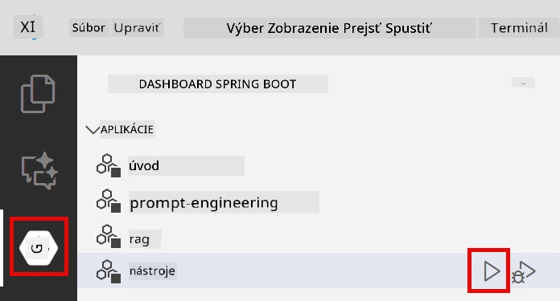
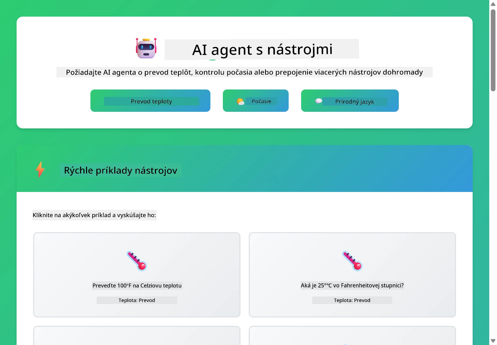
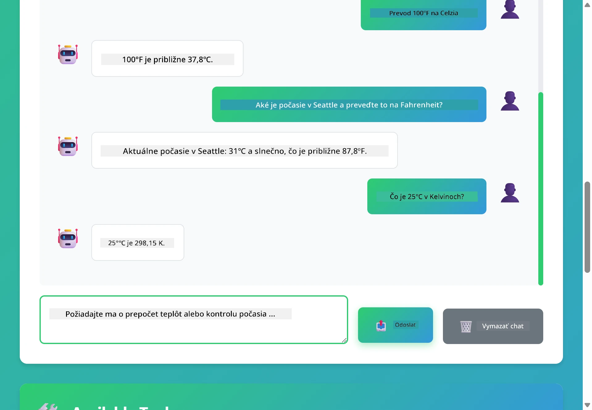

# Modul 04: AI Agenti s Nástrojmi

## Obsah

- [Video Prehľad](#video-prehľad)
- [Čo sa Naučíte](#čo-sa-naučíte)
- [Predpoklady](#predpoklady)
- [Pochopenie AI Agentov s Nástrojmi](#pochopenie-ai-agentov-s-nástrojmi)
- [Ako Funguje Volanie Nástrojov](#ako-funguje-volanie-nástrojov)
  - [Definície Nástrojov](#definície-nástrojov)
  - [Rozhodovanie](#rozhodovanie)
  - [Vykonanie](#vykonanie)
  - [Generovanie Odpovede](#generovanie-odpovede)
  - [Architektúra: Spring Boot Auto-Wiring](#architektúra-spring-boot-auto-wiring)
- [Reťazenie Nástrojov](#reťazenie-nástrojov)
- [Spustenie Aplikácie](#spustenie-aplikácie)
- [Používanie Aplikácie](#použitie-aplikácie)
  - [Vyskúšať Jednoduché Použitie Nástroja](#vyskúšajte-jednoduché-použitie-nástroja)
  - [Otestovať Reťazenie Nástrojov](#vyskúšajte-reťazenie-nástrojov)
  - [Zobraziť Tok Konverzácie](#sledujte-priebeh-rozhovoru)
  - [Experimentovať s Rôznymi Požiadavkami](#experimentujte-s-rôznymi-požiadavkami)
- [Kľúčové Koncepty](#kľúčové-koncepty)
  - [ReAct Vzor (Uvažovanie a Konanie)](#react-vzor-rozumovanie-a-konanie)
  - [Význam Popisov Nástrojov](#popisy-nástrojov-majú-význam)
  - [Správa Session](#správa-relácií)
  - [Riešenie Chýb](#spracovanie-chýb)
- [Dostupné Nástroje](#dostupné-nástroje)
- [Kedy Používať Agentov založených na Nástrojoch](#kedy-používať-agentov-s-nástrojmi)
- [Nástroje vs RAG](#nástroje-vs-rag)
- [Ďalšie Kroky](#ďalšie-kroky)

## Video Prehľad

Pozrite si túto živú reláciu, ktorá vysvetľuje, ako začať s týmto modulom:

<a href="https://www.youtube.com/watch?v=O_J30kZc0rw"></a>

## Čo sa Naučíte

Doteraz ste sa naučili viesť rozhovory s AI, efektívne štruktúrovať výzvy a zakladať odpovede na vašich dokumentoch. Ale stále je tu základné obmedzenie: jazykové modely môžu generovať len text. Nemôžu skontrolovať počasie, vykonávať výpočty, dotazovať sa databáz ani komunikovať s externými systémami.

Nástroje to menia. Tým, že modelu dávate prístup k funkciám, ktoré môže vyvolať, premieňate ho zo generátora textu na agenta, ktorý môže konať. Model rozhoduje, kedy potrebuje nástroj, ktorý nástroj použiť a aké parametre poslať. Váš kód vykoná funkciu a vráti výsledok. Model tento výsledok vloží do svojej odpovede.

## Predpoklady

- Dokončený [Modul 01 - Úvod](../01-introduction/README.md) (nasadené Azure OpenAI zdroje)
- Odporúča sa dokončiť predchádzajúce moduly (tento modul odkazuje na [RAG koncepty z Modulu 03](../03-rag/README.md) v porovnaní Nástrojov vs RAG)
- Súbor `.env` v koreňovom adresári s Azure povereniami (vytvorený pomocou `azd up` v Module 01)

> **Poznámka:** Ak ste ešte nedokončili Modul 01, najskôr postupujte podľa jeho inštrukcií na nasadenie.

## Pochopenie AI Agentov s Nástrojmi

> **📝 Poznámka:** Termín „agenti“ v tomto module sa vzťahuje na AI asistentov rozšírených o schopnosť volania nástrojov. Toto je odlišné od **Agentic AI** vzorov (autonómni agenti s plánovaním, pamäťou a viacstupňovým uvažovaním), ktoré budeme preberať v [Module 05: MCP](../05-mcp/README.md).

Bez nástrojov môže jazykový model generovať len text z daných tréningových dát. Opýtajte sa ho na aktuálne počasie a musí hádať. Dajte mu nástroje a môže zavolať API počasia, vykonať výpočty alebo dotaz do databázy — a potom tieto skutočné výsledky zahrnúť do svojej odpovede.


*Bez nástrojov model iba háda — s nástrojmi môže volať API, vykonávať výpočty a vracať dáta v reálnom čase.*

AI agent s nástrojmi nasleduje **Reasoning and Acting (ReAct)** vzor. Model nielen odpovedá — rozmýšľa o tom, čo potrebuje, koná vyvolaním nástroja, sleduje výsledok a potom rozhodne, či konať znovu, alebo doručiť konečnú odpoveď:

1. **Uvažovanie** — agent analyzuje otázku používateľa a určí, aké informácie potrebuje
2. **Konanie** — agent vyberie správny nástroj, vygeneruje správne parametre a zavolá ho
3. **Pozorovanie** — agent prijíma výstup z nástroja a hodnotí výsledok
4. **Opakovanie alebo Odpoveď** — ak je potrebných viac dát, agent sa vracia; inak zloží odpoveď v prirodzenom jazyku


*Cyklus ReAct — agent rozmýšľa, čo má robiť, koná vyvolaním nástroja, pozoruje výsledok a opakuje, kým nedoručí odpoveď.*

Toto prebieha automaticky. Definujete nástroje a ich popisy. Model sa stará o rozhodovanie, kedy a ako ich použiť.

## Ako Funguje Volanie Nástrojov

### Definície Nástrojov

[WeatherTool.java](../../../04-tools/src/main/java/com/example/langchain4j/agents/tools/WeatherTool.java) | [TemperatureTool.java](../../../04-tools/src/main/java/com/example/langchain4j/agents/tools/TemperatureTool.java)

Definujete funkcie s jasnými popismi a špecifikáciami parametrov. Model vidí tieto popisy vo svojom systémovom prompt-e a rozumie, čo každý nástroj robí.

```java
@Component
public class WeatherTool {
    
    @Tool("Get the current weather for a location")
    public String getCurrentWeather(@P("Location name") String location) {
        // Vaša logika vyhľadávania počasia
        return "Weather in " + location + ": 22°C, cloudy";
    }
}

@AiService
public interface Assistant {
    String chat(@MemoryId String sessionId, @UserMessage String message);
}

// Asistent je automaticky prepojený pomocou Spring Boot s:
// - Bean ChatModel
// - Všetky metódy @Tool z tried s @Component
// - ChatMemoryProvider pre správu relácií
```

Nižšie uvedený diagram rozoberá každú anotáciu a ukazuje, ako každý prvok pomáha AI pochopiť, kedy nástroj volať a aké argumenty odovzdať:


*Anatómia definície nástroja — @Tool hovorí AI, kedy ho používať, @P popisuje každý parameter a @AiService spája všetko dohromady pri štarte.*

> **🤖 Vyskúšajte s [GitHub Copilot](https://github.com/features/copilot) Chat:** Otvorte [`WeatherTool.java`](../../../04-tools/src/main/java/com/example/langchain4j/agents/tools/WeatherTool.java) a spýtajte sa:
> - "Ako by som integroval reálne API počasia ako OpenWeatherMap namiesto simulovaných dát?"
> - "Čo robí dobrý popis nástroja, ktorý pomáha AI správne ho používať?"
> - "Ako riešiť chyby API a limity volaní v implementáciách nástrojov?"

### Rozhodovanie

Keď sa používateľ opýta "Aké je počasie v Seattli?", model nevyberá náhodne nástroj. Porovnáva zámer používateľa s každým popisom dostupných nástrojov, hodnotí ich relevantnosť a vyberie najvhodnejší. Potom vygeneruje štruktúrovaný funkčný hovor s správnymi parametrami — v tomto prípade nastaví `location` na `"Seattle"`.

Ak žiadny nástroj nezodpovedá požiadavke používateľa, model odpovedá zo svojich vlastných znalostí. Ak zodpovedá viacero nástrojov, vyberie ten najšpecifickejší.


*Model hodnotí každý dostupný nástroj voči zámeru používateľa a vyberá najlepší zhodu — preto je dôležité písať jasné a konkrétne popisy nástrojov.*

### Vykonanie

[AgentService.java](../../../04-tools/src/main/java/com/example/langchain4j/agents/service/AgentService.java)

Spring Boot automaticky prepája deklaratívne `@AiService` rozhranie so všetkými registrovanými nástrojmi a LangChain4j volania nástrojov vykonáva automaticky. V pozadí prebieha kompletný tok volania nástroja cez šesť fáz — od používateľovej otázky v prirodzenom jazyku až po odpoveď taktiež v prirodzenom jazyku:


*Kompletný tok — používateľ položí otázku, model vyberie nástroj, LangChain4j ho vykoná a model vloží výsledok do odpovede.*

V pozadí `AiServices` spúšťa rovnaký cyklus volania nástroja pre ktorýkoľvek nástroj — tu demonštrované jednoduchým `Calculator`. Nasledujúci sekvenčný diagram presne ukazuje, čo sa deje pod kapotou:


*Cyklus volania nástroja — `AiServices` posiela vašu správu a schémy nástrojov LLM, LLM odpovedá funkčným volaním ako `add(42, 58)`, LangChain4j lokálne vykoná metódu `Calculator` a výsledok vráti pre konečnú odpoveď.*

> **🤖 Vyskúšajte s [GitHub Copilot](https://github.com/features/copilot) Chat:** Otvorte [`AgentService.java`](../../../04-tools/src/main/java/com/example/langchain4j/agents/service/AgentService.java) a spýtajte sa:
> - "Ako funguje ReAct vzor a prečo je efektívny pre AI agentov?"
> - "Ako agent rozhoduje, ktorý nástroj použiť a v akom poradí?"
> - "Čo sa stane, keď volanie nástroja zlyhá - ako mám robustne riešiť chyby?"

### Generovanie Odpovede

Model prijme dáta o počasí a formátuje ich do prirodzenej jazykovej odpovede používateľovi.

### Architektúra: Spring Boot Auto-Wiring

Tento modul používa Spring Boot integráciu LangChain4j s deklaratívnymi `@AiService` rozhraniami. Pri štarte Spring Boot objaví každý `@Component` obsahujúci metódy označené `@Tool`, váš `ChatModel` bean a `ChatMemoryProvider` — a všetko to zviaže do jedného rozhrania `Assistant` bez potreby boilerplatu.


*Rozhranie @AiService spája ChatModel, komponenty nástrojov a poskytovateľa pamäte — Spring Boot zaistí automatické zapojenie všetkého.*

Tu je celý životný cyklus požiadavky zobrazený sekvenčným diagramom — od HTTP požiadavky cez kontrolér, službu a automaticky zapojený proxy, až po vykonanie nástroja a návrat:


*Kompletný životný cyklus požiadavky Spring Boot — HTTP požiadavka prechádza kontrolérom a službou k proxy Assistanta, ktorý automaticky orchestruje LLM a volania nástrojov.*

Hlavné výhody tohto prístupu:

- **Spring Boot auto-wiring** — ChatModel a nástroje sa automaticky vkladajú
- **@MemoryId vzor** — Automatická správa pamäte na základe session
- **Jedna inštancia** — Assistant vytvorený raz a opakovane používaný pre lepší výkon
- **Bezpečné vykonávanie podľa typu** — Java metódy sú volané priamo s konverziou typov
- **Orchestrácia viacerých krokov** — Automaticky rieši reťazenie nástrojov 
- **Žiadny boilerplate** — Nie je potrebné manuálne volanie `AiServices.builder()` alebo použitie pamäťového HashMap

Alternatívne prístupy (ručné `AiServices.builder()`) vyžadujú viac kódu a nevyužívajú výhody integrácie Spring Boot.

## Reťazenie Nástrojov

**Reťazenie Nástrojov** — Skutočná sila agentov založených na nástrojoch sa prejaví, keď jedna otázka vyžaduje použitie viacerých nástrojov. Spýtajte sa "Aké je počasie v Seattli vo Fahrenheitoch?" a agent automaticky spojí dva nástroje: najskôr zavolá `getCurrentWeather` pre teplotu v Celziách, potom túto hodnotu prenechá nástroju `celsiusToFahrenheit` na konverziu — všetko v jednom kole konverzácie.


*Reťazenie nástrojov v praxi — agent najskôr zavolá getCurrentWeather, potom výsledok v Celziách pošle do celsiusToFahrenheit a doručí kombinovanú odpoveď.*

**Elegantné zlyhania** — Opýtajte sa na počasie v meste, ktoré nie je v simulovaných dátach. Nástroj vráti chybovú správu a AI vysvetlí, že nemôže pomôcť, namiesto toho, aby došlo k pádu aplikácie. Nástroje zlyhávajú bezpečne. Nasledujúci diagram kontrastuje oba prístupy — s riadnym spracovaním chyby agent zachytí výnimku a odpovie nápomocne, bez neho by celá aplikácia spadla:


*Keď nástroj zlyhá, agent zachytí chybu a odpovie s užitočným vysvetlením namiesto pádu.*

To všetko sa deje v jednom kole konverzácie. Agent sám orchestruje viaceré volania nástrojov.

## Spustenie Aplikácie

**Overte nasadenie:**

Uistite sa, že súbor `.env` existuje v koreňovom adresári s Azure povereniami (vytvorený počas Modulu 01). Spustite to z adresára modulu (`04-tools/`):

**Bash:**
```bash
cat ../.env  # Malo by zobraziť AZURE_OPENAI_ENDPOINT, API_KEY, DEPLOYMENT
```

**PowerShell:**
```powershell
Get-Content ..\.env  # Malo by zobraziť AZURE_OPENAI_ENDPOINT, API_KEY, DEPLOYMENT
```

**Spustite aplikáciu:**

> **Poznámka:** Ak ste už spustili všetky aplikácie pomocou `./start-all.sh` z koreňového adresára (ako popísané v Module 01), tento modul už beží na porte 8084. Môžete preskočiť príkazy na spustenie a ísť priamo na http://localhost:8084.

**Možnosť 1: Použitie Spring Boot Dashboard (odporúčané pre používateľov VS Code)**

Vývojársky kontajner obsahuje rozšírenie Spring Boot Dashboard, ktoré poskytuje vizuálne rozhranie na správu všetkých Spring Boot aplikácií. Nájdete ho v Activity Bar na ľavej strane VS Code (ikona Spring Boot).

Zo Spring Boot Dashboard môžete:
- Vidieť všetky dostupné Spring Boot aplikácie v pracovnom priestore
- Jedným kliknutím spustiť/zastaviť aplikácie
- Prezerať logy aplikácie v reálnom čase
- Monitorovať stav aplikácií

Stačí kliknúť na tlačidlo play vedľa "tools" pre spustenie tohto modulu alebo spustiť všetky moduly naraz.

Takto vyzerá Spring Boot Dashboard vo VS Code:


*Spring Boot Dashboard vo VS Code — spustite, zastavte a sledujte všetky moduly z jedného miesta*

**Možnosť 2: Použitie shell skriptov**

Spustite všetky webové aplikácie (moduly 01-04):

**Bash:**
```bash
cd ..  # Z koreňového adresára
./start-all.sh
```

**PowerShell:**
```powershell
cd ..  # Z koreňového adresára
.\start-all.ps1
```

Alebo spustite len tento modul:

**Bash:**
```bash
cd 04-tools
./start.sh
```

**PowerShell:**
```powershell
cd 04-tools
.\start.ps1
```

Oba skripty automaticky načítajú premenné prostredia zo súboru `.env` v koreňovom priečinku a zkompilujú JAR súbory, ak ešte neexistujú.

> **Poznámka:** Ak uprednostňujete manuálnu kompiláciu všetkých modulov pred spustením:
>
> **Bash:**
> ```bash
> cd ..  # Go to root directory
> mvn clean package -DskipTests
> ```
>
> **PowerShell:**
> ```powershell
> cd ..  # Go to root directory
> mvn clean package -DskipTests
> ```

Otvorte v prehliadači http://localhost:8084.

**Na zastavenie:**

**Bash:**
```bash
./stop.sh  # Len tento modul
# Alebo
cd .. && ./stop-all.sh  # Všetky moduly
```

**PowerShell:**
```powershell
.\stop.ps1  # Iba tento modul
# Alebo
cd ..; .\stop-all.ps1  # Všetky moduly
```

## Použitie aplikácie

Aplikácia poskytuje webové rozhranie, kde môžete komunikovať s AI agentom, ktorý má prístup k nástrojom na počasie a prevod teplôt. Takto vyzerá rozhranie — obsahuje rýchle príklady a chatovací panel na odosielanie požiadaviek:

<a href="images/tools-homepage.png"></a>

*Rozhranie nástrojov AI agenta - rýchle príklady a chatovací panel na interakciu s nástrojmi*

### Vyskúšajte jednoduché použitie nástroja

Začnite jednoduchou požiadavkou: „Preveď 100 stupňov Fahrenheita na Celziove.“ Agent rozpozná, že potrebuje nástroj na prevod teplôt, vyvolá ho s príslušnými parametrami a vráti výsledok. Všimnite si, aké to pôsobí prirodzene – nezadávali ste, ktorý nástroj použiť ani ako ho volať.

### Vyskúšajte reťazenie nástrojov

Teraz skúste niečo zložitejšie: „Aké je počasie v Seattli a preveď to na Fahrenheit?“ Sledujte, ako agent pracuje v krokoch. Najprv získa počasie (ktoré vracia v Celziovi), rozpozná, že musí previesť na Fahrenheit, zavolá nástroj na prevod a oba výsledky skombinuje do jednej odpovede.

### Sledujte priebeh rozhovoru

Chatovací panel uchováva históriu rozhovoru, čo umožňuje viackolové interakcie. Vidíte všetky predchádzajúce dopyty a odpovede, čo uľahčuje sledovať konverzáciu a chápať, ako agent buduje kontext počas viacerých výmen.

<a href="images/tools-conversation-demo.png"></a>

*Viackolový rozhovor ukazujúci jednoduché prevody, vyhľadávanie počasia a reťazenie nástrojov*

### Experimentujte s rôznymi požiadavkami

Vyskúšajte rôzne kombinácie:
- Vyhľadávanie počasia: „Aké je počasie v Tokiu?“
- Prevod teplôt: „Koľko je 25 °C v Kelvinoch?“
- Zložité dotazy: „Skontroluj počasie v Paríži a povedz, či je nad 20 °C“

Všímajte si, ako agent interpretuje prirodzený jazyk a mapuje ho na správne volania nástrojov.

## Kľúčové koncepty

### ReAct vzor (Rozumovanie a konanie)

Agent strieda rozumovanie (rozhodovanie, čo robiť) a konanie (použitie nástrojov). Tento vzor umožňuje autonómne riešenie problémov namiesto jednoduchého reagovania na inštrukcie.

### Popisy nástrojov majú význam

Kvalita popisov vašich nástrojov priamo ovplyvňuje, ako dobre ich agent využíva. Jasné, špecifické popisy pomáhajú modelu pochopiť, kedy a ako nástroj volať.

### Správa relácií

Anotácia `@MemoryId` umožňuje automatickú správu pamäte založenú na relácii. Každé ID relácie má svoju vlastnú inštanciu `ChatMemory` spravovanú beanom `ChatMemoryProvider`, takže viacerí používatelia môžu komunikovať s agentom súčasne bez zamieňania konverzácií. Nasledujúci diagram ukazuje, ako sú viacerí používatelia smerovaní do izolovaných úložísk pamäte na základe ID relácií:


*Každé ID relácie má samostatnú históriu rozhovoru — používatelia nikdy nevidia správy iných.*

### Spracovanie chýb

Nástroje môžu zlyhať — API môžu vypršať, parametre môžu byť neplatné, externé služby môžu byť nedostupné. Produkčné agenti potrebujú spracovanie chýb, aby model mohol vysvetliť problémy alebo skúsiť alternatívy namiesto toho, aby celá aplikácia zlyhala. Keď nástroj vyhodí výnimku, LangChain4j ju zachytí a pošle späť modelu ako chybu, ktorú model môže vysvetliť prirodzeným jazykom.

## Dostupné nástroje

Diagram nižšie ukazuje širokú ekosystém nástrojov, ktoré môžete vytvárať. Tento modul demonštruje nástroje pre počasie a teplotu, ale rovnaký vzor `@Tool` funguje pre akúkoľvek Java metódu — od dotazov do databázy po spracovanie platieb.


*Každá Java metóda anotovaná `@Tool` sa sprístupní AI — vzor sa rozširuje na databázy, API, emaily, súborové operácie a ďalšie.*

## Kedy používať agentov s nástrojmi

Nie každý dopyt potrebuje nástroje. Rozhodnutie závisí od toho, či AI potrebuje komunikovať s externými systémami alebo môže odpovedať z vlastných znalostí. Nasledujúci návod zhrňuje, kedy nástroje pridávajú hodnotu a kedy nie sú potrebné:


*Rýchly rozhodovací sprievodca — nástroje slúžia na aktuálne dáta, výpočty a akcie; všeobecné znalosti a tvorivé úlohy ich nevyžadujú.*

## Nástroje vs RAG

Moduly 03 a 04 rozširujú schopnosti AI, ale zásadne rôznymi spôsobmi. RAG poskytuje modelu prístup k **poznatkom** vyhľadávaním dokumentov. Nástroje dávajú modelu schopnosť vykonávať **akcie** volaním funkcií. Nasledujúci diagram porovnáva tieto dva prístupy bok po boku — od spôsobu fungovania po kompromisy medzi nimi:


*RAG získava informácie zo statických dokumentov — Nástroje vykonávajú akcie a sťahujú dynamické, aktuálne údaje. Mnoho produkčných systémov kombinuje oba prístupy.*

V praxi mnohé produkčné systémy kombinujú obidva prístupy: RAG pre zakotvenie odpovedí vo vašej dokumentácii a Nástroje pre získavanie živých údajov alebo vykonávanie operácií.

## Ďalšie kroky

**Ďalší modul:** [05-mcp - Model Context Protocol (MCP)](../05-mcp/README.md)

---

**Navigácia:** [← Predchádzajúci: Modul 03 - RAG](../03-rag/README.md) | [Späť na hlavnú stránku](../README.md) | [Ďalší: Modul 05 - MCP →](../05-mcp/README.md)

---

<!-- CO-OP TRANSLATOR DISCLAIMER START -->
**Vyhlásenie o zodpovednosti**:
Tento dokument bol preložený pomocou AI prekladateľskej služby [Co-op Translator](https://github.com/Azure/co-op-translator). Hoci sa snažíme o presnosť, vezmite prosím na vedomie, že automatické preklady môžu obsahovať chyby alebo nepresnosti. Pôvodný dokument v jeho natívnom jazyku by mal byť považovaný za autoritatívny zdroj. Pre kritické informácie sa odporúča profesionálny ľudský preklad. Nie sme zodpovední za žiadne nedorozumenia alebo nesprávne interpretácie vyplývajúce z použitia tohto prekladu.
<!-- CO-OP TRANSLATOR DISCLAIMER END -->