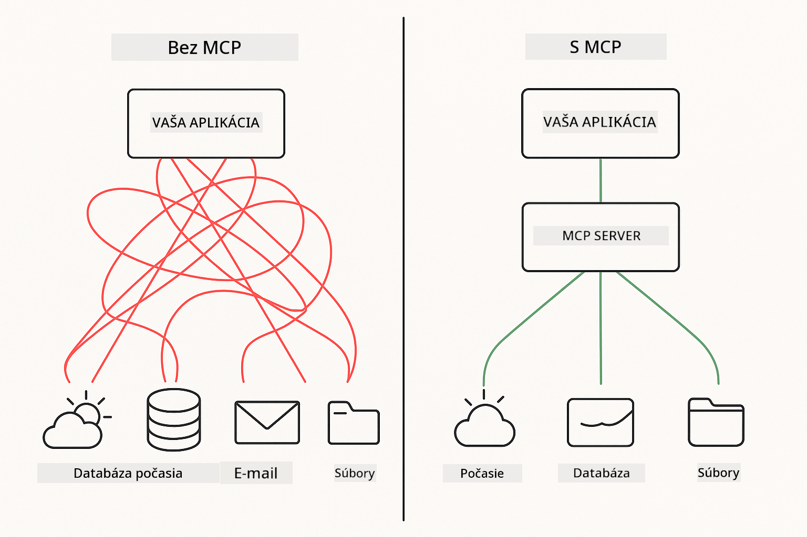
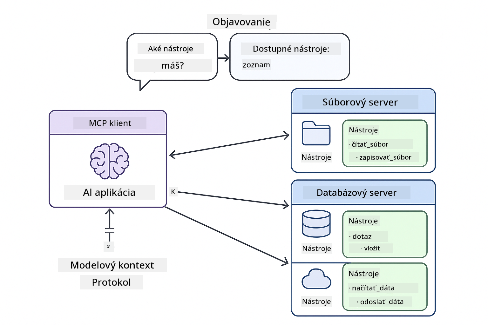

<!--
CO_OP_TRANSLATOR_METADATA:
{
  "original_hash": "c25ec1f10ef156c53e190cdf8b0711ab",
  "translation_date": "2025-12-13T18:04:14+00:00",
  "source_file": "05-mcp/README.md",
  "language_code": "sk"
}
-->
# Modul 05: Protokol kontextu modelu (MCP)

## Obsah

- [Čo sa naučíte](../../../05-mcp)
- [Pochopenie MCP](../../../05-mcp)
- [Ako MCP funguje](../../../05-mcp)
  - [Architektúra server-klient](../../../05-mcp)
  - [Objavovanie nástrojov](../../../05-mcp)
  - [Prenosové mechanizmy](../../../05-mcp)
- [Predpoklady](../../../05-mcp)
- [Čo tento modul pokrýva](../../../05-mcp)
- [Rýchly štart](../../../05-mcp)
  - [Príklad 1: Vzdialená kalkulačka (Streamable HTTP)](../../../05-mcp)
  - [Príklad 2: Operácie so súbormi (Stdio)](../../../05-mcp)
  - [Príklad 3: Git analýza (Docker)](../../../05-mcp)
- [Kľúčové koncepty](../../../05-mcp)
  - [Výber prenosu](../../../05-mcp)
  - [Objavovanie nástrojov](../../../05-mcp)
  - [Správa relácií](../../../05-mcp)
  - [Medzi-platformové úvahy](../../../05-mcp)
- [Kedy použiť MCP](../../../05-mcp)
- [Ekosystém MCP](../../../05-mcp)
- [Gratulujeme!](../../../05-mcp)
  - [Čo ďalej?](../../../05-mcp)
- [Riešenie problémov](../../../05-mcp)

## Čo sa naučíte

Vybudovali ste konverzačné AI, ovládli ste promptovanie, zakotvili odpovede v dokumentoch a vytvorili agentov s nástrojmi. Ale všetky tie nástroje boli špeciálne vytvorené pre vašu konkrétnu aplikáciu. Čo keby ste mohli dať svojej AI prístup k štandardizovanému ekosystému nástrojov, ktoré môže ktokoľvek vytvoriť a zdieľať?

Protokol kontextu modelu (MCP) poskytuje presne to - štandardný spôsob, ako môžu AI aplikácie objavovať a používať externé nástroje. Namiesto písania vlastných integrácií pre každý zdroj dát alebo službu sa pripojíte k MCP serverom, ktoré vystavujú svoje schopnosti v konzistentnom formáte. Váš AI agent potom môže tieto nástroje automaticky objaviť a používať.



*Pred MCP: Zložité bodové integrácie. Po MCP: Jeden protokol, nekonečné možnosti.*

## Pochopenie MCP

MCP rieši základný problém vo vývoji AI: každá integrácia je vlastná. Chcete pristupovať k GitHubu? Vlastný kód. Chcete čítať súbory? Vlastný kód. Chcete dotazovať databázu? Vlastný kód. A žiadna z týchto integrácií nefunguje s inými AI aplikáciami.

MCP to štandardizuje. MCP server vystavuje nástroje s jasnými popismi a schémami. Akýkoľvek MCP klient sa môže pripojiť, objaviť dostupné nástroje a používať ich. Postav raz, používaj všade.



*Architektúra protokolu kontextu modelu - štandardizované objavovanie a vykonávanie nástrojov*

## Ako MCP funguje

**Architektúra server-klient**

MCP používa model klient-server. Servery poskytujú nástroje - čítanie súborov, dotazovanie databáz, volanie API. Klienti (vaša AI aplikácia) sa pripájajú k serverom a používajú ich nástroje.

**Objavovanie nástrojov**

Keď sa váš klient pripojí k MCP serveru, pýta sa: „Aké nástroje máte?“ Server odpovie zoznamom dostupných nástrojov, každý s popismi a schémami parametrov. Váš AI agent potom môže rozhodnúť, ktoré nástroje použiť na základe požiadaviek používateľa.

**Prenosové mechanizmy**

MCP definuje dva prenosové mechanizmy: HTTP pre vzdialené servery, Stdio pre lokálne procesy (vrátane Docker kontajnerov):


*Prenosové mechanizmy MCP: HTTP pre vzdialené servery, Stdio pre lokálne procesy (vrátane Docker kontajnerov)*

**Streamable HTTP** - [StreamableHttpDemo.java](../../../05-mcp/src/main/java/com/example/langchain4j/mcp/StreamableHttpDemo.java)

Pre vzdialené servery. Vaša aplikácia robí HTTP požiadavky na server bežiaci niekde v sieti. Používa Server-Sent Events pre komunikáciu v reálnom čase.

```java
McpTransport httpTransport = new StreamableHttpMcpTransport.Builder()
    .url("http://localhost:3001/mcp")
    .timeout(Duration.ofSeconds(60))
    .logRequests(true)
    .logResponses(true)
    .build();
```

> **🤖 Vyskúšajte s [GitHub Copilot](https://github.com/features/copilot) Chat:** Otvorte [`StreamableHttpDemo.java`](../../../05-mcp/src/main/java/com/example/langchain4j/mcp/StreamableHttpDemo.java) a opýtajte sa:
> - "Ako sa MCP líši od priamej integrácie nástrojov ako v Module 04?"
> - "Aké sú výhody použitia MCP pre zdieľanie nástrojov medzi aplikáciami?"
> - "Ako riešim zlyhania pripojenia alebo časové limity na MCP servery?"

**Stdio** - [StdioTransportDemo.java](../../../05-mcp/src/main/java/com/example/langchain4j/mcp/StdioTransportDemo.java)

Pre lokálne procesy. Vaša aplikácia spustí server ako podproces a komunikuje cez štandardný vstup/výstup. Užitočné pre prístup k súborovému systému alebo príkazové nástroje.

```java
McpTransport stdioTransport = new StdioMcpTransport.Builder()
    .command(List.of(
        npmCmd, "exec",
        "@modelcontextprotocol/server-filesystem@0.6.2",
        resourcesDir
    ))
    .logEvents(false)
    .build();
```

> **🤖 Vyskúšajte s [GitHub Copilot](https://github.com/features/copilot) Chat:** Otvorte [`StdioTransportDemo.java`](../../../05-mcp/src/main/java/com/example/langchain4j/mcp/StdioTransportDemo.java) a opýtajte sa:
> - "Ako funguje Stdio prenos a kedy ho použiť namiesto HTTP?"
> - "Ako LangChain4j spravuje životný cyklus spustených MCP serverových procesov?"
> - "Aké sú bezpečnostné dôsledky poskytnutia AI prístupu k súborovému systému?"

**Docker (používa Stdio)** - [GitRepositoryAnalyzer.java](../../../05-mcp/src/main/java/com/example/langchain4j/mcp/GitRepositoryAnalyzer.java)

Pre kontajnerizované služby. Používa stdio prenos na komunikáciu s Docker kontajnerom cez `docker run`. Vhodné pre zložité závislosti alebo izolované prostredia.

```java
McpTransport dockerTransport = new StdioMcpTransport.Builder()
    .command(List.of(
        "docker", "run",
        "-e", "GITHUB_PERSONAL_ACCESS_TOKEN=" + System.getenv("GITHUB_TOKEN"),
        "-v", volumeMapping,
        "-i", "mcp/git"
    ))
    .logEvents(true)
    .build();
```

> **🤖 Vyskúšajte s [GitHub Copilot](https://github.com/features/copilot) Chat:** Otvorte [`GitRepositoryAnalyzer.java`](../../../05-mcp/src/main/java/com/example/langchain4j/mcp/GitRepositoryAnalyzer.java) a opýtajte sa:
> - "Ako Docker prenos izoluje MCP servery a aké sú výhody?"
> - "Ako nakonfigurovať pripojenie zväzkov na zdieľanie dát medzi hostiteľom a MCP kontajnermi?"
> - "Aké sú najlepšie postupy pre správu životného cyklu MCP serverov založených na Dockeri v produkcii?"

## Spustenie príkladov

### Predpoklady

- Java 21+, Maven 3.9+
- Node.js 16+ a npm (pre MCP servery)
- **Docker Desktop** - musí byť **SPUSTENÝ** pre Príklad 3 (nie len nainštalovaný)
- GitHub osobný prístupový token nakonfigurovaný v súbore `.env` (z Modulu 00)

> **Poznámka:** Ak ste ešte nenastavili svoj GitHub token, pozrite si [Modul 00 - Rýchly štart](../00-quick-start/README.md) pre inštrukcie.

> **⚠️ Používatelia Dockeru:** Pred spustením Príkladu 3 overte, že Docker Desktop beží príkazom `docker ps`. Ak vidíte chyby pripojenia, spustite Docker Desktop a počkajte približne 30 sekúnd na inicializáciu.

## Rýchly štart

**Použitie VS Code:** Jednoducho kliknite pravým tlačidlom na ľubovoľný demo súbor v Prieskumníkovi a vyberte **"Run Java"**, alebo použite spúšťacie konfigurácie z panela Run and Debug (najskôr si pridajte token do súboru `.env`).

**Použitie Maven:** Alternatívne môžete spustiť z príkazového riadku pomocou príkladov nižšie.

**⚠️ Dôležité:** Niektoré príklady majú predpoklady (ako spustenie MCP servera alebo zostavenie Docker obrazov). Skontrolujte požiadavky každého príkladu pred spustením.

### Príklad 1: Vzdialená kalkulačka (Streamable HTTP)

Tento príklad demonštruje integráciu nástrojov cez sieť.

**⚠️ Predpoklad:** Najskôr musíte spustiť MCP server (pozrite Terminál 1 nižšie).

**Terminál 1 - Spustenie MCP servera:**

**Bash:**
```bash
git clone https://github.com/modelcontextprotocol/servers.git
cd servers/src/everything
npm install
node dist/streamableHttp.js
```

**PowerShell:**
```powershell
git clone https://github.com/modelcontextprotocol/servers.git
cd servers/src/everything
npm install
node dist/streamableHttp.js
```

**Terminál 2 - Spustenie príkladu:**

**Použitie VS Code:** Kliknite pravým tlačidlom na `StreamableHttpDemo.java` a vyberte **"Run Java"**.

**Použitie Maven:**

**Bash:**
```bash
export GITHUB_TOKEN=your_token_here
cd 05-mcp
mvn compile exec:java -Dexec.mainClass=com.example.langchain4j.mcp.StreamableHttpDemo
```

**PowerShell:**
```powershell
$env:GITHUB_TOKEN=your_token_here
cd 05-mcp
mvn --% compile exec:java -Dexec.mainClass=com.example.langchain4j.mcp.StreamableHttpDemo
```

Sledujte, ako agent objaví dostupné nástroje a potom použije kalkulačku na vykonanie sčítania.

### Príklad 2: Operácie so súbormi (Stdio)

Tento príklad demonštruje nástroje založené na lokálnych podprocesoch.

**✅ Nie sú potrebné žiadne predpoklady** - MCP server sa spustí automaticky.

**Použitie VS Code:** Kliknite pravým tlačidlom na `StdioTransportDemo.java` a vyberte **"Run Java"**.

**Použitie Maven:**

**Bash:**
```bash
export GITHUB_TOKEN=your_token_here
cd 05-mcp
mvn compile exec:java -Dexec.mainClass=com.example.langchain4j.mcp.StdioTransportDemo
```

**PowerShell:**
```powershell
$env:GITHUB_TOKEN=your_token_here
cd 05-mcp
mvn --% compile exec:java -Dexec.mainClass=com.example.langchain4j.mcp.StdioTransportDemo
```

Aplikácia automaticky spustí MCP server pre súborový systém a prečíta lokálny súbor. Všimnite si, ako je správa podprocesov zaistená za vás.

**Očakávaný výstup:**
```
Assistant response: The content of the file is "Kaboom!".
```

### Príklad 3: Git analýza (Docker)

Tento príklad demonštruje kontajnerizované servery nástrojov.

**⚠️ Predpoklady:** 
1. **Docker Desktop musí byť SPUSTENÝ** (nie len nainštalovaný)
2. **Používatelia Windows:** Odporúča sa režim WSL 2 (Nastavenia Docker Desktop → Všeobecné → "Použiť engine založený na WSL 2"). Režim Hyper-V vyžaduje manuálnu konfiguráciu zdieľania súborov.
3. Najskôr musíte zostaviť Docker obraz (pozrite Terminál 1 nižšie)

**Overenie, že Docker beží:**

**Bash:**
```bash
docker ps  # Malo by zobraziť zoznam kontajnerov, nie chybu
```

**PowerShell:**
```powershell
docker ps  # Malo by zobraziť zoznam kontajnerov, nie chybu
```

Ak vidíte chybu ako "Cannot connect to Docker daemon" alebo "The system cannot find the file specified", spustite Docker Desktop a počkajte na inicializáciu (~30 sekúnd).

**Riešenie problémov:**
- Ak AI hlási prázdny repozitár alebo žiadne súbory, pripojenie zväzku (`-v`) nefunguje.
- **Používatelia Windows Hyper-V:** Pridajte adresár projektu do Nastavení Docker Desktop → Zdroje → Zdieľanie súborov a potom reštartujte Docker Desktop.
- **Odporúčané riešenie:** Prepnite na režim WSL 2 pre automatické zdieľanie súborov (Nastavenia → Všeobecné → povoliť "Použiť engine založený na WSL 2").

**Terminál 1 - Zostavenie Docker obrazu:**

**Bash:**
```bash
cd servers/src/git
docker build -t mcp/git .
```

**PowerShell:**
```powershell
cd servers/src/git
docker build -t mcp/git .
```

**Terminál 2 - Spustenie analyzátora:**

**Použitie VS Code:** Kliknite pravým tlačidlom na `GitRepositoryAnalyzer.java` a vyberte **"Run Java"**.

**Použitie Maven:**

**Bash:**
```bash
export GITHUB_TOKEN=your_token_here
cd 05-mcp
mvn compile exec:java -Dexec.mainClass=com.example.langchain4j.mcp.GitRepositoryAnalyzer
```

**PowerShell:**
```powershell
$env:GITHUB_TOKEN=your_token_here
cd 05-mcp
mvn --% compile exec:java -Dexec.mainClass=com.example.langchain4j.mcp.GitRepositoryAnalyzer
```

Aplikácia spustí Docker kontajner, pripojí váš repozitár a analyzuje štruktúru a obsah repozitára cez AI agenta.

## Kľúčové koncepty

**Výber prenosu**

Vyberte podľa toho, kde sa vaše nástroje nachádzajú:
- Vzdialené služby → Streamable HTTP
- Lokálny súborový systém → Stdio
- Zložité závislosti → Docker

**Objavovanie nástrojov**

MCP klienti automaticky objavujú dostupné nástroje pri pripájaní. Váš AI agent vidí popisy nástrojov a rozhoduje, ktoré použiť podľa požiadavky používateľa.

**Správa relácií**

Streamable HTTP prenos udržiava relácie, čo umožňuje stavové interakcie s vzdialenými servermi. Prenosy Stdio a Docker sú zvyčajne bezstavové.

**Medzi-platformové úvahy**

Príklady automaticky riešia rozdiely medzi platformami (rozdiely v príkazoch Windows vs Unix, konverzie ciest pre Docker). To je dôležité pre produkčné nasadenia v rôznych prostrediach.

## Kedy použiť MCP

**Použite MCP, keď:**
- Chcete využiť existujúce ekosystémy nástrojov
- Budujete nástroje, ktoré budú používať viaceré aplikácie
- Integrujete služby tretích strán so štandardnými protokolmi
- Potrebujete meniť implementácie nástrojov bez zmeny kódu

**Použite vlastné nástroje (Modul 04), keď:**
- Budujete funkčnosť špecifickú pre aplikáciu
- Výkon je kritický (MCP pridáva režijné náklady)
- Vaše nástroje sú jednoduché a nebudú znovu použité
- Potrebujete úplnú kontrolu nad vykonávaním

## Ekosystém MCP

Protokol kontextu modelu je otvorený štandard s rastúcim ekosystémom:

- Oficiálne MCP servery pre bežné úlohy (súborový systém, Git, databázy)
- Servery prispievané komunitou pre rôzne služby
- Štandardizované popisy a schémy nástrojov
- Kompatibilita medzi rámcami (funguje s akýmkoľvek MCP klientom)

Táto štandardizácia znamená, že nástroje vytvorené pre jednu AI aplikáciu fungujú aj s inými, čím vzniká zdieľaný ekosystém schopností.

## Gratulujeme!

Dokončili ste kurz LangChain4j pre začiatočníkov. Naučili ste sa:

- Ako vytvoriť konverzačné AI s pamäťou (Modul 01)
- Vzory promptovania pre rôzne úlohy (Modul 02)
- Zakotvenie odpovedí vo vašich dokumentoch pomocou RAG (Modul 03)
- Vytváranie AI agentov s vlastnými nástrojmi (Modul 04)
- Integráciu štandardizovaných nástrojov cez MCP (Modul 05)

Máte teraz základy na tvorbu produkčných AI aplikácií. Koncepty, ktoré ste sa naučili, platia bez ohľadu na konkrétne rámce alebo modely - sú to základné vzory v AI inžinierstve.

### Čo ďalej?

Po dokončení modulov preskúmajte [Testovací sprievodca](../docs/TESTING.md), aby ste videli koncepty testovania LangChain4j v praxi.

**Oficiálne zdroje:**
- [Dokumentácia LangChain4j](https://docs.langchain4j.dev/) - Komplexné návody a API referencie
- [LangChain4j GitHub](https://github.com/langchain4j/langchain4j) - Zdrojový kód a príklady
- [LangChain4j Tutoriály](https://docs.langchain4j.dev/tutorials/) - Krok za krokom návody pre rôzne použitia

Ďakujeme, že ste dokončili tento kurz!

---

**Navigácia:** [← Predchádzajúci: Modul 04 - Nástroje](../04-tools/README.md) | [Späť na hlavnú stránku](../README.md)

---

## Riešenie problémov

### Syntax príkazu Maven v PowerShelli
**Problém**: Príkazy Maven zlyhávajú s chybou `Unknown lifecycle phase ".mainClass=..."`

**Príčina**: PowerShell interpretuje `=` ako operátor priradenia premennej, čo narušuje syntax vlastností Maven

**Riešenie**: Použite operátor zastavenia parsovania `--%` pred príkazom Maven:

**PowerShell:**
```powershell
mvn --% compile exec:java -Dexec.mainClass=com.example.langchain4j.mcp.StreamableHttpDemo
```

**Bash:**
```bash
mvn compile exec:java -Dexec.mainClass=com.example.langchain4j.mcp.StreamableHttpDemo
```

Operátor `--%` hovorí PowerShellu, aby všetky nasledujúce argumenty odovzdal Maven doslovne bez interpretácie.

### Problémy s pripojením Dockeru

**Problém**: Príkazy Docker zlyhávajú s hlásením "Cannot connect to Docker daemon" alebo "The system cannot find the file specified"

**Príčina**: Docker Desktop nie je spustený alebo nie je úplne inicializovaný

**Riešenie**: 
1. Spustite Docker Desktop
2. Počkajte približne 30 sekúnd na úplnú inicializáciu
3. Overte príkazom `docker ps` (mal by zobraziť zoznam kontajnerov, nie chybu)
4. Potom spustite svoj príklad

### Pripájanie zväzkov Docker vo Windows

**Problém**: Analyzátor Git repozitára hlási prázdny repozitár alebo žiadne súbory

**Príčina**: Pripojenie zväzku (`-v`) nefunguje kvôli konfigurácii zdieľania súborov

**Riešenie**:
- **Odporúčané:** Prepnite na režim WSL 2 (Nastavenia Docker Desktop → Všeobecné → "Use the WSL 2 based engine")
- **Alternatíva (Hyper-V):** Pridajte adresár projektu do Nastavení Docker Desktop → Zdroje → Zdieľanie súborov, potom reštartujte Docker Desktop

---

<!-- CO-OP TRANSLATOR DISCLAIMER START -->
**Zrieknutie sa zodpovednosti**:
Tento dokument bol preložený pomocou AI prekladateľskej služby [Co-op Translator](https://github.com/Azure/co-op-translator). Aj keď sa snažíme o presnosť, prosím, majte na pamäti, že automatizované preklady môžu obsahovať chyby alebo nepresnosti. Originálny dokument v jeho pôvodnom jazyku by mal byť považovaný za autoritatívny zdroj. Pre kritické informácie sa odporúča profesionálny ľudský preklad. Nie sme zodpovední za akékoľvek nedorozumenia alebo nesprávne interpretácie vyplývajúce z použitia tohto prekladu.
<!-- CO-OP TRANSLATOR DISCLAIMER END -->