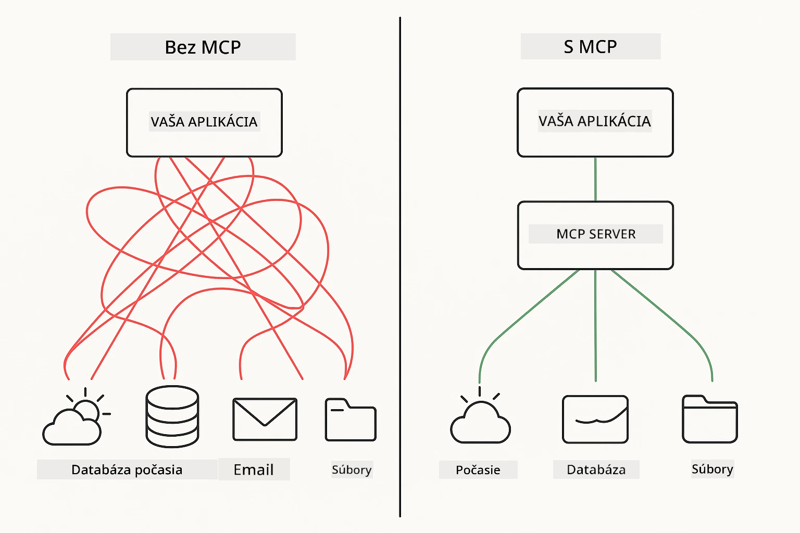
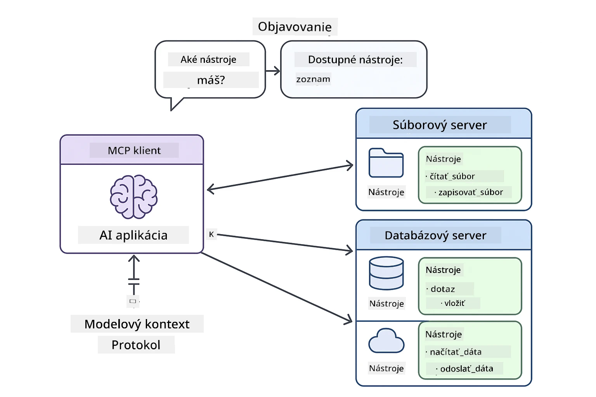
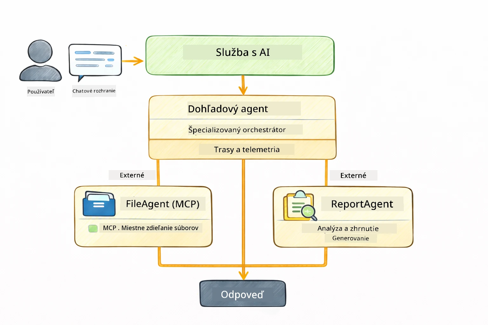

# Module 05: Protokol kontextu modelu (MCP)

## Obsah

- [Čo sa naučíte](../../../05-mcp)
- [Čo je MCP?](../../../05-mcp)
- [Ako MCP funguje](../../../05-mcp)
- [Agentický modul](../../../05-mcp)
- [Spustenie príkladov](../../../05-mcp)
  - [Požiadavky](../../../05-mcp)
- [Rýchly štart](../../../05-mcp)
  - [Operácie so súbormi (Stdio)](../../../05-mcp)
  - [Supervízny agent](../../../05-mcp)
    - [Pochopenie výstupu](../../../05-mcp)
    - [Stratégie odpovede](../../../05-mcp)
    - [Vysvetlenie funkcií agentického modulu](../../../05-mcp)
- [Kľúčové pojmy](../../../05-mcp)
- [Gratulujeme!](../../../05-mcp)
  - [Čo ďalej?](../../../05-mcp)

## Čo sa naučíte

Postavili ste konverzačné AI, ovládli ste promptovanie, zakotvili odpovede v dokumentoch a vytvorili agentov s nástrojmi. Ale všetky tie nástroje boli na mieru vytvorené pre vašu konkrétnu aplikáciu. Čo keby ste mohli vášmu AI poskytnúť prístup k štandardizovanému ekosystému nástrojov, ktoré môže ktokoľvek vytvoriť a zdieľať? V tomto module sa naučíte práve to pomocou Protokolu kontextu modelu (MCP) a agentického modulu LangChain4j. Najprv ukážeme jednoduchého MCP čítača súborov a potom, ako sa ľahko integruje do pokročilých agentických workflow použitím vzoru Supervízny agent.

## Čo je MCP?

Protokol kontextu modelu (MCP) poskytuje presne to – štandardný spôsob, ako AI aplikácie môžu objavovať a používať externé nástroje. Namiesto písania vlastných integrácií pre každý zdroj dát alebo službu sa pripojíte k MCP serverom, ktoré svoje schopnosti vystavujú v konzistentnom formáte. Váš AI agent môže tieto nástroje potom automaticky objavovať a používať.



*Pred MCP: Zložité bodové integrácie. Po MCP: Jeden protokol, nekonečné možnosti.*

MCP rieši základný problém vo vývoji AI: každá integrácia je na mieru. Chcete pristupovať ku GitHubu? Vlastný kód. Čítať súbory? Vlastný kód. Dotazovať databázu? Vlastný kód. A žiadna z týchto integrácií nefunguje s inými AI aplikáciami.

MCP to štandardizuje. MCP server vystavuje nástroje s jasnými popismi a schémami. Každý MCP klient sa môže pripojiť, objaviť dostupné nástroje a použiť ich. Postav raz, používej všade.



*Architektúra Protokolu kontextu modelu – štandardizované objavovanie a spúšťanie nástrojov*

## Ako MCP funguje

**Architektúra klient-server**

MCP používa model klient-server. Servery poskytujú nástroje – čítanie súborov, dotazovanie databáz, volanie API. Klienti (vaša AI aplikácia) sa pripájajú k serverom a používajú ich nástroje.

Pre použitie MCP s LangChain4j pridajte túto Maven závislosť:

```xml
<dependency>
    <groupId>dev.langchain4j</groupId>
    <artifactId>langchain4j-mcp</artifactId>
    <version>${langchain4j.version}</version>
</dependency>
```

**Objavovanie nástrojov**

Keď sa váš klient pripojí k MCP serveru, pýta sa: "Aké nástroje máte?" Server odpovie zoznamom dostupných nástrojov, každý s popismi a schémami parametrov. Váš AI agent sa potom rozhodne, ktoré nástroje použiť na základe požiadaviek používateľa.

**Prenosové mechanizmy**

MCP podporuje rôzne mechanizmy prenosu. Tento modul demonštruje Stdio prenos pre lokálne procesy:


*Prenosové mechanizmy MCP: HTTP pre vzdialené servery, Stdio pre lokálne procesy*

**Stdio** – [StdioTransportDemo.java](../../../05-mcp/src/main/java/com/example/langchain4j/mcp/StdioTransportDemo.java)

Pre lokálne procesy. Vaša aplikácia spustí server ako podproces a komunikuje cez štandardný vstup/výstup. Užitočné pre prístup k súborovému systému alebo príkazovým nástrojom.

```java
McpTransport stdioTransport = new StdioMcpTransport.Builder()
    .command(List.of(
        npmCmd, "exec",
        "@modelcontextprotocol/server-filesystem@2025.12.18",
        resourcesDir
    ))
    .logEvents(false)
    .build();
```

> **🤖 Vyskúšajte s [GitHub Copilot](https://github.com/features/copilot) Chat:** Otvorte [`StdioTransportDemo.java`](../../../05-mcp/src/main/java/com/example/langchain4j/mcp/StdioTransportDemo.java) a opýtajte sa:
> - "Ako funguje Stdio prenos a kedy ho použiť namiesto HTTP?"
> - "Ako LangChain4j spravuje životný cyklus spustených MCP serverových procesov?"
> - "Aké sú bezpečnostné dôsledky umožnenia AI prístupu k súborovému systému?"

## Agentický modul

Zatiaľ čo MCP poskytuje štandardizované nástroje, agentický modul LangChain4j ponúka deklaratívny spôsob, ako stavať agentov, ktorí tieto nástroje orchestrujú. Anotácia `@Agent` a `AgenticServices` vám umožňujú definovať správanie agenta cez rozhrania namiesto imperatívneho kódu.

V tomto module preskúmate vzor **Supervízny agent** — pokročilý agentický AI prístup, kde agent „supervízor“ dynamicky rozhoduje, ktorých sub-agentov zavolať na základe požiadaviek používateľa. Kombinujeme oba koncepty tým, že jednému z našich sub-agentov dáme MCP-powered prístup k súborom.

Pre použitie agentického modulu pridajte túto Maven závislosť:

```xml
<dependency>
    <groupId>dev.langchain4j</groupId>
    <artifactId>langchain4j-agentic</artifactId>
    <version>${langchain4j.mcp.version}</version>
</dependency>
```

> **⚠️ Experimentálne:** Modul `langchain4j-agentic` je **experimentálny** a môže sa meniť. Stabilným spôsobom tvorby AI asistentov zostáva `langchain4j-core` s vlastnými nástrojmi (Modul 04).

## Spustenie príkladov

### Požiadavky

- Java 21+, Maven 3.9+
- Node.js 16+ a npm (pre MCP servery)
- Konfigurované premenné prostredia v súbore `.env` (zo základného adresára):
  - `AZURE_OPENAI_ENDPOINT`, `AZURE_OPENAI_API_KEY`, `AZURE_OPENAI_DEPLOYMENT` (rovnako ako v moduloch 01-04)

> **Poznámka:** Ak ste si ešte nenastavili premenné prostredia, pozrite si [Modul 00 - Rýchly štart](../00-quick-start/README.md) pre inštrukcie, alebo skopírujte `.env.example` do `.env` v základnom adresári a vyplňte hodnoty.

## Rýchly štart

**Použitie VS Code:** Jednoducho kliknite pravým tlačidlom na ktorýkoľvek demo súbor v Prieskumníkovi a vyberte **"Spustiť Java"**, alebo použite launch konfigurácie z panela Spustiť a ladiť (predtým nezabudnite pridať token do súboru `.env`).

**Použitie Maven:** Alternatívne môžete spustiť z príkazovej riadky s príkladmi nižšie.

### Operácie so súbormi (Stdio)

Toto demonštruje nástroje založené na lokálnych podprocesoch.

**✅ Nie sú potrebné žiadne predpoklady** – MCP server sa spustí automaticky.

**Použitie štartovacích skriptov (odporúčané):**

Štartovacie skripty automaticky načítajú premenné prostredia zo základného `.env` súboru:

**Bash:**
```bash
cd 05-mcp
chmod +x start-stdio.sh
./start-stdio.sh
```

**PowerShell:**
```powershell
cd 05-mcp
.\start-stdio.ps1
```

**Použitie VS Code:** Kliknite pravým tlačidlom na `StdioTransportDemo.java` a vyberte **"Spustiť Java"** (uistite sa, že váš `.env` súbor je nakonfigurovaný).

Aplikácia automaticky spustí MCP server pre súborový systém a prečíta miestny súbor. Všimnite si, ako sa spravuje podproces za vás.

**Očakávaný výstup:**
```
Assistant response: The file provides an overview of LangChain4j, an open-source Java library
for integrating Large Language Models (LLMs) into Java applications...
```

### Supervízny agent

Vzor **Supervízny agent** je **flexibilná** forma agentického AI. Supervízor používa LLM, aby autonómne rozhodol, ktorých agentov zavolať na základe používateľovej požiadavky. V ďalšom príklade kombinujeme MCP-powered prístup k súborom s LLM agentom, aby sme vytvorili kontrolovaný workflow čítania súboru → tvorba správy.

V dema `FileAgent` číta súbor pomocou MCP nástrojov pre súborový systém a `ReportAgent` vygeneruje štruktúrovanú správu s výkonným zhrnutím (1 vetu), 3 kľúčovými bodmi a odporúčaniami. Supervízor tento proces automaticky orchestruje:



```
┌─────────────┐      ┌──────────────┐
│  FileAgent  │ ───▶ │ ReportAgent  │
│ (MCP tools) │      │  (pure LLM)  │
└─────────────┘      └──────────────┘
   outputKey:           outputKey:
  'fileContent'         'report'
```

Každý agent ukladá svoj výstup do **Agentic Scope** (zdieľaná pamäť), čo umožňuje ďalším agentom pristupovať k predchádzajúcim výsledkom. Toto demonštruje, ako sa MCP nástroje hladko integrujú do agentických workflow — Supervízor nemusí vedieť *ako* sa súbory čítajú, stačí mu vedieť, že `FileAgent` to vie.

#### Spustenie dema

Štartovacie skripty automaticky načítajú premenné prostredia zo základného `.env` súboru:

**Bash:**
```bash
cd 05-mcp
chmod +x start-supervisor.sh
./start-supervisor.sh
```

**PowerShell:**
```powershell
cd 05-mcp
.\start-supervisor.ps1
```

**Použitie VS Code:** Kliknite pravým tlačidlom na `SupervisorAgentDemo.java` a vyberte **"Spustiť Java"** (uistite sa, že váš `.env` súbor je nakonfigurovaný).

#### Ako Supervízor funguje

```java
// Krok 1: FileAgent číta súbory pomocou nástrojov MCP
FileAgent fileAgent = AgenticServices.agentBuilder(FileAgent.class)
        .chatModel(model)
        .toolProvider(mcpToolProvider)  // Má nástroje MCP pre operácie so súbormi
        .build();

// Krok 2: ReportAgent generuje štruktúrované správy
ReportAgent reportAgent = AgenticServices.agentBuilder(ReportAgent.class)
        .chatModel(model)
        .build();

// Supervisor riadi workflow súbor → správa
SupervisorAgent supervisor = AgenticServices.supervisorBuilder()
        .chatModel(model)
        .subAgents(fileAgent, reportAgent)
        .responseStrategy(SupervisorResponseStrategy.LAST)  // Vrátiť konečnú správu
        .build();

// Supervisor rozhoduje, ktorých agentov vyvolať na základe požiadavky
String response = supervisor.invoke("Read the file at /path/file.txt and generate a report");
```

#### Stratégie odpovede

Keď nakonfigurujete `SupervisorAgent`, určíte, ako by mal formulovať svoju konečnú odpoveď používateľovi po tom, čo sub-agent dokončia svoje úlohy. Dostupné stratégie sú:

| Stratégia | Popis |
|----------|-------------|
| **LAST** | Supervízor vráti výstup posledného sub-agenta alebo použitého nástroja. Je to užitočné, keď je posledný agent v workflwo špecificky navrhnutý na vytvorenie kompletného, finálneho výsledku (napr. „Agent zhrnutia“ v študijnom pipeline). |
| **SUMMARY** | Supervízor použije svoj vnútorný jazykový model (LLM) na syntézu zhrnutia celého interakcie a všetkých výstupov sub-agentov, potom vráti toto zhrnutie ako konečnú odpoveď. Poskytuje čistú, zjednotenú odpoveď pre používateľa. |
| **SCORED** | Systém použije vnútorný LLM na ohodnotenie ako poslednej odpovede (LAST), tak zhrnutia (SUMMARY) interakcie voči pôvodnej požiadavke používateľa a vráti výstup s vyšším skóre. |

Kompletnú implementáciu nájdete v [SupervisorAgentDemo.java](../../../05-mcp/src/main/java/com/example/langchain4j/mcp/SupervisorAgentDemo.java).

> **🤖 Vyskúšajte s [GitHub Copilot](https://github.com/features/copilot) Chat:** Otvorte [`SupervisorAgentDemo.java`](../../../05-mcp/src/main/java/com/example/langchain4j/mcp/SupervisorAgentDemo.java) a opýtajte sa:
> - "Ako Supervízor rozhoduje, ktorých agentov zavolať?"
> - "Aký je rozdiel medzi vzormi Supervízor a Sekvenčný workflow?"
> - "Ako môžem prispôsobiť plánovacie správanie Supervízora?"

#### Pochopenie výstupu

Pri spustení demá uvidíte štruktúrovaný prehľad, ako Supervízor orchestruje viacerých agentov. Tu je význam jednotlivých častí:

```
======================================================================
  FILE → REPORT WORKFLOW DEMO
======================================================================

This demo shows a clear 2-step workflow: read a file, then generate a report.
The Supervisor orchestrates the agents automatically based on the request.
```

**Hlavička** uvádza koncept workflow: zameraný pipeline od čítania súboru po generovanie správy.

```
--- WORKFLOW ---------------------------------------------------------
  ┌─────────────┐      ┌──────────────┐
  │  FileAgent  │ ───▶ │ ReportAgent  │
  │ (MCP tools) │      │  (pure LLM)  │
  └─────────────┘      └──────────────┘
   outputKey:           outputKey:
   'fileContent'        'report'

--- AVAILABLE AGENTS -------------------------------------------------
  [FILE]   FileAgent   - Reads files via MCP → stores in 'fileContent'
  [REPORT] ReportAgent - Generates structured report → stores in 'report'
```

**Diagram workflow** ukazuje tok dát medzi agentmi. Každý agent má špecifickú úlohu:
- **FileAgent** číta súbory pomocou MCP nástrojov a ukladá surový obsah do `fileContent`
- **ReportAgent** prijíma tento obsah a vytvára štruktúrovanú správu v `report`

```
--- USER REQUEST -----------------------------------------------------
  "Read the file at .../file.txt and generate a report on its contents"
```

**Používateľská požiadavka** ukazuje úlohu. Supervízor ju analyzuje a rozhodne zavolať FileAgent → ReportAgent.

```
--- SUPERVISOR ORCHESTRATION -----------------------------------------
  The Supervisor decides which agents to invoke and passes data between them...

  +-- STEP 1: Supervisor chose -> FileAgent (reading file via MCP)
  |
  |   Input: .../file.txt
  |
  |   Result: LangChain4j is an open-source, provider-agnostic Java framework for building LLM...
  +-- [OK] FileAgent (reading file via MCP) completed

  +-- STEP 2: Supervisor chose -> ReportAgent (generating structured report)
  |
  |   Input: LangChain4j is an open-source, provider-agnostic Java framew...
  |
  |   Result: Executive Summary...
  +-- [OK] ReportAgent (generating structured report) completed
```

**Orchestrace Supervízora** ukazuje dvojstupňový proces v akcii:
1. **FileAgent** číta súbor cez MCP a ukladá obsah
2. **ReportAgent** prijíma obsah a generuje štruktúrovanú správu

Supervízor tieto rozhodnutia prijal **autonómne** na základe požiadavky používateľa.

```
--- FINAL RESPONSE ---------------------------------------------------
Executive Summary
...

Key Points
...

Recommendations
...

--- AGENTIC SCOPE (Data Flow) ----------------------------------------
  Each agent stores its output for downstream agents to consume:
  * fileContent: LangChain4j is an open-source, provider-agnostic Java framework...
  * report: Executive Summary...
```

#### Vysvetlenie funkcií agentického modulu

Príklad demonštruje niekoľko pokročilých funkcií agentického modulu. Pozrime sa podrobnejšie na Agentic Scope a Agent Listeners.

**Agentic Scope** zobrazuje zdieľanú pamäť, kde agenti ukladali svoje výsledky pomocou `@Agent(outputKey="...")`. To umožňuje:
- Následným agentom pristupovať k výstupom predchádzajúcich agentov
- Supervízorovi syntetizovať konečnú odpoveď
- Vám prezrieť, čo každý agent vygeneroval

```java
ResultWithAgenticScope<String> result = supervisor.invokeWithAgenticScope(request);
AgenticScope scope = result.agenticScope();
String fileContent = scope.readState("fileContent");  // Nezpracované údaje súboru z FileAgent
String report = scope.readState("report");            // Štruktúrovaná správa z ReportAgent
```

**Agent Listeners** umožňujú monitorovanie a ladenie vykonávania agentov. Krokový výstup, ktorý vidíte v dema, pochádza z AgentListenera, ktorý sa pripája ku každej invokácii agenta:
- **beforeAgentInvocation** – Volané, keď Supervízor vyberie agenta, umožňuje vidieť, ktorý agent bol zvolený a prečo
- **afterAgentInvocation** – Volané po dokončení agenta, zobrazuje jeho výsledok
- **inheritedBySubagents** – Keď je pravda, listener monitoruje všetkých agentov v hierarchii

```java
AgentListener monitor = new AgentListener() {
    private int step = 0;
    
    @Override
    public void beforeAgentInvocation(AgentRequest request) {
        step++;
        System.out.println("  +-- STEP " + step + ": " + request.agentName());
    }
    
    @Override
    public void afterAgentInvocation(AgentResponse response) {
        System.out.println("  +-- [OK] " + response.agentName() + " completed");
    }
    
    @Override
    public boolean inheritedBySubagents() {
        return true; // Šíriť na všetkých podagentov
    }
};
```

Okrem vzoru Supervízor ponúka `langchain4j-agentic` modul niekoľko silných workflow vzorov a funkcií:

| Vzor | Popis | Prípad použitia |
|---------|-------------|----------|
| **Sekvenčný** | Spustite agentov postupne, výstup prúdi nasledujúcim | Pipeline: výskum → analýza → správa |
| **Paralelný** | Spustite agentov súčasne | Nezávislé úlohy: počasie + správy + akcie |
| **Smyčka** | Iterujte, kým sa nesplní podmienka | Kvalitné skórovanie: zlepšovať, kým skóre ≥ 0.8 |
| **Podmienený** | Preroute na základe podmienok | Klasifikovať → smerovať na špecialistu |
| **Človek v slučke** | Pridajte ľudské kontrolné body | Schvaľovacie workflowy, kontrola obsahu |

## Kľúčové pojmy

Teraz, keď ste preskúmali MCP a agentický modul v praxi, zhrňme si, kedy použiť ktorý prístup.

**MCP** je ideálny, keď chcete využiť existujúce ekosystémy nástrojov, budovať nástroje, ktoré môžu zdieľať viaceré aplikácie, integrovať služby tretích strán cez štandardné protokoly alebo meniť implementácie nástrojov bez zmeny kódu.

**Agentický modul** je najvhodnejší, keď chcete deklaratívne definície agentov cez anotácie `@Agent`, potrebujete orchestráciu workflowov (sekvenčné, slučka, paralelné), preferujete dizajn agentov cez rozhrania namiesto imperatívneho kódu, alebo kombinujete viac agentov, ktoré zdieľajú výsledky cez `outputKey`.

**Vzor Supervízny agent** vyniká, keď workflow nie je dopredu predvídateľný a chcete, aby LLM rozhodoval, keď máte viac špecializovaných agentov, ktorí potrebujú dynamickú orchestráciu, keď budujete konverzačné systémy s rôznymi schopnosťami alebo keď chcete najflexibilnejšie a najprispôsobiteľnejšie agentické správanie.
## Blahoželáme!

Dokončili ste kurz LangChain4j pre začiatočníkov. Naučili ste sa:

- Ako vytvárať konverzačné AI s pamäťou (Modul 01)
- Vzory promptového inžinierstva pre rôzne úlohy (Modul 02)
- Ako zakladať odpovede na vašich dokumentoch pomocou RAG (Modul 03)
- Vytváranie základných AI agentov (asistentov) s vlastnými nástrojmi (Modul 04)
- Integráciu štandardizovaných nástrojov s LangChain4j MCP a Agentic modulmi (Modul 05)

### Čo ďalej?

Po dokončení modulov preskúmajte [Príručku testovania](../docs/TESTING.md), kde uvidíte koncepty testovania LangChain4j v praxi.

**Oficiálne zdroje:**
- [Dokumentácia LangChain4j](https://docs.langchain4j.dev/) - Komplexné návody a API referencia
- [LangChain4j GitHub](https://github.com/langchain4j/langchain4j) - Zdrojový kód a príklady
- [LangChain4j Tutoriály](https://docs.langchain4j.dev/tutorials/) - Krok za krokom tutoriály pre rôzne prípady použitia

Ďakujeme, že ste dokončili tento kurz!

---

**Navigácia:** [← Predchádzajúci: Modul 04 - Nástroje](../04-tools/README.md) | [Späť na Hlavnú stránku](../README.md)

---

<!-- CO-OP TRANSLATOR DISCLAIMER START -->
**Vyhlásenie o zodpovednosti**:  
Tento dokument bol preložený pomocou služby prekladov umelou inteligenciou [Co-op Translator](https://github.com/Azure/co-op-translator). Hoci sa snažíme o presnosť, vezmite, prosím, na vedomie, že automatické preklady môžu obsahovať chyby alebo nepresnosti. Originálny dokument v jeho pôvodnom jazyku by mal byť považovaný za autoritatívny zdroj. Pre kritické informácie sa odporúča profesionálny ľudský preklad. Nezodpovedáme za akékoľvek nedorozumenia alebo nesprávne výklady vzniknuté použitím tohto prekladu.
<!-- CO-OP TRANSLATOR DISCLAIMER END -->