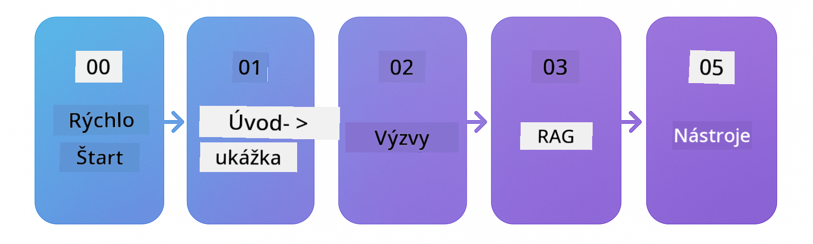

<!--
CO_OP_TRANSLATOR_METADATA:
{
  "original_hash": "d1499d1abf7e653e94fde35644629500",
  "translation_date": "2025-12-18T10:16:03+00:00",
  "source_file": "README.md",
  "language_code": "sk"
}
-->


### 🌐 Podpora viacerých jazykov

#### Podporované cez GitHub Action (automatizované a vždy aktuálne)

<!-- CO-OP TRANSLATOR LANGUAGES TABLE START -->
[Arabic](../ar/README.md) | [Bengali](../bn/README.md) | [Bulgarian](../bg/README.md) | [Burmese (Myanmar)](../my/README.md) | [Chinese (Simplified)](../zh/README.md) | [Chinese (Traditional, Hong Kong)](../hk/README.md) | [Chinese (Traditional, Macau)](../mo/README.md) | [Chinese (Traditional, Taiwan)](../tw/README.md) | [Croatian](../hr/README.md) | [Czech](../cs/README.md) | [Danish](../da/README.md) | [Dutch](../nl/README.md) | [Estonian](../et/README.md) | [Finnish](../fi/README.md) | [French](../fr/README.md) | [German](../de/README.md) | [Greek](../el/README.md) | [Hebrew](../he/README.md) | [Hindi](../hi/README.md) | [Hungarian](../hu/README.md) | [Indonesian](../id/README.md) | [Italian](../it/README.md) | [Japanese](../ja/README.md) | [Kannada](../kn/README.md) | [Korean](../ko/README.md) | [Lithuanian](../lt/README.md) | [Malay](../ms/README.md) | [Malayalam](../ml/README.md) | [Marathi](../mr/README.md) | [Nepali](../ne/README.md) | [Nigerian Pidgin](../pcm/README.md) | [Norwegian](../no/README.md) | [Persian (Farsi)](../fa/README.md) | [Polish](../pl/README.md) | [Portuguese (Brazil)](../br/README.md) | [Portuguese (Portugal)](../pt/README.md) | [Punjabi (Gurmukhi)](../pa/README.md) | [Romanian](../ro/README.md) | [Russian](../ru/README.md) | [Serbian (Cyrillic)](../sr/README.md) | [Slovak](./README.md) | [Slovenian](../sl/README.md) | [Spanish](../es/README.md) | [Swahili](../sw/README.md) | [Swedish](../sv/README.md) | [Tagalog (Filipino)](../tl/README.md) | [Tamil](../ta/README.md) | [Telugu](../te/README.md) | [Thai](../th/README.md) | [Turkish](../tr/README.md) | [Ukrainian](../uk/README.md) | [Urdu](../ur/README.md) | [Vietnamese](../vi/README.md)
<!-- CO-OP TRANSLATOR LANGUAGES TABLE END -->

# LangChain4j pre začiatočníkov

Kurz na tvorbu AI aplikácií s LangChain4j a Azure OpenAI GPT-5, od základného chatu po AI agentov.

**Nový v LangChain4j?** Pozrite si [Glosár](docs/GLOSSARY.md) pre definície kľúčových pojmov a konceptov.

## Obsah

1. [Rýchly štart](00-quick-start/README.md) - Začnite s LangChain4j
2. [Úvod](01-introduction/README.md) - Naučte sa základy LangChain4j
3. [Tvorba promptov](02-prompt-engineering/README.md) - Ovládnite efektívny návrh promptov
4. [RAG (Retrieval-Augmented Generation)](03-rag/README.md) - Vytvorte inteligentné systémy založené na znalostiach
5. [Nástroje](04-tools/README.md) - Integrujte externé nástroje a API s AI agentmi
6. [MCP (Model Context Protocol)](05-mcp/README.md) - Pracujte s Model Context Protocol
---

## Učebná cesta

> **Rýchly štart**

1. Vytvorte fork tohto repozitára na svoj GitHub účet
2. Kliknite na **Code** → záložka **Codespaces** → **...** → **New with options...**
3. Použite predvolené nastavenia – vyberie sa vývojové prostredie vytvorené pre tento kurz
4. Kliknite na **Create codespace**
5. Počkajte 5-10 minút, kým bude prostredie pripravené
6. Prejdite priamo na [Rýchly štart](./00-quick-start/README.md) a začnite!

> **Radšej klonovať lokálne?**
>
> Tento repozitár obsahuje viac ako 50 jazykových prekladov, čo výrazne zväčšuje veľkosť sťahovania. Ak chcete klonovať bez prekladov, použite sparse checkout:
> ```bash
> git clone --filter=blob:none --sparse https://github.com/microsoft/LangChain4j-for-Beginners.git
> cd LangChain4j-for-Beginners
> git sparse-checkout set --no-cone '/*' '!translations' '!translated_images'
> ```
> Toto vám poskytne všetko potrebné na dokončenie kurzu s oveľa rýchlejším sťahovaním.

Začnite modulom [Rýchly štart](00-quick-start/README.md) a postupujte cez jednotlivé moduly krok za krokom, aby ste si vybudovali zručnosti. Vyskúšate si základné príklady na pochopenie základov predtým, než prejdete do modulu [Úvod](01-introduction/README.md) pre hlbší ponor s GPT-5.



Po dokončení modulov preskúmajte [Testovací sprievodca](docs/TESTING.md), aby ste videli koncepty testovania LangChain4j v praxi.

> **Poznámka:** Tento tréning používa modely GitHub aj Azure OpenAI. Moduly [Rýchly štart](00-quick-start/README.md) a [MCP](05-mcp/README.md) používajú modely GitHub (nie je potrebné predplatné Azure), zatiaľ čo moduly 1-4 používajú Azure OpenAI GPT-5.


## Učenie s GitHub Copilot

Ak chcete rýchlo začať kódovať, otvorte tento projekt v GitHub Codespace alebo vo svojom lokálnom IDE s poskytnutým devcontainerom. Devcontainer použitý v tomto kurze je predkonfigurovaný s GitHub Copilot pre AI párované programovanie.

Každý príklad kódu obsahuje navrhované otázky, ktoré môžete položiť GitHub Copilot, aby ste prehĺbili svoje porozumenie. Hľadajte výzvy 💡/🤖 v:

- **Hlavičkách Java súborov** - Otázky špecifické pre každý príklad
- **README modulov** - Výzvy na skúmanie po príkladoch kódu

**Ako používať:** Otvorte akýkoľvek súbor s kódom a položte Copilotovi navrhované otázky. Má plný kontext kódu a môže vysvetľovať, rozširovať a navrhovať alternatívy.

Chcete sa dozvedieť viac? Pozrite si [Copilot pre AI párované programovanie](https://aka.ms/GitHubCopilotAI).


## Ďalšie zdroje

<!-- CO-OP TRANSLATOR OTHER COURSES START -->
### LangChain
[](https://aka.ms/langchain4j-for-beginners)
[](https://aka.ms/langchainjs-for-beginners?WT.mc_id=m365-94501-dwahlin)

---

### Azure / Edge / MCP / Agentov
[](https://github.com/microsoft/AZD-for-beginners?WT.mc_id=academic-105485-koreyst)
[](https://github.com/microsoft/edgeai-for-beginners?WT.mc_id=academic-105485-koreyst)
[](https://github.com/microsoft/mcp-for-beginners?WT.mc_id=academic-105485-koreyst)
[](https://github.com/microsoft/ai-agents-for-beginners?WT.mc_id=academic-105485-koreyst)

---
 
### Séria Generatívnej AI
[](https://github.com/microsoft/generative-ai-for-beginners?WT.mc_id=academic-105485-koreyst)
[-9333EA?style=for-the-badge&labelColor=E5E7EB&color=9333EA)](https://github.com/microsoft/Generative-AI-for-beginners-dotnet?WT.mc_id=academic-105485-koreyst)
[-C084FC?style=for-the-badge&labelColor=E5E7EB&color=C084FC)](https://github.com/microsoft/generative-ai-for-beginners-java?WT.mc_id=academic-105485-koreyst)
[-E879F9?style=for-the-badge&labelColor=E5E7EB&color=E879F9)](https://github.com/microsoft/generative-ai-with-javascript?WT.mc_id=academic-105485-koreyst)

---
 
### Základné učenie
[](https://aka.ms/ml-beginners?WT.mc_id=academic-105485-koreyst)
[](https://aka.ms/datascience-beginners?WT.mc_id=academic-105485-koreyst)
[](https://aka.ms/ai-beginners?WT.mc_id=academic-105485-koreyst)
[](https://github.com/microsoft/Security-101?WT.mc_id=academic-96948-sayoung)
[](https://aka.ms/webdev-beginners?WT.mc_id=academic-105485-koreyst)
[](https://aka.ms/iot-beginners?WT.mc_id=academic-105485-koreyst)
[](https://github.com/microsoft/xr-development-for-beginners?WT.mc_id=academic-105485-koreyst)

---
 
### Séria Copilot
[](https://aka.ms/GitHubCopilotAI?WT.mc_id=academic-105485-koreyst)
[](https://github.com/microsoft/mastering-github-copilot-for-dotnet-csharp-developers?WT.mc_id=academic-105485-koreyst)
[](https://github.com/microsoft/CopilotAdventures?WT.mc_id=academic-105485-koreyst)
<!-- CO-OP TRANSLATOR OTHER COURSES END -->

## Získanie pomoci

Ak sa zaseknete alebo máte otázky o tvorbe AI aplikácií, pripojte sa:

[](https://aka.ms/foundry/discord)

Ak máte spätnú väzbu k produktu alebo chyby počas tvorby, navštívte:

[](https://aka.ms/foundry/forum)

## Licencia

MIT licencia - Podrobnosti nájdete v súbore [LICENSE](../../LICENSE).

---

<!-- CO-OP TRANSLATOR DISCLAIMER START -->
**Zrieknutie sa zodpovednosti**:
Tento dokument bol preložený pomocou AI prekladateľskej služby [Co-op Translator](https://github.com/Azure/co-op-translator). Aj keď sa snažíme o presnosť, majte prosím na pamäti, že automatizované preklady môžu obsahovať chyby alebo nepresnosti. Pôvodný dokument v jeho rodnom jazyku by mal byť považovaný za autoritatívny zdroj. Pre kritické informácie sa odporúča profesionálny ľudský preklad. Nie sme zodpovední za akékoľvek nedorozumenia alebo nesprávne interpretácie vyplývajúce z použitia tohto prekladu.
<!-- CO-OP TRANSLATOR DISCLAIMER END -->